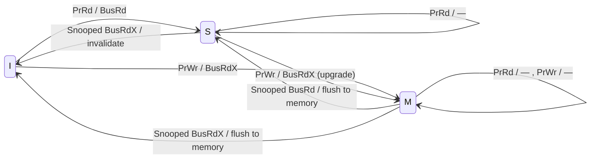
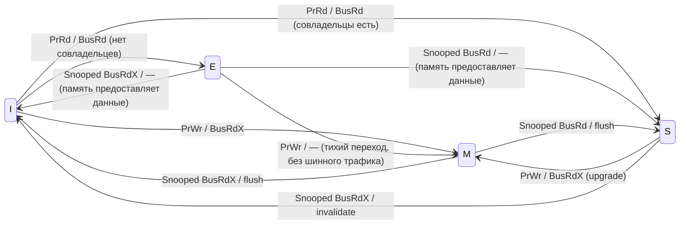
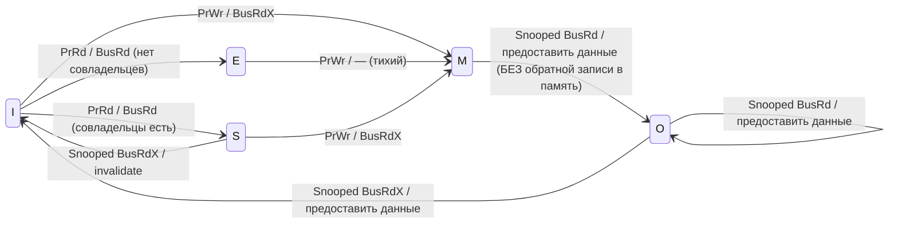

# Приложение I.1 — Основы когерентности кэшей

**Предварительные знания:** Базовое понимание устройства кэша (наборы, пути ассоциативности, теги,
массивы данных), концепций иерархии памяти и основ архитектуры RISC-V.

**Цель:** Дать самодостаточное введение в когерентность кэшей и консистентность памяти
для читателей, которые понимают устройство кэшей, но не изучали протоколы когерентности
многоядерных систем. К концу этого приложения читатель сможет отличать когерентность от
консистентности, анализировать автоматы состояний когерентности, понимать компромиссы
между подходами на основе прослушивания (snooping) и каталогов (directory), а также
увидеть, как модель памяти RVWMO определяет конвейер и интерконнект XiangShan.
Этот материал готовит читателя к детальному разбору протокола TileLink в Приложении I.2.

---

## 1. Проблема когерентности кэшей

### 1.1 Почему кэши порождают несогласованность

Современные процессоры используют приватные кэши, чтобы преодолеть разрыв в латентности
между быстрыми ядрами и медленной основной памятью. Одноядерная система с единственным
кэшем никогда не сталкивается с проблемой несогласованности: каждая загрузка и каждая
запись проходят через один и тот же кэш, который выступает единственным посредником между
процессором и памятью. Но стоит добавить второе ядро — каждое со своим приватным L1-кэшем
данных — и картина меняется принципиально.

Рассмотрим двухъядерную систему, в которой ядро 0 и ядро 1 разделяют общее физическое
адресное пространство:

```
   Ядро 0               Ядро 1
  ┌───────┐            ┌───────┐
  │  CPU  │            │  CPU  │
  └───┬───┘            └───┬───┘
      │                    │
  ┌───┴───┐            ┌───┴───┐
  │ L1 D$ │            │ L1 D$ │
  └───┬───┘            └───┬───┘
      │                    │
      └─────────┬──────────┘
                │
           ┌────┴─────┐
           │Общий  L2 │
           └────┬─────┘
                │
           ┌────┴─────┐
           │  Память   │
           └──────────┘
```

Когда ядро 0 записывает значение по адресу X, новые данные существуют только в его
L1-кэше. L1-кэш ядра 1, который тоже может хранить копию X с момента предыдущего чтения,
по-прежнему содержит старое значение. Без какого-либо механизма поддержания согласованности
этих копий ядро 1 прочитает устаревшие данные.

Это и есть **проблема когерентности кэшей**: несколько кэшированных копий одной и той же
ячейки памяти могут стать несогласованными, когда один из кэшей модифицирует свою копию.

### 1.2 Пример: чтение устаревших данных из приватного L1-кэша

Разберём конкретный сценарий из четырёх шагов:

| Шаг | Действие ядра 0 | L1 ядра 0 | L1 ядра 1 | Память |
|:----:|:---|:---:|:---:|:---:|
| 0 | — | — | — | X = 0 |
| 1 | Ядро 0 читает X | X = 0 | — | X = 0 |
| 2 | Ядро 1 читает X | X = 0 | X = 0 | X = 0 |
| 3 | Ядро 0 записывает X = 42 | **X = 42** | X = 0 | X = 0 |
| 4 | Ядро 1 читает X | X = 42 | **X = 0 (устаревшее!)** | X = 0 |

На шаге 4 ядро 1 читает X и видит значение 0 — значение, существовавшее *до* записи
ядра 0. Это некорректно: программист вправе ожидать, что запись в разделяемую память
рано или поздно станет видимой всем ядрам.

Два дополнительных сценария иллюстрируют серьёзность проблемы:

**Флаг «производитель — потребитель».** Поток 0 устанавливает `flag = 1`, сигнализируя
о готовности данных. Поток 1 крутится в цикле `while (flag == 0)`. Без когерентности
поток 1 может никогда не увидеть обновление и застрять в бесконечном ожидании.

**Потерянное обновление.** Ядро 0 и ядро 1 оба читают общий счётчик (значение 5), каждое
инкрементирует его до 6 и записывает обратно 6. Один инкремент бесследно теряется;
счётчик оказывается равен 6 вместо 7.

### 1.3 Два требования к корректности

Чтобы многопроцессорная система с разделяемой памятью корректно исполняла программы,
подсистема памяти должна обеспечивать две гарантии:

1. **Распространение записей** (eventual visibility): значение, записанное по любому
   адресу любым ядром, рано или поздно становится видимым всем ядрам.
2. **Сериализация записей** (coherence order): все ядра наблюдают записи по одному и тому
   же адресу в одном и том же полном порядке.

Распространение записей предотвращает чтение устаревших данных. Сериализация записей
(часто называемая порядком когерентности по адресу; в терминологии языковых моделей памяти
используется также термин «порядок модификаций» — modification order) предотвращает
противоречивые наблюдения: если ядро A видит, что запись W1 произошла раньше записи W2,
то ядро B должно видеть тот же порядок.

### 1.4 Когерентность и консистентность

Эти два термина часто путают. Они связаны, но представляют собой различные концепции
с разной областью действия:

| Концепция | Область | Что определяет |
|:---|:---|:---|
| **Когерентность** | Один адрес памяти | Порядок чтений и записей по *одному* адресу |
| **Консистентность** | Все операции с памятью | Какие порядки загрузок/записей и их результаты допустимы (особенно для *разных* адресов) |

**Когерентность** отвечает на вопрос: «Для одного адреса X — согласны ли все ядра
относительно единого порядка записей, и согласованы ли чтения X с этим порядком?» Она
гарантирует полный порядок записей по каждому адресу (coherence order), видимый всем
наблюдателям.

**Консистентность** (модель памяти) отвечает на вопрос: «Если ядро 0 записывает X, а
затем записывает Y, а ядро 1 читает Y, а затем X — какие результаты допустимы?» Она
определяет разрешённые переупорядочения и видимость загрузок и записей в рамках всей
программы.

#### Пример: почему одной когерентности недостаточно

Рассмотрим классический сценарий «производитель — потребитель» с двумя переменными:
`data` (начальное значение 0) и `flag` (начальное значение 0).

**Ядро 0 (Производитель)**
```c
data = 42;    // A: Записать данные
flag = 1;     // B: Просигналить о готовности
```

**Ядро 1 (Потребитель)**
```c
while (flag == 0); // C: Ждать готовности
print(data);       // D: Прочитать данные
```

Даже если система **идеально когерентна** (ядро 1 рано или поздно увидит и `flag = 1`,
и `data = 42`), программа всё равно может сбоить и напечатать `0`. Почему? Потому что
ослабленная модель консистентности может позволить ядру 1 увидеть запись B (`flag = 1`)
*раньше* записи A (`data = 42`). Когерентность гарантирует упорядочение лишь в рамках
одного адреса: все ядра согласны относительно порядка записей в `flag` и, отдельно,
относительно порядка записей в `data`. Но она не ограничивает порядок между *разными*
адресами.

Система может быть когерентной (все кэши согласны относительно порядка по каждому адресу)
и при этом иметь ослабленную модель консистентности, допускающую переупорядочение
операций к разным адресам. Модель RVWMO (RISC-V Weak Memory Ordering) — это именно такой
дизайн: протокол когерентности обеспечивает корректность по каждому адресу, а инструкции
`fence` и атомарные операции с битами `.aq`/`.rl` обеспечивают межадресное упорядочение
там, где это нужно программисту.

Оставшаяся часть этого приложения сфокусирована преимущественно на **когерентности** —
механизме упорядочения по отдельным адресам. Но прежде, в разделе 2, мы детально
рассмотрим консистентность, поскольку модель памяти глубочайшим образом определяет
аппаратуру когерентности, конвейер и межсоединения на кристалле.

### 1.5 Формальное определение когерентности

Стандартная формализация опирается на два инварианта:

**Инвариант «единственный писатель / множество читателей» (SWMR):**
В любой логический момент времени для любого блока кэша выполняется одно из двух:
- Ровно одно ядро имеет право на чтение и запись («единственный писатель»), **или**
- Ноль или более ядер имеют право только на чтение («множество читателей»).

Ни одно ядро не может обладать правом на запись, пока другое ядро имеет *любое*
разрешение на тот же блок.

**Инвариант значения данных:**
Значение блока памяти в начале любой эпохи «только чтение» или «чтение-запись» равно
значению в конце последней эпохи «чтение-запись» для этого блока. Проще говоря: когда
ядро получает доступ к блоку, оно должно получить последнее записанное значение.

Вместе SWMR и инвариант значения данных гарантируют когерентность. Любой протокол
когерентности — будь то на основе шинного прослушивания или каталогов — является
распределённым механизмом обеспечения этих двух инвариантов.

> **Проектный компромисс: почему бы просто не использовать один общий кэш?**
>
> Если приватные кэши порождают проблему когерентности, почему бы не обойтись одним
> общим кэшем? Ответ — латентность и пропускная способность. Общий L1-кэш
> сериализовал бы все загрузки и записи со всех ядер через одну структуру, создавая
> узкое место по пропускной способности и уничтожая преимущества малой латентности
> приватных кэшей. На практике приватные L1-кэши обеспечивают доступ за 1–4 такта;
> общая структура, доступная всем ядрам, потребовала бы 10+ тактов из-за арбитража и
> физического расстояния. Протокол когерентности — это инженерная цена, которую мы
> платим за производительность приватных кэшей при сохранении иллюзии разделяемой памяти.

---

## 2. Консистентность памяти и её влияние на проектирование аппаратуры

### 2.1 Почему модель памяти важна для разработчика аппаратуры

Модель консистентности памяти — это контракт между аппаратурой и программистом. Он
определяет, какие переупорядочения загрузок и записей по *разным* адресам допустимы —
то есть какие перестановки аппаратуре *разрешено* выполнять и на какие ограничения
программист *может рассчитывать*. Каждая микроархитектурная оптимизация, которая смещает,
задерживает или перекрывает операции с памятью, обязана соблюдать этот контракт.

Модель консистентности напрямую определяет конкретные аппаратные решения:

| Аппаратная структура | Ограничение от модели консистентности |
|:---|:---|
| Буфер записи (store buffer) | Может ли загрузка обойти более старую запись по другому адресу? |
| Очередь загрузок (load queue) | Должны ли загрузки по разным адресам завершаться в программном порядке? |
| Очередь промахов (miss queue) | Можно ли объединять или переупорядочивать обратные записи по одному адресу? |
| Логика барьеров (fence logic) | Какие операции должны завершиться до окончания барьера? |
| Блок атомарных операций (atomic unit) | Когда буфер записи должен быть опустошён относительно AMO? |

**Сильная** модель (Sequential Consistency, TSO) запрещает большинство переупорядочений —
аппаратура вынуждена чаще приостанавливать конвейер и агрессивнее опустошать буферы.
**Слабая** модель (RVWMO, ARM) по умолчанию позволяет аппаратуре свободно перекрывать и
переупорядочивать операции, но требует явных инструкций `fence` или аннотаций
acquire/release для восстановления порядка, когда это нужно программисту.

### 2.2 Спектр моделей консистентности

**Последовательная консистентность (Sequential Consistency, SC)** — определение Лэмпорта
1979 года: результат любого исполнения совпадает с результатом некоторого последовательного
исполнения операций всех ядер, причём операции каждого отдельного ядра появляются в этой
последовательности в порядке, заданном его программой. При SC загрузки и записи со всех
ядер чередуются в глобальном полном порядке, уважающем программный порядок каждого ядра.
Никакие переупорядочения не допускаются.

SC — наиболее простая для понимания модель, но она жёстко ограничивает аппаратуру. Запись
должна стать глобально видимой, прежде чем следующая загрузка того же ядра сможет
выполниться — это фактически сериализует все операции с памятью и запрещает буферизацию
записей.

**Полный порядок записей (Total Store Order, TSO)** — используется в x86 и SPARC. TSO
ослабляет SC одним конкретным способом: загрузка может выполниться раньше, чем более
старая запись того же ядра станет глобально видимой, *при условии* что загрузка обращается
к другому адресу. Иными словами, буферу записи разрешено задерживать записи, пока
последующие загрузки продвигаются. Название «полный порядок записей» отражает ограничение:
все ядра по-прежнему наблюдают записи в едином глобальном порядке.

При TSO путь пересылки из буфера записи позволяет ядру немедленно видеть собственную
запись (по тому же адресу), но загрузки от других ядер не видят запись до тех пор, пока
она не покинет буфер. Это единственное ослабление разблокирует буферизацию записей —
наиболее критичную для производительности оптимизацию в современных процессорах — сохраняя
при этом модель достаточно сильной, чтобы большинство алгоритмов без блокировок работало
без явных барьеров.

**Слабое упорядочение памяти RISC-V (RVWMO)** — модель консистентности, определённая
спецификацией RISC-V. RVWMO по умолчанию допускает все четыре категории переупорядочений:

| Тип переупорядочения | SC | TSO | RVWMO |
|:---|:---|:---|:---|
| Store → Load (младшая загрузка обходит старшую запись) | Нет | **Да** | **Да** |
| Load → Load (переупорядочение независимых загрузок) | Нет | Нет | **Да** |
| Load → Store (переупорядочение загрузки перед более старой записью) | Нет | Нет | **Да** |
| Store → Store (переупорядочение независимых записей) | Нет | Нет | **Да** |

Эта максимальная свобода даёт проектировщикам аппаратуры широчайшее пространство для
перекрытия, конвейеризации и переупорядочения операций. Цена переносится на программное
обеспечение: программист обязан вставлять инструкции `fence` или использовать аннотации
`.aq`/`.rl` на атомарных операциях всякий раз, когда требуется межадресное упорядочение.

### 2.3 Как RVWMO определяет конвейер XiangShan

XiangShan реализует RVWMO — не TSO, не SC. Этот выбор пронизывает проектирование очереди
загрузок, очереди записей, логики барьеров и пути исполнения атомарных операций.

**Очередь записей и упорядоченная выгрузка.**
Очередь записей хранит все находящиеся в полёте записи в программном порядке. Запись
становится кандидатом на выгрузку (drain) в буфер записи (sbuffer) только после того, как ROB
зафиксирует её — см.
[StoreQueue.scala:1136](src/main/scala/xiangshan/mem/lsqueue/StoreQueue.scala#L1136),
где `committed(ptr)` устанавливается при завершении записи в ROB. Дисциплина
«зафиксировал — затем выгрузил» обеспечивает видимость записей для других ядер в
программном порядке, удовлетворяя правило RVWMO об упорядочении записей по одному адресу
и предотвращая утечку спекулятивных записей за пределы ядра. Очередь промахов dcache
явно запрещает объединение двух записей в один невыполненный запрос по той же причине —
см. комментарий в
[MissQueue.scala:188](src/main/scala/xiangshan/cache/dcache/mainpipe/MissQueue.scala#L188):
*«store merge to a store is disabled … as store to same address should preserve their program
order to match memory model.»*

**Пересылка из записи в загрузку (store-to-load forwarding).**
Младшая загрузка опрашивает очередь записей на предмет совпадающих более старых записей,
используя приоритетно-кодированную маску, которая ограничивает пересылку логически более
старыми записями — см.
[StoreQueue.scala:674](src/main/scala/xiangshan/mem/lsqueue/StoreQueue.scala#L674).
Этот путь пересылки требуется правилом RVWMO «по одному адресу»: загрузка обязана видеть
последнюю запись по тому же адресу от того же харта, даже если эта запись ещё не выгружена
из sbuffer в кэш.

**Спекулятивное исполнение загрузок и восстановление при нарушениях.**
Поскольку RVWMO допускает переупорядочение загрузок, XiangShan агрессивно выдаёт загрузки
с нарушением порядка относительно более старых записей, адреса которых ещё не вычислены.
Две аппаратные структуры обнаруживают нарушения, когда такая спекуляция оказывается
некорректной:

- `LoadQueueRAW` (нарушение «запись → загрузка»): когда запись вычисляет свой адрес,
  выполняется ассоциативный поиск (CAM) по очереди загрузок для выявления младших загрузок,
  обратившихся к той же кэш-линии — см.
  [LoadQueueRAW.scala:296](src/main/scala/xiangshan/mem/lsqueue/LoadQueueRAW.scala#L296).
  Совпадение вызывает сброс конвейера и повторную выборку начиная с PC нарушившей загрузки.
- `LoadQueueRAR` (нарушение «загрузка → загрузка»): если протокол когерентности отзывает
  кэш-линию (через Probe на Channel B) между двумя загрузками по одному адресу, флаг
  `released` помечает более старую загрузку — см.
  [LoadQueueRAR.scala:111](src/main/scala/xiangshan/mem/lsqueue/LoadQueueRAR.scala#L111).
  Последующая загрузка, обнаруживающая помеченную более старую запись, инициирует повторную
  выборку, гарантируя, что обе загрузки наблюдают согласованный порядок когерентности.

Эти детекторы нарушений — прямое следствие слабой модели: при TSO переупорядочение
загрузок запрещено, и `LoadQueueRAR` не понадобился бы. При SC запрещено даже обхождение
записи загрузкой, и ни одна из этих структур не была бы нужна — но не было бы и
буферизации записей, и производительность пострадала бы катастрофически.

**Предсказание зависимостей по памяти (Store Sets).**
Частые сбросы конвейера из-за нарушений обходятся дорого. XiangShan смягчает их с помощью
предсказателя Store Set (SSIT/LFST) — см.
[StoreSet.scala:246](src/main/scala/xiangshan/mem/mdp/StoreSet.scala#L246).
После нарушения «запись → загрузка» предсказатель связывает PC нарушившей загрузки и PC
записи в один «store set», заставляя будущие диспетчеризации задерживать загрузку до
момента выдачи записи. Этот адаптивный механизм превращает реактивные сбросы в
проактивное планирование, восстанавливая большую часть производительности, потерянной
из-за неверной спекуляции.

### 2.4 Инструкции барьеров: восстановление порядка при RVWMO

Поскольку RVWMO по умолчанию допускает все переупорядочения, ISA предоставляет инструкции
`fence`, которые избирательно запрещают определённые категории. Каждый барьер задаёт
множества предшественников и последователей из `{r, w, i, o}` (чтение, запись, ввод,
вывод):

| Инструкция | Предшественники | Последователи | Эффект |
|:---|:---|:---|:---|
| `fence rw, rw` | все загрузки/записи | все загрузки/записи | Полный барьер — все предшествующие операции завершаются до любых последующих |
| `fence w, w` | записи | записи | Барьер записей — предшествующие записи видимы до последующих |
| `fence r, r` | загрузки | загрузки | Барьер чтений — предшествующие загрузки завершены до последующих |
| `fence.tso` | загрузки+записи | загрузки; записи | TSO-барьер — предшествующие операции до последующих загрузок; предшествующие записи до последующих записей |
| `fence.i` | записи | выборка инструкций | Синхронизация I-кэша — обеспечивает видимость предшествующих записей для выборки инструкций |

XiangShan реализует барьеры через комбинацию атрибутов на стадии декодирования и
выделенного автомата состояний (FSM). При декодировании каждый вариант `fence` несёт
атрибуты `blockBack = T` и `flushPipe = T` — см.
[DecodeUnit.scala:249](src/main/scala/xiangshan/backend/decode/DecodeUnit.scala#L249).
Атрибут `blockBack` приостанавливает диспетчеризацию всех последующих инструкций из ROB
до фиксации барьера; `flushPipe` инициирует сброс конвейера при фиксации, чтобы ни одна
младшая инструкция не могла наблюдать состояние до барьера.

Исполнительный блок барьеров содержит простой автомат, который ожидает опустошения буфера
записи перед завершением — см.
[Fence.scala:65](src/main/scala/xiangshan/backend/fu/Fence.scala#L65),
где сигнал `sbuffer` активен, пока автомат находится в состоянии `s_wait`, запрашивая
выгрузку sbuffer, и автомат продвигается только при истинности `sbEmpty` (строка 78). Эта
выгрузка гарантирует, что все записи, предшествующие барьеру, достигли иерархии кэшей,
прежде чем любая последующая операция с памятью сможет выполниться.

### 2.5 Атомарные операции: семантика acquire и release

Атомарные инструкции RISC-V (`lr`/`sc`, `amoadd`, `amoswap` и др.) несут необязательные
биты `.aq` (acquire) и `.rl` (release), которые накладывают упорядочение без полного
барьера:

- `.aq` (acquire): ни одна последующая операция с памятью данного харта не может быть
  переупорядочена раньше этой инструкции. Эквивалент однонаправленного барьера *после*
  атомарной операции.
- `.rl` (release): ни одна предшествующая операция с памятью данного харта не может быть
  переупорядочена позже этой инструкции. Эквивалент однонаправленного барьера *перед*
  атомарной операцией.
- `.aqrl` (оба): атомарная операция является полной точкой упорядочения — «последовательно
  консистентной» атомарной операцией.

XiangShan обеспечивает эти гарантии упорядочения структурно, а не через отдельные
аппаратные биты `.aq`/`.rl`. Каждая инструкция AMO и LR/SC декодируется с атрибутами
`noSpec = T` и `blockBack = T` — см.
[DecodeUnit.scala:258](src/main/scala/xiangshan/backend/decode/DecodeUnit.scala#L258).
Атрибут `noSpec` запрещает спекулятивную выдачу за пределами ветвления; `blockBack`
приостанавливает все последующие инструкции до завершения атомарной операции. Перед тем
как атомарная операция обратится к кэшу, автомат `AtomicsUnit` опустошает буфер записи —
см.
[AtomicsUnit.scala:497](src/main/scala/xiangshan/mem/pipeline/AtomicsUnit.scala#L497),
где `io.flush_sbuffer.valid` активен до тех пор, пока `sbuffer_empty` не станет истинным.

Этот консервативный подход — опустошить буфер записи, выполнить атомарную операцию,
приостановить конвейер — одновременно удовлетворяет семантику и `.aq`, и `.rl` для каждой
атомарной операции, независимо от того, какие биты реально установлены. Он жертвует
некоторой производительностью (излишние приостановки, когда установлен только `.rl` или
ни один бит) ради простоты реализации.

> **Проектный компромисс: консервативный подход против точечного acquire/release**
>
> XiangShan обращается с каждой AMO так, будто она несёт оба бита `.aq` и `.rl`,
> безусловно опустошая буфер записи и блокируя конвейер. Альтернативный дизайн
> декодировал бы биты `.aq` и `.rl` раздельно, обеспечивая только необходимое
> упорядочение: при одном `.rl` — опустошить буфер записи, но позволить последующим
> загрузкам продвигаться; при одном `.aq` — блокировать последующие загрузки, но
> пропустить опустошение буфера; при обычных AMO (без битов) — пропустить и то, и другое.
>
> Точечный подход извлекает больше параллелизма на уровне инструкций из кода с
> частыми атомарными операциями (например, неблокирующие структуры данных), но усложняет
> декодирование и увеличивает число случаев управления конвейером, которые необходимо
> верифицировать на корректность. Консервативный выбор XiangShan упрощает верификацию и
> позволяет избежать тонких ошибок упорядочения ценой сериализации вокруг атомарных
> операций.

### 2.6 Как консистентность формирует интерконнект: упорядочение TileLink

Модель консистентности не заканчивается на границе ядра. Межсоединение на кристалле
обязано сохранять гарантии упорядочения, установленные конвейером. TileLink — протокол,
используемый между L1-кэшами XiangShan и L2 — обеспечивает упорядочение через механизм
`fifoId` — см.
[Parameters.scala:168](rocket-chip/src/main/scala/tilelink/Parameters.scala#L168).

Агенты `master` (`client`), устанавливающие `requestFifo = true`, ожидают, что их запросы
Channel-A к данному `slave` (`manager`) будут обслуживаться в порядке FIFO в рамках
FIFO-домена. Модуль
`TLFIFOFixer` обеспечивает это, приостанавливая новые запросы от источника, пока
выполняется невыполненный запрос к тому же FIFO-домену — см.
[FIFOFixer.scala:71](rocket-chip/src/main/scala/tilelink/FIFOFixer.scala#L71).

Это важно для консистентности, поскольку записи из буфера записи выгружаются в dcache в
программном порядке, а dcache передаёт их в L2 через TileLink Channel A. Если бы
интерконнекту было разрешено переупорядочивать эти запросы, порядок записей, установленный
конвейером, был бы нарушен с точки зрения других ядер, наблюдающих L2. Гарантия
`requestFifo` замыкает этот зазор: записи достигают каталога L2 в порядке, в котором
конвейер их зафиксировал, а каталог выдаёт разрешения в том же порядке, делая
зафиксированный порядок записей видимым всем участникам протокола когерентности.

### 2.7 Где заканчивается когерентность и начинается консистентность

Разделение обязанностей между когерентностью и консистентностью можно резюмировать
следующим образом:

```
┌───────────────────────────────────────────────────────────────────────┐
│              Модель консистентности памяти (RVWMO)                     │
│                                                                       │
│  Определяет, какие переупорядочения загрузок/записей по РАЗНЫМ        │
│  адресам допустимы. Обеспечивается:                                   │
│                                                                       │
│  ┌─────────────────┐  ┌──────────────┐  ┌──────────────────────────┐ │
│  │ Очередь записей  │  │ FSM барьера  │  │ Детекторы нарушений      │ │
│  │ (упоряд. выгр.)  │  │ (выгр. sbuf)  │  │ (LoadQueueRAW/RAR)       │ │
│  └─────────────────┘  └──────────────┘  └──────────────────────────┘ │
│  ┌─────────────────┐  ┌──────────────────────────────────────────┐   │
│  │ AtomicsUnit      │  │ FIFO-упорядочение TileLink (requestFifo) │   │
│  │ (sbuf + stall)   │  │                                          │   │
│  └─────────────────┘  └──────────────────────────────────────────┘   │
│                                                                       │
├───────────────────────────────────────────────────────────────────────┤
│                    Протокол когерентности кэшей                       │
│                                                                       │
│  Гарантирует, что все кэши наблюдают единый порядок записей по        │
│  КАЖДОМУ адресу. Обеспечивается:                                      │
│                                                                       │
│  ┌──────────────────────┐  ┌───────────────────────────────────────┐ │
│  │ Состояния MESI/MOESI  │  │ Каталог на L2 (CoupledL2)            │ │
│  │ (инвариант SWMR)      │  │ Snoop-фильтр на L3 (OpenLLC)        │ │
│  └──────────────────────┘  └───────────────────────────────────────┘ │
│  ┌──────────────────────┐  ┌───────────────────────────────────────┐ │
│  │ Probe/Grant/Release   │  │ Acquire/AcquireBlock                │ │
│  │ (каналы TileLink)     │  │ (управление разрешениями)            │ │
│  └──────────────────────┘  └───────────────────────────────────────┘ │
└───────────────────────────────────────────────────────────────────────┘
```

Когерентность — необходимый *субстрат* для консистентности: без когерентности по каждому
адресу никакая модель консистентности не может быть реализована. Но одной когерентности
недостаточно — она ничего не говорит о порядке, в котором записи по *разным* адресам
становятся видимыми. Структуры конвейера и логика барьеров, перечисленные выше, заполняют
этот пробел, превращая гарантии протокола когерентности по отдельным адресам в межадресный
контракт упорядочения, который RVWMO обещает программисту.

Теперь, когда когерентность и консистентность чётко разграничены, оставшиеся разделы
обращаются к самой когерентности — протокольному механизму, обеспечивающему упорядочение
по каждому адресу.

---

## 3. Основы протоколов когерентности

### 3.1 Контроллеры когерентности

Протокол когерентности — это распределённый алгоритм, исполняемый **контроллерами
когерентности**, встроенными в каждый кэш и в уровень разделяемой памяти (или разделяемого
кэша). Существуют два типа:

- **Контроллер кэша** (по одному на каждый приватный кэш): обрабатывает события со
  стороны процессора (загрузка, запись, вытеснение) и события со стороны сети (прослушивание,
  инвалидации). Поддерживает состояние когерентности каждой кэшированной линии.
- **Контроллер памяти** (или контроллер каталога): управляет глобальным представлением
  о том, какие кэши хранят копии каждого блока и в каком состоянии. В протоколе
  прослушивания эту роль неявно выполняет разделяемая шина; в протоколе на основе
  каталогов за это отвечает явная структура каталога.

### 3.2 Жизненный цикл транзакции

Транзакция когерентности следует общему шаблону:

1. **Запрос**: контроллер кэша нуждается в данных или в изменении разрешений (например,
   промах при чтении или запись в линию в состоянии Shared).
2. **Перенаправление / инвалидация**: протокол определяет, какие другие кэши необходимо
   уведомить. В протоколе прослушивания запрос рассылается широковещательно; в протоколе
   на основе каталогов целевые сообщения отправляются конкретным совладельцам.
3. **Ответ**: уведомлённые кэши подтверждают запрос, возможно предоставляя данные или
   подтверждая инвалидацию.
4. **Завершение**: запрашивающий кэш получает данные и/или разрешение, и транзакция
   закрывается.

### 3.3 Стабильные и транзитные состояния

Каждый блок кэша помечен **состоянием когерентности**, кодирующим две вещи: *разрешения*
блока (может ли этот кэш читать? записывать?) и его *владение* (отвечает ли этот кэш
за предоставление данных по запросам от других?).

**Стабильные состояния** — это состояния, знакомые по классическим описаниям протоколов
(M, O, E, S, I). Блок в стабильном состоянии не участвует ни в одной незавершённой
транзакции.

**Транзитные состояния** возникают, когда транзакция находится в процессе выполнения.
Например, когда кэш отправил запрос на чтение, но ещё не получил данные, блок находится
в транзитном состоянии вроде `IS_D` («был Invalid, переходит в Shared, ожидает Data»).
Транзитные состояния необходимы, потому что транзакции когерентности занимают несколько
тактов или сетевых переходов; контроллер должен помнить, чего именно он ожидает.

Реальные реализации содержат множество транзитных состояний. MSHR модуля CoupledL2 в
XiangShan отслеживает транзитное состояние через структуру (`bundle`) `FSMState` с раздельными флагами
планирования (`s_acquire`, `s_rprobe`, `s_pprobe`, `s_release`, `s_probeack`, `s_refill`)
и флагами ожидания (`w_rprobeacklast`, `w_pprobeacklast`, `w_grantlast`, `w_releaseack`,
`w_replResp`) — см.
[Common.scala](../../coupledL2/src/main/scala/coupledL2/Common.scala). Этот комбинаторный
подход к отслеживанию прогресса многошаговой транзакции типичен для высокопроизводительных
реализаций.

### 3.4 Входные события и выходные действия

Контроллер когерентности реагирует на две категории входных событий:

**События со стороны процессора** (от локального ядра):
- **Загрузка** (PrRd): ядро читает адрес.
- **Запись** (PrWr): ядро записывает по адресу.
- **Вытеснение**: политика замещения кэша выбирает этот блок для вытеснения.

**События со стороны сети** (от других кэшей или каталога):
- **Прослушивание / Probe**: запрос другого кэша требует понизить или инвалидировать
  данную копию.
- **Инвалидация**: явное сообщение, предписывающее кэшу отбросить свою копию.
- **Предоставление данных**: данные, поступающие из памяти или от другого кэша.

В ответ контроллер производит **выходные действия**:
- **Запрос на шину**: отправить запрос на чтение или эксклюзивное чтение.
- **Предоставление данных**: отправить данные запрашивающему кэшу или в память.
- **Подтверждение**: подтвердить получение прослушивания или инвалидации.
- **Переход состояния**: перевести локальную кэш-линию в новое стабильное или транзитное
  состояние.

### 3.5 Почему когерентность — это сложно: гонки и транзитные состояния

> [!WARNING]
> Когерентность была бы тривиальной, если бы все транзакции выполнялись мгновенно. Вся сложность возникает исключительно из того факта, что сообщениям нужно время, чтобы пройти через интерконнект.

Рассмотрим простое состояние гонки:
1. Кэш ядра A хранит блок X в состоянии Shared (S). Кэш ядра B тоже хранит X в
   состоянии Shared (S).
2. Ядро A хочет записать X, поэтому отправляет запрос *Upgrade* в сеть для инвалидации
   ядра B.
3. В тот же самый момент ядро B хочет записать X и отправляет запрос *Upgrade* для
   инвалидации ядра A.

Оба кэша переходят в транзитное состояние (например, `S_to_M_waiting_for_acks`).
Находясь в этом состоянии, ядро A получает запрос на инвалидацию от ядра B. Что ему
делать? Если оно инвалидирует свою копию и отменит запись — и ядро B поступит так же —
ни одно ядро не продвинется (livelock — «живая блокировка»). Если оба проигнорируют
друг друга, оба окажутся в состоянии Modified с несогласованными данными (нарушение
SWMR). Ситуация напоминает двух людей в узком коридоре, одновременно шагнувших друг другу
навстречу и теперь бесконечно уступающих дорогу в одну и ту же сторону.

Для решения этой проблемы протоколы должны установить **точку сериализации** — арбитра,
который решает, кто выиграл гонку. В протоколе прослушивания логика арбитража шины
определяет, чей запрос первым попадёт на шину. В протоколе на основе каталогов
победителя определяет порядок поступления запросов в каталог. Правила протокола должны
явно обрабатывать входящие прослушивания в транзитных состояниях, иногда требуя NACK
(отрицательных подтверждений), повторных попыток или сложной логики перенаправления.

Именно этот взрыв транзитных состояний и обработки гонок объясняет, почему промышленные
протоколы столь разительно отличаются от идеализированных диаграмм в следующем разделе.

---

## 4. Классические кодировки состояний когерентности

Буквы M, O, E, S, I обозначают состояния когерентности, ставшие стандартом в отрасли.
Различные протоколы выбирают разные подмножества этих состояний, балансируя между
сложностью и производительностью.

### 4.1 Протокол MSI

MSI — простейший практический протокол когерентности с обратной записью (write-back),
использующий три стабильных состояния:

| Состояние | Полное название | Разрешения | Грязная? | Есть ли другие копии? |
|:---:|:---|:---|:---:|:---:|
| **M** | Modified | Чтение + Запись | Да | Нет |
| **S** | Shared | Только чтение | Нет | Возможно |
| **I** | Invalid | Нет | — | — |

**Значения состояний:**
- **Modified (M)**: этот кэш хранит единственную действительную копию. Данные могут
  отличаться от памяти (грязные). Кэш отвечает за предоставление данных по запросам и
  за обратную запись при вытеснении.
- **Shared (S)**: этот кэш хранит копию только для чтения. Другие кэши тоже могут хранить
  копии в состоянии S. Память актуальна (или будет приведена в актуальное состояние
  до входа в это состояние).
- **Invalid (I)**: нет действительных данных. Функционально эквивалентно отсутствию линии
  в кэше.

**Транзакции на шине:**
- `BusRd`: запрос на чтение. Выдаётся при промахе загрузки.
- `BusRdX`: запрос на эксклюзивное чтение. Выдаётся при промахе записи или записи в
  линию в состоянии S. Вызывает инвалидацию всех остальных копий.
- `BusWB`: обратная запись. Отправляет грязные данные в память при вытеснении линии
  из состояния M.

**Диаграмма переходов состояний MSI:**



**Переходы со стороны процессора:**

| Текущее | Событие | Действие | Следующее |
|:---:|:---|:---|:---:|
| I | PrRd (промах загрузки) | Выдать BusRd; получить данные | S |
| I | PrWr (промах записи) | Выдать BusRdX; получить данные | M |
| S | PrRd (попадание загрузки) | — | S |
| S | PrWr (upgrade) | Выдать BusRdX; инвалидировать остальных | M |
| M | PrRd (попадание загрузки) | — | M |
| M | PrWr (попадание записи) | — | M |

**Переходы по прослушиванию (реакция на шинные запросы других кэшей):**

| Текущее | Событие прослушивания | Действие | Следующее |
|:---:|:---|:---|:---:|
| I | BusRd | — | I |
| I | BusRdX | — | I |
| S | BusRd | — | S |
| S | BusRdX | Инвалидировать | I |
| M | BusRd | Предоставить данные, обратная запись | S |
| M | BusRdX | Предоставить данные, обратная запись | I |

**Пример трассировки — сценарий MSI с тремя ядрами:**

Рассмотрим три ядра (C0, C1, C2), обращающихся к адресу X (начальное значение в памяти 0):

| Шаг | Действие | C0 | C1 | C2 | Память | Транзакция на шине |
|:---:|:---|:---:|:---:|:---:|:---:|:---|
| 1 | C0 читает X | S | I | I | X=0 | BusRd |
| 2 | C1 читает X | S | S | I | X=0 | BusRd |
| 3 | C0 записывает X=1 | M | I | I | X=0 | BusRdX (C1 инвалидирован) |
| 4 | C2 читает X | S | I | S | X=1 | BusRd (C0 делает flush, M→S) |
| 5 | C1 записывает X=2 | I | M | I | X=1 | BusRdX (C0, C2 инвалидированы) |

На шаге 3 ядро C0 выдаёт BusRdX для перехода из S в M. C1 видит BusRdX и инвалидирует
свою копию. На шаге 4 BusRd от C2 вынуждает C0 предоставить грязные данные (значение 1),
записать их обратно в память и перейти из M в S. На шаге 5 C1 выдаёт BusRdX, который
инвалидирует и C0, и C2.

### 4.2 Протокол MESI

MESI добавляет к MSI одно состояние: **Exclusive (E)**.

| Состояние | Полное название | Разрешения | Грязная? | Есть ли другие копии? |
|:---:|:---|:---|:---:|:---:|
| **M** | Modified | Чтение + Запись | Да | Нет |
| **E** | Exclusive | Чтение (+ тихий переход к записи) | Нет | Нет |
| **S** | Shared | Только чтение | Нет | Возможно |
| **I** | Invalid | Нет | — | — |

**Зачем добавлять Exclusive?**

В MSI, когда ядро читает линию, которую больше никто не кэширует, она попадает в
состояние S. Если затем ядро захочет записать в эту линию, ему придётся выдать BusRdX
(upgrade), генерируя шинный трафик и ожидая подтверждения — хотя *ни один другой кэш
не хранит копию*.

MESI решает эту проблему, различая «разделяемое только чтение» (S) и «эксклюзивное
только чтение» (E). Когда промах чтения не обнаруживает других совладельцев, кэш входит
в E вместо S. Ключевая оптимизация: **запись в линию в состоянии E тихо переходит в M
без шинного трафика**. Кэш уже владеет единственной копией, и инвалидация не нужна.

**Определение E или S:**
Шина (или интерконнект) сигнализирует, хранит ли какой-либо другой кэш копию. Обычно
это делается через сигнальный провод «shared»: когда кэш видит BusRd для линии, которую
он хранит, он активирует сигнал shared. Запрашивающий кэш наблюдает этот сигнал:
если активен — входит в S; если нет — входит в E.

**Диаграмма переходов состояний MESI:**



**Ключевая оптимизация: тихий переход E→M.** Это единственное наиболее важное
преимущество MESI над MSI. Для приватных данных (данных, к которым обращается только одно
ядро) MESI устраняет *весь* шинный трафик на повышение разрешений. Поскольку многие
программы имеют потоко-локальные рабочие множества, эта оптимизация существенно снижает
трафик когерентности на практике.

### 4.3 Протокол MOESI

MOESI добавляет состояние **Owned (O)**, нацеленное на нагрузки, где производитель
записывает данные, которые затем читают несколько потребителей.

| Состояние | Полное название | Разрешения | Грязная? | Есть ли другие копии? |
|:---:|:---|:---|:---:|:---:|
| **M** | Modified | Чтение + Запись | Да | Нет |
| **O** | Owned | Только чтение | Да (ответственен за WB) | Да (другие могут быть в S) |
| **E** | Exclusive | Чтение (+ тихий переход) | Нет | Нет |
| **S** | Shared | Только чтение | Нет (память может быть устаревшей) | Возможно |
| **I** | Invalid | Нет | — | — |

**Зачем добавлять Owned?**

В MESI, когда кэш, хранящий линию в M, получает прослушивание BusRd, он обязан:
1. Предоставить данные запрашивающему.
2. Записать грязные данные обратно в память.
3. Перейти в S.

Шаг 2 потребляет пропускную способность памяти. MOESI избегает этого, вводя состояние O:
бывший держатель M переходит в O вместо S и **не записывает данные обратно в память**.
Кэш в состоянии O становится «владельцем», ответственным за предоставление данных на
будущие запросы чтения. Память остаётся устаревшей до тех пор, пока линия в состоянии O
не будет вытеснена или записана обратно.

**Ключевое преимущество:** снижение потребления пропускной способности памяти. При нагрузках
«производитель — потребитель» кэш производителя предоставляет данные непосредственно
потребителям, минуя основную память.

**Диаграмма переходов состояний MOESI (ключевые переходы):**



Обратите внимание: когда линия в O получает прослушивание BusRd, кэш в состоянии O
предоставляет данные, но остаётся в O — он по-прежнему является владельцем. Только
эксклюзивный запрос (BusRdX) или вытеснение вызывают выход из O.

### 4.4 Сравнение протоколов

| Свойство | MSI | MESI | MOESI |
|:---|:---:|:---:|:---:|
| Бит состояния на линию | 2 | 2 | 3 |
| Тихая запись в эксклюзивную линию | Нет | Да (E→M) | Да (E→M) |
| Обратная запись при разделении модифицированной линии | Да | Да | Нет (M→O) |
| Пропускная способность памяти при разделении грязных данных | Выше | Выше | Ниже |
| Сложность протокола | Низкая | Средняя | Средне-высокая |
| Типичное применение | Учебный эталон | Процессоры Intel, многие встроенные | Процессоры AMD, ARM |

### 4.5 Протокол MESIF (дополнение Intel)

Если MOESI оптимизирует разделение *грязных* данных (добавляя O), то **MESIF**
оптимизирует разделение *чистых* данных, добавляя состояние **Forward (F)**.

| Состояние | Полное название | Разрешения | Грязная? | Есть ли другие копии? |
|:---:|:---|:---|:---:|:---:|
| **F** | Forward | Только чтение | Нет | Да (остальные в S) |

**Зачем добавлять Forward?**
В стандартном MESI или строгом MOESI, если кэш запрашивает чтение (BusRd) для линии,
находящейся в состоянии S в нескольких других кэшах, данные предоставляет *основная
память*. Передача между кэшами из состояния S затруднена, поскольку несколько кэшей могут
одновременно попытаться предоставить данные.

MESIF решает эту проблему, назначая ровно один кэш «пересыльщиком» (в состоянии F).
Когда новый кэш читает линию, кэш в состоянии F предоставляет данные (быстрее, чем
память) и затем переходит в S, а запрашивающий кэш получает данные и входит в состояние F.
Последний запросивший всегда является назначенным пересыльщиком.

---

**Отображение на терминологию XiangShan:**
Протокол TileLink в XiangShan использует другое соглашение об именах (Nothing, Branch,
Trunk, Tip) вместо букв MOESI, но концепции отображаются достаточно точно:

| Состояние XiangShan | Эквивалент MESI | Разрешение |
|:---|:---|:---|
| Nothing (N) | Invalid (I) | Нет |
| Branch (B) | Shared (S) | Только чтение |
| Trunk (T) | Exclusive (E) | Чтение; уникальный владелец в дереве (мог выдать B дочерним узлам) |
| Tip (TT) + Dirty | Modified (M) | Чтение + Запись; грязная (терминальный узел, дочерние узлы не хранят копий) |

Эти отображения определены в
[Consts.scala](../../coupledL2/src/main/scala/coupledL2/Consts.scala) как `INVALID = 0`,
`BRANCH = 1`, `TRUNK = 2`, `TIP = 3`.

Кодировки состояний выше описывают, *что* каждый кэш хранит о линии. Следующие два
раздела описывают, *как* протокол обеспечивает обмен данными между кэшами для
поддержания этих состояний — сначала через шинное прослушивание, затем через
каталожный обмен сообщениями.

---

## 5. Протоколы прослушивания (Snooping)

### 5.1 Архитектура шинного прослушивания

В протоколе прослушивания все кэши разделяют общую **шину** (или шиноподобный интерконнект
с возможностью широковещания). Каждая транзакция когерентности видна каждому кэшу. Шина
обеспечивает два критических свойства:

1. **Широковещание**: каждый кэш видит каждый запрос. Явный каталог не нужен; каждый кэш
   самостоятельно решает, нужно ли ему отвечать.
2. **Сериализация**: шина навязывает полный порядок на все транзакции. Все кэши наблюдают
   одну и ту же последовательность транзакций, что автоматически удовлетворяет требование
   сериализации записей.

```
   Ядро 0      Ядро 1      Ядро 2      Ядро 3
  ┌───────┐   ┌───────┐   ┌───────┐   ┌───────┐
  │  L1$  │   │  L1$  │   │  L1$  │   │  L1$  │
  │ snoop │   │ snoop │   │ snoop │   │ snoop │
  │ ctrl  │   │ ctrl  │   │ ctrl  │   │ ctrl  │
  └───┬───┘   └───┬───┘   └───┬───┘   └───┬───┘
      │           │           │           │
  ════╪═══════════╪═══════════╪═══════════╪════  Общая шина
      │                                   │
  ┌───┴───────────────────────────────────┴───┐
  │           Общий L2 / Память              │
  └───────────────────────────────────────────┘
```

**Контроллер прослушивания** каждого кэша отслеживает шину. Когда он видит транзакцию,
нацеленную на адрес, который он хранит, он предпринимает соответствующее действие
(предоставляет данные, инвалидирует и т. д.).

### 5.2 Write-Invalidate и Write-Update

Две стратегии поддержания когерентности при записи:

**Write-invalidate** (преобладает на практике): при записи инвалидировать все остальные
кэшированные копии. Последующие чтения промахнутся и получат обновлённое значение. Именно
это реализуют MSI/MESI/MOESI.

**Write-update** (используется редко): при записи разослать новое значение всем кэшам,
хранящим копию. Это устраняет будущие промахи чтения, но генерирует значительно больше
шинного трафика — каждая запись порождает широковещание, даже если ни одно другое ядро
никогда не прочитает это значение. Протоколы write-update были в значительной степени
вытеснены протоколами write-invalidate.

### 5.3 Трассировка MESI с прослушиванием (сценарий на четыре ядра)

Рассмотрим четыре ядра, обращающихся к адресу X, изначально находящемуся в памяти:

```
Временна́я ось →
                C0        C1        C2        C3        Шина              Память
────────────────────────────────────────────────────────────────────────────────────
t1  C0: Rd X    I→E       I         I         I         BusRd (no share)  X=0
t2  C1: Rd X    E→S       I→S       I         I         BusRd (C0 share)  X=0
t3  C2: Rd X    S         S         I→S       I         BusRd (share)     X=0
t4  C0: Wr X    S→M       S→I       S→I       I         BusRdX            X=0
t5  C3: Rd X    M→S       I         I         I→S       BusRd (C0 flush)  X=new
t6  C3: Wr X    S→I       I         I         S→M       BusRdX            X=new
```

Ключевые наблюдения:
- На t1 ядро C0 входит в E (не S), потому что ни один другой кэш не сигнализирует
  о наличии копии.
- На t2 ядро C0 видит BusRd от C1 и активирует сигнал «shared»; оба входят в S.
- На t4 BusRdX от C0 инвалидирует C1 и C2; C0 переходит S→M.
- На t5 ядро C0 (в M) обязано предоставить грязные данные C3 и записать их обратно
  в память; оба входят в S.
- На t6 BusRdX от C3 инвалидирует C0; C3 входит в M.

### 5.4 Фильтры прослушивания (Snoop Filters)

Даже в архитектуре прослушивания не каждый кэш обязан проверять каждую транзакцию.
**Фильтр прослушивания** располагается между шиной и кэшами, отслеживая, какие кэши
могут хранить копии каждой линии. Он отфильтровывает прослушивания, которые попали бы
в кэши, заведомо не содержащие целевую линию, снижая энергопотребление на поиск тегов.

Фильтр прослушивания — это, по сути, облегчённый каталог. Он обменивает объём хранения
на экономию энергии прослушивания и представляет собой промежуточную ступень между
чистым прослушиванием и полноценными протоколами на основе каталогов.

### 5.5 Ограничения прослушивания

**Узкое место по пропускной способности:** каждый промах кэша генерирует широковещание
на все N кэшей. По мере роста N узким местом становится пропускная способность шины. Шина
должна нести O(N) сообщений на промах, и общий трафик растёт с числом ядер.

**Энергопотребление:** каждый кэш должен прослушивать каждую транзакцию — выполняя поиск
по тегам даже для линий, которых в нём нет. При N кэшах и T транзакциях за такт это
N × T поисков по тегам за такт, потраченных впустую на несовпадающие прослушивания.

**Стена масштабируемости:** на практике шинное прослушивание масштабируется примерно до
4–8 ядер, после чего наступает насыщение пропускной способности. Современные
многоядерные процессоры (16+ ядер) не могут полагаться на чистое прослушивание.

**Физические ограничения:** разделяемая шина с множеством мастеров становится электрически
сложной на высоких частотах. Длинные проводники, ёмкостная нагрузка и задержки арбитража
ограничивают тактовые частоты.

---

## 6. Протоколы на основе каталогов

### 6.1 Концепция каталога и мотивация

Протокол на основе каталога заменяет широковещание **точечными** сообщениями. Вместо того
чтобы объявлять каждый запрос каждому кэшу, запрашивающий кэш отправляет свой запрос
центральному **каталогу** (или распределённому набору каталогов), который отслеживает,
какие кэши хранят копии каждой линии. Каталог затем отправляет целевые сообщения —
прослушивания, инвалидации или данные — только тем кэшам, которым они действительно нужны.

Это преобразует масштабирование пропускной способности с O(N) на промах (широковещание)
в O(K) на промах, где K — число совладельцев данной конкретной линии. Для большинства
линий (особенно приватных данных) K равно 0 или 1, что делает каталожные протоколы
значительно более масштабируемыми.

### 6.2 Структура записи каталога

Запись каталога для каждой кэш-линии содержит:

| Поле | Назначение |
|:---|:---|
| **Состояние** | Глобальное состояние когерентности (I, S, M и т. д.) |
| **Вектор совладельцев** | Битовый вектор, указывающий, какие кэши хранят копию |
| **Владелец** | Кэш, хранящий линию в состоянии M или O (если применимо) |

Для четырёхъядерной системы запись каталога может выглядеть так:

```
Адрес 0x80001000:
  Состояние:    Shared
  Совладельцы:  [1, 0, 1, 0]    ← Ядро 0 и Ядро 2 хранят копии
  Владелец:     —                ← Единственного владельца нет (разделяемое состояние)
```

### 6.3 Подходы к организации каталога

**Полноразмерный каталог (full bit-vector):**
Каждая запись каталога содержит по одному биту на кэш/ядро. Для N ядер каждая запись
имеет N бит в векторе совладельцев. Это обеспечивает точное отслеживание — каталог
знает в точности, какие кэши хранят копии.

- Хранение: O(N) бит на запись.
- Практически применимо для N до примерно 64. Свыше этого накладные расходы на хранение
  становятся существенными.
- Используется в XiangShan: клиентский каталог OpenLLC хранит по одной записи
  `ClientMetaEntry` на RN (запрашивающий узел) с битом `valid` на запись — см.
  [Directory.scala:56](../../openLLC/src/main/scala/openLLC/Directory.scala#L56).

**Каталог с ограниченным числом указателей (limited-pointer):**
Вместо полного битового вектора хранятся фиксированное число указателей (например, i
указателей, каждый шириной log₂(N) бит). Это эффективно обрабатывает типичный случай
0–i совладельцев. Когда число совладельцев превышает i, требуется резервная стратегия —
обычно широковещательная инвалидация или бит переполнения, запускающий широковещание.

- Хранение: O(i × log₂(N)) бит на запись, где i мало (2–4).
- Компромисс: значительно меньше хранения, но случайные широковещания для широко
  разделяемых линий.

**Огрублённый (coarse-vector) каталог:**
Ядра группируются в кластеры, и используется один бит на кластер вместо одного бита на
ядро. Снижает требования к хранению, но вносит неточность: инвалидации отправляются всем
ядрам кластера, даже если линию хранит только одно.

### 6.4 Работа каталожного протокола

Каталожный протокол обычно требует три сетевых перехода (hop) для операций, требующих
вмешательства другого кэша, и два перехода для более простых случаев.

**Промах чтения — линия нигде не кэширована (2 перехода):**

```
Ядро A                    Каталог                    Память
  │                          │                          │
  │──── ReadReq(X) ─────────>│                          │
  │                          │──── MemRead(X) ─────────>│
  │                          │<─── MemData(X) ──────────│
  │<─── Data(X, state=S) ────│                          │
  │                          │                          │
  │  Каталог обновляет:      │                          │
  │  state=S, sharers={A}    │                          │
```

**Промах чтения — линия в M у другого кэша (3 перехода с вмешательством):**

```
Ядро A                    Каталог                    Ядро B (владелец, состояние M)
  │                          │                          │
  │──── ReadReq(X) ─────────>│                          │
  │                          │──── Intervention(X) ────>│
  │                          │                          │── (переход M→S или M→I)
  │                          │<─── Data(X) + Ack ──────│
  │<─── Data(X, state=S) ────│                          │
  │                          │                          │
  │  Каталог обновляет:      │                          │
  │  state=S, sharers={A,B}  │                          │
```

В качестве альтернативы, в дизайне **3 перехода с перенаправлением** каталог указывает
ядру B отправить данные *напрямую* ядру A, минуя каталог на пути данных. Это снижает
латентность на один переход для данных, но усложняет протокол.

**Промах записи — линия в S у нескольких ядер (инвалидация):**

```
Ядро A                    Каталог                    Ядро B     Ядро C
  │                          │                          │          │
  │──── WriteReq(X) ────────>│                          │          │
  │                          │──── Invalidate(X) ──────>│          │
  │                          │──── Invalidate(X) ────────────────>│
  │                          │                          │          │
  │                          │<─── Inv-Ack ────────────│          │
  │                          │<─── Inv-Ack ──────────────────────│
  │                          │                          │          │
  │<─── Data(X, state=M) ────│                          │          │
  │                          │                          │          │
  │  Каталог обновляет:      │                          │          │
  │  state=M, owner=A        │                          │          │
```

Каталог должен собрать все Inv-Ack перед предоставлением эксклюзивного доступа ядру A.
Это обеспечивает инвариант SWMR: ни один другой кэш не хранит копию, когда ядро A
входит в M.

### 6.5 Гонки и проблемы упорядочения

Каталожные протоколы сталкиваются со сложными состояниями гонки, когда несколько
запросов к одной линии поступают одновременно:

**Сценарий:** Ядро A отправляет ReadReq(X), а ядро B отправляет WriteReq(X) в одно и то
же время. Каталог должен сериализовать эти запросы — но что если инвалидация от ядра B
достигнет ядра A *после* того, как оно уже получило данные из предыдущей транзакции?

Решения включают:
- **NACK с повторной попыткой**: каталог отклоняет один запрос и просит запросившего
  повторить позже.
- **Буферизация**: каталог ставит конфликтующие запросы в очередь и обрабатывает их
  последовательно.
- **Точки упорядочения**: каталог служит точкой сериализации; все запросы упорядочиваются
  по моменту их поступления в каталог.

Эти гонки — основной источник сложности в каталожных протоколах и главная причина того,
что реальные реализации имеют десятки и даже сотни транзитных состояний.

### 6.6 Гибридные подходы

Современные процессоры часто совмещают методы прослушивания и каталогов:

- **Прослушивание внутри кластера, каталог между кластерами**: небольшая группа ядер
  (2–4) использует шинное прослушивание для низкой латентности. Между кластерами каталожный
  протокол управляет межкластерной когерентностью.
- **Фильтры прослушивания как облегчённые каталоги**: даже в номинально «прослушивающей»
  системе фильтр прослушивания (который, по сути, является каталогом) может устранить
  ненужные широковещания.

XiangShan Kunminghu использует каталожный подход: L2-кэш (CoupledL2) выступает
каталогом для L1-кэшей внутри тайла, а L3-кэш (OpenLLC) поддерживает **фильтр
прослушивания** (клиентский каталог) для всех L2-кэшей между тайлами — см.
[Directory.scala:311](../../openLLC/src/main/scala/openLLC/Directory.scala#L311).

---

## 7. Когерентность и иерархия памяти

### 7.1 Политики включения

Взаимоотношение между уровнями кэша оказывает существенное влияние на проектирование
протокола когерентности:

**Инклюзивный кэш (inclusive):**
Каждая линия, присутствующая в кэше верхнего уровня (ближе к ядру), *также* присутствует
в кэше нижнего уровня. Если кэш нижнего уровня вытесняет линию, он обязан выполнить
**обратную инвалидацию** (back-invalidation) копии верхнего уровня.

- Преимущество: теги кэша нижнего уровня служат полным каталогом для верхних уровней.
  Прослушиваниям достаточно проверить теги нижнего уровня, чтобы определить, хранит ли
  какой-либо кэш верхнего уровня данную линию.
- Недостаток: расходуется ёмкость — одни и те же данные хранятся на нескольких уровнях.
  Эффективная суммарная ёмкость равна max(L1, L2), а не L1 + L2.

**Эксклюзивный кэш (exclusive):**
Линия существует ровно на одном уровне. При вытеснении из L1 линия мигрирует в L2,
а не отбрасывается. Когда L2 предоставляет линию L1, L2 вытесняет свою копию.

- Преимущество: максимизирует эффективную ёмкость — ёмкости L1 и L2 складываются.
- Недостаток: теги L2 не отражают содержимое L1, поэтому L2 не может использовать
  свои теги в качестве фильтра прослушивания. Когерентность требует отдельного каталога.

**Неинклюзивный (NINE — Non-Inclusive, Non-Exclusive):**
Нет строгого свойства ни включения, ни исключения. Вытеснение линии из нижнего уровня
*не* принуждает к обратной инвалидации верхних уровней. Линии могут как присутствовать,
так и отсутствовать на нескольких уровнях.

- Преимущество: нет потерь ёмкости из-за принудительного включения; нет накладных расходов
  на миграцию при вытеснении от принудительного исключения.
- Недостаток: требуется явный фильтр прослушивания или каталог для отслеживания
  содержимого верхних уровней, поскольку одних тегов нижнего уровня недостаточно.

XiangShan использует **неинклюзивную** политику как на L2, так и на L3. CoupledL2 (L2)
является неинклюзивным по отношению к L1-кэшам. OpenLLC (L3) использует неинклюзивную
политику при наличии нескольких ядер и эксклюзивную при одном ядре — см.
[LLCParam.scala:90](../../openLLC/src/main/scala/openLLC/LLCParam.scala#L90).

### 7.2 Многоуровневые домены когерентности

Современная система-на-кристалле (SoC) имеет несколько доменов когерентности:

```
┌─────────────────────────── Внутренний домен ──────────────────────────┐
│                                                                      │
│   Ядро 0                            Ядро 1                           │
│  ┌──────┐  ┌──────┐               ┌──────┐  ┌──────┐                │
│  │ L1I$ │  │ L1D$ │               │ L1I$ │  │ L1D$ │                │
│  └──┬───┘  └──┬───┘               └──┬───┘  └──┬───┘                │
│     │   TL-C   │                      │   TL-C   │                   │
│  ┌──┴──────────┴──┐               ┌──┴──────────┴──┐                 │
│  │ L2 (CoupledL2) │                │ L2 (CoupledL2) │                 │
│  │ приватный, NINE │                │ приватный, NINE │                 │
│  └──────┬──────────┘               └──────┬──────────┘                │
│         │              CHI                │                           │
│         └──────────────┬──────────────────┘                           │
│                        │                                               │
│             ┌──────────┴──────────┐                                   │
│             │   L3 (OpenLLC)       │     ◄── Граница внешнего домена  │
│             │   общий, NINE        │                                   │
│             │   snoop-фильтр       │                                   │
│             └──────────┬──────────┘                                   │
│                        │                                               │
└────────────────────────┼───────────────────────────────────────────────┘
                         │
                    ┌────┴─────┐
                    │  Память   │
                    └──────────┘
```

**Внутренний домен (L1 ↔ L2):** внутри каждого тайла ядра TileLink TL-C управляет
когерентностью между L1-кэшами и приватным L2. L2 выступает менеджером когерентности
(каталогом) для L1-кэшей своего тайла.

**Внешний домен (L2 ↔ L3):** между тайлами протокол CHI управляет когерентностью между
приватными L2-кэшами и общим L3. L3 (OpenLLC) выступает как Home Node (HN-F),
поддерживая фильтр прослушивания для точного отслеживания того, какие L2-кэши хранят
копии каждой линии.

### 7.3 Протоколы обратной записи и вытеснения

Когда кэшу необходимо заместить линию, протокол когерентности определяет, что происходит:

**Добровольное вытеснение грязной линии:**
Кэш обязан записать грязные данные обратно на следующий уровень. В TileLink это
инициируется самим кэшем через сообщение `ReleaseData` на Channel C. В CHI — через
запрос `WriteBackFull`.

**Добровольное вытеснение чистой линии:**
Кэш может молча отбросить чистые данные — обратная запись не нужна, поскольку данные
совпадают с тем, что уже хранит следующий уровень. Однако каталог (если он есть) в
идеале должен быть уведомлён, чтобы удалить кэш из списка совладельцев. В CHI запрос
`Evict` (опкод 0x0D) явно уведомляет Home Node о чистом вытеснении. В TileLink это
было бы сообщение `Release` на Channel C без данных.

**Тихое вытеснение и его проблемы:**
Когда кэш отбрасывает чистую линию *без* уведомления каталога, это называется **тихим
вытеснением**. Каталог по-прежнему числит кэш совладельцем, что создаёт проблемы:
- Будущие прослушивания отправляются кэшу, который больше не хранит линию, расходуя
  пропускную способность.
- Прослушенный кэш должен ответить подтверждением «нет данных», добавляя латентность.
- Запись каталога со временем накапливает устаревших совладельцев, снижая эффективность
  прослушивания.

Уведомления о чистом вытеснении смягчают эту проблему ценой дополнительного трафика
сообщений.

**Принудительное вытеснение (обратная инвалидация):**
В отличие от добровольного вытеснения (когда кэш *сам* решает отбросить линию на
основании своей политики замещения), обратная инвалидация навязывается кэшем нижнего
уровня или каталогом. В инклюзивной иерархии, когда кэшу нижнего уровня необходимо
вытеснить линию, он обязан сначала инвалидировать все копии верхнего уровня. Для этого
отправляется probe (TileLink) или snoop (CHI) в кэши верхнего уровня с ожиданием их
подтверждений, и лишь затем выполняется вытеснение. В TileLink это соответствует `Probe`
на Channel B с `toN` (to Nothing), а кэш отвечает на Channel C.

### 7.4 Ложное разделение и «пинг-понг»

**Ложное разделение** (false sharing) возникает, когда два ядра обращаются к совершенно
независимым элементам данных, которые оказались расположены в **одной и той же
кэш-линии**. Протокол когерентности отслеживает разрешения с гранулярностью полной
кэш-линии (например, 64 байта). Он не знает, какие именно байты модифицирует каждое ядро.

**Пример сценария:**
Рассмотрим 64-байтную кэш-линию, содержащую массив 8-байтных счётчиков. Ядро 0
инкрементирует только `counters[0]` (байты 0–7), а ядро 1 — только `counters[1]`
(байты 8–15). Оба элемента находятся в одном 64-байтном блоке.

```c
// Цикл ядра 0             // Цикл ядра 1
while(1) {                 while(1) {
   counters[0]++;             counters[1]++;
}                          }
```

Вот что происходит:

1. Ядро 0 запрашивает доступ на чтение-запись к блоку. Блок перемещается в L1-кэш
   ядра 0 в состоянии `M`.
2. Ядро 1 запрашивает доступ на чтение-запись к блоку для модификации `counters[1]`.
3. Каталог отправляет инвалидацию ядру 0. Ядро 0 обязано остановиться, записать линию
   обратно и перейти в `I`.
4. Блок перемещается в L1-кэш ядра 1 в состоянии `M`. Ядро 1 выполняет свой инкремент.
5. Ядро 0 возобновляет цикл и снова нуждается в блоке.
6. Каталог инвалидирует ядро 1 и перемещает блок обратно к ядру 0.

Этот патологический цикл называется **«пинг-понг»**. Кэш-линия бесконечно курсирует
туда-сюда через интерконнект, как маятник.
Производительность катастрофически падает, поскольку каждый доступ к памяти фактически
несёт латентность полной межъядерной передачи кэш-линии по кристаллу.

**Стратегии борьбы:**
- **Выравнивание (padding):** выравнивать часто записываемые переменные, привязанные к
  ядрам, по границам кэш-линий, чтобы они никогда не разделяли линию. Например, в C:
  `struct alignas(64) CoreStats { uint64_t counter; };`
- **Программная дисциплина:** выделять каждому потоку собственный блок памяти для
  локального состояния. CSR `DBLOCKBYTES` RISC-V может динамически информировать ПО
  о размере кэш-линии.
- **Аппаратура (компромисс размера кэш-линии):** меньшие кэш-линии (например, 32 байта)
  снижают ложное разделение, но увеличивают накладные расходы на хранение тегов и
  ослабляют преимущества пространственной локальности. 64 байта — промышленный стандартный
  компромисс.

Предшествующие разделы охватили фундаментальные механизмы. Следующий раздел рассматривает
ряд продвинутых тем, возникающих в высокопроизводительных реализациях, таких как XiangShan.

---

## 8. Продвинутые темы

### 8.1 Неблокирующие кэши и MSHR

**Неблокирующий кэш** (также называемый lockup-free cache) может продолжать обработку
новых запросов, пока один или несколько промахов находятся в полёте. Это критически важно
для высокопроизводительных процессоров с внеочередным исполнением, таких как XiangShan,
где приостановка всего конвейера при каждом промахе кэша была бы губительна для
пропускной способности.

**Регистры состояния промахов (Miss Status Holding Registers, MSHRs)** отслеживают
невыполненные промахи. Каждый MSHR хранит:
- Адрес отсутствующей линии.
- Текущее транзитное состояние транзакции когерентности.
- Какие запросы процессора ожидают завершения этого промаха.
- Флаги прогресса, указывающие, какие шаги протокола уже выполнены.

Число MSHR определяет, сколько одновременных промахов может обслуживать кэш. CoupledL2
XiangShan использует 16 MSHR на слайс — см.
[L2Param.scala](../../coupledL2/src/main/scala/coupledL2/L2Param.scala). Каждый MSHR
отслеживает свой прогресс через протокол когерентности с помощью бандла `FSMState` из
флагов планирования и ожидания.

**Взаимодействие с когерентностью:**
Когда прослушивание поступает для линии, имеющей активную запись MSHR (линия в транзитном
состоянии), кэш должен аккуратно обработать гонку. Варианты включают:
- Отложить ответ на прослушивание до завершения MSHR.
- Ответить на прослушивание немедленно и скорректировать целевое состояние MSHR.
- Ответить отказом (NACK) и запросить повторную попытку.

CoupledL2 XiangShan обрабатывает эти конфликты в логике MSHR, где входящие probe
(`Probe` на Channel B) сопоставляются с активными MSHR и ставятся в очередь или
объединяются по необходимости.

### 8.2 Атомарные операции и когерентность

RISC-V предоставляет два механизма атомарных операций с памятью, оба из которых
взаимодействуют с протоколом когерентности:

**Load-Reserved / Store-Conditional (LR/SC):**
- `lr.w` / `lr.d`: загружает значение и устанавливает *резервацию* на кэш-линию.
- `sc.w` / `sc.d`: записывает значение только при сохранении резервации; сообщает
  об успехе/неудаче.

Резервация обычно отслеживается в L1 DCache как регистр набора резервации (reservation set register). Любое
событие когерентности, инвалидирующее кэш-линию (входящее прослушивание или
инвалидация), сбрасывает резервацию, заставляя последующий SC завершиться неудачей. Это
напрямую связывает когерентность с атомарностью пар LR/SC.

**Атомарные операции с памятью (AMO):**
- `amoadd`, `amoswap`, `amoand` и др.: атомарно выполняют чтение-модификацию-запись
  ячейки памяти.

AMO требуют эксклюзивного владения кэш-линией (состояние Modified/Trunk) для атомарного
исполнения. Если линия ещё не принадлежит ядру, кэш должен получить эксклюзивное
разрешение через протокол когерентности перед выполнением AMO. Некоторые протоколы
поддерживают «удалённые атомарные операции», при которых операция выполняется на
контроллере памяти или в каталоге вместо кэша — опкоды `AtomicStore`/`AtomicLoad` CHI
поддерживают эту модель.

### 8.3 Когерентность и инструкции упорядочения памяти

Когерентность обеспечивает упорядочение по каждому адресу; инструкции `fence` и аннотации
acquire/release на атомарных операциях обеспечивают межадресное упорядочение. Эти механизмы
работают **поверх** протокола когерентности: когерентность гарантирует корректное
распространение записей между кэшами, а барьеры и биты `.aq`/`.rl` предотвращают
переупорядочение операций процессором способами, нарушающими намерения программиста.

Раздел 2 подробно рассматривает это взаимодействие: таблицу инструкций fence (раздел 2.4),
семантику acquire/release (раздел 2.5) и то, как эти гарантии упорядочения
распространяются через интерконнект TileLink (раздел 2.6).

### 8.4 Верификация протоколов когерентности

Взрывной рост пространства состояний в протоколах когерентности легендарен. Протокол с
S стабильными и T транзитными состояниями на блок, N кэшами и общим каталогом имеет
пространство состояний, растущее экспоненциально с N. Даже простой протокол MSI для
4 ядер имеет сотни тысяч достижимых состояний при учёте транзитных состояний.

Подходы к верификации включают:
- **Проверка моделей (model checking)**: исчерпывающий перебор достижимых состояний и
  проверка инвариантов (SWMR, Data-Value). Широко используются инструменты Murphi, TLA+
  и Spin.
- **Формальное доказательство**: доказательство того, что протокол удовлетворяет своим
  инвариантам для произвольного N. Более общий подход, но значительно более трудоёмкий.
- **Тестирование на основе моделирования**: запуск направленных и случайных тестовых
  программ на потактово-точной модели. Менее полный, но практичный для крупных проектов.

Реальные протоколы, такие как когерентная подсистема TileLink + CHI в XiangShan, имеют сотни
транзитных состояний, распределённых между контроллерами кэшей L1, L2 и L3. Каждый
автомат MSHR кодирует определённую последовательность протокольных шагов, а
взаимодействие между MSHR, probe-сообщениями и ответами с данными создаёт сложную паутину
зависимостей, которая должна быть верифицирована на отсутствие дедлоков, лайвлоков и
на корректность.

---

## 9. Проектный компромисс: прослушивание против каталогов

### 9.1 Сравнительная таблица

| Свойство | Прослушивание | Каталог |
|:---|:---|:---|
| **Модель коммуникации** | Широковещание (общая шина) | Точечная (сообщения) |
| **Механизм сериализации** | Упорядочение шиной | Точка сериализации каталога |
| **Пропускная способность на промах** | O(N) — все кэши видят каждый запрос | O(K) — контактируются только совладельцы |
| **Латентность (лучший случай)** | 2 перехода (запрос + ответ шины) | 2–3 перехода (запрос + каталог + ответ) |
| **Масштабируемость** | ~4–16 ядер | Сотни ядер |
| **Расход памяти** | Нет (шина неявна) | Записи каталога (вектор совладельцев на линию) |
| **Энергопотребление** | Высокое (все кэши прослушивают) | Ниже (контактируются лишь релевантные кэши) |
| **Сложность** | Ниже | Выше (гонки, подтверждения, транзитные состояния) |
| **Передача кэш — кэш** | Естественная (данные на шине) | Требует поддержки перенаправления |

### 9.2 Когда предпочтителен каждый подход

**Прослушивание** предпочтительно для:
- Малого числа ядер (2–8).
- Проектов, где приоритетны простота и низкая латентность.
- Сред с высокой степенью разделения данных, где большинство линий хранится несколькими
  кэшами (широковещание «расходуется» меньше, поскольку большинство кэшей релевантны).

**Каталожный подход** предпочтителен для:
- Большого числа ядер (16+).
- Топологий сети на кристалле (NoC), где широковещание непрактично.
- Проектов, нуждающихся в минимизации энергопотребления (избежание ненужных поисков
  по тегам).

### 9.3 Современные подходы в промышленности

| Семейство протоколов | Организация | Подход |
|:---|:---|:---|
| Intel QPI / UPI | Intel | Фильтр прослушивания (облегчённый каталог) с прослушиванием |
| ARM CCI-400/500 | ARM | Шинное прослушивание с фильтром прослушивания |
| ARM CHI (CMN-600/700) | ARM | Каталожный с mesh NoC |
| SiFive TileLink | SiFive | Древовидный каталог |
| AMD Infinity Fabric | AMD | Каталожный mesh |

### 9.4 Выбор XiangShan

XiangShan Kunminghu использует **каталожный** подход на каждом уровне:

- **L2 (CoupledL2)** выступает каталогом для L1 I$ и D$ внутри каждого тайла. Он
  принимает запросы TileLink TL-C (Acquire, Release) от L1-кэшей и управляет их
  разрешениями через транзакции Probe и Grant.
- **L3 (OpenLLC)** выступает как Home Node (HN-F) для всех L2-кэшей, поддерживая фильтр
  прослушивания (клиентский каталог), точно отслеживающий, какие L2-кэши хранят каждую
  линию.
- Интерконнект L2↔L3 использует AMBA CHI — протокол, изначально спроектированный как
  каталожный для масштабируемых многоядерных систем.

Этот дизайн элегантно масштабируется с ростом числа ядер, в то время как протокол
TileLink внутри каждого тайла обеспечивает низкую латентность для типичного случая
промахов L1, обслуживаемых локальным L2.

---

## 10. Ключевые выводы

1. **Проблема когерентности кэшей** возникает всякий раз, когда несколько кэшей могут
   хранить копии одной и той же ячейки памяти. Без протокола записи одного ядра невидимы
   остальным.

2. **Инвариант SWMR** (единственный писатель, множество читателей) — фундаментальное
   свойство безопасности: в любой момент либо одно ядро имеет право записи, *либо*
   несколько ядер имеют право чтения — но никогда одновременно.

3. **MESI расширяет MSI** состоянием Exclusive, позволяя тихое повышение разрешений при
   записи (E→M), устраняющее шинный трафик для потоко-локальных данных — пожалуй, самая
   заметная оптимизация на практике.

4. **Протоколы прослушивания** просты и имеют низкую латентность, но не масштабируются
   свыше ~16 ядер из-за широковещательной пропускной способности. **Каталожные протоколы**
   масштабируются до сотен ядер, отправляя целевые сообщения, но добавляют латентность
   и расход памяти.

5. **Когерентность необходима, но недостаточна**: когерентность обеспечивает порядок
   записей по каждому адресу, но **модель консистентности** (RVWMO для RISC-V) управляет
   межадресным упорядочением. XiangShan обеспечивает RVWMO через упорядочение очереди
   записей, детекторы нарушений (`LoadQueueRAW`/`RAR`), выгрузку буфера записи по барьерам
   и FIFO-упорядочение TileLink.

6. **XiangShan использует каталожную иерархию**: TileLink внутри каждого тайла ядра
   (L1↔L2) и AMBA CHI между тайлами (L2↔L3), с фильтром прослушивания на LLC для
   точного отслеживания кэшированных копий.

---

## 11. Контрольные вопросы

**Базовые:**

1. В протоколе MSI, какую шинную транзакцию выдаёт кэш, когда хочет записать в линию,
   которую он хранит в состоянии Shared? Что происходит с копиями в других кэшах?

2. Объясните, почему состояние Exclusive в MESI снижает шинный трафик. Что такое «тихий
   переход», который оно обеспечивает?

3. Какие два инварианта формально определяют когерентность кэшей? Сформулируйте каждый
   и объясните одним предложением.

**Промежуточные:**

4. Проследите четырёхшаговый сценарий с тремя ядрами и протоколом MESI:
   (a) C0 читает X, (b) C1 читает X, (c) C0 записывает X, (d) C2 читает X.
   Для каждого шага укажите состояние кэша каждого ядра и все порождённые шинные
   транзакции.

5. Сравните 3-переходную каталожную транзакцию (с вмешательством) и 2-переходную
   транзакцию прослушивания для промаха чтения, когда другой кэш хранит линию в состоянии
   Modified. Какая имеет меньшую латентность? Почему каталожный подход всё же может быть
   предпочтительнее?

6. Объясните, что такое «фильтр прослушивания». Как он соотносится с (a) протоколом
   прослушивания и (b) каталожным протоколом? Где OpenLLC XiangShan использует фильтр
   прослушивания?

**Продвинутые:**

7. Рассмотрим неинклюзивный L2-кэш, не отслеживающий содержимое L1. Запрос когерентности
   поступает в L2 для линии, которая была тихо вытеснена из L1. Какую проблему это
   создаёт? Как её можно смягчить? Обсудите компромиссы между тихим вытеснением, явным
   уведомлением о вытеснении и инклюзивными иерархиями.

8. Пара LR/SC в RISC-V полагается на протокол когерентности для обеспечения корректности.
   Объясните, как прослушивание (probe), инвалидирующее кэш-линию с зарезервированным
   адресом, взаимодействует с инструкцией SC. Что произойдёт, если SC выполнится после
   инвалидации? Может ли ложное разделение вызвать ложные неудачи SC?

9. В шаблоне «производитель — потребитель» из раздела 1.4 объясните, почему RVWMO
   позволяет ядру 1 увидеть `flag = 1` раньше `data = 42`. Какую инструкцию fence
   должен вставить производитель между двумя записями, чтобы предотвратить это? Какой
   барьер (если вообще) нужен потребителю?

10. XiangShan обращается с каждой AMO так, будто она несёт оба бита `.aq` и `.rl`, даже
    если ни один не установлен. Опишите конкретный сценарий, в котором такой
    консервативный подход вызывает излишние приостановки. Какие аппаратные структуры
    потребовалось бы изменить для использования более слабого упорядочения обычной AMO
    (без `.aq`, без `.rl`)?

---

## 12. Рекомендуемая литература

1. D. Sorin, M. Hill, D. Wood — *A Primer on Memory Consistency and Cache Coherence* (1-е
   изд., Morgan & Claypool, 2011). Основополагающий вводный текст по протоколам
   когерентности.

2. R. Nagarajan, D. Sorin, M. Hill, D. Wood — *A Primer on Memory Consistency and Cache
   Coherence* (2-е изд., Morgan & Claypool, 2020). Обновлённое издание с расширенным
   рассмотрением каталожных протоколов и современных примеров.

3. J. Hennessy, D. Patterson — *Computer Architecture: A Quantitative Approach* (6-е изд.),
   глава 5. Рассматривает когерентность в контексте многопроцессорной архитектуры.

4. M. Martin, M. Hill, D. Sorin — "Why On-Chip Cache Coherence Is Here to Stay," *CACM*,
   2012. Аргументация в пользу аппаратной когерентности перед программно-управляемыми
   подходами.

5. SiFive — *TileLink Specification v1.8.1*. Спецификация протокола, используемого во
   внутреннем домене когерентности XiangShan. См. Приложение I.2 для подробного разбора.

6. ARM — *AMBA 5 CHI Architecture Specification (IHI0050E)*. Спецификация протокола,
   используемого во внешнем домене когерентности XiangShan (L2↔L3).

---

## Глоссарий терминов

| Термин | Определение |
|:---|:---|
| **Семантика acquire (.aq)** | Аннотация упорядочения на атомарной операции: ни одна последующая операция с памятью не может быть переупорядочена раньше неё |
| **Обратная инвалидация (back-invalidation)** | Кэш нижнего уровня принуждает кэш верхнего уровня инвалидировать линию (для поддержания включения) |
| **BusRd** | Запрос чтения на шине, выдаваемый при промахе загрузки |
| **BusRdX** | Запрос эксклюзивного чтения на шине, выдаваемый при промахе записи; инвалидирует другие копии |
| **Client (TileLink)** | Агент TileLink (обычно частный кэш), инициирующий запросы и отвечающий на `Probe`; в ряде описаний соответствует `master` |
| **Когерентность** | Гарантия того, что все кэши наблюдают согласованный порядок записей по каждому адресу |
| **Консистентность** | Модель памяти, управляющая порядком чтений/записей по разным адресам |
| **Инвариант значения данных (Data-Value Invariant)** | При получении блока кэш получает значение из последней эпохи записи |
| **Каталог (directory)** | Структура, отслеживающая, какие кэши хранят копии каждого блока памяти |
| **Грязная (dirty)** | Кэш-линия, значение которой отличается от основной памяти |
| **Вытеснение (eviction)** | Кэш отбрасывает линию, чтобы освободить место для новой |
| **Ложное разделение (false sharing)** | Два ядра обращаются к разным данным в одной кэш-линии, вызывая излишний трафик когерентности |
| **FIFO-домен (TileLink)** | Группа агентов, чьи запросы Channel-A к `slave` (`manager`) обслуживаются в порядке выдачи |
| **Manager (TileLink)** | Агент TileLink (обычно нижний уровень кэша/память), управляющий разрешениями и формирующий ответы вроде `Grant`/`Probe`; в ряде описаний соответствует `slave` |
| **Вмешательство (intervention)** | Сообщение каталога, предписывающее кэшу предоставить данные непосредственно запрашивающему |
| **Предсказание зависимостей по памяти** | Аппаратура, предсказывающая конфликты загрузок и записей для предотвращения нарушений спекулятивного исполнения |
| **MSHR** | Miss Status Holding Register; отслеживает невыполненный промах кэша |
| **Неинклюзивный (NINE)** | Отсутствие строгого включения или исключения между уровнями кэша |
| **Probe** | Термин TileLink для запроса прослушивания от менеджера к клиенту |
| **Семантика release (.rl)** | Аннотация упорядочения на атомарной операции: ни одна предшествующая операция с памятью не может быть переупорядочена позже неё |
| **RVWMO** | RISC-V Weak Memory Ordering — модель консистентности, определённая спецификацией RISC-V |
| **Последовательная консистентность (SC)** | Сильнейшая модель консистентности: все операции выглядят выполненными в едином глобальном порядке, уважающем программный порядок каждого ядра |
| **Вектор совладельцев (sharer vector)** | Битовый вектор в записи каталога, указывающий, какие кэши хранят копии |
| **Тихое вытеснение (silent eviction)** | Отбрасывание чистой кэш-линии без уведомления каталога |
| **Прослушивание (snoop)** | Запрос когерентности, отправляемый кэшу для проверки или изменения состояния его линии |
| **Фильтр прослушивания (snoop filter)** | Облегчённый каталог, отслеживающий, какие кэши могут хранить копии каждой линии |
| **Нарушение «запись → загрузка» (store-to-load violation)** | Младшая загрузка спекулятивно прочитала устаревшие данные из-за того, что адрес более старой записи ещё не был вычислен |
| **SWMR** | Инвариант «единственный писатель / множество читателей» (Single-Writer / Multiple-Reader) |
| **Транзитное состояние** | Временное состояние во время незавершённой транзакции когерентности |
| **TSO** | Total Store Order — модель консистентности x86; допускает только переупорядочение «запись → загрузка» |
| **Обратная запись (write-back)** | Запись грязных данных на следующий уровень кэша (или в память) при вытеснении |
| **Write-invalidate** | Стратегия когерентности, инвалидирующая другие копии при записи |

---

## Сводка диаграмм

Это приложение включает следующие диаграммы:

1. **Блок-схема** (раздел 1.1): многоядерная система с приватными L1-кэшами и общими
   нижними уровнями, иллюстрирующая, где возникает проблема когерентности.

2. **Диаграмма ответственности когерентности и консистентности** (раздел 2.7): блок-схема,
   показывающая разделение обязанностей между протоколом когерентности (упорядочение по
   адресам) и структурами обеспечения консистентности (межадресное упорядочение) в XiangShan.

3. **Диаграмма переходов состояний MSI** (раздел 4.1): трёхсостоянный протокол с
   показом всех переходов со стороны процессора и прослушивания.

4. **Диаграмма переходов состояний MESI** (раздел 4.2): четырёхсостоянный протокол,
   акцентирующий тихий переход E→M.

5. **Диаграмма переходов состояний MOESI** (раздел 4.3): пятисостоянный протокол,
   показывающий переход M→O, избегающий обратной записи в память.

6. **Диаграмма архитектуры прослушивания** (раздел 5.1): четыре ядра, подключённых
   к общей шине с контроллерами прослушивания.

7. **Диаграммы последовательности каталожного протокола** (раздел 6.4): три потока —
   промах чтения (нет совладельцев), промах чтения (вмешательство от держателя в
   состоянии M) и промах записи (многосторонняя инвалидация).

8. **Диаграмма многоуровневых доменов когерентности** (раздел 7.2): внутренний (TileLink)
   и внешний (CHI) домены когерентности XiangShan с кэшами L1, L2 и L3.
