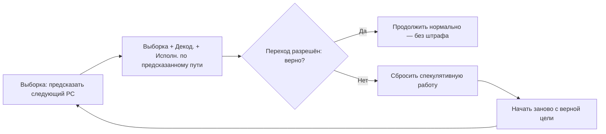
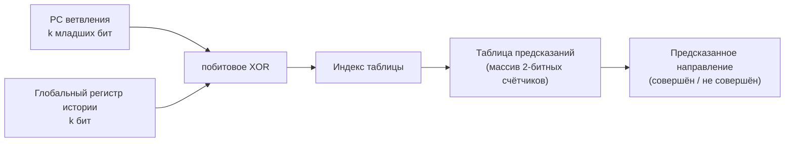
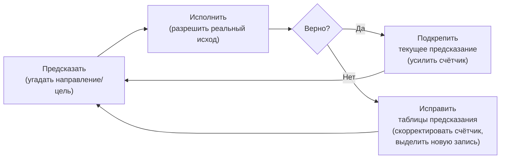

# Глава 5. Зачем процессору предсказание переходов

Любой высокопроизводительный процессор упирается в одну и ту же проблему: инструкции
текут сквозь конвейер, но конвейер не знает, *откуда брать следующую*, пока команда
перехода не разрешится несколькими стадиями позже. Ждать — значит обречь конвейер на
пустые такты простоя. Предсказание переходов заполняет эту пустоту: процессор *угадывает*
адрес следующей выборки и начинает работать спекулятивно, сверяя догадку позже и
откатываясь, если она оказалась ложной.

Будущее неизвестно, но останавливаться нельзя — и процессор ставит на наиболее вероятный
исход.

Эта глава закладывает понятийный фундамент для понимания блока предсказания переходов (BPU)
архитектуры Куньминху, описанного в сопутствующих главах. Никаких предварительных знаний о
микроархитектуре не требуется — достаточно понимать, что такое инструкции и что в RISC-V
есть команды ветвления и переходов.

### Мысленная модель в ASCII (прочтите в первую очередь)

```text
Без предсказания:                       С предсказанием:

  Выборка  Декод.   Исполн.               Выборка  Декод.   Исполн.
  ┌────┐   ┌────┐   ┌────┐               ┌────┐   ┌────┐   ┌────┐
  │ A  │──>│ A  │──>│ A  │               │ A  │──>│ A  │──>│ A  │
  ├────┤   ├────┤   ├────┤               ├────┤   ├────┤   ├────┤
  │????│   │ .. │   │ .. │  ← пузырь    │ B* │──>│ B* │──>│ B* │  ← спекулятивно
  ├────┤   ├────┤   ├────┤               ├────┤   ├────┤   ├────┤
  │????│   │????│   │ .. │  ← пузырь    │ C* │──>│ C* │──>│ C* │  ← спекулятивно
  ├────┤   ├────┤   ├────┤               ├────┤   ├────┤   ├────┤
  │ B  │──>│????│──>│????│               │ D* │──>│ D* │──>│ D* │
  └────┘   └────┘   └────┘               └────┘   └────┘   └────┘

  A — команда перехода. Мы ждём,             A — команда перехода. Мы *угадываем*
  пока стадия исполнения разрешит             цель и продолжаем выборку. Если
  её, чтобы узнать цель. Два такта           верно — ни одного потерянного такта.
  потеряны впустую.
                                              * = спекулятивно (может быть сброшено)
```

Если вы запомните из этой главы только одну мысль, пусть будет эта: **предсказание переходов
превращает последовательное узкое место в задачу спекуляции, а вся остальная машинерия BPU
существует для того, чтобы эта спекуляция оказывалась верной как можно чаще.**

---

## 5.1 Проблема конвейера: что происходит на ветвлении

### 5.1.1 Простой конвейер

Рассмотрим классический пятистадийный конвейер:

```text
  Выборка ──> Декодирование ──> Исполнение ──> Память ──> Запись результата
    (F)            (D)              (X)          (M)            (W)
```

Каждый такт процессор извлекает одну инструкцию (или группу — в суперскалярном варианте),
декодирует её, исполняет, обращается к памяти при необходимости и записывает результат.
В идеальных условиях новая инструкция входит в конвейер каждый такт, и процессор
поддерживает пропускную способность близкую к одной инструкции за такт (IPC ≈ 1)
для скалярного конвейера или к нескольким — для более широкой машины.

### 5.1.2 Момент, когда всё ломается

Теперь представим, что инструкция `A` по адресу `0x1000` — условный переход:

```
0x1000:  beq  x1, x2, target    # если x1 == x2, перейти к 'target'
0x1004:  add  x3, x4, x5        # последовательный путь
...
target:
0x2000:  sub  x6, x7, x8        # путь при переходе
```

Инструкция ветвления входит в стадию **Выборки**. Но процессор пока не знает, равны ли
`x1` и `x2` — это сравнение произойдёт на стадии **Исполнения**, двумя тактами позже.
А стадия Выборки должна решить *прямо сейчас*, какой адрес доставать дальше: `0x1004`
(продолжение по порядку) или `0x2000` (переход)?

Если она просто будет ждать — конвейер встанет на два такта. Каждый такт такого простоя
называется **конвейерным пузырём** (pipeline bubble) — такт, в который в конвейер не
поступает никакой полезной работы. Пузырь — вещь эфемерная, но урон от него вполне
материален.

### 5.1.3 Почему это важно: цифры

Ветвления встречаются часто — примерно 15–25% всех инструкций в типичных нагрузках. В простом
пятистадийном конвейере, где ветвление разрешается на стадии исполнения, каждое ветвление
рождает двухтактный пузырь, если процессор не предсказывает.

Грубая оценка для скалярного конвейера:

```text
Эффективный IPC  =  1 / (1 + частота_ветвлений × такты_пузыря)
                 =  1 / (1 + 0.20 × 2)
                 =  1 / 1.4
                 ≈  0.71
```

Двадцать девять процентов пропускной способности — в никуда, от одних только ветвлений.
И это ещё скромная оценка: с углублением конвейера и расширением машины положение становится
хуже. В процессоре вроде Куньминху — с глубиной конвейера свыше 10 стадий и декодированием шириной
в шесть инструкций — неразрешённые ветвления без предсказания были бы катастрофой — вполне буквальной,
инженерной.

---

## 5.2 Основная идея: угадать и проверить

### 5.2.1 Спекуляция

Решение по замыслу удивительно просто: **угадать** следующий адрес выборки и начать исполнение
спекулятивно. Угадали верно — ни одного потерянного такта. Неверно — сбрасываем спекулятивную
работу и начинаем заново с правильного адреса.

Это фундаментальный паттерн **спекуляции** в проектировании процессоров:

1. **Предсказать** — угадать исход до того, как он станет известен.
2. **Исполнить спекулятивно** — действовать так, будто догадка верна.
3. **Верифицировать** — проверить догадку, когда истинный исход станет доступен.
4. **Восстановить** — если догадка ложна, сбросить спекулятивное состояние и начать заново.



### 5.2.2 Ключевая терминология

Эти термины будут встречаться на протяжении всех глав о BPU:

| Термин | Определение |
| --- | --- |
| **PC** (Program Counter, счётчик команд) | Адрес текущей инструкции в памяти. PC ветвления — адрес, по которому расположена сама инструкция перехода; он служит естественным ключом для поиска предсказаний в аппаратных таблицах. |
| **Предсказание** (prediction) | Догадка об исходе ветвления (направлении и/или цели), сделанная до того, как ветвление будет исполнено. |
| **Спекуляция** (speculation) | Исполнение инструкций по предсказанному пути до того, как предсказание верифицировано. |
| **Ошибка предсказания** (misprediction) | Ситуация, когда предсказание не совпало с реальным исходом. |
| **Штраф за ошибку предсказания** (misprediction penalty) | Число тактов полезной работы, потерянных при восстановлении после ошибочного предсказания. |
| **Восстановление** (recovery, redirect) | Процесс сброса работы, выполненной по ложному пути, восстановления архитектурного состояния и перезапуска с верного адреса. |
| **Переход совершён** (taken) | Условное ветвление, условие которого истинно — управление передаётся на цель перехода. |
| **Переход не совершён** (not-taken) | Условное ветвление, условие которого ложно; исполнение продолжается со следующей по порядку инструкции. |
| **Последовательное продолжение** (fall-through) | Инструкция сразу после ветвления — путь, по которому идёт исполнение, когда переход не совершён. |
| **Обязательный промах** (compulsory miss, cold miss) | Неизбежная ошибка предсказания при самой первой встрече с ветвлением, когда BPU ещё ничего о нём не знает. Ветвление обнаруживается только после декодирования и исполнения; последующие выборки уже пользуются записанными метаданными. |

### 5.2.3 Проблема начальной загрузки: предсказание до декодирования

Модель спекуляции, описанная выше, предполагает, что процессор способен предсказать
направление и цель ветвления. Но за ней стоит более глубокий вопрос: **откуда процессор вообще знает, что
в блоке выборки есть ветвление?**

В момент предсказания у процессора на руках только начальный PC блока выборки. Инструкции
этого блока ещё не извлечены из кэша инструкций — не говоря уже о декодировании. Процессор
не знает, содержит ли блок ноль, одно или несколько ветвлений, каковы их типы и где они
расположены внутри блока.

Классическая задача о курице и яйце:
- Чтобы выбирать эффективно, процессор должен предсказывать ветвления *до* декодирования.
- Чтобы обнаружить ветвления, процессор должен декодировать — а это происходит *после* выборки.

Выход — **учиться на прошлом**. Процессор ведёт аппаратный кэш, который называется **буфером
целей переходов (BTB, Branch Target Buffer)** или, в более продвинутых конструкциях, **буфером
целей выборки (FTB, Fetch Target Buffer)**. В этом кэше хранятся сведения о ветвлениях,
которые уже были встречены раньше. Жизненный цикл выглядит так:

1. **Первая встреча**: BPU не имеет записей для этой области PC. Он предсказывает
   последовательное продолжение (ветвления нет). Инструкции проходят через конвейер,
   ветвление обнаруживается при декодировании, а его реальный исход и цель разрешаются
   при исполнении.
2. **Запись**: метаданные ветвления — его PC, позиция внутри блока выборки, тип и
   разрешённая цель — записываются обратно в BTB/FTB.
3. **Последующие встречи**: когда тот же регион PC извлекается снова, BTB/FTB предоставляет
   сохранённые метаданные *до декодирования*. Теперь предсказатели направления и цели
   могут делать свою работу.

Первая встреча — это всегда **обязательный промах**, неизбежная ошибка предсказания:
у BPU нет никаких предшествующих знаний о данном ветвлении. Такова цена холодного старта:
предсказатель улучшается только после того, как понаблюдает за реальным поведением ветвления.
Все механизмы предсказания, рассмотренные в этой главе (счётчики, история, TAGE), работают
с ветвлениями, уже внесёнными в каталог BTB/FTB; ни один из них не поможет с ветвлением,
которое процессор видит впервые.

Раздел 5.5 описывает структуры BTB и FTB, реализующие этот обучающий кэш, а сопутствующие
главы подробно разбирают конкретные реализации Куньминху.

### 5.2.4 Императив точности

Насколько точным должно быть предсказание? Рассмотрим машину со штрафом за ошибку в
15 тактов (примерно столько уходит у современного ядра с внеочередным исполнением на полный
сброс конвейера). Пусть 20% инструкций — ветвления:

| Точность | Ошибок на 1000 инструкций | Штрафных тактов на 1000 | Влияние на эффективный IPC |
| --- | --- | --- | --- |
| 90% | 200 × 0.10 = 20 | 20 × 15 = 300 | Существенное замедление |
| 95% | 200 × 0.05 = 10 | 10 × 15 = 150 | Заметное |
| 99% | 200 × 0.01 = 2 | 2 × 15 = 30 | Небольшие накладные расходы |
| 99.5% | 200 × 0.005 = 1 | 1 × 15 = 15 | Почти идеально |

Разница между 90% и 99% — это не «чуть лучше», это разница между медленным
процессором и быстрым. Современные BPU целятся в 95–99%+ на представительных нагрузках.
Достижение такой точности требует изощрённых методов — к ним мы и переходим.

---

## 5.3 Что именно нужно предсказать

Не все ветвления устроены одинаково. **Тип** инструкции передачи управления определяет,
что именно нужно предсказывать и насколько это трудно.

### 5.3.1 Типы ветвлений и переходов в RISC-V

| Инструкция | Тип | Что неизвестно в момент выборки | Трудность |
| --- | --- | --- | --- |
| `beq`, `bne`, `blt`, `bge`, `bltu`, `bgeu` | Условное ветвление | **Направление** (совершён или не совершён?) и **цель**, если совершён. Цель вычисляется относительно PC из битов инструкции, но инструкция в момент предсказания ещё не декодирована. | Средняя — паттерны направления обучаемы. |
| `jal` | Прямой переход/вызов | **Цель** вычисляется относительно PC и фиксирована. Один раз увидел — знаешь навсегда. | Лёгкая — достаточно простого кэша. |
| `jalr` (не возврат) | Косвенный переход/вызов | **Цель** вычисляется из значения регистра — она может меняться при каждом исполнении. | Высокая — требуется предсказание цели на основе истории. |
| `jalr x0, 0(ra)` (возврат) | Возврат | **Цель** берётся из регистра адреса возврата, который подчиняется стековой дисциплине. | Средняя — аппаратный стек предсказывает хорошо. |

### 5.3.2 Два вопроса предсказания

Для любой инструкции передачи управления предсказатель должен ответить на один или оба
вопроса:

1. **Направление**: будет переход совершён или нет? (Актуально только для условных ветвлений.)
2. **Цель**: если совершён — какой адрес назначения?

Для прямых переходов цель, однажды увиденная, остаётся неизменной. Для косвенных ветвлений
цель может меняться — её приходится предсказывать по истории исполнения. Для возвратов цель
подчиняется принципу «последним вошёл — первым вышел», и аппаратный стек прекрасно этим
пользуется.

---

## 5.4 Простые стратегии предсказания

Прежде чем перейти к изощрённым предсказателям Куньминху, разберёмся в простейших
стратегиях — и поймём, почему их недостаточно.

### 5.4.1 Статическое предсказание: всегда «не совершён»

Простейший из возможных предсказателей: всегда считать, что условный переход не будет
совершён. Выборка продолжается последовательно.

- **Точность**: примерно 50–60% на типичном коде. Циклы предсказываются неверно почти
  на каждой итерации, кроме последней.
- **Стоимость**: нулевая — просто берём следующий по порядку адрес.
- **Проблема**: код с циклами страдает катастрофически.

### 5.4.2 Статическое предсказание: всегда «совершён»

Предсказывать, что каждый переход будет совершён.

- **Точность**: чуть лучше для кода с циклами (~60–70%), но хуже для ветвлений вперёд,
  которые обычно не совершаются.
- **Стоимость**: нужно знать адрес цели — значит, как минимум BTB (см. раздел 5.5).
- **Проблема**: ветвления вперёд (forward branches) чаще всего не совершаются (например,
  проверки ошибок), и эта стратегия систематически промахивается на них.

### 5.4.3 Однобитный динамический предсказатель

Запомнить последний исход каждого ветвления и предсказать тот же исход в следующий раз.
Маленькая таблица, индексируемая по PC ветвления, хранит один бит на ветвление:
0 = в прошлый раз не совершён, 1 = в прошлый раз совершён.

- **Точность**: лучше статического (~80–85%), но дважды переворачивает предсказание на
  границах цикла.
- **Проблема**: цикл из N итераций даёт **две** ошибки предсказания за каждый запуск —
  одну на входе (если в прошлый раз цикл завершился «не совершён») и одну на выходе.

Предсказатель словно дёргается на каждой границе цикла — два раза за запуск.

### 5.4.4 Двухбитный насыщающий счётчик

Ключевая идея: одно аномальное событие не должно мгновенно менять предсказание. **Двухбитный
насыщающий счётчик** реализует это как автомат с четырьмя состояниями:

```text
           совершён               совершён               совершён
  +-----+ -------> +-----+ -------> +-----+ -------> +-----+
  | СНС |          | СлНС|          | СлС |          | СС  |
  | 00  |          | 01  |          | 10  |          | 11  |
  +-----+ <------- +-----+ <------- +-----+ <------- +-----+
      не совершён       не совершён       не совершён

  предсказание: НЕ СОВЕРШЁН        предсказание: СОВЕРШЁН
  <--------------------->           <--------------------->

  СНС  = Сильно не совершён    СлНС = Слабо не совершён
  СлС  = Слабо совершён        СС   = Сильно совершён
```

Счётчик растёт в сторону «сильно совершён» при совершённом исходе и падает в сторону
«сильно не совершён» при несовершённом, но **насыщается** на краях — никогда не
оборачивается. Предсказание — «совершён», когда счётчик в верхней половине (СлС или СС),
и «не совершён» — в нижней (СНС или СлНС).

По сути — инерция: счётчик не меняет мнение после одного противоречия.

- **Точность**: ~85–90% — заметно лучше однобитного.
- **Поведение на циклах**: цикл из 100 итераций теперь даёт только **одну** ошибку
  предсказания за запуск (при выходе) — единственный несовершённый выход не вышибает
  счётчик из состояния «совершён».

### 5.4.5 Рабочий пример: точность предсказания цикла

Рассмотрим цикл, который выполняется 100 раз и завершается:

```
loop:
    ...тело цикла...
    bne  x1, x0, loop    # переход назад к 'loop', если x1 != 0
    # последовательное продолжение, когда x1 == 0 (после 100 итераций)
```

Переход совершается 100 раз (возврат к началу цикла) и не совершается один раз (выход).

| Стратегия | Ошибок на 101 исход | Точность |
| --- | --- | --- |
| Всегда «не совершён» | 100 (каждая итерация с переходом) | 1% |
| Всегда «совершён» | 1 (выход) | 99% |
| Однобитный предсказатель | 2 (вход + выход, при втором запуске) | 98% |
| Двухбитный счётчик | 1 (только выход) | 99% |

Для этого цикла даже двухбитный счётчик даёт 99% точности. Но реальные программы устроены
значительно сложнее, и простыми средствами с ними не справиться.

---

## 5.5 Буферы целей переходов (BTB)

### 5.5.1 Проблема цели

В разделе 5.2.3 мы говорили о проблеме начальной загрузки: в момент предсказания у процессора
есть только PC блока выборки, и он полагается на ранее выученные метаданные, чтобы вообще
узнать о существовании ветвления. Но даже когда процессор уже знает, *что* ветвление есть,
перед ним встаёт следующая задача: если ветвление предсказано как совершённое, нужен **адрес
цели**, чтобы перенаправить выборку. Предсказатели направления (счётчики, TAGE) отвечают
на вопрос «прыгать или нет» — но молчат о том, *куда* прыгать.

### 5.5.2 Что делает BTB

**Буфер целей переходов** (Branch Target Buffer, BTB) — это кэш, который отображает PC
ветвлений на их известные цели. Он играет сразу две роли:

1. **Кэш обнаружения ветвлений** — попадание в BTB говорит процессору, что по данному PC
   *существует* ветвление, решая проблему начальной загрузки из раздела 5.2.3. Без этого
   попадания процессор даже не станет пытаться предсказывать направление.
2. **Кэш целей** — запись BTB хранит ранее наблюдённый адрес цели ветвления, так что
   процессор знает, *куда* перенаправить выборку, если переход предсказан как совершённый.

```text
                     BTB (кэш)
  PC выборки ──────> ┌──────────────────────┐
                     │  тег  │  адрес цели  │ ──> предсказанная цель
                     ├───────┼──────────────┤
                     │  тег  │  адрес цели  │
                     ├───────┼──────────────┤
                     │  ...  │     ...      │
                     └──────────────────────┘
                            │
                        попадание/промах
                (попадание = ветвление здесь известно;
                 промах = ветвление не записано)
```

На каждом такте выборки:
1. Текущий PC ищется в BTB.
2. Если **попадание**: ветвление ранее записано по этому PC. Процессор знает, что ветвление
   существует, и имеет кандидатную цель. Предсказатели направления решают, совершён ли
   переход; если да — сохранённая цель становится следующим адресом выборки.
3. Если **промах**: по этому PC ветвление не записано. Процессор предсказывает последовательное
   продолжение (следующий адрес). Если ветвление на самом деле есть, оно будет обнаружено
   после декодирования — это обязательный промах из раздела 5.2.3.

BTB заполняется через цикл обучения: когда ветвление впервые проходит по конвейеру,
декодирование обнаруживает его, а исполнение разрешает цель. Эта информация записывается
обратно в BTB, чтобы будущие выборки того же региона PC могли предсказывать до декодирования.

### 5.5.3 Компромиссы организации BTB

Как и любой кэш, BTB можно организовать по-разному:

| Организация | Скорость поиска | Ёмкость | Поведение при конфликтах |
| --- | --- | --- | --- |
| **Полностью ассоциативный** | Максимальная (параллельное сравнение всех записей) | Малая (дорого на запись) | Конфликтов нет — любая запись может хранить любое ветвление |
| **Множественно-ассоциативный** | Высокая (сравнение внутри одного множества) | Средняя | Некоторые конфликты внутри множества |
| **Прямого отображения** | Максимальная (одно сравнение) | Большая | Худшее конфликтное поведение |

Высокопроизводительные процессоры, как правило, комбинируют подходы: маленький полностью
ассоциативный или высокоассоциативный BTB для максимально быстрого поиска плюс более
объёмная множественно-ассоциативная структура для ёмкости.

### 5.5.4 За пределами простого BTB: буфер целей выборки

Современные процессоры часто расширяют концепцию BTB до **буфера целей выборки (FTB,
Fetch Target Buffer)**, который хранит не одно ветвление на запись, а потенциально несколько
ветвлений внутри блока выборки. Это важно, потому что широкий суперскалярный процессор
извлекает *блок* инструкций за раз (скажем, 16 или 32 байта), и в этом блоке может быть
сразу несколько ветвлений. Вспомним проблему начальной загрузки из раздела 5.2.3: процессору
нужно знать о *всех* ветвлениях в блоке выборки до декодирования, а не только о первом.
FTB решает эту задачу, записывая полную картину ветвлений каждого блока.

Запись FTB может содержать:
- Позицию каждого ветвления внутри блока выборки
- Тип и цель каждого ветвления
- Какое ветвление (если есть) является первым совершённым — именно оно определяет границу блока

`MainBtb` Куньминху играет роль, эквивалентную FTB, — подробности в
[Главе 5c](05c-accurate-predictors.md).

---

## 5.6 Предсказание на основе истории

### 5.6.1 Почему простых предсказателей недостаточно

Двухбитный счётчик на каждое ветвление хорошо работает для ветвлений, которые стабильно
совершаются или стабильно не совершаются. Но многие реальные ветвления демонстрируют
**коррелированное** поведение — их исход зависит от исходов *других* недавних ветвлений.

Рассмотрим такой паттерн:

```c
if (x > 0) {       // Ветвление A
    y = 1;
}
if (y == 1) {      // Ветвление B
    ...
}
```

Исход ветвления B полностью коррелирован с исходом ветвления A: если A совершён, то
`y == 1`, и B тоже совершён. Двухбитный счётчик, привязанный к отдельному ветвлению,
не способен уловить эту связь — он видит только собственную историю ветвления B.

### 5.6.2 Глобальный регистр истории (GHR) и индексация по истории

Ключевая идея предсказания на основе истории: поддерживать сдвиговый регистр, который хранит
исходы (совершён/не совершён) последних N ветвлений. Этот
**глобальный регистр истории (GHR, Global History Register)** фиксирует паттерн недавнего
потока управления.

```text
  Исходы последних ветвлений (новейшие слева):

  GHR: [ С  НС  С  С  НС  С  НС  НС  ... ]
         ↑                             ↑
       новейший                     старейший

  С = совершён (1), НС = не совершён (0)
```

Каждый раз, когда исход ветвления разрешается, регистр сдвигается на один бит, а новый исход
записывается в младший конец. Через N сдвигов каждая позиция содержит исход конкретного
недавнего исполнения ветвления.

**Двухуровневое адаптивное предсказание.** Комбинация регистра истории (первый уровень) и
таблицы паттернов со счётчиками (второй уровень) называется
**двухуровневым адаптивным предсказанием** (Yeh и Patt, 1991). Это был прорыв, потому что
такая схема учится сложным повторяющимся паттернам, недоступным простым счётчикам на ветвление.

Таблица предсказаний — это массив двухбитных насыщающих счётчиков. Чтобы предсказать ветвление,
нужен **индекс** в этот массив, который зависит и от PC ветвления, и от недавней истории.
Почему нужны оба источника?

- **Только PC** всегда даёт один и тот же индекс для одного и того же ветвления, поэтому
  предсказатель не различает разные контексты потока управления.
- **Только история** смешивает разные ветвления, которые оказались после одинакового паттерна
  истории, что вызывает взаимные помехи.

Комбинация даёт индекс для конкретного ветвления *в конкретном контексте*. Простейший вариант —
побитовое **XOR**:

```text
  index = PC[k-1 : 0]  XOR  GHR[k-1 : 0]
```

где `k` — число бит индекса (то есть `log2(размер_таблицы)`). XOR дёшев в железе (один
логический элемент на бит) и смешивает информацию обоих источников в каждом бите индекса.
Именно поэтому XOR стандартен для branch predictor: в отличие от AND/OR он не выбрасывает
энтропию входов, при равномерности хотя бы одного входа даёт близкое к равномерному распределение
индексов по таблице и не удлиняет критический путь предсказания.



**Проблема свёртки.** Короткая история (4–8 бит) может напрямую индексировать таблицу
(16–256 записей). Но для глубоких паттернов — вложенных циклов и корреляций через десятки
ветвлений — нужны истории длиной в **сотни бит**. В Куньминху самая длинная таблица TAGE
использует историю 397 бит.

Использовать 397 бит напрямую как индекс невозможно: это потребовало бы `2^397` записей.
Решение — **свёртка истории (history folding)**: сжать длинный вектор истории в короткий,
соответствующий ширине индекса таблицы.

**Алгоритм свёртки.** Историю длиной N делят на фрагменты ширины `k` (желаемая ширина
сжатия), затем XOR-ят все фрагменты:

```text
  Пример: свёртка 12-битной истории в 4 бита (k = 4)

  History:    [ b11  b10  b9  b8 | b7  b6  b5  b4 | b3  b2  b1  b0 ]
                   chunk 2            chunk 1            chunk 0

  Folded  =   chunk0  XOR  chunk1  XOR  chunk2

            = [ b3   b2   b1   b0  ]
          XOR [ b7   b6   b5   b4  ]
          XOR [ b11  b10  b9   b8  ]
              ─────────────────────
            = [ f3   f2   f1   f0  ]    (4-битная свёртка истории)
```

Каждый исходный бит влияет ровно на один бит результата свёртки. Поскольку XOR является
собственной обратной операцией, каждый исходный бит переключает соответствующий бит свёртки.
Поэтому любое изменение в полной истории меняет свёрнутое значение. Это сохраняет информацию
значительно лучше, чем простое усечение.

В Куньминху это реализовано функцией `computeFoldedHist`
([Helpers.scala:172](src/main/scala/xiangshan/frontend/bpu/Helpers.scala#L172)):
история делится на `ceil(histLen / compLen)` частей и редуцируется параллельным XOR-деревом.

После свёртки индекс таблицы TAGE формируется XOR-ом свёрнутой истории с нужными битами PC:

```text
  table_index = PC[k-1 : 0]  XOR  folded_history[k-1 : 0]
```

TAGE также нужен **тег** для обнаружения алиасинга (когда разные ветвления попадают в один индекс).
Тег вычисляется аналогично — XOR битов PC и свёрнутой истории — но с *другой* шириной свёртки,
чтобы получить отдельный хэш и снизить вероятность одновременной коллизии индекса и тега.
В Куньминху логика индексации описана в
[tage/Helpers.scala:64–68](src/main/scala/xiangshan/frontend/bpu/tage/Helpers.scala#L64):
`getSetIndex` XOR-ит биты набора из PC со свёрнутой историей для индекса, а `getRawTag`
делает то же для поля тега.

Сочетание свёртки (сжатие истории) и XOR (смешивание истории с PC) позволяет каждой таблице
TAGE быть чувствительной ко всей длине своей истории и при этом использовать компактный индекс.

### 5.6.3 TAGE: предсказание с тегированными геометрическими длинами истории

Сколько истории достаточно? Разным ветвлениям нужен разный объём контекста. Простому счётчику
цикла может хватить 4 бит, а глубоко вложенному автомату — сотен. Одна таблица с фиксированной
длиной истории будет либо слишком короткой для сложных случаев, либо избыточной для простых.

**TAGE** (Seznec, 2006) решает это элегантно: использует **несколько таблиц** с
**геометрически растущими длинами истории** и **теги**, чтобы уменьшить разрушительный
алиасинг. Каждая таблица применяет описанную выше схему свёртки и XOR-индексации: таблица
с историей 4 сворачивает 4 бита, таблица с историей 397 сворачивает 397 бит, но все они
выдают одинаково узкий индекс.

```text
  Таблица 0:  длина истории = 4     (улавливает короткие паттерны)
  Таблица 1:  длина истории = 8
  Таблица 2:  длина истории = 16
  Таблица 3:  длина истории = 32
  Таблица 4:  длина истории = 64
  Таблица 5:  длина истории = 128   (улавливает глубокие паттерны)
  ...

  Каждая запись таблицы содержит:
  ┌────────┬──────────┬──────────┐
  │  тег   │ ctr (2б) │ useful   │
  └────────┴──────────┴──────────┘
```

При предсказании ветвления:

1. **Параллельный поиск.** Для *всех* таблиц параллельно вычисляются индекс и тег. Каждая
   таблица использует свою длину истории (после свёртки до ширины индекса), поэтому одно
   ветвление может одновременно совпасть в нескольких таблицах.
2. **Выбор provider.** Среди всех таблиц с совпавшим тегом таблица с **самой длинной историей**
   становится **provider** — у неё больше всего контекста о текущей ситуации потока управления.
3. **Выбор alternate.** Таблица со **второй по длине** совпавшей историей становится
   **alternate** (alt). Если второго совпадения нет, alternate задаётся базовым предсказателем
   (бимодальным счётчиком из BTB). Alternate нужен, потому что provider-запись может быть
   недавно выделенной и ещё плохо обученной.
4. **Выбор между provider и alternate.** Если счётчик provider *сильный* (далеко от границы
   решения), используется provider. Если счётчик *слабый* (близко к границе), запись может быть
   новой и недостаточно надёжной. Тогда TAGE обращается к массиву счётчиков **useAltOnNa**
   ("use alternate on newly allocated"). Эти счётчики отслеживают, кто обычно точнее для новых
   provider-записей: provider или alternate. Если `useAltOnNa` положителен и provider слабый,
   TAGE переопределяет provider и выбирает alternate.
5. **Возврат к базовому предсказателю.** Если ни одна таблица не дала совпадения по тегу,
   предсказание выдаёт базовый предсказатель.

В Куньминху выбор provider и alternate реализован в
[Tage.scala:137–155](src/main/scala/xiangshan/frontend/bpu/tage/Tage.scala#L137):
provider выбирается `getLongestHistTableOH` по маске попаданий, а alternate — тем же методом
по маске без provider. Итоговое решение:
`finalPred = Mux(useProvider, providerPred, altOrBasePred)`
([Tage.scala:386](src/main/scala/xiangshan/frontend/bpu/tage/Tage.scala#L386)).

Геометрическая прогрессия здесь очень уместна: каждая таблица покрывает свой "временной
горизонт" корреляции, а теги отсекают ложные совпадения.

### 5.6.4 Почему TAGE так важен

В сравнении с более ранними двухуровневыми предсказателями:
- **Меньше деструктивного алиасинга**: теги отклоняют случайные коллизии.
- **Эффективное использование ёмкости**: геометрические длины означают, что большинство
  ветвлений находят свою глубину корреляции, не расходуя записи на нерелевантных длинах
  истории.
- **Плавная деградация**: если ни одна таблица с длинной историей не совпала, таблицы
  с короткой историей или базовый предсказатель всё равно дают разумную точность.

Куньминху реализует полноценный предсказатель TAGE с 8 таблицами при длинах истории от 4
до 397 бит — подробности в [Главе 5c](05c-accurate-predictors.md).

---

## 5.7 Стек адресов возврата (RAS)

### 5.7.1 Паттерн возврата

Вызовы и возвраты функций обладают особой структурой: они вложены друг в друга, как
матрёшки. Когда функция `f` вызывает функцию `g`, а та — функцию `h`, возвраты происходят
в обратном порядке: `h` возвращается в `g`, потом `g` — в `f`.

```text
  f() зовёт g()  ──>  g() зовёт h()  ──>  h() возврат к g()  ──>  g() возврат к f()

  Стек вызовов:
    втолкнуть адрес          втолкнуть адрес          вытолкнуть →              вытолкнуть →
    возврата f               возврата g               адрес возврата g          адрес возврата f
    ┌─────────────┐         ┌─────────────┐         ┌─────────────┐          ┌─────────────┐
    │ адр.возвр: f│         │ адр.возвр: g│         │ адр.возвр: f│          │  (пуст)     │
    │             │         │ адр.возвр: f│         │             │          │             │
    └─────────────┘         └─────────────┘         └─────────────┘          └─────────────┘
```

### 5.7.2 Как предсказатель узнаёт тип ветвления до декодирования

Возникает естественный вопрос: RAS должен делать push на вызовах и pop на возвратах, но BPU
работает *до* декодирования инструкции. Как он понимает, что перед ним вызов, возврат или
обычный переход?

Ответ — запись **FTB**. В разделе 5.5 мы уже видели, что FTB (в Куньминху это MainBtb) хранит
метаданные о каждом ветвлении, которое процессор уже встречал. Среди них есть поле
**`BranchAttribute`**
([Bundles.scala:37](src/main/scala/xiangshan/frontend/bpu/Bundles.scala#L37)),
в котором сохраняются два признака, выученные при первом исполнении ветвления и последующем
обучении FTB:

| Поле | Биты | Смысл |
| --- | --- | --- |
| `branchType` | 4 | Тип инструкции: условная, прямая (`jal`) или косвенная (`jalr`) |
| `rasAction` | 4 | Действие RAS: none, push (call), pop (return), или pop-then-push |

В RISC-V различение вызова и возврата основано на соглашении о регистрах ссылки.
Любой `jal` или `jalr`, который записывает адрес возврата в `x1` (`ra`) или `x5` (`t0`),
трактуется как **вызов**. Наоборот, `jalr`, который читает `x1` или `x5` как базовый регистр,
но пишет в *другой* (или нулевой) регистр назначения, трактуется как **возврат**. А `jalr`,
который и читает, и пишет регистр ссылки (в разные регистры), является вариантом
**call-and-return** (pop then push), что встречается в tail-call паттернах.

Эта классификация определяется преддекодером по битам инструкции на этапе fetch
([PreDecode.scala:57](src/main/scala/xiangshan/frontend/ifu/PreDecode.scala#L57))
и записывается в FTB при обучении
([MainBtbAlignBank.scala:232](src/main/scala/xiangshan/frontend/bpu/mbtb/MainBtbAlignBank.scala#L232)).
При следующих встречах ветвления FTB отдаёт сохранённый `rasAction` в RAS без ожидания decode.
RAS проверяет `attribute.isCall` и `attribute.isReturn`
([Ras.scala:65–72](src/main/scala/xiangshan/frontend/bpu/ras/Ras.scala#L65))
и делает push/pop прямо в конвейере BPU, за несколько тактов до декодера.

### 5.7.3 Аппаратный стек адресов возврата

**Стек адресов возврата (RAS, Return Address Stack)** воспроизводит паттерн вызов/возврат
в аппаратуре:

- На **вызове** (в записи FTB указано `rasAction = Push`): **push** адреса возврата
  (PC + длина инструкции) в RAS.
- На **возврате** (в записи FTB указано `rasAction = Pop`): **pop** вершины RAS и использование
  её как предсказанной цели.

Эффективность очень высокая: для обычных паттернов вызов/возврат точность RAS часто превышает 99%.

### 5.7.4 Проблема спекуляции

В спекулятивном процессоре возникает осложнение: процессор может спекулятивно исполнить
вызовы и возвраты по ложному пути. Если спекуляция позже будет сброшена, RAS оказывается
повреждён — в нём остались вталкивания и выталкивания, которых не должно было быть.

Решения:
- **Контрольные точки** (checkpointing): сохранить состояние RAS (указатель вершины)
  в ключевых моментах и восстановить его при ошибке предсказания.
- **Разделение спекулятивного и подтверждённого**: вести спекулятивную рабочую копию,
  которую можно откатить, и подтверждённую копию, отражающую только завершённые инструкции.

Куньминху использует архитектуру со спекулятивной очередью и подтверждённым стеком для
своего RAS — подробности в [Главе 5c](05c-accurate-predictors.md).

---

## 5.8 Предсказание цели косвенных переходов

### 5.8.1 Проблема косвенных переходов

Косвенный переход (`jalr rd, offset(rs1)`) вычисляет цель из значения регистра, которое
может меняться при каждом исполнении. Примеры:

- Диспетчеризация виртуальных методов (C++/Java): `jalr x0, 0(x10)`, где `x10` — указатель
  на метод.
- Операторы switch, скомпилированные в таблицы переходов: `jalr x0, 0(x11)`, где `x11`
  индексирует таблицу.
- Вызовы через указатели на функции.

Простой BTB хранит только *последнюю* цель — и это работает плохо, когда цель
чередуется между несколькими значениями.

### 5.8.2 Предсказание цели с учётом истории

Предсказатель ITTAGE (Indirect Target TAGE) применяет ту же идею геометрических длин
истории к предсказанию цели: несколько таблиц, индексируемых по (PC, истории), но вместо
счётчиков направления — **адреса целей**.

Разные контексты истории отображаются на разные цели, что позволяет уловить паттерны
вроде «на итерации 1 виртуальный вызов идёт к методу A; на итерации 2 — к методу B».

Куньминху реализует ITTAGE с 5 таблицами — детали в [Главе 5c](05c-accurate-predictors.md).

---

## 5.9 Собираем всё вместе: гибридный предсказатель

### 5.9.1 Универсального предсказателя не существует

Каждый метод предсказания хорош для своего типа ветвлений:

| Тип ветвления | Лучший подход |
| --- | --- |
| Условное (простые паттерны) | Двухбитный счётчик / бимодальный |
| Условное (сложные паттерны) | TAGE с длинной историей |
| Прямой переход/вызов | BTB (фиксированная цель) |
| Косвенный переход/вызов | ITTAGE (цель с учётом истории) |
| Возврат | RAS (стек) |

Реальный процессор должен справляться со всеми типами одновременно — поэтому он
объединяет несколько предсказателей в **гибридную** конструкцию, где каждый отвечает
за свою область.

### 5.9.2 Компромисс между скоростью и точностью

В проектировании предсказателей есть фундаментальное противоречие:

- **Маленькие, простые предсказатели** (мало записей, короткая история) — быстрые: они
  выдают предсказание за один такт. Но точность у них ограничена.
- **Большие, сложные предсказатели** (много записей, длинная история, теги) — более точные.
  Но им нужно несколько тактов, чтобы найти запись, сравнить теги и выбрать результат.

В высокопроизводительном фронтенде предсказатель обязан выдавать новое предсказание **каждый
такт**, чтобы конвейер выборки оставался заполненным. Если лучший предсказатель тратит
3 такта, фронтенд простаивает 2 такта на каждом предсказании — и весь смысл предсказания
теряется.

Быстро или точно — казалось бы, выбери одно. Но можно получить и то, и другое.

### 5.9.3 Стадийное предсказание

Решение: использовать **оба** предсказателя — быстрый и точный — конвейерно:

```text
  Такт 0          Такт 1               Такт 2               Такт 3
  ┌──────┐        ┌──────────┐         ┌──────────┐         ┌──────────────┐
  │  s0  │──────> │  s1      │───────> │  s2      │───────> │  s3          │
  │начало│        │быстрый   │         │вычисление│         │точный        │
  │  PC  │        │предск.   │         │(таблицы  │         │предск.       │
  └──────┘        │(1 такт)  │         │ отвечают)│         │(окончат.)    │
                  └──────────┘         └──────────┘         └──────────────┘
                       │                                          │
                       │                                          │
                       ▼                                          ▼
                  использовать быстрое                  если отличается от s1,
                  предсказание немедленно               ПЕРЕОПРЕДЕЛИТЬ: перенаправить
                                                        выборку

```

1. **Стадия 1 (быстрая)**: маленький предсказатель выдаёт мгновенную догадку за один такт.
   Фронтенд сразу начинает выборку по предсказанному адресу.
2. **Стадия 3 (точная)**: крупные предсказатели работают 2–3 такта. Когда их ответ приходит,
   он сверяется с предсказанием s1.
3. **Переопределение** (override): если точный предсказатель не согласен с быстрым —
   побеждает точный. Фронтенд сбрасывает работу по пути быстрого предсказания и
   перенаправляется к скорректированной цели.

Стоимость переопределения невелика (1–2 потерянных такта выборки) в сравнении со стоимостью
полной ошибки предсказания, обнаруженной бэкендом (10–15+ потерянных тактов). Поэтому даже
умеренная частота переопределений s1→s3 вполне приемлема.

### 5.9.4 Предварительный обзор: стадийная конструкция Куньминху

Куньминху реализует именно эту стратегию. Его BPU использует четырёхстадийный конвейер
(от s0 до s3) с двумя слоями предсказателей:

- **Быстрый слой (s1)**: компактные структуры — micro-BTB, ahead-BTB, micro-TAGE, micro-RAS —
  выдают первую догадку за один такт.
- **Точный слой (s2/s3)**: крупные структуры — MainBtb, TAGE, статистический корректор,
  ITTAGE, полный RAS — выдают уточнённые предсказания и могут переопределить быстрый слой.

Сопутствующие главы разбирают каждый слой в деталях:
- [Глава 5a](05a-bpu-top-level-architecture.md) — Архитектура верхнего уровня и конвейер
- [Глава 5b](05b-fast-predictors.md) — Быстрые предсказатели (слой s1)
- [Глава 5c](05c-accurate-predictors.md) — Точные предсказатели (слой s2/s3)
- [Глава 5d](05d-history-training-recovery.md) — Управление историей, обучение и восстановление

---

## 5.10 Статистический корректор: второе мнение

Ещё одно понятие стоит ввести уже здесь, поскольку оно присутствует в BPU Куньминху:
**статистический корректор (SC, Statistical Corrector)**.

Даже сильный предсказатель TAGE имеет пограничные случаи — ветвления, где счётчик
поставщика балансирует у порога решения и предсказание может качнуться в любую сторону.
SC добавляет отдельный слой слабых обучаемых (небольших таблиц, индексируемых по разным
признакам истории), выходы которых суммируются с весами. Если совокупный сигнал достаточно
силён, он может **перевернуть** решение TAGE.

Это консилиум: TAGE — лечащий врач, SC — группа консультантов. Каждый по отдельности
неуверен, но когда все указывают в одну сторону — есть основания прислушаться. Если
коллегия достаточно убеждена, что TAGE ошибается, SC переопределяет решение.

Этот метод, введённый Сезнеком вместе с TAGE, добавляет несколько процентов улучшения
точности на трудно предсказуемых ветвлениях — казалось бы, мелочь — но в диапазоне 97%+ за каждую долю процента идёт борьба.

---

## 5.11 Обучение: как предсказатели учатся

### 5.11.1 Цикл обучения

Предсказатели полезны ровно настолько, насколько они способны учиться. Процесс
**обучения** (training, update) направляет реальные исходы ветвлений обратно в таблицы:



Для двухбитного насыщающего счётчика:
- **Верное предсказание**: увеличить счётчик в сторону предсказанного исхода (подкрепление).
- **Ошибка**: уменьшить счётчик в противоположную сторону (коррекция).

Для TAGE обучение включает также:
- Обновление счётчика таблицы-поставщика.
- Возможное **выделение** (allocation) новой записи в таблице с более длинной историей,
  если текущее предсказание было ошибочным и более длинная история могла бы помочь.
- Управление счётчиками **полезности** (useful), которые защищают записи от вытеснения.

### 5.11.2 Когда обучать

В спекулятивном процессоре обучение требует осторожности:

- **При подтверждении** (on commit, консервативный подход): обучать только на завершённых
  ветвлениях с подтверждёнными исходами. Безопасно, но медленно — информация для обучения
  приходит через много тактов после предсказания.
- **При разрешении** (on resolve, ранний подход): обучать, как только исход ветвления стал
  известен в бэкенде, ещё до подтверждения. Более быстрая обратная связь, но нужно
  обрабатывать случай, когда разрешающая инструкция позже будет сброшена (редкость при
  последовательном подтверждении метаданных обучения).
- **При переопределении** (on override, самый быстрый подход): для предсказателей быстрого
  слоя результат точного слоя в s3 может служить обучающим сигналом ещё до исполнения
  ветвления. Это обеспечивает максимально быструю обратную связь для улучшения
  предсказателей s1.

Куньминху использует все три канала обучения — подробности в
[Главе 5d](05d-history-training-recovery.md).

---

## 5.12 Проектный компромисс: точность против стоимости восстановления

Сквозная тема проектирования BPU — баланс между **точностью предсказания** и **стоимостью
восстановления после ошибки**.

Точный предсказатель реже ошибается, но требует больше аппаратуры и времени. Простой —
быстрее и дешевле, но ошибается чаще.

Ключевая метрика — не точность сама по себе, а **эффективная пропускная способность**:

```text
Эффективная пропускная способность ∝ 1 / (1 + частота_ошибок × штраф_за_ошибку)
```

Из этого следует:
- Снизить частоту ошибок с 5% до 3% (улучшение на 40%) — ценно.
- Сократить штраф за восстановление с 15 до 10 тактов — не менее ценно.
- Стадийный подход помогает на обоих фронтах: быстрое предсказание s1 не даёт конвейеру
  выборки простаивать (сокращая эффективный штраф), а точное предсказание s3 обеспечивает
  высокую точность.

Гибридный подход Куньминху — быстрая первая догадка с последующей коррекцией — прямое
воплощение этого принципа.

---

## Ключевые выводы

- Предсказание переходов — не роскошь, а необходимость в высокопроизводительном конвейере;
  без него ветвления порождают конвейерные пузыри, пожирающие 20–30% и более пропускной
  способности.
- Процессор должен предсказывать и **направление** (совершён или не совершён), и **цель**
  (куда переходить), причём разные типы ветвлений (условные, прямые, косвенные, возвраты)
  требуют разных стратегий предсказания.
- **Предсказание на основе истории** (TAGE) улавливает корреляции между ветвлениями,
  индексируя таблицы одновременно по PC ветвления и глобальному регистру истории,
  с геометрически возрастающими длинами истории.
- **Компромисс между скоростью и точностью** определяет стадийную конструкцию предсказателя:
  быстрый, менее точный предсказатель s1 мгновенно питает выборку, а более медленный и
  точный предсказатель s3 может его переопределить.
- Обучение (передача реальных исходов обратно в таблицы) замыкает петлю и делает
  предсказатели лучше со временем; Куньминху использует три раздельных канала обучения
  с разными компромиссами между задержкой и точностью.

## Контрольные вопросы

1. **Базовый**: Почему конвейерный пузырь снижает пропускную способность инструкций? Какова
   связь между частотой ветвлений, длительностью пузыря и потерей IPC?
2. **Базовый**: В чём разница между предсказанием *направления* и предсказанием *цели*?
   Каким типам ветвлений нужно какое предсказание?
3. **Базовый**: Почему двухбитный насыщающий счётчик предсказывает циклы лучше, чем
   однобитный предсказатель? Проследите состояния счётчика для цикла из 5 итераций.
4. **Средний**: Объясните, почему предсказатель на базе отдельного ветвления (бимодальный)
   не может уловить корреляцию между ветвлениями A и B из примера раздела 5.6.1. Как
   предсказатель с индексацией по GHR решает эту задачу?
5. **Средний**: В стадийном предсказателе с быстрым s1 и точным s3, какова стоимость
   переопределения s3 по сравнению с полной ошибкой предсказания, обнаруженной бэкендом?
   Почему этот компромисс выгоден?
6. **Средний**: Почему предсказатель TAGE с геометрическими длинами истории эффективнее
   единой большой таблицы с одной длинной историей?
7. **Продвинутый**: RAS работает безупречно для сбалансированных пар вызов/возврат. Опишите
   паттерн кода, при котором спекуляция повреждает RAS, и объясните, как механизм контрольных
   точек с восстановлением это исправляет.
8. **Продвинутый**: Статистический корректор может перевернуть предсказание TAGE. При каких
   обстоятельствах это может навредить, а не помочь? Какой механизм не позволяет SC быть
   чрезмерно самоуверенным?

## Дополнительное чтение

1. Smith, J. E. "A Study of Branch Prediction Strategies." ISCA 1981.
   *Основополагающее исследование точности стратегий предсказания переходов.*
2. Yeh, T.-Y. and Patt, Y. N. "Two-Level Adaptive Training Branch Prediction." MICRO 1991.
   *Работа, представившая адаптивное предсказание на основе истории (двухуровневое).*
3. Seznec, A. "A New Case for the TAGE Branch Predictor." MICRO 2011.
   *Определяющая статья о TAGE со статистическим корректором — основа современных BPU.*
4. Seznec, A. "TAGE-SC-L Branch Predictors Again." CBP-5, 2016.
   *Предсказатель-чемпион, объединяющий TAGE, SC и предсказатель циклов.*
5. Jimenez, D. A. and Lin, C. "Dynamic Branch Prediction with Perceptrons." HPCA 2001.
   *Альтернативный подход с нейронно-инспирированными перцептронами — полезный контраст
   с TAGE.*
