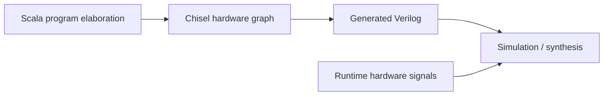

# Appendix G. Scala and Chisel Introduction (Multi-Document)

This appendix is a bridge for readers who already know Java and SystemVerilog, but are new to XiangShan's
Scala/Chisel style.

Primary entry points in XiangShan frontend:
[FrontendParameters.scala:27](../../src/main/scala/xiangshan/frontend/FrontendParameters.scala#L27),
[Frontend.scala:72](../../src/main/scala/xiangshan/frontend/Frontend.scala#L72),
[Frontend.scala:133](../../src/main/scala/xiangshan/frontend/Frontend.scala#L133),
[IBuffer.scala:36](../../src/main/scala/xiangshan/frontend/ibuffer/IBuffer.scala#L36).

---

## G.1 Reading Order

1. [G.1 Scala Primer](g1-scala-primer-for-java-and-systemverilog-readers.md)
   Focus: Scala features used in XiangShan.
   Outcome: understand parameter and structure code without treating Scala as magic.
2. [G.2 Chisel Primer](g2-chisel-primer-for-systemverilog-readers.md)
   Focus: Chisel hardware construction model.
   Outcome: map Chisel patterns to familiar SystemVerilog intent.
3. [G.3 Code-Reading Playbook](g3-xiangshan-scala-chisel-code-reading-playbook.md)
   Focus: practical XiangShan reading workflow.
   Outcome: move from top-level modules to cycle-level behavior quickly.

---

## G.2 Mental Model

- Java `class` + constructor args:
  think Scala `case class` parameters with defaults.
  Example: [FrontendParameters.scala:27](../../src/main/scala/xiangshan/frontend/FrontendParameters.scala#L27).
- Java interfaces / mixins:
  think Scala `trait` for shared parameter access.
  Example: [FrontendParameters.scala:63](../../src/main/scala/xiangshan/frontend/FrontendParameters.scala#L63).
- SystemVerilog `module` ports:
  think Chisel `Bundle` + `Input/Output/Flipped`.
  Example: [Frontend.scala:72](../../src/main/scala/xiangshan/frontend/Frontend.scala#L72).
- SV `always_ff` registers:
  think Chisel `RegInit` / `RegEnable`.
  Example: [IBuffer.scala:73](../../src/main/scala/xiangshan/frontend/ibuffer/IBuffer.scala#L73).
- SV `always_comb` + `if/case`:
  think Chisel `when/.elsewhen/.otherwise` + `switch/is`.
  Examples:
  [IBuffer.scala:164](../../src/main/scala/xiangshan/frontend/ibuffer/IBuffer.scala#L164),
  [InstrUncacheEntry.scala:107](../../src/main/scala/xiangshan/frontend/instruncache/InstrUncacheEntry.scala#L107).

---

## G.3 Block Diagram: Two-Phase Thinking

Interpretation rule: Scala code executes once at elaboration; generated registers/wires execute every cycle in
hardware.

---

## Worked Example: Frontend Construction Path

1. Start from top-level frontend wrapper creation in
   [Frontend.scala:98](../../src/main/scala/xiangshan/frontend/Frontend.scala#L98).
2. Observe concrete submodule instantiation in
   [Frontend.scala:136](../../src/main/scala/xiangshan/frontend/Frontend.scala#L136).
3. Follow inter-module ready/valid wiring in
   [Frontend.scala:220](../../src/main/scala/xiangshan/frontend/Frontend.scala#L220) and
   [Frontend.scala:242](../../src/main/scala/xiangshan/frontend/Frontend.scala#L242).
4. Finish at backend-facing output in
   [Frontend.scala:255](../../src/main/scala/xiangshan/frontend/Frontend.scala#L255).

This sequence is the canonical "top -> instantiate -> connect -> observe outputs" reading pattern.

---

## Design Trade-off: One Language for Generator + RTL

Benefit: parameters, structure generation, and RTL intent stay in one codebase and one type system.

Cost: beginners must separate elaboration-time Scala effects from cycle-time hardware effects.

Mitigation in XiangShan: parameter logic is concentrated in files like
[FrontendParameters.scala:27](../../src/main/scala/xiangshan/frontend/FrontendParameters.scala#L27), while
cycle behavior is concentrated in modules like
[IBuffer.scala:36](../../src/main/scala/xiangshan/frontend/ibuffer/IBuffer.scala#L36).

---

## Key Takeaways

- Treat XiangShan source as two layers: Scala elaboration layer and Chisel hardware layer.
- Start from module boundaries before decoding local implementation details.
- Use ready/valid and state-machine anchors to recover cycle behavior quickly.

## Checkpoint Questions

1. Basic: Why does `case class FrontendParameters` exist instead of scattered constants?
2. Basic: Which `FrontendIO` fields are pure inputs versus output/status fields?
3. Intermediate: What changes at elaboration time, and what changes at runtime?
4. Intermediate: In the frontend path, where is the handoff from fetch shaping to decode feed?
5. Advanced: Why is "single language for generator + RTL" powerful and risky at the same time?

## Further Reading

- Chisel documentation: https://www.chisel-lang.org/docs
- Chisel bootcamp (examples): https://github.com/freechipsproject/chisel-bootcamp
- Rocket Chip diplomacy/chisel usage context: https://github.com/chipsalliance/rocket-chip
