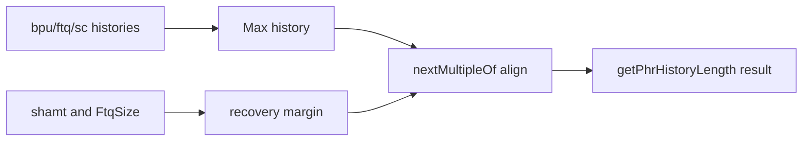

# Appendix G.1 Scala Primer for Java and SystemVerilog Readers

## 1. Motivation

In XiangShan, Scala is used to express hardware generators and parameterized structure. If you already know Java,
read Scala as "Java with stronger functional and immutable defaults," then map only the needed features.

Core anchors:
[FrontendParameters.scala:27](../../src/main/scala/xiangshan/frontend/FrontendParameters.scala#L27),
[FrontendParameters.scala:63](../../src/main/scala/xiangshan/frontend/FrontendParameters.scala#L63),
[Frontend.scala:168](../../src/main/scala/xiangshan/frontend/Frontend.scala#L168).

---

## 2. Concept Mapping Table

- Constructor argument object:
  Scala `case class` with defaults.
  Evidence: [FrontendParameters.scala:27](../../src/main/scala/xiangshan/frontend/FrontendParameters.scala#L27).
- Shared utility base class:
  Scala `trait` mixed into modules and bundles.
  Evidence: [FrontendParameters.scala:63](../../src/main/scala/xiangshan/frontend/FrontendParameters.scala#L63).
- Null-enabled optional field:
  Scala `Option`-wrapped field.
  Evidence: [Frontend.scala:94](../../src/main/scala/xiangshan/frontend/Frontend.scala#L94).
- Loop over generated instances:
  collection combinators (`map`, `zip`, `foreach`).
  Evidence: [Frontend.scala:168](../../src/main/scala/xiangshan/frontend/Frontend.scala#L168).
- Array initialization boilerplate:
  declarative `VecInit.fill` and `tabulate`.
  Evidence: [IBuffer.scala:74](../../src/main/scala/xiangshan/frontend/ibuffer/IBuffer.scala#L74).

---

## 3. Data-Flow Diagram: Parameter Derivation at Elaboration

The derivation is implemented in
[FrontendParameters.scala:39](../../src/main/scala/xiangshan/frontend/FrontendParameters.scala#L39).

---

## 4. Scala Features You Will See Repeatedly

### 4.1 `case class` for parameter packs

`FrontendParameters` is a typed configuration bundle with defaults and validation, including a final `require`
check in [FrontendParameters.scala:60](../../src/main/scala/xiangshan/frontend/FrontendParameters.scala#L60).

### 4.2 `trait` for shared accessors

`HasFrontendParameters` exposes local helper methods like `FetchPorts` and `IBufferEnqueueWidth` to any module
mixing in that trait:
[FrontendParameters.scala:75](../../src/main/scala/xiangshan/frontend/FrontendParameters.scala#L75),
[FrontendParameters.scala:87](../../src/main/scala/xiangshan/frontend/FrontendParameters.scala#L87).

### 4.3 collection style for replicated hardware connections

Instead of manual for-loop indexing in every place, XiangShan often composes vectors and applies `zip/foreach`
for pairwise connectivity:
[Frontend.scala:168](../../src/main/scala/xiangshan/frontend/Frontend.scala#L168),
[Frontend.scala:198](../../src/main/scala/xiangshan/frontend/Frontend.scala#L198).

---

## 5. Worked Example: Reading `getPhrHistoryLength`

Follow this exact path:

1. Identify input sources from predictor tables in
   [FrontendParameters.scala:43](../../src/main/scala/xiangshan/frontend/FrontendParameters.scala#L43).
2. Confirm additional recovery margin terms in
   [FrontendParameters.scala:51](../../src/main/scala/xiangshan/frontend/FrontendParameters.scala#L51).
3. Verify alignment policy in
   [FrontendParameters.scala:56](../../src/main/scala/xiangshan/frontend/FrontendParameters.scala#L56).
4. Confirm global legality check with
   [FrontendParameters.scala:60](../../src/main/scala/xiangshan/frontend/FrontendParameters.scala#L60).

Interpretation: this method is elaboration-time math that shapes hardware structure, not per-cycle logic.

---

## 6. Design Trade-off: Functional Style vs Immediate RTL Familiarity

Functional collection style reduces duplicate code and improves consistency across many ports.

The cost is that readers coming from imperative Java/SV loops may initially find control/dataflow less explicit.
Mitigation: expand one expression at a time from source anchors, and write the implied loop body in plain language.

---

## 7. Key Takeaways

- Start from `case class` and `trait` definitions before reading deep module code.
- `Option`, `map`, `zip`, and `foreach` mostly describe structure replication and conditional inclusion.
- Distinguish elaboration-time computations from runtime signal updates.

## 8. Checkpoint Questions

1. Basic: What practical benefit does defaulted `case class` configuration provide here?
2. Basic: Why does XiangShan use `trait HasFrontendParameters` instead of copying helpers everywhere?
3. Intermediate: Which part of `getPhrHistoryLength` is policy and which part is arithmetic?
4. Intermediate: How does `Option.when` differ from setting an always-present signal to zero?
5. Advanced: When can collection-heavy style hide performance-critical intent from readers?

## 9. Further Reading

- Scala language tour: https://docs.scala-lang.org/tour/tour-of-scala.html
- Scala collections overview: https://docs.scala-lang.org/overviews/collections-2.13/overview.html
- XiangShan frontend parameter definitions:
  [FrontendParameters.scala](../../src/main/scala/xiangshan/frontend/FrontendParameters.scala)
