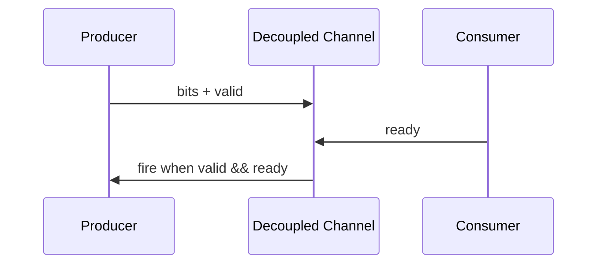
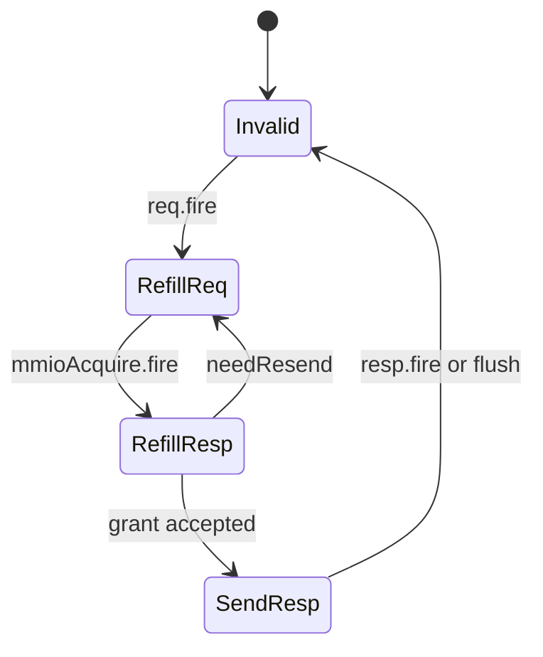

# Appendix G.2 Chisel Primer for SystemVerilog Readers

## 1. Motivation and Design Challenge

SystemVerilog readers already understand cycle-level intent, but Chisel introduces a construction DSL embedded in
Scala. The challenge is mapping familiar RTL concepts without confusing elaboration-time and runtime semantics.

Primary anchors:
[Frontend.scala:72](../../src/main/scala/xiangshan/frontend/Frontend.scala#L72),
[Bundles.scala:53](../../src/main/scala/xiangshan/frontend/Bundles.scala#L53),
[IBuffer.scala:36](../../src/main/scala/xiangshan/frontend/ibuffer/IBuffer.scala#L36),
[InstrUncacheEntry.scala:48](../../src/main/scala/xiangshan/frontend/instruncache/InstrUncacheEntry.scala#L48).

---

## 2. Subsystem Context in Full-Chip View

For frontend path reading, treat Chisel modules as the same architectural boundaries as SV modules:
`Bpu`, `Ftq`, `ICache`, `Ifu`, and `IBuffer` are instantiated in
[Frontend.scala:136](../../src/main/scala/xiangshan/frontend/Frontend.scala#L136).

---

## 3. Module Boundary and Interface Mapping

- `module` port list:
  use `class ...IO extends Bundle` plus `IO(new ...)`.
  Evidence:
  [IBuffer.scala:37](../../src/main/scala/xiangshan/frontend/ibuffer/IBuffer.scala#L37),
  [IBuffer.scala:51](../../src/main/scala/xiangshan/frontend/ibuffer/IBuffer.scala#L51).
- input/output direction:
  use `Input`, `Output`, and `Flipped`.
  Evidence:
  [Frontend.scala:73](../../src/main/scala/xiangshan/frontend/Frontend.scala#L73),
  [Frontend.scala:91](../../src/main/scala/xiangshan/frontend/Frontend.scala#L91).
- ready/valid channel:
  use `DecoupledIO[T]` and `Valid[T]`.
  Evidence:
  [Bundles.scala:54](../../src/main/scala/xiangshan/frontend/Bundles.scala#L54),
  [Bundles.scala:121](../../src/main/scala/xiangshan/frontend/Bundles.scala#L121).
- module instance:
  use `Module(new ...)`.
  Evidence:
  [Frontend.scala:136](../../src/main/scala/xiangshan/frontend/Frontend.scala#L136).

---

## 4. Step-by-Step Data-Flow Diagram: Ready/Valid Handshake

Concrete frontend example:
`ftq.io.toIfu.req.ready := ifu.io.fromFtq.req.ready && icache.io.fromFtq.fetchReq.ready`
in [Frontend.scala:221](../../src/main/scala/xiangshan/frontend/Frontend.scala#L221).

---

## 5. Internal Control and State Behavior

### 5.1 Registers and combinational logic

- Register arrays and pointers use `RegInit` in
  [IBuffer.scala:73](../../src/main/scala/xiangshan/frontend/ibuffer/IBuffer.scala#L73),
  [IBuffer.scala:91](../../src/main/scala/xiangshan/frontend/ibuffer/IBuffer.scala#L91),
  [IBuffer.scala:102](../../src/main/scala/xiangshan/frontend/ibuffer/IBuffer.scala#L102).
- Combinational control shaping uses `Wire`/`WireDefault` in
  [IBuffer.scala:110](../../src/main/scala/xiangshan/frontend/ibuffer/IBuffer.scala#L110),
  [IBuffer.scala:140](../../src/main/scala/xiangshan/frontend/ibuffer/IBuffer.scala#L140).

### 5.2 Conditional assignments

Chisel `when/.elsewhen/.otherwise` corresponds to prioritized conditional assignment:
[IBuffer.scala:164](../../src/main/scala/xiangshan/frontend/ibuffer/IBuffer.scala#L164),
[IBuffer.scala:175](../../src/main/scala/xiangshan/frontend/ibuffer/IBuffer.scala#L175).

---

## 6. FSM Diagram: `InstrUncacheEntry`

FSM definitions and transitions:
[InstrUncacheEntry.scala:48](../../src/main/scala/xiangshan/frontend/instruncache/InstrUncacheEntry.scala#L48),
[InstrUncacheEntry.scala:55](../../src/main/scala/xiangshan/frontend/instruncache/InstrUncacheEntry.scala#L55),
[InstrUncacheEntry.scala:107](../../src/main/scala/xiangshan/frontend/instruncache/InstrUncacheEntry.scala#L107).

---

## 7. Worked Example: Trace One Uncache Request

1. Request enters on `io.req` and latches at
   [InstrUncacheEntry.scala:67](../../src/main/scala/xiangshan/frontend/instruncache/InstrUncacheEntry.scala#L67).
2. State advances `Invalid -> RefillReq` in
   [InstrUncacheEntry.scala:108](../../src/main/scala/xiangshan/frontend/instruncache/InstrUncacheEntry.scala#L108).
3. TileLink acquire is issued in
   [InstrUncacheEntry.scala:80](../../src/main/scala/xiangshan/frontend/instruncache/InstrUncacheEntry.scala#L80).
4. Grant drives response assembly in
   [InstrUncacheEntry.scala:121](../../src/main/scala/xiangshan/frontend/instruncache/InstrUncacheEntry.scala#L121).
5. Final response is presented in
   [InstrUncacheEntry.scala:100](../../src/main/scala/xiangshan/frontend/instruncache/InstrUncacheEntry.scala#L100).

This is the same control story you would write in SV, with different syntax and stronger typing.

---

## 8. Design Trade-off: Typed DSL vs Direct RTL Verbosity

Benefit: interface types and directionality are explicit and reusable, reducing wiring mistakes.

Cost: generated structure can obscure the "final always block" mental model for first-time readers.

Mitigation: always inspect one concrete module's IO bundle, register declarations, and state transition block first.

---

## 9. Key Takeaways

- `Bundle` + `Input/Output/Flipped` is the direct analog of SV module interfaces.
- `DecoupledIO` and `Valid` are the primary communication contracts in frontend pipelines.
- `RegInit`, `Wire`, `when`, and `switch/is` are enough to decode most cycle behavior in XiangShan.

## 10. Checkpoint Questions

1. Basic: What condition defines `fire` on a `DecoupledIO` channel?
2. Basic: Why does `Flipped` exist in Chisel interface definitions?
3. Intermediate: Where do you look first to separate sequential state from combinational shaping?
4. Intermediate: How does the uncache FSM handle resend vs response?
5. Advanced: What readability trade-off appears when connection logic is heavily factorized with helper bundles?

## 11. Further Reading

- Chisel interfaces and connection operators: https://www.chisel-lang.org/docs/explanations/interfaces-and-connections
- Chisel sequential circuits: https://www.chisel-lang.org/docs/explanations/sequential-circuits
- XiangShan frontend bundles: [Bundles.scala](../../src/main/scala/xiangshan/frontend/Bundles.scala)
