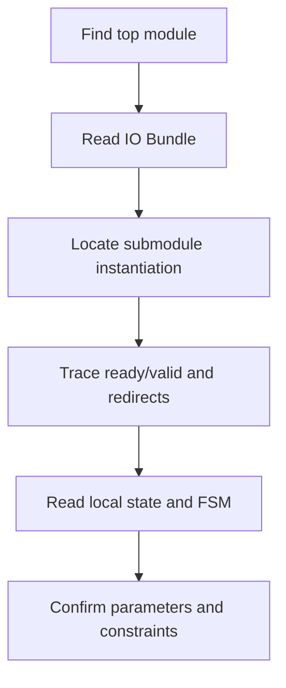

# Appendix G.3 XiangShan Scala/Chisel Code-Reading Playbook

## 1. Motivation and Reading Challenge

The main challenge is not syntax; it is scale. XiangShan modules are heavily parameterized, layered, and connected
through shared bundles. This playbook provides a repeatable reading order.

Primary anchors:
[Frontend.scala:72](../../src/main/scala/xiangshan/frontend/Frontend.scala#L72),
[Frontend.scala:133](../../src/main/scala/xiangshan/frontend/Frontend.scala#L133),
[IBuffer.scala:36](../../src/main/scala/xiangshan/frontend/ibuffer/IBuffer.scala#L36),
[InstrUncacheEntry.scala:107](../../src/main/scala/xiangshan/frontend/instruncache/InstrUncacheEntry.scala#L107).

---

## 2. Workflow Diagram

Use this order for every unfamiliar block before diving into helper utilities.

---

## 3. Step-by-Step Method

1. **Start with boundaries**
   Read top IO definitions first:
   [Frontend.scala:72](../../src/main/scala/xiangshan/frontend/Frontend.scala#L72),
   [IBuffer.scala:37](../../src/main/scala/xiangshan/frontend/ibuffer/IBuffer.scala#L37).
2. **Find construction points**
   Locate concrete instances and composition:
   [Frontend.scala:136](../../src/main/scala/xiangshan/frontend/Frontend.scala#L136).
3. **Trace handshakes**
   Follow channels and ready overrides:
   [Frontend.scala:220](../../src/main/scala/xiangshan/frontend/Frontend.scala#L220),
   [Frontend.scala:230](../../src/main/scala/xiangshan/frontend/Frontend.scala#L230).
4. **Recover cycle behavior**
   Read `RegInit` plus `when`/`switch` regions:
   [IBuffer.scala:73](../../src/main/scala/xiangshan/frontend/ibuffer/IBuffer.scala#L73),
   [IBuffer.scala:164](../../src/main/scala/xiangshan/frontend/ibuffer/IBuffer.scala#L164),
   [InstrUncacheEntry.scala:107](../../src/main/scala/xiangshan/frontend/instruncache/InstrUncacheEntry.scala#L107).
5. **Close with parameter scope**
   Identify knobs and hard constraints:
   [FrontendParameters.scala:27](../../src/main/scala/xiangshan/frontend/FrontendParameters.scala#L27),
   [FrontendParameters.scala:60](../../src/main/scala/xiangshan/frontend/FrontendParameters.scala#L60).

---

## 4. Pattern Reference Table

| Reading target | Fast anchor to search | Typical question |
| --- | --- | --- |
| External contract | `class ...IO extends Bundle` | What enters and exits this block? |
| Internal storage | `RegInit` / `RegEnable` | Which values persist across cycles? |
| Control priority | `when/.elsewhen` / `switch/is` | Which path wins on conflicts? |
| Backpressure point | `.ready := ...` | Where can upstream stall? |
| Structural replication | `VecInit.tabulate`, `zip`, `foreach` | Is this one path or N replicated paths? |

Concrete examples:
[IBuffer.scala:244](../../src/main/scala/xiangshan/frontend/ibuffer/IBuffer.scala#L244),
[Frontend.scala:168](../../src/main/scala/xiangshan/frontend/Frontend.scala#L168),
[InstrUncacheEntry.scala:66](../../src/main/scala/xiangshan/frontend/instruncache/InstrUncacheEntry.scala#L66).

---

## 5. Worked Example: Frontend to Decode Feed

Goal: explain how instructions reach backend decode-ready outputs.

1. Top-level wiring from IFU into IBuffer:
   [Frontend.scala:242](../../src/main/scala/xiangshan/frontend/Frontend.scala#L242).
2. IBuffer enqueue/dequeue decisions:
   [IBuffer.scala:111](../../src/main/scala/xiangshan/frontend/ibuffer/IBuffer.scala#L111),
   [IBuffer.scala:175](../../src/main/scala/xiangshan/frontend/ibuffer/IBuffer.scala#L175).
3. Backend-facing output handoff:
   [Frontend.scala:255](../../src/main/scala/xiangshan/frontend/Frontend.scala#L255).

Result: decode sees an elastic stream that can absorb IFU burstiness and redirect/flush disturbances.

---

## 6. Design Trade-off: Top-Down Reading vs Deep-First Reading

Top-down reading (recommended) gives fast architectural correctness but may miss local micro-optimizations early.

Deep-first reading can expose clever local tricks quickly, but often loses global control/dataflow context.

For XiangShan-scale code, top-down first is more reliable for avoiding wrong assumptions.

---

## 7. Key Takeaways

- Use a fixed reading order: boundary -> instances -> handshakes -> state -> parameters.
- Treat ready/valid and flush/redirect paths as first-class control flow.
- Verify every high-level claim against exact anchored source lines.

## 8. Checkpoint Questions

1. Basic: Which file and line should you inspect first when a module behavior is unclear?
2. Basic: How do you quickly identify potential backpressure points?
3. Intermediate: Why is it risky to start from a deep helper utility before module boundaries?
4. Intermediate: In frontend, where is decode visibility of IBuffer output established?
5. Advanced: How would you validate a narrative claim about redirect recovery using source anchors only?

## 9. Further Reading

- XiangShan book frontend overview: [Chapter 4](../part-02-frontend-instruction-supply/04-frontend-overview.md)
- Frontend source root: [frontend/](../../src/main/scala/xiangshan/frontend/)
- XiangShan design docs root: [XiangShan-Design-Doc/](../../XiangShan-Design-Doc/)
