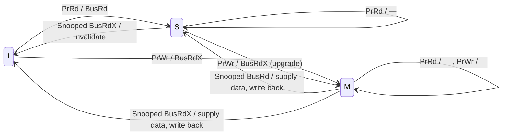
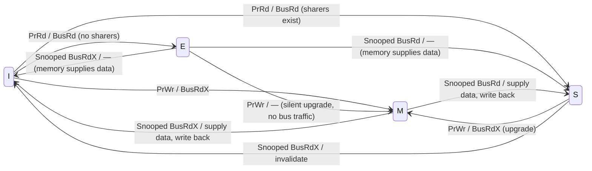
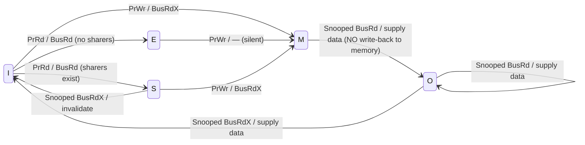
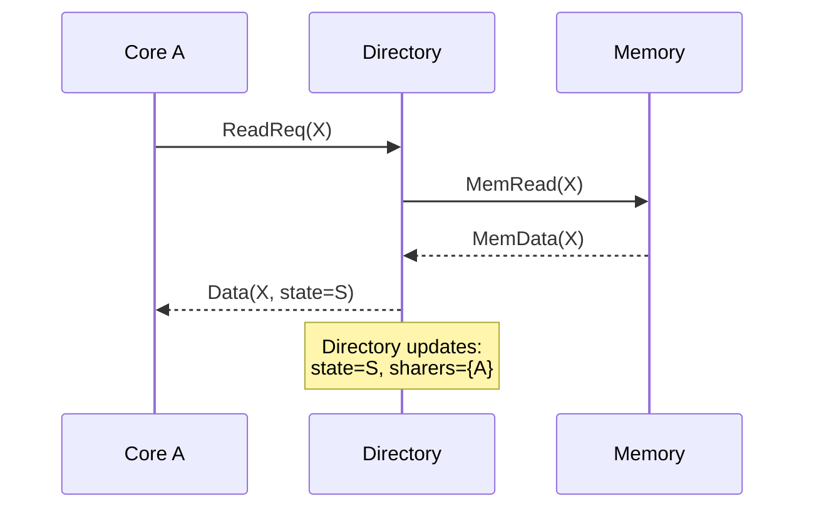
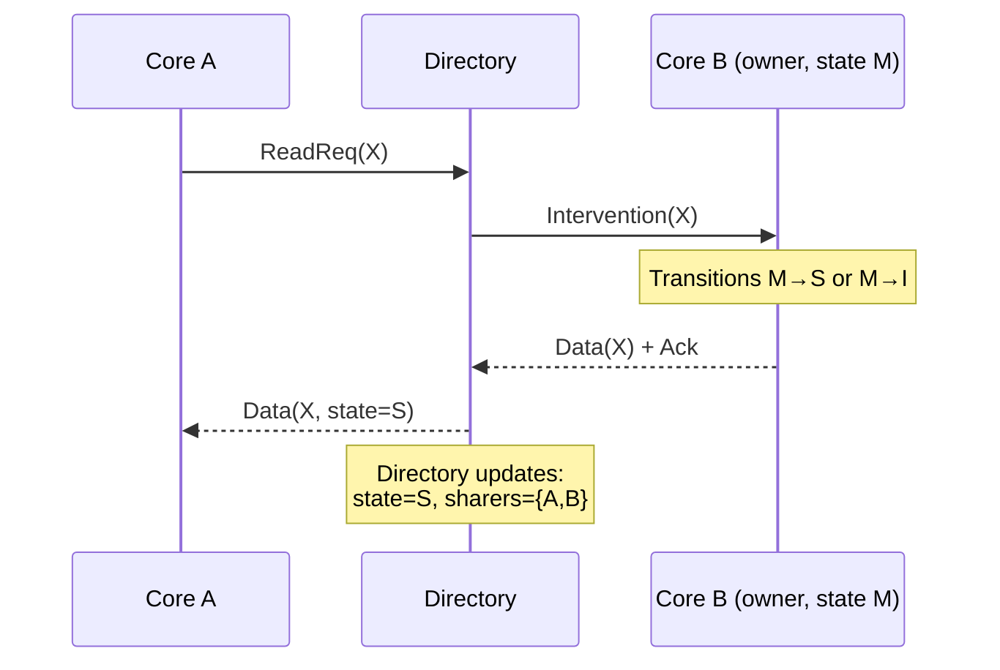
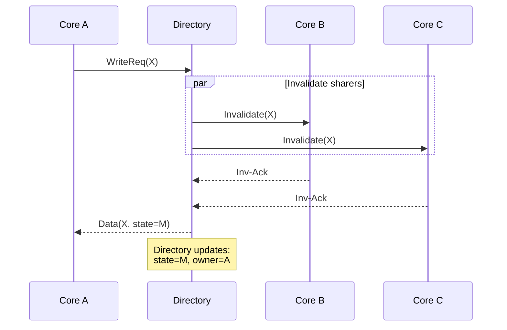
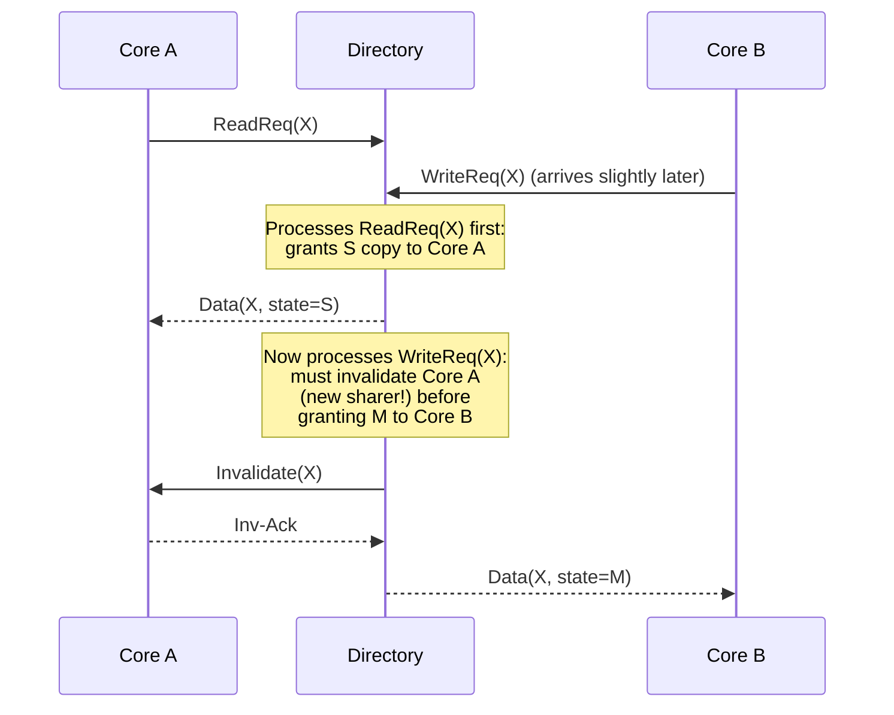

# Appendix I.1 — Cache Coherence Fundamentals

**Prerequisites:** Basic understanding of cache structure (sets, ways, tags, data arrays),
memory hierarchy concepts, and RISC-V ISA fundamentals.

**Goal:** Provide a self-contained introduction to cache coherence and memory consistency for
readers who understand caches but have not studied multi-core coherence protocols. By the end,
the reader should be able to distinguish coherence from consistency, reason about coherence
state machines, understand the trade-offs between snooping and directory approaches, and see
how RVWMO shapes XiangShan's pipeline and interconnect. This material prepares the reader for
the TileLink-specific protocol walkthrough in Appendix I.2.

---

## 1. The Cache Coherence Problem

### 1.1 Why Caches Create Inconsistency

Modern processors rely on private caches to bridge the latency gap between fast cores and
slow main memory. A single-core system with one cache never faces an inconsistency problem:
every load and store goes through the same cache, which acts as the sole mediator between the
processor and memory. The moment we add a second core — each with its own private L1 data
cache — the picture changes fundamentally.

Consider a dual-core system where both Core 0 and Core 1 share a physical address space:

```
   Core 0              Core 1
  ┌───────┐            ┌───────┐
  │  CPU  │            │  CPU  │
  └───┬───┘            └───┬───┘
      │                    │
  ┌───┴───┐            ┌───┴───┐
  │ L1 D$ │            │ L1 D$ │
  └───┬───┘            └───┬───┘
      │                    │
      └─────────┬──────────┘
                │
           ┌────┴─────┐
           │ Shared L2│
           └────┬─────┘
                │
           ┌────┴─────┐
           │  Memory  │
           └──────────┘
```

When Core 0 writes to address X, the new value exists only in Core 0's L1 cache. Core 1's
L1 cache — which may also hold a copy of X from a previous read — still contains the old
value. Without some mechanism to keep these copies consistent, Core 1 will read stale data.

This is the **cache coherence problem**: multiple cached copies of the same memory location
can become inconsistent when one cache modifies its copy.

### 1.2 Example: Stale Read from a Private L1 Cache

Walk through this concrete four-step scenario:

| Step | Core 0 Action | Core 0 L1 | Core 1 L1 | Memory |
|:----:|:---|:---:|:---:|:---:|
| 0 | — | — | — | X = 0 |
| 1 | Core 0 reads X | X = 0 | — | X = 0 |
| 2 | Core 1 reads X | X = 0 | X = 0 | X = 0 |
| 3 | Core 0 writes X = 42 | **X = 42** | X = 0 | X = 0 |
| 4 | Core 1 reads X | X = 42 | **X = 0 (stale!)** | X = 0 |

At step 4, Core 1 reads X and sees the value 0 — the value from *before* Core 0's write.
This is incorrect: the programmer expects that a write to shared memory eventually becomes
visible to all cores.

Two additional scenarios illustrate the severity of this problem:

**Producer–consumer flag.** Thread 0 sets `flag = 1` to signal readiness. Thread 1 spins
on `while (flag == 0)`. Without coherence, Thread 1 may never see the update and spin
forever.

**Lost update.** Core 0 and Core 1 both read a shared counter (value 5), each increments to
6, and each writes back 6. One increment is silently lost; the counter ends at 6 instead of
7.

### 1.3 Two Requirements for Correctness

For a shared-memory multiprocessor to execute programs correctly, the memory system must
provide two guarantees:

1. **Write propagation** (eventual visibility): A value written to any address by any core
   is eventually visible to all cores.
2. **Write serialization** (coherence order): All cores observe writes to the same address
   in the same total order.

Write propagation prevents stale reads. Write serialization (often called per-address
coherence order; related to modification order terminology in language memory models)
prevents contradictory observations — if Core A sees write W1 happen before write W2, then
Core B must see the same ordering.

### 1.4 Coherence vs. Consistency

These two terms are often confused. They are related but distinct concepts with different scopes:

| Concept | Scope | Governs |
|:---|:---|:---|
| **Coherence** | Single memory address | The order of reads and writes to *one* location |
| **Consistency** | All memory operations | Which load/store orderings and outcomes are legal (especially across *different* locations) |

**Coherence** answers: "For one address X, do all cores agree on a single write order, and are reads of X consistent with that order?" It guarantees a per-address total order of writes (coherence order) seen by all observers.

**Consistency** (the memory model) answers: "If Core 0 writes X and then writes Y, and Core 1 reads Y then X, which outcomes are legal?" It defines allowed reorderings and visibility of loads and stores across the program.

#### Example: Why Coherence Alone Isn't Enough
Consider a classic producer-consumer scenario using two variables: `data` (initially 0) and `flag` (initially 0).

**Core 0 (Producer)**
```c
data = 42;    // A: Write data
flag = 1;     // B: Signal data is ready
```

**Core 1 (Consumer)**
```c
while (flag == 0); // C: Spin until ready
print(data);       // D: Read data
```

Even if the system is **perfectly coherent** (Core 1 will eventually see `flag = 1` and `data = 42`), the program can still fail and print `0`. Why? Because a relaxed consistency model may allow Core 1 to observe write B (`flag = 1`) before write A (`data = 42`). Coherence only guarantees per-address ordering: all cores agree on the write order to `flag`, and separately on the write order to `data`. It does not constrain ordering between *different* addresses.

A system can be coherent (all caches agree on per-address ordering) while having a relaxed consistency model that allows reordering across addresses. RISC-V's RVWMO (RISC-V Weak Memory Ordering) model is precisely such a design: the coherence protocol ensures per-address correctness, while `fence` instructions and atomic operations with `.aq`/`.rl` bits enforce cross-address ordering when the programmer needs it.

The rest of this appendix focuses primarily on **coherence** — the per-address ordering
machinery. But first, Section 2 examines consistency in depth, because the memory model
profoundly shapes the coherence hardware, the pipeline, and the on-chip interconnect.

### 1.5 Formal Definition of Coherence

The standard formalization uses two invariants:

**Single-Writer / Multiple-Reader (SWMR) Invariant:**
At any logical point in time, for any cache line, either:
- Exactly one core has read-write permission (the "single writer"), **or**
- Zero or more cores have read-only permission (the "multiple readers").

No core may hold write permission while another core holds *any* permission to the same
line.

**Data-Value Invariant:**
The value of a cache line at the start of any read-only or read-write epoch equals the
value at the end of the most recent read-write epoch for that line. In plain terms: when a
core gains access to a line, it must receive the most recently written value.

Together, SWMR and the Data-Value Invariant guarantee coherence. Every coherence protocol
— whether bus-based snooping or directory-based — is a distributed mechanism for enforcing
these two invariants. (Note: the terms "cache line" and "cache block" are synonymous; this
text uses "cache line" throughout, shortened to "line" after first use in each section.)

> **Design Trade-off: Why Not Just Share One Cache?**
>
> If multiple private caches cause coherence problems, why not use a single shared cache?
> The answer is latency and bandwidth. A shared L1 cache would serialize all loads and stores
> from every core through one structure, creating a throughput bottleneck and eliminating the
> latency benefit of per-core private caches. In practice, private L1 caches provide 1–4
> cycle access latency; a shared structure accessible by all cores would require 10+ cycles
> due to arbitration and physical distance. The coherence protocol is the engineering cost
> we pay to enjoy private-cache performance while maintaining the illusion of shared memory.

---

## 2. Memory Consistency and Its Impact on Hardware Design

### 2.1 Why the Memory Model Matters for Hardware Designers

A memory consistency model is a contract between the hardware and the programmer. It specifies
which orderings of loads and stores to *different* addresses are legal — that is, which
reorderings the hardware is *allowed* to perform and which the programmer can *rely on* not
happening. Every microarchitectural optimization that moves, delays, or overlaps memory
operations must respect this contract.

The consistency model therefore drives concrete hardware decisions:

| Hardware structure | Constraint from consistency model |
|:---|:---|
| Store buffer | May a load bypass an older store to a different address? |
| Load queue | Must loads to different addresses retire in program order? |
| Miss queue | May write-backs to the same address be coalesced or reordered? |
| Fence logic | What operations must drain before the fence completes? |
| Atomic unit | When must the store buffer drain relative to an AMO (Atomic Memory Operation)? |

A **strong** model (Sequential Consistency, TSO) forbids most reorderings — the hardware
must add stall logic and drain buffers more aggressively. A **weak** model (RVWMO, ARM) allows
the hardware to overlap and reorder freely by default, but requires explicit fence instructions
or acquire/release annotations to restore order when the programmer needs it.

### 2.2 The Consistency Model Spectrum

**Sequential Consistency (SC)** — Lamport's 1979 definition: the result of any execution is
the same as if the operations of all cores were executed in some sequential order, and the
operations of each individual core appear in this sequence in the order specified by its
program. Under SC, loads and stores from every core are interleaved in a global total order
that respects each core's program order. No reordering is permitted.

SC is the easiest model to reason about, but it severely constrains the hardware. A store
must become globally visible before the next load from the same core can execute — this
effectively serializes all memory operations and prohibits write buffering.

**Total Store Order (TSO)** — used by x86 and SPARC. TSO relaxes SC in one specific way: a
load may execute before an older store from the same core becomes globally visible, *provided*
the load is to a different address. In other words, the store buffer is allowed to delay
stores while later loads proceed. The "total store order" name reflects the constraint that all
cores still observe stores in a single consistent global order.

Under TSO, a store buffer forwarding path lets a core see its own store immediately (same
address), but loads from other cores cannot see the store until it drains from the buffer.
This single relaxation unlocks write buffering — the most performance-critical optimization
in modern CPUs — while keeping the model strong enough that most lock-free algorithms work
without explicit fences.

**RISC-V Weak Memory Ordering (RVWMO)** — the consistency model specified by the RISC-V
ISA. In the notation `X -> Y`, `X` is older in program order and `Y` is younger. If a model
"allows `X -> Y` reordering," the younger operation may execute or become visible before the
older one. RVWMO permits all four broad categories by default:

| Reordering type | SC | TSO | RVWMO |
|:---|:---|:---|:---|
| Store → Load (younger load bypasses older store) | No | **Yes** | **Yes** |
| Load → Load (younger load may pass older load) | No | No | **Yes** |
| Load → Store (younger store may pass older load) | No | No | **Yes** |
| Store → Store (younger store may pass older store) | No | No | **Yes** |

Think of this table as a set of **permissions**, not obligations: RVWMO allows the hardware to
reorder in these ways, but does not require every implementation to exploit every relaxation in
every pipeline stage. The cost is shifted to software: programmers must insert `fence`
instructions or use `.aq`/`.rl` annotations on atomics whenever cross-address ordering is
required.

### 2.3 How RVWMO Shapes XiangShan's Pipeline

XiangShan implements RVWMO — not TSO, not SC. This choice permeates the design of the load
queue, store queue, fence logic, and atomic execution path.

**Store queue and in-order drain.**
The store queue holds all in-flight stores in program order. A store becomes eligible for
drain to the store buffer (sbuffer) only after the Reorder Buffer (ROB) commits it — see
[StoreQueue.scala:1136](src/main/scala/xiangshan/mem/lsqueue/StoreQueue.scala#L1136),
where `committed(ptr)` is set when the ROB retires the store. The dequeue path advances from
the queue head and only removes completed head entries
([StoreQueue.scala:346](src/main/scala/xiangshan/mem/lsqueue/StoreQueue.scala#L346)),
so the store-queue-to-sbuffer handoff is in program order and speculative stores cannot escape.

This is a **store-side** ordering guarantee. It is stronger than the minimum needed for some
RVWMO cases, but by itself it does not imply TSO (load-side relaxations still exist, discussed
below). For same-address correctness, the dcache miss queue also explicitly prohibits
coalescing one store into another store request — see the comment at
[MissQueue.scala:188](src/main/scala/xiangshan/cache/dcache/mainpipe/MissQueue.scala#L188):
*"store merge to a store is disabled … as store to same address should preserve their program
order to match memory model."*

**Store-to-load forwarding.**
A younger load first checks the store queue for matching **older** stores. The forwarding
mask is built to search only logically older entries, then a priority select picks the newest
matching older store — see
[StoreQueue.scala:674](src/main/scala/xiangshan/mem/lsqueue/StoreQueue.scala#L674).
This is required by RVWMO's same-address rule: a load must see the latest store to the same
address from the same hart, even if that store has not drained to cache yet.

**Speculative load execution and violation recovery.**
Because RVWMO permits load-load reordering, XiangShan aggressively issues loads out of order
relative to older stores whose addresses are not yet known. Two hardware structures detect
violations when this speculation turns out to be incorrect:

- `LoadQueueRAW` (store-to-load violation): when a store computes its address, it searches (via content-addressable memory, CAM)
  the load queue for younger loads that executed against the same cache line — see
  [LoadQueueRAW.scala:296](src/main/scala/xiangshan/mem/lsqueue/LoadQueueRAW.scala#L296).
  A match triggers a pipeline flush and re-fetch from the offending load's PC.
- `LoadQueueRAR` (load-to-load violation): if the coherence protocol revokes a cache line
  (via a Probe on Channel B) between two loads of the same address, the `released` flag
  marks the older load — see
  [LoadQueueRAR.scala:111](src/main/scala/xiangshan/mem/lsqueue/LoadQueueRAR.scala#L111).
  A subsequent load that finds a `released` older entry triggers a re-fetch, ensuring
  the two loads observe a consistent coherence order.

These violation detectors are a direct consequence of the weak model: under TSO, load-load
reordering is forbidden, so no `LoadQueueRAR` would be needed. Under SC, even store-load
bypassing is forbidden, so neither structure would be needed — but neither would write
buffering, and performance would suffer dramatically.

**Memory Dependence Prediction (Store Sets).**
Frequent violation flushes are expensive. XiangShan mitigates them with a Store Set
predictor (Store Set Identifier Table / Last Fetched Store Table, SSIT/LFST) — see
[StoreSet.scala:246](src/main/scala/xiangshan/mem/mdp/StoreSet.scala#L246).
After a store-to-load violation, the predictor links the offending load PC and store PC into
the same "store set," causing future dispatches to delay the load until the store issues.
This adaptive mechanism converts reactive flushes into proactive scheduling, recovering most
of the performance lost to mis-speculation.

### 2.4 Fence Instructions: Restoring Order Under RVWMO

Because RVWMO permits all reorderings by default, the ISA provides `fence` instructions that
selectively prohibit specific categories. Each fence specifies predecessor and successor sets
drawn from `{r, w, i, o}` (read, write, input, output):

| Instruction | Predecessor | Successor | Effect |
|:---|:---|:---|:---|
| `fence rw, rw` | all loads/stores | all loads/stores | Full fence — all prior memory ops complete before any subsequent ones |
| `fence w, w` | stores | stores | Write fence — prior stores visible before subsequent stores |
| `fence r, r` | loads | loads | Read fence — prior loads complete before subsequent loads |
| `fence.tso` | loads+stores | loads; stores | TSO fence — prior loads/stores before later loads; prior stores before later stores |
| `fence.i` | stores | instruction fetches | I-cache synchronization — ensures prior stores are visible to instruction fetch |

XiangShan implements fences through a combination of decode-time attributes and a dedicated
fence FSM. At decode, every `fence` variant carries `blockBack = T` and `flushPipe = T` — see
[DecodeUnit.scala:249](src/main/scala/xiangshan/backend/decode/DecodeUnit.scala#L249).
The `blockBack` attribute stalls ROB dispatch of all subsequent instructions until the fence
commits; `flushPipe` triggers a pipeline flush upon commit so that no younger instruction
can observe pre-fence state.

The fence execution unit contains a simple FSM that waits for the store buffer to drain
before completing — see
[Fence.scala:65](src/main/scala/xiangshan/backend/fu/Fence.scala#L65),
where the `sbuffer` signal asserts while the FSM is in `s_wait`, requesting the sbuffer to
drain, and the FSM advances only when `sbEmpty` is true (line 78). This drain ensures
that all stores preceding the fence have reached the cache hierarchy before any subsequent
memory operation can execute.

### 2.5 Atomic Operations: Acquire and Release Semantics

RISC-V atomic instructions (`lr`/`sc`, `amoadd`, `amoswap`, etc.) carry optional `.aq`
(acquire) and `.rl` (release) bits that impose ordering without a full fence:

- `.aq` (acquire): no subsequent memory operation from this hart can be reordered before this
  instruction. Equivalent to a one-directional fence *after* the atomic.
- `.rl` (release): no prior memory operation from this hart can be reordered after this
  instruction. Equivalent to a one-directional fence *before* the atomic.
- `.aqrl` (both): the atomic is a full ordering point — a "sequentially consistent" atomic.

XiangShan enforces these ordering guarantees structurally rather than with separate `.aq`/`.rl`
hardware bits. Every AMO and LR/SC instruction is decoded with `noSpec = T` and
`blockBack = T` — see
[DecodeUnit.scala:258](src/main/scala/xiangshan/backend/decode/DecodeUnit.scala#L258).
The `noSpec` attribute prevents speculative issue past a branch; `blockBack` stalls all
subsequent instructions until the atomic retires. Before the atomic touches the cache, the
`AtomicsUnit` FSM drains the store buffer to empty — see
[AtomicsUnit.scala:497](src/main/scala/xiangshan/mem/pipeline/AtomicsUnit.scala#L497),
where `io.flush_sbuffer.valid` asserts until `sbuffer_empty` is true.

This conservative approach — drain the store buffer, execute the atomic, stall the pipeline —
satisfies both `.aq` and `.rl` semantics simultaneously for every atomic, regardless of which
bits are actually set. It trades some performance (unnecessary stalls when only `.rl` or
neither bit is set) for implementation simplicity.

> **Design Trade-off: Conservative vs. Fine-Grained Acquire/Release**
>
> XiangShan treats every AMO as if it carries both `.aq` and `.rl`, draining the store buffer
> and blocking the pipeline unconditionally. An alternative design would decode the `.aq` and
> `.rl` bits separately and enforce only the required ordering: `.rl`-only would drain the
> store buffer but allow subsequent loads to proceed; `.aq`-only would block subsequent loads
> but skip the store buffer drain; plain AMOs (no bits set) would skip both.
>
> The fine-grained approach extracts more instruction-level parallelism (ILP) from atomic-heavy code (e.g., lock-free data
> structures) but adds decode complexity and increases the number of pipeline control cases
> that must be verified for correctness. XiangShan's conservative choice simplifies
> verification and avoids subtle ordering bugs, at the cost of serializing around atomics.

### 2.6 How Consistency Shapes the Interconnect: TileLink Ordering

The consistency model does not stop at the core boundary. The on-chip interconnect must
preserve the ordering guarantees that the pipeline establishes. TileLink, the protocol used
between XiangShan's L1 caches and L2, provides ordering through its `fifoId` mechanism — see
[Parameters.scala:168](rocket-chip/src/main/scala/tilelink/Parameters.scala#L168).

Masters that set `requestFifo = true` expect their Channel A requests to a given slave to be
served in FIFO order within a FIFO domain. The `TLFIFOFixer` module enforces this by stalling
new requests from a source while an outstanding request to the same FIFO domain is in
flight — see
[FIFOFixer.scala:71](rocket-chip/src/main/scala/tilelink/FIFOFixer.scala#L71).

This matters for consistency because the store buffer drains stores to the dcache in program
order, and the dcache forwards them to the L2 via TileLink Channel A. If the interconnect
were allowed to reorder these requests, the store ordering established by the pipeline would be
violated from the perspective of other cores that observe the L2. The `requestFifo` guarantee
closes this gap: stores reach the L2 directory in the order the pipeline committed them,
and the directory grants permissions in the same order, making the committed store order
visible to all participants in the coherence protocol.

### 2.7 Where Coherence Ends and Consistency Begins

The division of labor between coherence and consistency can be summarized as follows:

```
┌───────────────────────────────────────────────────────────────────────┐
│                 Memory Consistency Model (RVWMO)                      │
│                                                                       │
│  Defines which reorderings of loads/stores to DIFFERENT addresses     │
│  are legal. Enforced by:                                              │
│                                                                       │
│  ┌─────────────────┐  ┌──────────────┐  ┌──────────────────────────┐  │
│  │ Store Queue     │  │ Fence FSM    │  │ Violation Detectors      │  │
│  │ (in-order drain)│  │ (SB drain)   │  │ (LoadQueueRAW/RAR)       │  │
│  └─────────────────┘  └──────────────┘  └──────────────────────────┘  │
│  ┌─────────────────┐  ┌──────────────────────────────────────────┐    │
│  │ AtomicsUnit     │  │ TileLink FIFO ordering (requestFifo)     │    │
│  │ (SB + stall)    │  │                                          │    │
│  └─────────────────┘  └──────────────────────────────────────────┘    │
│                                                                       │
├───────────────────────────────────────────────────────────────────────┤
│                    Cache Coherence Protocol                           │
│                                                                       │
│  Ensures all caches observe a single write order to EACH address.     │
│  Enforced by:                                                         │
│                                                                       │
│  ┌──────────────────────┐  ┌───────────────────────────────────────┐  │
│  │ MESI/MOESI states    │  │ Directory at L2 (CoupledL2)          │   │
│  │ (SWMR invariant)     │  │ Snoop filter at L3 (OpenLLC)         │   │
│  └──────────────────────┘  └───────────────────────────────────────┘  │
│  ┌──────────────────────┐  ┌───────────────────────────────────────┐  │
│  │ Probe/Grant/Release  │  │ Acquire/AcquireBlock                 │   │
│  │ (TileLink channels)  │  │ (permission management)              │   │
│  └──────────────────────┘  └───────────────────────────────────────┘  │
└───────────────────────────────────────────────────────────────────────┘
```

Coherence is a necessary *substrate* for consistency: without per-address coherence, no
consistency model can be implemented. But coherence alone is insufficient — it says nothing
about the order in which writes to *different* addresses become visible. The pipeline
structures and fence logic listed above bridge that gap, turning the coherence protocol's
per-address guarantees into the cross-address ordering contract that RVWMO promises to the
programmer.

With coherence and consistency now clearly distinguished, the remaining sections turn to
coherence itself — the protocol machinery that enforces per-address ordering.

---

## 3. Coherence Protocol Fundamentals

### 3.1 Coherence Controllers

A coherence protocol is a distributed algorithm executed by **coherence controllers**
embedded in each cache and in the shared memory (or shared cache) level. There are two types:

- **Cache controller** (one per private cache): Handles processor-side events (load, store,
  eviction) and network-side events (snoops, invalidations). Maintains the coherence state
  of each cached line.
- **Memory controller** (or directory controller): Manages the global view of which caches
  hold copies of each line and in what state. In a snooping protocol, the shared bus
  implicitly serves this role; in a directory protocol, an explicit directory structure
  maintains this information.

### 3.2 Transaction Lifecycle

A coherence transaction follows a general pattern:

1. **Request**: A cache controller needs data or needs to change permissions (e.g., read
   miss, or store to a shared line).
2. **Forwarding / Invalidation**: The protocol determines which other caches need to be
   notified. In a snooping protocol, the request is broadcast; in a directory protocol,
   targeted messages are sent to specific sharers.
3. **Response**: The caches that were notified acknowledge the request, potentially supplying
   data or confirming invalidation.
4. **Completion**: The requesting cache obtains the data and/or permission, and the
   transaction closes.

### 3.3 Stable and Transient States

Every cache line is tagged with a **coherence state** that encodes two things: the
line's *permissions* (can this cache read? write?) and its *ownership* (is this cache
responsible for supplying data on requests from others?).

**Stable states** are the states visible in the classic protocol descriptions (M, O, E, S,
I). A line in a stable state is not involved in any in-flight transaction.

**Transient states** arise when a transaction is in progress. For example, when a cache
has issued a read request but has not yet received the data, the line is in a transient
state like `IS_D` ("was Invalid, transitioning to Shared, waiting for Data"). Transient
states are necessary because coherence transactions take multiple cycles or network hops to
complete; the controller must remember what it is waiting for.

Real implementations have many transient states. The CoupledL2 MSHR in XiangShan tracks
transient state through an `FSMState` bundle with separate schedule flags (`s_acquire`,
`s_rprobe`, `s_pprobe`, `s_release`, `s_probeack`, `s_refill`) and wait flags
(`w_rprobeacklast`, `w_pprobeacklast`, `w_grantlast`, `w_releaseack`, `w_replResp`) — see
[Common.scala](../../coupledL2/src/main/scala/coupledL2/Common.scala). This combinatorial
approach to tracking progress through a multi-step transaction is typical of high-performance
implementations.

### 3.4 Input Events and Output Actions

A coherence controller responds to two categories of input events:

**Processor-side events** (from the local core):
- **Load** (PrRd): The core reads an address.
- **Store** (PrWr): The core writes an address.
- **Eviction**: The cache replacement policy selects this line for eviction.

**Network-side events** (from other caches or the directory):
- **Snoop / Probe**: Another cache's request requires this cache to downgrade or invalidate
  its copy.
- **Invalidation**: An explicit message directing this cache to discard its copy.
- **Data supply**: Data arriving from memory or another cache.

In response, the controller produces **output actions**:
- **Bus request**: Send a read or read-exclusive request.
- **Data supply**: Send data to the requesting cache or to memory.
- **Acknowledgment**: Confirm receipt of a snoop or invalidation.
- **State transition**: Move the local cache line to a new stable or transient state.

### 3.5 Why Coherence is Hard: Races and Transient States

> [!WARNING]
> Coherence would be trivial if all transactions were instantaneous. The complexity arises entirely from the fact that messages take time to travel through the interconnect.

Consider a simple race condition:
1. Core A's cache holds line X in Shared (S). Core B's cache also holds X in Shared (S).
2. Core A wants to write X, so it sends an *Upgrade* request to the network to invalidate Core B.
3. At the exact same moment, Core B wants to write X, so it sends an *Upgrade* request to invalidate Core A.

Both caches transition into a transient state (e.g., `S_to_M_waiting_for_acks`). While in this state, Core A receives Core B's invalidation request. What should it do? If it invalidates its copy and aborts its write, and Core B does the same, neither core makes progress (livelock). If both ignore the other, both end up in the Modified state with inconsistent data (SWMR violation).

To solve this, protocols must establish a **serialization point**—an arbiter that decides who won the race. In a snooping protocol, the bus arbitration logic decides whose request goes first on the bus. In a directory protocol, the order the requests arrive at the directory dictates the winner. The protocol rules must explicitly handle these incoming snoops while in transient states, sometimes requiring NACKs (Negative Acknowledgments), retries, or complex forwarding logic.

This explosion of transient states and race condition handling is why industrial protocols differ so drastically from the idealized diagrams in the next section.

---

## 4. Classic Coherence State Encodings

The letters M, O, E, S, I name coherence states that have become standard across the
industry. Different protocols select different subsets of these states, trading off complexity
for performance.

### 4.1 MSI Protocol

MSI is the simplest practical write-back coherence protocol, using three stable states:

| State | Full Name | Permissions | Dirty? | Other Copies? |
|:---:|:---|:---|:---:|:---:|
| **M** | Modified | Read + Write | Yes | No |
| **S** | Shared | Read only | No | Possibly |
| **I** | Invalid | None | — | — |

**State meanings:**
- **Modified (M)**: This cache holds the only valid copy. The data may differ from memory
  (dirty). The cache is responsible for supplying data on requests and writing back on
  eviction.
- **Shared (S)**: This cache holds a read-only copy. Other caches may also hold copies in S.
  Memory is up-to-date (or will be made up-to-date before this state was entered).
- **Invalid (I)**: No valid data. Functionally equivalent to not having the line cached.

**Bus transactions:**
- `BusRd`: Read request. Issued on a load miss.
- `BusRdX`: Read-exclusive request. Issued on a store miss or store to an S-state line.
  Causes invalidation of all other copies.
- `BusWB`: Write-back. Sends dirty data to memory on eviction of an M-state line.

**MSI state transition diagram:**



**Processor-side transitions:**

| Current | Event | Action | Next |
|:---:|:---|:---|:---:|
| I | PrRd (load miss) | Issue BusRd; receive data | S |
| I | PrWr (store miss) | Issue BusRdX; receive data | M |
| S | PrRd (load hit) | — | S |
| S | PrWr (upgrade) | Issue BusRdX; invalidate others | M |
| M | PrRd (load hit) | — | M |
| M | PrWr (store hit) | — | M |

**Snooped transitions (reacting to other caches' bus requests):**

| Current | Snooped Event | Action | Next |
|:---:|:---|:---|:---:|
| I | BusRd | — | I |
| I | BusRdX | — | I |
| S | BusRd | — | S |
| S | BusRdX | Invalidate | I |
| M | BusRd | Supply data, write-back | S |
| M | BusRdX | Supply data, write-back | I |

**Example trace — MSI three-core scenario:**

Consider three cores (C0, C1, C2) accessing address X (initially in memory with value 0):

| Step | Action | C0 | C1 | C2 | Memory | Bus Transaction |
|:---:|:---|:---:|:---:|:---:|:---:|:---|
| 1 | C0 reads X | S | I | I | X=0 | BusRd |
| 2 | C1 reads X | S | S | I | X=0 | BusRd |
| 3 | C0 writes X=1 | M | I | I | X=0 | BusRdX (C1 invalidated) |
| 4 | C2 reads X | S | I | S | X=1 | BusRd (C0 supplies data, writes back, transitions M→S) |
| 5 | C1 writes X=2 | I | M | I | X=1 | BusRdX (C0, C2 invalidated) |

At step 3, C0 issues BusRdX to upgrade from S to M. C1 sees the BusRdX and invalidates its
copy. At step 4, C2's BusRd forces C0 to supply the dirty data (value 1), write it back to
memory, and transition from M to S. At step 5, C1 issues BusRdX, which invalidates both C0
and C2.

### 4.2 MESI Protocol

MESI adds one state to MSI: **Exclusive (E)**.

| State | Full Name | Permissions | Dirty? | Other Copies? |
|:---:|:---|:---|:---:|:---:|
| **M** | Modified | Read + Write | Yes | No |
| **E** | Exclusive | Read (+ silent upgrade to Write) | No | No |
| **S** | Shared | Read only | No | Possibly |
| **I** | Invalid | None | — | — |

**Why add Exclusive?**

In MSI, when a core reads a line that no one else has cached, it enters S. If the core later
writes to that line, it must issue a BusRdX (upgrade), generating bus traffic and waiting for
acknowledgment — even though *no other cache holds a copy*.

MESI solves this by distinguishing "shared read-only" (S) from "exclusive read-only" (E).
When a read miss finds no other sharers, the cache enters E instead of S. The critical
optimization: **a store to an E-state line transitions silently to M with no bus traffic**.
The cache already has the only copy, so no invalidation is needed.

**Determining E vs S:**
The bus (or interconnect) indicates whether any other cache holds a copy. This is typically
done with a "shared" signal wire: when a cache sees a BusRd for a line it holds, it asserts
the shared signal. The requesting cache observes this signal: if asserted, it enters S; if
not, it enters E.

**MESI state transition diagram:**



**Key optimization: The E→M silent transition.** This is the single most important benefit
of MESI over MSI. For private data (data touched by only one core), MESI avoids *all*
upgrade bus traffic. Since many programs have thread-local working sets, this optimization
significantly reduces coherence traffic in practice.

### 4.3 MOESI Protocol

MOESI adds the **Owned (O)** state, targeting workloads where a producer writes data that
multiple consumers subsequently read.

| State | Full Name | Permissions | Dirty? | Other Copies? |
|:---:|:---|:---|:---:|:---:|
| **M** | Modified | Read + Write | Yes | No |
| **O** | Owned | Read only | Yes (responsible for write-back) | Yes (others may be S) |
| **E** | Exclusive | Read (+ silent upgrade) | No | No |
| **S** | Shared | Read only | No (memory may be stale) | Possibly |
| **I** | Invalid | None | — | — |

**Why add Owned?**

In MESI, when a cache holding a line in M is snooped by a BusRd, it must:
1. Supply the data to the requester.
2. Write the dirty data back to memory.
3. Transition to S.

Step 2 consumes memory bandwidth. MOESI avoids this by introducing the O state: the former
M-holder transitions to O instead of S and **does not write back to memory**. The O-state
cache becomes the "owner" responsible for supplying data on future read requests. Memory
remains stale until the O-state line is eventually evicted or written back.

**Key advantage:** Reduces memory bandwidth consumption. In producer-consumer workloads, the
producer's cache supplies data directly to consumers without involving main memory.

**MOESI state transition diagram (key transitions):**



Note that when a line in O is snooped by a BusRd, the O-state cache supplies data but
remains in O — it is still the owner. Only an exclusive request (BusRdX) or an eviction
causes O to transition away.

### 4.4 Protocol Comparison

| Property | MSI | MESI | MOESI |
|:---|:---:|:---:|:---:|
| State bits per line | 2 | 2 | 3 |
| Silent store to exclusive line | No | Yes (E→M) | Yes (E→M) |
| Writeback on sharing a modified line | Yes | Yes | No (M→O) |
| Memory bandwidth for sharing dirty data | Higher | Higher | Lower |
| Protocol complexity | Low | Medium | Medium-High |
| Typical use | Textbook baseline | Intel processors, many embedded | AMD processors, ARM |

### 4.5 MESIF Protocol (Intel's Addition)

While MOESI optimizes the sharing of *dirty* data (by adding O), **MESIF** optimizes the sharing of *clean* data by adding the **Forward (F)** state.

| State | Full Name | Permissions | Dirty? | Other Copies? |
|:---:|:---|:---|:---:|:---:|
| **F** | Forward | Read only | No | Yes (others are S) |

**Why add Forward?**
In standard MESI or strict MOESI, if a cache requests a read (BusRd) for a line that is in the S state in multiple other caches, *main memory* supplies the data. Cache-to-cache transfers from the S state are difficult because multiple caches might try to supply the data simultaneously.

MESIF solves this by designating exactly one cache as the "Forwarder" (in state F). When a new cache reads the line, the F-state cache supplies the data (faster than memory) and then transitions to S, while the new requesting cache receives the data and enters the F state. The most recent requestor is always the designated forwarder.

---

**Mapping to XiangShan's terminology:**
XiangShan uses TileLink coherence states rather than MOESI letters. TileLink models the cache
hierarchy as a tree; each node's state describes its position and permissions within that tree.
Two naming conventions coexist in the codebase — the L1 DCache uses rocket-chip's
`ClientStates`, while the L2 cache (CoupledL2) defines its own `MetaData` constants:

| Rocket-Chip ClientState (L1 DCache) | CoupledL2 MetaData (L2) | Closest MESI Analogue | Meaning |
|:---|:---|:---|:---|
| Nothing | INVALID | Invalid (I) | No permissions; the way is empty |
| Branch | BRANCH | Shared (S) | Read-only; an outer cache holds Trunk |
| Trunk | TRUNK | Exclusive (E) | Read permission; unique inner master is Trunk (clean) |
| Dirty | TIP | Modified (M) | Read + Write; this cache is Trunk and inner masters hold at most Branch |

The L1 DCache stores its coherence state as a `ClientMetadata` bundle
([AsynchronousMetaArray.scala:25](src/main/scala/xiangshan/cache/dcache/meta/AsynchronousMetaArray.scala#L25))
using the rocket-chip `ClientStates` defined in
[Metadata.scala:14–17](rocket-chip/src/main/scala/tilelink/Metadata.scala#L14-L17):
`Nothing = 0`, `Branch = 1`, `Trunk = 2`, `Dirty = 3`.

The L2 cache (CoupledL2) uses its own constants defined in
[Consts.scala:28–31](coupledL2/src/main/scala/coupledL2/Consts.scala#L28-L31):
`INVALID = 0`, `BRANCH = 1`, `TRUNK = 2`, `TIP = 3`. The numeric encodings are identical
across both levels; only the constant names differ. (The TileLink specification uses the name
"Nothing" for the no-permission state, while the CoupledL2 RTL uses `INVALID`; both refer to
the same encoding.)

The state encodings above describe *what* each cache records about a line. The next two
sections describe *how* the protocol communicates between caches to maintain those states —
first through bus-based snooping, then through directory-based messaging.

---

## 5. Snooping Protocols

### 5.1 Bus-Based Snooping Architecture

In a snooping protocol, all caches share a common **bus** (or bus-like interconnect with
broadcast capability). Every coherence transaction is visible to every cache. This bus
provides two critical properties:

1. **Broadcast**: Every cache sees every request. No explicit directory is needed; each cache
   decides locally whether to respond.
2. **Serialization**: The bus imposes a total order on all transactions. All caches observe
   the same transaction sequence, which automatically satisfies the write serialization
   requirement.

```
   Core 0      Core 1      Core 2      Core 3
  ┌───────┐   ┌───────┐   ┌───────┐   ┌───────┐
  │  L1$  │   │  L1$  │   │  L1$  │   │  L1$  │
  │ snoop │   │ snoop │   │ snoop │   │ snoop │
  │ ctrl  │   │ ctrl  │   │ ctrl  │   │ ctrl  │
  └───┬───┘   └───┬───┘   └───┬───┘   └───┬───┘
      │           │           │           │
  ════╪═══════════╪═══════════╪═══════════╪════  Shared Bus
      │                                   │
  ┌───┴───────────────────────────────────┴───┐
  │            Shared L2 / Memory             │
  └───────────────────────────────────────────┘
```

Each cache's **snoop controller** monitors the bus. When it sees a transaction targeting an
address it holds, it takes the appropriate action (supply data, invalidate, etc.).

### 5.2 Write-Invalidate vs. Write-Update

Two strategies for maintaining coherence on a write:

**Write-invalidate** (dominant in practice): On a write, invalidate all other cached copies.
Future reads will miss and fetch the updated value. This is what MSI/MESI/MOESI implement.

**Write-update** (rarely used): On a write, broadcast the new value to all caches holding a
copy. This eliminates future read misses but generates far more bus traffic — every write
produces a broadcast, even if no other core will ever read the value. Write-update protocols
have been largely abandoned in favor of write-invalidate.

### 5.3 MESI Snooping Trace (Four-Core Scenario)

Consider four cores accessing address X, initially in memory:

```
Timeline →
                C0        C1        C2        C3        Bus                       Memory
────────────────────────────────────────────────────────────────────────────────────────────
t1  C0: Rd X    I→E       I         I         I         BusRd (no share)          X=0
t2  C1: Rd X    E→S       I→S       I         I         BusRd (C0 share)          X=0
t3  C2: Rd X    S         S         I→S       I         BusRd (share)             X=0
t4  C0: Wr X    S→M       S→I       S→I       I         BusRdX                    X=0
t5  C3: Rd X    M→S       I         I         I→S       BusRd (C0 writes back)    X=new
t6  C3: Wr X    S→I       I         I         S→M       BusRdX                    X=new
```

Key observations:
- At t1, C0 enters E (not S) because no other cache signals a shared copy.
- At t2, C0 sees C1's BusRd and asserts the "shared" signal; both enter S.
- At t4, C0's BusRdX invalidates C1 and C2; C0 transitions S→M.
- At t5, C0 (in M) must supply dirty data to C3 and write back to memory; both enter S.
- At t6, C3's BusRdX invalidates C0; C3 enters M.

### 5.4 Snoop Filters

Even in a snooping architecture, not every cache needs to examine every transaction. A
**snoop filter** sits between the bus and the caches, tracking which caches might hold copies
of each line. It filters out snoops that would reach caches that definitely do not hold the
target line, reducing tag-lookup power and energy.

A snoop filter is essentially a lightweight directory. It trades storage for reduced snoop
energy, and it represents a stepping stone between pure snooping and full directory protocols.

### 5.5 Limitations of Snooping

**Bandwidth bottleneck:** Every cache miss generates a broadcast to all N caches. As N
grows, bus bandwidth becomes the bottleneck. The bus must carry O(N) messages per miss, and
total traffic grows with the number of cores.

**Power:** Every cache must snoop every transaction — performing a tag lookup even when it
does not hold the relevant line. For N caches and T transactions per cycle, this is N × T tag
lookups per cycle wasted on non-matching snoops.

**Scalability wall:** In practice, bus-based snooping scales to approximately 4–8 cores
before bandwidth saturation. Modern many-core processors (16+ cores) cannot rely on pure
snooping.

**Physical constraints:** A shared bus with many masters becomes electrically challenging at
high frequencies. Long wires, capacitive loading, and arbitration delays limit clock speeds.

---

## 6. Directory-Based Protocols

### 6.1 Directory Concept and Motivation

A directory-based protocol replaces broadcast with **point-to-point** messages. Instead of
announcing every request to every cache, the requesting cache sends its request to a central
**directory** (or distributed set of directories) that tracks which caches hold copies of
each line. The directory then sends targeted messages — snoops, invalidations, or data — only
to the caches that actually need them.

This transforms the bandwidth scaling from O(N) per miss (broadcast) to O(K) per miss, where
K is the number of sharers of that particular line. For most lines (especially private data),
K is 0 or 1, making directory protocols far more scalable.

### 6.2 Directory Entry Structure

A directory entry for each cache line contains:

| Field | Purpose |
|:---|:---|
| **State** | The global coherence state (I, S, M, etc.) |
| **Sharer vector** | A bit-vector indicating which caches hold a copy |
| **Owner** | The cache holding the line in M or O state (if applicable) |

For a 4-core system, a directory entry might look like:

```
Address 0x80001000:
  State:   Shared
  Sharers: [1, 0, 1, 0]    ← Core 0 and Core 2 hold copies
  Owner:   —                ← No single owner (shared state)
```

### 6.3 Directory Organization Approaches

**Full-map (full bit-vector) directory:**
Each directory entry contains one bit per cache/core. For N cores, each entry has N bits in
the sharer vector. This provides precise tracking — the directory knows exactly which caches
hold copies.

- Storage: O(N) bits per entry.
- Practical for N up to approximately 64. Beyond that, the storage overhead becomes
  significant.
- Used in XiangShan: the OpenLLC's client directory stores one `ClientMetaEntry` per RN
  (requesting node), with a `valid` bit per entry — see
  [Directory.scala:56](../../openLLC/src/main/scala/openLLC/Directory.scala#L56).

**Limited-pointer directory:**
Instead of a full bit-vector, store a fixed number of pointers (e.g., i pointers, each
log₂(N) bits wide). This handles the common case of 0–i sharers efficiently. When the
number of sharers exceeds i, a fallback strategy is needed — typically broadcast invalidation
or an overflow bit that triggers broadcast.

- Storage: O(i × log₂(N)) bits per entry, where i is small (2–4).
- Trade-off: Much less storage, but occasional broadcasts for widely shared lines.

**Coarse-vector directory:**
Group cores into clusters and use one bit per cluster instead of per core. Reduces storage
but introduces imprecision: invalidations are sent to all cores in a cluster even if only one
holds the line.

### 6.4 Directory Protocol Operation

A directory protocol typically involves three hops for operations that require intervention
from another cache, and two hops for simpler cases.

**Read miss — line not cached anywhere (2-hop):**



**Read miss — line in M at another cache (3-hop with intervention):**



Alternatively, in a **3-hop with forwarding** design, the directory tells Core B to send
data *directly* to Core A, bypassing the directory for the data path. This reduces latency by
one hop for the data but adds complexity to the protocol.

**Write miss — line in S at multiple cores (invalidation):**



The directory must collect all Inv-Acks before granting exclusive access to Core A. This
ensures the SWMR invariant: no other cache holds a copy when Core A enters M.

### 6.5 Races and Ordering Challenges

Directory protocols face complex race conditions when multiple requests for the same line
overlap in time. Messages travel through a network with non-zero latency, so two requests
that are "concurrent" from the directory's perspective may interleave in unexpected ways at
the caches.

**Concrete race scenario — read vs. write to the same line:**

Assume Core A holds line X in state I (Invalid) and Core B holds line X in state S (Shared).
Now, *before either message reaches the directory*, two events happen simultaneously:

1. Core A sends **ReadReq(X)** to the directory (wants to read X).
2. Core B sends **WriteReq(X)** to the directory (wants exclusive access to X).

The directory receives ReadReq(X) first (by luck of network timing) and begins processing it.
Meanwhile, WriteReq(X) from Core B is still in flight.



This works correctly — the directory serialized the two requests and handled them in order.

**But what if the network delivers messages out of order?** Consider a variation where Core B's
WriteReq(X) arrives at the directory *before* Core A's ReadReq(X), and the directory
immediately sends an Invalidate to Core A (since it was a prior sharer from an even earlier
transaction). Now two messages are in flight toward Core A simultaneously:

- The **Data(X, S)** response to Core A's own ReadReq (from the directory processing a
  *different*, earlier transaction).
- The **Invalidate(X)** triggered by Core B's WriteReq.

If Core A receives the data *after* the invalidate, it faces a dilemma: should it keep the
data it just received, or honor the invalidate? The data response is for a request Core A
made, but the invalidate is for a *newer* directory state that Core A does not yet know about.

This is the core difficulty of races in directory protocols: **caches can receive messages whose
relative ordering does not match the directory's serialization order**, because network
channels between the directory and different caches are independent.

**Solutions:**

- **NACK-based retry**: When the directory detects a conflict (e.g., a new request arrives
  for a line that has an outstanding transaction), it rejects one request with a negative
  acknowledgment (NACK) and asks that requestor to retry later. This is simple but can
  cause livelock if two requestors repeatedly NACK each other.
- **Buffering with transient states**: The directory records that a transaction is in progress
  by moving the line into a *transient state* (e.g., S→M_pending). While in this transient
  state, new requests for the same line are queued rather than processed. Once the in-flight
  transaction completes (all acks collected), the directory moves to the final stable state
  and processes the next queued request.
- **Ordering points**: The directory itself serves as the single serialization point — the
  order in which requests *arrive at the directory* defines the global order. Caches must be
  designed to handle or stall on messages that arrive out of this order (e.g., by buffering
  unexpected invalidations until the cache reaches a stable state).

These races are a primary source of complexity in directory protocols and a major reason why
real implementations have dozens or even hundreds of transient states — each transient state
represents a particular in-flight transaction phase where the protocol must correctly handle
unexpected messages.

### 6.6 Hybrid Approaches

Modern processors often combine snooping and directory techniques:

- **Snooping within a cluster, directory across clusters**: A small group of cores (2–4)
  uses bus-based snooping for low latency. Across clusters, a directory protocol manages
  inter-cluster coherence.
- **Snoop filters as lightweight directories**: Even in a nominally "snooping" system, a
  snoop filter (which is essentially a directory) can eliminate unnecessary broadcasts.

XiangShan Kunminghu uses a directory-based approach: the L2 cache (CoupledL2) acts as a
directory for L1 caches within a tile, and the L3 cache (OpenLLC) maintains a **snoop filter**
(client directory) for all L2 caches across tiles — see
[Directory.scala:311](../../openLLC/src/main/scala/openLLC/Directory.scala#L311).

---

## 7. Coherence and the Memory Hierarchy

### 7.1 Inclusion Policies

The relationship between cache levels has a significant impact on coherence protocol design:

**Inclusive cache:**
Every line present in a higher-level cache (closer to the core) is *also* present in the
lower-level cache. If the lower-level cache evicts a line, it must **back-invalidate** the
upper-level copy.

- Advantage: The lower-level cache's tags serve as a complete directory for upper levels.
  Snoops only need to check the lower-level tags to determine if any upper-level cache holds
  the line.
- Disadvantage: Wastes capacity — the same data is stored at multiple levels. The effective
  combined capacity is max(L1, L2), not L1 + L2.

**Exclusive cache:**
A line exists at exactly one level. When a line is evicted from L1, it migrates to L2 rather
than being discarded. When L2 supplies a line to L1, L2 evicts its own copy.

- Advantage: Maximizes effective capacity — L1 + L2 capacities are additive.
- Disadvantage: The L2 tags do not reflect what L1 holds, so the L2 cannot use its tags as
  a snoop filter. Coherence requires a separate directory.

**Non-inclusive (NINE — Non-Inclusive, Non-Exclusive):**
No strict inclusion or exclusion property. A line evicted from a lower level does *not*
force back-invalidation of upper levels. Lines may or may not be present at multiple levels.

- Advantage: No wasted capacity from forced inclusion; no eviction-migration overhead from
  forced exclusion.
- Disadvantage: Requires an explicit snoop filter or directory to track upper-level contents,
  since the lower-level tags alone are insufficient.

XiangShan uses a **non-inclusive** policy at both L2 and L3. The CoupledL2 (L2) is
non-inclusive with respect to L1 caches. The OpenLLC (L3) uses a non-inclusive policy when
multiple cores are present, and an exclusive policy with a single core — see
[LLCParam.scala:90](../../openLLC/src/main/scala/openLLC/LLCParam.scala#L90).

### 7.2 Multi-Level Coherence Domains

A modern SoC has multiple coherence domains:

```
┌───────────────────────────── Inner Domain ─────────────────────────────┐
│                                                                        │
│   Core 0                                   Core 1                      │
│  ┌──────┐  ┌──────┐                      ┌──────┐  ┌──────┐            │
│  │L1 I$ │  │L1 D$ │                      │L1 I$ │  │L1 D$ │            │
│  └──┬───┘  └──┬───┘                      └──┬───┘  └───┬──┘            │
│     │   TL-C  │                             │    TL-C  │               │
│  ┌──┴─────────┴──┐                       ┌──┴──────────┴──┐            │
│  │ L2 (CoupledL2)│                       │ L2 (CoupledL2) │            │
│  │ private, NINE │                       │ private, NINE  │            │
│  └────────┬──────┘                       └────────┬───────┘            │
│           │                 CHI                   │                    │
│           └─────────────────┬─────────────────────┘                    │
│                             │                                          │
│                  ┌──────────┴──────────┐                               │
│                  │   L3 (OpenLLC)      │     ◄── Outer Domain boundary │
│                  │   shared, NINE      │                               │
│                  │   snoop filter      │                               │
│                  └──────────┬──────────┘                               │
│                             │                                          │
└─────────────────────────────┼──────────────────────────────────────────┘
                              │
                         ┌────┴─────┐
                         │  Memory  │
                         └──────────┘
```

**Inner domain (L1 ↔ L2):** Within each core tile, TileLink TL-C manages coherence between
L1 caches and the private L2. The L2 acts as the coherence manager (directory) for its tile's
L1 caches.

**Outer domain (L2 ↔ L3):** Across tiles, the AMBA CHI (Coherent Hub Interface) protocol manages coherence between
private L2 caches and the shared L3. The L3 (OpenLLC) acts as the Home Node (HN-F),
maintaining a snoop filter to track which L2 caches hold copies of each line.

### 7.3 Writeback and Eviction Protocols

When a cache needs to replace a line, the coherence protocol dictates what happens:

**Voluntary eviction of a dirty line:**
The cache must write back the dirty data to the next level. In TileLink, this is initiated
by the cache itself using a `ReleaseData` message on Channel C. In CHI, it is a
`WriteBackFull` request.

**Voluntary eviction of a clean line:**
The cache may silently discard the clean data — no write-back is needed since the data matches
what the next level already has. However, the directory (if any) should ideally be notified
so it can remove the cache from the sharer list. In CHI, the `Evict` request (opcode 0x0D)
explicitly notifies the Home Node of a clean eviction. In TileLink, this would be a `Release`
message on Channel C without data.

**Silent eviction and its challenges:**
When a cache discards a clean line *without* notifying the directory, it is called a
**silent eviction**. The directory still records the cache as a sharer, which causes problems:
- Future snoops are sent to a cache that no longer holds the line, wasting bandwidth.
- The snooped cache must respond with a "no data" acknowledgment, adding latency.
- The directory entry accumulates stale sharers over time, degrading snoop efficiency.

Clean eviction notifications mitigate this problem at the cost of additional message traffic
for evictions.

**Forced eviction (back-invalidation):**
Unlike a voluntary eviction (where the cache *chooses* to discard a line based on its
replacement policy), a back-invalidation is forced by a lower-level cache or the directory.
In an inclusive hierarchy, when the lower-level cache needs to evict a line, it must first
invalidate any upper-level copies. This is done by sending a Probe (TileLink) or snoop (CHI)
to the upper-level caches, waiting for their acknowledgments, and then proceeding with the
eviction. In TileLink, this corresponds to a `Probe` on Channel B with `toN` (to Nothing),
and the cache responds on Channel C.

### 7.4 False Sharing and "Ping-Ponging"

**False sharing** occurs when two cores access completely independent data items that happen
to reside in the **same cache line**. The coherence protocol tracks permissions at the
granularity of a full cache line (e.g., 64 bytes). It does not know which specific bytes the
cores are modifying.

**Example Scenario:**
Consider a 64-byte cache line containing an array of 8-byte counters. Core 0 only increments
`counters[0]` (bytes 0–7), while Core 1 only increments `counters[1]` (bytes 8–15). Both
elements reside in the same 64-byte line.

```c
// Core 0 loop             // Core 1 loop
while(1) {                 while(1) {
   counters[0]++;             counters[1]++;
}                          }
```

Here is what happens:

1. Core 0 requests read-write access to the line. The line moves to Core 0's L1 cache in `M` state.
2. Core 1 requests read-write access to the line to modify `counters[1]`.
3. The directory sends an invalidation to Core 0. Core 0 must stop, write back the line, and transition to `I`.
4. The line moves to Core 1's L1 cache in `M` state. Core 1 performs its increment.
5. Core 0 restarts its loop, requiring the line again.
6. The directory invalidates Core 1 and moves the line back to Core 0.

This pathological cycle is called **"ping-ponging"**. The cache line endlessly bounces back and forth across the interconnect. Performance drops dramatically because every memory access effectively incurs the latency of a full cross-chip cache transfer.

**Mitigation strategies:**
- **Padding:** Align frequently written, per-core variables to cache line boundaries so they never share a line. For example, in C: `struct alignas(64) CoreStats { uint64_t counter; };`
- **Software discipline:** Give each thread its own designated block of memory for local state. The RISC-V `DBLOCKBYTES` CSR can inform software of the cache line size dynamically.
- **Hardware (Cache line size trade-off):** Smaller cache lines (e.g., 32 bytes) reduce false sharing but increase the storage overhead for tags and reduce spatial locality benefits. 64 bytes is the industry standard compromise.

The preceding sections covered the fundamental mechanisms. The next section examines
several advanced topics that arise in high-performance implementations like XiangShan.

---

## 8. Advanced Topics

### 8.1 Non-Blocking Caches and MSHRs

A **non-blocking cache** (also called a lockup-free cache) can continue processing new
requests while one or more cache misses are in flight. This is essential for high-performance
out-of-order processors like XiangShan, where stalling the entire pipeline on every cache
miss would devastate throughput.

**Miss Status Holding Registers (MSHRs)** track outstanding misses. Each MSHR records:
- The address of the missing line.
- The current transient state of the coherence transaction.
- Which processor requests are waiting for this miss to complete.
- Progress flags indicating which protocol steps have been completed.

The number of MSHRs determines how many concurrent misses a cache can handle. XiangShan's
CoupledL2 uses 16 MSHRs per slice — see
[L2Param.scala](../../coupledL2/src/main/scala/coupledL2/L2Param.scala). Each MSHR tracks
its progress through the coherence protocol using the `FSMState` bundle of schedule and wait
flags.

**Interaction with coherence:**
When a snoop arrives for a line that has an outstanding MSHR entry (a transient-state line),
the cache must handle the race carefully. Options include:
- Deferring the snoop response until the MSHR completes.
- Responding to the snoop immediately and adjusting the MSHR's target state.
- NACKing the snoop and asking for a retry.

XiangShan's CoupledL2 handles these conflicts in the MSHR logic, where incoming Probes
(`Probe` on Channel B) are matched against in-flight MSHRs and queued or merged as
appropriate.

### 8.2 Atomic Operations and Coherence

RISC-V provides two mechanisms for atomic memory operations, both of which interact with the
coherence protocol:

**Load-Reserved / Store-Conditional (LR/SC):**
- `lr.w` / `lr.d`: Loads a value and places a *reservation* on the cache line.
- `sc.w` / `sc.d`: Stores a value only if the reservation is still valid; reports
  success/failure.

The reservation is typically tracked in the L1 data cache as a reservation set register. Any
coherence event that invalidates the cache line (an incoming snoop or invalidation) clears
the reservation, causing a subsequent SC to fail. This connects coherence directly to the
atomicity of LR/SC pairs.

**Atomic Memory Operations (AMOs):**
- `amoadd`, `amoswap`, `amoand`, etc.: Atomically read-modify-write a memory location.

AMOs require exclusive ownership of the cache line (Modified/Trunk state) to execute
atomically. If the line is not already owned, the cache must acquire exclusive permission via
the coherence protocol before executing the AMO. Some protocols support "far atomics" where
the operation is executed at the memory controller or directory instead of at the cache —
CHI's `AtomicStore`/`AtomicLoad` opcodes support this model.

### 8.3 Coherence and Memory Ordering Instructions

Coherence provides per-address ordering; fence instructions and atomic acquire/release
annotations provide cross-address ordering. These mechanisms work **on top of** the coherence
protocol: coherence ensures that writes propagate correctly between caches, while fences and
`.aq`/`.rl` bits prevent the processor from reordering operations in ways that violate the
programmer's intent.

Section 2 covers this interaction in detail: the fence instruction table (Section 2.4), the
acquire/release semantics (Section 2.5), and how these ordering guarantees propagate through
the TileLink interconnect (Section 2.6).

### 8.4 Coherence Protocol Verification

The state-space explosion in coherence protocols is legendary. A protocol with S stable
states and T transient states per line, N caches, and a shared directory, has a state space
that grows exponentially with N. Even a simple MSI protocol for 4 cores has hundreds of
thousands of reachable states when transient states are considered.

Verification approaches include:
- **Model checking**: Exhaustively enumerate reachable states and verify invariants (SWMR,
  Data-Value). Tools like Murphi, TLA+, and Spin are commonly used.
- **Formal proof**: Prove that the protocol satisfies its invariants for arbitrary N. More
  general but much harder.
- **Simulation-based testing**: Run directed and random test programs on a cycle-accurate
  model. Less complete but practical for large designs.

Real protocols like XiangShan's TileLink + CHI coherence have hundreds of transient states
spread across the L1, L2, and L3 cache controllers. Each MSHR state machine encodes a
specific sequence of protocol steps, and the interaction between MSHRs, Probes, and data
responses creates a complex web of dependencies that must be verified for deadlock freedom,
livelock freedom, and correctness.

---

## 9. Design Trade-Off: Snooping vs. Directory

### 9.1 Comparison Table

| Property | Snooping | Directory |
|:---|:---|:---|
| **Communication model** | Broadcast (shared bus) | Point-to-point (messages) |
| **Serialization mechanism** | Bus ordering | Directory serialization point |
| **Bandwidth per miss** | O(N) — all caches see every request | O(K) — only sharers are contacted |
| **Latency (best case)** | 2 hops (request + bus response) | 2–3 hops (request + directory + response) |
| **Scalability** | ~4–16 cores | Hundreds of cores |
| **Storage overhead** | None (bus is implicit) | Directory entries (sharer vector per line) |
| **Power** | High (all caches snoop) | Lower (only relevant caches contacted) |
| **Complexity** | Lower | Higher (races, acks, transient states) |
| **Cache-to-cache transfer** | Natural (data on bus) | Requires forwarding support |

### 9.2 When Each Approach Is Preferred

**Snooping** is preferred for:
- Small core counts (2–8 cores).
- Designs where simplicity and low latency are paramount.
- Environments with high data sharing, where most lines are held by multiple caches (the
  broadcast "wastes" less since most caches are relevant).

**Directory-based** is preferred for:
- Large core counts (16+ cores).
- Network-on-chip (NoC) topologies where broadcast is impractical.
- Designs that need to minimize power (avoid unnecessary tag lookups).

### 9.3 Modern Industry Approaches

| Protocol Family | Organization | Approach |
|:---|:---|:---|
| Intel QPI / UPI | Intel | Snoop filter (lightweight directory) with snooping |
| ARM CCI-400/500 | ARM | Bus-based snooping with snoop filter |
| ARM CHI (CMN-600/700) | ARM | Directory-based with mesh NoC |
| SiFive TileLink | SiFive | Tree-based directory |
| AMD Infinity Fabric | AMD | Directory-based mesh |

### 9.4 XiangShan's Choice

XiangShan Kunminghu uses a **directory-based** approach at every level:

- **L2 (CoupledL2)** acts as a directory for L1 I$ and D$ within each tile. It receives
  TileLink TL-C requests (Acquire, Release) from L1 caches and manages their permissions
  through Probe and Grant transactions.
- **L3 (OpenLLC)** acts as the Home Node (HN-F) for all L2 caches, maintaining a snoop
  filter (client directory) that precisely tracks which L2 caches hold each line.
- The L2-to-L3 interconnect uses AMBA CHI, which is natively a directory-based protocol
  designed for scalable many-core systems.

This design scales gracefully as the number of cores increases, while the TileLink protocol
within each tile keeps latency low for the common case of L1 misses serviced by the local L2.

---

## 10. Key Takeaways

1. **The cache coherence problem** arises whenever multiple caches can hold copies of the
   same memory location. Without a protocol, writes by one core are invisible to others.

2. **The SWMR invariant** (Single-Writer / Multiple-Reader) is the fundamental safety property:
   at any time, either one core has write access *or* multiple cores have read access — never
   both.

3. **MESI extends MSI** with the Exclusive state, enabling silent store upgrades (E→M) that
   eliminate bus traffic for thread-local data — the single most impactful optimization in
   practice.

4. **Snooping protocols** are simple and low-latency but do not scale beyond ~16 cores due
   to broadcast bandwidth. **Directory protocols** scale to hundreds of cores by sending
   targeted messages but add latency and storage overhead.

5. **Coherence is necessary but not sufficient**: coherence ensures per-address write order,
   but the **consistency model** (RVWMO for RISC-V) governs cross-address ordering. XiangShan
   enforces RVWMO through store-queue ordering, violation detectors (`LoadQueueRAW`/`RAR`),
   fence-driven store buffer drains, and TileLink FIFO ordering.

6. **XiangShan uses a directory-based hierarchy**: TileLink within each core tile (L1↔L2)
   and AMBA CHI across tiles (L2↔L3), with a snoop filter at the L3 to precisely track
   cached copies.

---

## 11. Checkpoint Questions

**Basic:**

1. In the MSI protocol, what bus transaction does a cache issue when it wants to write to a
   line it holds in Shared state? What happens to other caches' copies?

2. Explain why the Exclusive state in MESI reduces bus traffic. What is the "silent
   transition" it enables?

3. What are the two invariants that formally define cache coherence? State them and explain
   each in one sentence.

**Intermediate:**

4. Trace through a four-step scenario with three cores and the MESI protocol:
   (a) C0 reads X, (b) C1 reads X, (c) C0 writes X, (d) C2 reads X.
   For each step, state every core's cache state and any bus transactions generated.

5. Compare a 3-hop directory transaction (with intervention) to a 2-hop snooping transaction
   for a read miss where another cache holds the line in Modified. Which has lower latency?
   Why might the directory approach still be preferred?

6. Explain what a "snoop filter" is. How does it relate to (a) a snooping protocol and
   (b) a directory protocol? Where does XiangShan's OpenLLC use a snoop filter?

**Advanced:**

7. Consider a non-inclusive L2 cache that does not track L1 contents. A coherence request
   arrives at the L2 for a line that was silently evicted from L1. What problem does this
   cause? How can it be mitigated? Discuss trade-offs between silent eviction, explicit
   eviction notification, and inclusive hierarchies.

8. An LR/SC pair on RISC-V relies on the coherence protocol for correctness. Explain how a
   snoop (Probe) that invalidates the cache line containing the reserved address interacts
   with the SC instruction. What happens if the SC executes after the invalidation? Could
   false sharing cause spurious SC failures?

9. In the producer-consumer pattern from Section 1.4, explain why RVWMO allows Core 1 to
   see `flag = 1` before `data = 42`. What fence instruction would the producer insert
   between the two writes to prevent this? What fence (if any) does the consumer need?

10. XiangShan treats every AMO as if it carries both `.aq` and `.rl`, even when neither bit
    is set. Describe a concrete scenario where this conservative approach causes unnecessary
    stalling. What hardware structures would need to change to exploit the weaker ordering
    of a plain AMO (no `.aq`, no `.rl`)?

---

## 12. Further Reading

1. D. Sorin, M. Hill, D. Wood — *A Primer on Memory Consistency and Cache Coherence* (1st
   ed., Morgan & Claypool, 2011). The definitive introductory text on coherence protocols.

2. R. Nagarajan, D. Sorin, M. Hill, D. Wood — *A Primer on Memory Consistency and Cache
   Coherence* (2nd ed., Morgan & Claypool, 2020). Updated edition with expanded treatment
   of directory protocols and modern protocol examples.

3. J. Hennessy, D. Patterson — *Computer Architecture: A Quantitative Approach* (6th ed.),
   Chapter 5. Covers coherence in the context of multiprocessor architecture.

4. M. Martin, M. Hill, D. Sorin — "Why On-Chip Cache Coherence Is Here to Stay," *CACM*,
   2012. Argues for hardware coherence over software-managed approaches.

5. SiFive — *TileLink Specification v1.8.1*. The protocol specification used in XiangShan's
   inner coherence domain. See Appendix I.2 for a detailed walkthrough.

6. ARM — *AMBA 5 CHI Architecture Specification (IHI0050E)*. The protocol specification used
   in XiangShan's outer coherence domain (L2↔L3).

---

## Terminology Glossary

| Term | Definition |
|:---|:---|
| **Acquire semantics (.aq)** | Ordering annotation on an atomic: no subsequent memory operation may be reordered before it |
| **Back-invalidation** | A lower-level cache forces an upper-level cache to invalidate a line (to maintain inclusion) |
| **BusRd** | A bus read request, issued on a load miss |
| **BusRdX** | A bus read-exclusive request, issued on a store miss; invalidates other copies |
| **Coherence** | The guarantee that all caches observe a consistent order of writes to each address |
| **Consistency** | The memory model governing the order of reads/writes across different addresses |
| **Data-Value Invariant** | When a cache obtains a line, it receives the value from the last write epoch |
| **Directory** | A structure tracking which caches hold copies of each cache line |
| **Dirty** | A cache line whose value differs from main memory |
| **Eviction** | The cache discards a line to make room for a new one |
| **False sharing** | Two cores access different data in the same cache line, causing unnecessary coherence traffic |
| **FIFO domain (TileLink)** | A group of agents whose Channel A requests to a slave are served in issue order |
| **Intervention** | A directory message telling a cache to supply data directly to a requestor |
| **Memory dependence prediction** | Hardware that predicts load-store conflicts to avoid speculative execution violations |
| **MSHR** | Miss Status Holding Register; tracks an outstanding cache miss |
| **Non-inclusive (NINE)** | No strict inclusion or exclusion between cache levels |
| **Probe** | TileLink term for a snoop request from manager to client |
| **Release semantics (.rl)** | Ordering annotation on an atomic: no prior memory operation may be reordered after it |
| **RVWMO** | RISC-V Weak Memory Ordering — the consistency model specified by the RISC-V ISA |
| **Sequential Consistency (SC)** | Strongest consistency model: all operations appear in a single global order respecting each core's program order |
| **Sharer vector** | A bit-vector in a directory entry indicating which caches hold copies |
| **Silent eviction** | Discarding a clean cache line without notifying the directory |
| **Snoop** | A coherence query sent to a cache to check or change its line state |
| **Snoop filter** | A lightweight directory that tracks which caches may hold copies of each line |
| **Store-to-load violation** | A younger load speculatively read stale data because an older store's address was not yet known |
| **SWMR** | Single-Writer / Multiple-Reader invariant |
| **Transient state** | A temporary state during an in-flight coherence transaction |
| **TSO** | Total Store Order — consistency model used by x86; allows only store-to-load reordering |
| **Write-back** | Writing dirty data to the next cache level (or memory) on eviction |
| **Write-invalidate** | Coherence strategy that invalidates other copies on a write |

---

## Diagrams Summary

This chapter includes the following diagrams:

1. **Block diagram** (Section 1.1): Multi-core system with private L1 caches and shared lower
   levels, illustrating where the coherence problem arises.

2. **Coherence vs. consistency responsibility diagram** (Section 2.7): Block diagram showing
   the division of labor between the coherence protocol (per-address ordering) and the
   consistency enforcement structures (cross-address ordering) in XiangShan.

3. **MSI state transition diagram** (Section 4.1): Three-state protocol showing all
   processor-side and snooped transitions.

4. **MESI state transition diagram** (Section 4.2): Four-state protocol highlighting the
   silent E→M transition.

5. **MOESI state transition diagram** (Section 4.3): Five-state protocol showing the M→O
   transition that avoids memory write-back.

6. **Snooping architecture diagram** (Section 5.1): Four cores connected to a shared bus
   with snoop controllers.

7. **Directory protocol sequence diagrams** (Section 6.4): Three flows — read miss (no
   sharers), read miss (intervention from M-state holder), and write miss (multi-way
   invalidation).

8. **Multi-level coherence domain diagram** (Section 7.2): XiangShan's inner (TileLink) and
   outer (CHI) coherence domains with L1, L2, and L3 caches.
