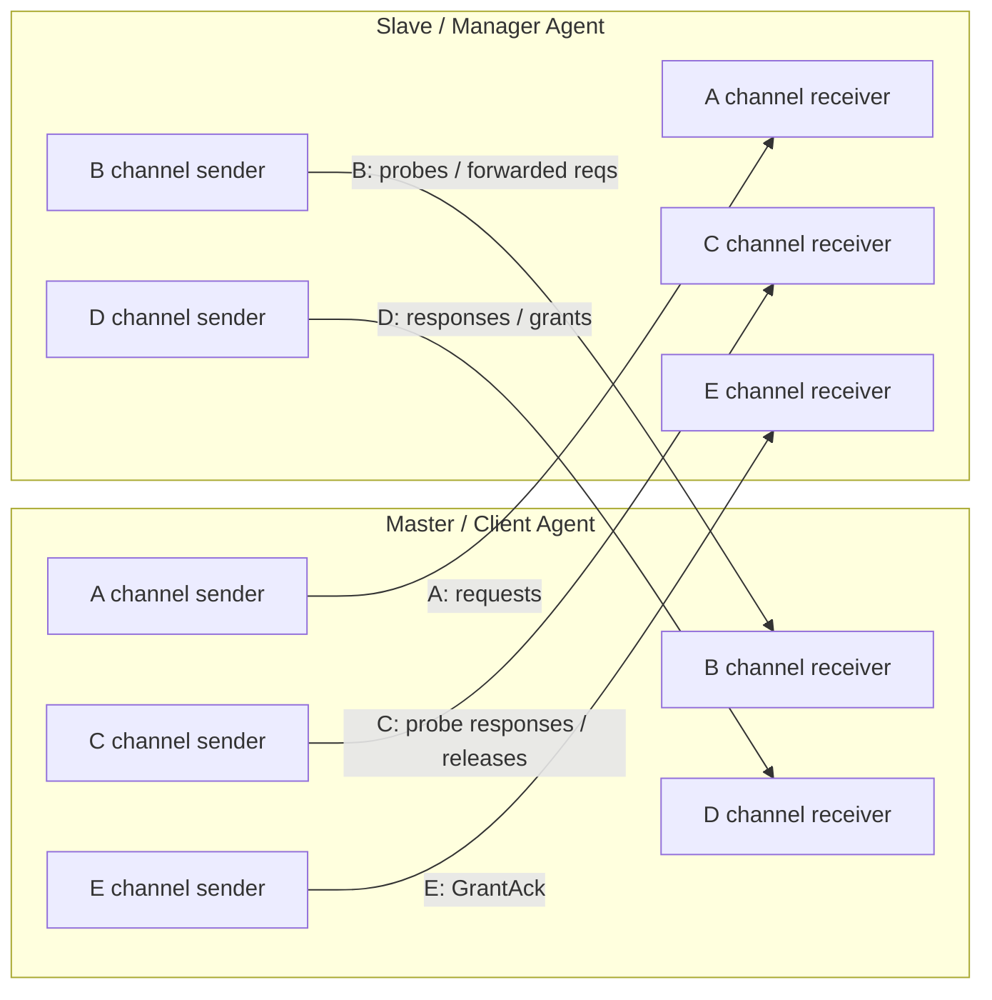
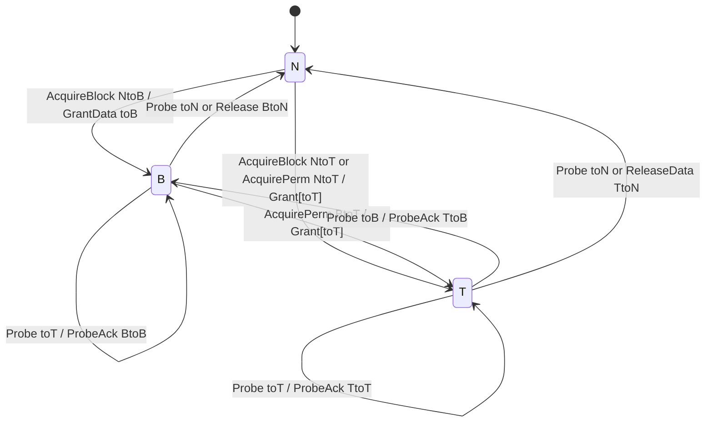
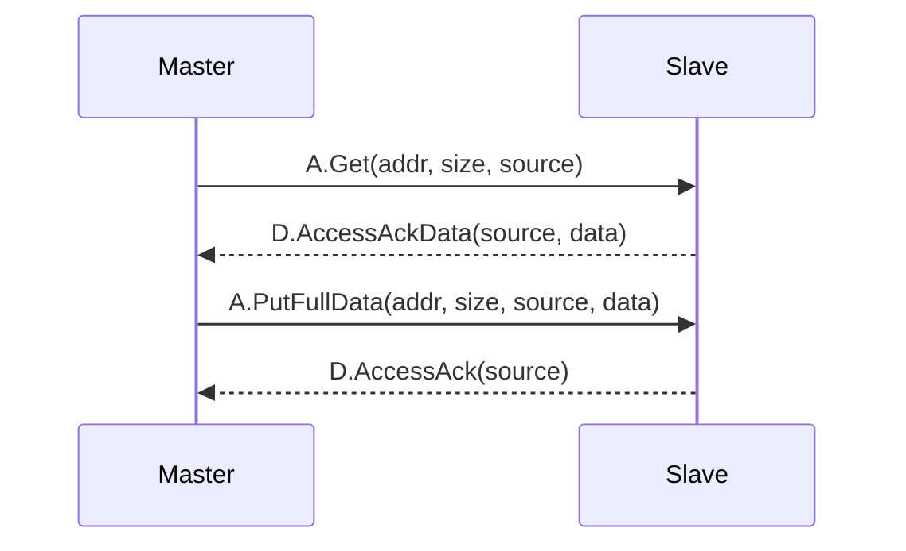
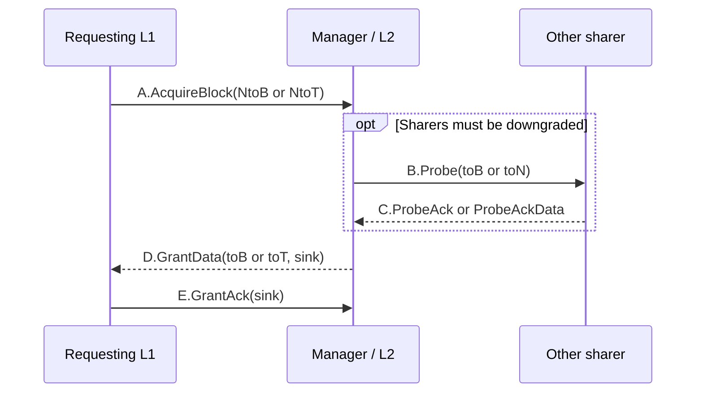
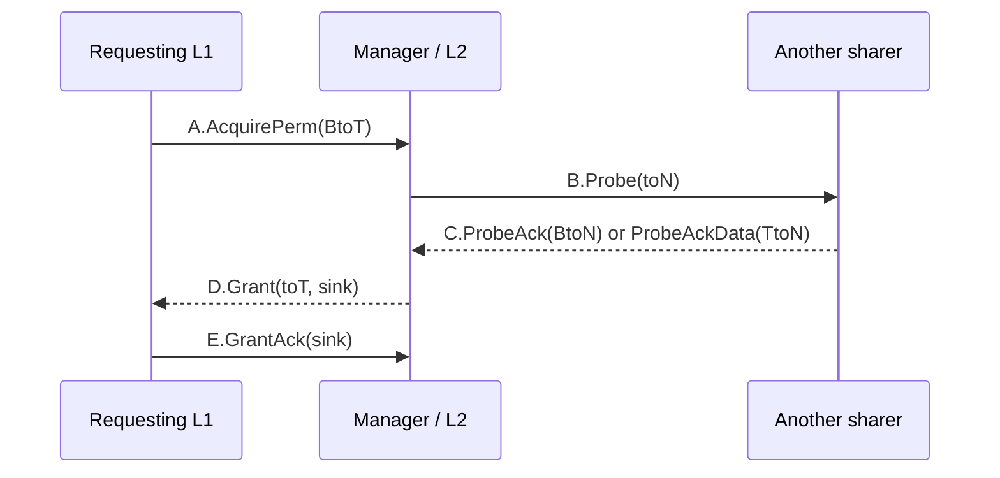
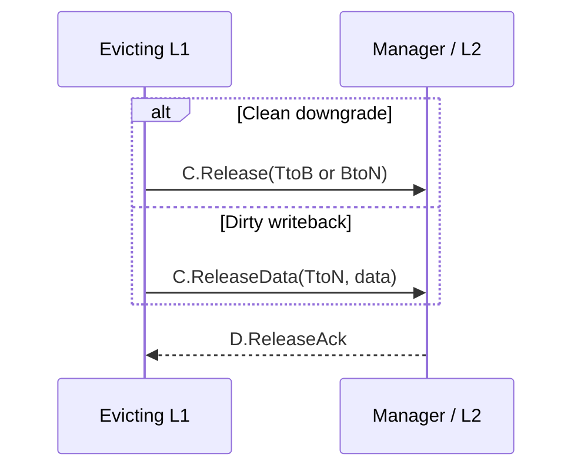
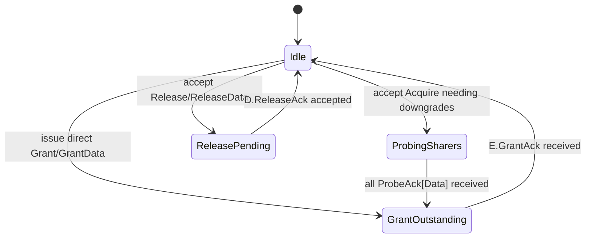
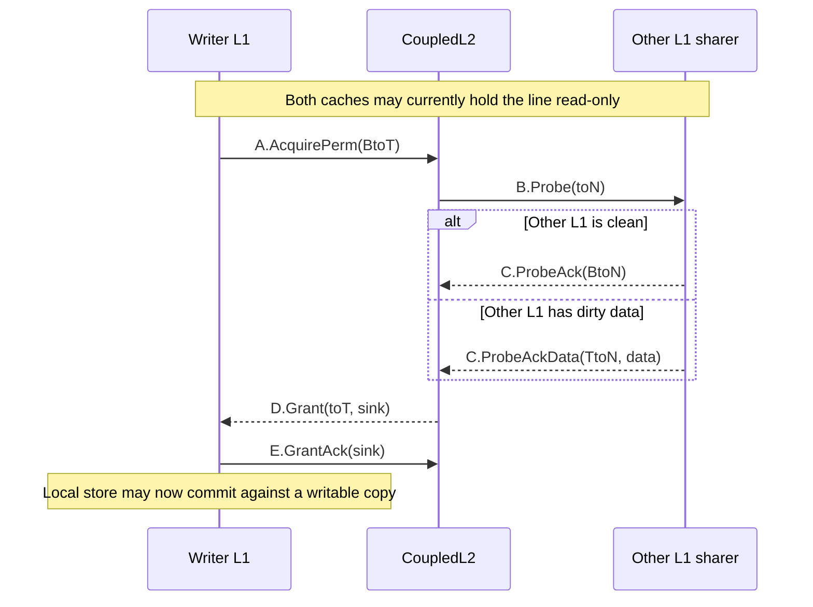

# Appendix I.2 — TileLink Protocol Specification

**Prerequisites:** Appendix I.1 (cache coherence fundamentals), basic familiarity with
valid/ready handshakes, and the notion of a cache block.

**Goal:** Explain TileLink at the protocol level: conformance levels, channel structure,
message families, permission transitions, ordering rules, and the elaboration-time
parameters that determine what a particular TileLink link can legally carry. By the end of
this appendix, the reader should be able to read a TileLink waveform, identify the role of
each channel beat, and understand why `GrantAck` and `ReleaseAck` are necessary for correct
serialization.

**Source note:** This chapter uses the local Rocket-Chip/XiangShan implementation as the
executable baseline when wording in the prose spec and code differ. The local copy of the
SiFive 1.9.3 specification provides the protocol-level narrative
([tilelink_spec_1.9.3.md:163](../../TEMP/tilelink_spec_1.9.3.md#L163),
[tilelink_spec_1.9.3.md:2176](../../TEMP/tilelink_spec_1.9.3.md#L2176)),
while the actual message encodings, bundle fields, and legality checks live in
[Bundles.scala:18](../../rocket-chip/src/main/scala/tilelink/Bundles.scala#L18),
[Edges.scala:343](../../rocket-chip/src/main/scala/tilelink/Edges.scala#L343), and
[Monitor.scala:67](../../rocket-chip/src/main/scala/tilelink/Monitor.scala#L67).

---

## 1. TileLink in One Mental Picture

TileLink is a point-to-point, physically addressed, shared-memory interconnect protocol.
Agents attach to the network through master or slave interfaces, and a single hardware
module may contain both kinds of interfaces
([tilelink_spec_1.9.3.md:222](../../TEMP/tilelink_spec_1.9.3.md#L222),
[tilelink_spec_1.9.3.md:249](../../TEMP/tilelink_spec_1.9.3.md#L249),
[Nodes.scala:13](../../rocket-chip/src/main/scala/tilelink/Nodes.scala#L13),
[Nodes.scala:37](../../rocket-chip/src/main/scala/tilelink/Nodes.scala#L37)).

In XiangShan, TileLink is the inner coherence protocol used between private L1 caches, PTW,
and CoupledL2. CoupledL2 then participates in the outer memory system and CHI-based SoC
interconnect as needed
([CoupledL2.md:101](../../XiangShan-Design-Doc/docs/zh/cache/l2cache/CoupledL2.md#L101),
[CoupledL2.md:112](../../XiangShan-Design-Doc/docs/zh/cache/l2cache/CoupledL2.md#L112)).

### 1.1 Link-Level Block Diagram

The protocol has three standard conformance levels. The spec introduces them as TL-UL,
TL-UH, and TL-C
([tilelink_spec_1.9.3.md:163](../../TEMP/tilelink_spec_1.9.3.md#L163),
[tilelink_spec_1.9.3.md:171](../../TEMP/tilelink_spec_1.9.3.md#L171)).

| Conformance | What it adds | Typical messages |
|---|---|---|
| `TL-UL` | Minimal uncached reads and writes, no bursts | `Get`, `Put*`, `AccessAck*` |
| `TL-UH` | Bursts, atomics, hints | `ArithmeticData`, `LogicalData`, `Hint`/`Intent`, `HintAck` |
| `TL-C` | Coherent cache-block transfers | `Acquire*`, `Probe*`, `Grant*`, `Release*`, `GrantAck` |

At elaboration time, Rocket-Chip instantiates B/C/E only when the client side supports
probes and the manager side supports acquires; this is the `hasBCE` condition in
[Parameters.scala:1330](../../rocket-chip/src/main/scala/tilelink/Parameters.scala#L1330)
through [Parameters.scala:1340](../../rocket-chip/src/main/scala/tilelink/Parameters.scala#L1340).
The concrete top-level bundle therefore contains either `{a,d}` only or the full
`{a,b,c,d,e}` set
([Bundles.scala:260](../../rocket-chip/src/main/scala/tilelink/Bundles.scala#L260),
[Bundles.scala:276](../../rocket-chip/src/main/scala/tilelink/Bundles.scala#L276)).

### 1.2 Why the Protocol Looks Like This

TileLink is designed for low-latency, composable on-chip interconnect. The 1.9.3 spec
emphasizes deadlock freedom, out-of-order completion, decoupled interfaces, and scalable
adaptation as core features
([tilelink_spec_1.9.3.md:151](../../TEMP/tilelink_spec_1.9.3.md#L151)).
The key idea is that the protocol separates:

1. What operations are legal for an address range.
2. What messages are exchanged to realize those operations.
3. How ordering is recovered when messages may overtake one another in the network.

That separation is why TileLink can support both a simple `Get`/`AccessAckData` peripheral
path and a multi-agent coherent transaction with `Probe`, `Grant`, and `GrantAck` on the
same conceptual substrate.

---

## 2. Channels, Beats, and Handshake Rules

### 2.1 The Five Channels

The spec defines five logical channels with a strict global priority order
`A < B < C < D < E`
([tilelink_spec_1.9.3.md:259](../../TEMP/tilelink_spec_1.9.3.md#L259),
[tilelink_spec_1.9.3.md:286](../../TEMP/tilelink_spec_1.9.3.md#L286)).
Their concrete bundle fields are defined in
[Bundles.scala:185](../../rocket-chip/src/main/scala/tilelink/Bundles.scala#L185) through
[Bundles.scala:258](../../rocket-chip/src/main/scala/tilelink/Bundles.scala#L258).

| Channel | Direction | Main job |
|---|---|---|
| `A` | master -> slave | Initiate reads, writes, atomics, hints, and acquires |
| `B` | slave -> master | Probe a cached master or forward a request toward it |
| `C` | master -> slave | Reply to `B` or voluntarily release a block |
| `D` | slave -> master | Return responses, grants, and `ReleaseAck` |
| `E` | master -> slave | Close a grant transaction |

The concrete field sets are asymmetric:

1. A and B carry `opcode`, `param`, `size`, `source`, `address`, `mask`, and optional data
   ([Bundles.scala:185](../../rocket-chip/src/main/scala/tilelink/Bundles.scala#L185),
   [Bundles.scala:202](../../rocket-chip/src/main/scala/tilelink/Bundles.scala#L202)).
2. C carries `opcode`, `param`, `size`, `source`, `address`, and optional data
   ([Bundles.scala:218](../../rocket-chip/src/main/scala/tilelink/Bundles.scala#L218)).
3. D adds `sink` and `denied` because it is the only response channel that can both return
   permissions and refuse an A-channel request
   ([Bundles.scala:235](../../rocket-chip/src/main/scala/tilelink/Bundles.scala#L235)).
4. E is just `sink`
   ([Bundles.scala:253](../../rocket-chip/src/main/scala/tilelink/Bundles.scala#L253)).

Two implementation details matter immediately:

1. Rocket-Chip widens A and D opcodes to four bits because XiangShan also carries custom
   cache-block operations (`CBOClean`, `CBOFlush`, `CBOInval`, `CBOAck`) on those channels
   ([Bundles.scala:42](../../rocket-chip/src/main/scala/tilelink/Bundles.scala#L42),
   [Bundles.scala:190](../../rocket-chip/src/main/scala/tilelink/Bundles.scala#L190),
   [Bundles.scala:240](../../rocket-chip/src/main/scala/tilelink/Bundles.scala#L240)).
2. B and D `param` are only two bits in the concrete bundle because they encode just the
   cap permissions `toT`, `toB`, and `toN`
   ([Bundles.scala:113](../../rocket-chip/src/main/scala/tilelink/Bundles.scala#L113),
   [Bundles.scala:208](../../rocket-chip/src/main/scala/tilelink/Bundles.scala#L208),
   [Bundles.scala:241](../../rocket-chip/src/main/scala/tilelink/Bundles.scala#L241)).

### 2.2 Valid/Ready Is the Only Beat-Level Contract

TileLink uses decoupled valid/ready handshakes on every channel. A beat transfers only when
`valid` and `ready` are both high in the same cycle
([tilelink_spec_1.9.3.md:468](../../TEMP/tilelink_spec_1.9.3.md#L468),
[tilelink_spec_1.9.3.md:472](../../TEMP/tilelink_spec_1.9.3.md#L472)).
The important constraints are:

1. `valid` must never depend combinationally on `ready`.
2. A low-priority `valid` may not depend combinationally on a higher-priority `valid`.
3. A high-priority `ready` may not depend combinationally on a lower-priority `ready`.

These rules are stated explicitly in
[tilelink_spec_1.9.3.md:480](../../TEMP/tilelink_spec_1.9.3.md#L480) through
[tilelink_spec_1.9.3.md:515](../../TEMP/tilelink_spec_1.9.3.md#L515).
They are what let a response bypass a blocked request path without reintroducing a cyclic
wait condition.

### 2.3 Multibeat Messages

Messages with data may span multiple beats. Once a burst begins on a channel, TileLink
forbids interleaving beats from any other message on that same channel until the burst is
complete
([tilelink_spec_1.9.3.md:461](../../TEMP/tilelink_spec_1.9.3.md#L461),
[tilelink_spec_1.9.3.md:464](../../TEMP/tilelink_spec_1.9.3.md#L464)).
For an in-progress burst, control fields must remain constant and only the data address
advances beat by beat
([tilelink_spec_1.9.3.md:523](../../TEMP/tilelink_spec_1.9.3.md#L523),
[tilelink_spec_1.9.3.md:539](../../TEMP/tilelink_spec_1.9.3.md#L539)).

This rule explains why caches and bridges almost always keep a small burst state machine: the
protocol does not let them "time-slice" one D-channel line refill with another once the
first refill has started.

### 2.4 Timing View: One Legal `GrantData` Timeline

The exact latency between request and response is unconstrained; the spec explicitly forbids
protocol timeouts inside the TileLink network
([tilelink_spec_1.9.3.md:710](../../TEMP/tilelink_spec_1.9.3.md#L710),
[tilelink_spec_1.9.3.md:828](../../TEMP/tilelink_spec_1.9.3.md#L828)).
The table below is therefore only an example of a legal timeline for a 64-byte cache line
returning over a 16-byte D channel.

| Cycle | A | B/C | D | E | Meaning |
|---|---|---|---|---|---|
| `t0` | `AcquireBlock` beat 0 | — | — | — | Request accepted |
| `t1..tk-1` | — | optional `Probe` / `ProbeAck[Data]` | — | — | Manager resolves sharers |
| `tk` | — | — | `GrantData` beat 0 | — | First response beat |
| `tk+1` | — | — | `GrantData` beat 1 | — | Burst continues |
| `tk+2` | — | — | `GrantData` beat 2 | — | Burst continues |
| `tk+3` | — | — | `GrantData` beat 3 | — | Last data beat |
| `tk+4` | — | — | — | `GrantAck` | Requestor closes transaction |

The only fixed protocol facts here are that response beats may arrive long after the request,
beats within the D burst may not be interleaved with another D message, and the manager may
use `GrantAck` to delay later same-block transactions until the first grant is definitely
complete.

---

## 3. Message Families and the Local Rocket-Chip Dialect

### 3.1 Base Message Summary

The complete standard message set appears in the local spec copy
([tilelink_spec_1.9.3.md:1292](../../TEMP/tilelink_spec_1.9.3.md#L1292),
[tilelink_spec_1.9.3.md:1321](../../TEMP/tilelink_spec_1.9.3.md#L1321)),
while the local implementation encodes the same families in `TLMessages`
([Bundles.scala:18](../../rocket-chip/src/main/scala/tilelink/Bundles.scala#L18)).

| Message family | Channel(s) | Purpose | Canonical response |
|---|---|---|---|
| `Get`, `PutFullData`, `PutPartialData` | A -> D | Uncached reads and writes | `AccessAckData`, `AccessAck` |
| `ArithmeticData`, `LogicalData` | A -> D | AMO read-modify-write | `AccessAckData` |
| `Hint` / `Intent` | A -> D | Informational hint or cache-management request | `HintAck` |
| `AcquireBlock`, `AcquirePerm` | A -> D -> E | Cached copy or permission upgrade | `Grant*`, then `GrantAck` |
| `Probe` | B -> C | Force a cache to cap or report permissions | `ProbeAck`, `ProbeAckData` |
| `Release`, `ReleaseData` | C -> D | Voluntary downgrade / writeback | `ReleaseAck` |

Rocket-Chip provides concrete constructors for all of these in
[Edges.scala:343](../../rocket-chip/src/main/scala/tilelink/Edges.scala#L343) through
[Edges.scala:860](../../rocket-chip/src/main/scala/tilelink/Edges.scala#L860).

### 3.2 Naming Differences You Must Not Miss

The prose spec and the local executable implementation are close, but not identical.

> **Implementation Note: Spec Names vs. XiangShan/Rocket-Chip Names**
>
> The 1.9.3 prose spec uses `Intent`, `ProbeBlock`, and `ProbePerm`
> ([tilelink_spec_1.9.3.md:1305](../../TEMP/tilelink_spec_1.9.3.md#L1305),
> [tilelink_spec_1.9.3.md:1313](../../TEMP/tilelink_spec_1.9.3.md#L1313)).
> The local implementation uses `Hint` and a single `Probe` opcode whose `param` field carries
> the cap target
> ([Bundles.scala:26](../../rocket-chip/src/main/scala/tilelink/Bundles.scala#L26),
> [Bundles.scala:29](../../rocket-chip/src/main/scala/tilelink/Bundles.scala#L29),
> [Edges.scala:648](../../rocket-chip/src/main/scala/tilelink/Edges.scala#L648)).
> For XiangShan RTL work, the bundle/code names are the ones that appear in waveforms and
> helper constructors.

### 3.3 `AcquireBlock` vs. `AcquirePerm`

`AcquireBlock` asks for a cached copy of the block and may return data via `GrantData`.
`AcquirePerm` asks only for a permission upgrade and must be used only when the requester
does not need the data payload to complete the initiating operation
([tilelink_spec_1.9.3.md:2505](../../TEMP/tilelink_spec_1.9.3.md#L2505),
[tilelink_spec_1.9.3.md:2543](../../TEMP/tilelink_spec_1.9.3.md#L2543)).

This distinction matters in practice. The spec requires a manager that accepts
`AcquirePerm` to remember that the requestor may hold permissions without valid block data
until it later writes the block fully dirty, returns data in `ProbeAckData`, or releases the
line with `ReleaseData`
([tilelink_spec_1.9.3.md:2549](../../TEMP/tilelink_spec_1.9.3.md#L2549)).

Rocket-Chip's monitor adds one more important legality rule: `AcquirePerm` may not request
`NtoB`; a permission-only acquire is meaningful only for upgrades that include write intent
([Monitor.scala:92](../../rocket-chip/src/main/scala/tilelink/Monitor.scala#L92),
[Monitor.scala:99](../../rocket-chip/src/main/scala/tilelink/Monitor.scala#L99)).

### 3.4 B/C Are Not "Probe Only"

Many simplified descriptions say that channel B is only for probes and channel C is only for
probe responses. That is incomplete. The spec explicitly allows `Get`, `Put*`, atomics, and
hints on B/C as forwarded master-directed requests and responses
([tilelink_spec_1.9.3.md:1333](../../TEMP/tilelink_spec_1.9.3.md#L1333) through
[tilelink_spec_1.9.3.md:1347](../../TEMP/tilelink_spec_1.9.3.md#L1347)).
The local implementation has corresponding constructors and legality checks in
[Edges.scala:711](../../rocket-chip/src/main/scala/tilelink/Edges.scala#L711) through
[Edges.scala:860](../../rocket-chip/src/main/scala/tilelink/Edges.scala#L860) and
[Monitor.scala:177](../../rocket-chip/src/main/scala/tilelink/Monitor.scala#L177) through
[Monitor.scala:230](../../rocket-chip/src/main/scala/tilelink/Monitor.scala#L230).

XiangShan's common cache-coherence path mainly uses B/C for `Probe` and `ProbeAck[Data]`,
but the broader message space exists because TileLink is a general interconnect, not only a
cache protocol.

### 3.5 Error Signaling

TileLink has two error-related concepts:

1. `corrupt`: per-beat data corruption, present on data-carrying channels.
2. `denied`: D-channel refusal of an A-channel request.

The spec makes `denied` D-channel-only and requires denied data responses to also mark the
payload corrupt
([tilelink_spec_1.9.3.md:834](../../TEMP/tilelink_spec_1.9.3.md#L834) through
[tilelink_spec_1.9.3.md:863](../../TEMP/tilelink_spec_1.9.3.md#L863)).
The monitor encodes the same rule for `GrantData` and `AccessAckData`
([Monitor.scala:328](../../rocket-chip/src/main/scala/tilelink/Monitor.scala#L328) through
[Monitor.scala:351](../../rocket-chip/src/main/scala/tilelink/Monitor.scala#L351)).

One coherence-specific consequence follows immediately: `ReleaseAck` can never be denied, so
it is purely an acknowledgment and not a permission negotiation
([tilelink_spec_1.9.3.md:2893](../../TEMP/tilelink_spec_1.9.3.md#L2893),
[Monitor.scala:310](../../rocket-chip/src/main/scala/tilelink/Monitor.scala#L310)).

---

## 4. Addresses, Routing IDs, and Operation Ordering

### 4.1 Address Determines Legality

All TileLink addresses are physical. For any valid address, routing must lead to exactly one
owning slave, and the address range determines what operations are legal, whether caching is
allowed, whether FIFO ordering is promised, and so on
([tilelink_spec_1.9.3.md:1360](../../TEMP/tilelink_spec_1.9.3.md#L1360) through
[tilelink_spec_1.9.3.md:1412](../../TEMP/tilelink_spec_1.9.3.md#L1412)).

This is why the helper constructors in `TLEdgeOut` and `TLEdgeIn` always compute a `legal`
bit alongside the outgoing bundle: the legality of `Get`, `Put`, `Acquire`, `Probe`, and so
on is not global; it is edge- and address-dependent
([Edges.scala:343](../../rocket-chip/src/main/scala/tilelink/Edges.scala#L343),
[Edges.scala:477](../../rocket-chip/src/main/scala/tilelink/Edges.scala#L477),
[Edges.scala:648](../../rocket-chip/src/main/scala/tilelink/Edges.scala#L648)).

### 4.2 Source and Sink IDs

TileLink responses may return out of order, so every unanswered request must carry enough
identity to match the later response
([tilelink_spec_1.9.3.md:1429](../../TEMP/tilelink_spec_1.9.3.md#L1429)).

| Request path | Routing field | Outstanding-uniqueness rule |
|---|---|---|
| A -> D | `a_source` / `d_source` | `a_source` unique among unanswered A-channel requests |
| B -> C | `b_source + b_address` | pair unique among unanswered B-channel requests |
| C -> D (`Release*`) | `c_source` / `d_source` | `c_source` unique among unanswered C-channel requests |
| D -> E (`Grant*`) | `d_sink` / `e_sink` | `d_sink` unique among unanswered grants |

These rules are stated in the prose spec
([tilelink_spec_1.9.3.md:1450](../../TEMP/tilelink_spec_1.9.3.md#L1450) through
[tilelink_spec_1.9.3.md:1475](../../TEMP/tilelink_spec_1.9.3.md#L1475)),
and the local monitor literally tracks them with in-flight bitmaps for A->D, C->D, and
D->E transactions
([Monitor.scala:604](../../rocket-chip/src/main/scala/tilelink/Monitor.scala#L604) through
[Monitor.scala:709](../../rocket-chip/src/main/scala/tilelink/Monitor.scala#L709),
[Monitor.scala:715](../../rocket-chip/src/main/scala/tilelink/Monitor.scala#L715) through
[Monitor.scala:845](../../rocket-chip/src/main/scala/tilelink/Monitor.scala#L845)).

### 4.3 Responses Need Not Return in Request Order

TileLink explicitly allows multiple outstanding operations and out-of-order completion
([tilelink_spec_1.9.3.md:1518](../../TEMP/tilelink_spec_1.9.3.md#L1518)).
What a response does guarantee is stronger than "the request was accepted": once the response
has been sent, the operation's effect must already be globally serialized with respect to
that responder's view of the world
([tilelink_spec_1.9.3.md:1520](../../TEMP/tilelink_spec_1.9.3.md#L1520) through
[tilelink_spec_1.9.3.md:1545](../../TEMP/tilelink_spec_1.9.3.md#L1545)).

That rule is why software can implement fences by waiting for acknowledgments. The protocol
does not promise FIFO completion, but it does promise that an acknowledgment is not allowed
to get ahead of the actual visibility point it represents.

---

## 5. The TileLink Permission Model

### 5.1 Permissions Are About the Coherence Tree

TileLink coherence is defined over a tree induced by all cacheable paths between a root
manager and its caching clients
([tilelink_spec_1.9.3.md:2188](../../TEMP/tilelink_spec_1.9.3.md#L2188) through
[tilelink_spec_1.9.3.md:2198](../../TEMP/tilelink_spec_1.9.3.md#L2198)).
XiangShan's CoupledL2 design document states the same idea directly: the hierarchy grows
from memory upward through L3, L2, and L1, and child permissions may not exceed parent
permissions
([CoupledL2.md:112](../../XiangShan-Design-Doc/docs/zh/cache/l2cache/CoupledL2.md#L112),
[CoupledL2.md:119](../../XiangShan-Design-Doc/docs/zh/cache/l2cache/CoupledL2.md#L119)).

At protocol level, the important concepts are:

1. `N` / None: no cached copy and no permission. The closest local names are
   [`Nothing`](../../rocket-chip/src/main/scala/tilelink/Metadata.scala#L14) and
   [`N`](../../XiangShan-Design-Doc/docs/zh/cache/l2cache/CoupledL2.md#L112).
2. `B` / Branch: read-only cached copy. The closest local names are
   [`Branch`](../../rocket-chip/src/main/scala/tilelink/Metadata.scala#L15) and
   [`B`](../../XiangShan-Design-Doc/docs/zh/cache/l2cache/CoupledL2.md#L112).
3. `T` / Trunk: writable path or serialization path in the tree. The closest local names are
   [`Trunk`](../../rocket-chip/src/main/scala/tilelink/Metadata.scala#L16) and
   [`T`](../../XiangShan-Design-Doc/docs/zh/cache/l2cache/CoupledL2.md#L112).
4. Tip-like writable leaf: unique topmost writable holder. Local refinements include
   [`Dirty`](../../rocket-chip/src/main/scala/tilelink/Metadata.scala#L17) and
   [`TT`](../../XiangShan-Design-Doc/docs/zh/cache/l2cache/CoupledL2.md#L117).

The exact local state decomposition is implementation-specific. Rocket-Chip client metadata
distinguishes `Trunk` and `Dirty`, whereas the XiangShan CoupledL2 design document uses `T`
and `TT`. The important protocol invariant is the same: at most one writable path exists for
an address at a time.

### 5.2 Permission Transition Encodings

The local implementation exposes the full encoding family in `TLPermissions`
([Bundles.scala:107](../../rocket-chip/src/main/scala/tilelink/Bundles.scala#L107) through
[Bundles.scala:140](../../rocket-chip/src/main/scala/tilelink/Bundles.scala#L140)).

| Category | Encodings | Used by |
|---|---|---|
| Cap | `toT`, `toB`, `toN` | `Probe`, `Grant`, `GrantData` |
| Grow | `NtoB`, `NtoT`, `BtoT` | `AcquireBlock`, `AcquirePerm` |
| Shrink | `TtoB`, `TtoN`, `BtoN` | `Release*`, `ProbeAck*` |
| Report | `TtoT`, `BtoB`, `NtoN` | `ProbeAck`, `Release` |

This matches the protocol table in the spec
([tilelink_spec_1.9.3.md:2309](../../TEMP/tilelink_spec_1.9.3.md#L2309) through
[tilelink_spec_1.9.3.md:2318](../../TEMP/tilelink_spec_1.9.3.md#L2318)).

Two legality constraints are easy to forget:

1. `ProbeAckData` may not use `NtoN`, because dirty data cannot legitimately come from a
   non-holder
   ([tilelink_spec_1.9.3.md:2700](../../TEMP/tilelink_spec_1.9.3.md#L2700)).
2. `Grant` and `GrantData` may not return `toN`; a grant must actually grant something
   ([Monitor.scala:318](../../rocket-chip/src/main/scala/tilelink/Monitor.scala#L318) through
   [Monitor.scala:333](../../rocket-chip/src/main/scala/tilelink/Monitor.scala#L333)).

### 5.3 Leaf-Cache Permission State Diagram

The following diagram is the simplest useful mental model for a private cache line. It
shows only the stable permission effects that a leaf cache observes.

The subtle point is that these transitions describe the *leaf cache's* view. An inner cache
such as CoupledL2 may sit on the trunk while some higher private cache holds the tip-like
writable copy.

### 5.4 Access Rights by Permission

The spec's access table says what a holder may do locally once it has a particular position
in the tree
([tilelink_spec_1.9.3.md:2225](../../TEMP/tilelink_spec_1.9.3.md#L2225)).
The high-level summary is:

| Permission | Local accesses that are safe |
|---|---|
| `N` | none |
| `B` | reads only |
| `T` without being the tip-like leaf | typically read only locally; writable authority is farther upward |
| tip-like writable leaf | reads and writes, including atomics |

This is why an upgrade from `B` to write authority is not a local metadata flip. It is a
tree reconfiguration that may require invalidating or downgrading other sharers first.

---

## 6. Canonical Transaction Flows

### 6.1 Uncached `Get` and `Put`

TL-UL/TL-UH memory accesses are two-stage transactions: request on A, response on D
([tilelink_spec_1.9.3.md:1256](../../TEMP/tilelink_spec_1.9.3.md#L1256),
[tilelink_spec_1.9.3.md:1562](../../TEMP/tilelink_spec_1.9.3.md#L1562)).

Although the flow is simple, the response is still allowed to return later and out of order
with respect to other in-flight requests. The master must match by `source`, not by
"oldest-first" intuition.

### 6.2 `AcquireBlock`: Bring Data and Permission

`AcquireBlock` is the normal miss message when a cache needs data. The master constructs it
with a grow parameter (`NtoB`, `NtoT`, or `BtoT`) and receives either `Grant` or
`GrantData`
([Edges.scala:343](../../rocket-chip/src/main/scala/tilelink/Edges.scala#L343),
[tilelink_spec_1.9.3.md:2505](../../TEMP/tilelink_spec_1.9.3.md#L2505)).

The manager may choose `Grant` or `GrantData` depending on whether data must be returned.
The requestor must return `GrantAck` either way
([tilelink_spec_1.9.3.md:2289](../../TEMP/tilelink_spec_1.9.3.md#L2289),
[Edges.scala:663](../../rocket-chip/src/main/scala/tilelink/Edges.scala#L663),
[Edges.scala:679](../../rocket-chip/src/main/scala/tilelink/Edges.scala#L679),
[Edges.scala:469](../../rocket-chip/src/main/scala/tilelink/Edges.scala#L469)).

### 6.3 `AcquirePerm`: Upgrade Without Data

`AcquirePerm` has the same outer shape as `AcquireBlock`, but it exists specifically for
permission-only upgrades
([Edges.scala:360](../../rocket-chip/src/main/scala/tilelink/Edges.scala#L360),
[tilelink_spec_1.9.3.md:2543](../../TEMP/tilelink_spec_1.9.3.md#L2543)).
The most common case is `BtoT` on a store hit to a shared line.

This is a pure permission transfer: no data is returned on D, but the manager still needs
the same serialization machinery because other caches may have to relinquish permissions
before the upgrade becomes legal.

### 6.4 Voluntary `Release` and `ReleaseData`

When a cache evicts or downgrades a line voluntarily, it uses channel C and waits for
`ReleaseAck` on D
([tilelink_spec_1.9.3.md:2824](../../TEMP/tilelink_spec_1.9.3.md#L2824),
[Edges.scala:397](../../rocket-chip/src/main/scala/tilelink/Edges.scala#L397),
[Edges.scala:413](../../rocket-chip/src/main/scala/tilelink/Edges.scala#L413),
[Edges.scala:695](../../rocket-chip/src/main/scala/tilelink/Edges.scala#L695)).

The requestor must not treat the line as fully released until `ReleaseAck` arrives. This is
the protocol's way of serializing voluntary writeback against other same-block activity.

---

## 7. Deadlock Freedom and Serialization

### 7.1 Why the Channel Priorities Exist

The global priority order `A < B < C < D < E` is not decorative. It is the structural rule
that prevents cyclic waiting between request and response traffic
([tilelink_spec_1.9.3.md:286](../../TEMP/tilelink_spec_1.9.3.md#L286)).
The valid/ready constraints from Section 2 ensure that a low-priority request cannot wait on
the same-cycle presence of a higher-priority response, and that a high-priority response
cannot be blocked by a lower-priority readiness dependency
([tilelink_spec_1.9.3.md:494](../../TEMP/tilelink_spec_1.9.3.md#L494) through
[tilelink_spec_1.9.3.md:499](../../TEMP/tilelink_spec_1.9.3.md#L499)).

### 7.2 Same-Block Concurrency Rules

TileLink does **not** assume ordered delivery through the network. Because of that, same-block
concurrency is constrained explicitly in the spec:

1. A master must not issue a second `Acquire`/access on a block while it is still waiting for
   the first `Grant`.
2. A slave must not issue a `Grant` while a same-block `ProbeAck[Data]` it depends on is still
   pending.
3. A slave must not issue a new `Probe` while a same-block `GrantAck` is still pending.
4. A master must not answer a same-block probe after it has started a voluntary `Release`
   until `ReleaseAck` returns.

These rules appear in
[tilelink_spec_1.9.3.md:2403](../../TEMP/tilelink_spec_1.9.3.md#L2403) through
[tilelink_spec_1.9.3.md:2427](../../TEMP/tilelink_spec_1.9.3.md#L2427).

### 7.3 Conceptual Slave-Side Serialization FSM

Real implementations track this with MSHRs, not with one monolithic FSM per bus. Still, the
protocol obligations can be summarized as a simple conceptual state machine for one block.

Two observations matter:

1. `GrantAck` is what closes the grant transaction, not the act of putting the grant on D.
2. `ReleaseAck` is what closes the voluntary writeback transaction, not the act of observing
   the C beat.

These are exactly the serialization points the spec uses in its overtaking examples
([tilelink_spec_1.9.3.md:2430](../../TEMP/tilelink_spec_1.9.3.md#L2430) through
[tilelink_spec_1.9.3.md:2498](../../TEMP/tilelink_spec_1.9.3.md#L2498)).

### 7.4 `TLMonitor` as Executable Protocol Documentation

The strongest evidence that these are real invariants and not just prose is in the monitor:

1. It rejects source-ID reuse on A and C while a request is in flight
   ([Monitor.scala:652](../../rocket-chip/src/main/scala/tilelink/Monitor.scala#L652),
   [Monitor.scala:760](../../rocket-chip/src/main/scala/tilelink/Monitor.scala#L760)).
2. It rejects sink-ID reuse on D before the matching E arrives
   ([Monitor.scala:830](../../rocket-chip/src/main/scala/tilelink/Monitor.scala#L830) through
   [Monitor.scala:844](../../rocket-chip/src/main/scala/tilelink/Monitor.scala#L844)).
3. It optionally runs a simulation watchdog for lack of progress, but that watchdog is a bug
   detector, not protocol behavior
   ([Monitor.scala:706](../../rocket-chip/src/main/scala/tilelink/Monitor.scala#L706),
   [Monitor.scala:815](../../rocket-chip/src/main/scala/tilelink/Monitor.scala#L815)).

> **Design Trade-off: Why `GrantAck` Exists Instead of Assuming Ordered Delivery**
>
> A simpler protocol could say: once the manager sends `Grant`, later same-address traffic to
> the same cache is automatically ordered behind it. TileLink refuses to make that assumption,
> because the network is allowed to reorder and bypass messages aggressively. `GrantAck`
> therefore adds an explicit final handshake so the manager knows the grant has definitely
> reached the requester and can safely serialize later `Probe` or `Grant` traffic behind it
> ([tilelink_spec_1.9.3.md:2435](../../TEMP/tilelink_spec_1.9.3.md#L2435) through
> [tilelink_spec_1.9.3.md:2440](../../TEMP/tilelink_spec_1.9.3.md#L2440)).
> The cost is one extra channel and one extra in-flight state structure; the benefit is
> composable deadlock freedom without assuming stronger network ordering than the fabric
> actually provides.

---

## 8. Parameterization and Elaboration-Time Constraints

TileLink's wire widths and legal operation sets are not globally fixed. They are derived from
the negotiated client and manager parameters on each edge
([Parameters.scala:1330](../../rocket-chip/src/main/scala/tilelink/Parameters.scala#L1330),
[Parameters.scala:1343](../../rocket-chip/src/main/scala/tilelink/Parameters.scala#L1343)).

### 8.1 Core Edge Parameters

1. [`beatBytes`](../../rocket-chip/src/main/scala/tilelink/Parameters.scala#L513):
   data width of the link. `TLBundleParameters` turns it into `dataBits = beatBytes * 8`
   at [Parameters.scala:1331](../../rocket-chip/src/main/scala/tilelink/Parameters.scala#L1331).
2. [`endSourceId`](../../rocket-chip/src/main/scala/tilelink/Parameters.scala#L1082):
   upper bound of the client-side source namespace. The bundle derives `sourceBits` from
   it at [Parameters.scala:1334](../../rocket-chip/src/main/scala/tilelink/Parameters.scala#L1334).
3. [`endSinkId`](../../rocket-chip/src/main/scala/tilelink/Parameters.scala#L514):
   number of outstanding D->E grant sinks. The bundle derives `sinkBits` from it at
   [Parameters.scala:1335](../../rocket-chip/src/main/scala/tilelink/Parameters.scala#L1335).
4. [`requestFifo`](../../rocket-chip/src/main/scala/tilelink/Parameters.scala#L807):
   client-side request for A-channel FIFO completion within a FIFO domain.
5. [`fifoId`](../../rocket-chip/src/main/scala/tilelink/Parameters.scala#L168):
   manager-side FIFO domain tag that makes that ordering promise meaningful.
6. [`hasBCE`](../../rocket-chip/src/main/scala/tilelink/Parameters.scala#L1340):
   true only when the edge is coherent enough to require B/C/E.

### 8.2 Capability Sets

Two capability records define the legal transfer sizes and message families:

1. [`TLMasterToSlaveTransferSizes`](../../rocket-chip/src/main/scala/tilelink/Parameters.scala#L14)
   for A->D traffic such as `Get`, `Put`, `Acquire`, and hints.
2. [`TLSlaveToMasterTransferSizes`](../../rocket-chip/src/main/scala/tilelink/Parameters.scala#L86)
   for B->C traffic such as `Probe` and forwarded requests.

Managers advertise what they support; clients advertise what they can emit or receive. The
parameter classes enforce consistency relationships such as:

1. `PutFull` must cover `PutPartial`, arithmetic, and logical operations.
2. `Get` must cover arithmetic and logical operations.
3. `AcquireB` support must cover `AcquireT`.

These checks appear in
[Parameters.scala:212](../../rocket-chip/src/main/scala/tilelink/Parameters.scala#L212) through
[Parameters.scala:218](../../rocket-chip/src/main/scala/tilelink/Parameters.scala#L218).

### 8.3 FIFO Domains Are Optional and Local

TileLink is out-of-order by default. FIFO ordering is an address/property-level refinement,
not a universal protocol guarantee
([tilelink_spec_1.9.3.md:1407](../../TEMP/tilelink_spec_1.9.3.md#L1407) through
[tilelink_spec_1.9.3.md:1412](../../TEMP/tilelink_spec_1.9.3.md#L1412)).

Rocket-Chip implements the local promise with `TLFIFOFixer`, which stalls a new A-channel
request from a FIFO-requesting source if another FIFO-domain request from that source is
already outstanding
([FIFOFixer.scala:71](../../rocket-chip/src/main/scala/tilelink/FIFOFixer.scala#L71) through
[FIFOFixer.scala:90](../../rocket-chip/src/main/scala/tilelink/FIFOFixer.scala#L90)).

This is an excellent example of the TileLink design philosophy: global semantics are weak by
default, and stronger ordering is opt-in, local, and attached to the edge parameters.

---

## 9. Worked Example: XiangShan Store Upgrade on a Shared Line

Consider a XiangShan core whose L1 DCache already holds a cache line in read-only state and
now executes a store. CoupledL2 is the manager for that inner TileLink link, and another L1
may also share the same line
([CoupledL2.md:101](../../XiangShan-Design-Doc/docs/zh/cache/l2cache/CoupledL2.md#L101),
[CoupledL2.md:112](../../XiangShan-Design-Doc/docs/zh/cache/l2cache/CoupledL2.md#L112)).

### 9.1 Sequence Diagram

### 9.2 What Each Step Means

1. The writer sends `AcquirePerm(BtoT)` because it already has the data and only needs
   stronger permission
   ([Edges.scala:360](../../rocket-chip/src/main/scala/tilelink/Edges.scala#L360),
   [tilelink_spec_1.9.3.md:2555](../../TEMP/tilelink_spec_1.9.3.md#L2555)).
2. CoupledL2 serializes the upgrade and probes other sharers to drop their copies
   ([Edges.scala:648](../../rocket-chip/src/main/scala/tilelink/Edges.scala#L648)).
3. Each probed L1 responds with `ProbeAck` if clean or `ProbeAckData` if it must return dirty
   data
   ([Edges.scala:435](../../rocket-chip/src/main/scala/tilelink/Edges.scala#L435),
   [Edges.scala:452](../../rocket-chip/src/main/scala/tilelink/Edges.scala#L452)).
4. Once the manager has enough permission to make the upgrade legal, it issues `Grant(toT)`
   and allocates a `sink` for the matching `GrantAck`
   ([Edges.scala:663](../../rocket-chip/src/main/scala/tilelink/Edges.scala#L663)).
5. The writer returns `GrantAck`, which is what lets the manager treat the transaction as
   closed and admit later same-block probes or grants
   ([Edges.scala:469](../../rocket-chip/src/main/scala/tilelink/Edges.scala#L469),
   [tilelink_spec_1.9.3.md:2812](../../TEMP/tilelink_spec_1.9.3.md#L2812)).

### 9.3 Why `AcquirePerm` Is Worth Having

Without `AcquirePerm`, the writer would have to request the whole block again with
`AcquireBlock`, even though it already owns a valid clean copy. The permission-only message
avoids unnecessary data traffic on D. The trade-off is that the manager must now track the
subtle distinction between "permission granted" and "data definitely valid" for that holder
until a full write or later writeback closes the gap
([tilelink_spec_1.9.3.md:2549](../../TEMP/tilelink_spec_1.9.3.md#L2549)).

---

## 10. Key Takeaways

- TileLink is best understood as a five-channel, decoupled message protocol whose
  deadlock-freedom comes from strict cross-channel priority plus strict valid/ready rules.
- `A` and `D` are the universal request/response pair; `B`, `C`, and `E` appear only when
  the edge is coherent enough to support probes and acquires.
- Permission changes are encoded as `Cap`, `Grow`, `Shrink`, and `Report` transitions, not
  as ad hoc message-specific enums.
- `GrantAck` and `ReleaseAck` are serialization points, not optional niceties. They are what
  make same-block overtaking safe on a reordered network.
- The concrete XiangShan/Rocket-Chip dialect differs slightly from the 1.9.3 prose spec in
  names and opcode width, so waveforms should be interpreted with the local bundle
  definitions in hand.

---

## 11. Checkpoint Questions

1. **Basic:** Why are B, C, and E absent on a non-coherent TileLink edge?
2. **Basic:** What is the difference between `AcquireBlock` and `AcquirePerm`?
3. **Intermediate:** Why is `GrantAck` necessary if the manager already sent the `Grant`?
4. **Intermediate:** Why may TileLink responses return out of order even though fences can
   still be implemented by waiting for acknowledgments?
5. **Intermediate:** Under what condition may a manager legally send `ProbeAckData` instead
   of `ProbeAck`?
6. **Advanced:** Explain why a master that has issued `ReleaseData` cannot immediately answer
   a later same-block probe with a new `ProbeAck` before receiving `ReleaseAck`.
7. **Advanced:** Suppose two `Acquire`s to the same block are outstanding from one cache.
   What must be true about their IDs, and why can the cache not assume the manager will
   serialize them in request order?

---

## 12. Further Reading

1. SiFive TileLink specification v1.9.3 online PDF:
   [TileLink Spec 1.9.3](https://www.sifive.com/document-file/tilelink-spec-1.9.3)
2. Rocket-Chip message and permission encodings:
   [Bundles.scala](../../rocket-chip/src/main/scala/tilelink/Bundles.scala)
3. Rocket-Chip concrete message constructors:
   [Edges.scala](../../rocket-chip/src/main/scala/tilelink/Edges.scala)
4. Rocket-Chip protocol checker and executable invariants:
   [Monitor.scala](../../rocket-chip/src/main/scala/tilelink/Monitor.scala)
5. XiangShan CoupledL2 design note on TileLink coherence states:
   [CoupledL2.md](../../XiangShan-Design-Doc/docs/zh/cache/l2cache/CoupledL2.md)
