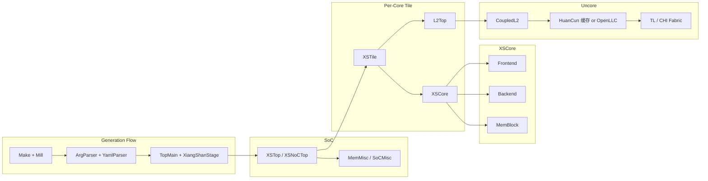
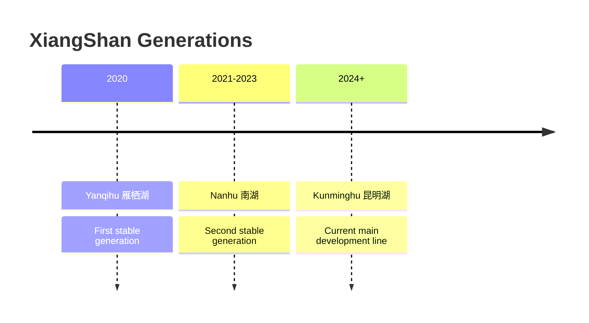
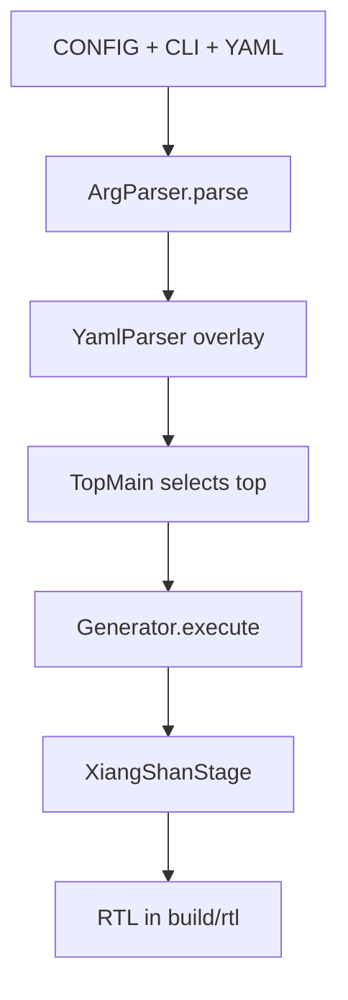
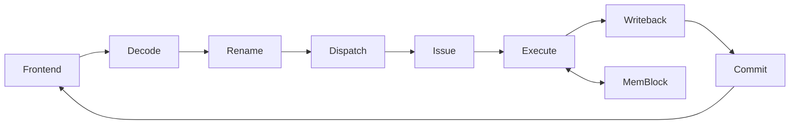
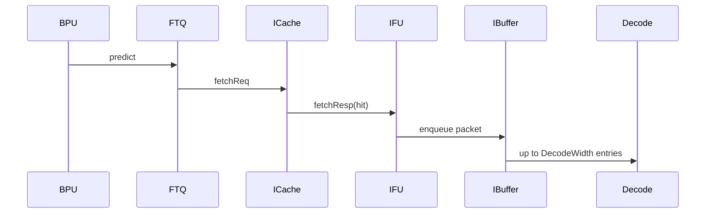
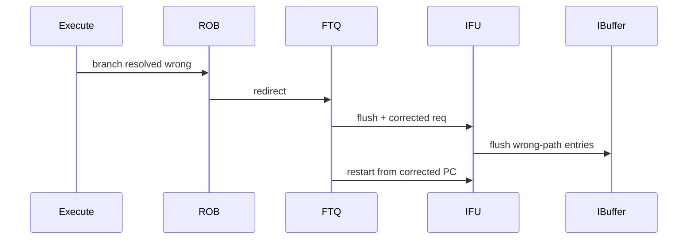
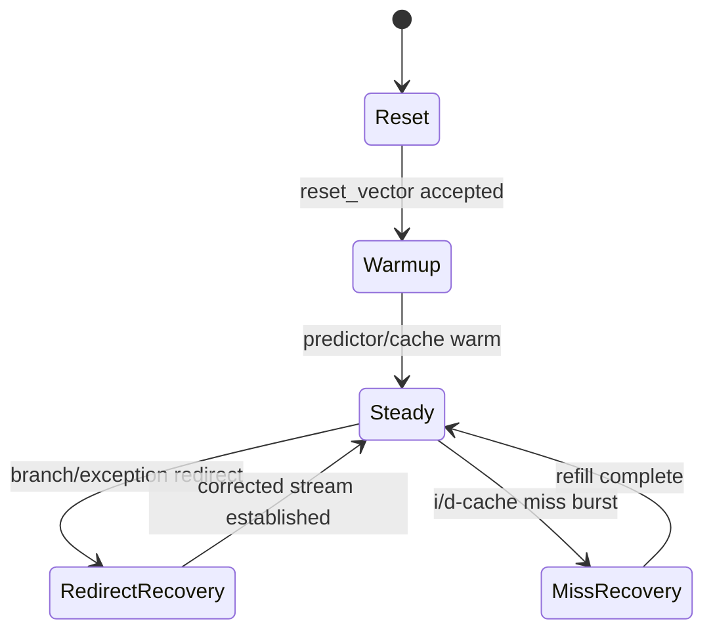

# Part I — Overview and Fundamentals
## Chapter 1. Introduction

### Block Diagram: Kunminghu (昆明湖) in One Page

Kunminghu is the third generation of the XiangShan (香山, "Fragrant Hills") open-source, high-performance, out-of-order RISC-V processor platform. This chapter sets the baseline mental model and deliberately avoids unit-level deep dives that are covered in Chapters 2 to 9.

Primary anchors: [Top.scala:86](../../src/main/scala/top/Top.scala#L86), [Top.scala:485](../../src/main/scala/top/Top.scala#L485), [XSTile.scala:35](../../src/main/scala/xiangshan/XSTile.scala#L35), [XSCore.scala:77](../../src/main/scala/xiangshan/XSCore.scala#L77), [Parameters.scala:48](../../src/main/scala/xiangshan/Parameters.scala#L48), [README.md:3](../../README.md#L3).

---

### 1.1 Why XiangShan

The architectural question is: how do you build a wide OoO core with modern ISA scope and still keep integration and validation practical?

XiangShan’s answer is:

- a parameterized microarchitecture ([`XSCoreParameters`](../../src/main/scala/xiangshan/Parameters.scala#L48)) instead of one fixed SKU
- an explicit subsystem split (`Frontend`, `Backend`, [`MemBlock`](../../src/main/scala/xiangshan/XSCore.scala#L128)) inside `XSCore`
- top-level integration profiles ([`TLConfig`](../../src/main/scala/top/Configs.scala#L596), [`CHIConfig`](../../src/main/scala/top/Configs.scala#L620), [`XSNoCTopConfig`](../../src/main/scala/top/Configs.scala#L635)) for different deployment paths.

---

### 1.2 Project Evolution: Yanqihu (雁栖湖) -> Nanhu (南湖) -> Kunminghu

Repository anchors: [README.md:47](../../README.md#L47), [README.md:49](../../README.md#L49), [README.md:51](../../README.md#L51).

Why it matters architecturally:

- Kunminghu keeps continuity with earlier designs but increases configurability and subsystem depth.
- The evolution is visible in stronger parameter plumbing and broader integration options.

---

### 1.3 Design Intent and Trade-offs

| Design decision | Why chosen | Main cost |
| --- | --- | --- |
| [Wide OoO backend](../../src/main/scala/xiangshan/backend/Backend.scala#L187) | Higher ILP on mixed workloads | Area and verification complexity |
| Rich frontend prediction stack | Reduces control-flow bubbles | More metadata/recovery logic |
| [Deep memory subsystem](../../src/main/scala/xiangshan/mem/MemBlock.scala#L529) | Better latency hiding and MLP | More ordering and replay machinery |
| [Heavy parameterization](../../src/main/scala/xiangshan/Parameters.scala#L80) | Fast architecture exploration | Cross-config validation burden |

---

### 1.4 ISA Scope (RV64GCBHV)

Kunminghu targets a broad RV64 profile including scalar, compressed, floating-point, vector, bit-manip subsets, and hypervisor support.

| Capability | Evidence |
| --- | --- |
| RV64 base + extension list | [Parameters.scala:289](../../src/main/scala/xiangshan/Parameters.scala#L289), [Parameters.scala:290](../../src/main/scala/xiangshan/Parameters.scala#L290) |
| `C` extension | [Parameters.scala:59](../../src/main/scala/xiangshan/Parameters.scala#L59) |
| `H` extension | [Parameters.scala:60](../../src/main/scala/xiangshan/Parameters.scala#L60), [HypervisorLevel.scala:19](../../src/main/scala/xiangshan/backend/fu/NewCSR/HypervisorLevel.scala#L19) |
| Vector support | [Parameters.scala:70](../../src/main/scala/xiangshan/Parameters.scala#L70), [FuConfig.scala:160](../../src/main/scala/xiangshan/backend/fu/FuConfig.scala#L160) |
| Bit-manip subsets (`Zb*`) | [Parameters.scala:298](../../src/main/scala/xiangshan/Parameters.scala#L298), [Bku.scala:27](../../src/main/scala/xiangshan/backend/fu/Bku.scala#L27) |

Detailed decode, FU, CSR, and privilege implications are deferred to Part III and Part VI.

---

### 1.5 Architecture Boundary Map (Full Book)

The full map below is the canonical navigation index from Chapter 1.

#### Part I - Overview and Fundamentals

1. [Chapter 2. Architecture at a Glance](02-architecture-at-a-glance.md)
2. [Chapter 3. SoC Integration](03-soc-integration.md)

#### Part II - Frontend (Instruction Supply)

1. [Chapter 4. Frontend Overview](../part-02-frontend-instruction-supply/04-frontend-overview.md)
2. [Chapter 5. Branch Prediction Unit (BPU)](../part-02-frontend-instruction-supply/05-branch-prediction-unit.md)
3. [Chapter 6. Fetch Target Queue (FTQ)](../part-02-frontend-instruction-supply/06-fetch-target-queue.md)
4. [Chapter 7. Instruction Cache (ICache)](../part-02-frontend-instruction-supply/07-instruction-cache.md)
5. [Chapter 8. Instruction Fetch Unit (IFU)](../part-02-frontend-instruction-supply/08-instruction-fetch-unit.md)
6. [Chapter 9. Instruction Buffer (IBuffer)](../part-02-frontend-instruction-supply/09-instruction-buffer.md)

#### Part III - Backend (Execution Engine)

1. [Chapter 10. Backend Overview](../part-03-backend-execution-engine/10-backend-overview.md)
2. [Chapter 11. Decode Stage](../part-03-backend-execution-engine/11-decode-stage.md)
3. [Chapter 12. Rename Stage](../part-03-backend-execution-engine/12-rename-stage.md)
4. [Chapter 13. Dispatch](../part-03-backend-execution-engine/13-dispatch.md)
5. [Chapter 14. Issue Queues and Scheduling](../part-03-backend-execution-engine/14-issue-queues-and-scheduling.md)
6. [Chapter 15. Physical Register File](../part-03-backend-execution-engine/15-physical-register-file.md)
7. [Chapter 16. Functional Units](../part-03-backend-execution-engine/16-functional-units.md)
8. [Chapter 17. Reorder Buffer (ROB)](../part-03-backend-execution-engine/17-reorder-buffer.md)
9. [Chapter 18. Data Path and Writeback](../part-03-backend-execution-engine/18-data-path-and-writeback.md)

#### Part IV - Memory Subsystem

1. [Chapter 19. Memory Subsystem Overview](../part-04-memory-subsystem/19-memory-subsystem-overview.md)
2. [Chapter 20. Load Pipeline](../part-04-memory-subsystem/20-load-pipeline.md)
3. [Chapter 21. Store Pipeline](../part-04-memory-subsystem/21-store-pipeline.md)
4. [Chapter 22. Load Queue and Store Queue](../part-04-memory-subsystem/22-load-queue-and-store-queue.md)
5. [Chapter 23. L1 Data Cache](../part-04-memory-subsystem/23-l1-data-cache.md)
6. [Chapter 24. Hardware Prefetching](../part-04-memory-subsystem/24-hardware-prefetching.md)
7. [Chapter 25. Memory Management Unit (MMU)](../part-04-memory-subsystem/25-memory-management-unit.md)

#### Part V - Cache Hierarchy and Interconnect

1. [Chapter 26. L2 Cache (CoupledL2)](../part-05-cache-hierarchy-and-interconnect/26-l2-cache-coupledl2.md)
2. [Chapter 27. L3 Cache / LLC](../part-05-cache-hierarchy-and-interconnect/27-l3-cache-llc.md)
3. [Chapter 28. Coherence Protocol](../part-05-cache-hierarchy-and-interconnect/28-coherence-protocol.md)

#### Part VI - Privileged Architecture and Debug

1. [Chapter 29. Privilege Modes and Trap Handling](../part-06-privileged-architecture-and-debug/29-privilege-modes-and-trap-handling.md)
2. [Chapter 30. Performance Counters and Events](../part-06-privileged-architecture-and-debug/30-performance-counters-and-events.md)
3. [Chapter 31. Debug and Trace](../part-06-privileged-architecture-and-debug/31-debug-and-trace.md)

#### Part VII - Physical Design Considerations

1. [Chapter 32. Clock, Reset, and Power Management](../part-07-physical-design-considerations/32-clock-reset-and-power-management.md)
2. [Chapter 33. Design for Testability](../part-07-physical-design-considerations/33-design-for-testability.md)

#### Appendices

1. [Appendix A. Full Parameter Table](../appendices/a-full-parameter-table.md)
2. [Appendix B. Signal/Bundle Glossary](../appendices/b-signal-bundle-glossary.md)
3. [Appendix C. Functional Unit Configuration Table](../appendices/c-functional-unit-configuration-table.md)
4. [Appendix D. CSR Register Map](../appendices/d-csr-register-map.md)
5. [Appendix E. Build and Simulation Guide](../appendices/e-build-and-simulation-guide.md)
6. [Appendix F. Glossary](../appendices/f-glossary.md)

Book-level index: [Book README](../README.md).

---

### 1.6 Intro Parameter Envelope

The table below is intentionally short; full parameter coverage belongs to Appendix A.

| Parameter | Default | Why it matters |
| --- | --- | --- |
| [`DecodeWidth`](../../src/main/scala/xiangshan/Parameters.scala#L80) | `8` | Frontend/backed throughput target |
| [`RenameWidth`](../../src/main/scala/xiangshan/Parameters.scala#L81) | `8` | Rename allocation bandwidth |
| [`CommitWidth`](../../src/main/scala/xiangshan/Parameters.scala#L82) | `8` | Retirement bandwidth |
| [`RobSize`](../../src/main/scala/xiangshan/Parameters.scala#L110) | `352` | In-flight window depth |
| [`LoadPipelineWidth`](../../src/main/scala/xiangshan/Parameters.scala#L152) | `3` | Concurrent load execution |
| [`StorePipelineWidth`](../../src/main/scala/xiangshan/Parameters.scala#L153) | `2` | Concurrent store execution |
| [`VirtualLoadQueueSize`](../../src/main/scala/xiangshan/Parameters.scala#L99) | `72` | Load in-flight buffering |
| [`StoreQueueSize`](../../src/main/scala/xiangshan/Parameters.scala#L106) | `56` | Store in-flight buffering |
| [`VLEN`](../../src/main/scala/xiangshan/Parameters.scala#L53) | `128` | Vector register width |
| [`HasVPU`](../../src/main/scala/xiangshan/Parameters.scala#L70) / [`HasHExtension`](../../src/main/scala/xiangshan/Parameters.scala#L60) | `true` / `true` | Vector + virtualization envelope |

---

### 1.7 Build and Elaboration Flow

Key anchors: [ArgParser.scala:63](../../src/main/scala/top/ArgParser.scala#L63), [YamlParser.scala:68](../../src/main/scala/top/YamlParser.scala#L68), [Top.scala:485](../../src/main/scala/top/Top.scala#L485), [Generator.scala:23](../../src/main/scala/top/Generator.scala#L23), [XiangShanStage.scala:25](../../src/main/scala/top/XiangShanStage.scala#L25), [Makefile:268](../../Makefile#L268).

---

### 1.8 Fetch-to-Commit Dataflow (Intro Level)

Step-by-step at introduction depth:

1. Frontend predicts/fetches and emits `cfVec` to backend: [Frontend.scala:255](../../src/main/scala/xiangshan/frontend/Frontend.scala#L255).
2. `CtrlBlock` handles decode, rename, and dispatch: [CtrlBlock.scala:99](../../src/main/scala/xiangshan/backend/CtrlBlock.scala#L99), [CtrlBlock.scala:102](../../src/main/scala/xiangshan/backend/CtrlBlock.scala#L102), [CtrlBlock.scala:714](../../src/main/scala/xiangshan/backend/CtrlBlock.scala#L714).
3. Backend regions execute and write back: [Backend.scala:187](../../src/main/scala/xiangshan/backend/Backend.scala#L187), [Backend.scala:280](../../src/main/scala/xiangshan/backend/Backend.scala#L280).
4. MemBlock handles loads/stores, translation, and L1D: [MemBlock.scala:529](../../src/main/scala/xiangshan/mem/MemBlock.scala#L529), [MemBlock.scala:595](../../src/main/scala/xiangshan/mem/MemBlock.scala#L595).
5. ROB commits in order and drives redirects on recovery: [Rob.scala:654](../../src/main/scala/xiangshan/backend/rob/Rob.scala#L654), [CtrlBlock.scala:361](../../src/main/scala/xiangshan/backend/CtrlBlock.scala#L361).

---

### 1.9 Intro I/O Table: `XSCore` External Boundary

The full interface is large; this table lists the externally visible signals needed to understand chapters 2 and 3.

| Port Name | Direction | Width/Type | Description |
| --- | --- | --- | --- |
| `hartId` | Input | `UInt(hartIdLen.W)` | Hardware thread ID for this core. |
| `reset_vector` | Input | `UInt(PAddrBits.W)` | Initial PC source after reset. |
| `clintTime` | Input | `ValidIO(UInt(64.W))` | Timer value for privilege/time logic. |
| `l2_flush_en` | Output | `Bool` | Requests L2 flush sequence. |
| `l2_flush_done` | Input | `Bool` | L2 flush completion handshake. |
| `traceCoreInterface` | Output | `TraceCoreInterface` | Trace/debug export. |
| `beu_errors` | Output | `XSL1BusErrors` | L1-side error reporting path. |
| `cpu_halt` | Output | `Bool` | Core halt state for system control/debug. |

Definition anchor: [XSCore.scala:83](../../src/main/scala/xiangshan/XSCore.scala#L83).

---

### 1.10 Intro Timing Diagrams

#### 1.10.1 Steady-state (correct prediction, L1 hit)

#### 1.10.2 Redirect recovery (misprediction)

---

### 1.11 Intro State Machine: Execution Epochs

This chapter uses epoch-level states only. Detailed unit FSMs are in Chapters 5 to 9.

---

### 1.12 What This Chapter Intentionally Defers

To avoid duplication:

- no predictor table internals here (Chapter 5)
- no FTQ pointer arithmetic and metadata queue internals here (Chapter 6)
- no ICache pipeline/FSM deep dive here (Chapter 7)
- no IFU alignment/checker internals here (Chapter 8)
- no banked IBuffer dequeue logic here (Chapter 9).

---

### 1.13 Checkpoint Questions

1. Basic: Why does Kunminghu use explicit `Frontend/Backend/MemBlock` partitioning instead of one monolithic core module?
2. Basic: Which parameters most directly set the machine width and in-flight depth?
3. Intermediate: Why is parameterization a performance-enabler and also a validation burden?
4. Intermediate: What architectural problems are solved by supporting both TL and CHI topologies?
5. Advanced: If `DecodeWidth` were reduced while `RobSize` stayed fixed, what bottlenecks would likely dominate first?

---

### 1.14 Further Reading

- XiangShan repository overview and publications: [README.md:21](../../README.md#L21)
- Seznec, "The L-TAGE Branch Predictor" (JILP, 2006) for predictor context before Chapter 5.
- Tomasulo, "An Efficient Algorithm for Exploiting Multiple Arithmetic Units" (IBM JRD, 1967) for OoO background.

---

### Key Takeaways

- Kunminghu is a parameterized SoC-scale CPU project, not a fixed core drop.
- The core architecture is structured around `Frontend`, `Backend`, and `MemBlock` with explicit recovery loops.
- Performance intent is encoded in default widths, queue sizes, and cache/interconnect configuration.
- Chapter 1 provides shared context only; Chapters 2 to 9 are the canonical detail sources.
