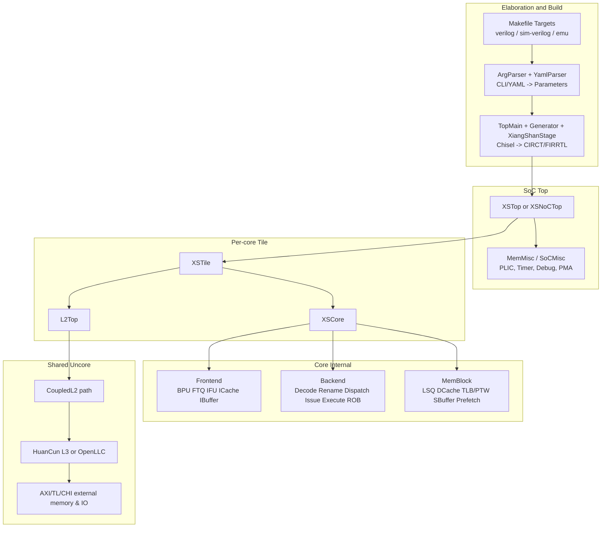
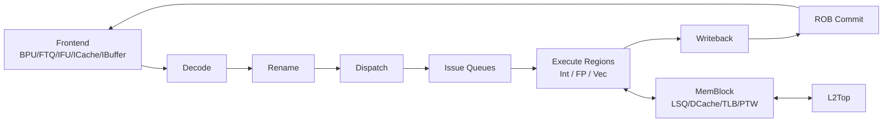
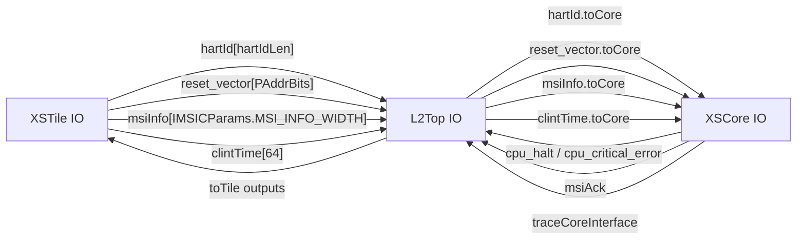
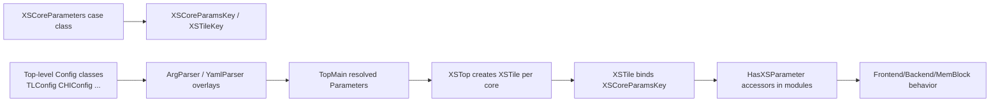
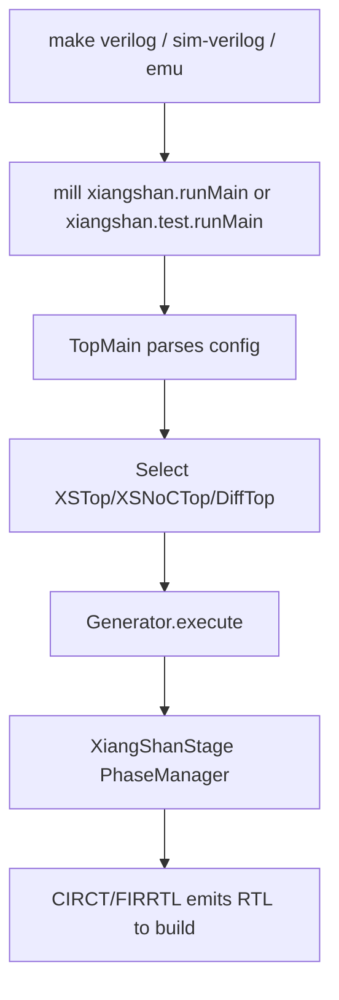
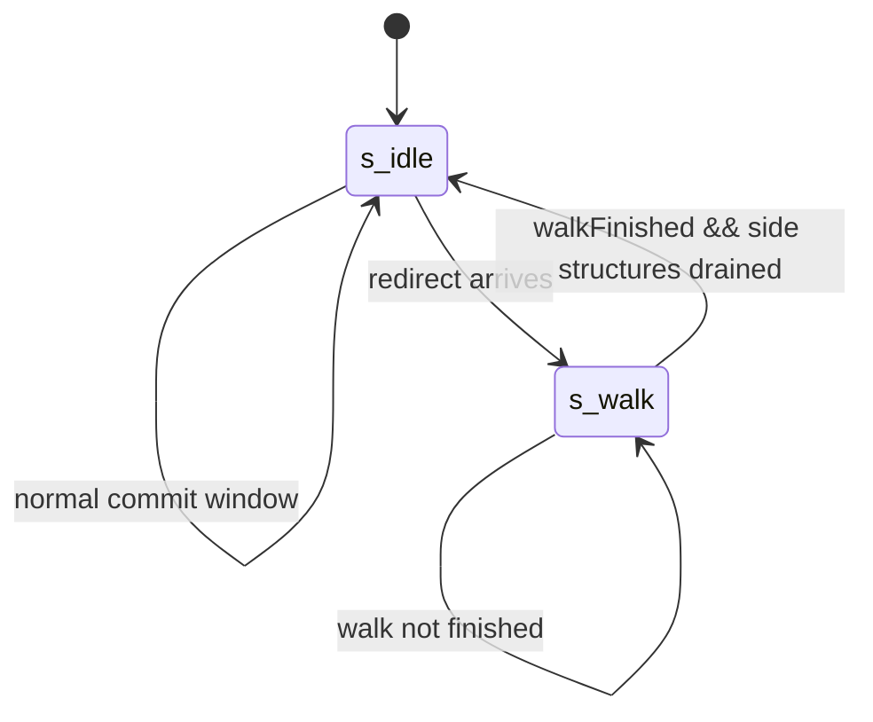
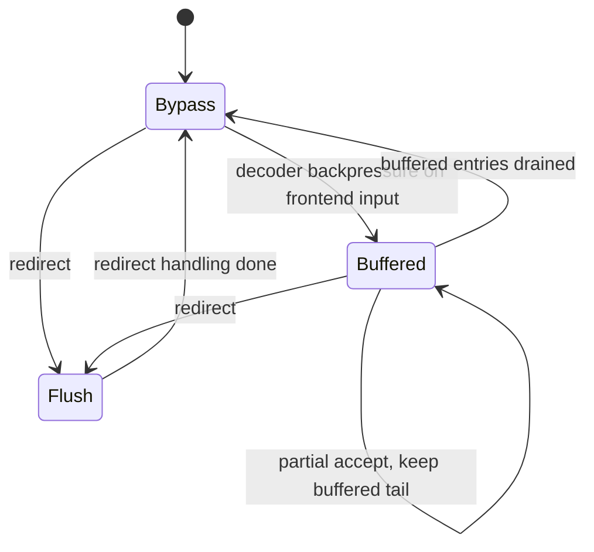

# Chapter 2. Architecture at a Glance

### Block Diagram: Full-Chip Structure and Major Hierarchy

At a glance, Kunminghu is a parameterized SoC generator: top-level SoC composition in `top/`, tile assembly in
`xiangshan/`, and core internals split into frontend, backend, and memory block.

For an undergraduate reader, the simplest way to read this diagram is as "who is responsible for what":

| Block | Purpose (plain language) |
| --- | --- |
| Elaboration and Build | Converts Chisel/Scala source plus config choices into concrete RTL files. |
| SoC Top | Connects cores, caches, interrupts, debug, and off-chip interfaces into one chip-level system. |
| Per-core Tile | Wraps one CPU core with its local L2 and tile-level wiring. |
| Core Internal: Frontend | Finds the next instructions quickly (predict + fetch + buffer). |
| Core Internal: Backend | Executes instructions out of order to increase throughput. |
| Core Internal: MemBlock | Handles loads/stores, address translation, and L1 data cache access. |
| Shared Uncore | Provides larger shared caches and memory-controller-facing fabric. |

Abbreviations used in this chapter:

| Term | Meaning | Purpose |
| --- | --- | --- |
| BPU | Branch Prediction Unit | Guesses control flow direction/target to keep fetch running. |
| FTQ | Fetch Target Queue | Buffers fetch targets and decouples predictor from fetch engine. |
| IFU | Instruction Fetch Unit | Reads instruction bytes from I-cache or memory path. |
| ROB | Reorder Buffer | Commits instructions in order and drives recovery. |
| TLB/PTW | Translation Lookaside Buffer / Page Table Walker | Translates virtual addresses to physical addresses. |
| LSQ | Load/Store Queue | Tracks memory ops and enforces ordering/forwarding rules. |

Core anchors:
[Top.scala:86](../../src/main/scala/top/Top.scala#L86),
[Top.scala:99](../../src/main/scala/top/Top.scala#L99),
[Top.scala:106](../../src/main/scala/top/Top.scala#L106),
[XSTile.scala:35](../../src/main/scala/xiangshan/XSTile.scala#L35),
[XSTile.scala:40](../../src/main/scala/xiangshan/XSTile.scala#L40),
[XSTile.scala:41](../../src/main/scala/xiangshan/XSTile.scala#L41),
[XSCore.scala:64](../../src/main/scala/xiangshan/XSCore.scala#L64),
[XSCore.scala:66](../../src/main/scala/xiangshan/XSCore.scala#L66),
[XSCore.scala:68](../../src/main/scala/xiangshan/XSCore.scala#L68),
[L2Top.scala:111](../../src/main/scala/xiangshan/L2Top.scala#L111),
[MemBlock.scala:529](../../src/main/scala/xiangshan/mem/MemBlock.scala#L529),
[SoC.scala:440](../../src/main/scala/system/SoC.scala#L440).

---

### 2.1 Design Intent at System Level

The design goal is to combine a fast out-of-order core with a configurable memory system, and to build many chip
variants from one source tree.

Short definitions used in this chapter:

- **ILP (instruction-level parallelism)**: running multiple independent instructions at the same time.
- **Out-of-order core**: hardware can execute later instructions early when operands are ready.
- **Memory hierarchy**: L1/L2/L3 caches plus external memory path.
- **Elaboration flow**: steps that turn parameterized Chisel into final RTL.
- **uop (micro-operation)**: internal operation derived from a decoded ISA instruction.
- **ROB (reorder buffer)**: structure that commits instructions in program order.
- **TL/CHI**: TileLink and AMBA CHI interconnect protocols used in different integration modes.

Compared with less configurable CPU RTL trees:

- XiangShan stores configuration in typed parameter objects (`XSCoreParameters`, `SoCParameters`) instead of scattered
  `ifdef` branches. Purpose: make variant management and review easier.
- It composes the hierarchy with `LazyModule` graphs (core, tile, L2, SoC). Purpose: reuse the same microarchitecture
  while swapping system integration paths (TL vs CHI).
- It keeps frontend/backend/memory as explicit peer subsystems inside `XSCore`. Purpose: clear boundaries for design
  and verification teams.

Implementation anchors:
[Parameters.scala:48](../../src/main/scala/xiangshan/Parameters.scala#L48),
[SoC.scala:53](../../src/main/scala/system/SoC.scala#L53),
[Top.scala:510](../../src/main/scala/top/Top.scala#L510),
[L2Top.scala:128](../../src/main/scala/xiangshan/L2Top.scala#L128),
[L2Top.scala:129](../../src/main/scala/xiangshan/L2Top.scala#L129),
[XSCore.scala:132](../../src/main/scala/xiangshan/XSCore.scala#L132),
[XSCore.scala:141](../../src/main/scala/xiangshan/XSCore.scala#L141),
[XSCore.scala:214](../../src/main/scala/xiangshan/XSCore.scala#L214).

---

### 2.2 Hierarchy Map (Top -> Tile -> Core)

Read this table from top to bottom as a decomposition: each level narrows scope from whole-chip concerns to per-stage
core work.

| Architectural level | Main module(s) | Responsibility |
| --- | --- | --- |
| SoC top | [`XSTop`](../../src/main/scala/top/Top.scala#L86), [`XSNoCTop`](../../src/main/scala/top/XSNoCTop.scala#L42) | Chip-level assembly point: instantiates tiles and connects them to shared cache, DRAM path, debug, and interrupts. |
| SoC misc/peripherals | [`MemMisc`](../../src/main/scala/system/SoC.scala#L440), [`SoCMisc`](../../src/main/scala/system/SoC.scala#L503) | Provides non-core services (PLIC, timer, debug, PMA, crossbars) that software expects from a full SoC. |
| Tile | [`XSTile`](../../src/main/scala/xiangshan/XSTile.scala#L35) | "Per-core socket": binds one [`XSCore`](../../src/main/scala/xiangshan/XSCore.scala#L64) to one local [`L2Top`](../../src/main/scala/xiangshan/L2Top.scala#L111) and routes interrupts/MMIO/cache links. |
| Core shell | [`XSCoreBase`](../../src/main/scala/xiangshan/XSCore.scala#L59), [`XSCoreImp`](../../src/main/scala/xiangshan/XSCore.scala#L83) | Top container inside one core: instantiates major subsystems and wires their control/data interfaces. |
| Frontend | [`Frontend`](../../src/main/scala/xiangshan/frontend/Frontend.scala#L98) + [`Bpu`](../../src/main/scala/xiangshan/frontend/Frontend.scala#L136) / [`Ftq`](../../src/main/scala/xiangshan/frontend/Frontend.scala#L139) / [`Ifu`](../../src/main/scala/xiangshan/frontend/Frontend.scala#L137) / [`ICache`](../../src/main/scala/xiangshan/frontend/Frontend.scala#L135) / [`IBuffer`](../../src/main/scala/xiangshan/frontend/Frontend.scala#L138) | Keeps backend fed: predicts control flow, fetches instructions, and smooths bursts with buffering. |
| Backend control/execution | [`CtrlBlock`](../../src/main/scala/xiangshan/backend/CtrlBlock.scala#L97) + regions ([`int`](../../src/main/scala/xiangshan/backend/Backend.scala#L187) / [`fp`](../../src/main/scala/xiangshan/backend/Backend.scala#L188) / [`vec`](../../src/main/scala/xiangshan/backend/Backend.scala#L189)) | Turns fetched instructions into completed operations (decode, rename, schedule, execute, commit). |
| Memory block | [`MemBlock`](../../src/main/scala/xiangshan/mem/MemBlock.scala#L529) + [`LsqWrapper`](../../src/main/scala/xiangshan/mem/MemBlock.scala#L530) + [`DCacheWrapper`](../../src/main/scala/xiangshan/mem/MemBlock.scala#L595) + [`TLB/PTW`](../../src/main/scala/xiangshan/mem/MemBlock.scala#L684) | Handles all memory-side execution details: queues, load/store ordering, translation, and L1D accesses. |
| Private/shared cache path | [`L2Top`](../../src/main/scala/xiangshan/L2Top.scala#L111), [`CoupledL2`](../../src/main/scala/xiangshan/L2Top.scala#L137), [`HuanCun/OpenLLC`](../../src/main/scala/top/Top.scala#L106) | Bridges each core to larger caches and system fabric, hiding most DRAM latency from the core. |

---

### 2.3 Core Pipeline at a Glance

Purpose of each stage in one sentence:

| Stage | Why it exists |
| --- | --- |
| Frontend | Keep instruction supply full by predicting branches and fetching ahead. |
| Decode | Translate ISA instructions into internal micro-operations (uops). |
| Rename | Remove false register dependencies so independent uops can overlap. |
| Dispatch/Issue | Place uops into scheduling structures and choose ready ones each cycle. |
| Execute | Run ALU/FP/vector/branch operations and generate results or redirects. |
| Writeback | Write computed results into physical registers and notify dependent uops. |
| ROB Commit | Retire instructions in program order to keep precise architectural state. |
| MemBlock | Execute loads/stores with address translation, ordering checks, and cache access. |

Stage ownership and structural anchors:

- **Fetch and predict**: [Frontend.scala:136](../../src/main/scala/xiangshan/frontend/Frontend.scala#L136), [Frontend.scala:223](../../src/main/scala/xiangshan/frontend/Frontend.scala#L223), [Frontend.scala:228](../../src/main/scala/xiangshan/frontend/Frontend.scala#L228)
- **Decode/rename/dispatch**: [CtrlBlock.scala:99](../../src/main/scala/xiangshan/backend/CtrlBlock.scala#L99), [CtrlBlock.scala:102](../../src/main/scala/xiangshan/backend/CtrlBlock.scala#L102), [CtrlBlock.scala:714](../../src/main/scala/xiangshan/backend/CtrlBlock.scala#L714)
- **Issue/execute regions**: [Backend.scala:187](../../src/main/scala/xiangshan/backend/Backend.scala#L187), [Backend.scala:188](../../src/main/scala/xiangshan/backend/Backend.scala#L188), [Backend.scala:189](../../src/main/scala/xiangshan/backend/Backend.scala#L189)
- **Writeback and commit/recovery**: [CtrlBlock.scala:136](../../src/main/scala/xiangshan/backend/CtrlBlock.scala#L136), [Rob.scala:800](../../src/main/scala/xiangshan/backend/rob/Rob.scala#L800)
- **Load/store path coupling**: [XSCore.scala:149](../../src/main/scala/xiangshan/XSCore.scala#L149), [XSCore.scala:214](../../src/main/scala/xiangshan/XSCore.scala#L214), [Backend.scala:217](../../src/main/scala/xiangshan/backend/Backend.scala#L217), [MemBlock.scala:539](../../src/main/scala/xiangshan/mem/MemBlock.scala#L539)

#### Step-by-step instruction/data flow

1. Frontend predicts control flow and fetches instructions so backend does not stall for instruction supply. Fetched
   instruction bundles (`cfVec`) are sent from `IBuffer` to backend at
   [Frontend.scala:255](../../src/main/scala/xiangshan/frontend/Frontend.scala#L255).
2. `CtrlBlock` decodes each instruction and renames destination/source registers to physical registers. This removes
   false dependencies and enables out-of-order execution
   ([CtrlBlock.scala:99](../../src/main/scala/xiangshan/backend/CtrlBlock.scala#L99),
   [CtrlBlock.scala:102](../../src/main/scala/xiangshan/backend/CtrlBlock.scala#L102)).
3. Renamed uops enter dispatch pipeline stages (`PipeGroupConnect`) so they can be routed to the right issue queues
   [CtrlBlock.scala:714](../../src/main/scala/xiangshan/backend/CtrlBlock.scala#L714).
4. Dispatch places uops into issue structures; ready uops are selected and sent to int/fp/vec execution regions
   ([CtrlBlock.scala:760](../../src/main/scala/xiangshan/backend/CtrlBlock.scala#L760),
   [Backend.scala:280](../../src/main/scala/xiangshan/backend/Backend.scala#L280),
   [Backend.scala:332](../../src/main/scala/xiangshan/backend/Backend.scala#L332),
   [Backend.scala:347](../../src/main/scala/xiangshan/backend/Backend.scala#L347)).
5. Memory uops and memory ordering feedback travel between backend and `MemBlock`; this separates generic execution
   scheduling from memory-specific hazards
   ([XSCore.scala:149](../../src/main/scala/xiangshan/XSCore.scala#L149) to
   [XSCore.scala:175](../../src/main/scala/xiangshan/XSCore.scala#L175)).
6. `MemBlock` handles load/store execution, translation (TLB/PTW), cache access, and prefetch logic, then returns data
   and ordering signals to backend
   ([MemBlock.scala:529](../../src/main/scala/xiangshan/mem/MemBlock.scala#L529),
   [MemBlock.scala:595](../../src/main/scala/xiangshan/mem/MemBlock.scala#L595),
   [MemBlock.scala:717](../../src/main/scala/xiangshan/mem/MemBlock.scala#L717)).
7. ROB commits instructions in-order for precise state; on a wrong-path event it sends redirects to frontend and
   memory-side logic for recovery
   ([Rob.scala:654](../../src/main/scala/xiangshan/backend/rob/Rob.scala#L654),
   [CtrlBlock.scala:361](../../src/main/scala/xiangshan/backend/CtrlBlock.scala#L361),
   [Backend.scala:468](../../src/main/scala/xiangshan/backend/Backend.scala#L468)).

---

### 2.4 Schematic: Tile-Core-L2 Interface Signals

This interface exists to move "platform context" into the core and move "core status" back out.

| Signal group | Purpose |
| --- | --- |
| [`hartId`](../../src/main/scala/xiangshan/XSTile.scala#L103), [`reset_vector`](../../src/main/scala/xiangshan/XSTile.scala#L108) | Tell the core who it is and where to start execution after reset. |
| [`msiInfo`](../../src/main/scala/xiangshan/XSTile.scala#L104), [`clintTime`](../../src/main/scala/xiangshan/XSTile.scala#L120) | Deliver interrupt/timer context from platform interrupt logic. |
| [`cpu_halt`](../../src/main/scala/xiangshan/XSTile.scala#L109), [`cpu_critical_error`](../../src/main/scala/xiangshan/XSCore.scala#L98) | Report critical core status outward for system-level handling. |
| [`traceCoreInterface`](../../src/main/scala/xiangshan/XSTile.scala#L112) | Export trace/debug visibility to outer modules. |

---

### 2.5 Key Parameter Tables

The important point is that **core defaults** and **top-level config overlays** are both active.

- `XSCoreParameters` gives baseline behavior for one core.
- Config classes (for example `TLConfig`) override selected values to create a full platform profile.

Undergraduate reading tip: many parameter names encode a performance/cost tradeoff. Bigger structures (ROB, queues,
caches) usually increase potential performance but also area/power and verification complexity.

#### 2.5.1 Core default envelope (`XSCoreParameters` + frontend parameter classes)

| Parameter | Default | Meaning |
| --- | --- | --- |
| [`DecodeWidth`](../../src/main/scala/xiangshan/Parameters.scala#L80) | `8` | decode bandwidth |
| [`RenameWidth`](../../src/main/scala/xiangshan/Parameters.scala#L81) | `8` | rename bandwidth |
| [`CommitWidth`](../../src/main/scala/xiangshan/Parameters.scala#L82) | `8` | max commit bandwidth |
| [`RobSize`](../../src/main/scala/xiangshan/Parameters.scala#L110) | `352` | in-flight window depth |
| [`NRPhyRegs`](../../src/main/scala/xiangshan/Parameters.scala#L98) | `192` | integer PRF count |
| [`VirtualLoadQueueSize`](../../src/main/scala/xiangshan/Parameters.scala#L99) | `72` | load-side buffering |
| [`StoreQueueSize`](../../src/main/scala/xiangshan/Parameters.scala#L106) | `56` | store-side buffering |
| [`LoadPipelineWidth`](../../src/main/scala/xiangshan/Parameters.scala#L152) | `3` | concurrent load pipelines |
| [`StorePipelineWidth`](../../src/main/scala/xiangshan/Parameters.scala#L153) | `2` | concurrent store pipelines |
| [`VLEN`](../../src/main/scala/xiangshan/Parameters.scala#L53) | `128` | vector register width |
| [`HasFPU`](../../src/main/scala/xiangshan/Parameters.scala#L69) / [`HasVPU`](../../src/main/scala/xiangshan/Parameters.scala#L70) | `true` / `true` | FP/vector execution enabled |
| [`HasHExtension`](../../src/main/scala/xiangshan/Parameters.scala#L60) | `true` | hypervisor support enabled |
| [`FetchBlockSize`](../../src/main/scala/xiangshan/frontend/FrontendParameters.scala#L28) | `64` B | fetch block granularity |
| [`FetchPorts`](../../src/main/scala/xiangshan/frontend/FrontendParameters.scala#L29) | `2` | IFU fetch ports |
| [`FtqSize`](../../src/main/scala/xiangshan/frontend/ftq/FtqParameters.scala#L23) | `64` | FTQ depth |
| [`frontendParameters`](../../src/main/scala/xiangshan/Parameters.scala#L89).ibufferParameters.[`Size`](../../src/main/scala/xiangshan/frontend/ibuffer/Parameters.scala#L23) | `48` | frontend-decoder buffer depth |
| [`nSets`](../../src/main/scala/xiangshan/frontend/icache/Parameters.scala#L29) / [`nWays`](../../src/main/scala/xiangshan/frontend/icache/Parameters.scala#L30) / [`blockBytes`](../../src/main/scala/xiangshan/frontend/icache/Parameters.scala#L32) | `256/4/64` | default L1I geometry |
| [`DCacheParameters.nSets`](../../src/main/scala/xiangshan/cache/dcache/DCacheWrapper.scala#L39) / [`DCacheParameters.nWays`](../../src/main/scala/xiangshan/cache/dcache/DCacheWrapper.scala#L40) | `128 sets, 8 ways` | baseline DCache class defaults |
| [`L2CacheParamsOpt`](../../src/main/scala/xiangshan/Parameters.scala#L275): [`ways`](../../src/main/scala/xiangshan/Parameters.scala#L277), [`sets`](../../src/main/scala/xiangshan/Parameters.scala#L278) | present (`8 ways`, `1024 sets`) | per-core L2 baseline in core params |
| [`L2NBanks`](../../src/main/scala/xiangshan/Parameters.scala#L282) | `1` | per-core L2 bank count in core defaults |

#### 2.5.2 `TLConfig` platform overlay (commonly used default profile)

| Item | TLConfig setting |
| --- | --- |
| L3 via [`L3CacheConfig`](../../src/main/scala/top/Configs.scala#L597) | `16MB`, non-inclusive, `4` banks, `16` ways |
| L2 via [`L2CacheConfig`](../../src/main/scala/top/Configs.scala#L598) | `1MB`, inclusive, `4` banks |
| L1D via [`WithNKBL1D`](../../src/main/scala/top/Configs.scala#L307) | `64KB`, `4` ways (`WithNKBL1D(64, ways = 4)` in [`TLConfig`](../../src/main/scala/top/Configs.scala#L596)) |
| [`TLConfig`](../../src/main/scala/top/Configs.scala#L596) composition | cache overlays + [`BaseConfig`](../../src/main/scala/top/Configs.scala#L600) |

In plain terms, `TLConfig` is a ready-made "system recipe": it keeps core microarchitecture mostly unchanged while
setting concrete cache hierarchy sizes/policies for a common deployment target.

---

### 2.6 Parameterization System (`XSCoreParameters`) and Propagation

Why this matters: this chain is the mechanism that turns a high-level config choice into concrete behavior inside each
hardware module.

| Element | Purpose |
| --- | --- |
| [`XSCoreParameters`](../../src/main/scala/xiangshan/Parameters.scala#L48) and [`XSCoreParamsKey`](../../src/main/scala/xiangshan/Parameters.scala#L46) | Stores the core's parameter fields (widths, queue sizes, feature flags, and so on). |
| Config classes ([`TLConfig`](../../src/main/scala/top/Configs.scala#L596), [`CHIConfig`](../../src/main/scala/top/Configs.scala#L620)) | Provide preset bundles of parameter overrides. |
| [`ArgParser`](../../src/main/scala/top/ArgParser.scala#L63) / [`YamlParser`](../../src/main/scala/top/YamlParser.scala#L68) | Allow command line or YAML files to override config values for experiments. |
| [`HasXSParameter`](../../src/main/scala/xiangshan/Parameters.scala#L543) | Gives modules a consistent way to read resolved parameters. |

This structure is intentionally different from fixed-parameter RTL. It allows one source tree to express multiple
deployment points (minimal sim, default TL, CHI/NoC variants) without duplicating microarchitecture logic.

---

### 2.7 Build and Elaboration Methodology (Mill + Make + Stage)

Purpose-first reading of this flow:

1. You choose a target (`verilog`, `sim-verilog`, `emu`) from `make`.
2. Mill launches Scala entrypoints and dependency resolution.
3. `TopMain` selects top module/config combination.
4. Generator + stage pipeline elaborates Chisel and emits RTL artifacts.

Anchors for the flow:

- Make targets: [Makefile:243](../../Makefile#L243), [Makefile:268](../../Makefile#L268), [Makefile:276](../../Makefile#L276), [Makefile:282](../../Makefile#L282), [Makefile:301](../../Makefile#L301), [Makefile:343](../../Makefile#L343)
- Mill module graph (`xiangshan`, deps, tests): [build.mill:36](../../build.mill#L36), [build.mill:130](../../build.mill#L130), [build.mill:133](../../build.mill#L133), [build.mill:224](../../build.mill#L224)
- Top entry and selection logic: [Top.scala:485](../../src/main/scala/top/Top.scala#L485), [Top.scala:486](../../src/main/scala/top/Top.scala#L486), [Top.scala:510](../../src/main/scala/top/Top.scala#L510), [Top.scala:515](../../src/main/scala/top/Top.scala#L515)
- Generator/stage bridge: [Generator.scala:23](../../src/main/scala/top/Generator.scala#L23), [Generator.scala:24](../../src/main/scala/top/Generator.scala#L24), [Generator.scala:27](../../src/main/scala/top/Generator.scala#L27)
- Chisel stage customization: [XiangShanStage.scala:25](../../src/main/scala/top/XiangShanStage.scala#L25), [XiangShanStage.scala:38](../../src/main/scala/top/XiangShanStage.scala#L38), [XiangShanStage.scala:47](../../src/main/scala/top/XiangShanStage.scala#L47), [XiangShanStage.scala:54](../../src/main/scala/top/XiangShanStage.scala#L54)

#### Common command-to-purpose map

| Command | Purpose | Notes |
| --- | --- | --- |
| `make verilog CONFIG=TLConfig` | emit top-level RTL | primary SoC RTL generation path |
| `make sim-verilog CONFIG=TLConfig` | emit `SimTop` RTL | used by simulation backends |
| `make emu CONFIG=TLConfig` | build Verilator emulator | routes through `difftest` build |
| `make test` | Scala/Chisel tests | runs Mill test module |
| `make check-format` | style check | scalafmt/scalastyle integration |

(Definitions in [Makefile:276](../../Makefile#L276), [Makefile:301](../../Makefile#L301), [Makefile:343](../../Makefile#L343), [Makefile:333](../../Makefile#L333), [Makefile:334](../../Makefile#L334))

---

### 2.8 Timing/Pipeline Diagrams (Cycle-Level)

These timing tables are conceptual: exact cycle counts can vary with configuration and runtime hazards, but the tables
capture the typical order of events.

#### 2.8.1 Scenario A: Correctly predicted integer ALU op (no replay)

| Cycle | Frontend | Ctrl path | Execute path | ROB |
| --- | --- | --- | --- | --- |
| `t` | IFU/IBuffer provides `cfVec` | Decode takes uop | - | - |
| `t+1` | next fetch block | Rename allocates physical regs | - | Enqueue slot reserved |
| `t+2` | - | Dispatch -> issue queue | - | Entry valid, waiting WB |
| `t+3` | - | Wakeup/select | ALU execute | - |
| `t+4` | - | WB arbitration | WB to PRF + ROB writebacked | Head may become committable |
| `t+5` | - | Commit checks | - | Commit (if no older blockers) |

Relevant anchors: [Frontend.scala:255](../../src/main/scala/xiangshan/frontend/Frontend.scala#L255), [CtrlBlock.scala:596](../../src/main/scala/xiangshan/backend/CtrlBlock.scala#L596), [CtrlBlock.scala:714](../../src/main/scala/xiangshan/backend/CtrlBlock.scala#L714), [Backend.scala:207](../../src/main/scala/xiangshan/backend/Backend.scala#L207), [Rob.scala:800](../../src/main/scala/xiangshan/backend/rob/Rob.scala#L800), [Rob.scala:817](../../src/main/scala/xiangshan/backend/rob/Rob.scala#L817).

#### 2.8.2 Scenario B: Branch misprediction recovery (redirect + ROB walk)

This scenario explains why the ROB and redirect path exist: they recover precise architectural state after speculative
execution follows the wrong branch.

| Cycle | Event |
| --- | --- |
| `t` | branch/jump resolves in execute region, redirect candidate generated |
| `t+1` | `CtrlBlock` sends redirect to frontend/FTQ and memory side |
| `t+2` | frontend flushes wrong-path supply; ROB switches from commit (`s_idle`) to walk (`s_walk`) |
| `t+3 ...` | ROB walks and releases speculative state until recovery point is drained |
| final | ROB returns to `s_idle`, normal commit resumes |

Anchors: [CtrlBlock.scala:361](../../src/main/scala/xiangshan/backend/CtrlBlock.scala#L361), [Backend.scala:468](../../src/main/scala/xiangshan/backend/Backend.scala#L468), [Rob.scala:327](../../src/main/scala/xiangshan/backend/rob/Rob.scala#L327), [Rob.scala:872](../../src/main/scala/xiangshan/backend/rob/Rob.scala#L872), [Rob.scala:875](../../src/main/scala/xiangshan/backend/rob/Rob.scala#L875).

---

### 2.9 State Machines

#### 2.9.1 ROB global recovery FSM

Purpose: keep retirement precise during normal operation and provide a controlled recovery path after redirects or
exceptions.

State meaning:

- `s_idle`: normal commit mode.
- `s_walk`: recovery mode; ROB walks back speculative state after a redirect/exception.

Concrete implementation points:
[Rob.scala:327](../../src/main/scala/xiangshan/backend/rob/Rob.scala#L327),
[Rob.scala:800](../../src/main/scala/xiangshan/backend/rob/Rob.scala#L800),
[Rob.scala:872](../../src/main/scala/xiangshan/backend/rob/Rob.scala#L872),
[Rob.scala:875](../../src/main/scala/xiangshan/backend/rob/Rob.scala#L875).

#### 2.9.2 Decode buffer control FSM (front-to-back decoupling)

Purpose: absorb short-term rate mismatch between frontend and decoder, and flush quickly on redirects.

State meaning:

- `Bypass`: frontend and decoder transfer directly with no temporary queueing.
- `Buffered`: local buffering is active because decoder cannot consume all incoming instructions.
- `Flush`: buffered content is dropped during redirect recovery.

Implementation anchors:
[CtrlBlock.scala:425](../../src/main/scala/xiangshan/backend/CtrlBlock.scala#L425),
[CtrlBlock.scala:438](../../src/main/scala/xiangshan/backend/CtrlBlock.scala#L438),
[CtrlBlock.scala:442](../../src/main/scala/xiangshan/backend/CtrlBlock.scala#L442),
[CtrlBlock.scala:488](../../src/main/scala/xiangshan/backend/CtrlBlock.scala#L488),
[CtrlBlock.scala:490](../../src/main/scala/xiangshan/backend/CtrlBlock.scala#L490),
[CtrlBlock.scala:492](../../src/main/scala/xiangshan/backend/CtrlBlock.scala#L492),
[CtrlBlock.scala:526](../../src/main/scala/xiangshan/backend/CtrlBlock.scala#L526).

---

### Key Takeaways

- Kunminghu is assembled hierarchically (`Top` -> `XSTile` -> `XSCore`/`L2Top`), so each level has a clear job.
- Frontend, backend, and MemBlock are separate on purpose: instruction supply, execution scheduling, and memory handling
  are different problems.
- Key parameters (widths, queue sizes, cache sizes) encode performance/area tradeoffs and are overridden by config
  profiles such as `TLConfig`.
- Parameter flow (`XSCoreParameters` + config + CLI/YAML) determines concrete module behavior before RTL generation.
- Correctness under speculation depends on redirect + ROB recovery; throughput under pressure depends on buffering and
  decoupling between stages.
