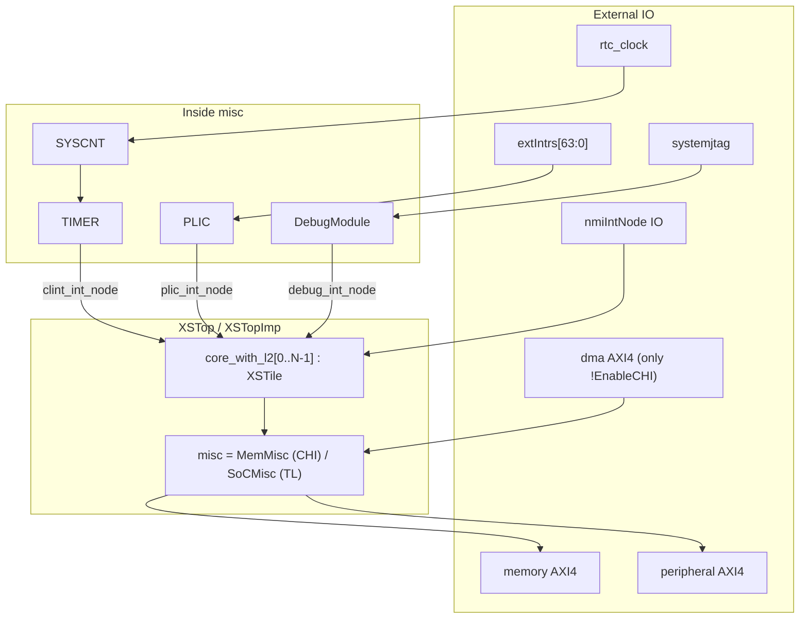
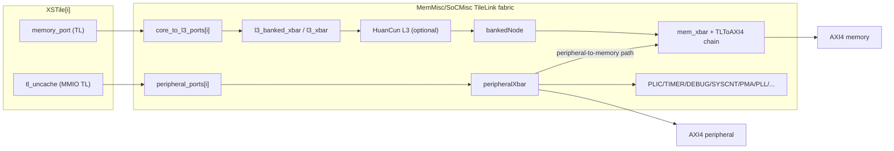
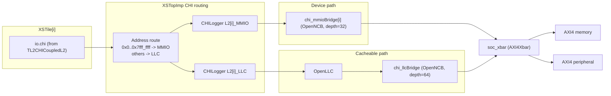
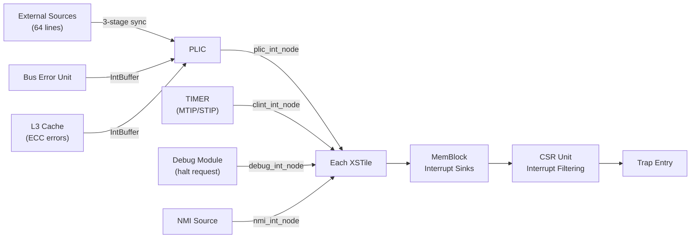
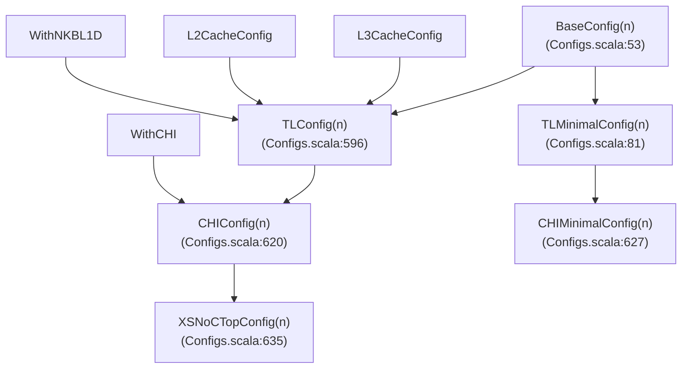

# Chapter 3. SoC Integration

### Block Diagrams: Decomposed SoC Topology

#### Diagram 3-1. Structural Hierarchy and Control/Interrupt Plane



#### Diagram 3-2. TileLink Data Plane (`EnableCHI = false`)



#### Diagram 3-3. CHI Data Plane (`EnableCHI = true`)



Diagram sources: [Top.scala:86](../../src/main/scala/top/Top.scala#L86), [Top.scala:99](../../src/main/scala/top/Top.scala#L99), [Top.scala:162](../../src/main/scala/top/Top.scala#L162), [Top.scala:240](../../src/main/scala/top/Top.scala#L240), [Top.scala:372](../../src/main/scala/top/Top.scala#L372), [XSTile.scala:47](../../src/main/scala/xiangshan/XSTile.scala#L47), [XSTile.scala:48](../../src/main/scala/xiangshan/XSTile.scala#L48), [L2Top.scala:81](../../src/main/scala/xiangshan/L2Top.scala#L81), [L2Top.scala:128](../../src/main/scala/xiangshan/L2Top.scala#L128), [SoC.scala:446](../../src/main/scala/system/SoC.scala#L446), [SoC.scala:470](../../src/main/scala/system/SoC.scala#L470), [SoC.scala:475](../../src/main/scala/system/SoC.scala#L475), [SoC.scala:503](../../src/main/scala/system/SoC.scala#L503), [SoC.scala:520](../../src/main/scala/system/SoC.scala#L520), [SoC.scala:521](../../src/main/scala/system/SoC.scala#L521), [SoC.scala:485](../../src/main/scala/system/SoC.scala#L485), [SoC.scala:644](../../src/main/scala/system/SoC.scala#L644), [XSNoCTop.scala:470](../../src/main/scala/top/XSNoCTop.scala#L470).

This chapter describes how the XiangShan Kunminghu core is embedded in a complete System-on-Chip. It covers the top-level module hierarchy from the generator entry point down through tiles, the bus interconnect in both TileLink and CHI modes, the on-chip peripheral complex, the interrupt architecture, and the configuration system that parametrizes all of these.

The primary source files for this chapter are [Top.scala:86](../../src/main/scala/top/Top.scala#L86), [XSTile.scala:35](../../src/main/scala/xiangshan/XSTile.scala#L35), [L2Top.scala:62](../../src/main/scala/xiangshan/L2Top.scala#L62), [SoC.scala:53](../../src/main/scala/system/SoC.scala#L53), and [XSNoCTop.scala:42](../../src/main/scala/top/XSNoCTop.scala#L42).

---

## 3.1 Top-Level Module Hierarchy

The XiangShan SoC is assembled from a hierarchy of Chisel `LazyModule` nodes connected through the Rocket-Chip Diplomacy framework. Diplomacy allows bus widths, address ranges, and interrupt fanout to be negotiated automatically at elaboration time rather than wired manually. The hierarchy has four principal layers:

| Layer | Module | Role |
|-------|--------|------|
| Generator | [`TopMain`](../../src/main/scala/top/Generator.scala) / [`XiangShanStage`](../../src/main/scala/top/Generator.scala) | Entry point; invokes Chisel elaboration |
| SoC | [`XSTop`](../../src/main/scala/top/Top.scala#L86) or [`XSNoCTop`](../../src/main/scala/top/XSNoCTop.scala#L42) | Instantiates tiles, L3, peripherals, external ports |
| Tile | [`XSTile`](../../src/main/scala/xiangshan/XSTile.scala#L35) | Wraps one core + L2; exposes memory, MMIO, interrupt ports |
| Core | [`XSCore`](../../src/main/scala/xiangshan/XSCore.scala#L59) | Frontend + Backend + MemBlock |

The generator reads a configuration class name from the command line (for example, `CONFIG=TLConfig`), constructs a CDE `Parameters` object, and passes it to the top-level `LazyModule`. Every module in the hierarchy receives this implicit `Parameters` and can query any configuration key.

### 3.1.1 `XSTop` — The Standard Top

`XSTop` at [Top.scala:86](../../src/main/scala/top/Top.scala#L86) extends `BaseXSSoc` and is the default top-level module for both simulation and synthesis. Its key responsibilities are:

1. **Instantiate the peripheral complex.** Depending on whether the CHI protocol is enabled, it creates either a `MemMisc` (CHI mode) or a `SoCMisc` (TileLink mode) at [Top.scala:88–90](../../src/main/scala/top/Top.scala#L88). Both contain the timer, PLIC, debug module, system counter, PLL controller, PMA checker, and the memory-to-AXI4 path. `SoCMisc` additionally includes a DMA slave port.

2. **Instantiate the tile array.** The loop at [Top.scala:99–104](../../src/main/scala/top/Top.scala#L99) creates one `XSTile` per element of `XSTileKey`, each parameterized with its own `HartId`.

3. **Instantiate the L3 cache.** If `L3CacheParamsOpt` is defined, a HuanCun L3 is created at [Top.scala:106–116](../../src/main/scala/top/Top.scala#L106). In CHI mode, an `OpenLLC` module replaces HuanCun and is instantiated inside the hardware implementation class at [Top.scala:301–310](../../src/main/scala/top/Top.scala#L301).

4. **Wire interrupt trees.** The loop at [Top.scala:162–186](../../src/main/scala/top/Top.scala#L162) connects every tile's CLINT, PLIC, debug, and NMI interrupt nodes.

5. **Wire memory paths.** Cached memory traffic flows from each tile's `memory_port` into the L3 banked crossbar (TileLink mode) or through CHI loggers and the OpenLLC (CHI mode). MMIO traffic from each tile's `tl_uncache` port reaches the peripheral crossbar.

6. **Expose external IO.** The hardware implementation class `XSTopImp` at [Top.scala:240](../../src/main/scala/top/Top.scala#L240) creates the AXI4 memory and peripheral ports, the JTAG interface, external interrupt inputs, per-core halt and reset-vector signals, and per-core trace ports.

### 3.1.2 `XSNoCTop` — The CHI Network-on-Chip Top

When the `UseXSNoCTop` flag is set, the generator produces an `XSNoCTop` instead. This variant, defined at [XSNoCTop.scala:470](../../src/main/scala/top/XSNoCTop.scala#L470), is designed for multi-core configurations where the interconnect between L2 and the last-level cache is a CHI network-on-chip with explicit clock-domain crossing.

`XSNoCTop` differs from `XSTop` in several ways:

- **Multi-clock support.** The `HasAsyncClockImp` trait at [XSNoCTop.scala:76](../../src/main/scala/top/XSNoCTop.scala#L76) introduces separate `noc_clock`, `soc_clock`, and `clint_clock` domains in addition to the core clock. Each domain has its own synchronized reset.
- **CHI async bridges.** When `EnableCHIAsyncBridge` is defined, a `CHIAsyncBridgeSink` wraps each tile's CHI port to cross from the core clock to the NoC clock domain. The default async FIFO depth is 16 entries with 3 synchronizer stages, configured in [SoC.scala:116](../../src/main/scala/system/SoC.scala#L116).
- **Per-tile wrapping.** Instead of bare `XSTile`, this variant can wrap each tile with `XSTileWrap`, adding isolation, power-down, and async bridge logic.
- **Low-power support.** The `HasCoreLowPowerImp` trait at [XSNoCTop.scala:89](../../src/main/scala/top/XSNoCTop.scala#L89) implements a state machine for L2 flush, WFI detection, CHI SYSCO handshake, and Q-channel power-down sequencing.

### 3.1.3 `XSTile` — The Per-Core Tile

Each `XSTile` at [XSTile.scala:35](../../src/main/scala/xiangshan/XSTile.scala#L35) wraps exactly one `XSCore` and one `L2Top`:

```
val core  = LazyModule(new XSCore())
val l2top = LazyModule(new L2Top())
```

The tile's primary job is to connect the core's L1 cache clients to the L2 crossbar, wire MMIO paths, and thread interrupt and control signals between the SoC level and the core. The bus topology inside the tile is:

```
DCache clientNode → l1d_to_l2_buffer → l1d_logger → misc_l2_pmu ------------------+
ICache clientNode → l1i_logger → misc_l2_pmu --------------------------------------+
PTW → ptw_to_l2_buffer → ptw_logger → misc_l2_pmu ---------------------------------+
                                                                                     |
                                                                                     ↓
                                                                               l1_xbar (TLXbar)
                                                                                     |
                                                                                     ↓
                                                                          xbar_l2_buffer (TLBuffer)
                                                                                     |
                                                                                     ↓
                                                                             CoupledL2 cache
                                                                                     |
                                                                                     ↓
                                                                           memory_port or CHI
```

This connection is established at [XSTile.scala:64–72](../../src/main/scala/xiangshan/XSTile.scala#L64). MMIO paths from the instruction uncache and data uncache are routed to `L2Top` via `i_mmio_port` and `d_mmio_port` at [XSTile.scala:93–98](../../src/main/scala/xiangshan/XSTile.scala#L93), where they are later merged through a separate `mmio_xbar`.

Interrupt nodes are exposed as identity nodes and buffered before reaching the MemBlock at [XSTile.scala:52–60](../../src/main/scala/xiangshan/XSTile.scala#L52):

```
clint_int_node  → IntBuffer() → memBlock.clint_int_sink
plic_int_node   → IntBuffer() → memBlock.plic_int_sink
debug_int_node  → IntBuffer() → memBlock.debug_int_sink
nmi_int_node    → IntBuffer() → memBlock.nmi_int_sink
```

### 3.1.4 `L2Top` — The L2 Cache Wrapper

`L2TopInlined` at [L2Top.scala:62](../../src/main/scala/xiangshan/L2Top.scala#L62) contains the L1-to-L2 crossbar, the CoupledL2 cache instance, the MMIO crossbar, the Bus Error Unit, and performance monitoring nodes. It is the Diplomacy-level glue between the core and the rest of the memory system.

The L2 cache is conditionally instantiated at [L2Top.scala:111–130](../../src/main/scala/xiangshan/L2Top.scala#L111). In TileLink mode, a `TL2TLCoupledL2` is created; in CHI mode, a `TL2CHICoupledL2` is created. The distinction is critical: in CHI mode, the L2's outward-facing port speaks the CHI protocol directly, so there is no `memory_port` TileLink node; instead, the CHI port is threaded up to the tile IO.

### 3.1.5 `XSCore` — The Processor Core

`XSCore` at [XSCore.scala:59](../../src/main/scala/xiangshan/XSCore.scala#L59) instantiates the three major pipeline blocks:

| Block | Module | Role |
|-------|--------|------|
| `frontend` | `Frontend()` | BPU, IFU, ICache, FTQ, IBuffer |
| `backend` | `Backend(backendParams)` | Decode, Rename, Dispatch, Issue, Execute, ROB |
| `memBlock` | `MemBlock` | Load/Store pipelines, DCache, TLBs, PTW, Store Buffer |

The core connects the ICache's client node and instruction uncache node to the MemBlock's frontend bridge at [XSCore.scala:70–74](../../src/main/scala/xiangshan/XSCore.scala#L70). The remaining connections (frontend↔backend, backend↔memBlock) are made through bundled IO in the implementation class.

---

## 3.2 TileLink and CHI Interconnect

XiangShan supports two on-chip interconnect protocols, selectable via the `EnableCHI` configuration key:

| Property | TileLink Mode | CHI Mode |
|----------|--------------|----------|
| Config flag | `EnableCHI = false` | `EnableCHI = true` |
| L1→L2 protocol | TileLink | TileLink (internal to tile) |
| L2→L3 protocol | TileLink | AMBA CHI |
| L3 implementation | HuanCun | OpenLLC |
| L3→Memory bridge | TLToAXI4 | OpenNCB (CHI→AXI4) |
| Multi-clock | Single clock | Optional async bridges |
| Top module | `XSTop` | `XSTop` or `XSNoCTop` |
| Example config | `TLConfig` | `CHIConfig`, `XSNoCTopConfig` |

### 3.2.1 TileLink Mode

In TileLink mode, all bus traffic from L1 through L3 to the memory controller uses the TileLink protocol from Rocket-Chip. The topology is:

```
Per-Core Tile:
  L1D, L1I, PTW → l1_xbar → L2 (TL2TLCoupledL2) → l2_binder → memory_port

SoC Level:
  memory_port → l3_banked_xbar → L3 (HuanCun) → bankedNode → mem_xbar → TLToAXI4 → AXI4 Memory
  mmio_port → peripheralXbar → {PLIC, TIMER, DEBUG, PMA, PLL, ...}
  peripheralXbar → TLWidthWidget → mem_xbar (peripheral-to-memory path)
```

The `BaseSoC` class at [SoC.scala:243](../../src/main/scala/system/SoC.scala#L243) defines the crossbar nodes:

- `bankedNode`: A `BankBinder` that interleaves addresses across `L3NBanks` banks with `L3BlockSize` granularity.
- `peripheralXbar`: Merges uncached traffic from all cores and routes it to on-chip peripherals.
- `l3_xbar` and `l3_banked_xbar`: Connect per-core L2 outputs to the L3 cache banks.

The memory-to-AXI4 conversion chain at [SoC.scala:322–341](../../src/main/scala/system/SoC.scala#L322) is:

```
bankedNode → TLCacheCork → l3_mem_pmu → TLClientsMerger → TLXbar → TLBuffer(2) → mem_xbar
mem_xbar → TLWidthWidget(L3OuterBusWidth/8) → TLBuffer(2) → TLSourceShrinker(64) → TLToAXI4 → AXI4 Memory
```

The `TLCacheCork` converts cache-block Acquire/Release operations into simpler Get/Put operations suitable for the uncached memory interface. The `TLSourceShrinker` limits outstanding transactions to 64.

### 3.2.2 CHI Mode

In CHI mode, the L2 cache speaks the CHI protocol on its outward-facing port. The `TL2CHICoupledL2` module at [L2Top.scala:128](../../src/main/scala/xiangshan/L2Top.scala#L128) translates incoming TileLink transactions from L1 into CHI requests.

At the SoC level, each core's CHI port is connected through CHI loggers and an address-based router to two destinations:

1. **OpenLLC (L3 equivalent)**: Handles cacheable traffic. The routing at [Top.scala:372–383](../../src/main/scala/top/Top.scala#L372) directs addresses outside the peripheral region (`0x0`–`0x7FFFFFFF`) to the LLC.
2. **Per-core MMIO bridge (OpenNCB)**: Handles device/uncacheable traffic. The routing directs peripheral-range addresses to a per-core `OpenNCB` that converts CHI to AXI4.

The CHI→AXI4 bridges are:

| Bridge | Purpose | Outstanding Depth | Location |
|--------|---------|------------------|----------|
| `chi_llcBridge_opt` | LLC to memory | 64 | [Top.scala:118–130](../../src/main/scala/top/Top.scala#L118) |
| `chi_mmioBridge_opt[i]` | Per-core MMIO | 32 | [Top.scala:132–148](../../src/main/scala/top/Top.scala#L132) |

Both bridges use `OpenNCB` from the `openLLC` library. The LLC bridge is configured for ordered writes (`WriteAddress`), while MMIO bridges accept device memory attributes and generate read receipts after acceptance.

**Node ID assignment** follows a simple scheme set at [Top.scala:387](../../src/main/scala/top/Top.scala#L387) and [Top.scala:431–436](../../src/main/scala/top/Top.scala#L431):

| Node ID | Identity |
|---------|----------|
| `0` to `N-1` | Core CHI request nodes (one per tile) |
| `N` to `2N-1` | Per-core MMIO bridge nodes |
| `2N` | OpenLLC (last-level cache) |

where `N = NumCores`.

### 3.2.3 CHI Protocol Summary

The CoupledL2 submodule implements CHI Issue B (configurable to Issue E.b via `CHIIssue`). The coherence states are defined in [Message.scala](../../coupledL2/src/main/scala/coupledL2/tl2chi/chi/Message.scala):

| State | Encoding | Meaning |
|-------|----------|---------|
| I (Invalid) | `000` | Line not cached |
| SC (Shared Clean) | `001` | Cached, unmodified, may exist elsewhere |
| UC (Unique Clean) | `010` | Cached, unmodified, exclusive ownership |
| UD (Unique Dirty) | `010` | Cached, modified, exclusive ownership |
| SD (Shared Dirty) | `011` | Cached, modified, may exist elsewhere |

The CHI link layer at [LinkLayer.scala](../../coupledL2/src/main/scala/coupledL2/tl2chi/chi/LinkLayer.scala) defines three channels per direction:

- **Downward (RN→SN):** REQ, RSP, DAT — for requests, responses, and data from requestor to subordinate.
- **Upward (SN→RN):** RSP, DAT, SNP — for completions, data, and snoops from subordinate back to requestor.

Each channel uses a flit-level handshake (`flitpend`, `flitv`, `flit`, `lcrdv`) for credit-based flow control.

### 3.2.4 AXI4 External Ports

Regardless of the internal protocol, the SoC presents AXI4 interfaces to the outside world:

| Port | Address Range | Beat Width | Purpose |
|------|--------------|------------|---------|
| Memory | `0x80000000`–`0xFFFF_FFFFFFFF` | 256 bits (32 bytes) | Main memory (DDR/HBM) |
| Peripheral | `0x0`–`0x7FFFFFFF` | 256 bits | MMIO devices |
| DMA (TL mode only) | Full range | 256 bits | Inbound DMA from external masters |

The memory port is defined by the `HaveAXI4MemPort` trait at [SoC.scala:292](../../src/main/scala/system/SoC.scala#L292). The peripheral port is similarly defined by the `HaveAXI4PeripheralPort` trait. In TileLink mode, the DMA port enters via `HaveSlaveAXI4Port` at [SoC.scala:254](../../src/main/scala/system/SoC.scala#L254), which converts AXI4 to TileLink through a protocol bridge chain (`AXI4→AXI4IdIndexer→AXI4Fragmenter→AXI4ToTL→TLWidthWidget→TLFIFOFixer→l3_xbar`).

---

## 3.3 Multi-Core Topology

### 3.3.1 Tile Array

XiangShan supports an arbitrary number of cores. The core count is determined by the length of `XSTileKey`, which is set in the base configuration at [Configs.scala:59](../../src/main/scala/top/Configs.scala#L59):

```
case XSTileKey => Seq.tabulate(n){ i => XSCoreParameters(HartId = i) }
```

The tile instantiation loop at [Top.scala:99–104](../../src/main/scala/top/Top.scala#L99) creates one `XSTile` per entry, each with its own `XSCoreParamsKey` override:

```
val core_with_l2 = tiles.map(coreParams =>
  LazyModule(new XSTile()(p.alter((site, here, up) => {
    case XSCoreParamsKey => coreParams
    ...
  })))
)
```

Typical configurations use 1 core (`TLConfig(1)`) or 2 cores (`TLConfig(2)`), but the parameterization supports larger counts.

### 3.3.2 Shared Resources

All cores share:

- **L3 Cache / LLC**: A single HuanCun or OpenLLC instance receives cached traffic from all L2 caches. The L3 is configured with all hart IDs at [Top.scala:109](../../src/main/scala/top/Top.scala#L109) so it can track per-core coherence state.
- **PLIC**: A single PLIC distributes external interrupts to all cores. Each core's BEU interrupt also feeds back into the PLIC at [Top.scala:167](../../src/main/scala/top/Top.scala#L167).
- **Debug Module**: One debug module serves all cores via a shared JTAG interface.
- **System Counter (SYSCNT)**: A single wall-clock counter whose value is broadcast as `clintTime` to every core at [SoC.scala:610](../../src/main/scala/system/SoC.scala#L610).
- **AXI4 external ports**: All cores share a single memory port and peripheral port.

### 3.3.3 Per-Core Resources

Each core has its own:

- **L1 I-Cache and D-Cache**
- **L2 Cache** (CoupledL2, inside the tile)
- **TLBs and Page Table Walker**
- **MMIO bridge** (in CHI mode, each core has a dedicated OpenNCB for MMIO)
- **Reset vector** input and **halt** output

### 3.3.4 Core Reset Management

Core resets can be managed by the L3 cache. If the L3 provides reset nodes (`rst_nodes`), they drive each tile's `core_reset_sink` at [Top.scala:192–200](../../src/main/scala/top/Top.scala#L192). This enables the L3 cache to hold cores in reset during initialization sequences. If no L3 reset nodes exist, the reset is tied to deasserted.

When the `ResetGen` debug option is enabled and L2 is present, the core's reset is derived from the L2Top's `reset_core` output at [XSTile.scala:225–227](../../src/main/scala/xiangshan/XSTile.scala#L225), implementing a hierarchical reset tree.

---

## 3.4 On-Chip Peripheral Complex

The `MemMisc` class at [SoC.scala:440](../../src/main/scala/system/SoC.scala#L440) instantiates and connects all on-chip peripherals. These peripherals are memory-mapped and accessed through the peripheral crossbar (TileLink mode) or device crossbar (CHI mode).

### 3.4.1 Address Map

| Device | Base Address | Size | Description |
|--------|-------------|------|-------------|
| TIMER (CLINT) | `0x3800_0000` | [SoC.scala:74](../../src/main/scala/system/SoC.scala#L74) | Timer interrupts |
| BEU | `0x3801_0000` | 4 KB | Bus Error Unit |
| Debug Module | `0x3802_0000` | [Configs.scala:65](../../src/main/scala/top/Configs.scala#L65) | RISC-V Debug Spec |
| D-Cache Control | `0x3802_2000` | 128 B | Cache control registers |
| PLL Control | `0x3A00_0000` | 4 KB | PLL configuration |
| SYSCNT | `0x3804_0000` | [SoC.scala:75](../../src/main/scala/system/SoC.scala#L75) | System counter |
| PLIC | `0x3C00_0000` | ~64 MB | Interrupt controller |
| UART (sim) | `0x4060_0000` | 64 B | UART Lite (for DTS) |

### 3.4.2 Peripheral Descriptions

**TIMER** — Instantiated at [SoC.scala:520](../../src/main/scala/system/SoC.scala#L520) as `TIMER(TIMERParams(IsSelfTest = true, ...))`. It generates M-mode timer interrupts (MTIP) for each hart. The timer reads wall-clock time from the SYSCNT and compares against per-hart `mtimecmp` registers. It can be placed on the main peripheral crossbar or on a separate bus (when `SeperateBus` is configured).

**SYSCNT (System Counter)** — Instantiated at [SoC.scala:485](../../src/main/scala/system/SoC.scala#L485). It maintains a 64-bit monotonic counter driven by the `rtc_clock` input. The counter value is distributed to all cores as `clintTime` at [SoC.scala:610](../../src/main/scala/system/SoC.scala#L610). It supports software update (`update_en`, `update_value`) and stop (`stop_en`) interfaces.

**PLIC** — Instantiated at [SoC.scala:503](../../src/main/scala/system/SoC.scala#L503). The Platform-Level Interrupt Controller uses the standard Rocket-Chip TLPLIC implementation. It accepts up to 64 external interrupt lines (configurable via `extIntrs`). External interrupts are synchronized through a 3-stage shift register before reaching the PLIC at [SoC.scala:586–592](../../src/main/scala/system/SoC.scala#L586). The BEU's interrupt output is also routed to the PLIC at [Top.scala:167](../../src/main/scala/top/Top.scala#L167) and [Top.scala:188–190](../../src/main/scala/top/Top.scala#L188).

**Debug Module** — Instantiated at [SoC.scala:521](../../src/main/scala/system/SoC.scala#L521). It implements the RISC-V Debug Specification with JTAG transport. Configuration is set in [Configs.scala:61–69](../../src/main/scala/top/Configs.scala#L61): base address `0x38020000`, 2 scratch registers, bus master support enabled. The debug module can optionally be placed on a separate TileLink crossbar (`SeperateDM`) for isolation from the main peripheral bus.

**PLL Control** — A simple register node at [SoC.scala:510–517](../../src/main/scala/system/SoC.scala#L510) providing 6 × 32-bit control registers and a lock status register at [SoC.scala:625–638](../../src/main/scala/system/SoC.scala#L625).

**PMA (Physical Memory Attributes)** — A TileLink-attached checker at [SoC.scala:554](../../src/main/scala/system/SoC.scala#L554) that exposes a `TLPMAIO` port for external cacheability queries.

**Bus Error Unit** — Located inside each `L2Top` at [L2Top.scala:82–85](../../src/main/scala/xiangshan/L2Top.scala#L82). It collects ECC error signals from the ICache, DCache, uncache, and L2 cache. When an error is detected, it raises an interrupt through the PLIC.

---

## 3.5 Interrupt Architecture

XiangShan supports the RISC-V Advanced Interrupt Architecture (AIA) through the ChiselAIA submodule, alongside the traditional PLIC/CLINT path. The interrupt routing is established at [Top.scala:162–166](../../src/main/scala/top/Top.scala#L162):

```
core_with_l2(i).clint_int_node  := misc.timer.intnode           // timer interrupts
core_with_l2(i).plic_int_node  :*= misc.plic.intnode            // external interrupts
core_with_l2(i).debug_int_node  := misc.debugModule...intnode   // debug interrupts
core_with_l2(i).nmi_int_node    := nmiIntNode                   // non-maskable interrupts
```

### 3.5.1 Interrupt Flow Diagram



### 3.5.2 IMSIC (Incoming MSI Controller)

For AIA-compliant interrupt delivery, each hart has a dedicated IMSIC that receives Message Signaled Interrupts (MSIs). The IMSIC is parameterized in [SoC.scala:106–115](../../src/main/scala/system/SoC.scala#L106):

| Parameter | Default | Description |
|-----------|---------|-------------|
| `imsicIntSrcWidth` | 9 | Supports 2^9 = 512 interrupt sources |
| `mAddr` | `0x3A80_0000` | Machine-level interrupt file base |
| `sgAddr` | `0x3B00_0000` | Supervisor/guest interrupt file base |
| `geilen` | 7 | Number of guest interrupt files |
| `vgeinWidth` | 6 | Guest interrupt selector width |
| `iselectWidth` | 12 | Indirect CSR select width |
| `EnableImsicAsyncBridge` | `true` | Enable clock domain crossing |

MSI information is delivered to each core through the `msiInfo` signal in the tile IO at [XSTile.scala:104](../../src/main/scala/xiangshan/XSTile.scala#L104), which carries a valid bit and an MSI payload. The core processes MSIs through indirect CSR registers (`miselect`/`mireg`, `siselect`/`sireg`, `vsiselect`/`vsireg`) defined in the AIA CSR module.

### 3.5.3 APLIC (Advanced Platform-Level Interrupt Controller)

The APLIC converts traditional level/edge interrupt sources into MSI messages targeting the appropriate IMSIC. It supports interrupt delegation between machine and supervisor domains and implements source configuration registers that control detection mode (inactive, detached, edge-rising, edge-falling, level-high, level-low).

### 3.5.4 IOPMP (I/O Physical Memory Protection)

The ChiselIOPMP submodule provides physical memory protection checking for I/O transactions. It sits between AXI4 masters (I/O devices) and the memory system, intercepting read/write requests and checking them against configured protection regions. The IOPMP uses an APB register interface for runtime configuration and supports:

- Fair round-robin arbitration between read and write channels
- FIFO-based buffering for outstanding requests
- Interrupt generation on protection violations
- Configurable address ranges and access permissions

---

## 3.6 Configuration System

XiangShan uses the CDE (Chisel Design Exploration) parameterization framework from Rocket-Chip. Configuration is layered: a base configuration provides defaults, and overlay configs modify specific parameters.

### 3.6.1 Configuration Hierarchy



### 3.6.2 Key Configuration Classes

| Config Class | Base | L1D | L2 | L3 | CHI | Use Case |
|-------------|------|-----|----|----|-----|----------|
| `TLMinimalConfig` | `BaseConfig` | 32 KB | 128 KB | 512 KB (1 bank) | No | Minimal synthesis |
| `TLConfig` | `BaseConfig` | 64 KB | 1 MB | 16 MB | No | Full TileLink |
| `CHIConfig` | `TLConfig` | 64 KB | 1 MB | 16 MB | Yes | Full CHI |
| `XSNoCTopConfig` | `CHIConfig` | 64 KB | 1 MB | 16 MB | Yes | CHI with NoC |
| `CHIMinimalConfig` | `TLMinimalConfig` | 32 KB | 128 KB | 1 MB/bank | Yes | Minimal CHI |

### 3.6.3 BaseConfig Details

`BaseConfig` at [Configs.scala:53](../../src/main/scala/top/Configs.scala#L53) sets foundational parameters:

| Key | Value | Description |
|-----|-------|-------------|
| `XLen` | 64 | 64-bit RISC-V |
| `SoCParamsKey` | `SoCParameters()` | Default SoC parameters |
| `XSTileKey` | `Seq.tabulate(n)(i => XSCoreParameters(HartId = i))` | N cores |
| `DebugModuleKey` | Base `0x38020000`, 2 scratch regs, bus master | Debug module |
| `MaxHartIdBits` | `log2Up(n) max 6` | Hart ID width |
| `EnableJtag` | `true` | JTAG debug enabled |

### 3.6.4 SoC Parameters

The `SoCParameters` case class at [SoC.scala:53–143](../../src/main/scala/system/SoC.scala#L53) collects all SoC-level configuration. Key fields:

| Parameter | Default | Description |
|-----------|---------|-------------|
| `PAddrBits` | 48 | Physical address width |
| `PmemRanges` | `0x80000000`–`0x80000000000` | Physical memory ranges |
| `L3NBanks` | 4 | L3 cache banks |
| `L3BlockSize` | 64 | Cache line size (bytes) |
| `L3InnerBusWidth` | 256 | L3 inner bus width (bits) |
| `L3OuterBusWidth` | 256 | L3 outer bus width (bits) |
| `extIntrs` | 64 | External interrupt count |
| `NumHart` | 64 | Max harts (PLIC limit) |
| `NumIRFiles` | 7 | Interrupt files per hart |
| `NumIRSrc` | 256 | Interrupt source count |
| `EnableCHIAsyncBridge` | `Some(depth=16, sync=3)` | CHI async FIFO params |
| `EnableClintAsyncBridge` | `Some(depth=8, sync=3)` | CLINT async FIFO params |
| `UseXSNoCTop` | `false` | Use NoC-oriented top |
| `EnablePowerDown` | `false` | Enable power-down support |
| `WFIClockGate` | `false` | Clock gate on WFI |

### 3.6.5 YAML Configuration Override

XiangShan supports YAML-based parameter overrides through [YamlParser.scala](../../src/main/scala/top/YamlParser.scala). A YAML file can specify:

- `Config`: Base configuration class name
- `PmemRanges`: Physical memory layout
- `PMAConfigs`: Physical memory attribute entries
- `L2CacheConfig`, `L3CacheConfig`: Cache hierarchy parameters
- `CHIIssue`: CHI protocol version
- `IMSICParams`: Interrupt controller parameters

This allows physical design teams to customize the SoC without modifying Scala source code.

### 3.6.6 Physical Memory Attributes (PMA)

The PMA table at [SoC.scala:58–73](../../src/main/scala/system/SoC.scala#L58) defines access permissions for every address region. The default configuration creates a priority-ordered table where higher entries override lower ones:

| Address | Cacheable | Atomic | Read | Write | Execute | Description |
|---------|-----------|--------|------|-------|---------|-------------|
| `0x80000000000` | Yes | Yes | Yes | Yes | Yes | Upper RAM |
| `0x80000000` | No | No | Yes | Yes | No | Main RAM (MMIO range) |
| `0x38021000` | No | No | Yes | Yes | Yes | I-port (executable) |
| `0x20000000` | No | No | Yes | Yes | Yes | PCIe space |
| `0x0` | — | — | — | — | — | Default (no access) |

The PMA checker is instantiated as a TileLink peripheral and exposed through the `cacheable_check` IO at [Top.scala:276](../../src/main/scala/top/Top.scala#L276).

---

## 3.7 Clock, Reset, and Power Domains

### 3.7.1 Standard Mode (XSTop)

In the standard `XSTop`, the entire chip runs on a single clock (`io.clock`) and a single asynchronous reset (`io.reset`). The reset is synchronized through `ResetGen()` at [Top.scala:299](../../src/main/scala/top/Top.scala#L299). The JTAG debug interface has its own clock domain (`systemjtag.jtag.TCK`) with a separate reset synchronizer.

The RTC clock (`io.rtc_clock`) drives the system counter. It is expected to be a low-frequency reference (for example, 10–100 MHz) and is domain-crossed internally.

### 3.7.2 Multi-Clock Mode (XSNoCTop)

`XSNoCTop` introduces multiple clock domains through the `HasAsyncClockImp` trait at [XSNoCTop.scala:76–87](../../src/main/scala/top/XSNoCTop.scala#L76):

| Clock | Purpose |
|-------|---------|
| `clock` (core clock) | Core pipeline, L1, L2 caches |
| `noc_clock` | CHI interconnect, OpenLLC |
| `soc_clock` | Peripheral bus, PLIC, PMA |
| `clint_clock` | Timer, system counter |

Each domain has its own reset synchronizer. The CHI async bridge (depth 16, 3 sync stages) crosses between the core clock and the NoC clock. The CLINT async bridge (depth 8, 3 sync stages) crosses between the core clock and the CLINT clock.

### 3.7.3 Low-Power Support

When `EnablePowerDown` is set, the `HasCoreLowPowerImp` trait at [XSNoCTop.scala:89](../../src/main/scala/top/XSNoCTop.scala#L89) implements a 7-state FSM for power-down sequencing:

```
IDLE → L2FLUSH → WAITWFI → EXITCO → WAITQ → QREQ → POFFREQ
```

The sequence is:
1. Core CSR triggers L2 flush (`l2_flush_en`)
2. Wait for L2 flush completion
3. Wait for core to reach WFI
4. Execute CHI SYSCO handshake to quiesce the coherent interconnect
5. Q-channel handshake for power controller
6. Signal `o_cpu_no_op` to the SoC power controller

---

## 3.8 DTS, Trace, and Debug IO

### 3.8.1 Device Tree Source (DTS)

The `BaseXSSoc` class at [Top.scala:50](../../src/main/scala/top/Top.scala#L50) uses Rocket-Chip's `ResourceBinding` mechanism to generate a Device Tree Source file. The `HasDTSImp` trait at [Top.scala:78–84](../../src/main/scala/top/Top.scala#L78) writes out `dts`, `graphml`, and `json` artifacts during elaboration. These files describe the SoC's memory map, interrupt topology, and peripheral configuration in a format that firmware and operating systems can consume.

### 3.8.2 Trace Interface

Each core exposes a trace interface at [Top.scala:280–296](../../src/main/scala/top/Top.scala#L280) for hardware-assisted instruction tracing. The interface includes:

- **From encoder** (input): `enable` and `stall` signals to control trace generation.
- **To encoder** (output): Per-group `iaddr`, `itype`, `iretire`, `ilastsize`, plus global `cause`, `tval`, `priv`, and `mstatus`.

The trace groups correspond to the core's commit width, allowing multiple retired instructions to be reported per cycle.

### 3.8.3 External IO Summary

The `XSTopImp` IO bundle at [Top.scala:260–297](../../src/main/scala/top/Top.scala#L260) presents the following signals to the outside world:

| Signal | Direction | Width/Type | Description |
|--------|-----------|------------|-------------|
| `clock` | Input | Clock | Main system clock |
| `reset` | Input | AsyncReset | Asynchronous reset |
| `extIntrs` | Input | `NrExtIntr` bits | External interrupt lines |
| `pll0_lock` | Input | Bool | PLL lock status |
| `pll0_ctrl` | Output | Vec(6, UInt(32)) | PLL control registers |
| `systemjtag` | Mixed | JTAGIO + metadata | Debug JTAG port |
| `debug_reset` | Output | Bool | Debug module ndreset |
| `rtc_clock` | Input | Clock | Real-time clock reference |
| `cacheable_check` | Mixed | TLPMAIO | PMA query interface |
| `riscv_halt` | Output | Vec(NumCores, Bool) | Per-core halt status |
| `riscv_critical_error` | Output | Vec(NumCores, Bool) | Per-core critical error |
| `riscv_rst_vec` | Input | Vec(NumCores, UInt) | Per-core reset vector |
| `traceCoreInterface` | Output | Vec(NumCores, ...) | Per-core trace ports |
| `memory` | Mixed | AXI4 | Memory port |
| `peripheral` | Mixed | AXI4 | Peripheral port |

---

## 3.9 Key Takeaways

- **Dual-protocol flexibility.** XiangShan can be built with either TileLink (simpler, good for small core counts) or CHI (scalable, industry-standard for multi-core). The choice is a single configuration flag (`EnableCHI`) that ripples through the entire hierarchy.

- **Diplomacy-driven integration.** The use of Rocket-Chip Diplomacy for bus negotiation eliminates manual width/address plumbing. Crossbars, buffers, and protocol bridges are composed declaratively and resolved at elaboration time.

- **Modular tile design.** Each `XSTile` is a self-contained unit with its own L2 cache, interrupt sinks, and MMIO path. Adding cores is as simple as increasing the `n` parameter in the configuration constructor.

- **AIA-ready interrupt architecture.** Beyond the traditional PLIC/CLINT, XiangShan integrates IMSIC and APLIC for MSI-based interrupt delivery, preparing the platform for virtualization-heavy workloads.

- **Layered configuration.** The CDE framework, combined with YAML overrides and cache-size helper configs, allows the same RTL source to target everything from minimal FPGA prototypes to full tape-out configurations without code changes.
