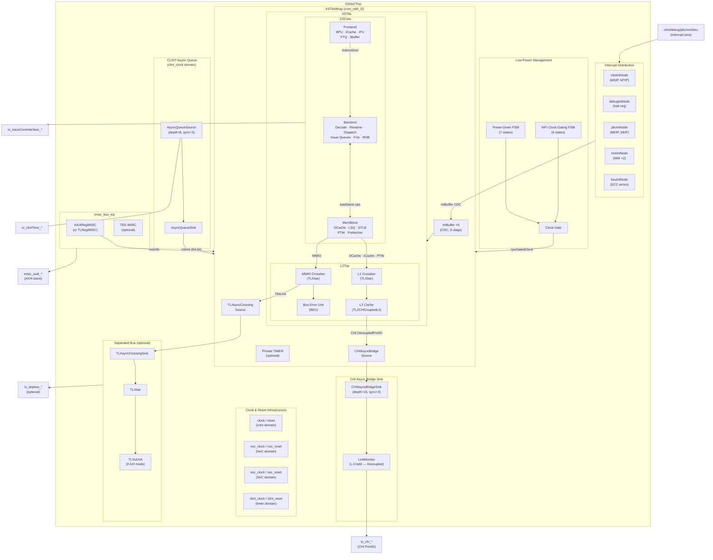
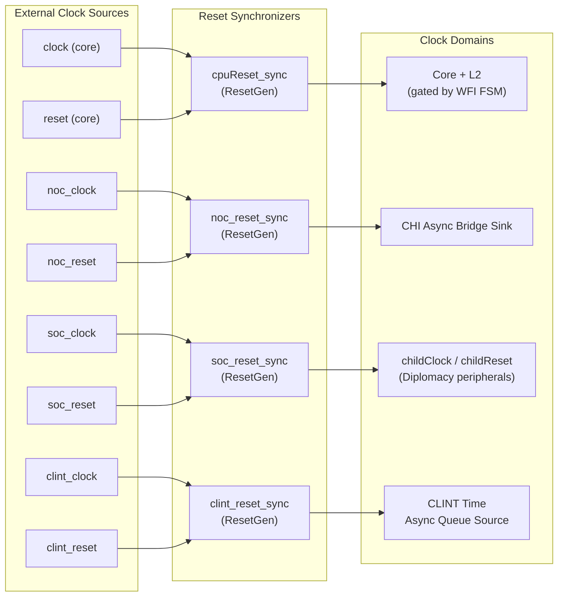
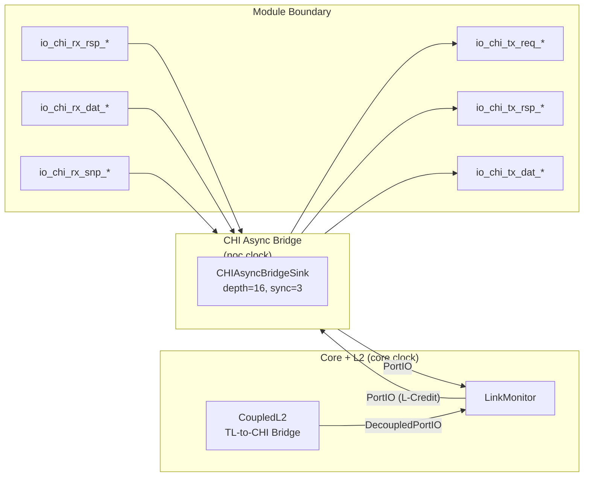
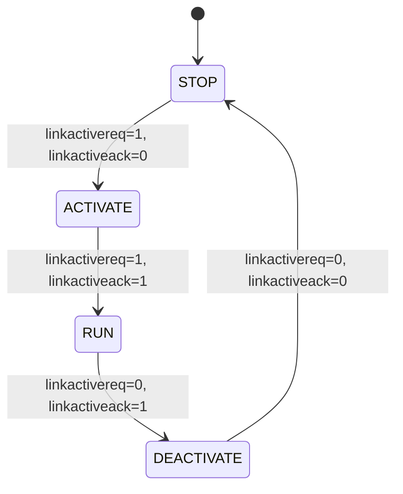
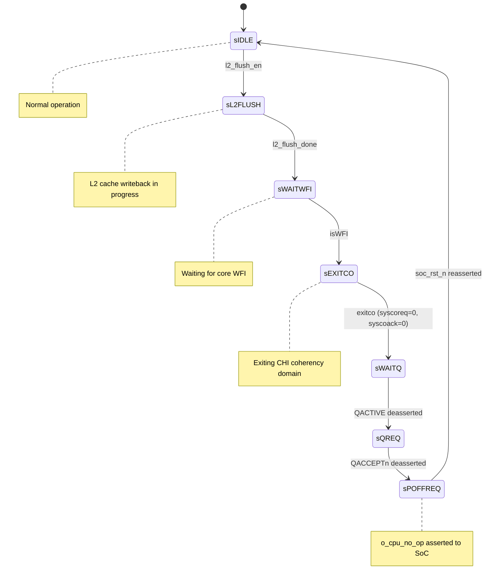
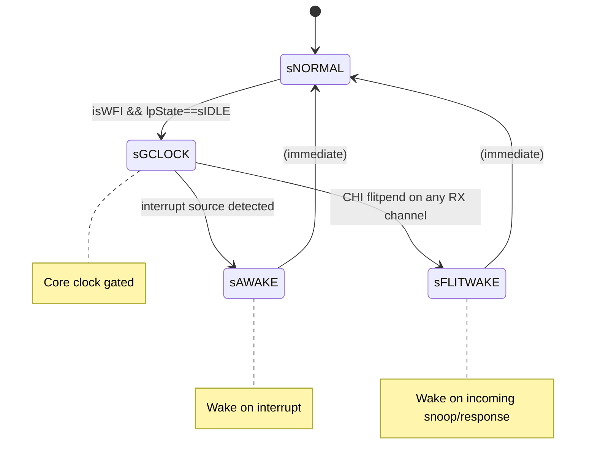

# Chapter 3a. XSNoCTop Top-Level Interface Reference

This chapter provides a complete reference for the `XSNoCTop` module—the XiangShan top-level variant designed for integration into an external CHI Network-on-Chip. While Chapter 3 surveys the full SoC hierarchy, this chapter deep-dives on every IO port of the generated RTL, explaining its origin in Chisel source, its purpose, and its interaction with the rest of the system.

The primary source files are [XSNoCTop.scala:470](../../src/main/scala/top/XSNoCTop.scala#L470) (module definition), [Configs.scala:635](../../src/main/scala/top/Configs.scala#L635) (configuration), [SoC.scala:53](../../src/main/scala/system/SoC.scala#L53) (SoC parameters), [LinkLayer.scala:26](../../coupledL2/src/main/scala/coupledL2/tl2chi/chi/LinkLayer.scala#L26) (CHI channel IO), and [Message.scala:426](../../coupledL2/src/main/scala/coupledL2/tl2chi/chi/Message.scala#L426) (flit definitions).

---

## Internal Architecture of XSNoCTop

Before examining individual IO ports, it is essential to understand what lives *inside* `XSNoCTop`. The module is not a monolithic block—it is a composition of distinct units, each responsible for a well-defined aspect of the processor tile. The diagram below shows every major unit and how they interconnect.

#### Diagram 3a-0. XSNoCTop Internal Block Diagram



### Unit-by-Unit Description

The following subsections describe each unit inside `XSNoCTop`, starting from the outermost wrappers and working inward to the processor core.

#### XSTileWrap

[XSTileWrap.scala:37](../../src/main/scala/xiangshan/XSTileWrap.scala#L37) is the primary child of `XSNoCTop`. Instantiated as `core_with_l2` at [XSNoCTop.scala:196](../../src/main/scala/top/XSNoCTop.scala#L196), it contains the entire processor tile—core pipeline, L2 cache, and all clock-domain-crossing bridges—inside a single `LazyModule`. XSTileWrap exists to isolate the core clock domain (which may be gated during WFI) from the rest of the top-level logic. It receives the gated `cpuGatedClock` from the low-power FSMs and propagates it to all internal modules.

XSTileWrap also manages the interrupt path between the SoC-facing interrupt nodes and the core. Five `IntBuffer` instances with 3-stage CDC synchronizers ([XSTileWrap.scala:53–56](../../src/main/scala/xiangshan/XSTileWrap.scala#L53)) ensure interrupt signals cross safely from the SoC/peripheral clock domain into the core clock domain. When `UsePrivateClint` is enabled, XSTileWrap instantiates a private `TIMER` module ([XSTileWrap.scala:52](../../src/main/scala/xiangshan/XSTileWrap.scala#L52)) that generates the MTIP interrupt locally rather than receiving it from an external CLINT.

#### XSTile

[XSTile.scala:35](../../src/main/scala/xiangshan/XSTile.scala#L35) sits inside XSTileWrap and groups the two major architectural halves: the processor core (`XSCore`) and the L2 cache subsystem (`L2Top`). XSTile wires the L1 cache ports (DCache, ICache, PTW) from the core into the L2Top's L1 crossbar, connects the MMIO path, and hooks up the L2 prefetch receiver to the core's prefetch sender. It is the level at which the memory hierarchy meets the execution pipeline.

#### XSCore

[XSCore.scala:77](../../src/main/scala/xiangshan/XSCore.scala#L77) is the processor execution core itself, composed of three major sub-modules:

- **Frontend** ([Frontend.scala:98](../../src/main/scala/xiangshan/frontend/Frontend.scala#L98)): The instruction supply engine. It contains the **Branch Prediction Unit (BPU)** with multiple predictors (uBTB, TAGE-SC, ITTAGE, RAS, FTB), the **Instruction Cache (ICache)**, the **Instruction Fetch Unit (IFU)** that drives cache reads, the **Fetch Target Queue (FTQ)** that decouples prediction from fetch, and the **Instruction Buffer (IBuffer)** that smooths the flow of decoded instruction bundles to the backend. The frontend delivers up to 6 instructions per cycle to the decode stage.

- **Backend** ([Backend.scala:50](../../src/main/scala/xiangshan/backend/Backend.scala#L50)): The out-of-order execution engine. It receives decoded instructions from the frontend and processes them through **Decode**, **Rename** (mapping architectural registers to physical registers), and **Dispatch** (distributing micro-ops to issue queues). Three execution **Regions**—integer, floating-point, and vector—each contain their own **Issue Queues** and **Functional Units** (ALU, BRU, MulDiv, FP, Vector, CSR). The **Reorder Buffer (ROB)** tracks all in-flight instructions and enforces precise exceptions by committing results in program order.

- **MemBlock** ([MemBlock.scala:1897](../../src/main/scala/xiangshan/mem/MemBlock.scala#L1897)): The memory subsystem that handles all load and store operations. It contains the **L1 Data Cache (DCache)** with MSHRs for non-blocking misses, the **Load Queue (LQ)** and **Store Queue (SQ)** for tracking in-flight memory operations, multiple **DTLBs** (separate for loads, stores, and prefetch), the **Page Table Walker (PTW)** for TLB refills, and hardware **prefetchers** for both L1 and L2. MemBlock also manages the uncached path for MMIO accesses and collects ECC error reports for the Bus Error Unit.

#### L2Top

[L2Top.scala:385](../../src/main/scala/xiangshan/L2Top.scala#L385) wraps the L2 cache and the interconnect fabric between L1 and the external memory hierarchy. Its key components are:

- **L1 Crossbar** (`l1_xbar`): A TileLink crossbar ([L2Top.scala:78](../../src/main/scala/xiangshan/L2Top.scala#L78)) that merges requests from three L1 masters—DCache, ICache, and PTW—into a single stream feeding the L2 cache.

- **L2 Cache** (`TL2CHICoupledL2`): When CHI is enabled, this is a banked inclusive/non-inclusive L2 cache that accepts TileLink requests from the L1 crossbar and produces CHI transactions toward the external interconnect. Configured with 4 banks and 1 MB capacity in the default `XSNoCTopConfig`, it is defined in the `coupledL2` submodule ([L2Top.scala:128](../../src/main/scala/xiangshan/L2Top.scala#L128)).

- **MMIO Crossbar** (`mmio_xbar`): A second TileLink crossbar ([L2Top.scala:79](../../src/main/scala/xiangshan/L2Top.scala#L79)) that routes uncached MMIO traffic from the core's ICache and DCache MMIO ports to downstream destinations: the Bus Error Unit, the separated bus (for external peripherals), and the L2 cache's MMIO node (which forwards non-cacheable requests outward).

- **Bus Error Unit (BEU)**: A Rocket Chip standard module ([L2Top.scala:82](../../src/main/scala/xiangshan/L2Top.scala#L82)) that collects ECC error reports from the ICache, DCache, uncache, and L2 cache. When an error occurs, it raises an interrupt through `beuIntNode`, which surfaces at the top level as the `beu_0_0` output pin.

- **Bus Performance Monitors**: Two `BusPerfMonitor` instances ([L2Top.scala:92–93](../../src/main/scala/xiangshan/L2Top.scala#L92)) that count TileLink transactions on the L1-to-L2 path (`misc_l2_pmu`) and L2-to-L3 path (`l2_l3_pmu`) for performance analysis.

#### CHI Async Bridge

The CHI path from the L2 cache to the module boundary crosses two clock domains. Inside XSTileWrap, a `CHIAsyncBridgeSource` ([XSTileWrap.scala:28](../../src/main/scala/xiangshan/XSTileWrap.scala#L28)) launches CHI flits from the core clock into an asynchronous FIFO. At the top level, `HasXSTileCHIImp` instantiates a `CHIAsyncBridgeSink` ([XSNoCTop.scala:273](../../src/main/scala/top/XSNoCTop.scala#L273)) in the `noc_clock` domain that receives flits from the FIFO. Between the L2 cache and the bridge source sits the **LinkMonitor** ([LinkLayer.scala:318](../../coupledL2/src/main/scala/coupledL2/tl2chi/chi/LinkLayer.scala#L318)), which converts between the internal ready/valid (`DecoupledPortIO`) handshake and the external L-Credit (`PortIO`) protocol used by the CHI specification.

#### CLINT Async Queue

The 64-bit `mtime` counter arrives from the `clint_clock` domain. An `AsyncQueueSource` on the CLINT side and an `AsyncQueueSink` on the core side ([XSNoCTop.scala:460](../../src/main/scala/top/XSNoCTop.scala#L460)) transfer the timer value safely across domains (default: depth 8, 3 synchronizer stages). The resulting `ValidIO` feeds the core's CSR unit, which uses `mtime` for timer interrupt comparison and for the `time` CSR read.

#### imsic_bus_top

[imsic_axi_top.scala:31](../../src/main/scala/device/imsic_axi_top.scala#L31) implements the **Incoming MSI Controller (IMSIC)**, the interrupt receiver defined by the RISC-V Advanced Interrupt Architecture (AIA). It accepts Message Signaled Interrupts from the platform interrupt controller over an AXI4 slave interface (or TileLink, depending on `IMSICBusType`). The IMSIC decodes the MSI write into an interrupt file update and delivers `msiInfo` bundles to the core's CSR unit. When `HasTEEIMSIC` is enabled, a second instance handles interrupts for the Trusted Execution Environment.

#### Interrupt Distribution Nodes

Five Diplomacy `IntSourceNode` / `IntSinkNode` instances ([XSNoCTop.scala:201–205](../../src/main/scala/top/XSNoCTop.scala#L201)) route interrupt wires between external SoC controllers and the core:

| Node | Source | Signals |
|------|--------|---------|
| `clintIntNode` | External CLINT | MSIP (software interrupt), MTIP (timer interrupt) |
| `debugIntNode` | Debug module | Halt request |
| `plicIntNode` | PLIC (2 ports) | MEIP (machine external), SEIP (supervisor external) |
| `nmiIntNode` | Platform NMI controller | Two non-maskable interrupt sources |
| `beuIntNode` | BEU (output) | ECC error interrupt raised by the Bus Error Unit |

Each input node passes through a 3-stage `IntBuffer` inside XSTileWrap for clock-domain-crossing synchronization before reaching the core.

#### Separated Bus

The `HasSeperatedBusOpt` trait ([XSNoCTop.scala:286](../../src/main/scala/top/XSNoCTop.scala#L286)) provides an optional MMIO path for SoC peripherals that are not reachable through the CHI interconnect. When enabled, a `TLAsyncCrossingSink` receives TileLink transactions from the core (via XSTileWrap's `TLAsyncCrossingSource`) and lands them in the `soc_clock` domain. A `TLXbar` distributes traffic to either a TileLink manager port (exposed as `io_sepbus`) or, in AXI mode, through a `TLToAXI4` converter to an AXI4 slave port. This bus carries accesses to address ranges like UART, GPIO, and other platform peripherals defined by `SeperateBusRanges`.

#### Low-Power FSMs

Two cooperating state machines in `HasCoreLowPowerImp` ([XSNoCTop.scala:89](../../src/main/scala/top/XSNoCTop.scala#L89)) manage tile power states. The **Power-Down FSM** (7 states) orchestrates a full shutdown sequence: flushing the L2 cache, waiting for the core to reach WFI, exiting the CHI coherency domain, and signaling the SoC power controller. The **WFI Clock-Gating FSM** (4 states) provides a lighter-weight mechanism that simply gates the core clock when the hart executes WFI, waking on any interrupt or incoming CHI snoop (`flitpend`). The output of both FSMs feeds a clock gate whose output, `cpuGatedClock`, drives the `XSTileWrap` module clock. These FSMs are detailed in Section 3a.6.

---

## 3a.1 Motivation: Why XSNoCTop?

XiangShan provides two top-level module variants. The first, `XSTop`, is a self-contained SoC that instantiates an on-chip L3 cache (OpenLLC), an AXI4 memory controller path, a peripheral bus, and a DMA port. Its CHI links are internal—consumed by the L3 before reaching the module boundary. This makes `XSTop` suitable for single-chip products where the complete memory hierarchy lives inside the same power domain.

The second variant, `XSNoCTop`, strips away the L3 and the AXI4 memory path. Instead, it exposes the raw CHI flit interface at the module boundary, along with dedicated clock inputs for the NoC, SoC peripheral, and CLINT timer domains. This design targets multi-tile platforms where an external CHI interconnect (such as an Arm CMN or a custom mesh) connects multiple `XSNoCTop` instances to a shared last-level cache or memory controller.

| Feature | `XSTop` | `XSNoCTop` |
|---------|---------|------------|
| Config class | [`CHIConfig`](../../src/main/scala/top/Configs.scala#L620) | [`XSNoCTopConfig`](../../src/main/scala/top/Configs.scala#L635) |
| L3 / LLC | On-chip OpenLLC | None—external |
| External memory port | AXI4 | None—via external NoC |
| CHI at boundary | Internal only | Exposed (flit-level) |
| Clock domains | 1 (core) | 4 (core, noc, soc, clint) |
| Async bridges | None | CHI + CLINT async FIFOs |
| Low-power FSMs | No | Power-down + WFI clock gating |
| Primary use case | Standalone SoC | IP tile for external NoC |

Source: the `UseXSNoCTop` flag at [SoC.scala:98](../../src/main/scala/system/SoC.scala#L98) triggers generation of `XSNoCTop` instead of `XSTop`. Both share the Verilog module name `XSTop` (via `desiredName` at [XSNoCTop.scala:476](../../src/main/scala/top/XSNoCTop.scala#L476)), so the integrator must select the correct config at build time.

---

## 3a.2 Module Hierarchy and Trait Composition

`XSNoCTop` is assembled from Chisel traits using Scala's mixin linearization. The LazyModule half defines the diplomacy graph (interrupt nodes, bus topology), while the implementation half wires the actual hardware IO.

#### Diagram 3a-1. Trait Composition

```mermaid
classDiagram
    class BaseXSSoc {
        LazyModule
        HasSoCParameter
    }
    class XSNoCTop {
        +desiredName = "XSTop"
        +module: XSNoCTopImp
    }
    class HasXSTile {
        +core_with_l2: XSTileWrap
        +interrupt nodes
    }
    class HasSeperatedBusOpt {
        +tlAsyncSinkOpt
        +axiSlaveNodeOpt
    }
    class HasIMSIC {
        +u_imsic_bus_top
    }
    class HasTraceIO {
        +traceCoreInterface
    }

    BaseXSSoc <|-- XSNoCTop
    HasXSTile <|.. XSNoCTop
    HasSeperatedBusOpt <|.. XSNoCTop
    HasIMSIC <|.. XSNoCTop
    HasTraceIO <|.. XSNoCTop

    class BaseXSSocImp {
        +clock, reset
        +io.dft, io.dft_reset, io.lp
        +cpuReset_sync
    }
    class HasAsyncClockImp {
        +noc_clock, noc_reset
        +soc_clock, soc_reset
        +clint_clock, clint_reset
    }
    class HasXSTileCHIImp {
        +io_chi: PortIO
    }
    class HasSeperatedBusImpOpt {
        +io_sepbus
    }
    class HasCoreLowPowerImp {
        +buildLowPower()
        +power-down FSM
        +WFI clock-gating FSM
    }
    class HasClintTimeImp {
        +io_clintTime
    }
    class HasIMSICImp {
        +imsic_axi4
    }
    class HasDTSImp {
        +DTS file output
    }
    class XSNoCTopImp {
        +childClock := soc_clock
        +cpuGatedClock
    }

    BaseXSSocImp <|-- XSNoCTopImp
    HasAsyncClockImp <|.. XSNoCTopImp
    HasXSTileCHIImp <|.. XSNoCTopImp
    HasSeperatedBusImpOpt <|.. XSNoCTopImp
    HasCoreLowPowerImp <|.. XSNoCTopImp
    HasClintTimeImp <|.. XSNoCTopImp
    HasIMSICImp <|.. XSNoCTopImp
    HasDTSImp <|.. XSNoCTopImp
```



The following table maps each trait to the IO ports it contributes:

| Trait | Source | Contributed Ports |
|-------|--------|-------------------|
| [`BaseXSSocImp`](../../src/main/scala/top/XSNoCTop.scala#L42) | XSNoCTop.scala:42 | `clock`, `reset`, `io_dft_*`, `io_dft_reset_*`, `io_lp_*` |
| [`HasAsyncClockImp`](../../src/main/scala/top/XSNoCTop.scala#L76) | XSNoCTop.scala:76 | `noc_clock`, `noc_reset`, `soc_clock`, `soc_reset`, `clint_clock`, `clint_reset` |
| [`HasXSTileImp`](../../src/main/scala/top/XSNoCTop.scala#L222) | XSNoCTop.scala:222 | `io_hartId`, `io_riscv_halt`, `io_riscv_critical_error`, `io_hartResetReq`, `io_hartIsInReset`, `io_riscv_rst_vec`, `io_nodeID` |
| [`HasXSTileCHIImp`](../../src/main/scala/top/XSNoCTop.scala#L263) | XSNoCTop.scala:263 | `io_chi_*` (all 32 CHI ports) |
| [`HasCoreLowPowerImp`](../../src/main/scala/top/XSNoCTop.scala#L89) | XSNoCTop.scala:89 | (internal FSMs; uses `io_chi` and `io_lp` ports) |
| [`HasClintTimeImp`](../../src/main/scala/top/XSNoCTop.scala#L453) | XSNoCTop.scala:453 | `io_clintTime_valid`, `io_clintTime_bits` |
| [`HasIMSICImp`](../../src/main/scala/top/XSNoCTop.scala#L382) | XSNoCTop.scala:382 | `imsic_axi4_*` (48 AXI4 slave ports) |
| [`HasTraceIO`](../../src/main/scala/top/XSNoCTop.scala#L416) | XSNoCTop.scala:416 | `io_traceCoreInterface_*` (11 trace ports) |
| [`HasXSTile`](../../src/main/scala/top/XSNoCTop.scala#L193) | XSNoCTop.scala:193 | `clint_*`, `debug_*`, `plic_*`, `nmi_*`, `beu_*` (interrupt ports) |
| [`HasDTSImp`](../../src/main/scala/top/Top.scala#L78) | Top.scala:78 | (no IO; emits DTS/GraphML/JSON files) |

---

## 3a.3 Complete IO Port Reference

The generated `XSTop` module ([XSTop.sv:100](../../build-chi/rtl/XSTop.sv#L100)) declares 117 ports. The following annotated Verilog header shows every port with inline comments explaining its purpose. The subsections that follow provide detailed tables and field breakdowns.

```systemverilog
// Source: build-chi/rtl/XSTop.sv, generated from XSNoCTopConfig
module XSTop(
  // ──── Interrupt ports (from Diplomacy IntSourceNode/IntSinkNode makeIOs) ────
  input          clint_0_0,                                // CLINT software interrupt (MSIP)
  input          clint_0_1,                                // CLINT timer interrupt (MTIP)
  input          debug_0_0,                                // Debug module halt request
  input          plic_1_0,                                 // PLIC supervisor external interrupt (SEIP)
  input          plic_0_0,                                 // PLIC machine external interrupt (MEIP)
  input          nmi_0_0,                                  // Non-maskable interrupt source 0
  input          nmi_0_1,                                  // Non-maskable interrupt source 1
  output         beu_0_0,                                  // Bus error unit interrupt output

  // ──── RISC-V Trace interface (HasTraceIO) ──────────────────────────────────
  input          io_traceCoreInterface_fromEncoder_enable,  // Enable trace output
  input          io_traceCoreInterface_fromEncoder_stall,   // Back-pressure from encoder
  output [63:0]  io_traceCoreInterface_toEncoder_cause,     // Trap cause
  output [49:0]  io_traceCoreInterface_toEncoder_tval,      // Trap value
  output [2:0]   io_traceCoreInterface_toEncoder_priv,      // Current privilege level
  output [63:0]  io_traceCoreInterface_toEncoder_mstatus,   // mstatus CSR
  output [2:0]   io_traceCoreInterface_toEncoder_valid,     // Per-group valid (3 groups)
  output [149:0] io_traceCoreInterface_toEncoder_iaddr,     // Instruction addresses (3×50b)
  output [11:0]  io_traceCoreInterface_toEncoder_itype,     // Instruction types (3×4b)
  output [23:0]  io_traceCoreInterface_toEncoder_iretire,   // Retirement counts (3×8b)
  output [2:0]   io_traceCoreInterface_toEncoder_ilastsize, // Last instr size (3×1b)

  // ──── Core clock domain (BaseXSSocImp) ─────────────────────────────────────
  input          clock,                                    // Core clock (CPU pipeline + L2)
  input          reset,                                    // Core async reset (active high)

  // ──── DFT / MBIST ports (BaseXSSocImp, conditional on DFTOptionsKey) ───────
  input          io_dft_ram_hold,                          // Hold SRAM output during MBIST
  input          io_dft_ram_bypass,                        // Bypass SRAM functional logic
  input          io_dft_ram_bp_clken,                      // Bypass clock enable
  input          io_dft_ram_aux_clk,                       // Auxiliary MBIST clock
  input          io_dft_ram_aux_ckbp,                      // Auxiliary clock bypass
  input          io_dft_ram_mcp_hold,                      // Memory compiler hold
  input  [63:0]  io_dft_ram_ctl,                           // SRAM control word
  input          io_dft_cgen,                              // DFT clock generation enable
  input          io_dft_reset_lgc_rst_n,                   // DFT logic reset (active low)
  input          io_dft_reset_mode,                        // DFT reset mode select
  input          io_dft_reset_scan_mode,                   // Scan mode enable

  // ──── Additional clock domains (HasAsyncClockImp) ──────────────────────────
  input          noc_clock,                                // NoC clock (CHI async bridge sink)
  input          noc_reset,                                // NoC async reset
  input          soc_clock,                                // SoC peripheral clock (Diplomacy childClock)
  input          soc_reset,                                // SoC peripheral async reset
  input          clint_clock,                              // CLINT timer clock domain
  input          clint_reset,                              // CLINT timer async reset

  // ──── Tile control ports (HasXSTileImp) ────────────────────────────────────
  input  [5:0]   io_hartId,                                // Hardware thread ID
  output         io_riscv_halt,                            // Hart in WFI / halt state
  output         io_riscv_critical_error,                  // Unrecoverable internal error
  input          io_hartResetReq,                          // Per-hart reset request from SoC
  output         io_hartIsInReset,                         // Hart currently in reset
  input  [47:0]  io_riscv_rst_vec,                         // Reset vector address (48-bit PA)
  input  [10:0]  io_nodeID,                                // CHI node ID (11b for Issue E.b)

  // ──── CHI system coherency & link activation (HasXSTileCHIImp → PortIO) ────
  output         io_chi_txsactive,                         // TX-side active (pending transactions)
  input          io_chi_rxsactive,                         // RX-side active from interconnect
  output         io_chi_syscoreq,                          // System coherency request (join domain)
  input          io_chi_syscoack,                          // System coherency acknowledge

  // ──── CHI TX link (tile → interconnect) ────────────────────────────────────
  output         io_chi_tx_linkactivereq,                  // TX link activation request
  input          io_chi_tx_linkactiveack,                  // TX link activation acknowledge

  //   TX REQ channel (162-bit CHIREQ flit, CHI Issue E.b)
  output         io_chi_tx_req_flitpend,                   // REQ flit pending (early hint)
  output         io_chi_tx_req_flitv,                      // REQ flit valid
  output [161:0] io_chi_tx_req_flit,                       // REQ flit payload
  input          io_chi_tx_req_lcrdv,                      // REQ L-Credit return from interconnect

  //   TX RSP channel (73-bit CHIRSP flit)
  output         io_chi_tx_rsp_flitpend,                   // RSP flit pending
  output         io_chi_tx_rsp_flitv,                      // RSP flit valid
  output [72:0]  io_chi_tx_rsp_flit,                       // RSP flit payload
  input          io_chi_tx_rsp_lcrdv,                      // RSP L-Credit return

  //   TX DAT channel (422-bit CHIDAT flit, includes dataCheck + poison)
  output         io_chi_tx_dat_flitpend,                   // DAT flit pending
  output         io_chi_tx_dat_flitv,                      // DAT flit valid
  output [421:0] io_chi_tx_dat_flit,                       // DAT flit payload
  input          io_chi_tx_dat_lcrdv,                      // DAT L-Credit return

  // ──── CHI RX link (interconnect → tile) ────────────────────────────────────
  input          io_chi_rx_linkactivereq,                  // RX link activation request
  output         io_chi_rx_linkactiveack,                  // RX link activation acknowledge

  //   RX RSP channel (73-bit CHIRSP flit)
  input          io_chi_rx_rsp_flitpend,                   // RSP flit pending
  input          io_chi_rx_rsp_flitv,                      // RSP flit valid
  input  [72:0]  io_chi_rx_rsp_flit,                       // RSP flit payload
  output         io_chi_rx_rsp_lcrdv,                      // RSP L-Credit return to interconnect

  //   RX DAT channel (422-bit CHIDAT flit)
  input          io_chi_rx_dat_flitpend,                   // DAT flit pending
  input          io_chi_rx_dat_flitv,                      // DAT flit valid
  input  [421:0] io_chi_rx_dat_flit,                       // DAT flit payload
  output         io_chi_rx_dat_lcrdv,                      // DAT L-Credit return

  //   RX SNP channel (115-bit CHISNP flit)
  input          io_chi_rx_snp_flitpend,                   // SNP flit pending (also WFI wake source)
  input          io_chi_rx_snp_flitv,                      // SNP flit valid
  input  [114:0] io_chi_rx_snp_flit,                       // SNP flit payload
  output         io_chi_rx_snp_lcrdv,                      // SNP L-Credit return

  // ──── CLINT time (HasClintTimeImp, crosses to core via async queue) ────────
  input          io_clintTime_valid,                       // Timer value valid
  input  [63:0]  io_clintTime_bits,                        // 64-bit mtime counter

  // ──── IMSIC AXI4 slave interface (HasIMSICImp) ─────────────────────────────
  //   AW channel (Write Address)
  output         imsic_axi4_awready,                       // Write address ready
  input          imsic_axi4_awvalid,                       // Write address valid
  input  [15:0]  imsic_axi4_awid,                          // Write address ID
  input  [31:0]  imsic_axi4_awaddr,                        // Write address
  input  [7:0]   imsic_axi4_awlen,                         // Burst length
  input  [2:0]   imsic_axi4_awsize,                        // Burst size
  input  [1:0]   imsic_axi4_awburst,                       // Burst type
  input          imsic_axi4_awlock,                        // Lock type
  input  [3:0]   imsic_axi4_awcache,                       // Cache type
  input  [2:0]   imsic_axi4_awprot,                        // Protection type
  input  [3:0]   imsic_axi4_awqos,                         // QoS value

  //   W channel (Write Data)
  output         imsic_axi4_wready,                        // Write data ready
  input          imsic_axi4_wvalid,                        // Write data valid
  input  [31:0]  imsic_axi4_wdata,                         // Write data (32-bit)
  input  [3:0]   imsic_axi4_wstrb,                         // Write strobes
  input          imsic_axi4_wlast,                         // Last beat of burst

  //   B channel (Write Response)
  input          imsic_axi4_bready,                        // Response ready
  output         imsic_axi4_bvalid,                        // Response valid
  output [15:0]  imsic_axi4_bid,                           // Response ID
  output [1:0]   imsic_axi4_bresp,                         // Response status (OKAY/SLVERR/...)

  //   AR channel (Read Address)
  output         imsic_axi4_arready,                       // Read address ready
  input          imsic_axi4_arvalid,                       // Read address valid
  input  [15:0]  imsic_axi4_arid,                          // Read address ID
  input  [31:0]  imsic_axi4_araddr,                        // Read address
  input  [7:0]   imsic_axi4_arlen,                         // Burst length
  input  [2:0]   imsic_axi4_arsize,                        // Burst size
  input  [1:0]   imsic_axi4_arburst,                       // Burst type
  input          imsic_axi4_arlock,                        // Lock type
  input  [3:0]   imsic_axi4_arcache,                       // Cache type
  input  [2:0]   imsic_axi4_arprot,                        // Protection type
  input  [3:0]   imsic_axi4_arqos,                         // QoS value

  //   R channel (Read Data)
  input          imsic_axi4_rready,                        // Read data ready
  output         imsic_axi4_rvalid,                        // Read data valid
  output [15:0]  imsic_axi4_rid,                           // Read data ID
  output [31:0]  imsic_axi4_rdata,                         // Read data (32-bit)
  output [1:0]   imsic_axi4_rresp,                         // Read response status
  output         imsic_axi4_rlast                          // Last beat of burst
);
```

The detailed tables below expand on each port group with Chisel source links and protocol-level field breakdowns.

### 3a.3.1 Interrupt Ports (8 ports)

These ports are generated by the Diplomacy `IntSourceNode` / `IntSinkNode` `makeIOs()` calls in the `HasXSTile` trait at [XSNoCTop.scala:211–215](../../src/main/scala/top/XSNoCTop.scala#L211).

| RTL Port | Dir | Width | Chisel Origin | Description |
|----------|-----|-------|---------------|-------------|
| `clint_0_0` | in | 1 | [`clintIntNode`](../../src/main/scala/top/XSNoCTop.scala#L201) | CLINT software interrupt (MSIP) |
| `clint_0_1` | in | 1 | [`clintIntNode`](../../src/main/scala/top/XSNoCTop.scala#L201) | CLINT timer interrupt (MTIP) |
| `debug_0_0` | in | 1 | [`debugIntNode`](../../src/main/scala/top/XSNoCTop.scala#L202) | Debug module halt request |
| `plic_0_0` | in | 1 | [`plicIntNode`](../../src/main/scala/top/XSNoCTop.scala#L203) | PLIC machine external interrupt (MEIP) |
| `plic_1_0` | in | 1 | [`plicIntNode`](../../src/main/scala/top/XSNoCTop.scala#L203) | PLIC supervisor external interrupt (SEIP) |
| `nmi_0_0` | in | 1 | [`nmiIntNode`](../../src/main/scala/top/XSNoCTop.scala#L204) | Non-maskable interrupt source 0 |
| `nmi_0_1` | in | 1 | [`nmiIntNode`](../../src/main/scala/top/XSNoCTop.scala#L204) | Non-maskable interrupt source 1 |
| `beu_0_0` | out | 1 | [`beuIntNode`](../../src/main/scala/top/XSNoCTop.scala#L205) | Bus error unit interrupt output |

### 3a.3.2 Clocks and Resets (8 ports)

#### Diagram 3a-2. Clock Domain Architecture



| RTL Port | Dir | Width | Chisel Origin | Description |
|----------|-----|-------|---------------|-------------|
| `clock` | in | 1 | [`BaseXSSocImp`](../../src/main/scala/top/XSNoCTop.scala#L49) | Core clock domain. Drives the CPU pipeline and L2 cache (after clock gating) |
| `reset` | in | 1 | [`BaseXSSocImp`](../../src/main/scala/top/XSNoCTop.scala#L50) | Asynchronous active-high reset for the core domain |
| `noc_clock` | in | 1 | [`HasAsyncClockImp`](../../src/main/scala/top/XSNoCTop.scala#L77) | NoC clock domain. Drives the CHI async bridge sink |
| `noc_reset` | in | 1 | [`HasAsyncClockImp`](../../src/main/scala/top/XSNoCTop.scala#L78) | Asynchronous reset for the NoC domain |
| `soc_clock` | in | 1 | [`HasAsyncClockImp`](../../src/main/scala/top/XSNoCTop.scala#L79) | SoC peripheral clock. Assigned to Diplomacy `childClock` at [XSNoCTop.scala:488](../../src/main/scala/top/XSNoCTop.scala#L488) |
| `soc_reset` | in | 1 | [`HasAsyncClockImp`](../../src/main/scala/top/XSNoCTop.scala#L80) | Asynchronous reset for the SoC peripheral domain |
| `clint_clock` | in | 1 | [`HasAsyncClockImp`](../../src/main/scala/top/XSNoCTop.scala#L81) | Timer clock. Drives the CLINT time async queue source |
| `clint_reset` | in | 1 | [`HasAsyncClockImp`](../../src/main/scala/top/XSNoCTop.scala#L82) | Asynchronous reset for the CLINT timer domain |

All four reset inputs are asynchronous. Each passes through a `ResetGen` synchronizer (a chain of flip-flops clocked by the corresponding domain clock) before use. See [XSNoCTop.scala:84–86](../../src/main/scala/top/XSNoCTop.scala#L84).

### 3a.3.3 Tile Control Ports (7 ports)

These ports are generated by the `HasXSTileImp` trait at [XSNoCTop.scala:230–238](../../src/main/scala/top/XSNoCTop.scala#L230).

| RTL Port | Dir | Width | Chisel Origin | Description |
|----------|-----|-------|---------------|-------------|
| `io_hartId` | in | 6 | [`tileio.hartId`](../../src/main/scala/top/XSNoCTop.scala#L231) | Hardware thread ID. Width set by `MaxHartIdBits` |
| `io_riscv_halt` | out | 1 | [`tileio.riscv_halt`](../../src/main/scala/top/XSNoCTop.scala#L232) | Asserted when the hart enters WFI or halt state |
| `io_riscv_critical_error` | out | 1 | [`tileio.riscv_critical_error`](../../src/main/scala/top/XSNoCTop.scala#L233) | Asserted on unrecoverable internal error |
| `io_hartResetReq` | in | 1 | [`tileio.hartResetReq`](../../src/main/scala/top/XSNoCTop.scala#L234) | Per-hart reset request from SoC |
| `io_hartIsInReset` | out | 1 | [`tileio.hartIsInReset`](../../src/main/scala/top/XSNoCTop.scala#L235) | Indicates the hart is currently in reset |
| `io_riscv_rst_vec` | in | 48 | [`tileio.riscv_rst_vec`](../../src/main/scala/top/XSNoCTop.scala#L236) | Reset vector address (PAddrBits-wide) |
| `io_nodeID` | in | 11 | [`tileio.nodeID`](../../src/main/scala/top/XSNoCTop.scala#L237) | CHI node ID assigned by the interconnect. Width from [`NodeIDWidthList`](../../src/main/scala/system/SoC.scala#L90) for the current CHI issue |

### 3a.3.4 CHI Interface (32 ports)

The CHI interface is the most significant part of the `XSNoCTop` boundary. It is generated by the `HasXSTileCHIImp` trait at [XSNoCTop.scala:263–280](../../src/main/scala/top/XSNoCTop.scala#L263), which instantiates a `PortIO` from [LinkLayer.scala:93](../../coupledL2/src/main/scala/coupledL2/tl2chi/chi/LinkLayer.scala#L93).

The CHI link follows the AMBA 5 CHI specification. Traffic flows in two directions: **TX** (from the request node to the interconnect) carries request, response, and data channels; **RX** (from the interconnect to the request node) carries response, data, and snoop channels. Each direction has its own link activation handshake.

#### Diagram 3a-3. CHI Data Flow Through Module



**System coherency and link activation (4 + 4 ports):**

| RTL Port | Dir | Width | Description |
|----------|-----|-------|-------------|
| `io_chi_txsactive` | out | 1 | TX-side active indicator. Asserted when the node has pending transactions |
| `io_chi_rxsactive` | in | 1 | RX-side active indicator from the interconnect |
| `io_chi_syscoreq` | out | 1 | System coherency request. Asserted to join the coherency domain |
| `io_chi_syscoack` | in | 1 | System coherency acknowledge from the interconnect |
| `io_chi_tx_linkactivereq` | out | 1 | TX link activation request |
| `io_chi_tx_linkactiveack` | in | 1 | TX link activation acknowledge |
| `io_chi_rx_linkactivereq` | in | 1 | RX link activation request from interconnect |
| `io_chi_rx_linkactiveack` | out | 1 | RX link activation acknowledge |

The system coherency handshake (`syscoreq`/`syscoack`) must complete before any transactions can flow. The link activation follows the CHI protocol's four-phase handshake: STOP → ACTIVATE → RUN → DEACTIVATE. These states are tracked by `LinkMonitor` at [LinkLayer.scala:318](../../coupledL2/src/main/scala/coupledL2/tl2chi/chi/LinkLayer.scala#L318).

#### Diagram 3a-4. Link Activation State Machine



Source: [LinkLayer.scala:110–117](../../coupledL2/src/main/scala/coupledL2/tl2chi/chi/LinkLayer.scala#L110), [LinkLayer.scala:330–337](../../coupledL2/src/main/scala/coupledL2/tl2chi/chi/LinkLayer.scala#L330).

**TX channels — REQ, RSP, DAT (12 ports):**

| RTL Port | Dir | Width | Description |
|----------|-----|-------|-------------|
| `io_chi_tx_req_flitpend` | out | 1 | Early indication that a REQ flit may be transmitted next cycle |
| `io_chi_tx_req_flitv` | out | 1 | REQ flit valid |
| `io_chi_tx_req_flit` | out | 162 | REQ flit payload (see field breakdown below) |
| `io_chi_tx_req_lcrdv` | in | 1 | L-Credit return from interconnect for REQ channel |
| `io_chi_tx_rsp_flitpend` | out | 1 | Early indication that a RSP flit may be transmitted next cycle |
| `io_chi_tx_rsp_flitv` | out | 1 | RSP flit valid |
| `io_chi_tx_rsp_flit` | out | 73 | RSP flit payload |
| `io_chi_tx_rsp_lcrdv` | in | 1 | L-Credit return for RSP channel |
| `io_chi_tx_dat_flitpend` | out | 1 | Early indication that a DAT flit may be transmitted next cycle |
| `io_chi_tx_dat_flitv` | out | 1 | DAT flit valid |
| `io_chi_tx_dat_flit` | out | 422 | DAT flit payload |
| `io_chi_tx_dat_lcrdv` | in | 1 | L-Credit return for DAT channel |

**RX channels — RSP, DAT, SNP (12 ports):**

| RTL Port | Dir | Width | Description |
|----------|-----|-------|-------------|
| `io_chi_rx_rsp_flitpend` | in | 1 | Early indication of incoming RSP flit |
| `io_chi_rx_rsp_flitv` | in | 1 | RX RSP flit valid |
| `io_chi_rx_rsp_flit` | in | 73 | RX RSP flit payload |
| `io_chi_rx_rsp_lcrdv` | out | 1 | L-Credit return to interconnect for RSP |
| `io_chi_rx_dat_flitpend` | in | 1 | Early indication of incoming DAT flit |
| `io_chi_rx_dat_flitv` | in | 1 | RX DAT flit valid |
| `io_chi_rx_dat_flit` | in | 422 | RX DAT flit payload |
| `io_chi_rx_dat_lcrdv` | out | 1 | L-Credit return for DAT |
| `io_chi_rx_snp_flitpend` | in | 1 | Early indication of incoming SNP flit |
| `io_chi_rx_snp_flitv` | in | 1 | RX SNP flit valid |
| `io_chi_rx_snp_flit` | in | 115 | RX SNP flit payload |
| `io_chi_rx_snp_lcrdv` | out | 1 | L-Credit return for SNP |

Each channel uses the L-Credit flow control protocol (Section 3a.5). The `ChannelIO` bundle at [LinkLayer.scala:26](../../coupledL2/src/main/scala/coupledL2/tl2chi/chi/LinkLayer.scala#L26) defines the four-signal interface: `flitpend`, `flitv`, `flit`, and `lcrdv`.

#### CHI Flit Field Breakdowns

The flit widths correspond to CHI Issue E.b with `NODEID_WIDTH=11` and `ADDR_WIDTH=48`. All flit definitions are in [Message.scala:426–583](../../coupledL2/src/main/scala/coupledL2/tl2chi/chi/Message.scala#L426). Fields are packed LSB-first; the comment `/* LSB */` in each class marks the start of the flit.

**REQ flit — 162 bits** ([`CHIREQ`](../../coupledL2/src/main/scala/coupledL2/tl2chi/chi/Message.scala#L426)):

| Field | Width | Bit Range | Description |
|-------|-------|-----------|-------------|
| `qos` | 4 | [3:0] | Quality of Service priority |
| `tgtID` | 11 | [14:4] | Target node ID |
| `srcID` | 11 | [25:15] | Source node ID |
| `txnID` | 12 | [37:26] | Transaction ID |
| `returnNID` | 11 | [48:38] | Return node ID (for DMT) / StashNID / SLCRepHint |
| `stashNIDValid` | 1 | [49] | Stash NID valid / Endian / Deep |
| `returnTxnID` | 12 | [61:50] | Return transaction ID / StashLPID |
| `opcode` | 7 | [68:62] | Request opcode |
| `size` | 3 | [71:69] | Transfer size (log2 bytes) |
| `addr` | 48 | [119:72] | Physical address |
| `ns` | 1 | [120] | Non-secure |
| `likelyshared` | 1 | [121] | Likely shared hint |
| `allowRetry` | 1 | [122] | Allow retry |
| `order` | 2 | [124:123] | Ordering requirement |
| `pCrdType` | 4 | [128:125] | Protocol credit type |
| `memAttr` | 4 | [132:129] | Memory attributes (allocate, cacheable, device, EWA) |
| `snpAttr` | 1 | [133] | Snoop attribute / DoDWT (E.b) |
| `lpIDWithPadding` | 8 | [141:134] | Logical processor ID (padded) |
| `snoopMe` | 1 | [142] | Snoop me / Exclusive |
| `expCompAck` | 1 | [143] | Expect completion acknowledge |
| `tagOp` | 2 | [145:144] | Tag operation (E.b) |
| `traceTag` | 1 | [146] | Trace tag |
| `mpam` | 11 | [157:147] | Memory Performance and Monitoring (E.b) |
| `rsvdc` | 4 | [161:158] | Reserved for customer use |

**RSP flit — 73 bits** ([`CHIRSP`](../../coupledL2/src/main/scala/coupledL2/tl2chi/chi/Message.scala#L555)):

| Field | Width | Bit Range | Description |
|-------|-------|-----------|-------------|
| `qos` | 4 | [3:0] | Quality of Service |
| `tgtID` | 11 | [14:4] | Target node ID |
| `srcID` | 11 | [25:15] | Source node ID |
| `txnID` | 12 | [37:26] | Transaction ID |
| `opcode` | 5 | [42:38] | Response opcode |
| `respErr` | 2 | [44:43] | Response error status |
| `resp` | 3 | [47:45] | Coherence response (cache state) |
| `fwdState` | 3 | [50:48] | Forward state / DataPull |
| `cBusy` | 3 | [53:51] | Completer busy (E.b) |
| `dbID` | 12 | [65:54] | Data buffer ID |
| `pCrdType` | 4 | [69:66] | Protocol credit type |
| `tagOp` | 2 | [71:70] | Tag operation (E.b) |
| `traceTag` | 1 | [72] | Trace tag |

**SNP flit — 115 bits** ([`CHISNP`](../../coupledL2/src/main/scala/coupledL2/tl2chi/chi/Message.scala#L479)):

| Field | Width | Bit Range | Description |
|-------|-------|-----------|-------------|
| `qos` | 4 | [3:0] | Quality of Service |
| `srcID` | 11 | [14:4] | Source node ID (Home Node) |
| `txnID` | 12 | [26:15] | Transaction ID |
| `fwdNID` | 11 | [37:27] | Forward node ID |
| `fwdTxnID` | 12 | [49:38] | Forward transaction ID / StashLPID / VMIDExt |
| `opcode` | 5 | [54:50] | Snoop opcode |
| `addr` | 45 | [99:55] | Snoop address (ADDR_WIDTH − 3) |
| `ns` | 1 | [100] | Non-secure |
| `doNotGoToSD` | 1 | [101] | Do not go to SharedDirty / DoNotDataPull |
| `retToSrc` | 1 | [102] | Return to source |
| `traceTag` | 1 | [103] | Trace tag |
| `mpam` | 11 | [114:104] | MPAM (E.b) |

**DAT flit — 422 bits** ([`CHIDAT`](../../coupledL2/src/main/scala/coupledL2/tl2chi/chi/Message.scala#L509)):

| Field | Width | Bit Range | Description |
|-------|-------|-----------|-------------|
| `qos` | 4 | [3:0] | Quality of Service |
| `tgtID` | 11 | [14:4] | Target node ID |
| `srcID` | 11 | [25:15] | Source node ID |
| `txnID` | 12 | [37:26] | Transaction ID |
| `homeNID` | 11 | [48:38] | Home node ID |
| `opcode` | 4 | [52:49] | Data opcode |
| `respErr` | 2 | [54:53] | Response error |
| `resp` | 3 | [57:55] | Coherence response |
| `dataSource` | 4 | [61:58] | Data source / FwdState / DataPull |
| `cBusy` | 3 | [64:62] | Completer busy (E.b) |
| `dbID` | 12 | [76:65] | Data buffer ID |
| `ccID` | 2 | [78:77] | Critical chunk ID |
| `dataID` | 2 | [80:79] | Data ID (16-byte granularity) |
| `tagOp` | 2 | [82:81] | Tag operation (E.b) |
| `tag` | 8 | [90:83] | Memory tag (E.b, DATA_WIDTH/32) |
| `tu` | 2 | [92:91] | Tag update mask (E.b, DATA_WIDTH/128) |
| `traceTag` | 1 | [93] | Trace tag |
| `rsvdc` | 4 | [97:94] | Reserved for customer use |
| `be` | 32 | [129:98] | Byte enable (DATA_WIDTH/8) |
| `data` | 256 | [385:130] | Cache line data (one 32-byte beat) |
| `dataCheck` | 32 | [417:386] | Parity/ECC check bits (DATA_WIDTH/8) |
| `poison` | 4 | [421:418] | Poison indicator (DATA_WIDTH/64) |

The `dataCheck` and `poison` fields are optional and controlled by the L2 cache parameters `dataCheck` and `enablePoison` at [Message.scala:545–550](../../coupledL2/src/main/scala/coupledL2/tl2chi/chi/Message.scala#L545). In the default `XSNoCTopConfig`, both are present, bringing the total to 422 bits.

### 3a.3.5 CLINT Time (2 ports)

Generated by `HasClintTimeImp` at [XSNoCTop.scala:455](../../src/main/scala/top/XSNoCTop.scala#L455).

| RTL Port | Dir | Width | Description |
|----------|-----|-------|-------------|
| `io_clintTime_valid` | in | 1 | Timer value valid |
| `io_clintTime_bits` | in | 64 | 64-bit `mtime` counter value |

When `EnableClintAsyncBridge` is defined (default: depth 8, sync 3), the timer value crosses from the CLINT clock domain to the core clock domain via an `AsyncQueueSource` instantiated at [XSNoCTop.scala:460](../../src/main/scala/top/XSNoCTop.scala#L460).

### 3a.3.6 DFT Ports (11 ports)

Generated by `BaseXSSocImp` at [XSNoCTop.scala:56–58](../../src/main/scala/top/XSNoCTop.scala#L56). These ports exist when the DFT configuration enables MBIST or SRAM control.

| RTL Port | Dir | Width | Description |
|----------|-----|-------|-------------|
| `io_dft_ram_hold` | in | 1 | Hold SRAM output during MBIST |
| `io_dft_ram_bypass` | in | 1 | Bypass SRAM functional logic |
| `io_dft_ram_bp_clken` | in | 1 | Bypass clock enable |
| `io_dft_ram_aux_clk` | in | 1 | Auxiliary clock for MBIST |
| `io_dft_ram_aux_ckbp` | in | 1 | Auxiliary clock bypass |
| `io_dft_ram_mcp_hold` | in | 1 | Memory compiler hold |
| `io_dft_ram_ctl` | in | 64 | SRAM control word |
| `io_dft_cgen` | in | 1 | Clock generation enable for DFT |
| `io_dft_reset_lgc_rst_n` | in | 1 | DFT logic reset (active low) |
| `io_dft_reset_mode` | in | 1 | DFT reset mode select |
| `io_dft_reset_scan_mode` | in | 1 | Scan mode enable |

### 3a.3.7 Trace Interface (11 ports)

Generated by the `HasTraceIO` trait at [XSNoCTop.scala:416–451](../../src/main/scala/top/XSNoCTop.scala#L416). This interface implements the RISC-V Trace Encoder specification, providing instruction retirement information for external trace encoders.

| RTL Port | Dir | Width | Description |
|----------|-----|-------|-------------|
| `io_traceCoreInterface_fromEncoder_enable` | in | 1 | Enable trace output |
| `io_traceCoreInterface_fromEncoder_stall` | in | 1 | Back-pressure from encoder |
| `io_traceCoreInterface_toEncoder_cause` | out | 64 | Trap cause value |
| `io_traceCoreInterface_toEncoder_tval` | out | 50 | Trap value |
| `io_traceCoreInterface_toEncoder_priv` | out | 3 | Current privilege level |
| `io_traceCoreInterface_toEncoder_mstatus` | out | 64 | mstatus CSR value |
| `io_traceCoreInterface_toEncoder_valid` | out | 3 | Per-group valid bits (one per trace group) |
| `io_traceCoreInterface_toEncoder_iaddr` | out | 150 | Instruction addresses (3 groups × 50 bits) |
| `io_traceCoreInterface_toEncoder_itype` | out | 12 | Instruction types (3 groups × 4 bits) |
| `io_traceCoreInterface_toEncoder_iretire` | out | 24 | Retirement counts (3 groups × 8 bits) |
| `io_traceCoreInterface_toEncoder_ilastsize` | out | 3 | Last instruction size (3 groups × 1 bit) |

### 3a.3.8 IMSIC AXI4 Slave (48 ports)

Generated by `HasIMSICImp` at [XSNoCTop.scala:387](../../src/main/scala/top/XSNoCTop.scala#L387). This is a standard AXI4 slave interface for the Incoming MSI Controller (IMSIC), which receives Message Signaled Interrupts from the platform interrupt controller.

**AW channel (Write Address):**

| RTL Port | Dir | Width | Description |
|----------|-----|-------|-------------|
| `imsic_axi4_awready` | out | 1 | Write address ready |
| `imsic_axi4_awvalid` | in | 1 | Write address valid |
| `imsic_axi4_awid` | in | 16 | Write address ID |
| `imsic_axi4_awaddr` | in | 32 | Write address |
| `imsic_axi4_awlen` | in | 8 | Burst length |
| `imsic_axi4_awsize` | in | 3 | Burst size |
| `imsic_axi4_awburst` | in | 2 | Burst type |
| `imsic_axi4_awlock` | in | 1 | Lock type |
| `imsic_axi4_awcache` | in | 4 | Cache type |
| `imsic_axi4_awprot` | in | 3 | Protection type |
| `imsic_axi4_awqos` | in | 4 | QoS value |

**W channel (Write Data):**

| RTL Port | Dir | Width | Description |
|----------|-----|-------|-------------|
| `imsic_axi4_wready` | out | 1 | Write data ready |
| `imsic_axi4_wvalid` | in | 1 | Write data valid |
| `imsic_axi4_wdata` | in | 32 | Write data |
| `imsic_axi4_wstrb` | in | 4 | Write strobes |
| `imsic_axi4_wlast` | in | 1 | Last beat of burst |

**B channel (Write Response):**

| RTL Port | Dir | Width | Description |
|----------|-----|-------|-------------|
| `imsic_axi4_bready` | in | 1 | Response ready |
| `imsic_axi4_bvalid` | out | 1 | Response valid |
| `imsic_axi4_bid` | out | 16 | Response ID |
| `imsic_axi4_bresp` | out | 2 | Response status |

**AR channel (Read Address):**

| RTL Port | Dir | Width | Description |
|----------|-----|-------|-------------|
| `imsic_axi4_arready` | out | 1 | Read address ready |
| `imsic_axi4_arvalid` | in | 1 | Read address valid |
| `imsic_axi4_arid` | in | 16 | Read address ID |
| `imsic_axi4_araddr` | in | 32 | Read address |
| `imsic_axi4_arlen` | in | 8 | Burst length |
| `imsic_axi4_arsize` | in | 3 | Burst size |
| `imsic_axi4_arburst` | in | 2 | Burst type |
| `imsic_axi4_arlock` | in | 1 | Lock type |
| `imsic_axi4_arcache` | in | 4 | Cache type |
| `imsic_axi4_arprot` | in | 3 | Protection type |
| `imsic_axi4_arqos` | in | 4 | QoS value |

**R channel (Read Data):**

| RTL Port | Dir | Width | Description |
|----------|-----|-------|-------------|
| `imsic_axi4_rready` | in | 1 | Read data ready |
| `imsic_axi4_rvalid` | out | 1 | Read data valid |
| `imsic_axi4_rid` | out | 16 | Read data ID |
| `imsic_axi4_rdata` | out | 32 | Read data |
| `imsic_axi4_rresp` | out | 2 | Read response status |
| `imsic_axi4_rlast` | out | 1 | Last beat of burst |

---

## 3a.4 Clock Domain Architecture and Reset Synchronization

`XSNoCTop` operates across four asynchronous clock domains. This multi-clock design reflects the reality of large SoC integration: the CPU core, the NoC fabric, the peripheral bus, and the timer reference each run at independent frequencies.

#### Diagram 3a-5. Reset Synchronization Tree

```mermaid
flowchart TB
    subgraph CORE_DOMAIN["Core Domain (clock)"]
        RST["reset (async)"]
        SOC_RST_N["soc_rst_n<br/>(from io_lp or tied high)"]
        CPU_RST["cpuReset = reset | !soc_rst_n"]
        CPU_SYNC["cpuReset_sync<br/>(ResetGen chain)"]
        GATE["ClockGate<br/>(WFI gating)"]
        CPU_OUT["cpuGatedClock → core_with_l2"]
    end

    subgraph NOC_DOMAIN["NoC Domain (noc_clock)"]
        NOC_R["noc_reset (async)"]
        NOC_S["noc_reset_sync<br/>(ResetGen chain)"]
        CHI_SINK["CHIAsyncBridgeSink"]
    end

    subgraph SOC_DOMAIN["SoC Domain (soc_clock)"]
        SOC_R["soc_reset (async)"]
        SOC_S["soc_reset_sync<br/>(ResetGen chain)"]
        CHILD["childClock / childReset<br/>(Diplomacy nodes)"]
    end

    subgraph CLINT_DOMAIN["CLINT Domain (clint_clock)"]
        CLR["clint_reset (async)"]
        CLS["clint_reset_sync<br/>(ResetGen chain)"]
        AQS["AsyncQueueSource<br/>(mtime)"]
    end

    RST --> CPU_RST
    SOC_RST_N --> CPU_RST
    CPU_RST --> CPU_SYNC --> GATE --> CPU_OUT
    NOC_R --> NOC_S --> CHI_SINK
    SOC_R --> SOC_S --> CHILD
    CLR --> CLS --> AQS
```



The core reset (`cpuReset`) combines two sources at [XSNoCTop.scala:72](../../src/main/scala/top/XSNoCTop.scala#L72): the normal `reset` input and the SoC power-control signal `soc_rst_n` (inverted). This means the SoC can hold the core in reset during power-on sequencing without asserting the global reset.

Each `ResetGen` call produces a chain of synchronizer flip-flops that de-assert the reset synchronously with the target clock, preventing metastability on the reset release edge.

---

## 3a.5 CHI Async Bridge and L-Credit Protocol

When `EnableCHIAsyncBridge` is defined (the default for `XSNoCTopConfig`), a `CHIAsyncBridgeSink` at [XSNoCTop.scala:273](../../src/main/scala/top/XSNoCTop.scala#L273) crosses the CHI interface from the core clock domain to the NoC clock domain. The default parameters are depth 16 and 3 synchronizer stages, configured at [SoC.scala:116](../../src/main/scala/system/SoC.scala#L116).

Inside the core clock domain, the `LinkMonitor` at [LinkLayer.scala:318](../../coupledL2/src/main/scala/coupledL2/tl2chi/chi/LinkLayer.scala#L318) converts between the internal `DecoupledPortIO` (ready/valid handshake) and the external `PortIO` (L-Credit protocol). Each TX channel uses a `Decoupled2LCredit` converter ([LinkLayer.scala:257](../../coupledL2/src/main/scala/coupledL2/tl2chi/chi/LinkLayer.scala#L257)), and each RX channel uses a `LCredit2Decoupled` converter ([LinkLayer.scala:132](../../coupledL2/src/main/scala/coupledL2/tl2chi/chi/LinkLayer.scala#L132)).

The L-Credit protocol works as follows:

1. The **receiver** advertises buffer space by pulsing `lcrdv` HIGH for one cycle per available credit slot. The maximum number of credits is 15.
2. The **transmitter** tracks received L-Credits in a counter. It may send a flit (assert `flitv` with valid `flit` data) only when it holds at least one credit.
3. Each flit transmission consumes one credit. Credits are returned asynchronously by the receiver as buffer space becomes available.
4. The `flitpend` signal provides an early hint (one cycle before `flitv`) that a flit may arrive, allowing the receiver to prepare.

#### Diagram 3a-6. L-Credit Timing Waveform

```
            ┌───┐   ┌───┐   ┌───┐   ┌───┐   ┌───┐   ┌───┐   ┌───┐   ┌───┐
  clock     │   │   │   │   │   │   │   │   │   │   │   │   │   │   │   │
         ───┘   └───┘   └───┘   └───┘   └───┘   └───┘   └───┘   └───┘   └───
                 ┌───────┐       ┌───────┐
  lcrdv   ──────┘       └───────┘       └────────────────────────────────────
                                                         ┌───────┐
  flitpend ─────────────────────────────────────────────┘       └────────────
                                                                 ┌───────┐
  flitv    ─────────────────────────────────────────────────────┘       └────
                                                                 ┌───────┐
  flit     ═══════════════════════════════════════════════════════╡ DATA  ╞═══
                                                                 └───────┘
  credits:       0→1                 1→2                 2→1     1→0
```

During link deactivation (DEACTIVATE state), any outstanding L-Credits must be returned via `*LCrdReturn` flits—flits with `opcode=0` and all other fields zero. This is handled at [LinkLayer.scala:275–276](../../coupledL2/src/main/scala/coupledL2/tl2chi/chi/LinkLayer.scala#L275).

---

## 3a.6 Low-Power State Machines

The `HasCoreLowPowerImp` trait at [XSNoCTop.scala:89](../../src/main/scala/top/XSNoCTop.scala#L89) implements two cooperating state machines for power management: the **power-down FSM** and the **WFI clock-gating FSM**.

### Power-Down FSM (7 states)

This FSM orchestrates the full sequence of flushing the L2 cache, waiting for the core to reach WFI, exiting the CHI coherency domain, and signaling to the SoC that the tile is ready for power-off.

#### Diagram 3a-7. Power-Down FSM



Source: [XSNoCTop.scala:103](../../src/main/scala/top/XSNoCTop.scala#L103) (state definitions), [XSNoCTop.scala:121](../../src/main/scala/top/XSNoCTop.scala#L121) (transition logic).

The key steps are:

1. **sIDLE → sL2FLUSH**: Triggered by `l2_flush_en` from the core CSR. The L2 cache begins writing back all dirty lines.
2. **sL2FLUSH → sWAITWFI**: The `l2_flush_done` signal indicates all dirty lines are written back.
3. **sWAITWFI → sEXITCO**: The core has reached WFI state (`cpu_halt` asserted).
4. **sEXITCO → sWAITQ**: The CHI system coherency handshake completes: `syscoreq` is deasserted by the `LinkMonitor`, and `syscoack` is deasserted by the interconnect.
5. **sWAITQ → sQREQ → sPOFFREQ**: Q-channel power handshake with the SoC power controller.
6. **sPOFFREQ**: The `o_cpu_no_op` signal is asserted, telling the SoC the tile is safe to power off. The SoC responds by gating the clock and optionally removing power.

All signals crossing between clock domains use 3-stage `AsyncResetSynchronizerShiftReg` synchronizers, as seen at [XSNoCTop.scala:106–117](../../src/main/scala/top/XSNoCTop.scala#L106).

### WFI Clock-Gating FSM (4 states)

This lighter-weight FSM gates the core clock during WFI without going through the full power-down sequence. It operates only when `WFIClockGate` is enabled and the power-down FSM is in `sIDLE`.

#### Diagram 3a-8. WFI Clock-Gating FSM



Source: [XSNoCTop.scala:129](../../src/main/scala/top/XSNoCTop.scala#L129) (state definitions), [XSNoCTop.scala:158](../../src/main/scala/top/XSNoCTop.scala#L158) (transition logic).

The wake-up sources include all standard interrupt sources (MSIP, MTIP, MEIP, SEIP, NMI, debug interrupt, MSI) and the CHI `flitpend` signals on all three RX channels (SNP, RSP, DAT). The `flitpend` signal is specifically important because an incoming snoop must be serviced even when the core is idle—failing to respond would stall the entire coherency domain.

The final clock gate at [XSNoCTop.scala:189](../../src/main/scala/top/XSNoCTop.scala#L189) combines the WFI gating with the power-down reset gating:

```
cpuClockEn = !wfiGateClock && !(cpuReset_sync)
```

The gated clock drives `core_with_l2.module.clock` at [XSNoCTop.scala:493](../../src/main/scala/top/XSNoCTop.scala#L493).

---

## 3a.7 Parameterization and Configuration Knobs

The following `SoCParameters` fields directly affect `XSNoCTop` behavior. Each parameter is defined at [SoC.scala:53–123](../../src/main/scala/system/SoC.scala#L53).

| Parameter | Default | Effect on XSNoCTop |
|-----------|---------|-------------------|
| [`UseXSNoCTop`](../../src/main/scala/system/SoC.scala#L98) | `false` | When `true`, generator produces `XSNoCTop` instead of `XSTop` |
| [`EnableCHIAsyncBridge`](../../src/main/scala/system/SoC.scala#L116) | `Some(depth=16, sync=3)` | Enables CHI clock-domain crossing. `None` removes the async bridge |
| [`EnableClintAsyncBridge`](../../src/main/scala/system/SoC.scala#L117) | `Some(depth=8, sync=3)` | Enables CLINT timer clock-domain crossing |
| [`SeperateBusAsyncBridge`](../../src/main/scala/system/SoC.scala#L118) | `Some(depth=1, sync=3)` | Async bridge for separated bus (TL/AXI MMIO path) |
| [`NodeIDWidthList`](../../src/main/scala/system/SoC.scala#L90) | `Map("B"→7, "C"→9, "E.b"→11)` | CHI node ID width per issue version. Determines `io_nodeID` width |
| [`WFIClockGate`](../../src/main/scala/system/SoC.scala#L122) | `false` | Enables the WFI clock-gating FSM |
| [`EnablePowerDown`](../../src/main/scala/system/SoC.scala#L123) | `false` | Adds `io_lp` low-power handshake ports |
| [`PAddrBits`](../../src/main/scala/system/SoC.scala#L56) | `48` | Physical address width. Affects `io_riscv_rst_vec` and CHI `addr` field |
| [`UsePrivateClint`](../../src/main/scala/system/SoC.scala#L121) | `false` | When `true`, an internal TIMER generates MTIP; `clint_0_1` comes from the private timer |
| [`IMSICBusType`](../../src/main/scala/system/SoC.scala#L105) | `AXI` | Selects IMSIC bus interface type (AXI4 generates the `imsic_axi4_*` ports) |

The `XSNoCTopConfig` at [Configs.scala:635](../../src/main/scala/top/Configs.scala#L635) is defined as:

```
class XSNoCTopConfig extends Config(
  new CHIConfig().alter(... => UseXSNoCTop = true)
)
```

This inherits all of `CHIConfig`'s settings (CHI Issue E.b, 1 MB 4-bank L2, etc.) and only overrides the `UseXSNoCTop` flag. The CHI issue version (E.b) is set by the `WithCHI` config fragment, which sets `CHIIssue` to `"E.b"` and configures the corresponding flit field widths in [Message.scala:264–279](../../coupledL2/src/main/scala/coupledL2/tl2chi/chi/Message.scala#L264).

---

## 3a.8 Worked Example: Dual-Core SoC Integration

This example walks through connecting two `XSNoCTop` instances to an external CHI interconnect. The template at [XSNoCTop.scala:528–571](../../src/main/scala/top/XSNoCTop.scala#L528) provides a `XSDiffTopChecker` Verilog wrapper that demonstrates this pattern.

**Step 1 — Instantiate two tiles:**

Each tile gets its own `clock`, `reset`, and shared `noc_clock`/`soc_clock` domains. Assign unique `io_hartId` values (0 and 1) and distinct `io_nodeID` values from the NoC topology.

**Step 2 — Connect CHI links:**

Each tile's `io_chi_tx_*` ports connect to the NoC's RX-side (from the NoC's perspective, the tile is transmitting). Conversely, the NoC's TX-side connects to each tile's `io_chi_rx_*` ports. The `io_chi_syscoreq`/`io_chi_syscoack` handshake is point-to-point between each tile and the Home Node.

**Step 3 — Wire interrupts:**

The PLIC, debug module, and NMI controller are external to the tile. Connect their outputs to each tile's `plic_*`, `debug_*`, `nmi_*`, and `clint_*` ports. The `io_clintTime` port carries the global `mtime` value.

**Step 4 — Connect IMSIC:**

The platform interrupt controller writes MSIs to each tile's `imsic_axi4_*` slave interface. The address space is defined by `IMSICParams.mAddr` and `IMSICParams.sgAddr`.

**Step 5 — Configure reset vectors:**

Set `io_riscv_rst_vec` to the boot ROM address for each tile. A typical value is `0x1000_0000` for the OpenSBI entry point.

The reference wrapper in `XSDiffTopChecker` at [XSNoCTop.scala:536–568](../../src/main/scala/top/XSNoCTop.scala#L536) shows this two-tile instantiation pattern. Note the `// FIXME: add missing ports` comment—a production integrator must wire all 117 ports per tile.

---

## 3a.9 Design Trade-off: Per-Tile vs Shared-Fabric Top Module

> **Design Trade-off Sidebar**
>
> The choice between `XSTop` (shared fabric) and `XSNoCTop` (per-tile IP) involves several trade-offs:
>
> | Dimension | XSTop (shared) | XSNoCTop (per-tile) |
> |-----------|----------------|---------------------|
> | **Integration effort** | Lower—single module, all internal | Higher—must wire CHI, clocks, interrupts per tile |
> | **Flexibility** | Fixed L3 topology | Any NoC topology (mesh, ring, tree) |
> | **Multi-die** | Not supported | Natural fit—tiles can be on separate chiplets |
> | **Verification** | Easier—self-contained | Requires CHI VIP or NoC model |
> | **Power management** | Coarse (whole-chip) | Fine-grained per-tile (WFI gating, power-down) |
> | **Clock flexibility** | Single clock | Independent core/NoC/SoC/CLINT clocks |
>
> The `XSNoCTop` approach follows the industry trend toward chiplet-based architectures (e.g., AMD's Infinity Fabric, Intel's EMIB) where CPU tiles are reusable IP blocks with standardized coherent interfaces. The cost is integration complexity—the SoC architect must handle clock-domain crossing, power sequencing, and coherency management at the top level rather than relying on internal automation.

---

## 3a.10 Key Takeaways

1. **`XSNoCTop` is an IP tile, not a complete SoC.** It exposes raw CHI flits and expects an external interconnect to provide the last-level cache and memory controller. This contrasts with `XSTop`, which is self-contained.

2. **Four clock domains** (core, NoC, SoC peripheral, CLINT timer) enable independent frequency scaling and allow the tile to integrate into diverse platform architectures.

3. **The 32 CHI ports** implement the full AMBA 5 CHI Issue E.b protocol with L-Credit flow control, system coherency handshake, and link activation state machines.

4. **Two low-power FSMs** (power-down and WFI clock gating) allow fine-grained power management, with snoop wakeup ensuring coherency is never stalled by a sleeping tile.

5. **All 117 RTL ports** map directly to Chisel traits through Scala mixin composition, making the module boundary fully traceable from generated Verilog back to source.

---

## 3a.11 Checkpoint Questions

**Basic:**

1. What is the key difference between `XSTop` and `XSNoCTop` in terms of the CHI interface visibility at the module boundary?

2. How many clock domains does `XSNoCTop` support, and what is each domain used for?

3. What is the width of the CHI REQ flit in the default `XSNoCTopConfig`, and why does it differ from CHI Issue B?

**Intermediate:**

4. Explain the L-Credit flow control protocol. What happens if the receiver has no buffer space when the transmitter wants to send a flit?

5. Trace the path of an incoming snoop from the `io_chi_rx_snp_*` pins to the core. Which modules does it pass through, and in which clock domains?

6. Why does the WFI clock-gating FSM need to monitor `flitpend` on the RX SNP channel? What would happen if it only monitored interrupt sources?

**Advanced:**

7. The power-down FSM exits coherency (`sEXITCO`) before signaling power-off readiness (`sPOFFREQ`). Why is this ordering critical? What protocol violation would occur if the tile powered off while still in the coherency domain?

8. Design a modification to `XSNoCTop` that adds a second CHI port for a DMA engine with its own node ID. Which traits would you need to modify, and what new parameters would you add to `SoCParameters`?

---

## 3a.12 Further Reading

1. **AMBA 5 CHI Architecture Specification** (ARM IHI 0050G) — The definitive reference for CHI protocol, flit formats, link layer, and coherence states.

2. **CHI Issue E.b Specification** (ARM IHI 0050G.b) — Adds MPAM, TagOp, CBusy, and SLCRepHint fields used in XiangShan's flit definitions.

3. **Erta, A. et al., "The Heterogeneous SoC" (2024)** — Industry perspective on chiplet integration with coherent interconnects.

4. **XiangShan Design Documentation** (`XiangShan-Design-Doc/`) — Internal design documents covering the L2 cache CHI bridge and tile-level integration.

5. **Rocket Chip Diplomacy** (Asanović et al.) — The parameter negotiation framework underlying `LazyModule`, `IntSourceNode`, and the bus topology used by `XSNoCTop`.
