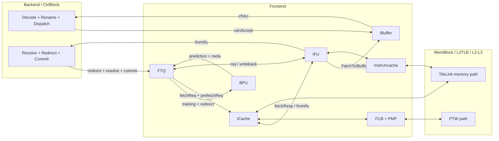
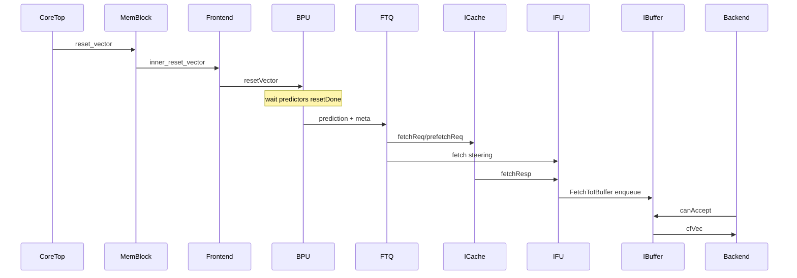
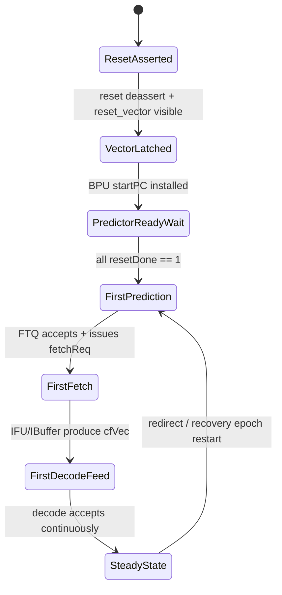

# Chapter 4. Frontend Overview

This chapter is the transition point from "whole-core overview" to concrete pipeline behavior.

The main idea is simple:

- The backend can execute instructions only if the frontend keeps delivering them.
- The frontend can deliver instructions only if it predicts the right path often enough, fetches data fast enough,
  and recovers quickly when prediction is wrong.
- So the frontend is not "just instruction cache". It is a closed-loop control system.

Implementation anchors for this chapter are the frontend top integration
([Frontend.scala:72](../../src/main/scala/xiangshan/frontend/Frontend.scala#L72),
[Frontend.scala:133](../../src/main/scala/xiangshan/frontend/Frontend.scala#L133),
[Frontend.scala:219](../../src/main/scala/xiangshan/frontend/Frontend.scala#L219),
[Frontend.scala:244](../../src/main/scala/xiangshan/frontend/Frontend.scala#L244)),
core-level wiring in `XSCore`
([XSCore.scala:132](../../src/main/scala/xiangshan/XSCore.scala#L132),
[XSCore.scala:135](../../src/main/scala/xiangshan/XSCore.scala#L135),
[XSCore.scala:225](../../src/main/scala/xiangshan/XSCore.scala#L225)),
and control-side wiring in `CtrlBlock`
([CtrlBlock.scala:352](../../src/main/scala/xiangshan/backend/CtrlBlock.scala#L352),
[CtrlBlock.scala:361](../../src/main/scala/xiangshan/backend/CtrlBlock.scala#L361),
[CtrlBlock.scala:526](../../src/main/scala/xiangshan/backend/CtrlBlock.scala#L526)).

### Block Diagram: Frontend as a Closed Loop



### ASCII Mental Model (Read This First)

```text
                         speculative control loop

     target guess      fetch bytes       instruction packets
 BPU -----------> FTQ -----------> ICache/IFU -----------> IBuffer -----> Decode
  ^                 |                    |                     |              |
  |                 |                    |                     |              |
  +-----------------+--------------------+---------------------+--------------+
     redirect/resolve/commit feedback                 decode backpressure
```

If you remember only one thing from this chapter, remember this diagram.

---

## 4.1 Frontend in System Context and Boot After Reset

### 4.1.1 Why Frontend Exists

A CPU backend can be very wide, very deep, and very optimized, but it still cannot execute instructions that are not
available yet. In modern out-of-order cores, instruction supply is often the first bottleneck visible at system level:
wrong-path fetches waste bandwidth, cache misses create bubbles, and slow recovery after redirects can idle an entire
execution engine.

Kunminghu addresses this with explicit functional split inside frontend:

- `BPU` predicts where control flow will go.
- `FTQ` keeps a speculation ledger and coordinates prediction/fetch/retirement timelines.
- `ICache` and translation/protection logic bring in instruction bytes.
- `IFU` turns bytes into instruction packets with correctness checks.
- `IBuffer` absorbs burst mismatch between fetch-side burstiness and decode-side demand.

The split is visible directly in top-level instantiation
([Frontend.scala:135](../../src/main/scala/xiangshan/frontend/Frontend.scala#L135),
[Frontend.scala:136](../../src/main/scala/xiangshan/frontend/Frontend.scala#L136),
[Frontend.scala:137](../../src/main/scala/xiangshan/frontend/Frontend.scala#L137),
[Frontend.scala:138](../../src/main/scala/xiangshan/frontend/Frontend.scala#L138),
[Frontend.scala:139](../../src/main/scala/xiangshan/frontend/Frontend.scala#L139)).

This is a common microarchitecture pattern called **decoupling**. Decoupling means we intentionally
insert queues and handshake boundaries so one sub-block can keep making progress even when another sub-block has a
temporary stall. `FTQ` and `IBuffer` are the two key decouplers in this chapter.

### 4.1.2 Place of Frontend in Full-Core Architecture

`XSCore` instantiates three peers: frontend, backend, and memory block
([XSCore.scala:64](../../src/main/scala/xiangshan/XSCore.scala#L64),
[XSCore.scala:66](../../src/main/scala/xiangshan/XSCore.scala#L66),
[XSCore.scala:68](../../src/main/scala/xiangshan/XSCore.scala#L68)).
This distinction matters: frontend is not a tiny pre-stage glued to decode. It is an equal subsystem.

Core-level wiring shows the contract:

- Frontend receives backend control and returns decode input stream
  ([XSCore.scala:135](../../src/main/scala/xiangshan/XSCore.scala#L135)).
- Frontend receives memory-related maintenance control (`sfence`, `fencei`, `tlbCsr`) from backend
  ([XSCore.scala:136](../../src/main/scala/xiangshan/XSCore.scala#L136),
  [XSCore.scala:137](../../src/main/scala/xiangshan/XSCore.scala#L137),
  [XSCore.scala:139](../../src/main/scala/xiangshan/XSCore.scala#L139)).
- Frontend connects to memory/PTW path through mem block
  ([XSCore.scala:225](../../src/main/scala/xiangshan/XSCore.scala#L225)).

This has two consequences that help you reason about the RTL:

1. **Frontend is both compute and control.**
It computes prediction and instruction formatting, but it is also a control loop endpoint for redirect, commit,
exceptions, and low-power state.

2. **Frontend owns correctness checkpoints before decode.**
By the time instructions enter backend decode (`cfVec`), they already carry branch/end metadata, exception metadata,
and FTQ linkage (`ftqPtr/ftqOffset`) via `CtrlFlow`
([Bundle.scala:94](../../src/main/scala/xiangshan/Bundle.scala#L94),
[Bundle.scala:114](../../src/main/scala/xiangshan/Bundle.scala#L114),
[Bundle.scala:115](../../src/main/scala/xiangshan/Bundle.scala#L115)).

### 4.1.3 Frontend Responsibility Map

| Block | What problem it solves | Primary evidence |
| --- | --- | --- |
| `Bpu` | Predict next fetch target early; hide branch latency. | [Bpu.scala:46](../../src/main/scala/xiangshan/frontend/bpu/Bpu.scala#L46), [Bpu.scala:415](../../src/main/scala/xiangshan/frontend/bpu/Bpu.scala#L415) |
| `Ftq` | Keep speculative fetch order, receive backend corrections, feed IFU/ICache. | [Ftq.scala:62](../../src/main/scala/xiangshan/frontend/ftq/Ftq.scala#L62), [Ftq.scala:291](../../src/main/scala/xiangshan/frontend/ftq/Ftq.scala#L291) |
| `ICache` | Serve instruction bytes, track misses/prefetch/refill. | [ICacheImp.scala:42](../../src/main/scala/xiangshan/frontend/icache/ICacheImp.scala#L42), [ICacheImp.scala:238](../../src/main/scala/xiangshan/frontend/icache/ICacheImp.scala#L238) |
| `Ifu` | Convert fetched bytes into decode-facing packets and local redirects. | [Ifu.scala:55](../../src/main/scala/xiangshan/frontend/ifu/Ifu.scala#L55), [Ifu.scala:778](../../src/main/scala/xiangshan/frontend/ifu/Ifu.scala#L778) |
| `IBuffer` | Elastic queue between IFU and decode; smooth burst mismatch. | [IBuffer.scala:37](../../src/main/scala/xiangshan/frontend/ibuffer/IBuffer.scala#L37), [Frontend.scala:255](../../src/main/scala/xiangshan/frontend/Frontend.scala#L255) |
| `InstrUncache` | Handle instruction-side MMIO/uncache path independently of ICache hit path. | [InstrUncacheImp.scala:32](../../src/main/scala/xiangshan/frontend/instruncache/InstrUncacheImp.scala#L32), [InstrUncacheEntry.scala:30](../../src/main/scala/xiangshan/frontend/instruncache/InstrUncacheEntry.scala#L30) |
| iTLB + PTW bridge | Translate instruction fetch addresses and request page-table walks. | [Frontend.scala:189](../../src/main/scala/xiangshan/frontend/Frontend.scala#L189), [Frontend.scala:202](../../src/main/scala/xiangshan/frontend/Frontend.scala#L202), [MMUBundle.scala:620](../../src/main/scala/xiangshan/cache/mmu/MMUBundle.scala#L620) |

### 4.1.4 Frontend Bring-Up After Reset (Boot Start Path)

Reset behavior is often treated as a "boring implementation detail". In frontend, reset behavior is the first
correctness story: if first fetch target, first FTQ entry, and first decode packet are not coherent, everything else
can look random.

The boot-start chain in Kunminghu is explicit and traceable:

1. Platform provides `reset_vector` at core top IO.
2. `MemBlock` forwards it as `inner_reset_vector`.
3. Frontend receives it as `io.reset_vector`.
4. BPU latches it into `s0_startPcReg` when reset deasserts.
5. BPU waits until predictor submodules are reset-ready.
6. First prediction is accepted by FTQ.
7. FTQ issues first fetch to ICache/IFU.
8. IFU packages instructions and enqueues IBuffer.
9. IBuffer offers `cfVec` to backend decode when backend can accept.

This is not inferred behavior; each step is explicit in RTL links below.

#### Boot Timeline Table

| Boot phase | Key signal(s) | What happens | RTL evidence |
| --- | --- | --- | --- |
| External reset vector arrives | `io.reset_vector` | Core receives first architectural PC from top-level integration. | [XSCore.scala:93](../../src/main/scala/xiangshan/XSCore.scala#L93), [XSCore.scala:197](../../src/main/scala/xiangshan/XSCore.scala#L197) |
| MemBlock forwards vector inward | `inner_reset_vector` | Mem block delays and forwards reset vector to frontend domain. | [MemBlock.scala:1703](../../src/main/scala/xiangshan/mem/MemBlock.scala#L1703), [XSCore.scala:133](../../src/main/scala/xiangshan/XSCore.scala#L133) |
| Frontend passes vector to BPU | `bpu.io.resetVector` | Frontend top directly wires vector into branch predictor top. | [Frontend.scala:157](../../src/main/scala/xiangshan/frontend/Frontend.scala#L157) |
| BPU captures reset PC | `s0_startPcReg := io.resetVector` | On reset deassert event, BPU installs boot PC as start PC register. | [Bpu.scala:143](../../src/main/scala/xiangshan/frontend/bpu/Bpu.scala#L143), [Bpu.scala:144](../../src/main/scala/xiangshan/frontend/bpu/Bpu.scala#L144) |
| Predictor reset completion gate | `predictors.map(_.io.resetDone)` | BPU stage-0 fire is blocked until all predictors report reset-done. | [Bpu.scala:245](../../src/main/scala/xiangshan/frontend/bpu/Bpu.scala#L245) |
| First prediction to FTQ | `io.toFtq.prediction` | BPU emits first speculative target and metadata stream. | [Bpu.scala:415](../../src/main/scala/xiangshan/frontend/bpu/Bpu.scala#L415), [Bpu.scala:428](../../src/main/scala/xiangshan/frontend/bpu/Bpu.scala#L428) |
| FTQ records first start PC | `entryQueue`, `toBackend` | FTQ stores predicted start PC and exposes it to backend-side PC memory. | [Ftq.scala:178](../../src/main/scala/xiangshan/frontend/ftq/Ftq.scala#L178), [Ftq.scala:294](../../src/main/scala/xiangshan/frontend/ftq/Ftq.scala#L294), [CtrlBlock.scala:773](../../src/main/scala/xiangshan/backend/CtrlBlock.scala#L773) |
| FTQ issues first fetch | `toICache.fetchReq`, `toIfu.req` | Once pointers advance, FTQ drives fetch request streams. | [Ftq.scala:254](../../src/main/scala/xiangshan/frontend/ftq/Ftq.scala#L254), [Ftq.scala:261](../../src/main/scala/xiangshan/frontend/ftq/Ftq.scala#L261) |
| ICache/IFU handshake | `fromFtq.req.ready` + `fetchReady` | IFU only accepts FTQ request when ICache main pipe can receive it. | [Frontend.scala:221](../../src/main/scala/xiangshan/frontend/Frontend.scala#L221), [Ifu.scala:132](../../src/main/scala/xiangshan/frontend/ifu/Ifu.scala#L132), [ICacheImp.scala:216](../../src/main/scala/xiangshan/frontend/icache/ICacheImp.scala#L216) |
| First decode-facing packets | `toIBuffer`, `cfVec`, `canAccept` | IFU pushes to IBuffer; IBuffer feeds decode respecting backend acceptance. | [Frontend.scala:242](../../src/main/scala/xiangshan/frontend/Frontend.scala#L242), [Frontend.scala:253](../../src/main/scala/xiangshan/frontend/Frontend.scala#L253), [Frontend.scala:255](../../src/main/scala/xiangshan/frontend/Frontend.scala#L255), [CtrlBlock.scala:526](../../src/main/scala/xiangshan/backend/CtrlBlock.scala#L526) |

#### Boot Sequence Diagram



#### Boot FSM (Coarse, Conceptual)



### 4.1.5 Worked Example: The First Two Basic Blocks After Reset

Assume `reset_vector` points to firmware entry `A`.

- BPU stage-0 start PC becomes `A` after reset deassert
  ([Bpu.scala:143](../../src/main/scala/xiangshan/frontend/bpu/Bpu.scala#L143),
  [Bpu.scala:144](../../src/main/scala/xiangshan/frontend/bpu/Bpu.scala#L144)).
- BPU predicts next target `B` and sends `A -> B` to FTQ
  ([Bpu.scala:419](../../src/main/scala/xiangshan/frontend/bpu/Bpu.scala#L419),
  [Ftq.scala:178](../../src/main/scala/xiangshan/frontend/ftq/Ftq.scala#L178)).
- FTQ issues fetch for `A`; IFU/ICache path returns bytes and IFU turns them into instruction records
  ([Ftq.scala:254](../../src/main/scala/xiangshan/frontend/ftq/Ftq.scala#L254),
  [ICacheImp.scala:219](../../src/main/scala/xiangshan/frontend/icache/ICacheImp.scala#L219),
  [Frontend.scala:242](../../src/main/scala/xiangshan/frontend/Frontend.scala#L242)).
- While block `A` is being delivered, FTQ may already schedule prefetch/fetch for `B`, depending on queue state and
  redirects
  ([Ftq.scala:229](../../src/main/scala/xiangshan/frontend/ftq/Ftq.scala#L229),
  [Ftq.scala:250](../../src/main/scala/xiangshan/frontend/ftq/Ftq.scala#L250)).

Key takeaway: boot is not a special "slow mode" pipeline. It uses the same speculative mechanism as normal
execution, but starts from a known architectural PC and empty speculation history.

### 4.1.6 Warm-Up: How the Frontend Reaches Steady Rhythm

After reset, frontend does not instantly behave like a mature steady-state pipeline. It goes through a short warm-up
period where structures are empty and control loops are only partially closed.

In FTQ this is obvious from pointer initialization:

- `bpuPtr`, `pfPtr`, `ifuPtr`, `ifuWbPtr`, `commitPtr` all start from reset state
  ([Ftq.scala:85](../../src/main/scala/xiangshan/frontend/ftq/Ftq.scala#L85),
  [Ftq.scala:86](../../src/main/scala/xiangshan/frontend/ftq/Ftq.scala#L86),
  [Ftq.scala:87](../../src/main/scala/xiangshan/frontend/ftq/Ftq.scala#L87),
  [Ftq.scala:88](../../src/main/scala/xiangshan/frontend/ftq/Ftq.scala#L88),
  [Ftq.scala:89](../../src/main/scala/xiangshan/frontend/ftq/Ftq.scala#L89)).

During the first few cycles:

1. BPU can produce a prediction only if FTQ is ready.
2. FTQ can issue fetch only when `bpuPtr` has advanced ahead of `ifuPtr`.
3. IFU can accept only when both IFU and ICache-side readiness agree.
4. Backend can consume `cfVec` only when `canAccept` is true.

This creates a startup dependency chain. Importantly, each dependency is explicit in `ready` logic, not hidden in
timing assumptions:

- BPU->FTQ readiness guard:
  [Ftq.scala:153](../../src/main/scala/xiangshan/frontend/ftq/Ftq.scala#L153)
- FTQ->IFU/ICache fetch gating:
  [Ftq.scala:250](../../src/main/scala/xiangshan/frontend/ftq/Ftq.scala#L250),
  [Frontend.scala:221](../../src/main/scala/xiangshan/frontend/Frontend.scala#L221),
  [Frontend.scala:230](../../src/main/scala/xiangshan/frontend/Frontend.scala#L230)
- Decode admission:
  [CtrlBlock.scala:526](../../src/main/scala/xiangshan/backend/CtrlBlock.scala#L526)

What closes the loop fully is backend feedback.

At the very beginning, frontend only has "forward" motion (predict, fetch, send). A few cycles later:

- backend writes commit pointer updates to FTQ
  ([CtrlBlock.scala:352](../../src/main/scala/xiangshan/backend/CtrlBlock.scala#L352),
  [Ftq.scala:362](../../src/main/scala/xiangshan/frontend/ftq/Ftq.scala#L362));
- backend sends resolve information for training
  ([CtrlBlock.scala:804](../../src/main/scala/xiangshan/backend/CtrlBlock.scala#L804),
  [Ftq.scala:332](../../src/main/scala/xiangshan/frontend/ftq/Ftq.scala#L332));
- backend may send redirects (mispredict, exception, memory violation)
  ([CtrlBlock.scala:361](../../src/main/scala/xiangshan/backend/CtrlBlock.scala#L361)).

Only after this point does frontend operate as a complete speculative control loop with correction and learning, not
just a one-way fetch stream.

#### Warm-Up Stages (Conceptual)

| Stage | Main characteristic | What to watch in RTL |
| --- | --- | --- |
| Cold start | No useful speculative history yet; queues are empty. | FTQ pointer reset state: [Ftq.scala:85](../../src/main/scala/xiangshan/frontend/ftq/Ftq.scala#L85) |
| First target issue | BPU start PC becomes meaningful and first prediction enters FTQ. | BPU startPC + first prediction: [Bpu.scala:434](../../src/main/scala/xiangshan/frontend/bpu/Bpu.scala#L434), [Bpu.scala:415](../../src/main/scala/xiangshan/frontend/bpu/Bpu.scala#L415) |
| First fetch train | IFU+ICache start returning packets, IBuffer begins accumulating/streaming. | IFU/ICache and IBuffer hookup: [Frontend.scala:234](../../src/main/scala/xiangshan/frontend/Frontend.scala#L234), [Frontend.scala:242](../../src/main/scala/xiangshan/frontend/Frontend.scala#L242) |
| First feedback closure | Commit/resolve/redirect feedback begins to shape future fetch. | Ctrl->FTQ contract: [CtrlBlock.scala:45](../../src/main/scala/xiangshan/backend/CtrlBlock.scala#L45), [Ftq.scala:291](../../src/main/scala/xiangshan/frontend/ftq/Ftq.scala#L291) |
| Stable speculation | Continuous issue + correction + training loop. | Combined behavior across [Frontend.scala:244](../../src/main/scala/xiangshan/frontend/Frontend.scala#L244) and [Ftq.scala:317](../../src/main/scala/xiangshan/frontend/ftq/Ftq.scala#L317) |

#### Why This Warm-Up Matters

A frequent question is: "If branch predictor is so powerful, why talk about early-cycle warm-up at all?"

Because startup is where hidden assumptions fail:

- stale pointer assumptions,
- mismatched enqueue/dequeue rates,
- wrong reset ordering between history tables,
- and accidental dependence on non-reset data.

Kunminghu addresses these risks through explicit startup guards and internal checks:

- BPU startup guard/assertion:
  [Bpu.scala:490](../../src/main/scala/xiangshan/frontend/bpu/Bpu.scala#L490),
  [Bpu.scala:497](../../src/main/scala/xiangshan/frontend/bpu/Bpu.scala#L497)
- FTQ consistency assertion:
  [Ftq.scala:91](../../src/main/scala/xiangshan/frontend/ftq/Ftq.scala#L91)
- IBuffer enqueue pointer consistency assertion:
  [IBuffer.scala:105](../../src/main/scala/xiangshan/frontend/ibuffer/IBuffer.scala#L105)

### 4.1.7 Reset and Boot Edge Cases (What Can Go Wrong, and Why It Does Not Here)

This subsection is intentionally practical: it explains typical reset/boot bugs and the design features that prevent
them in this codebase.

#### Edge Case 1: Predictor Not Fully Reset, but Fetch Already Starts

If fetch starts before predictor SRAM-backed tables are ready, early predictions can be garbage. Kunminghu prevents
that by making BPU stage-0 fire depend on all predictor `resetDone` outputs
([Bpu.scala:245](../../src/main/scala/xiangshan/frontend/bpu/Bpu.scala#L245)).

Representative predictor reset-done aggregation:

- Main BTB: [MainBtb.scala:50](../../src/main/scala/xiangshan/frontend/bpu/mbtb/MainBtb.scala#L50)
- TAGE: [Tage.scala:58](../../src/main/scala/xiangshan/frontend/bpu/tage/Tage.scala#L58)
- SC: [Sc.scala:80](../../src/main/scala/xiangshan/frontend/bpu/sc/Sc.scala#L80)

This is a robust pattern: a top module should gate first functional fire on concrete submodule readiness, not on
assumptions about reset duration.

#### Edge Case 2: Reset Vector Lost During Early Stall

BPU keeps `s0_startPcReg` and checks behavior under stall conditions. If stage-0 stalls, `s0_startPc` must stay
consistent with the register, guarded by assertion
([Bpu.scala:141](../../src/main/scala/xiangshan/frontend/bpu/Bpu.scala#L141),
[Bpu.scala:497](../../src/main/scala/xiangshan/frontend/bpu/Bpu.scala#L497)).

In plain language: "if we are stalled, don't silently change the predicted start PC."

#### Edge Case 3: Backend Redirect During Early Bring-Up

Some early redirects are branch-mispredict redirects, but exception/trap redirects can also happen very early.
`CtrlBlock` handles this by generating unified redirect packets and, for trap cases, rewriting target/fault bits at
the frontend-output stage
([CtrlBlock.scala:398](../../src/main/scala/xiangshan/backend/CtrlBlock.scala#L398),
[CtrlBlock.scala:403](../../src/main/scala/xiangshan/backend/CtrlBlock.scala#L403),
[CtrlBlock.scala:404](../../src/main/scala/xiangshan/backend/CtrlBlock.scala#L404)).

The key point is that architecturally-visible faults use the same correction transport as branch events, which
simplifies interface shape while preserving semantics.

#### Edge Case 4: Reset Domain Visibility and Debug

Frontend exports `resetInFrontend` so outer integration can observe frontend reset status
([Frontend.scala:87](../../src/main/scala/xiangshan/frontend/Frontend.scala#L87),
[Frontend.scala:270](../../src/main/scala/xiangshan/frontend/Frontend.scala#L270)).
`XSCore` forwards this into mem block bypass/top-level observation path
([XSCore.scala:260](../../src/main/scala/xiangshan/XSCore.scala#L260),
[XSCore.scala:261](../../src/main/scala/xiangshan/XSCore.scala#L261)).

This is not just debug nicety. In large SoCs with multiple local resets, having explicit reset visibility signals
prevents many "works in simulation, fails in integration" classes of bugs.

#### Extended Boot Timeline (Cycle-Intent View)

The exact cycle count is implementation/config dependent; the table below is an intent timeline to help reasoning.

| Approx phase | Event | Main guard signal(s) |
| --- | --- | --- |
| RST | reset asserted; no frontend progress expected. | local reset + submodule reset state |
| RST+deassert | BPU installs reset vector into stage-0 PC register. | [Bpu.scala:144](../../src/main/scala/xiangshan/frontend/bpu/Bpu.scala#L144) |
| +init | Predictor tables finish startup and report `resetDone`. | [Bpu.scala:245](../../src/main/scala/xiangshan/frontend/bpu/Bpu.scala#L245) |
| +first predict | `prediction.valid` reaches FTQ. | [Bpu.scala:415](../../src/main/scala/xiangshan/frontend/bpu/Bpu.scala#L415) |
| +first FTQ entry | FTQ stores first start PC and metadata. | [Ftq.scala:178](../../src/main/scala/xiangshan/frontend/ftq/Ftq.scala#L178) |
| +first fetch req | FTQ emits IFU/ICache requests if pointer and ready conditions hold. | [Ftq.scala:250](../../src/main/scala/xiangshan/frontend/ftq/Ftq.scala#L250) |
| +first response | ICache/IFU response path starts filling IBuffer. | [Frontend.scala:234](../../src/main/scala/xiangshan/frontend/Frontend.scala#L234), [Frontend.scala:242](../../src/main/scala/xiangshan/frontend/Frontend.scala#L242) |
| +first decode feed | IBuffer emits `cfVec` when backend allows it. | [Frontend.scala:255](../../src/main/scala/xiangshan/frontend/Frontend.scala#L255), [CtrlBlock.scala:526](../../src/main/scala/xiangshan/backend/CtrlBlock.scala#L526) |
| +first retire feedback | backend `commit/resolve/redirect` begins closing the loop. | [CtrlBlock.scala:352](../../src/main/scala/xiangshan/backend/CtrlBlock.scala#L352), [CtrlBlock.scala:804](../../src/main/scala/xiangshan/backend/CtrlBlock.scala#L804), [CtrlBlock.scala:361](../../src/main/scala/xiangshan/backend/CtrlBlock.scala#L361) |

This is the moment frontend transitions from "pipeline warm-up" to "stable speculative operation".

---

## 4.2 Chapter Handoff Map

| If you want to go deeper into... | Next chapter |
| --- | --- |
| predictor internals (uBTB/TAGE/SC/ITTAGE/RAS) | [Chapter 5](05-branch-prediction-unit.md) |
| FTQ pointer machinery and training flow | [Chapter 6](06-fetch-target-queue.md) |
| ICache arrays, miss/refill, ECC details | [Chapter 7](07-instruction-cache.md) |
| IFU instruction slicing, predecode, local redirect checker | [Chapter 8](08-instruction-fetch-unit.md) |
| IBuffer banking, bypass, dequeue policy | [Chapter 9](09-instruction-buffer.md) |
| Frontend <> Backend interface principles, bus maps, and interaction walkthroughs | [Chapter 10](10-frontend-backend-interface.md) |
| Frontend <> Memory interface principles, bus maps, exception and maintenance flows | [Chapter 11](11-frontend-memory-interface.md) |

---

## Key Takeaways

- Frontend is a closed-loop speculative control subsystem, not only a fetch datapath.
- Boot after reset uses the same speculation machinery as steady-state execution, starting from `reset_vector` and
  guarded by predictor `resetDone` readiness.
- FE/BE contract is explicit and layered: instruction stream, correction stream, stall diagnostics, and low-power
  handshake are all separate channels.
- FE/memory contract is layered too: translation, protection, cacheable miss path, uncache/MMIO path, and maintenance
  controls (`fence.i`/`sfence`/`wfi`).
- Understanding `FTQ` as the speculation ledger makes most frontend behavior easier to reason about.

## Checkpoint Questions

1. Basic: Why does frontend need both `FTQ` and `IBuffer`, instead of one queue?
2. Basic: In which module is `reset_vector` first turned into BPU fetch start PC state?
3. Intermediate: What does `canAccept` protect against, and where is it generated?
4. Intermediate: Why can backend-origin redirects include non-branch causes (for example memory violations)?
5. Intermediate: Why does frontend expose both `wfiReq` handling and `wfiSafe` acknowledgment?
6. Advanced: How does the `fromFtq` start-PC ledger help backend redirect/exception machinery?
7. Advanced: In uncache fetch, why is resend blocked when crossing page boundary?
8. Advanced: What microarchitectural failure modes would appear if `stallReason.backReason` did not override frontend
   bubble reason when backend is blocked?

## Further Reading

1. Reinman, Austin, Calder. "A Scalable Front-End Architecture for Fast Instruction Delivery." ISCA 1999.
2. Reinman, Calder, Austin. "Fetch Directed Instruction Prefetching." MICRO 1999.
3. Seznec. "The L-TAGE Branch Predictor." JILP 2006.
4. Yeh and Patt. "Two-Level Adaptive Branch Prediction." MICRO 1991.
5. Jimenez and Lin. "Dynamic Branch Prediction with Perceptrons." HPCA 2001.
