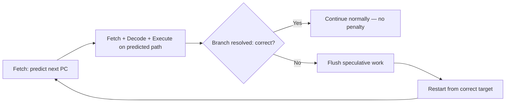
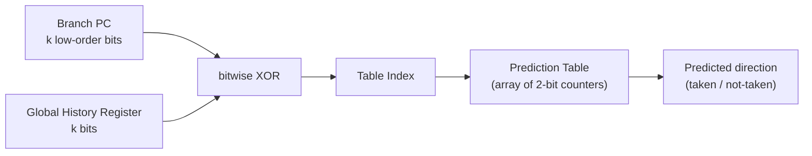
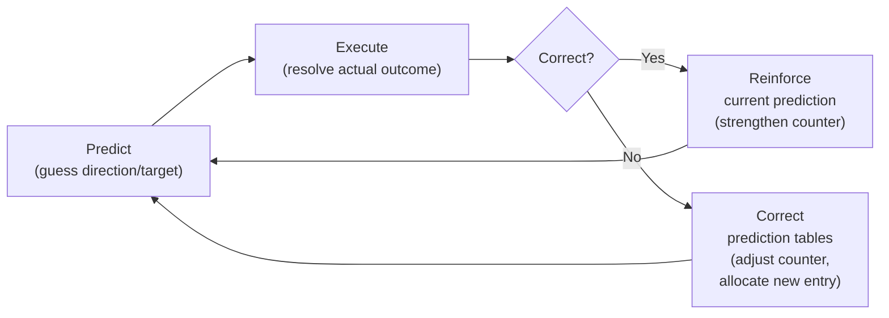

# Chapter 5. Why Processors Need Branch Prediction

Every high-performance processor must solve the same fundamental problem: instructions flow through
a pipeline, but the pipeline cannot know *where to fetch next* until a branch instruction is resolved
several stages later. Waiting would leave the pipeline idle for cycles at a time. Branch prediction is
the mechanism that fills this gap — the processor guesses the next fetch address and begins working
speculatively, verifying the guess later and recovering if it was wrong.

This chapter builds the conceptual foundation needed to understand the Kunminghu branch prediction
unit (BPU) described in the companion chapters that follow. No prior microarchitecture knowledge is
assumed beyond a basic understanding of what instructions are and that RISC-V has branch and jump
instructions.

### ASCII Mental Model (Read This First)

```text
Without prediction:                     With prediction:

  Fetch    Decode   Execute               Fetch    Decode   Execute
  ┌────┐   ┌────┐   ┌────┐               ┌────┐   ┌────┐   ┌────┐
  │ A  │──>│ A  │──>│ A  │               │ A  │──>│ A  │──>│ A  │
  ├────┤   ├────┤   ├────┤               ├────┤   ├────┤   ├────┤
  │????│   │ .. │   │ .. │  ← bubble     │ B* │──>│ B* │──>│ B* │  ← speculative
  ├────┤   ├────┤   ├────┤               ├────┤   ├────┤   ├────┤
  │????│   │????│   │ .. │  ← bubble     │ C* │──>│ C* │──>│ C* │  ← speculative
  ├────┤   ├────┤   ├────┤               ├────┤   ├────┤   ├────┤
  │ B  │──>│????│──>│????│               │ D* │──>│ D* │──>│ D* │
  └────┘   └────┘   └────┘               └────┘   └────┘   └────┘

  A is a branch. We wait until                A is a branch. We *guess* the
  Execute resolves it to know                  target and keep fetching. If
  the target. Two cycles wasted.               correct, zero cycles wasted.

                                               * = speculative (may be flushed)
```

If you remember only one thing from this chapter: **branch prediction turns a sequential bottleneck
into a speculation problem, and the rest of the BPU machinery exists to make that speculation as
accurate as possible.**

---

## 5.1 The Pipeline Problem: What Happens at a Branch

### 5.1.1 A Simple Pipeline

Consider a classic five-stage pipeline:

```text
  Fetch ──> Decode ──> Execute ──> Memory ──> Writeback
   (F)       (D)        (X)        (M)         (W)
```

Each cycle, the processor fetches one instruction (or a group of instructions in a superscalar
design), decodes it, executes it, accesses memory if needed, and writes back results. Under ideal
conditions, a new instruction enters the pipeline every cycle, and the processor sustains an
instruction throughput close to one instruction per cycle (IPC ≈ 1) for a scalar pipeline, or
multiple instructions per cycle for a wider machine.

### 5.1.2 The Branch Disruption

Now imagine instruction `A` at address `0x1000` is a conditional branch:

```
0x1000:  beq  x1, x2, target    # if x1 == x2, jump to 'target'
0x1004:  add  x3, x4, x5        # fall-through path
...
target:
0x2000:  sub  x6, x7, x8        # taken path
```

The branch instruction enters the **Fetch** stage. But the processor does not yet know whether
`x1 == x2` — that comparison happens in the **Execute** stage, two cycles later. Meanwhile, the
Fetch stage must decide *right now* which address to fetch next: `0x1004` (fall-through) or
`0x2000` (taken)?

If it simply waits, the pipeline stalls for two cycles. Each stall cycle is called a **pipeline
bubble** — a cycle where no useful work enters the pipeline.

### 5.1.3 Why This Matters: A Quantitative View

Branches are common. In typical workloads, roughly 15–25% of all instructions are branches or jumps.
In a simple five-stage pipeline where branch resolution happens in the Execute stage, every branch
causes a 2-cycle bubble if the processor does not predict.

A rough estimate for a scalar pipeline:

```text
Effective IPC  =  1 / (1 + branch_frequency × bubble_cycles)
               =  1 / (1 + 0.20 × 2)
               =  1 / 1.4
               ≈  0.71
```

A 29% throughput loss from branches alone — and this gets worse with deeper pipelines and wider
issue. In a processor like Kunminghu, with a pipeline depth of over 10 stages and 6-wide decode,
unresolved branches would be catastrophic without prediction.

---

## 5.2 The Basic Idea: Guess and Verify

### 5.2.1 Speculation

The solution is surprisingly simple in concept: **guess** the next fetch address and start executing
speculatively. If the guess turns out to be correct, no cycles are wasted. If the guess is wrong,
discard the speculative work and restart from the correct address.

This is the fundamental pattern of **speculation** in processor design:

1. **Predict** — guess the outcome before it is known.
2. **Execute speculatively** — proceed as if the guess is correct.
3. **Verify** — check the guess when the true outcome becomes available.
4. **Recover** — if wrong, flush the speculative state and restart.



### 5.2.2 Key Terminology

These terms recur throughout the BPU chapters:

| Term | Definition |
| --- | --- |
| **PC** (Program Counter) | The address of the current instruction in memory. A branch's PC is the address where that branch instruction resides — it serves as the natural identifier for looking up predictions in hardware tables. |
| **Prediction** | The guess about a branch's outcome (direction and/or target) made before the branch executes. |
| **Speculation** | Executing instructions on the predicted path before the prediction is verified. |
| **Misprediction** | When the prediction does not match the actual outcome. |
| **Misprediction penalty** | The number of cycles of useful work lost when recovering from a misprediction. |
| **Recovery** (or redirect) | The process of flushing wrong-path work, restoring architectural state, and restarting from the correct address. |
| **Taken** | A conditional branch whose condition evaluates to true, causing control to transfer to the branch target. |
| **Not-taken** | A conditional branch whose condition evaluates to false; execution continues to the next sequential instruction. |
| **Fall-through** | The instruction immediately after a branch — the path taken when the branch is not taken. |
| **Compulsory miss** (cold miss) | The unavoidable misprediction on the very first encounter of a branch, before the BPU has any record of it. The branch is discovered only after decode and execution; future fetches benefit from the recorded metadata. |

### 5.2.3 The Bootstrap Problem: Prediction Before Decode

The speculation model above assumes the processor can predict a branch's direction and target. But
there is a deeper question: **how does the processor even know that a branch exists in the fetch
block?**

At prediction time, the processor has only the fetch block's starting PC. The instructions in that
block have not been fetched from the instruction cache, let alone decoded. The processor does not
know whether the block contains zero, one, or several branches, nor does it know their types or
positions within the block.

This is a chicken-and-egg problem:
- To fetch efficiently, the processor needs to predict branches *before* decode.
- To discover branches, the processor needs to decode — which happens *after* fetch.

The solution is to **learn from the past**. The processor maintains a hardware cache — called a
**Branch Target Buffer (BTB)** or, in more advanced designs, a **Fetch Target Buffer (FTB)** — that
records information about branches it has seen before. The lifecycle works as follows:

1. **First encounter**: The BPU has no record of this PC region. It predicts fall-through (no
   branch). The instructions flow through the pipeline, the branch is discovered at decode, and its
   actual outcome and target are resolved at execute.
2. **Record**: The branch's metadata — its PC, position within the fetch block, type, and resolved
   target — is written back into the BTB/FTB.
3. **Subsequent encounters**: When the same PC region is fetched again, the BTB/FTB provides the
   stored branch metadata *before decode*. Now the direction and target predictors can do their work.

The first encounter is always a **compulsory miss** — an unavoidable misprediction because the BPU
has no prior knowledge of the branch. This is the price of the bootstrap: the predictor only
improves after it has observed actual branch behavior. All the prediction mechanisms discussed in
this chapter (counters, history, TAGE) operate on branches that the BTB/FTB has already catalogued;
none of them can help with a branch the processor has never seen.

Section 5.5 describes the BTB and FTB structures that implement this learning cache, and the
companion chapters detail Kunminghu's specific implementations.

### 5.2.4 The Accuracy Imperative

How accurate does prediction need to be? Consider a machine with a 15-cycle misprediction penalty
(roughly what a modern out-of-order core incurs for a full pipeline flush). If 20% of instructions
are branches:

| Accuracy | Mispredicts per 1000 instructions | Penalty cycles per 1000 | Effective IPC impact |
| --- | --- | --- | --- |
| 90% | 200 × 0.10 = 20 | 20 × 15 = 300 | Significant slowdown |
| 95% | 200 × 0.05 = 10 | 10 × 15 = 150 | Noticeable |
| 99% | 200 × 0.01 = 2 | 2 × 15 = 30 | Small overhead |
| 99.5% | 200 × 0.005 = 1 | 1 × 15 = 15 | Near-ideal |

Modern high-performance BPUs target 95–99%+ accuracy on representative workloads. Achieving this
requires sophisticated techniques, which the remainder of this chapter introduces.

---

## 5.3 What Needs to Be Predicted

Not all branches are equal. The **type** of control-flow instruction determines what must be
predicted and how difficult that prediction is.

### 5.3.1 RISC-V Branch and Jump Types

| Instruction | Type | What is unknown at fetch time | Difficulty |
| --- | --- | --- | --- |
| `beq`, `bne`, `blt`, `bge`, `bltu`, `bgeu` | Conditional branch | **Direction** (taken or not-taken?) and **target** if taken. Target is PC-relative and computable from the instruction bits, but the instruction has not been decoded yet at prediction time. | Medium — direction patterns are learnable. |
| `jal` | Direct jump/call | **Target** is PC-relative and fixed. Once the instruction is seen once, the target is always the same. | Easy — a simple cache suffices. |
| `jalr` (non-return) | Indirect jump/call | **Target** is computed from a register value — it can change on every execution. | Hard — requires history-based target prediction. |
| `jalr x0, 0(ra)` (return) | Return | **Target** comes from the return address register, which follows a stack discipline. | Medium — a hardware stack predicts well. |

### 5.3.2 Two Prediction Questions

For any control-flow instruction, the predictor must answer up to two questions:

1. **Direction**: Will this branch be taken or not taken? (Only relevant for conditional branches.)
2. **Target**: If taken, what is the destination address?

For direct jumps, the target is always the same once known. For indirect branches, the target can
vary and must be predicted from execution history. For returns, the target follows a last-in,
first-out pattern that a hardware stack can exploit.

---

## 5.4 Simple Prediction Strategies

Before examining the sophisticated predictors used in Kunminghu, it helps to understand the
simplest strategies and why they fall short.

### 5.4.1 Static Prediction: Always Not-Taken

The simplest possible predictor: always predict that conditional branches are not taken. Fetch
continues sequentially.

- **Accuracy**: Roughly 50–60% on typical code. Loops are almost always mispredicted on every
  iteration except the last.
- **Cost**: Zero hardware — just fetch the next sequential address.
- **Problem**: Loop-heavy code suffers badly.

### 5.4.2 Static Prediction: Always Taken

Predict that every branch is taken.

- **Accuracy**: Slightly better for loop-dominated code (~60–70%), but worse for forward branches
  that are typically not taken.
- **Cost**: Requires knowing the target address, which means at least a BTB (see Section 5.5).
- **Problem**: Forward branches are often not taken (e.g., error checks), so this strategy
  mispredicts them systematically.

### 5.4.3 One-Bit Dynamic Predictor

Record the last outcome of each branch and predict the same outcome next time. Use a small table
indexed by the branch PC to store one bit per branch: 0 = last was not-taken, 1 = last was taken.

- **Accuracy**: Better than static (~80–85%), but flips prediction twice at loop boundaries.
- **Problem**: A loop with N iterations causes **two** mispredictions per invocation — one on entry
  (if the loop was previously exited as not-taken) and one on exit.

### 5.4.4 Two-Bit Saturating Counter

The key insight: a single anomalous outcome should not immediately flip the prediction. A **two-bit
saturating counter** implements this as a four-state machine:

```text
           taken                  taken                  taken
  +-----+ -------> +-----+ -------> +-----+ -------> +-----+
  | SNT |          | WNT |          | WT  |          | ST  |
  | 00  |          | 01  |          | 10  |          | 11  |
  +-----+ <------- +-----+ <------- +-----+ <------- +-----+
         not-taken         not-taken         not-taken

  predict NOT-TAKEN                  predict TAKEN
  <----------------->                <----------------->

  SNT = Strongly Not-Taken    WNT = Weakly Not-Taken
  WT  = Weakly Taken          ST  = Strongly Taken
```

The counter increments toward "strongly taken" on a taken outcome and decrements toward "strongly
not-taken" on a not-taken outcome, but saturates at the extremes (never wraps around). The
prediction is "taken" when the counter is in the upper half (WT or ST) and "not-taken" in the
lower half (SNT or WNT).

- **Accuracy**: ~85–90% — significantly better than one-bit.
- **Loop behavior**: A loop with 100 iterations now causes only **one** misprediction per invocation
  (on exit), because the single not-taken exit does not flip the counter out of the "taken" state.

### 5.4.5 Worked Example: Loop Prediction Accuracy

Consider a loop that iterates 100 times, then exits:

```
loop:
    ...loop body...
    bne  x1, x0, loop    # branch back to 'loop' if x1 != 0
    # falls through when x1 == 0 (after 100 iterations)
```

The branch is taken 100 times (looping back) and not-taken once (exiting).

| Strategy | Mispredictions per 101 outcomes | Accuracy |
| --- | --- | --- |
| Always not-taken | 100 (every taken iteration) | 1% |
| Always taken | 1 (the exit) | 99% |
| 1-bit predictor | 2 (entry + exit, on second invocation) | 98% |
| 2-bit counter | 1 (exit only) | 99% |

For this loop, even a 2-bit counter achieves 99% accuracy. But real programs have complex
control-flow patterns that require more sophisticated approaches.

---

## 5.5 Branch Target Buffers (BTB)

### 5.5.1 The Target Problem

Section 5.2.3 introduced the bootstrap problem: the processor has only the fetch block PC at
prediction time and must rely on previously learned metadata to know that a branch even exists.
But even once the processor knows *that* a branch is present, it faces an additional challenge:
when that branch is predicted taken, the processor needs a **target address** to redirect fetch.
The direction predictors (counters, TAGE) answer *whether* to jump — they do not provide *where*
to jump.

### 5.5.2 What a BTB Does

A **Branch Target Buffer** is a cache that maps branch PCs to their known targets. It serves two
essential roles simultaneously:

1. **Branch discovery cache** — a BTB hit tells the processor that a branch *exists* at this PC,
   solving the bootstrap problem from Section 5.2.3. Without this hit, the processor would not
   even attempt a direction prediction.
2. **Target cache** — the BTB entry stores the branch's previously observed target address, so the
   processor knows *where* to redirect fetch if the branch is predicted taken.

```text
                     BTB (cache)
  Fetch PC ──────> ┌──────────────────────┐
                   │  tag  │  target addr  │ ──> predicted target
                   ├───────┼───────────────┤
                   │  tag  │  target addr  │
                   ├───────┼───────────────┤
                   │  ...  │     ...       │
                   └──────────────────────┘
                          │
                       hit/miss
              (hit = branch known here;
               miss = no branch recorded)
```

On each fetch cycle:
1. Look up the current PC in the BTB.
2. If **hit**: a branch was previously recorded at this PC. The processor now knows a branch exists
   and has a candidate target. Direction predictors decide whether the branch is taken; if so, the
   stored target becomes the next fetch address.
3. If **miss**: no branch has been recorded at this PC. The processor predicts fall-through (next
   sequential address). If a branch actually is present, it will be discovered after decode — this
   is the compulsory miss from Section 5.2.3.

The BTB is populated through the learning loop: the first time a branch flows through the pipeline,
decode reveals its existence and execute resolves its target. This information is written back into
the BTB so that future fetches of the same PC region can predict before decode.

### 5.5.3 BTB Organization Trade-offs

Like any cache, a BTB can be organized in different ways:

| Organization | Lookup speed | Capacity | Conflict behavior |
| --- | --- | --- | --- |
| **Fully-associative** | Fastest (parallel compare all entries) | Small (expensive per entry) | No conflicts — any entry can hold any branch |
| **Set-associative** | Fast (compare within one set) | Medium | Some conflicts within a set |
| **Direct-mapped** | Fastest (single compare) | Large | Worst conflict behavior |

High-performance processors typically use a combination: a small fully-associative or highly
set-associative BTB for the fastest lookup, paired with a larger set-associative structure for
capacity.

### 5.5.4 Beyond Simple BTBs: The Fetch Target Buffer

Modern processors often extend the BTB concept into a **Fetch Target Buffer (FTB)**, which stores
not just one branch per entry but potentially multiple branches within a fetch block. This is
important because a wide superscalar processor fetches a *block* of instructions at once (e.g.,
16 or 32 bytes), and that block might contain several branches. Recall the bootstrap problem from
Section 5.2.3: the processor needs to know about *all* branches in a fetch block before decode, not
just the first one. An FTB solves this by recording the complete branch landscape of each block.

An FTB entry might record:
- The position of each branch within the fetch block
- The type and target of each branch
- Which branch (if any) is the first taken branch — this determines the block boundary

Kunminghu's `MainBtb` plays this FTB-equivalent role, as described in
[Chapter 5c](05c-accurate-predictors.md).

---

## 5.6 History-Based Prediction

### 5.6.1 Why Simple Predictors Aren't Enough

A 2-bit counter per branch is effective for branches that are consistently taken or consistently
not-taken. But many real branches exhibit **correlated** behavior — their outcome depends on the
outcomes of *other* recent branches.

Consider this code pattern:

```c
if (x > 0) {       // Branch A
    y = 1;
}
if (y == 1) {      // Branch B
    ...
}
```

Branch B's outcome is perfectly correlated with Branch A's outcome: if A is taken, then `y == 1`,
so B is also taken. A per-branch 2-bit counter cannot capture this correlation because it only
looks at Branch B's own history.

### 5.6.2 The Global History Register (GHR) and History-Based Indexing

The key idea behind history-based prediction: maintain a shift register that records the
taken/not-taken outcomes of the most recent N branches. This **Global History Register (GHR)**
captures the pattern of recent control flow.

```text
  Most recent branch outcomes (newest on left):

  GHR: [ T  NT  T  T  NT  T  NT  NT  ... ]
         ↑                              ↑
       newest                        oldest

  T = taken (1), NT = not-taken (0)
```

Each time a branch resolves, the register shifts left by one bit and the new outcome enters at the
least-significant end. After N shifts, every bit position contains the outcome of a particular
recent branch execution.

**Two-level adaptive prediction.** The combination of a history register (first level) and a
pattern table of counters (second level) is called **two-level adaptive prediction** (Yeh and Patt,
1991). It was a breakthrough because it could learn complex repeating branch patterns that defeat
simple per-branch counters.

A prediction table is just an array of 2-bit saturating counters. To predict a branch, we need an
**index** into this array that depends on *both* the branch's PC and the recent branch history.
Why both?

- **PC alone** would give the same index every time the same branch is encountered, so the
  predictor could not distinguish different control-flow contexts.
- **History alone** would collapse different branches that happen to be reached after the same
  history pattern into a single entry, causing interference.

Combining them produces an index that is unique to a particular branch *in a particular context*.
The simplest combination is **bitwise XOR**:

```text
  index = PC[k-1 : 0]  XOR  GHR[k-1 : 0]
```

where `k` is the number of index bits (i.e., `log2(table size)`). XOR is cheap in hardware (one
gate per bit) and mixes the information from both sources into every bit of the index. More
concretely, XOR is the standard hash combiner in branch predictors because it preserves all input
entropy (unlike AND or OR, no information is lost), it produces a uniform distribution when either
input is uniform (spreading entries evenly across the table), and it costs a single logic gate per
bit with no added delay on the critical prediction path.



**The folding problem.** Short history registers (4–8 bits) can index a table directly because the
table only needs 16–256 entries. But capturing deeper patterns — nested loops, correlated branches
separated by dozens of intervening branches — requires histories of **hundreds of bits**.
Kunminghu's longest TAGE table uses a 397-bit history.

A 397-bit history cannot be used as a raw table index — that would require 2^397 entries, far more
than the number of atoms in the universe. The solution is **history folding**: compress a long
history vector into a short one that fits the table's index width.

**Folding algorithm.** Divide the N-bit history vector into chunks of width `k` (the desired
compressed width), then XOR all chunks together:

```text
  Example: fold a 12-bit history into 4 bits (k = 4)

  History:    [ b11  b10  b9  b8 | b7  b6  b5  b4 | b3  b2  b1  b0 ]
                   chunk 2            chunk 1            chunk 0

  Folded  =   chunk0  XOR  chunk1  XOR  chunk2

            = [ b3   b2   b1   b0  ]
          XOR [ b7   b6   b5   b4  ]
          XOR [ b11  b10  b9   b8  ]
              ─────────────────────
            = [ f3   f2   f1   f0  ]    (4-bit folded history)
```

Every original bit contributes to exactly one bit of the folded result. Because XOR is its own
inverse, each original bit *toggles* the folded bit it maps to, so any change anywhere in the full
history changes the folded value. This preserves information far better than simply truncating the
history.

In Kunminghu, this operation is implemented by the `computeFoldedHist` function
([Helpers.scala:172](src/main/scala/xiangshan/frontend/bpu/Helpers.scala#L172)), which splits the
history into `ceil(histLen / compLen)` chunks and reduces them with a parallel XOR tree.

Once the history is folded, the TAGE table index is formed by XORing the folded history with the
corresponding PC bits, exactly as described above:

```text
  table_index = PC[k-1 : 0]  XOR  folded_history[k-1 : 0]
```

TAGE also needs a **tag** to detect aliasing (different branches landing on the same index). The
tag is computed the same way — XOR of PC bits and folded history — but uses a *different* fold
width to produce a separate hash, reducing the chance that both index and tag collide
simultaneously. In Kunminghu, the table indexing logic appears in
[tage/Helpers.scala:64–68](src/main/scala/xiangshan/frontend/bpu/tage/Helpers.scala#L64):
`getSetIndex` XORs PC-derived set bits with the folded history for the index, and `getRawTag` does
the same for the tag field.

The combination of folding (to compress history) and XOR (to mix history with PC) gives each TAGE
table an index that is sensitive to the full history length of that table, yet fits in a small
number of bits.

### 5.6.3 TAGE: Tagged Geometric History Length Prediction

How much history is enough? Different branches need different amounts of context. A simple loop
counter may only need 4 bits of history, while a deeply nested state machine may need hundreds. A
single table at any fixed history length is either too short for complex branches or wastefully long
for simple ones.

The **TAGE predictor** (Seznec, 2006) solves this with an elegant idea: use **multiple tables**
with **geometrically increasing history lengths**, and use **tags** to avoid destructive aliasing.
Each table uses the folding and XOR indexing scheme described above — the table with history
length 4 folds 4 bits, the table with history length 397 folds 397 bits, but all produce the same
narrow index width.

```text
  Table 0:  history length = 4     (captures short patterns)
  Table 1:  history length = 8
  Table 2:  history length = 16
  Table 3:  history length = 32
  Table 4:  history length = 64
  Table 5:  history length = 128   (captures deep patterns)
  ...

  Each table entry has:
  ┌────────┬──────────┬──────────┐
  │  tag   │ ctr (2b) │ useful   │
  └────────┴──────────┴──────────┘
```

When predicting a branch:

1. **Parallel lookup.** Compute the index and tag for *every* table in parallel. Each table uses its
   own history length (folded down to the table's index width), so the same branch may match entries
   in several tables simultaneously.
2. **Provider selection.** Among all tables whose tag matches, the one with the **longest history**
   becomes the **provider** — it has the most context about the current control-flow situation.
3. **Alternate selection.** The table with the **second-longest** matching history becomes the
   **alternate** (alt). If no second table matches, the base predictor (bimodal counter from the
   BTB) serves as the alternate. The alternate exists because a provider entry may be *newly
   allocated* and not yet well-trained.
4. **Choosing between provider and alternate.** If the provider's counter is *strong* (far from the
   taken/not-taken boundary), the provider's prediction is used. But if the counter is *weak* (close
   to the boundary), the entry may have been recently allocated and seen too few branches to be
   trustworthy. In that case, TAGE consults a small array of **useAltOnNa** ("use alternate on
   newly allocated") counters. These counters track, over time, whether newly-allocated providers
   or their alternates tend to be more accurate. When the useAltOnNa counter is positive and the
   provider is weak, TAGE overrides the provider and uses the alternate prediction instead.
5. **Base predictor fallback.** If *no* table has a tag match at all, the base predictor provides
   the prediction.

In Kunminghu, the provider and alternate selection logic appears in
[Tage.scala:137–155](src/main/scala/xiangshan/frontend/bpu/tage/Tage.scala#L137): the provider is
chosen by `getLongestHistTableOH` over the hit mask, and the alternate by the same function over
the hit mask with the provider removed. The final prediction is:
`finalPred = Mux(useProvider, providerPred, altOrBasePred)`
([Tage.scala:386](src/main/scala/xiangshan/frontend/bpu/tage/Tage.scala#L386)).

The geometric progression is elegant: each table covers a different "time horizon" of branch
correlation, and the tag prevents false matches from cluttering predictions.

### 5.6.4 Why TAGE Matters

Compared to earlier two-level predictors:
- **Less destructive aliasing**: tags reject accidental collisions.
- **Efficient capacity use**: geometric lengths mean most branches find their correlation depth
  without wasting entries at irrelevant history lengths.
- **Graceful degradation**: if no long-history table matches, shorter tables or the base predictor
  still provide reasonable accuracy.

Kunminghu implements a full TAGE predictor with 8 tables at history lengths from 4 to 397 bits,
described in detail in [Chapter 5c](05c-accurate-predictors.md).

---

## 5.7 The Return Address Stack (RAS)

### 5.7.1 The Return Pattern

Function calls and returns have a special structure: they nest like parentheses. When function `f`
calls function `g`, which calls function `h`, the returns happen in reverse order: `h` returns to
`g`, then `g` returns to `f`.

```text
  f() calls g()  ──>  g() calls h()  ──>  h() returns to g()  ──>  g() returns to f()

  Call stack:
    push f's return addr    push g's return addr    pop → g's return addr    pop → f's return addr
    ┌─────────────┐         ┌─────────────┐         ┌─────────────┐          ┌─────────────┐
    │ ret addr: f │         │ ret addr: g │         │ ret addr: f │          │  (empty)    │
    │             │         │ ret addr: f │         │             │          │             │
    └─────────────┘         └─────────────┘         └─────────────┘          └─────────────┘
```

### 5.7.2 How the Predictor Knows the Branch Type Before Decode

A natural question arises: the RAS must push on calls and pop on returns, but the BPU predicts
*before* the instruction is decoded — so how does it know whether a branch is a call, a return, or
an ordinary jump?

The answer is the **FTB entry**. Recall from Section 5.5 that the FTB (Kunminghu's MainBtb) stores
metadata about every branch the processor has previously encountered. Among this metadata is a
**`BranchAttribute`** field
([Bundles.scala:37](src/main/scala/xiangshan/frontend/bpu/Bundles.scala#L37)) that records two
pieces of information learned when the branch was first executed and trained into the FTB:

| Field | Bits | Meaning |
| --- | --- | --- |
| `branchType` | 4 | Instruction kind: conditional, direct (`jal`), or indirect (`jalr`) |
| `rasAction` | 4 | RAS behavior: none, push (call), pop (return), or pop-then-push |

The RISC-V ISA uses a simple **link-register convention** to distinguish calls from returns. Any
`jal` or `jalr` that writes its return address to `x1` (`ra`) or `x5` (`t0`) is treated as a
**call** — the destination register signals "save where I came from." Conversely, a `jalr` that
*reads* `x1` or `x5` as the base register but writes to a *different* (or zero) destination is
treated as a **return** — it is jumping back to a saved return address. A `jalr` that both reads
and writes a link register (with different registers) is a **call-and-return** (pop then push),
which occurs in tail-call patterns.

This classification is determined by the pre-decoder examining instruction bits at fetch time
([PreDecode.scala:57](src/main/scala/xiangshan/frontend/ifu/PreDecode.scala#L57)) and stored into
the FTB entry during training
([MainBtbAlignBank.scala:232](src/main/scala/xiangshan/frontend/bpu/mbtb/MainBtbAlignBank.scala#L232)).
On subsequent encounters, the FTB supplies the stored `rasAction` to the RAS without waiting for
decode. The RAS checks `attribute.isCall` and `attribute.isReturn`
([Ras.scala:65–72](src/main/scala/xiangshan/frontend/bpu/ras/Ras.scala#L65)) and pushes or pops
accordingly — all within the BPU pipeline, cycles before the instruction reaches the decoder.

### 5.7.3 Hardware Return Address Stack

A **Return Address Stack (RAS)** mirrors the call/return pattern in hardware:

- On a **call** (FTB entry has `rasAction = Push`): **push** the return address (PC + instruction
  length) onto the RAS.
- On a **return** (FTB entry has `rasAction = Pop`): **pop** the top of the RAS and use it as the
  predicted target.

This is remarkably effective — RAS prediction accuracy often exceeds 99% for normal call/return
patterns.

### 5.7.4 The Speculation Problem

In a speculative processor, there is a complication: the processor may speculatively execute calls
and returns on a wrong path. If the speculation is later flushed, the RAS has been corrupted by
pushes and pops that should not have happened.

Solutions include:
- **Checkpointing**: save the RAS state (top pointer) at key points and restore it on a
  misprediction.
- **Speculative/committed split**: maintain a speculative working copy that can be repaired, and a
  committed copy that reflects only retired instructions.

Kunminghu uses a speculative queue plus committed stack architecture for its RAS, described in
[Chapter 5c](05c-accurate-predictors.md).

---

## 5.8 Indirect Branch Target Prediction

### 5.8.1 The Indirect Branch Challenge

An indirect branch (`jalr rd, offset(rs1)`) computes its target from a register value that can
change on every execution. Examples include:

- Virtual method dispatch (C++/Java): `jalr x0, 0(x10)` where `x10` holds the method pointer.
- Switch statements compiled to jump tables: `jalr x0, 0(x11)` where `x11` indexes the table.
- Function pointer calls.

A simple BTB records only the *last* target, which works poorly when the target alternates between
multiple values.

### 5.8.2 History-Sensitive Target Prediction

The ITTAGE predictor (Indirect Target TAGE) applies the same geometric-history-length idea to
target prediction: use multiple tables indexed by (PC, history), but store **target addresses**
instead of direction counters.

Different history contexts map to different targets, which captures patterns like "on iteration 1,
the virtual call goes to method A; on iteration 2, it goes to method B."

Kunminghu implements ITTAGE with 5 tables, detailed in [Chapter 5c](05c-accurate-predictors.md).

---

## 5.9 Putting It All Together: The Hybrid Predictor

### 5.9.1 No Single Best Predictor

Each prediction technique excels at a different branch type:

| Branch type | Best predictor approach |
| --- | --- |
| Conditional (simple patterns) | 2-bit counter / bimodal |
| Conditional (complex patterns) | TAGE with long history |
| Direct jump/call | BTB (fixed target) |
| Indirect jump/call | ITTAGE (history-sensitive target) |
| Return | RAS (stack) |

A real processor must handle all of these simultaneously, so it combines multiple predictors into
a **hybrid** design.

### 5.9.2 The Speed–Accuracy Trade-off

There is a fundamental tension in predictor design:

- **Small, simple predictors** (few entries, short history) are fast — they can produce a prediction
  in a single cycle. But their accuracy is limited.
- **Large, complex predictors** (many entries, long history, tags) are more accurate. But they need
  multiple cycles to look up, compare tags, and select a result.

In a high-performance frontend, the predictor must deliver a new prediction **every cycle** to keep
the fetch pipeline full. If the best predictor takes 3 cycles, the frontend stalls for 2 cycles
on every prediction — defeating the purpose.

### 5.9.3 The Staged Prediction Solution

The elegant solution: use **both** a fast predictor and an accurate predictor, in a pipeline:

```text
  Cycle 0         Cycle 1              Cycle 2              Cycle 3
  ┌──────┐        ┌──────────┐         ┌──────────┐         ┌──────────────┐
  │  s0  │──────> │  s1      │───────> │  s2      │───────> │  s3          │
  │start │        │fast pred │         │compute   │         │accurate pred │
  │ PC   │        │(1 cycle) │         │(tables   │         │(final pick)  │
  └──────┘        └──────────┘         │ respond) │         └──────────────┘
                       │               └──────────┘               │
                       │                                          │
                       ▼                                          ▼
                  use fast prediction                    if different from s1,
                  immediately                            OVERRIDE: re-steer fetch

```

1. **Stage 1 (fast)**: A small predictor produces a quick guess within one cycle. The frontend
   immediately begins fetching from the predicted address.
2. **Stage 3 (accurate)**: Larger predictors take 2–3 cycles to produce a result. When their answer
   arrives, it is compared with the s1 prediction.
3. **Override**: If the accurate predictor disagrees with the fast predictor, the accurate answer
   wins. The frontend discards the work done on the fast prediction's path and re-steers to the
   corrected target.

The cost of an override is small (1–2 wasted fetch cycles) compared to the cost of a full
misprediction detected by the backend (10–15+ wasted cycles). So even a moderate rate of s1-to-s3
overrides is acceptable.

### 5.9.4 Preview: Kunminghu's Staged Design

Kunminghu implements exactly this strategy. Its BPU uses a four-stage pipeline (s0 through s3)
with two predictor layers:

- **Fast layer (s1)**: Small structures — micro-BTB, ahead-BTB, micro-TAGE, micro-RAS — that
  provide a first guess within one cycle.
- **Accurate layer (s2/s3)**: Large structures — MainBtb, TAGE, Statistical Corrector, ITTAGE,
  full RAS — that provide refined predictions and can override the fast layer.

The companion chapters explore each layer in detail:
- [Chapter 5a](05a-bpu-top-level-architecture.md) — Top-level architecture and pipeline
- [Chapter 5b](05b-fast-predictors.md) — Fast predictors (s1 layer)
- [Chapter 5c](05c-accurate-predictors.md) — Accurate predictors (s2/s3 layer)
- [Chapter 5d](05d-history-training-recovery.md) — History management, training, and recovery

---

## 5.10 The Statistical Corrector: A Second Opinion

One more concept is worth introducing here because it appears in Kunminghu's BPU: the
**Statistical Corrector (SC)**.

Even a strong TAGE predictor has borderline cases — branches where the provider counter is close
to the decision threshold and the prediction could go either way. The SC adds a separate layer of
weak learners (small tables indexed by different history features) whose outputs are combined into
a weighted sum. If the combined signal is strong enough, it can **flip** TAGE's decision.

Think of it as a panel of advisors: TAGE gives its opinion, and the SC provides a collective
second opinion. If the panel is confident enough that TAGE is wrong, the SC overrides.

This technique, introduced by Seznec alongside TAGE, adds a few percent of accuracy improvement
on hard-to-predict branches — enough to matter at the 97%+ accuracy range where every fraction of
a percent counts.

---

## 5.11 Training: How Predictors Learn

### 5.11.1 The Learning Loop

Predictors are only useful if they improve over time. The **training** (or update) process feeds
actual branch outcomes back into the predictor tables:



For a 2-bit saturating counter:
- **Correct prediction**: increment the counter toward the predicted direction (reinforce).
- **Misprediction**: decrement the counter away from the mispredicted direction (correct).

For TAGE, training also involves:
- Updating the provider table's counter.
- Potentially **allocating** a new entry in a longer-history table if the current prediction was
  wrong and a longer history might have helped.
- Managing **useful** counters that protect entries from being evicted.

### 5.11.2 When to Train

In a speculative processor, training must be done carefully:

- **On commit** (conservative): only train on retired branches with confirmed outcomes. Safe but
  slow — training information arrives many cycles after prediction.
- **On resolve** (eager): train as soon as the branch outcome is known in the backend, even before
  commit. Faster feedback, but must handle the case where the resolving instruction is later
  flushed (rare with in-order commit of training metadata).
- **On override** (fastest): for fast-layer predictors, the accurate layer's result in s3 can serve
  as "training" even before the branch is executed. This gives the fastest possible feedback to
  improve s1 predictors.

Kunminghu uses all three training lanes, described in
[Chapter 5d](05d-history-training-recovery.md).

---

## 5.12 Design Trade-Off: Accuracy vs. Recovery Cost

A recurring theme in BPU design is the balance between **prediction accuracy** and
**misprediction recovery cost**.

A more accurate predictor reduces the frequency of mispredictions but typically requires more
hardware (larger tables, longer history, more complex logic) and more time to produce a result.
A simpler predictor is faster and cheaper but mispredicts more often.

The key metric is not accuracy alone, but **effective throughput**:

```text
Effective throughput ∝ 1 / (1 + mispredict_rate × mispredict_penalty)
```

This means:
- Reducing mispredict rate from 5% to 3% (a 40% relative improvement) is valuable.
- Reducing recovery penalty from 15 to 10 cycles is equally valuable.
- The staged prediction approach helps on both fronts: fast s1 prediction keeps the fetch pipeline
  moving (reducing effective penalty), and accurate s3 prediction keeps accuracy high.

Kunminghu's hybrid approach — fast first guess with slow correction — reflects this trade-off
directly.

---

## Key Takeaways

- Branch prediction is not optional in a high-performance pipeline; without it, branches create
  crippling pipeline bubbles that waste 20–30% or more of potential throughput.
- The processor must predict both **direction** (taken or not-taken) and **target** (where to jump),
  and different branch types (conditional, direct, indirect, return) need different prediction
  strategies.
- **History-based prediction** (TAGE) captures correlations between branches by indexing tables with
  both the branch PC and a global history register, using geometrically increasing history lengths.
- The **speed–accuracy trade-off** drives the staged predictor design: a fast, less-accurate s1
  predictor feeds fetch immediately, while a slower, more-accurate s3 predictor can override.
- Training (feeding actual outcomes back into tables) closes the learning loop and is the reason
  predictors improve over time; Kunminghu uses three separate training lanes for different
  latency/accuracy trade-offs.

## Checkpoint Questions

1. **Basic**: Why does a pipeline bubble reduce instruction throughput? What is the relationship
   between branch frequency, bubble length, and IPC loss?
2. **Basic**: What is the difference between *direction* prediction and *target* prediction? Which
   branch types need which kind?
3. **Basic**: Why does a 2-bit saturating counter predict loops better than a 1-bit predictor?
   Walk through the counter states for a 5-iteration loop.
4. **Intermediate**: Explain why a per-branch predictor (bimodal) cannot capture the correlation
   between Branch A and Branch B in the example from Section 5.6.1. How does a GHR-indexed predictor
   solve this?
5. **Intermediate**: In a staged predictor with fast s1 and accurate s3, what is the cost of an
   s3 override compared to a full backend misprediction? Why is this trade-off favorable?
6. **Intermediate**: Why might a TAGE predictor with geometric history lengths be more efficient
   than a single large table with one long history?
7. **Advanced**: The RAS works perfectly for balanced call/return pairs. Describe a code pattern
   where speculation corrupts the RAS and explain how checkpoint-and-restore fixes it.
8. **Advanced**: The Statistical Corrector can flip TAGE's prediction. Under what circumstances
   might this hurt rather than help? What mechanism prevents SC from being overconfident?

## Further Reading

1. Smith, J. E. "A Study of Branch Prediction Strategies." ISCA 1981.
   *The foundational study of branch prediction accuracy across strategies.*
2. Yeh, T.-Y. and Patt, Y. N. "Two-Level Adaptive Training Branch Prediction." MICRO 1991.
   *Introduced history-based (two-level) adaptive prediction.*
3. Seznec, A. "A New Case for the TAGE Branch Predictor." MICRO 2011.
   *The definitive paper on TAGE with statistical corrector — the basis for modern BPUs.*
4. Seznec, A. "TAGE-SC-L Branch Predictors Again." CBP-5, 2016.
   *Championship-winning predictor combining TAGE, SC, and loop predictor.*
5. Jimenez, D. A. and Lin, C. "Dynamic Branch Prediction with Perceptrons." HPCA 2001.
   *An alternative approach using neural-inspired perceptrons — provides useful contrast with TAGE.*
