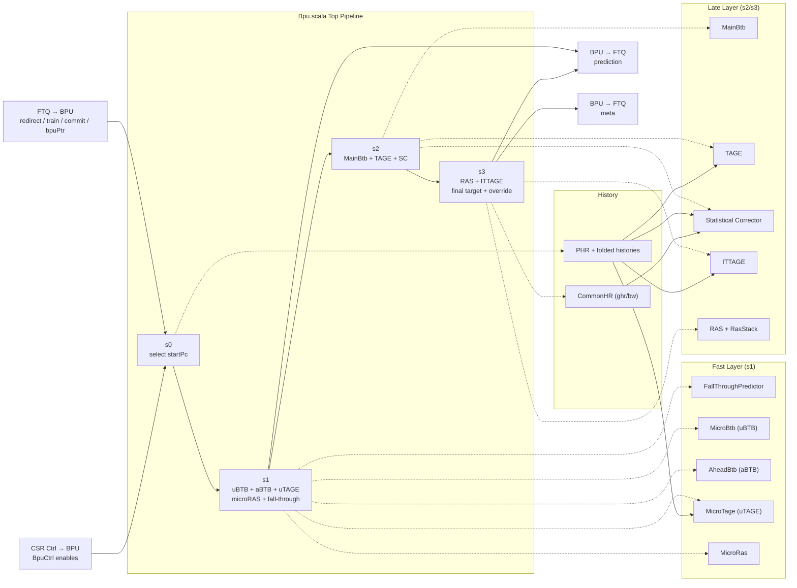
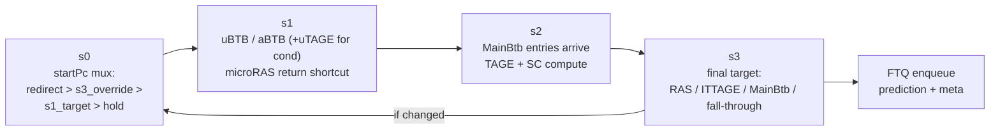

# Chapter 5a. Kunminghu BPU: Top-Level Architecture

This chapter moves from the general concepts of Chapter 5 into Kunminghu's concrete BPU
organization. We examine the four-stage prediction pipeline, the fast/accurate two-layer split,
the override mechanism, and the BPU's contract with the Fetch Target Queue (FTQ).

The primary implementation anchor is the top-level BPU module
[Bpu.scala:46](../../src/main/scala/xiangshan/frontend/bpu/Bpu.scala#L46), where all predictor
submodules are instantiated and coordinated.

### Block Diagram: Kunminghu BPU (Top, Sub-Predictors, and FTQ Coupling)

The diagram below shows the complete BPU organization. It has four groups:

- **BPU Top Pipeline** (center): the four pipeline stages s0 through s3, connected
  left-to-right. s0 selects the start PC; s1 produces a fast prediction; s2 computes
  refined direction decisions; s3 assembles the final target and checks for override.
- **Fast Layer** and **Late Layer** (top and bottom): the twelve sub-predictor modules,
  grouped by the stage at which their results are consumed. Dashed arrows from a stage
  to a predictor mean "this stage reads that predictor's output."
- **History** (right): PHR and CommonHR, the two global-history modules. Solid arrows
  show which predictors consume each history. PHR provides folded path history to TAGE,
  uTAGE, ITTAGE, and SC; CommonHR provides the global/backward-taken history to SC.
- **External interfaces** (edges): FTQ sends redirects, training data, and the current
  FTQ pointer into s0; CSR control enables reach each sub-predictor. The BPU sends
  the s1 fast prediction and the s3 final prediction (on override) to FTQ, plus
  assembled metadata from s3.



### ASCII Mental Model (Read This First)

```text
                            BPU Pipeline
                 +--------------------------------------------------------+
                 |                                                        |
   redirect ---->|  s0: pick startPc --> s1: fast guess --> s2: compute   |
   (from FTQ)    |       |                    |                  |        |
                 |       |                    |   (uBTB,aBTB,    |        |
                 |       |                    |    uTAGE,uRAS,   |        |
                 |       |                    |    fallThrough)  |        |
                 |       |                    |                  |        |
                 |       |                    v                  v        |
                 |       |              send s1 pred       --> s3: final  |--> FTQ (meta)
                 |       |              to FTQ                   |        |
                 |       |                                       |        |
                 |       |                             (MainBtb+TAGE+SC,  |
                 |       |                              ITTAGE, RAS)      |
                 |       |                                       |        |
                 |       |                              if s3 ≠ s1:       |
                 |       <---------------- override <-- s3_override       |--> FTQ (corrected pred)
                 |                                                        |
                 +--------------------------------------------------------+

  Key idea: s1 provides a fast prediction every cycle.
            s3 may override it 2 cycles later if the accurate predictors disagree.
```

---

## 5a.1 Design Goals

The Kunminghu BPU is built around three goals:

1. **Keep a low-latency path for every fetch cycle.** The fast layer must produce a usable
   prediction within one pipeline cycle of receiving the start PC, so the frontend can issue a
   new fetch request every cycle without stalling.

2. **Recover quickly when better information appears.** When the accurate layer (s3) disagrees
   with the fast layer (s1), the BPU can correct the prediction and re-steer fetch within the
   BPU pipeline itself — much cheaper than waiting for a full backend redirect.

3. **Train predictors with precise outcomes without stalling prediction.** Training data flows
   through separate channels (fast-train, resolve-train, commit-train) so that updates to predictor
   tables do not block the prediction pipeline.

The top-level class is
[Bpu.scala:46](../../src/main/scala/xiangshan/frontend/bpu/Bpu.scala#L46), and all twelve
submodules are instantiated at
[Bpu.scala:57–68](../../src/main/scala/xiangshan/frontend/bpu/Bpu.scala#L57):

```text
fallThrough, ubtb, abtb, utage, mbtb, tage, ittage, sc, ras, phr, commonHR, uras
```

---

## 5a.2 The Four-Stage Pipeline (s0 → s1 → s2 → s3)

The BPU pipeline has four stages. Unlike a decoupled elastic pipeline with independent
valid/ready handshakes per stage, this is a **controlled predictor pipeline** with explicit
flush logic and FTQ backpressure.

### 5a.2.1 Stage Responsibilities



| Stage | What happens | Key hardware |
| --- | --- | --- |
| **s0** | Select the start PC for this prediction cycle. Priority: backend redirect > s3 override > s1 predicted target > hold previous. | MuxCase at [Bpu.scala:434](../../src/main/scala/xiangshan/frontend/bpu/Bpu.scala#L434) |
| **s1** | Fast predictors produce results. uBTB and aBTB provide branch candidates; uTAGE refines conditional direction; microRAS provides a speculative return target. The earliest taken candidate is selected and sent to FTQ. | Selection logic at [Bpu.scala:265](../../src/main/scala/xiangshan/frontend/bpu/Bpu.scala#L265) |
| **s2** | MainBtb read results arrive. TAGE and SC compute direction decisions. Results are registered for s3. | MainBtb + TAGE + SC at [Bpu.scala:319](../../src/main/scala/xiangshan/frontend/bpu/Bpu.scala#L319) |
| **s3** | Final target selection: RAS (returns), ITTAGE (indirect branches), MainBtb target (other taken), or fall-through (not taken). Compare with the registered s1 prediction to detect override. Metadata is assembled and sent to FTQ. | Final selection at [Bpu.scala:349](../../src/main/scala/xiangshan/frontend/bpu/Bpu.scala#L349), override at [Bpu.scala:380](../../src/main/scala/xiangshan/frontend/bpu/Bpu.scala#L380) |

### 5a.2.2 Pipeline Timing Diagram

In the normal case (no override, no redirect), the pipeline produces one prediction per cycle:

| Cycle | s0 | s1 | s2 | s3 | FTQ |
| --- | --- | --- | --- | --- | --- |
| C0 | select PC_A | — | — | — | — |
| C1 | select PC_B | fast predict A | — | — | receives s1 prediction for A |
| C2 | select PC_C | fast predict B | compute A | — | receives s1 prediction for B |
| C3 | select PC_D | fast predict C | compute B | final A | meta for A enqueued; if A matches → no override |
| C4 | select PC_E | fast predict D | compute C | final B | meta for B enqueued |

The s1 prediction for block A reaches FTQ at C1, and the s3 metadata arrives at C3. If the s3
prediction matches the s1 prediction, no correction is needed — the s1 prediction was already
accepted and FTQ proceeds normally.

Relevant logic:
- prediction valid to FTQ: [Bpu.scala:415](../../src/main/scala/xiangshan/frontend/bpu/Bpu.scala#L415)
- meta valid to FTQ: [Bpu.scala:428](../../src/main/scala/xiangshan/frontend/bpu/Bpu.scala#L428)

---

## 5a.3 Two Layers: Fast and Accurate

The twelve submodules divide into two functional layers:

### Fast Layer (s1-Critical)

These predictors must produce results within one cycle of receiving the start PC in s0. They are
small, simple, and optimized for speed over accuracy.

| Predictor | Role | Key characteristic |
| --- | --- | --- |
| **FallThroughPredictor** | Default next-block address | Always available; handles the "no branch" case |
| **uBTB** (MicroBtb) | Tiny fully-associative branch cache | 32 entries; always-taken-on-hit; single candidate |
| **aBTB** (AheadBtb) | Larger set-associative branch buffer | 1024 entries, 8 ways; multiple candidates per block |
| **uTAGE** (MicroTage) | Short-history conditional refinement | 2 TAGE tables; refines aBTB/uBTB taken decisions |
| **microRAS** (MicroRas) | Speculative return target shortcut | Small shadow of full RAS; provides s1 return target |

### Late Layer (s2/s3 Accuracy)

These predictors use larger structures and longer histories. They take 2–3 cycles to produce
results but provide higher accuracy.

| Predictor | Role | Key characteristic |
| --- | --- | --- |
| **MainBtb** | Comprehensive FTB-equivalent structure | 8192 entries, 4 ways; multiple branches per block |
| **TAGE** | Conditional direction backbone | 8 tables, history lengths 4–397 bits |
| **SC** (Statistical Corrector) | Correction layer for TAGE | Multiple weak tables; can flip TAGE decisions |
| **ITTAGE** | Indirect target prediction | 5 tables; history-sensitive target |
| **RAS** (full) | Return address stack | Speculative queue + committed stack |

### History Subsystems

Two dedicated modules manage the global branch history used by the direction/target predictors:

| Module | Role | Consumers |
| --- | --- | --- |
| **PHR** (Path History Register) | Bit-level branch history with folded views | TAGE, uTAGE, ITTAGE |
| **CommonHR** (Common History Register) | Global + backward-taken histories | SC |

### 5a.3.1 Branch Routing: Which Predictor Handles What

The BPU routes different branch types to different predictors. This routing is driven by the
`BranchAttribute` type system
[Bundles.scala:37](../../src/main/scala/xiangshan/frontend/bpu/Bundles.scala#L37):

| Branch type | s1 (fast) prediction | s3 (accurate) prediction | Typical final source |
| --- | --- | --- | --- |
| Conditional | uBTB/aBTB ± uTAGE direction | MainBtb + TAGE ± SC direction | `MbtbTage` or `MbtbSc` |
| Direct jump/call | uBTB/aBTB target | MainBtb target | `Mbtb` |
| Indirect (non-return) | aBTB target hint | MainBtb + ITTAGE target | `ITTage` |
| Return | microRAS speculative top | full RAS top | `Ras` |
| No branch hit | fall-through | fall-through | `Fallthrough` |

The `BranchAttribute` classifies every branch by two properties:
- **BranchType**: `None`, `Conditional`, `Direct`, or `Indirect`
  [Bundles.scala:64](../../src/main/scala/xiangshan/frontend/bpu/Bundles.scala#L64)
- **RasAction**: `None`, `Push` (call), `Pop` (return), or `PopAndPush` (tail-call-like)
  [Bundles.scala:74](../../src/main/scala/xiangshan/frontend/bpu/Bundles.scala#L74)

The `needIttage` signal
[Bundles.scala:60](../../src/main/scala/xiangshan/frontend/bpu/Bundles.scala#L60) is true for
indirect branches that are not returns — these are the branches that need ITTAGE target prediction
rather than RAS.

The prediction source is tracked for debugging and performance counters via `BpuPredictionSource`
[Bundles.scala:142](../../src/main/scala/xiangshan/frontend/bpu/Bundles.scala#L142), which records
both the s1 source (Ubtb, Abtb, UbtbUtage, AbtbUtage, Fallthrough) and the s3 source (Ras,
ITTage, MbtbSc, MbtbTage, Mbtb, FallthroughTage, Fallthrough).

---

## 5a.4 The Override Mechanism

The override is the central design mechanism that makes the two-layer strategy work. It answers:
*What happens when the accurate predictor disagrees with the fast predictor?*

### 5a.4.1 How Override Works

1. When s1 produces a prediction, it is immediately sent to FTQ and also registered for later
   comparison.
2. Two cycles later, s3 produces a refined prediction from the larger structures.
3. The BPU compares the s3 prediction with the saved s1 prediction
   [Bpu.scala:380](../../src/main/scala/xiangshan/frontend/bpu/Bpu.scala#L380):

   If `s3_prediction ≠ s3_s1Prediction`, then `s3_override` is asserted.

4. When `s3_override` is true:
   - FTQ receives the corrected prediction with `s3Override=true`
     [Bpu.scala:417](../../src/main/scala/xiangshan/frontend/bpu/Bpu.scala#L417)
   - BPU re-steers `s0_startPc` to the corrected target
     [Bpu.scala:438](../../src/main/scala/xiangshan/frontend/bpu/Bpu.scala#L438)
   - Stages s1 and s2 are flushed because they were computing on the wrong path
     [Bpu.scala:238–239](../../src/main/scala/xiangshan/frontend/bpu/Bpu.scala#L238)

### 5a.4.2 Override Timing

| Cycle | Event |
| --- | --- |
| C0 | s1 sends early prediction (target=X) to FTQ |
| C1 | s2 computes refined decision based on MainBtb/TAGE/SC |
| C2 | s3 compares refined prediction (target=Y) with saved s1 prediction (target=X) |
| C2 | `s3_override=1`: FTQ receives corrected prediction (target=Y, `s3Override=1`) |
| C3 | BPU `s0_startPc` re-steers to Y; s1/s2 are flushed and restart |

The override costs approximately 2 wasted fetch cycles (the s1/s2 work on the wrong path). This
is much cheaper than a full backend misprediction (10–15+ cycles), so the trade-off is strongly
favorable: it is better to occasionally waste 2 cycles on an s1-to-s3 correction than to let a
wrong s1 prediction reach the backend.

### 5a.4.3 Override vs. Backend Redirect

It is important to distinguish two correction mechanisms:

| Mechanism | Trigger | Penalty | Who detects the error |
| --- | --- | --- | --- |
| **s3 override** | s3 prediction differs from s1 | ~2 cycles (BPU-internal) | BPU itself |
| **Backend redirect** | Executed branch outcome differs from BPU prediction | 10–15+ cycles (full pipeline flush) | Backend execution units |

Backend redirects have the highest priority — when a redirect arrives, the BPU flushes all stages
and restarts from the redirect target
[Bpu.scala:237](../../src/main/scala/xiangshan/frontend/bpu/Bpu.scala#L237). The s3 override
takes priority over normal s1 flow but is subordinate to redirects.

---

## 5a.5 Pipeline Control: Valid, Fire, Flush

### 5a.5.1 Valid Registers

Each pipeline stage has a valid register that tracks whether it holds a live prediction:

- `s1_valid`, `s2_valid`, `s3_valid`: [Bpu.scala:129–131](../../src/main/scala/xiangshan/frontend/bpu/Bpu.scala#L129)

These registers are managed by explicit combinational logic, not by a generic pipeline library.

### 5a.5.2 Fire Conditions

A stage "fires" when it produces a valid result and the next stage can accept it:

| Signal | Condition | Anchor |
| --- | --- | --- |
| `s0_fire` | s1 is ready AND all predictors have completed reset | [Bpu.scala:245](../../src/main/scala/xiangshan/frontend/bpu/Bpu.scala#L245) |
| `s1_fire` | s1 valid AND s2 ready AND FTQ can accept prediction | [Bpu.scala:246](../../src/main/scala/xiangshan/frontend/bpu/Bpu.scala#L246) |
| `s2_fire` | s2 valid AND s3 ready | [Bpu.scala:247](../../src/main/scala/xiangshan/frontend/bpu/Bpu.scala#L247) |
| `s3_fire` | s3 valid | [Bpu.scala:248](../../src/main/scala/xiangshan/frontend/bpu/Bpu.scala#L248) |

Note that `s1_fire` depends on `io.toFtq.prediction.ready` — this is the FTQ backpressure
mechanism. When FTQ is full, s1 cannot fire, which stalls the entire prediction pipeline.

### 5a.5.3 Flush Propagation

Flushes propagate from high-priority events to earlier stages:

```text
  s3_flush  =  redirect.valid
  s2_flush  =  s3_flush || s3_override
  s1_flush  =  s2_flush
```

[Bpu.scala:237–239](../../src/main/scala/xiangshan/frontend/bpu/Bpu.scala#L237)

A redirect flushes all stages. An s3 override flushes s1 and s2 (since those stages were computing
on the wrong path) but does not flush s3 (s3 produced the correct answer). The s0 stage itself is
not flushed — instead, `s0_startPc` is re-steered by the MuxCase priority logic.

### 5a.5.4 Stall Behavior

When no source provides a new PC — no s1_valid, no s3_override, no redirect — the pipeline stalls:

```text
  s0_stall = !(s1_valid || s3_override || redirect.valid)
```

[Bpu.scala:263](../../src/main/scala/xiangshan/frontend/bpu/Bpu.scala#L263)

During a stall, `s0_startPcReg` holds the last PC. An assertion verifies that `s0_startPc` does
not change during stall
[Bpu.scala:497](../../src/main/scala/xiangshan/frontend/bpu/Bpu.scala#L497).

---

## 5a.6 Start PC Selection

The start PC for each prediction cycle is selected by a priority MuxCase
[Bpu.scala:434](../../src/main/scala/xiangshan/frontend/bpu/Bpu.scala#L434):

```text
  s0_startPc = MuxCase(s0_startPcReg,      // default: hold previous PC
    redirect.valid → redirect.target,       // highest priority: backend redirect
    s3_override    → s3_prediction.target,  // second: BPU-internal override
    s1_valid       → s1_prediction.target   // third: normal flow from s1
  )
```

This priority order is critical for correctness:

1. **Redirect** always wins — the backend has resolved a branch and the frontend must comply.
2. **s3 override** — the BPU's own accurate layer detected a different prediction.
3. **s1 prediction** — normal speculative flow.
4. **Hold** — no new PC available; keep the previous one.

The start PC register `s0_startPcReg` captures the PC on every non-stall cycle
[Bpu.scala:141](../../src/main/scala/xiangshan/frontend/bpu/Bpu.scala#L141) and is initialized
from `io.resetVector` after reset deasserts
[Bpu.scala:143–145](../../src/main/scala/xiangshan/frontend/bpu/Bpu.scala#L143).

---

## 5a.7 External Contracts

### 5a.7.1 BPU Top IO (`BpuIO`)

| Port | Direction | Purpose | Anchor |
| --- | --- | --- | --- |
| `ctrl` | In | CSR control enables for sub-predictors | [Bpu.scala:48](../../src/main/scala/xiangshan/frontend/bpu/Bpu.scala#L48) |
| `resetVector` | In | Initial start PC after reset | [Bpu.scala:49](../../src/main/scala/xiangshan/frontend/bpu/Bpu.scala#L49) |
| `fromFtq` | In | Redirect, resolve-train, commit-train, FTQ pointer | [Bpu.scala:50](../../src/main/scala/xiangshan/frontend/bpu/Bpu.scala#L50) |
| `toFtq` | Out | Prediction stream + metadata + perf/topdown | [Bpu.scala:51](../../src/main/scala/xiangshan/frontend/bpu/Bpu.scala#L51) |

### 5a.7.2 BPU → FTQ (`BpuToFtqIO`)

| Signal | Type | Purpose | Anchor |
| --- | --- | --- | --- |
| `prediction` | `Decoupled[BpuPrediction]` | Predicted start PC, target, taken offset, s3Override flag | [Bundles.scala:54](../../src/main/scala/xiangshan/frontend/Bundles.scala#L54) |
| `meta` | `Decoupled[BpuMeta]` | Redirect/resolve/commit metadata for later training and recovery | [Bundles.scala:55](../../src/main/scala/xiangshan/frontend/Bundles.scala#L55) |
| `s3FtqPtr` | `FtqPtr` | Pointer used for meta enqueue and s3 override target | [Bundles.scala:56](../../src/main/scala/xiangshan/frontend/Bundles.scala#L56) |

The `prediction` channel carries a `BpuPrediction`
[Bundles.scala:194](../../src/main/scala/xiangshan/frontend/bpu/Bundles.scala#L194) with:

| Field | Description |
| --- | --- |
| `startPc` | Aligned start PC of the predicted fetch block |
| `target` | Predicted next fetch address (branch target or fall-through) |
| `takenCfiOffset` | Position of the taken branch within the block (if any) |
| `s3Override` | Whether this prediction is an s3 correction replacing a previous s1 prediction |

### 5a.7.3 FTQ → BPU (`FtqToBpuIO`)

| Signal | Type | Purpose | Anchor |
| --- | --- | --- | --- |
| `redirect` | `Valid[BpuRedirect]` | Backend/IFU redirect with recovery metadata | [Bundles.scala:64](../../src/main/scala/xiangshan/frontend/Bundles.scala#L64) |
| `train` | `Decoupled[BpuTrain]` | Resolve-train payload with actual branch outcomes | [Bundles.scala:65](../../src/main/scala/xiangshan/frontend/Bundles.scala#L65) |
| `commit` | `Valid[BpuCommit]` | Commit-train payload for RAS consolidation | [Bundles.scala:66](../../src/main/scala/xiangshan/frontend/Bundles.scala#L66) |
| `bpuPtr` | `FtqPtr` | Current FTQ pointer for metadata tracking | [Bundles.scala:67](../../src/main/scala/xiangshan/frontend/Bundles.scala#L67) |

### 5a.7.4 CSR Control (`BpuCtrl`)

Each major sub-predictor can be individually enabled or disabled via CSR bits
[Bundles.scala:180](../../src/main/scala/xiangshan/frontend/bpu/Bundles.scala#L180):

| Enable bit | Controls |
| --- | --- |
| `ubtbEnable` | MicroBtb (uBTB) |
| `abtbEnable` | AheadBtb (aBTB) |
| `mbtbEnable` | MainBtb |
| `tageEnable` | TAGE |
| `scEnable` | Statistical Corrector |
| `ittageEnable` | ITTAGE |
| `rasEnable` | Full RAS |

The FallThrough predictor, uTAGE, and microRAS are always enabled
[Bpu.scala:91–93](../../src/main/scala/xiangshan/frontend/bpu/Bpu.scala#L91).
CSR controls are delayed by 2 cycles for timing
[Bpu.scala:88](../../src/main/scala/xiangshan/frontend/bpu/Bpu.scala#L88).

### 5a.7.5 Common Predictor Interface (`BasePredictorIO`)

All sub-predictors implement the `BasePredictorIO` interface
[Abstracts.scala:33](../../src/main/scala/xiangshan/frontend/bpu/Abstracts.scala#L33):

| Port | Direction | Description | Anchor |
| --- | --- | --- | --- |
| `enable` | In | Per-unit enable from CSR control | [Abstracts.scala:35](../../src/main/scala/xiangshan/frontend/bpu/Abstracts.scala#L35) |
| `stageCtrl` | In | Pipeline fire signals (s0/s1/s2/s3/t0) | [Abstracts.scala:37](../../src/main/scala/xiangshan/frontend/bpu/Abstracts.scala#L37) |
| `startPc` | In | Start PC for current prediction | [Abstracts.scala:39](../../src/main/scala/xiangshan/frontend/bpu/Abstracts.scala#L39) |
| `trainReady` | Out | Backpressure for resolve-train lane | [Abstracts.scala:41](../../src/main/scala/xiangshan/frontend/bpu/Abstracts.scala#L41) |
| `train` | In | Resolve-train payload from FTQ | [Abstracts.scala:42](../../src/main/scala/xiangshan/frontend/bpu/Abstracts.scala#L42) |
| `fastTrain` | In (optional) | Fast feedback from s3 for s1 predictors | [Abstracts.scala:44](../../src/main/scala/xiangshan/frontend/bpu/Abstracts.scala#L44) |
| `resetDone` | Out | Reset completion flag; gates `s0_fire` | [Abstracts.scala:46](../../src/main/scala/xiangshan/frontend/bpu/Abstracts.scala#L46) |

The s1 predictors (uBTB, aBTB, uTAGE) additionally implement `HasFastTrainIO`
[Abstracts.scala:49](../../src/main/scala/xiangshan/frontend/bpu/Abstracts.scala#L49), which
provides the optional `fastTrain` input. The BPU top wires this uniformly at
[Bpu.scala:195](../../src/main/scala/xiangshan/frontend/bpu/Bpu.scala#L195).

---

## 5a.8 Metadata Assembly

When s3 fires, the BPU assembles three categories of metadata and sends them to FTQ:

### Redirect Recovery Metadata (`BpuRedirectMeta`)

Contains the state needed to recover speculative history on a redirect:
- PHR pointer/low-bits snapshot
- CommonHR (ghr + bw) values and branch position information
- RAS speculative state

Assembled at [Bpu.scala:394–397](../../src/main/scala/xiangshan/frontend/bpu/Bpu.scala#L394),
defined in [Bundles.scala:271](../../src/main/scala/xiangshan/frontend/bpu/Bundles.scala#L271).

### Resolve Training Metadata (`BpuResolveMeta`)

Contains per-predictor metadata needed for training when branch outcomes are resolved:
- MainBtb entry/counter state
- TAGE provider/alternate table indices, counters, useful bits
- SC table readouts and threshold context
- ITTAGE provider/alternate metadata
- PHR snapshot for training-time history reconstruction

Assembled at [Bpu.scala:399–405](../../src/main/scala/xiangshan/frontend/bpu/Bpu.scala#L399),
defined in [Bundles.scala:278](../../src/main/scala/xiangshan/frontend/bpu/Bundles.scala#L278).

### Commit Training Metadata (`BpuCommitMeta`)

Contains metadata for commit-time updates, primarily for RAS:
- RAS commit state for architectural stack consolidation

Assembled at [Bpu.scala:407–408](../../src/main/scala/xiangshan/frontend/bpu/Bpu.scala#L407).

All three metadata categories are bundled into `BpuMeta` and sent via
`io.toFtq.meta` [Bpu.scala:428–431](../../src/main/scala/xiangshan/frontend/bpu/Bpu.scala#L428).

---

## 5a.9 Worked Example: Normal Prediction vs. Override

### Scenario A: No Override

A conditional branch at PC `0x8000_1000` is consistently taken to `0x8000_2000`.

1. **s0 (C0)**: `s0_startPc = 0x8000_1000` (from previous s1 prediction or hold).
2. **s1 (C1)**: uBTB hits on `0x8000_1000` with target `0x8000_2000`, taken. s1 prediction sent
   to FTQ: startPc=`0x8000_1000`, target=`0x8000_2000`, taken=true.
   s0 now selects `s0_startPc = 0x8000_2000` (from s1_prediction.target).
3. **s2 (C2)**: MainBtb entry for `0x8000_1000` arrives. TAGE provider predicts taken.
   SC does not flip.
4. **s3 (C3)**: Final prediction: taken, target=`0x8000_2000`. Comparison: s3 matches saved s1
   prediction → `s3_override = false`. Meta enqueued to FTQ normally. No flush.

Cost: zero wasted cycles.

### Scenario B: With Override

The same branch, but uBTB has a stale entry predicting target `0x8000_3000` (perhaps from a
previous branch that was evicted and replaced).

1. **s0 (C0)**: `s0_startPc = 0x8000_1000`.
2. **s1 (C1)**: uBTB hits with *wrong* target `0x8000_3000`. s1 prediction sent to FTQ:
   target=`0x8000_3000`. s0 re-steers to `0x8000_3000`.
3. **s1 (C2)**: Pipeline fetches `0x8000_3000` (wrong path). Meanwhile s2 processes MainBtb.
4. **s3 (C3)**: Final prediction: taken, target=`0x8000_2000`. Comparison: `0x8000_2000 ≠ 0x8000_3000`
   → `s3_override = true`. BPU sends corrected prediction to FTQ with `s3Override=true`.
   s1 and s2 are flushed. s0 re-steers to `0x8000_2000`.
5. **s1 (C4)**: Fresh prediction starts from `0x8000_2000`.

Cost: 2 wasted fetch cycles (C2 and C3 were on wrong path). Much cheaper than a full backend
redirect.

---

## 5a.10 Design Trade-Off: Staged vs. Monolithic Predictor

An alternative approach would be a single monolithic predictor that takes 3 cycles and produces
a high-accuracy result. This avoids the override mechanism entirely — but at a cost:

- **Throughput**: The frontend can only produce one prediction every 3 cycles instead of every
  cycle. For a 6-wide superscalar core, this would severely limit instruction supply.
- **Complexity**: To match throughput, the monolithic predictor would need heavy pipelining or
  multiple prediction "threads" in flight — which recreates much of the staged complexity.

The staged approach (fast guess + slow correction) maintains one-prediction-per-cycle throughput
while achieving accuracy close to the monolithic design. The override mechanism is the price
paid for this throughput advantage. In practice, the override rate is low (most s1 predictions
are correct), so the effective throughput is only slightly below one prediction per cycle.

Industry designs (Intel, AMD, ARM) converge on similar staged prediction architectures, validating
this trade-off.

---

## Key Takeaways

- The Kunminghu BPU uses a four-stage pipeline (s0→s1→s2→s3) with a two-layer predictor
  organization: fast s1 guess and accurate s3 refinement.
- The `s3_override` mechanism compares the s3 prediction with the saved s1 prediction; if they
  differ, the accurate answer wins at a cost of ~2 wasted fetch cycles.
- Start PC selection follows a strict priority: redirect > s3 override > s1 target > hold.
- The pipeline is not decoupled/elastic — it uses explicit valid/fire/flush control with FTQ
  backpressure as the only stall source.
- All sub-predictors share a uniform `BasePredictorIO` interface, and s1 predictors additionally
  receive fast-train feedback from s3 results.
- Three categories of metadata (redirect recovery, resolve training, commit training) flow from
  BPU through FTQ to support the full prediction-correction-learning lifecycle.

## Checkpoint Questions

1. **Basic**: What are the four stages of the BPU pipeline, and what is the primary responsibility
   of each?
2. **Basic**: Why is the FallThrough predictor always enabled while other predictors can be
   disabled via CSR?
3. **Intermediate**: Trace the s0_startPc MuxCase priority. Why must redirect have higher priority
   than s3_override?
4. **Intermediate**: Why does `s0_fire` depend on `predictors.map(_.io.resetDone).reduce(_ && _)`?
   What would go wrong without this guard?
5. **Intermediate**: Explain why `s1_fire` depends on `io.toFtq.prediction.ready`. What does this
   imply about what can stall the prediction pipeline?
6. **Advanced**: If the override rate were 50% (half of all s1 predictions are corrected by s3),
   what would the effective prediction throughput be? At what override rate does the staged design
   become equivalent to a 3-cycle monolithic predictor?
7. **Advanced**: The flush logic sets `s2_flush = s3_flush || s3_override` and
   `s1_flush = s2_flush`. Why is s3 not flushed on an s3_override? What would break if it were?

## Further Reading

1. Seznec, A. "A 64-Kbytes ITTAGE Indirect Branch Predictor." JWAC 2011.
2. Reinman, Austin, Calder. "A Scalable Front-End Architecture for Fast Instruction Delivery."
   ISCA 1999.
3. Jimenez, D. A. "Reconsidering Complex Branch Predictors." HPCA 2003.
4. Michaud, P. "A PPM-like, Tag-based Branch Predictor." JILP 2005.

---

See [Chapter 5b](05b-fast-predictors.md) for detailed coverage of the fast-layer predictors
(FallThrough, uBTB, aBTB, uTAGE, microRAS) and s1 selection logic.

See [Chapter 5c](05c-accurate-predictors.md) for the accurate-layer predictors (MainBtb, TAGE,
SC, ITTAGE, full RAS) and s3 final selection.

See [Chapter 5d](05d-history-training-recovery.md) for global history management (PHR, CommonHR),
all three training lanes, and redirect recovery.
