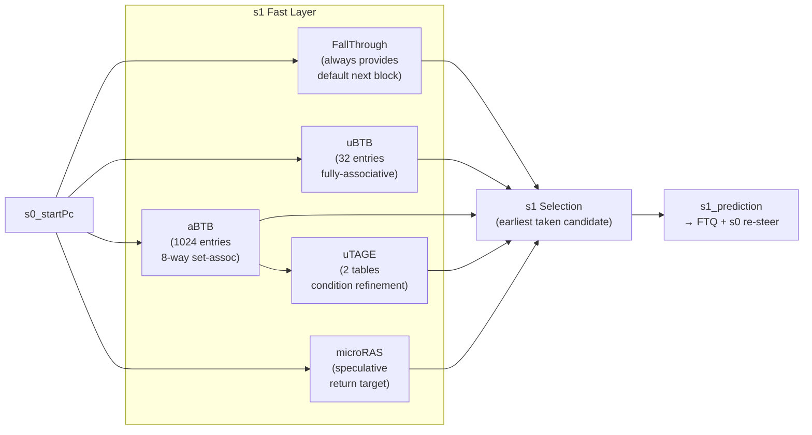

# Chapter 5b. Fast Predictors: The s1 Layer

This chapter examines the five predictors that form the fast layer of Kunminghu's BPU. These
structures must produce a usable prediction within one pipeline cycle of receiving the start PC,
so the frontend can issue a new fetch request every cycle. Speed is the primary constraint; the
accurate s2/s3 layer (Chapter 5c) handles cases where the fast layer's answer is wrong.

The s1 selection logic that combines the outputs of all five fast predictors is covered in Section
5b.6 and implemented in
[Bpu.scala:265–317](../../src/main/scala/xiangshan/frontend/bpu/Bpu.scala#L265).

### Block Diagram: s1 Predictor Ensemble



### ASCII Mental Model

```text
  s0_startPc ──┬──> FallThrough ─── default target (next block) ──────────┐
               │                                                           │
               ├──> uBTB ─── 1 candidate (always-taken on hit) ──────────┤
               │                                                           │
               ├──> aBTB ─── N candidates (branch entries) ────────┐     │
               │                    │                               │     │
               │                    └──> uTAGE ── refine cond ─────┤     │
               │                                                    │     │
               └──> microRAS ── return target ─────────────────────┤     │
                                                                    │     │
                                                     ┌──────────────┘     │
                                                     ▼                    ▼
                                              s1 Selection:        (fallback)
                                              pick earliest
                                              taken candidate
                                                     │
                                                     ▼
                                              s1_prediction
```

---

## 5b.1 FallThrough Predictor: The Default Path

The FallThrough predictor is the simplest of all: it computes the next sequential fetch block
address. It always provides a valid answer, ensuring that even when no BTB-like structure produces
a hit, the pipeline has a legal next PC.

Implementation: [FallThroughPredictor.scala:23](../../src/main/scala/xiangshan/frontend/bpu/FallThroughPredictor.scala#L23)

### 5b.1.1 What It Computes

Given the current start PC, the FallThrough predictor computes:

```text
  nextBlockAlignedPc = align(startPc + FetchBlockSize)
```

This is the address of the next fetch block after consuming the current one. The result is aligned
to the `FetchBlockAlignSize` boundary (typically half of `FetchBlockSize`).

The prediction output is
[FallThroughPredictor.scala:94–97](../../src/main/scala/xiangshan/frontend/bpu/FallThroughPredictor.scala#L94):

| Field | Value |
| --- | --- |
| `taken` | `false` (never taken — it is the not-taken default) |
| `cfiPosition` | Last instruction position in the block |
| `target` | Next block aligned PC |
| `attribute` | `BranchAttribute.None` |

### 5b.1.2 Cross-Page Boundary Handling

A subtle complication arises when the fetch block straddles a page boundary. If `startPc` is near
the end of a page (e.g., `0x___fe0`), the computed next block could land on the next page. In this
case, the fall-through target must be clamped to the page boundary, and the `cfiPosition` is
adjusted to end at the last instruction before the page crossing.

This logic is implemented at
[FallThroughPredictor.scala:68–92](../../src/main/scala/xiangshan/frontend/bpu/FallThroughPredictor.scala#L68):

```text
  if crossPage(startPc, nextBlockPc):
      target      = pageAlign(nextBlockPc)     # start of next page
      cfiPosition = adjusted to page boundary   # fewer instructions in this block
  else:
      target      = nextBlockPc                 # normal next block
      cfiPosition = FetchBlockInstNum - 1       # full block width
```

### 5b.1.3 Why This Matters

Without the FallThrough predictor, a BTB miss would leave the pipeline without a next-PC,
causing a stall. The FallThrough predictor guarantees forward progress: every cycle, the pipeline
has at least a sequential continuation address. When a BTB does hit, the BTB's prediction overrides
the fall-through in the selection logic.

---

## 5b.2 uBTB (MicroBtb): A Tiny Fast Cache

### 5b.2.1 Design Intent

The uBTB is designed to be the absolute fastest branch predictor in the system. It uses a small,
fully-associative structure so that any branch can be stored in any entry, avoiding the conflict
misses of set-associative designs.

Implementation: [MicroBtb.scala:30](../../src/main/scala/xiangshan/frontend/bpu/ubtb/MicroBtb.scala#L30)

### 5b.2.2 Structure

The uBTB has 32 entries stored in registers (not SRAM), enabling single-cycle lookup with parallel
tag comparison across all entries
[MicroBtb.scala:49](../../src/main/scala/xiangshan/frontend/bpu/ubtb/MicroBtb.scala#L49).

Each entry contains:

| Field | Width | Purpose |
| --- | --- | --- |
| `tag` | 22 bits | Identifies which PC this entry belongs to |
| `usefulCnt` | 2 bits | Saturating counter for replacement policy |
| `slot1.position` | varies | Position of the branch within the fetch block |
| `slot1.attribute` | 8 bits | Branch type (conditional/direct/indirect) and RAS action |
| `slot1.target` | 22 bits | Lower bits of the branch target address |
| `slot1.isStaticTarget` | 1 bit | Whether the target has always been the same |

Entry format defined at [Bundles.scala:32](../../src/main/scala/xiangshan/frontend/bpu/ubtb/Bundles.scala#L32).
An entry is considered valid when its useful counter is not at its minimum (saturate-negative)
value [Bundles.scala:57](../../src/main/scala/xiangshan/frontend/bpu/ubtb/Bundles.scala#L57).

### 5b.2.3 Always-Taken-on-Hit Policy

The uBTB uses an **always-taken-on-hit** prediction policy
[MicroBtb.scala:78–83](../../src/main/scala/xiangshan/frontend/bpu/ubtb/MicroBtb.scala#L78).
When the uBTB hits, it predicts taken and provides the stored target — regardless of
branch type or confidence.

This is an aggressive design choice:
- **Advantage**: Simplicity and speed. No direction counter to read or evaluate.
- **Risk**: If a conditional branch is actually not-taken, the s1 prediction is wrong.
- **Mitigation**: The s3 layer (TAGE + SC) will detect the error and override. Meanwhile, the
  uTAGE can also refine conditional branch direction at s1 (Section 5b.4).

### 5b.2.4 Prediction Path

1. **s0**: Register the start PC.
2. **s1**: Compare the tag against all 32 entries in parallel
   [MicroBtb.scala:72](../../src/main/scala/xiangshan/frontend/bpu/ubtb/MicroBtb.scala#L72).
   At most one entry can match (asserted one-hot). On hit, output the entry's target and attribute
   as a `Valid[Prediction]`.

### 5b.2.5 Fast-Train Update Path

The uBTB receives training directly from the s3 final prediction via the `fastTrain` interface
[MicroBtb.scala:102–108](../../src/main/scala/xiangshan/frontend/bpu/ubtb/MicroBtb.scala#L102).
This is much faster than waiting for backend resolve — the uBTB learns from the accurate layer's
decision within a few cycles.

The training logic (t0/t1 pipeline) handles:
- **Hit + correct**: increase useful counter
  [MicroBtb.scala:214](../../src/main/scala/xiangshan/frontend/bpu/ubtb/MicroBtb.scala#L214)
- **Hit + wrong info**: decrease useful counter; if already not useful, reinitialize entry
  [MicroBtb.scala:203–206](../../src/main/scala/xiangshan/frontend/bpu/ubtb/MicroBtb.scala#L203)
- **Miss + actually taken**: allocate a new entry using the replacement victim
  [MicroBtb.scala:199–202](../../src/main/scala/xiangshan/frontend/bpu/ubtb/MicroBtb.scala#L199)

A notable implementation detail: contiguous fast-train requests can cause hazards (the first write
has not completed when the second lookup occurs). The `t0_hitT1Update` logic detects this case
and forwards the in-flight entry
[MicroBtb.scala:139–148](../../src/main/scala/xiangshan/frontend/bpu/ubtb/MicroBtb.scala#L139).

### 5b.2.6 Replacement Policy

When allocating a new entry, the replacer first tries to evict an entry whose useful counter is
at its minimum (not useful). If all entries are useful, PLRU (Pseudo Least Recently Used) selects
the victim
[MicroBtb.scala:51–52](../../src/main/scala/xiangshan/frontend/bpu/ubtb/MicroBtb.scala#L51).

### 5b.2.7 uBTB Parameters

| Parameter | Default | Purpose | Anchor |
| --- | --- | --- | --- |
| [`NumEntries`](../../src/main/scala/xiangshan/frontend/bpu/ubtb/Parameters.scala#L22) | 32 | Total entries (fully-associative) |
| [`TagWidth`](../../src/main/scala/xiangshan/frontend/bpu/ubtb/Parameters.scala#L23) | 22 | Tag bits for PC identification |
| [`TargetWidth`](../../src/main/scala/xiangshan/frontend/bpu/ubtb/Parameters.scala#L24) | 22 | Target address lower bits (2B-aligned) |
| [`UsefulCntWidth`](../../src/main/scala/xiangshan/frontend/bpu/ubtb/Parameters.scala#L25) | 2 | Saturating counter width for replacement |
| [`Replacer`](../../src/main/scala/xiangshan/frontend/bpu/ubtb/Parameters.scala#L26) | `"plru"` | Replacement algorithm |
| [`UseFastTrain`](../../src/main/scala/xiangshan/frontend/bpu/ubtb/Parameters.scala#L28) | `true` | Train from s3 prediction instead of resolve |

---

## 5b.3 aBTB (AheadBtb): Multiple Candidates Ahead

### 5b.3.1 Design Intent

Where uBTB provides a single candidate from a tiny fully-associative cache, the aBTB provides
**multiple** candidate branches from a larger set-associative structure. It retains enough capacity
to cover the working set of branches in hot code regions while still delivering results in s1.

Implementation: [AheadBtb.scala:46](../../src/main/scala/xiangshan/frontend/bpu/abtb/AheadBtb.scala#L46)

### 5b.3.2 Structure

The aBTB organizes 1024 entries into a banked, set-associative hierarchy:

```text
  aBTB (1024 entries total)
  ├── Bank 0 (256 entries)
  │   ├── Set 0: Way 0 | Way 1 | ... | Way 7
  │   ├── Set 1: Way 0 | Way 1 | ... | Way 7
  │   └── ...
  ├── Bank 1 (256 entries)
  ├── Bank 2 (256 entries)
  └── Bank 3 (256 entries)
```

- **4 banks**: allow parallel access and reduce port conflicts
- **8 ways per set**: high associativity for good hit rate
- **32 sets per bank**: indexed by PC bits

Each entry stores:
- Tag, branch position within the fetch block, branch attribute, and target lower bits

Entry format: [Bundles.scala:83](../../src/main/scala/xiangshan/frontend/bpu/abtb/Bundles.scala#L83)

### 5b.3.3 Prediction Output

Unlike the uBTB (which outputs a single `Valid[Prediction]`), the aBTB outputs a **vector** of
valid predictions — one for each branch it finds in the fetch block
[AheadBtb.scala:172](../../src/main/scala/xiangshan/frontend/bpu/abtb/AheadBtb.scala#L172).

Each candidate includes:
- Branch position, attribute, target, and a per-way **taken counter** (2-bit saturating)

The taken counter gives the aBTB a basic direction prediction capability: unlike the uBTB
(always-taken-on-hit), the aBTB can predict "not taken" for conditional branches whose counter
is in the not-taken state.

### 5b.3.4 Redirect and Override Awareness

The aBTB receives explicit `redirectValid` and `overrideValid` signals from the BPU top
[AheadBtb.scala:33–34](../../src/main/scala/xiangshan/frontend/bpu/abtb/AheadBtb.scala#L33).
These allow the aBTB to flush internal pipeline state on redirect or s3 override, preventing stale
data from corrupting predictions.

### 5b.3.5 Multi-Hit Cleanup

Because the aBTB is set-associative, it is possible for the same branch to appear in multiple
ways (due to training races or allocation collisions). When this happens, the aBTB detects the
multi-hit and invalidates one of the duplicate entries
[AheadBtb.scala:294](../../src/main/scala/xiangshan/frontend/bpu/abtb/AheadBtb.scala#L294).

### 5b.3.6 Fast-Train Path

Like the uBTB, the aBTB receives fast-train feedback from the s3 prediction result
[AheadBtb.scala:204](../../src/main/scala/xiangshan/frontend/bpu/abtb/AheadBtb.scala#L204).
The aBTB metadata (`AheadBtbMeta`) carries per-way hit/attribute/position/target information needed
for the update
[Bundles.scala:76](../../src/main/scala/xiangshan/frontend/bpu/abtb/Bundles.scala#L76).

### 5b.3.7 aBTB Parameters

| Parameter | Default | Purpose | Anchor |
| --- | --- | --- | --- |
| [`NumEntries`](../../src/main/scala/xiangshan/frontend/bpu/abtb/Parameters.scala#L22) | 1024 | Total entries |
| [`NumBanks`](../../src/main/scala/xiangshan/frontend/bpu/abtb/Parameters.scala#L23) | 4 | Number of banks |
| [`NumWays`](../../src/main/scala/xiangshan/frontend/bpu/abtb/Parameters.scala#L24) | 8 | Ways per set |
| [`TagWidth`](../../src/main/scala/xiangshan/frontend/bpu/abtb/Parameters.scala#L25) | 24 | Tag bits |
| [`TargetLowerBitsWidth`](../../src/main/scala/xiangshan/frontend/bpu/abtb/Parameters.scala#L26) | 22 | Target address lower bits |
| [`WriteBufferSize`](../../src/main/scala/xiangshan/frontend/bpu/abtb/Parameters.scala#L27) | 4 | Write buffer depth |
| [`TakenCounterWidth`](../../src/main/scala/xiangshan/frontend/bpu/abtb/Parameters.scala#L28) | 2 | Per-way taken counter bits |

---

## 5b.4 uTAGE (MicroTage): Quick Direction Refinement

### 5b.4.1 Design Intent

The uBTB uses always-taken, and the aBTB has only a simple 2-bit taken counter. For conditional
branches, this is not enough — a short-history TAGE-like predictor can do significantly better.
The uTAGE provides this refinement on the fast path, adding history-sensitive conditional direction
prediction at s1 without waiting for the full TAGE tables in s2/s3.

Implementation: [MicroTage.scala:51](../../src/main/scala/xiangshan/frontend/bpu/utage/MicroTage.scala#L51)

### 5b.4.2 Structure

The uTAGE is a lightweight variant of TAGE (see Chapter 5 for the TAGE concept). It uses 2 tables
with different history lengths:

| Table | Entries | History length | Tag width | Folded history width |
| --- | --- | --- | --- | --- |
| Table 0 | 512 | 9 | 9 | 15 |
| Table 1 | 512 | 16 | 12 | 16 |

Parameters: [Parameters.scala:23](../../src/main/scala/xiangshan/frontend/bpu/utage/Parameters.scala#L23)

Each table entry contains a tag, a 3-bit taken counter, and a 2-bit useful counter. The tables are
indexed by a hash of the PC and folded path history from the PHR module.

### 5b.4.3 How uTAGE Refines s1 Prediction

The uTAGE receives the aBTB prediction candidates as input
[MicroTage.scala:42](../../src/main/scala/xiangshan/frontend/bpu/utage/MicroTage.scala#L42).
For each conditional branch candidate found by aBTB or uBTB, the uTAGE checks whether any of its
tables has a matching entry at that branch position. If a match is found and the taken counter is
confident enough
[MicroTage.scala:97](../../src/main/scala/xiangshan/frontend/bpu/utage/MicroTage.scala#L97),
the uTAGE outputs its own taken/not-taken decision.

In the s1 selection logic, the uTAGE decision replaces the base taken prediction for conditional
branches when the branch positions match
[Bpu.scala:267–277](../../src/main/scala/xiangshan/frontend/bpu/Bpu.scala#L267):

```text
  For each candidate branch:
    if (candidate is conditional AND uTAGE hits at same position):
        use uTAGE's taken decision
    else:
        use BTB's taken decision
```

### 5b.4.4 Folded History Input

The uTAGE receives folded path history from the PHR module
[MicroTage.scala:40](../../src/main/scala/xiangshan/frontend/bpu/utage/MicroTage.scala#L40). This
is the same history management subsystem that feeds the full TAGE predictor, but the uTAGE uses
only the shorter history lengths appropriate for its 2-table design. History management is covered
in [Chapter 5d](05d-history-training-recovery.md).

### 5b.4.5 Fast-Train-Only Update

The uTAGE is trained exclusively via the fast-train path from s3 predictions — it does not
use resolve-train from the backend
[MicroTage.scala:127](../../src/main/scala/xiangshan/frontend/bpu/utage/MicroTage.scala#L127).
This keeps the update path short and avoids structural hazards between prediction and training
SRAM accesses.

### 5b.4.6 uTAGE Parameters

| Parameter | Default | Purpose | Anchor |
| --- | --- | --- | --- |
| [`TableInfos`](../../src/main/scala/xiangshan/frontend/bpu/utage/Parameters.scala#L25) | 2 tables (512×9, 512×16) | Table sizes and history lengths |
| [`TakenCtrWidth`](../../src/main/scala/xiangshan/frontend/bpu/utage/Parameters.scala#L32) | 3 | Taken counter width per entry |
| [`NumTables`](../../src/main/scala/xiangshan/frontend/bpu/utage/Parameters.scala#L33) | 2 | Number of TAGE-like tables |
| [`UsefulWidth`](../../src/main/scala/xiangshan/frontend/bpu/utage/Parameters.scala#L36) | 2 | Useful counter width |

---

## 5b.5 microRAS (MicroRas): Speculative Return Shortcut

### 5b.5.1 Design Intent

Return instructions are common in call-intensive code (function calls happen roughly every
20–30 instructions in typical workloads). The full RAS in the s3 layer provides high-accuracy
return prediction, but it takes 3 cycles to reach s3. The microRAS provides a **speculative
shortcut** at s1 so that returns can be predicted without waiting for the full RAS.

Implementation: [MicroRas.scala:42](../../src/main/scala/xiangshan/frontend/bpu/ras/MicroRas.scala#L42)

### 5b.5.2 How It Works

The microRAS does not maintain its own full stack. Instead, it tracks the **pending push/pop
operations** that are in the s2 and s3 pipeline stages but have not yet committed to the full RAS.

```text
  Stage tracking:
  ┌──────────────────────────────────────────────────────┐
  │  s2_hasPush, s2_hasPop  ←── from s1 prediction      │
  │  s3_hasPush, s3_hasPop  ←── from s2 (pipelined)     │
  │                                                      │
  │  s2_retAddr  ←── push address from s1 call           │
  │  s3_retAddr  ←── push address from s2 (pipelined)    │
  └──────────────────────────────────────────────────────┘
```

[MicroRas.scala:67–75](../../src/main/scala/xiangshan/frontend/bpu/ras/MicroRas.scala#L67)

When s1 encounters a return instruction, the microRAS determines whether a valid return target
is available by checking whether any pending push in s2/s3 has placed a return address that has
not yet been consumed by a pop
[MicroRas.scala:200](../../src/main/scala/xiangshan/frontend/bpu/ras/MicroRas.scala#L200).

If no pending stack modification is in flight, the microRAS falls back to the `fullRetAddr` input
from the full RAS
[MicroRas.scala:61](../../src/main/scala/xiangshan/frontend/bpu/ras/MicroRas.scala#L61) — the
current top of the main RAS, which is wired in at
[Bpu.scala:213](../../src/main/scala/xiangshan/frontend/bpu/Bpu.scala#L213).

### 5b.5.3 Redirect and Override Handling

When a redirect or s3 override occurs, the microRAS clears its pending state
[MicroRas.scala:93–95](../../src/main/scala/xiangshan/frontend/bpu/ras/MicroRas.scala#L93),
because the operations tracked in s2/s3 are now on a flushed path and should not affect future
return predictions.

### 5b.5.4 Validity Signal

The microRAS outputs `isCanUse`
[MicroRas.scala:200](../../src/main/scala/xiangshan/frontend/bpu/ras/MicroRas.scala#L200), which
indicates whether the predicted return target is trustworthy in the current cycle. This signal
accounts for pipeline state, pending operations, and redirect history. The s1 selection logic uses
this to decide whether to apply the microRAS target
[Bpu.scala:307–309](../../src/main/scala/xiangshan/frontend/bpu/Bpu.scala#L307).

---

## 5b.6 s1 Selection: Picking the Best Fast Prediction

After all fast-layer predictors produce their outputs, the BPU top must select a single prediction
to send to FTQ. The selection logic is at
[Bpu.scala:265–317](../../src/main/scala/xiangshan/frontend/bpu/Bpu.scala#L265).

### 5b.6.1 Candidate Merging

The candidates from uBTB (1 entry) and aBTB (multiple entries) are concatenated into a single
vector:

```text
  s1_btbPrediction = [uBTB candidate] ++ [aBTB candidates]
```

[Bpu.scala:266](../../src/main/scala/xiangshan/frontend/bpu/Bpu.scala#L266)

### 5b.6.2 Taken Mask Construction

For each candidate, a taken mask is computed. The mask indicates whether that candidate predicts
a taken branch:

- **Direct or indirect branches**: always marked taken if present (they unconditionally redirect
  control flow).
- **Conditional branches**: taken is determined by the uTAGE decision if the uTAGE hit at the
  same position, otherwise by the BTB's own taken counter.

[Bpu.scala:270–278](../../src/main/scala/xiangshan/frontend/bpu/Bpu.scala#L270)

### 5b.6.3 Earliest Taken Selection

If multiple candidates are marked taken, the one with the **earliest position** within the fetch
block wins — because fetch must stop at the first taken branch. This selection uses a
`CompareMatrix` that finds the least element among valid entries
[Bpu.scala:299–301](../../src/main/scala/xiangshan/frontend/bpu/Bpu.scala#L299).

### 5b.6.4 Final s1 Prediction

The selected prediction is either:
- The earliest taken branch's target and attributes (if any candidate is taken), or
- The FallThrough prediction (if no candidate is taken).

[Bpu.scala:303–304](../../src/main/scala/xiangshan/frontend/bpu/Bpu.scala#L303)

### 5b.6.5 Return Target Override

If the selected branch is a return instruction and the microRAS has a valid target, the s1
prediction target is replaced with the microRAS return address
[Bpu.scala:306–309](../../src/main/scala/xiangshan/frontend/bpu/Bpu.scala#L306).

### 5b.6.6 Selection Flow Summary

```text
  1. Merge uBTB + aBTB candidates
  2. Apply uTAGE direction refinement to conditional branches
  3. Build taken mask (direct/indirect = always taken, conditional = refined)
  4. Find earliest taken candidate via CompareMatrix
  5. If any taken: use that candidate's target
     If none taken: use FallThrough
  6. If selected branch is return AND microRAS.isCanUse: override target with microRAS.retTarget
```

---

## 5b.7 Worked Example: Function Call Followed by Conditional Branch

Consider a fetch block containing:

```text
  Position 3:  jal  ra, target_A    (direct call — push to RAS)
  Position 7:  beq  x1, x2, loop   (conditional branch)
```

**s1 prediction flow:**

1. **aBTB** hits on both branches: position 3 (direct call, always taken) and position 7
   (conditional, taken counter = WT).
2. **uBTB** also hits on position 3 with the same target.
3. **uTAGE** has a match for position 7 with history-based prediction "not taken".
4. **Taken mask**:
   - Position 3: taken (direct call → unconditionally taken)
   - Position 7: taken mask uses uTAGE's "not taken" decision → not taken
5. **CompareMatrix**: Position 3 is the earliest (and only) taken candidate.
6. **Result**: s1_prediction = taken at position 3, target = `target_A`.
7. **microRAS**: Recognizes the call at position 3, records return address for future use.

If the uTAGE had not been present, position 7 would have used the aBTB counter (WT = taken),
and the selection would still pick position 3 (earlier). But if position 3 were not present and
position 7 were the only branch, the uTAGE correction would prevent a wrong-path fetch.

---

## 5b.8 Design Trade-Off: Fully-Associative uBTB vs. Set-Associative aBTB

| Property | uBTB (fully-associative) | aBTB (set-associative) |
| --- | --- | --- |
| **Capacity** | 32 entries | 1024 entries |
| **Lookup speed** | Fastest (parallel tag compare on registers) | Fast (SRAM read + tag compare) |
| **Conflict behavior** | No conflicts (any branch maps to any entry) | Set conflicts possible |
| **Area cost** | High per entry (comparators for all entries) | Lower per entry (shared set logic) |
| **Output** | 1 candidate | Multiple candidates |

The uBTB prioritizes speed and simplicity for the hottest branches. The aBTB provides broader
coverage at slightly higher hardware cost. Together, they cover both the latency-critical hot
path and the capacity-critical warm path. The uTAGE then adds history-sensitive direction
refinement on top of both, and the microRAS handles the special case of returns.

This layered fast-predictor ensemble is what makes the s1 layer effective despite its one-cycle
timing constraint.

---

## Key Takeaways

- The FallThrough predictor guarantees a valid next PC every cycle, even when all other predictors
  miss. It handles cross-page boundaries explicitly.
- The uBTB is a 32-entry fully-associative register file with always-taken-on-hit policy,
  optimized for absolute minimum latency.
- The aBTB provides 8-way set-associative storage for 1024 entries, producing multiple branch
  candidates per fetch block with per-way taken counters.
- The uTAGE adds history-sensitive conditional direction refinement using 2 TAGE-like tables,
  correcting the aggressive taken assumptions of uBTB/aBTB for conditional branches.
- The microRAS tracks pending call/return operations in s2/s3 to provide a speculative return
  target at s1 without waiting for the full RAS.
- The s1 selection logic merges all candidates, applies uTAGE direction refinement, and picks
  the earliest taken branch via a comparison matrix.

## Checkpoint Questions

1. **Basic**: Why does the FallThrough predictor always predict "not taken"? What role does it play
   when a BTB hits?
2. **Basic**: The uBTB predicts "always taken on hit." What kind of branch would this consistently
   get wrong?
3. **Intermediate**: Explain why the aBTB needs multiple candidates per fetch block while the uBTB
   provides only one. How does the CompareMatrix handle multiple taken candidates?
4. **Intermediate**: How does the uTAGE improve upon the aBTB's 2-bit taken counter for conditional
   branches? What additional input does it need?
5. **Intermediate**: Describe the contiguous fast-train hazard (`t0_hitT1Update`) in the uBTB. What
   problem does it prevent?
6. **Advanced**: The microRAS tracks s2/s3 pending push/pop state. Explain a scenario where
   `isCanUse` would be false even though the full RAS has a valid top-of-stack.
7. **Advanced**: If the uBTB capacity were increased from 32 to 256 entries (still fully
   associative), what timing and area costs would increase? Why might this not improve overall
   performance?

## Further Reading

1. Lee, C. and Mudge, T. "A Low-Overhead Branch Target Buffer." IEEE Micro 1997.
2. Seznec, A. "The L-TAGE Branch Predictor." JILP 2006.
3. Skadron, K. et al. "Branch Prediction, Fetch Alignment, and Trace Caches." ISCA 1999.

---

See [Chapter 5c](05c-accurate-predictors.md) for the s2/s3 accurate predictors: MainBtb, TAGE, SC,
ITTAGE, and full RAS.
