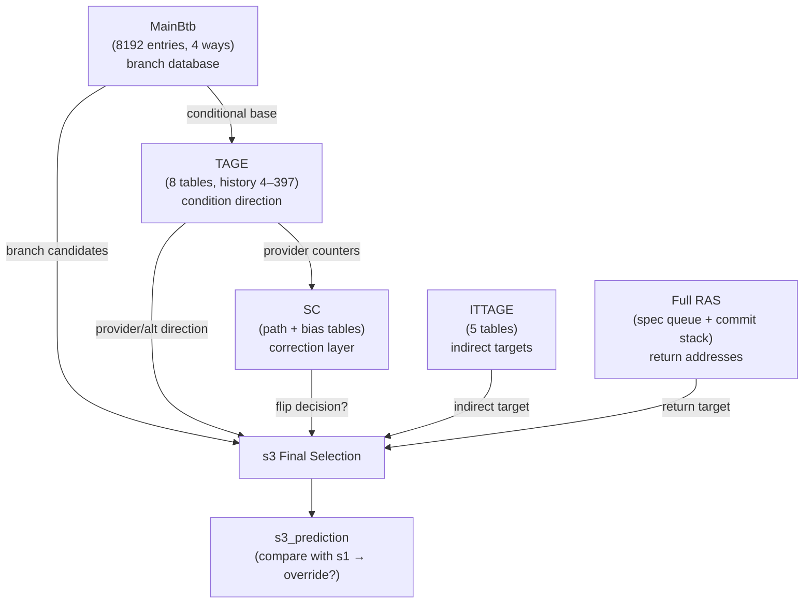
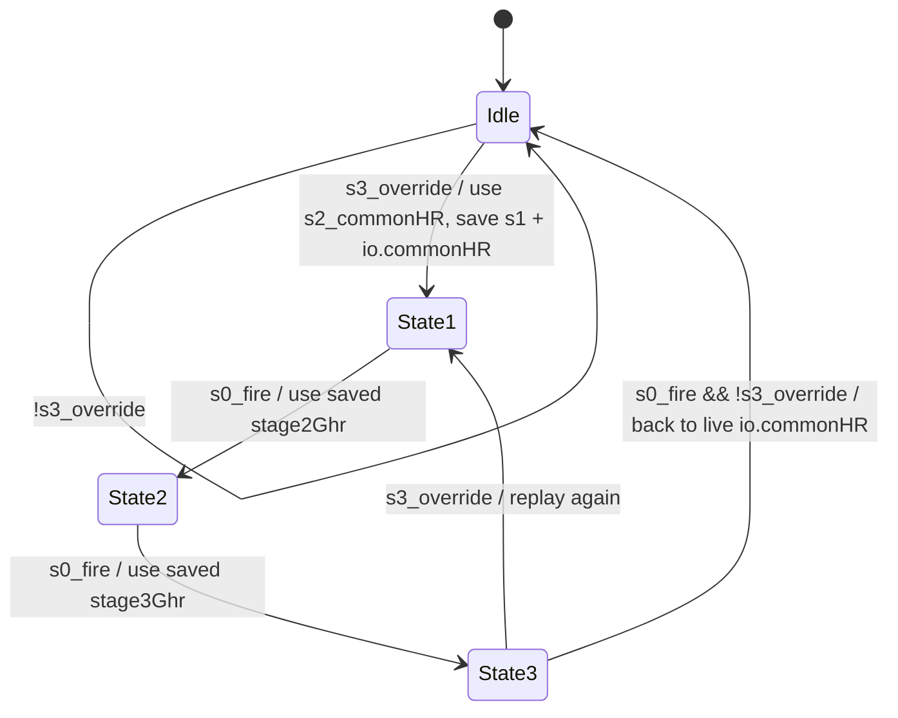

# Chapter 5c. Accurate Predictors: The s2/s3 Layer

This chapter covers the five predictors that form the accurate layer of Kunminghu's BPU: MainBtb,
TAGE, Statistical Corrector (SC), ITTAGE, and the full RAS. These structures trade latency for
accuracy — they require 2–3 pipeline cycles to produce results, but their predictions are
substantially better than the s1 fast layer. When the accurate layer disagrees with the fast layer,
the s3 override mechanism (described in Chapter 5a) corrects the prediction at a cost of ~2
wasted cycles rather than the 10–15+ cycles of a full backend misprediction.

The s2/s3 selection logic is at
[Bpu.scala:319–375](../../src/main/scala/xiangshan/frontend/bpu/Bpu.scala#L319).

### Block Diagram: s2/s3 Predictor Ensemble



### ASCII Mental Model

```text
  s0: read requests          s2: results arrive           s3: final selection

  MainBtb ─── (SRAM read) ──── branch entries ──────────┐
                                    │                     │
  TAGE ──── (table reads) ──── provider/alt direction ──┤──> final conditional taken mask
                                    │                     │
  SC ────── (table reads) ──── correction signal? ───────┤
                                                          │
  ITTAGE ── (table reads) ──── indirect target ──────────┤──> final target
                                                          │
  RAS ─────────────────────── return address ─────────────┤
                                                          │
                                          ┌───────────────┘
                                          ▼
                                    s3_prediction
                                    (target, taken, attribute)
                                          │
                                    compare with s1_prediction
                                          │
                                    if different → s3_override
```

---

## 5c.1 MainBtb: The Comprehensive Branch Database

### 5c.1.1 Role as the FTB-Equivalent

A note on naming: this codebase uses `MainBtb` rather than a class named `FTB`. Functionally,
MainBtb is the **Fetch Target Buffer-like** structure: it records multiple branch entries per
fetch block, each with position, type, and target. It is the authoritative source of branch
metadata for the s2/s3 layer.

Implementation: [MainBtb.scala:48](../../src/main/scala/xiangshan/frontend/bpu/mbtb/MainBtb.scala#L48)

### 5c.1.2 Structure

MainBtb organizes 8192 entries in a hierarchical two-level banked design:

```text
  MainBtb (8192 entries, 4-way set-associative)
  ├── AlignBank 0
  │   ├── InternalBank 0: SRAM (entry) + SRAM (counters)
  │   ├── InternalBank 1: SRAM (entry) + SRAM (counters)
  │   ├── InternalBank 2: SRAM (entry) + SRAM (counters)
  │   └── InternalBank 3: SRAM (entry) + SRAM (counters)
  └── AlignBank 1
      ├── InternalBank 0: ...
      ├── InternalBank 1: ...
      ├── InternalBank 2: ...
      └── InternalBank 3: ...
```

- **Align banks** (2): Handle the fetch block alignment restriction. The BTB can provide
  predictions across alignment boundaries by reading from the appropriate align bank.
  [MainBtbAlignBank.scala:90](../../src/main/scala/xiangshan/frontend/bpu/mbtb/MainBtbAlignBank.scala#L90)

- **Internal banks** (4 per align bank): Resolve read-write conflicts and reduce SRAM power.
  Each internal bank is a separate physical SRAM.
  [MainBtbInternalBank.scala:107](../../src/main/scala/xiangshan/frontend/bpu/mbtb/MainBtbInternalBank.scala#L107)

- **Split SRAM design**: Entry data (tag, attribute, position, target) and taken counters are
  stored in separate SRAMs. This improves power efficiency because counter updates (frequent,
  small writes) do not disturb the entry SRAM.

### 5c.1.3 Entry Format

Each MainBtb entry records one branch within a fetch block:

| Field | Width | Purpose |
| --- | --- | --- |
| `tag` | 16 bits | PC-derived tag for set-associative lookup |
| `attribute` | 8 bits | Branch type and RAS action |
| `position` | varies | Position within the fetch block (aligned) |
| `target` | 20 bits | Lower bits of the branch target |
| `targetCarry` | 1 bit | Carry bit for cross-boundary target addresses |

Entry format: [Bundles.scala:35](../../src/main/scala/xiangshan/frontend/bpu/mbtb/Bundles.scala#L35)

### 5c.1.4 Prediction Path

1. **s0**: Read request sent to all align banks and internal banks.
2. **s2**: Read results arrive. Tag comparison selects matching ways. The output is a vector of
   valid branch entries for the requested fetch block.
   [MainBtb.scala:32](../../src/main/scala/xiangshan/frontend/bpu/mbtb/MainBtb.scala#L32)

The result vector feeds into TAGE and SC for direction refinement, and into the s3 final
selection for target generation.

### 5c.1.5 Multi-Hit Detection

When the same branch appears in multiple ways (due to allocation races), the MainBtb detects
the multi-hit condition and flushes one of the duplicates
[MainBtbAlignBank.scala:275](../../src/main/scala/xiangshan/frontend/bpu/mbtb/MainBtbAlignBank.scala#L275),
[Helpers.scala:71](../../src/main/scala/xiangshan/frontend/bpu/mbtb/Helpers.scala#L71).

### 5c.1.6 Update Policy

On a mispredict, the MainBtb updates or allocates entries:
- If the branch already has an entry: update the taken counter and target if changed.
- If the branch is new: allocate a new entry, potentially evicting an existing one via LRU.
- Attribute fixes (e.g., `needIttage` flag corrections) are applied during updates.

[MainBtbAlignBank.scala:213](../../src/main/scala/xiangshan/frontend/bpu/mbtb/MainBtbAlignBank.scala#L213)

### 5c.1.7 MainBtb Parameters

| Parameter | Default | Purpose | Anchor |
| --- | --- | --- | --- |
| [`NumEntries`](../../src/main/scala/xiangshan/frontend/bpu/mbtb/Parameters.scala#L23) | 8192 | Total entries |
| [`NumWay`](../../src/main/scala/xiangshan/frontend/bpu/mbtb/Parameters.scala#L24) | 4 | Associativity |
| [`NumInternalBanks`](../../src/main/scala/xiangshan/frontend/bpu/mbtb/Parameters.scala#L27) | 4 | Internal banks per align bank |
| [`NumAlignBanks`](../../src/main/scala/xiangshan/frontend/bpu/mbtb/Parameters.scala#L31) | 2 | Alignment banks |
| [`TagWidth`](../../src/main/scala/xiangshan/frontend/bpu/mbtb/Parameters.scala#L32) | 16 | Tag bits |
| [`TargetWidth`](../../src/main/scala/xiangshan/frontend/bpu/mbtb/Parameters.scala#L33) | 20 | Target lower bits (2B-aligned) |
| [`TakenCntWidth`](../../src/main/scala/xiangshan/frontend/bpu/mbtb/Parameters.scala#L37) | 2 | Taken counter width |

---

## 5c.2 TAGE: The Conditional Direction Backbone

### 5c.2.1 TAGE in Kunminghu

Chapter 5 introduced TAGE as a concept: multiple tagged tables with geometrically increasing
history lengths. Kunminghu implements this with **8 tables**:

| Table | Size | Ways | History length |
| --- | --- | --- | --- |
| T0 | 4096 | 2 | 4 |
| T1 | 4096 | 2 | 9 |
| T2 | 4096 | 2 | 17 |
| T3 | 4096 | 2 | 29 |
| T4 | 4096 | 2 | 56 |
| T5 | 4096 | 2 | 109 |
| T6 | 4096 | 2 | 211 |
| T7 | 4096 | 2 | 397 |

Parameters: [Parameters.scala:23](../../src/main/scala/xiangshan/frontend/bpu/tage/Parameters.scala#L23)

The geometric progression from 4 to 397 means the TAGE can capture correlations ranging from
very recent branches (4 deep) to patterns spanning hundreds of branches (397 deep). Each table
has 4096 entries split into 2 ways, with 4 internal banks to reduce read-write conflicts.

Implementation: [Tage.scala:38](../../src/main/scala/xiangshan/frontend/bpu/tage/Tage.scala#L38)

### 5c.2.2 Prediction Path

1. **s0**: All 8 tables are read in parallel using index and tag computed from (PC, folded
   history). History comes from the PHR module.
2. **s2**: Tag comparison identifies which tables have matching entries
   [Tage.scala:123](../../src/main/scala/xiangshan/frontend/bpu/tage/Tage.scala#L123).
3. The **provider** is the matching entry from the table with the **longest history** — it has the
   most context about the current control flow
   [Tage.scala:137](../../src/main/scala/xiangshan/frontend/bpu/tage/Tage.scala#L137).
4. The **alternate** is the matching entry from the **second-longest history** table
   [Tage.scala:143](../../src/main/scala/xiangshan/frontend/bpu/tage/Tage.scala#L143).

### 5c.2.3 The useAltOnNa Mechanism

When the provider's taken counter is "weak" (close to the decision threshold), the prediction
may be unreliable. TAGE uses a `useAltOnNa` counter array that learns when to prefer the
alternate prediction over a weak provider
[Tage.scala:149](../../src/main/scala/xiangshan/frontend/bpu/tage/Tage.scala#L149).

The decision logic is:

```text
  if SC is confident enough → use SC's decision
  else if provider exists and useProvider → use provider direction
  else if alternate exists → use alternate direction
  else → use MainBtb's base taken counter
```

This is visible in the s2 conditional taken mask construction
[Bpu.scala:327–338](../../src/main/scala/xiangshan/frontend/bpu/Bpu.scala#L327).

### 5c.2.4 Training Path

TAGE training is triggered by resolve-train from FTQ. The training logic:

1. **Meta reuse**: When safe, the predictor reuses metadata captured at prediction time to avoid
   an extra SRAM read
   [Tage.scala:202](../../src/main/scala/xiangshan/frontend/bpu/tage/Tage.scala#L202).
2. **Provider/alt counter update**: Increment toward the actual direction; decrement away from it
   [Tage.scala:388](../../src/main/scala/xiangshan/frontend/bpu/tage/Tage.scala#L388).
3. **Allocation on mispredict**: If the prediction was wrong, attempt to allocate an entry in a
   longer-history table, which might capture the pattern better
   [Tage.scala:456](../../src/main/scala/xiangshan/frontend/bpu/tage/Tage.scala#L456).
4. **Useful counter management**: The useful counter protects entries from eviction. It is
   incremented when the provider is correct and the alternate is wrong, and periodically reset
   to allow fresh allocations
   [Tage.scala:547](../../src/main/scala/xiangshan/frontend/bpu/tage/Tage.scala#L547).

### 5c.2.5 TAGE Parameters

| Parameter | Default | Purpose | Anchor |
| --- | --- | --- | --- |
| [`TableInfos`](../../src/main/scala/xiangshan/frontend/bpu/tage/Parameters.scala#L24) | 8 tables (4096×2, hist 4–397) | Table configurations |
| [`NumBanks`](../../src/main/scala/xiangshan/frontend/bpu/tage/Parameters.scala#L35) | 4 | Banks per table |
| [`TagWidth`](../../src/main/scala/xiangshan/frontend/bpu/tage/Parameters.scala#L36) | 13 | Tag bits |
| [`TakenCtrWidth`](../../src/main/scala/xiangshan/frontend/bpu/tage/Parameters.scala#L37) | 3 | Taken counter bits |
| [`UsefulCtrWidth`](../../src/main/scala/xiangshan/frontend/bpu/tage/Parameters.scala#L38) | 2 | Useful counter bits |
| [`NumUseAltOnNa`](../../src/main/scala/xiangshan/frontend/bpu/tage/Parameters.scala#L43) | 128 | useAltOnNa counter array size |

---

## 5c.3 SC (Statistical Corrector): Fixing TAGE's Hard Cases

### 5c.3.1 What SC Does

Even a high-accuracy TAGE predictor has borderline cases where the provider counter hovers
near the decision threshold. The SC combines multiple weak statistical signals to form a
**correction opinion**. If the SC's combined confidence exceeds a threshold, it can **flip**
TAGE's decision.

Implementation: [Sc.scala:41](../../src/main/scala/xiangshan/frontend/bpu/sc/Sc.scala#L41)

### 5c.3.2 Table Types

The SC maintains several table types, each capturing different statistical features:

| Table type | Default config | Indexed by | Enabled |
| --- | --- | --- | --- |
| **Path** | 2 tables (128×8, 128×16) | Folded path history | Yes |
| **Bias** | 1 table (128 entries) | PC + TAGE taken bit | Yes |
| **Global** | 2 tables (128×8, 128×16) | Global history (GHR) | No (configurable) |
| **Backward** | 2 tables (128×4, 128×8) | Backward-taken history | No (configurable) |

Parameters: [Parameters.scala:22](../../src/main/scala/xiangshan/frontend/bpu/sc/Parameters.scala#L22)

### 5c.3.3 Prediction Path

1. **s0**: All SC tables are read in parallel, indexed by their respective history features.
   [Sc.scala:153](../../src/main/scala/xiangshan/frontend/bpu/sc/Sc.scala#L153)
2. **s2/s3**: Counter values from all tables are summed in a perceptron-like fashion. The TAGE
   provider counter is included in the sum as a centering term.
   [Sc.scala:301](../../src/main/scala/xiangshan/frontend/bpu/sc/Sc.scala#L301)
3. The total sum is compared against a **threshold**. If the sum is strong enough in one direction
   and disagrees with TAGE, SC overrides TAGE's decision.
   [Sc.scala:313](../../src/main/scala/xiangshan/frontend/bpu/sc/Sc.scala#L313)

The output is:
- `scTakenMask`: the corrected taken decision per branch slot
  [Sc.scala:342](../../src/main/scala/xiangshan/frontend/bpu/sc/Sc.scala#L342)
- `scUsed`: whether SC's correction was applied

### 5c.3.4 Adaptive Threshold

The SC threshold is not fixed — it adapts over time:
[Sc.scala:446](../../src/main/scala/xiangshan/frontend/bpu/sc/Sc.scala#L446).
If SC frequently corrects incorrectly (flipping TAGE from right to wrong), the threshold increases,
making SC more conservative. If SC corrections are frequently helpful, the threshold decreases,
making SC more aggressive. The initial threshold is 720
[Parameters.scala:43](../../src/main/scala/xiangshan/frontend/bpu/sc/Parameters.scala#L43).

### 5c.3.5 The GHR Override FSM

SC uses the CommonHR (global history register) for some of its table indexing. When an s3 override
occurs, the history consumed by SC's s0 read may be stale. To handle this, SC contains an explicit
**state machine** that replays correct history snapshots for the cycles following an override.



Implementation: [Sc.scala:106](../../src/main/scala/xiangshan/frontend/bpu/sc/Sc.scala#L106)

This FSM prevents history desynchronization when a late override invalidates earlier speculative
history consumption.

### 5c.3.6 SC Parameters

| Parameter | Default | Purpose | Anchor |
| --- | --- | --- | --- |
| [`PathTableInfos`](../../src/main/scala/xiangshan/frontend/bpu/sc/Parameters.scala#L23) | (128,8), (128,16) | Path history tables |
| [`BiasTableSize`](../../src/main/scala/xiangshan/frontend/bpu/sc/Parameters.scala#L35) | 128 | Bias table entries |
| [`CtrWidth`](../../src/main/scala/xiangshan/frontend/bpu/sc/Parameters.scala#L41) | 6 | Counter bits (signed) |
| [`ThresholdInit`](../../src/main/scala/xiangshan/frontend/bpu/sc/Parameters.scala#L43) | 720 | Initial correction threshold |

---

## 5c.4 ITTAGE: Predicting Indirect Branch Targets

### 5c.4.1 The Indirect Branch Problem

Indirect branches (`jalr` where the target depends on a register value) pose a unique challenge:
the target can change on every execution. A BTB that stores only the last target will mispredict
whenever the target alternates (common in virtual dispatch and switch statements).

ITTAGE applies the same geometric-history-length idea as TAGE, but stores **target addresses**
instead of direction counters.

Implementation: [Ittage.scala:47](../../src/main/scala/xiangshan/frontend/bpu/ittage/Ittage.scala#L47)

### 5c.4.2 Structure

Kunminghu's ITTAGE uses **5 tables** with increasing history lengths:

| Table | Entries | History length |
| --- | --- | --- |
| T0 | 256 | 4 |
| T1 | 256 | 8 |
| T2 | 512 | 13 |
| T3 | 512 | 16 |
| T4 | 512 | 32 |

Parameters: [Parameters.scala:22](../../src/main/scala/xiangshan/frontend/bpu/ittage/Parameters.scala#L22)

Each entry stores a tag, a confidence counter (2-bit), a useful counter (1-bit), and a target
offset (20 bits).

### 5c.4.3 RegionWays: Target Compression

Full virtual addresses are wide (typically 39+ bits in RISC-V). Storing full targets in every
ITTAGE entry would be expensive. Kunminghu uses **RegionWays** — a small lookup table that maps
the upper bits of targets (the "region") to a compact index
[RegionWays.scala:25](../../src/main/scala/xiangshan/frontend/bpu/ittage/RegionWays.scala#L25).

The ITTAGE entry stores only the lower 20 bits of the target. The upper bits are reconstructed
by looking up the region index in the RegionWays table. This saves significant storage with
minimal accuracy loss, because most indirect branches target addresses within a small number
of code regions.

### 5c.4.4 Prediction Path

1. **s0–s1**: Tables are read using (PC, folded history) as index and tag.
2. **s2–s3**: Provider and alternate are selected (longest-history match and second-longest)
   [Ittage.scala:217](../../src/main/scala/xiangshan/frontend/bpu/ittage/Ittage.scala#L217).
3. The final hit/target is available in s3
   [Ittage.scala:264](../../src/main/scala/xiangshan/frontend/bpu/ittage/Ittage.scala#L264).

ITTAGE is only consulted when the MainBtb branch attribute has `needIttage=true` — meaning the
branch is indirect and not a return (returns use the RAS instead)
[Bpu.scala:356](../../src/main/scala/xiangshan/frontend/bpu/Bpu.scala#L356).

### 5c.4.5 Training Path

- Update provider confidence and useful counters on resolve
  [Ittage.scala:333](../../src/main/scala/xiangshan/frontend/bpu/ittage/Ittage.scala#L333)
- Allocate in a longer-history table on mispredict
  [Ittage.scala:378](../../src/main/scala/xiangshan/frontend/bpu/ittage/Ittage.scala#L378)
- Per-table write buffers handle SRAM write conflicts
  [IttageTable.scala:200](../../src/main/scala/xiangshan/frontend/bpu/ittage/IttageTable.scala#L200)
- Periodic useful reset allows fresh allocations
  [IttageTable.scala:181](../../src/main/scala/xiangshan/frontend/bpu/ittage/IttageTable.scala#L181)

### 5c.4.6 ITTAGE Parameters

| Parameter | Default | Purpose | Anchor |
| --- | --- | --- | --- |
| [`TableInfos`](../../src/main/scala/xiangshan/frontend/bpu/ittage/Parameters.scala#L23) | 5 tables (256–512, hist 4–32) | Table configurations |
| [`NumBanks`](../../src/main/scala/xiangshan/frontend/bpu/ittage/Parameters.scala#L30) | 2 | Banks per table |
| [`TagWidth`](../../src/main/scala/xiangshan/frontend/bpu/ittage/Parameters.scala#L31) | 9 | Tag bits |
| [`TargetWidth`](../../src/main/scala/xiangshan/frontend/bpu/ittage/Parameters.scala#L35) | 20 | Target offset bits |
| [`RegionNums`](../../src/main/scala/xiangshan/frontend/bpu/ittage/Parameters.scala#L41) | 16 | Region table entries |

---

## 5c.5 Full RAS: Return Address Stack

### 5c.5.1 Design Architecture

The full RAS uses a dual-structure design to handle speculation correctly:

```text
  ┌────────────────────────────────────────────┐
  │              Full RAS                       │
  │                                            │
  │  ┌──────────────────┐  ┌────────────────┐  │
  │  │ Speculative Queue │  │ Committed Stack │  │
  │  │ (32 entries)      │  │ (16 entries)    │  │
  │  │                   │  │                 │  │
  │  │ push/pop on s3    │  │ push/pop on     │  │
  │  │ prediction        │  │ commit          │  │
  │  └──────────────────┘  └────────────────┘  │
  │                                            │
  │  redirect → repair speculative from meta   │
  │  commit → consolidate into committed stack │
  └────────────────────────────────────────────┘
```

Implementation: [Ras.scala:44](../../src/main/scala/xiangshan/frontend/bpu/ras/Ras.scala#L44),
[RasStack.scala:67](../../src/main/scala/xiangshan/frontend/bpu/ras/RasStack.scala#L67)

### 5c.5.2 Why Two Structures

The speculative queue tracks pushes and pops that occur during prediction (s3 stage). These
operations are speculative — if a redirect occurs, some of them must be undone. The committed
stack only updates when instructions retire, providing a stable fallback.

On redirect, the speculative queue is repaired using metadata saved at prediction time
[Ras.scala:93](../../src/main/scala/xiangshan/frontend/bpu/ras/Ras.scala#L93),
[RasStack.scala:387](../../src/main/scala/xiangshan/frontend/bpu/ras/RasStack.scala#L387).

On commit, operations are consolidated from the speculative queue into the committed stack
[RasStack.scala:333](../../src/main/scala/xiangshan/frontend/bpu/ras/RasStack.scala#L333).

### 5c.5.3 Stack Counter Compression

When the same function is called repeatedly (e.g., recursive calls or tight call loops),
the RAS would push the same return address multiple times. Instead of consuming multiple stack
entries, the RAS uses a **counter** (3 bits wide, max 7) to merge consecutive identical pushes
into a single entry. This effectively multiplies the stack depth for recursive patterns.

### 5c.5.4 Coordination with microRAS

The full RAS provides `topRetAddr` to the microRAS
[Ras.scala:48](../../src/main/scala/xiangshan/frontend/bpu/ras/Ras.scala#L48), which the
microRAS uses as its fallback when no pending push/pop modifies the expected return address
(see Chapter 5b, Section 5b.5).

### 5c.5.5 RAS Parameters

| Parameter | Default | Purpose | Anchor |
| --- | --- | --- | --- |
| [`CommitStackSize`](../../src/main/scala/xiangshan/frontend/bpu/ras/Parameters.scala#L22) | 16 | Committed (architectural) stack depth |
| [`SpecQueueSize`](../../src/main/scala/xiangshan/frontend/bpu/ras/Parameters.scala#L23) | 32 | Speculative queue depth |
| [`StackCounterWidth`](../../src/main/scala/xiangshan/frontend/bpu/ras/Parameters.scala#L24) | 3 | Counter width for recursive call merging |

---

## 5c.6 s3 Final Selection: Assembling the Prediction

After all accurate-layer predictors produce their results, the s3 stage assembles the final
prediction. The logic is at
[Bpu.scala:349–375](../../src/main/scala/xiangshan/frontend/bpu/Bpu.scala#L349).

### 5c.6.1 Conditional Taken Mask

The conditional taken mask combines MainBtb entries, TAGE direction, and SC correction:

```text
  For each conditional branch in MainBtb results:
    if SC is used → use SC's taken decision
    else if TAGE provider exists → use TAGE provider direction
    else if TAGE alternate exists → use TAGE alternate direction
    else → use MainBtb's base taken counter
```

[Bpu.scala:327–338](../../src/main/scala/xiangshan/frontend/bpu/Bpu.scala#L327)

### 5c.6.2 Jump Mask

Direct and indirect jumps from MainBtb are always taken (they unconditionally redirect control
flow):

```text
  s2_jumpMask = for each MainBtb result: is it a direct or indirect branch?
```

[Bpu.scala:340–342](../../src/main/scala/xiangshan/frontend/bpu/Bpu.scala#L340)

### 5c.6.3 Combined Taken Mask

The final taken mask is the union of conditional taken and jump masks. The earliest taken branch
(by position) is selected via CompareMatrix, just as in s1.

### 5c.6.4 Target Source Priority

The s3 target is selected by priority
[Bpu.scala:367–375](../../src/main/scala/xiangshan/frontend/bpu/Bpu.scala#L367):

| Priority | Condition | Target source |
| --- | --- | --- |
| 1 (highest) | Taken branch is a return | Full RAS top (`ras.io.topRetAddr`) |
| 2 | Taken branch needs ITTAGE and ITTAGE hit | ITTAGE target (`ittage.io.prediction.target`) |
| 3 | Any other taken branch | MainBtb target (`s3_firstTakenBranch.bits.target`) |
| 4 (lowest) | No taken branch | Fall-through (`s3_fallThroughPrediction.target`) |

### 5c.6.5 Override Detection

The final s3 prediction is compared with the s1 prediction that was saved 2 cycles earlier:

```text
  s3_override = s3_valid && (s3_prediction ≠ s3_s1Prediction)
```

[Bpu.scala:380](../../src/main/scala/xiangshan/frontend/bpu/Bpu.scala#L380)

If any field differs — taken, target, cfiPosition, or attribute — the override fires.

---

## 5c.7 Worked Example: Conditional Branch Through TAGE + SC

Consider a conditional branch at PC `0x8000_4000` with the following predictor states:

1. **MainBtb**: Hit. Entry has `attribute = Conditional`, `target = 0x8000_5000`, taken counter = WT.
2. **TAGE**: Table T5 (history=109) is the provider, with counter = 5 (out of 7, weakly taken).
   Table T3 (history=29) is the alternate, with counter = 2 (not taken).
3. **SC**: Path tables and bias table are read. The combined weighted sum is −12. The threshold is
   720 (much larger). SC does not have enough confidence to flip.

**Decision flow:**

```text
  SC confidence < threshold → scUsed = false
  TAGE provider exists and useProvider → use provider direction = taken (counter 5 > 3)
  Final: conditional taken = true
  Target: MainBtb's 0x8000_5000
```

Now suppose the same branch with a different history context:

- **TAGE** provider T5 counter = 4 (right at the boundary, weakly taken).
- **SC** combined sum = +780 (strongly disagrees, wants not-taken). 780 > 720 → SC fires.

```text
  SC confidence ≥ threshold → scUsed = true, scTaken = false
  Final: conditional taken = false
  No branch taken → target = fall-through address
```

SC has flipped TAGE's decision. If the branch is indeed not-taken, this is a valuable correction.
If SC was wrong, the adaptive threshold will increase, making SC less aggressive in the future.

---

## 5c.8 Design Trade-Off: TAGE + SC vs. Perceptron-Based Predictors

An alternative to TAGE + SC is a **perceptron-based predictor** (Jimenez, 2001), which uses a
single neural-network-inspired structure:

| Property | TAGE + SC | Perceptron |
| --- | --- | --- |
| **Structure** | Multiple tagged tables with geometric history | Weight vector per branch, dot product with history |
| **Accuracy** | Very high, especially with SC correction | High, but can be slower to converge |
| **Latency** | Table lookup + tag compare (pipelineable) | Dot product computation (harder to pipeline) |
| **Training** | Counter increment/decrement (simple) | Weight update (multiplication involved) |
| **Storage** | Efficient tag-based deduplication | One weight vector per entry |

TAGE + SC is the dominant approach in championship branch prediction competitions and industry
designs. Its advantage is efficient use of storage (tagged entries avoid destructive aliasing) and
clean pipelinability. Perceptron predictors are used in some designs (AMD Zen family) and offer
different trade-offs, particularly in implementation technology and learning speed.

Kunminghu chose TAGE + SC, consistent with the proven championship approach.

---

## Key Takeaways

- MainBtb is the FTB-equivalent in Kunminghu: it provides the comprehensive branch entry database
  with multi-way storage, split entry/counter SRAMs, and hierarchical banking.
- TAGE provides history-sensitive conditional direction prediction using 8 tables with geometric
  history lengths from 4 to 397 bits, with provider/alternate selection and useAltOnNa logic.
- The Statistical Corrector can flip TAGE's decision when multiple weak signals collectively reach
  a confidence threshold, with an adaptive threshold to prevent overconfidence.
- ITTAGE handles indirect branch targets using the same geometric-history principle as TAGE but
  storing target offsets, with RegionWays for efficient target compression.
- The full RAS uses a speculative queue + committed stack architecture with metadata snapshots
  for redirect recovery and a counter mechanism for recursive call compression.
- The s3 final selection applies target priority (RAS > ITTAGE > MainBtb > fall-through) and
  compares the result with the s1 prediction to detect overrides.

## Checkpoint Questions

1. **Basic**: Why does MainBtb use separate SRAMs for entry data and taken counters?
2. **Basic**: In TAGE, what is the "provider" and what is the "alternate"? Which has priority
   by default?
3. **Intermediate**: Explain the useAltOnNa mechanism. Under what conditions would TAGE prefer
   the alternate prediction over the provider?
4. **Intermediate**: How does the SC adaptive threshold prevent SC from hurting accuracy? Describe
   the feedback loop.
5. **Intermediate**: Why does ITTAGE use RegionWays instead of storing full target addresses?
   What assumption about indirect branch targets makes this effective?
6. **Advanced**: Describe a branch pattern where TAGE alone would mispredict but TAGE + SC would
   get right. What properties of the pattern make SC effective?
7. **Advanced**: The RAS speculative queue has 32 entries. What happens when speculation depth
   exceeds 32 outstanding call/return predictions before any commit? How does the design degrade?

## Further Reading

1. Seznec, A. "A New Case for the TAGE Branch Predictor." MICRO 2011.
2. Seznec, A. "TAGE-SC-L Branch Predictors Again." CBP-5, 2016.
3. Seznec, A. "A 64-Kbytes ITTAGE Indirect Branch Predictor." JWAC 2011.
4. Jimenez, D. A. and Lin, C. "Dynamic Branch Prediction with Perceptrons." HPCA 2001.

---

See [Chapter 5d](05d-history-training-recovery.md) for global history management (PHR, CommonHR),
all three training lanes, and redirect recovery.
