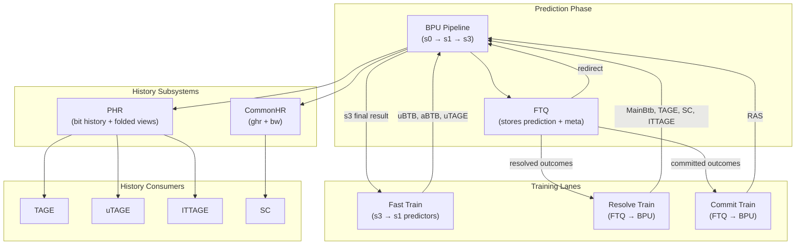
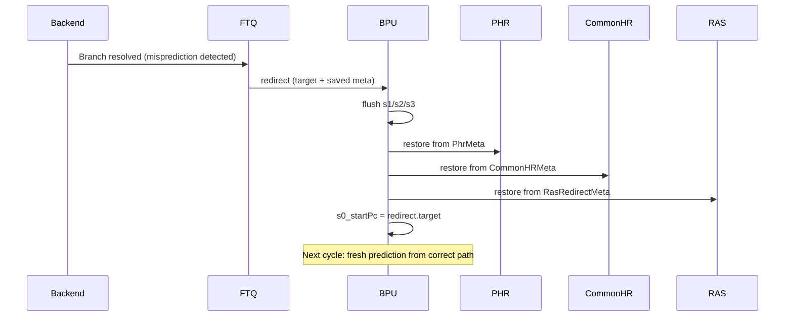
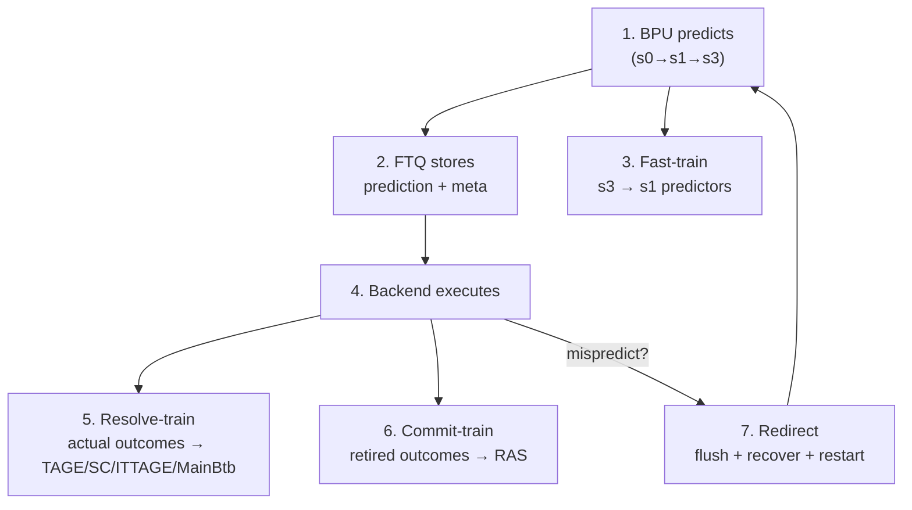

# Chapter 5d. History, Training, and Recovery

This chapter covers the systems that keep Kunminghu's BPU learning and consistent: global history
management (PHR, CommonHR), the three training lanes that feed branch outcomes back into predictor
tables, and the redirect recovery mechanisms that repair speculative state after mispredictions.
Together, these subsystems close the prediction–verification–correction loop introduced in
Chapter 5.

### Block Diagram: History Distribution and Training Data Flow



### ASCII Mental Model

```text
  Prediction ──────────> FTQ stores meta ──────────> Backend executes
       │                      │                           │
       │                      │                           │
       ▼                      │                           ▼
  PHR/CommonHR update         │                     Branch resolved
  (speculative)               │                           │
                              │                           │
                              │        ┌──────────────────┘
                              │        │
                              ▼        ▼
                         FTQ sends training data back to BPU:
                         ├── fast-train:   s3 result → s1 predictors (immediate)
                         ├── resolve-train: actual outcome → TAGE/SC/ITTAGE/MainBtb
                         └── commit-train:  retired outcome → RAS

  On misprediction:
      FTQ sends redirect → BPU flushes → PHR/CommonHR/RAS recover from saved meta
```

---

## 5d.1 Why History Management Is Hard

Branch history management in a speculative processor faces three fundamental challenges:

1. **Speculative updates**: History must advance on every *prediction* (not just committed
   outcomes), because TAGE/ITTAGE/SC need the history at prediction time to compute correct table
   indices. If history only updated at commit, it would be dozens of cycles stale.

2. **Recovery on redirect or override**: When the processor takes a wrong path, all history updates
   from the wrong path must be undone. This requires saving enough state at prediction time to
   reconstruct the correct history later.

3. **Multiple consumers with different needs**: TAGE, uTAGE, and ITTAGE all need folded-history
   views from PHR, while SC uses a different history format (CommonHR). The history must be
   available at different pipeline stages (s0, s1, s2, s3) with correct timing alignment.

Kunminghu addresses these with two dedicated history modules: PHR for the TAGE family and
CommonHR for SC.

---

## 5d.2 PHR (Path History Register)

### 5d.2.1 What PHR Stores

PHR maintains a bit-vector of recent branch outcomes plus path information (branch PC hashed into
the history). This captures both *which direction* branches took and *where in the program* they
occurred.

Implementation: [Phr.scala:28](../../src/main/scala/xiangshan/frontend/bpu/history/phr/Phr.scala#L28)

The raw history is stored as a circular buffer
[Phr.scala:42](../../src/main/scala/xiangshan/frontend/bpu/history/phr/Phr.scala#L42) with a
pointer (`phrPtr`) tracking the current position
[Phr.scala:43](../../src/main/scala/xiangshan/frontend/bpu/history/phr/Phr.scala#L43).

### 5d.2.2 Folded History Views

TAGE tables need history of different lengths (4, 9, 17, ..., 397 bits). Rather than extracting
variable-width slices on every lookup, PHR maintains **folded history views** — pre-computed
compressed representations for each needed width.

The folded views are maintained as registers that are updated incrementally (shift + XOR) rather
than recomputed from scratch each cycle. This is critical for timing: recomputing a fold of 397
bits every cycle would be impractical.

Per-stage folded views are exported
[Phr.scala:30–33](../../src/main/scala/xiangshan/frontend/bpu/history/phr/Phr.scala#L30):
`s0_foldedPhr`, `s1_foldedPhr`, `s2_foldedPhr`, `s3_foldedPhr`, plus `trainFoldedPhr` for the
training-time snapshot.

The folded representation type is defined in
[Bundles.scala:188](../../src/main/scala/xiangshan/frontend/bpu/history/phr/Bundles.scala#L188).

### 5d.2.3 Update Priority

PHR can receive update events from three sources. They are arbitrated by priority
[Phr.scala:116](../../src/main/scala/xiangshan/frontend/bpu/history/phr/Phr.scala#L116):

| Priority | Source | When | Effect |
| --- | --- | --- | --- |
| 1 (highest) | **Redirect** | Backend redirect arrives | Restore PHR from saved `PhrMeta` in redirect metadata |
| 2 | **s3 override** | s3 disagrees with s1 | Roll back to s3's snapshot and re-apply s3's branch |
| 3 (lowest) | **s1 prediction** | Normal prediction flow | Advance PHR with s1's branch outcome |

This priority order ensures that the most authoritative control-flow event always wins. A redirect
from the backend takes absolute priority because it carries verified execution results. An s3
override is more authoritative than s1 because it comes from the accurate predictor layer.

### 5d.2.4 Metadata for Recovery

When a prediction is made, PHR saves a snapshot (`PhrMeta`) containing the pointer value and
low-order hash bits
[Phr.scala:35](../../src/main/scala/xiangshan/frontend/bpu/history/phr/Phr.scala#L35). This
metadata travels through FTQ as part of `BpuRedirectMeta` and is used to reconstruct the
PHR state when a redirect occurs.

### 5d.2.5 PHR Parameters

| Parameter | Default | Purpose | Anchor |
| --- | --- | --- | --- |
| [`Shamt`](../../src/main/scala/xiangshan/frontend/bpu/history/phr/Parameters.scala#L21) | 2 | Shift amount per update |
| [`EnableTwoTaken`](../../src/main/scala/xiangshan/frontend/bpu/history/phr/Parameters.scala#L22) | false | Support two taken branches per block |
| [`PathHashWidth`](../../src/main/scala/xiangshan/frontend/bpu/history/phr/Parameters.scala#L23) | 15 | Width of path hash mixed into history |
| [`HistoryAlign`](../../src/main/scala/xiangshan/frontend/bpu/history/phr/Parameters.scala#L26) | 4 | History length alignment for readability |

---

## 5d.3 CommonHR (Common History Register)

### 5d.3.1 Two Histories for SC

CommonHR maintains two separate histories
[Bundles.scala:28](../../src/main/scala/xiangshan/frontend/bpu/history/commonhr/Bundles.scala#L28):

| History | Name | What it tracks |
| --- | --- | --- |
| **ghr** | Global History Register | Generic conditional branch outcomes (taken/not-taken) |
| **bw** | Backward-Taken History | Whether the taken branch was a backward branch (loop detection) |

These are separate from PHR because SC requires a different history format — it needs raw
global/backward signals rather than folded path-hash views.

Implementation: [CommonHR.scala:26](../../src/main/scala/xiangshan/frontend/bpu/history/commonhr/CommonHR.scala#L26)

### 5d.3.2 Update Mechanism

CommonHR is updated from the s3 prediction result. The update equation (`getNewHR`)
[Helpers.scala:25](../../src/main/scala/xiangshan/frontend/bpu/history/commonhr/Helpers.scala#L25)
accounts for:

- The number of conditional branch hits before the first taken branch (shifts the history)
- Whether the taken branch is conditional (adds a taken/not-taken bit to GHR)
- Whether the branch is backward-taken (adds a bit to BW history)

The s3 update:
[CommonHR.scala:74](../../src/main/scala/xiangshan/frontend/bpu/history/commonhr/CommonHR.scala#L74)

### 5d.3.3 Stall Queue

A subtle timing issue: CommonHR is updated on `s3_fire`, but SC reads history at `s0`. If `s0`
cannot fire (pipeline stall), the history update from s3 could be lost. CommonHR uses a small
stall queue (default size 2) to buffer pending history updates
[CommonHR.scala:119](../../src/main/scala/xiangshan/frontend/bpu/history/commonhr/CommonHR.scala#L119).

When s0 fires, it dequeues the buffered history entry. On redirect, the buffer is flushed.

### 5d.3.4 Redirect Recovery

On redirect, CommonHR restores from the saved `CommonHRMeta` in the redirect payload
[CommonHR.scala:107](../../src/main/scala/xiangshan/frontend/bpu/history/commonhr/CommonHR.scala#L107).
The recovery applies the redirect branch's outcome to the saved history, producing the correct
post-redirect history state.

### 5d.3.5 CommonHR Parameters

| Parameter | Default | Purpose | Anchor |
| --- | --- | --- | --- |
| [`StallQueueSize`](../../src/main/scala/xiangshan/frontend/bpu/history/commonhr/Parameters.scala#L21) | 2 | Stall queue depth |

---

## 5d.4 Training Lane 1: Fast Training (s3 → s1 Predictors)

### 5d.4.1 Purpose

Fast training provides the quickest possible feedback to s1 predictors. When s3 produces a final
prediction (whether or not it overrides s1), that prediction is immediately forwarded to the
s1 predictors as training data. This allows uBTB, aBTB, and uTAGE to correct their entries within
a few cycles of a wrong s1 prediction, without waiting for the branch to actually execute in the
backend.

### 5d.4.2 Signal Path

The fast-train signal is assembled at
[Bpu.scala:182–188](../../src/main/scala/xiangshan/frontend/bpu/Bpu.scala#L182):

```text
  fastTrain.valid            = s3_valid
  fastTrain.bits.startPc     = s3_startPc
  fastTrain.bits.finalPrediction = s3_prediction
  fastTrain.bits.abtbMeta    = s3_abtbMeta
  fastTrain.bits.utageMeta   = s3_utageMeta
  fastTrain.bits.hasOverride = s3_override
```

It is wired to all predictors via the `HasFastTrainIO` trait
[Bpu.scala:195](../../src/main/scala/xiangshan/frontend/bpu/Bpu.scala#L195). Only predictors that
implement `HasFastTrainIO` consume it (uBTB, aBTB, uTAGE).

### 5d.4.3 What Fast-Train Carries

| Field | Purpose |
| --- | --- |
| `startPc` | The PC this prediction was for |
| `finalPrediction` | The s3 final prediction (direction, target, attribute) — treated as "truth" |
| `abtbMeta` | aBTB-specific metadata for targeted update |
| `utageMeta` | uTAGE-specific metadata |
| `hasOverride` | Whether s3 overrode s1 — indicates the s1 prediction was wrong |

### 5d.4.4 Advantage

Fast-train latency is approximately 3 cycles (s3 produces result → next s0_fire applies the
training → updated entry available in next s1). This is much faster than resolve-train (which
waits for backend execution, typically 10+ cycles) and commit-train (which waits for retirement,
typically 20+ cycles).

The trade-off: fast-train uses the s3 prediction as "truth," which is usually correct but can
itself be wrong. Resolve-train provides actual execution outcomes. For s1 predictors, fast-train
accuracy is sufficient because the s3 layer corrects s1 errors most of the time.

---

## 5d.5 Training Lane 2: Resolve Training (FTQ → BPU)

### 5d.5.1 Purpose

Resolve training feeds actual branch outcomes from the backend into the BPU's accurate-layer
predictors. When the backend resolves a branch (determines whether it was taken or not-taken and
what the actual target was), FTQ packages this information and sends it to BPU.

### 5d.5.2 Signal Path

FTQ sends resolve-train via `io.fromFtq.train`
[Bundles.scala:65](../../src/main/scala/xiangshan/frontend/Bundles.scala#L65) as a
`Decoupled[BpuTrain]`. The BPU top processes it at
[Bpu.scala:167–180](../../src/main/scala/xiangshan/frontend/bpu/Bpu.scala#L167).

A critical detail: **first-mispredict masking**. When a fetch block contains multiple branches,
branches after the first mispredicted one are on the wrong path and should not be used for
training. The BPU computes this mask using `CompareMatrix`
[Bpu.scala:167–174](../../src/main/scala/xiangshan/frontend/bpu/Bpu.scala#L167) and applies it
to invalidate branches after the first mispredict
[Bpu.scala:178–180](../../src/main/scala/xiangshan/frontend/bpu/Bpu.scala#L178).

### 5d.5.3 What Resolve-Train Carries

The `BpuTrain` payload includes:
- `startPc`: The start PC of the prediction block
- `branches`: A vector of branch outcomes, each with:
  - Actual taken/not-taken, actual target, actual attribute
  - Whether this branch was mispredicted
- Metadata (`resolveMeta`) saved at prediction time, carrying predictor-specific state needed for
  the update

### 5d.5.4 Consumers

| Predictor | What it updates |
| --- | --- |
| **MainBtb** | Allocate/update entries, fix targets and attributes |
| **TAGE** | Update provider/alt counters, allocate entries, manage useful counters |
| **SC** | Update table counters, adjust adaptive threshold |
| **ITTAGE** | Update provider confidence/useful, allocate on target mispredict |

### 5d.5.5 Backpressure

Resolve-train uses a Decoupled interface. The BPU top asserts ready only when all trainable
predictors are ready
[Bpu.scala:197](../../src/main/scala/xiangshan/frontend/bpu/Bpu.scala#L197). If any predictor
is busy (e.g., processing a previous update), the training is backpressured.

---

## 5d.6 Training Lane 3: Commit Training (FTQ → BPU)

### 5d.6.1 Purpose

Commit training provides non-speculative branch outcomes to predictors that require architectural
(committed) state. Currently, the primary consumer is the **RAS**: commit-time call/return events
are used to consolidate the committed RAS stack.

### 5d.6.2 Signal Path

FTQ sends commit-train via `io.fromFtq.commit`
[Bundles.scala:66](../../src/main/scala/xiangshan/frontend/Bundles.scala#L66) as a
`Valid[BpuCommit]`. The BPU top wires this to the RAS at
[Bpu.scala:407–408](../../src/main/scala/xiangshan/frontend/bpu/Bpu.scala#L407).

### 5d.6.3 Why RAS Needs Commit Training

The RAS speculative queue tracks call/return operations as they are predicted. But speculation can
be wrong — a predicted call might be on a flushed path. Only when a call/return actually retires
can the committed stack be updated with certainty. Commit training ensures the architectural RAS
state always matches the committed execution history.

---

## 5d.7 Redirect Recovery: Repairing Speculative State

### 5d.7.1 What Triggers a Redirect

A redirect occurs when the backend detects that the BPU's prediction was wrong. Common causes:
- Branch misprediction (predicted taken, was not-taken, or vice versa)
- Target misprediction (predicted wrong address)
- Exception or trap that redirects to a handler

FTQ generates the redirect at
[Ftq.scala:317](../../src/main/scala/xiangshan/frontend/ftq/Ftq.scala#L317) and sends it to BPU
via `io.fromFtq.redirect`.

### 5d.7.2 BPU Redirect Handling

When a redirect arrives, the BPU:

1. **Flushes all pipeline stages** (s1, s2, s3 are invalidated)
   [Bpu.scala:237](../../src/main/scala/xiangshan/frontend/bpu/Bpu.scala#L237)
2. **Re-steers s0_startPc** to the redirect target
   [Bpu.scala:437](../../src/main/scala/xiangshan/frontend/bpu/Bpu.scala#L437)
3. **Recovers PHR** from the saved `PhrMeta` in the redirect payload
   [Phr.scala:116](../../src/main/scala/xiangshan/frontend/bpu/history/phr/Phr.scala#L116)
4. **Recovers CommonHR** from the saved `CommonHRMeta`
   [CommonHR.scala:107](../../src/main/scala/xiangshan/frontend/bpu/history/commonhr/CommonHR.scala#L107)
5. **Recovers RAS** speculative state from the saved `RasRedirectMeta`
   [Ras.scala:93](../../src/main/scala/xiangshan/frontend/bpu/ras/Ras.scala#L93)

### 5d.7.3 Recovery Metadata Types

Three metadata bundles support recovery, all saved at prediction time and stored in FTQ:

| Metadata | Contents | Purpose | Anchor |
| --- | --- | --- | --- |
| `BpuRedirectMeta` | PHR snapshot, CommonHR snapshot, RAS state | State recovery on redirect | [Bundles.scala:271](../../src/main/scala/xiangshan/frontend/bpu/Bundles.scala#L271) |
| `BpuResolveMeta` | MainBtb/TAGE/SC/ITTAGE/PHR metadata | Training predictor tables on resolve | [Bundles.scala:278](../../src/main/scala/xiangshan/frontend/bpu/Bundles.scala#L278) |
| `BpuCommitMeta` | RAS commit metadata | Architectural RAS consolidation | assembled at [Bpu.scala:407](../../src/main/scala/xiangshan/frontend/bpu/Bpu.scala#L407) |

### 5d.7.4 Redirect Recovery Timing



---

## 5d.8 The Complete Lifecycle: Prediction to Training

Putting it all together, a branch goes through the following lifecycle:

### 5d.8.1 Phase 1: Prediction

1. BPU predicts the branch direction and target using current history (PHR, CommonHR).
2. The prediction and metadata are sent to FTQ.
3. PHR and CommonHR are speculatively updated with the predicted outcome.

### 5d.8.2 Phase 2: Metadata Storage

FTQ stores:
- The prediction (`BpuPrediction`) in its entry queue
- The metadata (`BpuMeta` containing redirect/resolve/commit sub-metas) in its meta queue
- The FTQ pointer links the prediction to its metadata

Prediction enqueue: [Ftq.scala:165](../../src/main/scala/xiangshan/frontend/ftq/Ftq.scala#L165)
Meta enqueue: [Ftq.scala:183](../../src/main/scala/xiangshan/frontend/ftq/Ftq.scala#L183)

### 5d.8.3 Phase 3: Fast Training (Immediate)

If the s3 layer produced a final prediction (whether matching s1 or overriding it), the fast-train
signal is sent immediately to s1 predictors. This happens regardless of what the backend later
determines.

### 5d.8.4 Phase 4: Backend Execution

The backend fetches, decodes, and executes the predicted instructions. When a branch is resolved:
- If correct: reinforce the prediction.
- If wrong: trigger a redirect.

### 5d.8.5 Phase 5: Resolve Training

FTQ packages the actual branch outcomes and sends them via the resolve-train channel. The BPU
updates MainBtb, TAGE, SC, and ITTAGE tables using the saved metadata and actual outcomes.

Resolve training: [Ftq.scala:334](../../src/main/scala/xiangshan/frontend/ftq/Ftq.scala#L334)

### 5d.8.6 Phase 6: Commit Training

When the branch retires (commits), FTQ sends commit-train to the BPU. The RAS consolidates the
committed call/return into its architectural stack.

Commit training: [Ftq.scala:374](../../src/main/scala/xiangshan/frontend/ftq/Ftq.scala#L374)

### 5d.8.7 Phase 7: Redirect (If Misprediction)

If the backend detected a misprediction, FTQ sends a redirect. The BPU flushes, recovers PHR/
CommonHR/RAS, and restarts prediction from the correct address.

Redirect: [Ftq.scala:317](../../src/main/scala/xiangshan/frontend/ftq/Ftq.scala#L317)

### Lifecycle Data Flow



---

## 5d.9 Parameters Summary

### Top BPU Parameters

| Parameter | Default | Anchor |
| --- | --- | --- |
| [`FetchBlockAlignSize`](../../src/main/scala/xiangshan/frontend/bpu/Parameters.scala#L36) | `None` (uses FetchBlockSize/2) |
| [`EnableBpTrace`](../../src/main/scala/xiangshan/frontend/bpu/Parameters.scala#L38) | `false` |
| [`phrParameters`](../../src/main/scala/xiangshan/frontend/bpu/Parameters.scala#L40) | `PhrParameters()` |
| [`commonHRParameters`](../../src/main/scala/xiangshan/frontend/bpu/Parameters.scala#L41) | `CommonHRParameters()` |

### Fast Layer Parameter Summary

| Subsystem | Key defaults | Anchor |
| --- | --- | --- |
| **uBTB** | 32 entries, tag=22b, target=22b, PLRU | [Parameters.scala:21](../../src/main/scala/xiangshan/frontend/bpu/ubtb/Parameters.scala#L21) |
| **aBTB** | 1024 entries, 4 banks, 8 ways, tag=24b | [Parameters.scala:21](../../src/main/scala/xiangshan/frontend/bpu/abtb/Parameters.scala#L21) |
| **uTAGE** | 2 tables (512×9, 512×16), ctr=3b | [Parameters.scala:23](../../src/main/scala/xiangshan/frontend/bpu/utage/Parameters.scala#L23) |

### Late Layer Parameter Summary

| Subsystem | Key defaults | Anchor |
| --- | --- | --- |
| **MainBtb** | 8192 entries, 4 ways, 4 int. banks, 2 align banks, tag=16b | [Parameters.scala:22](../../src/main/scala/xiangshan/frontend/bpu/mbtb/Parameters.scala#L22) |
| **TAGE** | 8 tables (4096×2), history 4–397, tag=13b, ctr=3b | [Parameters.scala:23](../../src/main/scala/xiangshan/frontend/bpu/tage/Parameters.scala#L23) |
| **SC** | Path (128×8, 128×16), Bias (128), ctr=6b, threshold=720 | [Parameters.scala:22](../../src/main/scala/xiangshan/frontend/bpu/sc/Parameters.scala#L22) |
| **ITTAGE** | 5 tables (256–512), history 4–32, tag=9b, target=20b | [Parameters.scala:22](../../src/main/scala/xiangshan/frontend/bpu/ittage/Parameters.scala#L22) |

### History and RAS Parameter Summary

| Subsystem | Key defaults | Anchor |
| --- | --- | --- |
| **PHR** | Shamt=2, PathHashWidth=15, HistoryAlign=4 | [Parameters.scala:20](../../src/main/scala/xiangshan/frontend/bpu/history/phr/Parameters.scala#L20) |
| **CommonHR** | StallQueueSize=2 | [Parameters.scala:20](../../src/main/scala/xiangshan/frontend/bpu/history/commonhr/Parameters.scala#L20) |
| **RAS** | CommitStack=16, SpecQueue=32, CounterWidth=3 | [Parameters.scala:21](../../src/main/scala/xiangshan/frontend/bpu/ras/Parameters.scala#L21) |

---

## 5d.10 Worked Example: Misprediction → Redirect → Recovery → Retrain

Consider a conditional branch at PC `0x8000_6000` that the BPU predicts as taken (target
`0x8000_7000`) but is actually not-taken.

### Phase 1: Prediction (Cycle C0–C3)

- **C0**: s0 selects `0x8000_6000` as start PC.
- **C1**: s1 predicts taken via uBTB hit. Prediction sent to FTQ. PHR updated with "taken at
  `0x8000_6000`".
- **C3**: s3 confirms taken (TAGE agrees). No override. Meta enqueued to FTQ including:
  - PhrMeta: PHR pointer and low bits at prediction time
  - CommonHRMeta: ghr and bw at prediction time
  - RasRedirectMeta: RAS state
  - TageMeta: provider/alt table indices and counters
  - MainBtbMeta: entry location and counter value

### Phase 2: Backend Execution (Cycle C10+)

The backend executes the branch and discovers it is actually not-taken. The correct next PC is
`0x8000_6004` (fall-through), not `0x8000_7000`.

### Phase 3: Redirect (Cycle ~C12)

FTQ sends redirect to BPU:
- `redirect.target = 0x8000_6004`
- `redirect.bits.meta` contains the saved PhrMeta, CommonHRMeta, and RasRedirectMeta

### Phase 4: Recovery (Cycle ~C13)

BPU processes the redirect:
1. s1/s2/s3 are flushed.
2. `s0_startPc = 0x8000_6004`.
3. PHR is restored from PhrMeta — rolled back to the state *before* the wrong taken update.
   PHR then applies the redirect's actual outcome (not-taken) to advance to the correct state.
4. CommonHR is restored from CommonHRMeta with the same logic.
5. RAS speculative queue is repaired if the branch had call/return semantics.

### Phase 5: Resolve Training (Cycle ~C14)

FTQ sends resolve-train with the actual branch outcome:
- TAGE updates its provider counter: decrement toward "not-taken" since the branch was actually
  not-taken but predicted taken.
- TAGE may allocate an entry in a longer-history table if it believes more history would help.
- MainBtb updates its taken counter.
- SC updates its tables based on whether its correction (if any) would have been helpful.

### Phase 6: Fast-Train (Already happened at C3)

The fast-train from s3 already confirmed "taken" to s1 predictors at C3. This was wrong, but
the subsequent resolve-train will correct the s1 predictors via the normal resolve path (for
MainBtb) or the next fast-train cycle when the branch is re-predicted on the correct path.

---

## 5d.11 Design Trade-Off: Speculative vs. Commit-Time-Only Training

An alternative approach would be to train predictors only on committed (retired) branch outcomes.
This has the advantage of never training on wrong-path data, but the disadvantage of very late
feedback:

| Property | Speculative (resolve) training | Commit-only training |
| --- | --- | --- |
| **Latency** | ~10–15 cycles after prediction | ~20–30+ cycles after prediction |
| **Data quality** | Actual outcomes, but includes branches on soon-to-be-flushed paths | Only committed outcomes |
| **Learning speed** | Fast — predictors improve quickly | Slow — long delay before tables update |
| **Complexity** | Needs first-mispredict masking and metadata tracking | Simpler — only process retired branches |

Kunminghu uses resolve training for the accurate-layer predictors because the faster feedback
loop significantly improves prediction accuracy ramp-up. The first-mispredict masking logic
[Bpu.scala:167–174](../../src/main/scala/xiangshan/frontend/bpu/Bpu.scala#L167) prevents training
on branches after a detected mispredict, limiting wrong-path pollution.

Commit training is reserved for the RAS, where architectural correctness of the call/return stack
is paramount.

---

## Key Takeaways

- PHR and CommonHR are first-class subsystems that manage speculative branch history for TAGE/
  uTAGE/ITTAGE (via PHR) and SC (via CommonHR), with explicit priority-based update arbitration
  and recovery mechanisms.
- Three training lanes serve different latency/accuracy trade-offs: fast-train (~3 cycles, s3
  result), resolve-train (~10–15 cycles, actual outcomes), and commit-train (~20+ cycles, retired
  outcomes for RAS).
- Redirect recovery restores PHR, CommonHR, and RAS to their correct state using metadata saved
  at prediction time and stored in FTQ, enabling the BPU to resume correct predictions within one
  cycle of receiving a redirect.
- The complete prediction lifecycle — predict, store metadata, fast-train, execute, resolve-train,
  commit-train, and optionally redirect-recover — is the closed-loop system that makes Kunminghu's
  BPU a learning predictor rather than a static one.
- FTQ is the critical bridge in this lifecycle: it stores the metadata that connects prediction-time
  state to training-time state, enabling both training and recovery.

## Checkpoint Questions

1. **Basic**: What is the difference between PHR and CommonHR? Which predictors consume each?
2. **Basic**: Name the three training lanes and rank them by feedback latency (fastest to slowest).
3. **Intermediate**: Explain why PHR update priority places redirect above s3 override, and s3
   override above s1 prediction. What would go wrong if s1 had the highest priority?
4. **Intermediate**: Why does the CommonHR need a stall queue? Describe the scenario where history
   would be lost without it.
5. **Intermediate**: What is first-mispredict masking in resolve-train? Why is it needed when a
   fetch block contains multiple branches?
6. **Advanced**: Fast-train uses the s3 prediction as "truth" for training s1 predictors. Describe
   a scenario where this could introduce a persistent incorrect entry in the uBTB. How would the
   system eventually correct it?
7. **Advanced**: The SC GHR override FSM (Chapter 5c) replays history snapshots for 3 cycles after
   an override. Explain why exactly 3 cycles are needed, relating to the BPU pipeline depth.

## Further Reading

1. Seznec, A. "A New Case for the TAGE Branch Predictor." MICRO 2011.
2. Skadron, K., Martonosi, M., and Clark, D. "Speculative Updates of Local and Global Branch
   History." ISCA 1998.
3. Michaud, P. "A PPM-like, Tag-based Branch Predictor." JILP 2005.
4. Jimenez, D. A. "Fast Path-Based Neural Branch Prediction." MICRO 2003.
