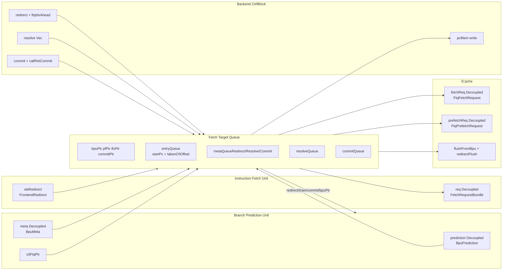
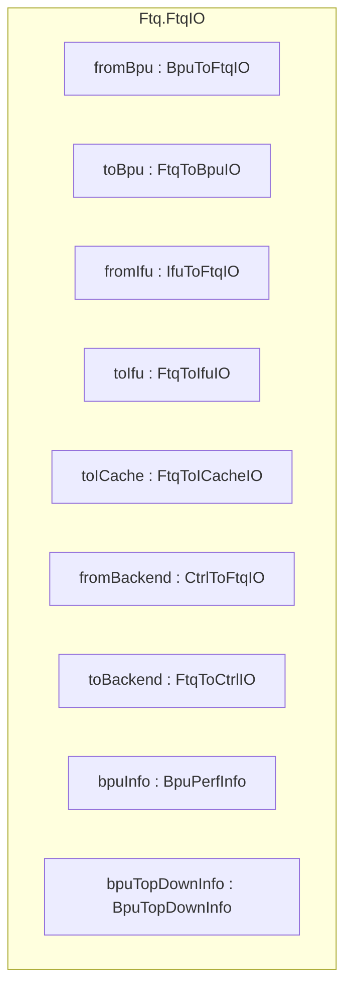
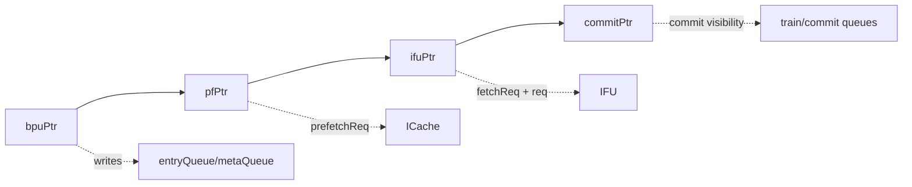
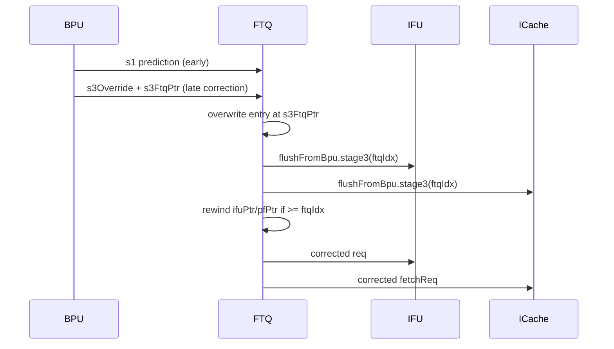
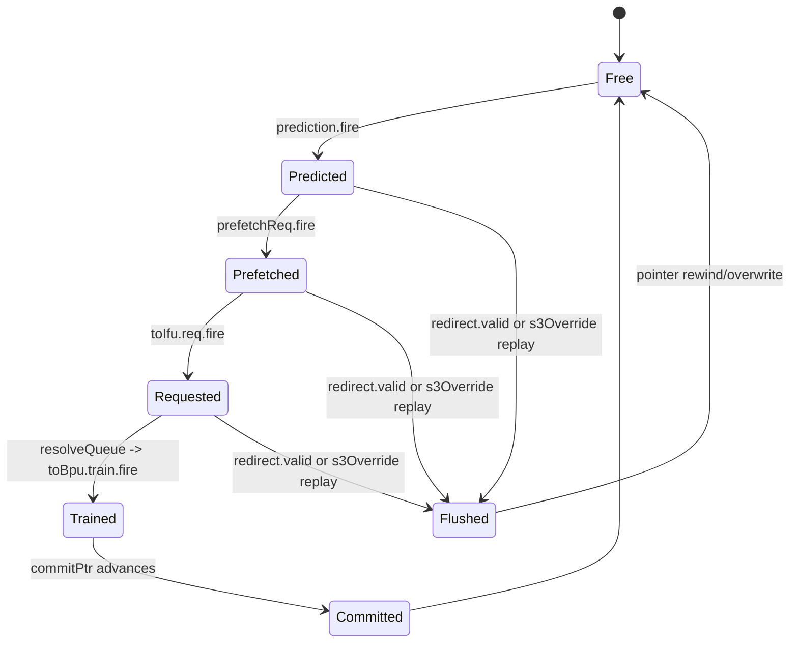
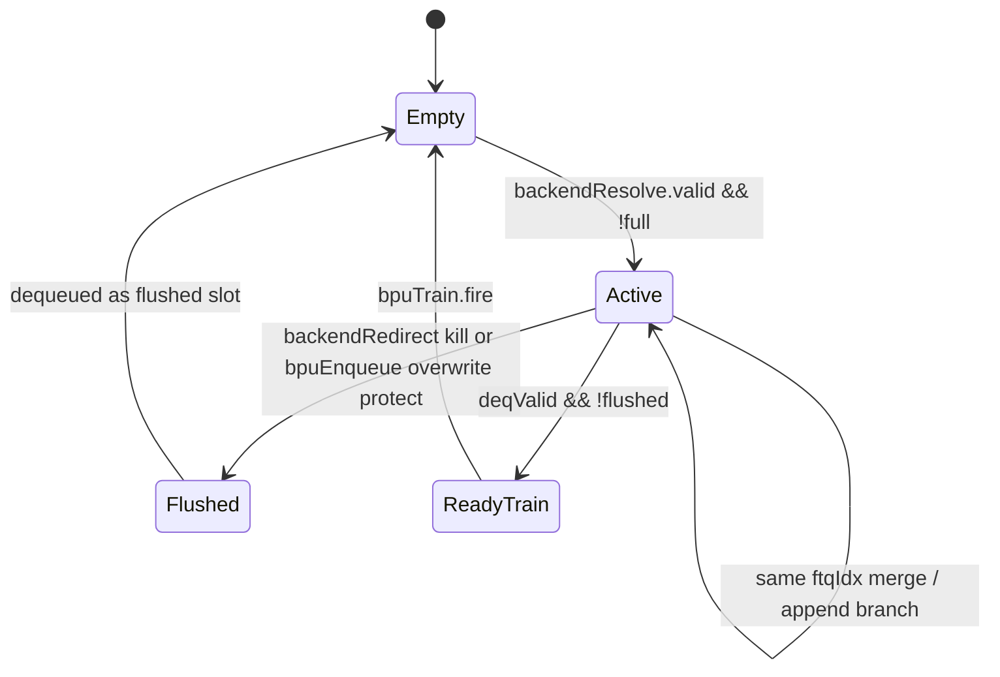
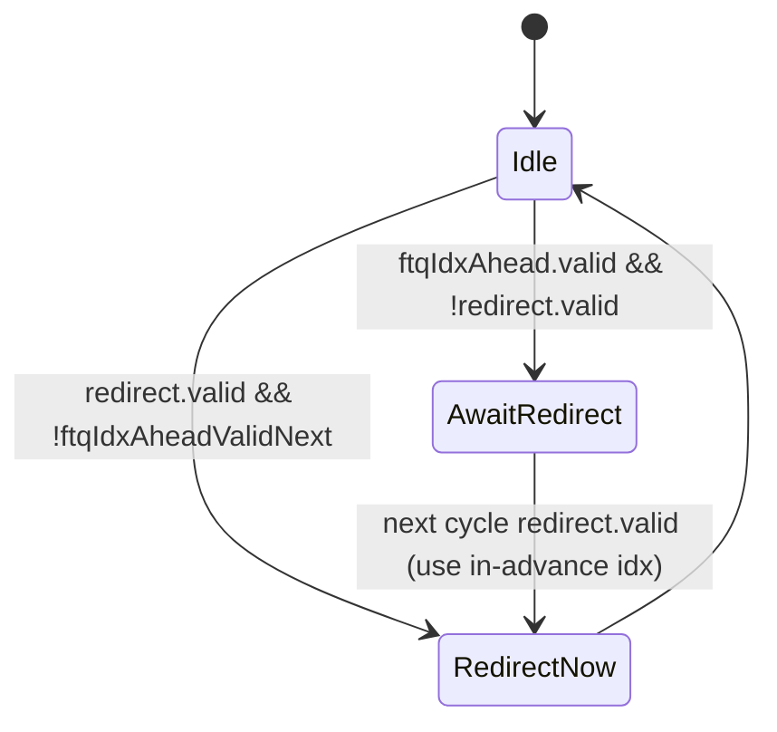

# Chapter 6a. XiangShan Fetch Target Queue Implementation

Chapter 6 introduced the Fetch Target Queue concept: a multi-pointer speculation ledger that
decouples branch prediction from instruction fetching, stores recovery and training metadata, and
coordinates redirect/resolve/commit feedback. This companion chapter maps those concepts onto
Kunminghu's concrete implementation.

### Block Diagram: FTQ as the Frontend Speculation Ledger

Main anchors: [Ftq.scala:55](src/main/scala/xiangshan/frontend/ftq/Ftq.scala#L55), [Ftq.scala:62](src/main/scala/xiangshan/frontend/ftq/Ftq.scala#L62), [Ftq.scala:97](src/main/scala/xiangshan/frontend/ftq/Ftq.scala#L97), [Ftq.scala:107](src/main/scala/xiangshan/frontend/ftq/Ftq.scala#L107), [Ftq.scala:110](src/main/scala/xiangshan/frontend/ftq/Ftq.scala#L110).

---

### 6a.1 Design Intent

#### 6a.1.1 XiangShan's FTQ in context

Chapter 6 described the general FTQ concept. XiangShan's implementation extends the basic idea in
several ways:

- **Split metadata queues**: redirect, resolve, and commit metadata are stored in separate arrays
  rather than one packed entry. This allows each metadata class to be written and read on its own
  schedule.
- **Dedicated resolve and commit queues**: `ResolveQueue` and `CommitQueue` are separate submodules
  that buffer backend events before they reach the BPU training ports.
- **s3Override overwrite**: the BPU's accurate layer can overwrite an earlier prediction in-place
  without a full redirect cycle.
- **Backpressure-aware admission**: FTQ monitors both queue capacity and training channel health
  before accepting new predictions.

See Appendix F for the running glossary used across chapters.

Key logic: [Ftq.scala:151](src/main/scala/xiangshan/frontend/ftq/Ftq.scala#L151), [Ftq.scala:153](src/main/scala/xiangshan/frontend/ftq/Ftq.scala#L153), [Ftq.scala:183](src/main/scala/xiangshan/frontend/ftq/Ftq.scala#L183), [Ftq.scala:317](src/main/scala/xiangshan/frontend/ftq/Ftq.scala#L317), [Ftq.scala:334](src/main/scala/xiangshan/frontend/ftq/Ftq.scala#L334), [Ftq.scala:374](src/main/scala/xiangshan/frontend/ftq/Ftq.scala#L374).

> **Design Trade-off**
> A monolithic "prediction+fetch+train" pipeline can reduce storage duplication, but it tightens timing and makes recovery harder to localize. XiangShan chooses split queues and metadata arrays to isolate pressure points (prediction enqueue, fetch issue, resolve train, commit train).

#### 6a.1.2 Pointer-based organization

FTQ uses multiple circular pointers rather than a single head/tail pair (as described conceptually
in Chapter 6, Section 6.3):

- `bpuPtr`: next entry BPU will write.
- `pfPtr`: next entry for prefetch request.
- `ifuPtr`: next entry for IFU/fetch request.
- `commitPtr`: next entry considered committed by backend.

Pointer definitions: [Ftq.scala:85](src/main/scala/xiangshan/frontend/ftq/Ftq.scala#L85), [Ftq.scala:86](src/main/scala/xiangshan/frontend/ftq/Ftq.scala#L86), [Ftq.scala:87](src/main/scala/xiangshan/frontend/ftq/Ftq.scala#L87), [Ftq.scala:89](src/main/scala/xiangshan/frontend/ftq/Ftq.scala#L89).

Circular semantics helpers: [CircularQueuePtr.scala:92](utility/src/main/scala/utility/CircularQueuePtr.scala#L92), [CircularQueuePtr.scala:98](utility/src/main/scala/utility/CircularQueuePtr.scala#L98), [CircularQueuePtr.scala:102](utility/src/main/scala/utility/CircularQueuePtr.scala#L102).

---

### 6a.2 Module Boundary and Interfaces

### Schematic: FTQ External Boundary (port names follow RTL)

Top-level FTQ IO definition: [Ftq.scala:62](src/main/scala/xiangshan/frontend/ftq/Ftq.scala#L62).

#### 6a.2.1 FTQ top-level interface table

| Port Name | Direction | Width/Type | Description |
| --- | --- | --- | --- |
| [`fromBpu`](src/main/scala/xiangshan/frontend/ftq/Ftq.scala#L63) | Input | `BpuToFtqIO` | Prediction stream, metadata stream, and `s3FtqPtr` context from BPU. |
| [`toBpu`](src/main/scala/xiangshan/frontend/ftq/Ftq.scala#L64) | Output | `FtqToBpuIO` | Redirect replay, resolve train, commit train, and visible `bpuPtr`. |
| [`fromIfu`](src/main/scala/xiangshan/frontend/ftq/Ftq.scala#L66) | Input | `IfuToFtqIO` | IFU writeback redirect and MMIO commit-read handshake. |
| [`toIfu`](src/main/scala/xiangshan/frontend/ftq/Ftq.scala#L67) | Output | `FtqToIfuIO` | Fetch requests, backend redirect broadcast, BPU stage flush. |
| [`toICache`](src/main/scala/xiangshan/frontend/ftq/Ftq.scala#L69) | Output | `FtqToICacheIO` | Fetch/prefetch requests and flush control toward ICache. |
| [`fromBackend`](src/main/scala/xiangshan/frontend/ftq/Ftq.scala#L71) | Input | `CtrlToFtqIO` | Backend redirect, resolve vector, and commit/call-ret information. |
| [`toBackend`](src/main/scala/xiangshan/frontend/ftq/Ftq.scala#L72) | Output | `FtqToCtrlIO` | `startPc` write enable/address/data to backend PC memory. |
| [`bpuInfo`](src/main/scala/xiangshan/frontend/ftq/Ftq.scala#L74) | Output | `BpuPerfInfo` | Frontend-visible BPU perf counters. |
| [`bpuTopDownInfo`](src/main/scala/xiangshan/frontend/ftq/Ftq.scala#L77) | Output | `BpuTopDownInfo` | Top-down stall attribution bits for frontend/backend analysis. |

#### 6a.2.2 Key bundle fields used by FTQ

| Bundle | Significant fields consumed/produced by FTQ |
| --- | --- |
| [`BpuToFtqIO`](src/main/scala/xiangshan/frontend/Bundles.scala#L53) | `prediction`, `meta`, `s3FtqPtr`, `perfMeta`, `topdownReasons` |
| [`FtqToBpuIO`](src/main/scala/xiangshan/frontend/Bundles.scala#L63) | `redirect`, `train`, `commit`, `bpuPtr`, `redirectFromIFU` |
| [`FtqToICacheIO`](src/main/scala/xiangshan/frontend/Bundles.scala#L111) | `fetchReq`, `prefetchReq`, `flushFromBpu`, `redirectFlush` |
| [`FtqToIfuIO`](src/main/scala/xiangshan/frontend/Bundles.scala#L139) | `req`, `redirect`, `topdownRedirect`, `flushFromBpu` |
| [`IfuToFtqIO`](src/main/scala/xiangshan/frontend/Bundles.scala#L161) | `wbRedirect`, `mmioCommitRead` |
| [`CtrlToFtqIO`](src/main/scala/xiangshan/backend/CtrlBlock.scala#L45) | `redirect`, `ftqIdxAhead`, `resolve`, `commit`, `callRetCommit` |
| [`FtqToCtrlIO`](src/main/scala/xiangshan/frontend/ftq/Bundles.scala#L74) | `wen`, `ftqIdx`, `startPc` |

#### 6a.2.3 Submodule interface tables

`ResolveQueue` interface:

| Port Name | Direction | Width/Type | Description |
| --- | --- | --- | --- |
| [`backendResolve`](src/main/scala/xiangshan/frontend/ftq/ResolveQueue.scala#L31) | Input | `Vec(backendParams.BrhCnt, Valid[Resolve])` | Resolved branches from backend execution/redirect path. |
| [`bpuTrain`](src/main/scala/xiangshan/frontend/ftq/ResolveQueue.scala#L32) | Output | `Decoupled[ResolveEntry]` | Aggregated per-FTQ-entry training packet for BPU. |
| [`backendRedirect`](src/main/scala/xiangshan/frontend/ftq/ResolveQueue.scala#L34) | Input | `Bool` | Redirect kill signal used to flush younger resolve entries. |
| [`backendRedirectPtr`](src/main/scala/xiangshan/frontend/ftq/ResolveQueue.scala#L35) | Input | `FtqPtr` | Redirect boundary pointer for flush filtering. |
| [`bpuEnqueue`](src/main/scala/xiangshan/frontend/ftq/ResolveQueue.scala#L36) | Input | `Bool` | Marks fresh prediction allocate, used to protect overwritten meta. |
| [`bpuEnqueuePtr`](src/main/scala/xiangshan/frontend/ftq/ResolveQueue.scala#L37) | Input | `FtqPtr` | FTQ index of fresh prediction allocate. |

`CommitQueue` interface:

| Port Name | Direction | Width/Type | Description |
| --- | --- | --- | --- |
| [`backendCommit`](src/main/scala/xiangshan/frontend/ftq/CommitQueue.scala#L30) | Input | `Vec(CommitWidth, Valid[CallRetCommit])` | Commit-stage call/return events from backend. |
| [`bpuTrain`](src/main/scala/xiangshan/frontend/ftq/CommitQueue.scala#L31) | Output | `Valid[CallRetCommit]` | Commit-time RAS training packet to BPU. |

---

### 6a.3 Internal Organization

#### 6a.3.1 Storage arrays and their roles

| Structure | Type | Stored information | Anchor |
| --- | --- | --- | --- |
| `entryQueue` | `Vec(FtqSize, FtqEntry)` | `startPc` and predicted `takenCfiOffset` per FTQ entry | [Ftq.scala:97](src/main/scala/xiangshan/frontend/ftq/Ftq.scala#L97), [Bundles.scala:27](src/main/scala/xiangshan/frontend/ftq/Bundles.scala#L27) |
| `metaQueueRedirect` | `Vec(FtqSize, BpuRedirectMeta)` | Redirect recovery metadata (PHR/CommonHR/RAS) | [Ftq.scala:100](src/main/scala/xiangshan/frontend/ftq/Ftq.scala#L100) |
| `metaQueueResolve` | `Vec(FtqSize, BpuResolveMeta)` | Resolve-time training metadata (MBTB/TAGE/SC/ITTAGE/PHR) | [Ftq.scala:103](src/main/scala/xiangshan/frontend/ftq/Ftq.scala#L103) |
| `metaQueueCommit` | `Vec(FtqSize, BpuCommitMeta)` | Commit-time training metadata (mainly RAS) | [Ftq.scala:104](src/main/scala/xiangshan/frontend/ftq/Ftq.scala#L104) |
| `perfQueue` | `Vec(FtqSize, PerfMeta)` | Prediction source/perf attribution and mispredict stats | [Ftq.scala:113](src/main/scala/xiangshan/frontend/ftq/Ftq.scala#L113), [Bundles.scala:81](src/main/scala/xiangshan/frontend/ftq/Bundles.scala#L81) |

#### 6a.3.2 Pointer timeline model

The queue is not drained by a single dequeue event. Different pointers advance on different handshakes:

- `bpuPtr`: prediction acceptance.
- `pfPtr`: prefetch request fire.
- `ifuPtr`: fetch request fire.
- `commitPtr`: backend commit reachability.

Anchors: [Ftq.scala:172](src/main/scala/xiangshan/frontend/ftq/Ftq.scala#L172), [Ftq.scala:201](src/main/scala/xiangshan/frontend/ftq/Ftq.scala#L201), [Ftq.scala:204](src/main/scala/xiangshan/frontend/ftq/Ftq.scala#L204), [Ftq.scala:367](src/main/scala/xiangshan/frontend/ftq/Ftq.scala#L367).

---

### 6a.4 Step-by-Step Data Flow

#### 6a.4.1 Step A: prediction enqueue and `s3Override` overwrite

FTQ accepts BPU prediction only when three conditions hold:

1. FTQ capacity distance is safe (`bpuPtr` vs `commitPtr`).
2. BPU runahead distance to IFU is bounded (`bpuPtr` vs `ifuPtr`).
3. BPU train channel is not stalled too long.

Readiness equation: [Ftq.scala:153](src/main/scala/xiangshan/frontend/ftq/Ftq.scala#L153).

When accepted, FTQ chooses write index:

- normal case: `bpuPtr(0)`.
- correction case: `io.fromBpu.s3FtqPtr` when `s3Override` is true.

Pointer select/update: [Ftq.scala:165](src/main/scala/xiangshan/frontend/ftq/Ftq.scala#L165), [Ftq.scala:168](src/main/scala/xiangshan/frontend/ftq/Ftq.scala#L168), [Ftq.scala:173](src/main/scala/xiangshan/frontend/ftq/Ftq.scala#L173), [Ftq.scala:175](src/main/scala/xiangshan/frontend/ftq/Ftq.scala#L175).

Prediction payload write: [Ftq.scala:178](src/main/scala/xiangshan/frontend/ftq/Ftq.scala#L178). Metadata write always targets `s3FtqPtr`: [Ftq.scala:183](src/main/scala/xiangshan/frontend/ftq/Ftq.scala#L183).

BPU side source of `s3FtqPtr` and `s3Override`: [Bpu.scala:380](src/main/scala/xiangshan/frontend/bpu/Bpu.scala#L380), [Bpu.scala:424](src/main/scala/xiangshan/frontend/bpu/Bpu.scala#L424), [Bpu.scala:426](src/main/scala/xiangshan/frontend/bpu/Bpu.scala#L426).

#### 6a.4.2 Step B: generate prefetch and fetch requests

`pfPtr` and `ifuPtr` advance independently on their own fire events:

- prefetch fire: [Ftq.scala:201](src/main/scala/xiangshan/frontend/ftq/Ftq.scala#L201)
- IFU req fire: [Ftq.scala:204](src/main/scala/xiangshan/frontend/ftq/Ftq.scala#L204)

Prefetch request can be driven by either queued entries or one-cycle delayed redirect target:

- valid condition: [Ftq.scala:229](src/main/scala/xiangshan/frontend/ftq/Ftq.scala#L229)
- `startVAddr` mux with `redirectNext`: [Ftq.scala:230](src/main/scala/xiangshan/frontend/ftq/Ftq.scala#L230)
- backend exception tagging into prefetch path: [Ftq.scala:244](src/main/scala/xiangshan/frontend/ftq/Ftq.scala#L244)

Fetch request to ICache and IFU uses `ifuReqValid` and synchronized top-level ready wiring:

- `ifuReqValid`: [Ftq.scala:250](src/main/scala/xiangshan/frontend/ftq/Ftq.scala#L250)
- ICache fetch fields: [Ftq.scala:254](src/main/scala/xiangshan/frontend/ftq/Ftq.scala#L254)
- IFU fetch fields: [Ftq.scala:261](src/main/scala/xiangshan/frontend/ftq/Ftq.scala#L261)
- top-level coupled ready (IFU + ICache): [Frontend.scala:221](src/main/scala/xiangshan/frontend/Frontend.scala#L221), [Frontend.scala:230](src/main/scala/xiangshan/frontend/Frontend.scala#L230)

#### 6a.4.3 Step C: flush and redirect processing

FTQ merges redirect sources with backend priority:

- IFU redirect conversion: [IfuRedirectReceiver.scala:25](src/main/scala/xiangshan/frontend/ftq/IfuRedirectReceiver.scala#L25)
- backend redirect receive/defer logic: [BackendRedirectReceiver.scala:25](src/main/scala/xiangshan/frontend/ftq/BackendRedirectReceiver.scala#L25)
- source selection: [Ftq.scala:120](src/main/scala/xiangshan/frontend/ftq/Ftq.scala#L120)

On redirect, FTQ computes `newEntryPtr` using redirect level and instruction position policy, then rewinds `bpuPtr/ifuPtr/pfPtr` together:

- redirect flush output: [Ftq.scala:302](src/main/scala/xiangshan/frontend/ftq/Ftq.scala#L302)
- `newEntryPtr` policy: [Ftq.scala:304](src/main/scala/xiangshan/frontend/ftq/Ftq.scala#L304)
- pointer reset: [Ftq.scala:310](src/main/scala/xiangshan/frontend/ftq/Ftq.scala#L310)
- `RedirectLevel.flushItself`: [package.scala:162](src/main/scala/xiangshan/package.scala#L162)

FTQ also sends BPU redirect with stored `metaQueueRedirect` entry:

- redirect fields to BPU: [Ftq.scala:317](src/main/scala/xiangshan/frontend/ftq/Ftq.scala#L317)
- CFI PC reconstruction: [Ftq.scala:318](src/main/scala/xiangshan/frontend/ftq/Ftq.scala#L318), [Helpers.scala:45](src/main/scala/xiangshan/frontend/bpu/Helpers.scala#L45)
- metadata replay: [Ftq.scala:322](src/main/scala/xiangshan/frontend/ftq/Ftq.scala#L322)

#### 6a.4.4 Step D: resolve training path

Backend branch resolves enter `ResolveQueue`, where entries with same `ftqIdx` are merged and branches are packed:

- enqueue/search/merge logic: [ResolveQueue.scala:75](src/main/scala/xiangshan/frontend/ftq/ResolveQueue.scala#L75), [ResolveQueue.scala:90](src/main/scala/xiangshan/frontend/ftq/ResolveQueue.scala#L90), [ResolveQueue.scala:105](src/main/scala/xiangshan/frontend/ftq/ResolveQueue.scala#L105)
- flush marking of stale entries: [ResolveQueue.scala:129](src/main/scala/xiangshan/frontend/ftq/ResolveQueue.scala#L129)
- dequeue-to-train condition: [ResolveQueue.scala:137](src/main/scala/xiangshan/frontend/ftq/ResolveQueue.scala#L137), [ResolveQueue.scala:141](src/main/scala/xiangshan/frontend/ftq/ResolveQueue.scala#L141)

FTQ maps dequeued `ftqIdx` to `metaQueueResolve` and `perfQueue` before sending `toBpu.train`:

- train output wiring: [Ftq.scala:334](src/main/scala/xiangshan/frontend/ftq/Ftq.scala#L334)
- resolve meta lookup: [Ftq.scala:336](src/main/scala/xiangshan/frontend/ftq/Ftq.scala#L336)
- perf lookup: [Ftq.scala:339](src/main/scala/xiangshan/frontend/ftq/Ftq.scala#L339)

#### 6a.4.5 Step E: commit training path

Commit-time call/return actions are filtered in `CommitQueue` (only non-`None` RAS actions enqueue):

- filter condition: [CommitQueue.scala:43](src/main/scala/xiangshan/frontend/ftq/CommitQueue.scala#L43)
- enqueue/dequeue behavior: [CommitQueue.scala:49](src/main/scala/xiangshan/frontend/ftq/CommitQueue.scala#L49), [CommitQueue.scala:58](src/main/scala/xiangshan/frontend/ftq/CommitQueue.scala#L58)

FTQ sends commit training with `metaQueueCommit` and `rasAction`:

- commit output wiring: [Ftq.scala:374](src/main/scala/xiangshan/frontend/ftq/Ftq.scala#L374)
- commit meta lookup: [Ftq.scala:375](src/main/scala/xiangshan/frontend/ftq/Ftq.scala#L375)
- action mapping: [Ftq.scala:377](src/main/scala/xiangshan/frontend/ftq/Ftq.scala#L377)

#### 6a.4.6 Step F: backend PC memory bookkeeping and MMIO corner

FTQ writes per-entry start PC into backend-visible storage when prediction enqueues:

- write enable/index/data: [Ftq.scala:294](src/main/scala/xiangshan/frontend/ftq/Ftq.scala#L294), [Ftq.scala:295](src/main/scala/xiangshan/frontend/ftq/Ftq.scala#L295), [Ftq.scala:296](src/main/scala/xiangshan/frontend/ftq/Ftq.scala#L296)

MMIO commit-read coordination is forwarded through IFU interface:

- FTQ MMIO logic: [Ftq.scala:382](src/main/scala/xiangshan/frontend/ftq/Ftq.scala#L382)
- IFU side connection: [Ifu.scala:538](src/main/scala/xiangshan/frontend/ifu/Ifu.scala#L538)
- bundle definition: [Bundles.scala:166](src/main/scala/xiangshan/frontend/Bundles.scala#L166)

---

### 6a.5 Parameters

#### 6a.5.1 FTQ-specific parameters

| Parameter | Default | Description | Anchor |
| --- | --- | --- | --- |
| `FtqSize` | `64` | Number of FTQ entries and pointer modulus. | [FtqParameters.scala:23](src/main/scala/xiangshan/frontend/ftq/FtqParameters.scala#L23) |
| `ResolveQueueSize` | `16` | Slots for merged backend resolve events before BPU training. | [FtqParameters.scala:24](src/main/scala/xiangshan/frontend/ftq/FtqParameters.scala#L24) |
| `BpRunAheadDistance` | `8` | Max `bpuPtr - ifuPtr` distance allowed for accepting new predictions. | [FtqParameters.scala:25](src/main/scala/xiangshan/frontend/ftq/FtqParameters.scala#L25) |
| `BpTrainStallLimit` | `8` | Max consecutive cycles FTQ tolerates unresolved `toBpu.train` backpressure. | [FtqParameters.scala:26](src/main/scala/xiangshan/frontend/ftq/FtqParameters.scala#L26) |
| `CommitQueueSize` | `64` | Slots buffering commit-time call/return events. | [FtqParameters.scala:27](src/main/scala/xiangshan/frontend/ftq/FtqParameters.scala#L27) |

#### 6a.5.2 Related frontend/core parameters used by FTQ fields

| Parameter | Default | Why FTQ cares | Anchor |
| --- | --- | --- | --- |
| `FetchBlockSize` | `64` bytes | Determines fetch-block granularity and `FetchBlockInstNum`. | [FrontendParameters.scala:28](src/main/scala/xiangshan/frontend/FrontendParameters.scala#L28) |
| `FetchPorts` | `2` | Size of IFU-side fetch vector in `FtqToIfuReq`. | [FrontendParameters.scala:29](src/main/scala/xiangshan/frontend/FrontendParameters.scala#L29) |
| `ResolveEntryBranchNumber` | `8` | Number of branch slots packed in each `ResolveEntry`. | [FrontendParameters.scala:30](src/main/scala/xiangshan/frontend/FrontendParameters.scala#L30) |
| `FtqPtr.width` | `log2Up(FtqSize)` | Width of FTQ index sent to backend/neighbor modules. | [FtqPtr.scala:36](src/main/scala/xiangshan/frontend/ftq/FtqPtr.scala#L36) |
| `CommitWidth` | `8` (default core) | Width of commit vector consumed by `CommitQueue`. | [Parameters.scala:82](src/main/scala/xiangshan/Parameters.scala#L82), [CommitQueue.scala:30](src/main/scala/xiangshan/frontend/ftq/CommitQueue.scala#L30) |

---

### 6a.6 Timing and Pipeline Behavior

#### 6a.6.1 Scenario A: steady-state correct prediction (no redirect)

| Cycle | BPU/FTQ | FTQ -> ICache/IFU | Backend/BPU training path |
| --- | --- | --- | --- |
| C0 | `fromBpu.prediction.fire`; FTQ writes `entryQueue` | - | - |
| C1 | FTQ may issue `prefetchReq.fire`; `pfPtr` increments | Prefetch start address from queued entry | - |
| C2 | FTQ asserts `fetchReq.valid` and `toIfu.req.valid` when `ifuReqValid` | Fetch request sent to ICache and IFU in lockstep | - |
| C3 | IFU processes fetched block | - | backend resolve may arrive later |
| C4+ | `resolveQueue` emits `bpuTrain` when entry reaches dequeue and not flushed | - | FTQ forwards `toBpu.train` with `metaQueueResolve` |
| C5+ | commit reaches FTQ | - | FTQ forwards `toBpu.commit` for RAS maintenance |

Anchors: [Ftq.scala:178](src/main/scala/xiangshan/frontend/ftq/Ftq.scala#L178), [Ftq.scala:201](src/main/scala/xiangshan/frontend/ftq/Ftq.scala#L201), [Ftq.scala:250](src/main/scala/xiangshan/frontend/ftq/Ftq.scala#L250), [Ftq.scala:261](src/main/scala/xiangshan/frontend/ftq/Ftq.scala#L261), [Ftq.scala:334](src/main/scala/xiangshan/frontend/ftq/Ftq.scala#L334), [Ftq.scala:374](src/main/scala/xiangshan/frontend/ftq/Ftq.scala#L374).

#### 6a.6.2 Scenario B: `s3Override` correction

Anchors: [Ftq.scala:160](src/main/scala/xiangshan/frontend/ftq/Ftq.scala#L160), [Ftq.scala:168](src/main/scala/xiangshan/frontend/ftq/Ftq.scala#L168), [Ftq.scala:213](src/main/scala/xiangshan/frontend/ftq/Ftq.scala#L213), [Ftq.scala:215](src/main/scala/xiangshan/frontend/ftq/Ftq.scala#L215), [Ftq.scala:219](src/main/scala/xiangshan/frontend/ftq/Ftq.scala#L219), [Bpu.scala:415](src/main/scala/xiangshan/frontend/bpu/Bpu.scala#L415), [Bpu.scala:426](src/main/scala/xiangshan/frontend/bpu/Bpu.scala#L426).

#### 6a.6.3 Scenario C: backend redirect with FTQ index sent ahead

| Cycle | Event |
| --- | --- |
| R0 | Backend may provide `ftqIdxAhead(0)` before redirect valid. |
| R1 | Redirect arrives; `BackendRedirectReceiver` chooses immediate or delayed redirect packet depending on whether index was ahead. |
| R1 | FTQ sets `redirectFlush`, computes `newEntryPtr`, rewinds producer/consumer pointers. |
| R1 | FTQ sends `toBpu.redirect` with `metaQueueRedirect(ftqIdx)` for predictor recovery. |
| R2 | BPU restarts prediction from corrected target PC. |

Anchors: [BackendRedirectReceiver.scala:28](src/main/scala/xiangshan/frontend/ftq/BackendRedirectReceiver.scala#L28), [BackendRedirectReceiver.scala:49](src/main/scala/xiangshan/frontend/ftq/BackendRedirectReceiver.scala#L49), [BackendRedirectReceiver.scala:56](src/main/scala/xiangshan/frontend/ftq/BackendRedirectReceiver.scala#L56), [Ftq.scala:302](src/main/scala/xiangshan/frontend/ftq/Ftq.scala#L302), [Ftq.scala:304](src/main/scala/xiangshan/frontend/ftq/Ftq.scala#L304), [Ftq.scala:317](src/main/scala/xiangshan/frontend/ftq/Ftq.scala#L317), [Bpu.scala:434](src/main/scala/xiangshan/frontend/bpu/Bpu.scala#L434).

#### 6a.6.4 Scenario D: BPU training backpressure throttles prediction

FTQ tracks consecutive cycles where `toBpu.train.valid && !toBpu.train.ready`. If this exceeds `BpTrainStallLimit`, new `fromBpu.prediction` is blocked.

Counters and gating: [Ftq.scala:144](src/main/scala/xiangshan/frontend/ftq/Ftq.scala#L144), [Ftq.scala:145](src/main/scala/xiangshan/frontend/ftq/Ftq.scala#L145), [Ftq.scala:155](src/main/scala/xiangshan/frontend/ftq/Ftq.scala#L155).

---

### 6a.7 State Machines

#### 6a.7.1 FTQ entry lifecycle (derived from pointer/event logic)

This state model is an abstraction from pointer updates and queue writes in [Ftq.scala:172](src/main/scala/xiangshan/frontend/ftq/Ftq.scala#L172), [Ftq.scala:201](src/main/scala/xiangshan/frontend/ftq/Ftq.scala#L201), [Ftq.scala:204](src/main/scala/xiangshan/frontend/ftq/Ftq.scala#L204), [Ftq.scala:334](src/main/scala/xiangshan/frontend/ftq/Ftq.scala#L334), [Ftq.scala:367](src/main/scala/xiangshan/frontend/ftq/Ftq.scala#L367), [Ftq.scala:302](src/main/scala/xiangshan/frontend/ftq/Ftq.scala#L302).

#### 6a.7.2 ResolveQueue slot lifecycle

Anchors: [ResolveQueue.scala:47](src/main/scala/xiangshan/frontend/ftq/ResolveQueue.scala#L47), [ResolveQueue.scala:75](src/main/scala/xiangshan/frontend/ftq/ResolveQueue.scala#L75), [ResolveQueue.scala:105](src/main/scala/xiangshan/frontend/ftq/ResolveQueue.scala#L105), [ResolveQueue.scala:129](src/main/scala/xiangshan/frontend/ftq/ResolveQueue.scala#L129), [ResolveQueue.scala:141](src/main/scala/xiangshan/frontend/ftq/ResolveQueue.scala#L141), [ResolveQueue.scala:144](src/main/scala/xiangshan/frontend/ftq/ResolveQueue.scala#L144).

#### 6a.7.3 Backend redirect receive/defer controller

Anchors: [BackendRedirectReceiver.scala:34](src/main/scala/xiangshan/frontend/ftq/BackendRedirectReceiver.scala#L34), [BackendRedirectReceiver.scala:36](src/main/scala/xiangshan/frontend/ftq/BackendRedirectReceiver.scala#L36), [BackendRedirectReceiver.scala:49](src/main/scala/xiangshan/frontend/ftq/BackendRedirectReceiver.scala#L49), [BackendRedirectReceiver.scala:57](src/main/scala/xiangshan/frontend/ftq/BackendRedirectReceiver.scala#L57).

---

### 6a.8 Worked Example

> **Worked Example: one mispredicted conditional branch in FTQ entry `k`**
>
> 1. BPU emits an `s1` prediction for entry `k`, FTQ writes `entryQueue(k)` and advances `bpuPtr` ([Ftq.scala:178](src/main/scala/xiangshan/frontend/ftq/Ftq.scala#L178)).
> 2. IFU receives request for `k`; later IFU checker detects mismatch and emits `wbRedirect` with `ftqIdx = k` and corrected target ([Ifu.scala:761](src/main/scala/xiangshan/frontend/ifu/Ifu.scala#L761), [Ifu.scala:778](src/main/scala/xiangshan/frontend/ifu/Ifu.scala#L778)).
> 3. FTQ converts IFU redirect (returns use speculative RAS top if needed) and marks redirect valid ([IfuRedirectReceiver.scala:31](src/main/scala/xiangshan/frontend/ftq/IfuRedirectReceiver.scala#L31), [IfuRedirectReceiver.scala:38](src/main/scala/xiangshan/frontend/ftq/IfuRedirectReceiver.scala#L38)).
> 4. FTQ rewinds `bpuPtr/ifuPtr/pfPtr` to redirected boundary and sends `toBpu.redirect` with `metaQueueRedirect(k)` for history/RAS recovery ([Ftq.scala:310](src/main/scala/xiangshan/frontend/ftq/Ftq.scala#L310), [Ftq.scala:322](src/main/scala/xiangshan/frontend/ftq/Ftq.scala#L322)).
> 5. Backend later resolves branch outcomes for that entry; `ResolveQueue` emits merged branches and FTQ forwards `toBpu.train` with `metaQueueResolve(k)` ([ResolveQueue.scala:141](src/main/scala/xiangshan/frontend/ftq/ResolveQueue.scala#L141), [Ftq.scala:336](src/main/scala/xiangshan/frontend/ftq/Ftq.scala#L336)).
> 6. At commit, if call/return action exists, FTQ emits `toBpu.commit` for RAS architectural update ([Ftq.scala:374](src/main/scala/xiangshan/frontend/ftq/Ftq.scala#L374), [Ftq.scala:377](src/main/scala/xiangshan/frontend/ftq/Ftq.scala#L377)).

---

### 6a.9 Design Rationale and Trade-offs

#### 6a.9.1 Split metadata queues vs single packed FTQ entry

XiangShan keeps `entryQueue` separate from redirect/resolve/commit metadata queues.

- Benefit: write/read each metadata class on its own schedule.
- Cost: more arrays and bookkeeping complexity.

Anchors: [Ftq.scala:97](src/main/scala/xiangshan/frontend/ftq/Ftq.scala#L97), [Ftq.scala:100](src/main/scala/xiangshan/frontend/ftq/Ftq.scala#L100), [Ftq.scala:103](src/main/scala/xiangshan/frontend/ftq/Ftq.scala#L103), [Ftq.scala:104](src/main/scala/xiangshan/frontend/ftq/Ftq.scala#L104).

#### 6a.9.2 Why resolve/commit are buffered separately

`ResolveQueue` and `CommitQueue` isolate backend burstiness from BPU training bandwidth.

- Benefit: decouples backend event timing from predictor update timing.
- Cost: queue-full corner cases and additional flush logic.

Anchors: [ResolveQueue.scala:47](src/main/scala/xiangshan/frontend/ftq/ResolveQueue.scala#L47), [ResolveQueue.scala:157](src/main/scala/xiangshan/frontend/ftq/ResolveQueue.scala#L157), [CommitQueue.scala:41](src/main/scala/xiangshan/frontend/ftq/CommitQueue.scala#L41), [CommitQueue.scala:70](src/main/scala/xiangshan/frontend/ftq/CommitQueue.scala#L70).

#### 6a.9.3 Comparison to simpler alternatives

- Alternative A: no FTQ, direct BPU -> IFU pipeline. Lower storage, but redirect/training coupling is tighter.
- Alternative B: FTQ only stores PCs, metadata recomputed on demand. Lower FTQ storage, but recomputation latency and correctness risks increase on redirect.
- Alternative C: checkpoint-only recovery in backend. Helps backend state, but frontend predictor history still needs precise per-entry metadata.

Inference note: this comparison is architectural inference based on FTQ/BPU/IFU contracts, not an explicit comment block in code.

---

### 6a.10 Implementation Notes and Caveats

1. `ResolveQueue` comments explicitly acknowledge current full behavior is not ideal under many flushed entries; future redesign is anticipated ([ResolveQueue.scala:154](src/main/scala/xiangshan/frontend/ftq/ResolveQueue.scala#L154)).
2. `perfQueue` CFI-mask handling under mispredict carries an in-code `BUGGY` note for flush precision ([Ftq.scala:351](src/main/scala/xiangshan/frontend/ftq/Ftq.scala#L351)).
3. IFU and ICache fetch request readiness is forcibly synchronized at frontend top, which simplifies alignment but can couple bubbles between the two consumers ([Frontend.scala:221](src/main/scala/xiangshan/frontend/Frontend.scala#L221), [Frontend.scala:230](src/main/scala/xiangshan/frontend/Frontend.scala#L230)).

---

### 6a.11 Checkpoint Questions

1. **Basic**: Why does FTQ need both `entryQueue` and `metaQueueResolve` instead of only one queue?
2. **Basic**: What is the role of `BpRunAheadDistance` in `fromBpu.prediction.ready`?
3. **Intermediate**: During `s3Override`, why does FTQ use `s3FtqPtr` rather than the current `bpuPtr`?
4. **Intermediate**: How does `BackendRedirectReceiver` reduce redirect latency when `ftqIdxAhead` is provided one cycle earlier?
5. **Intermediate**: Why are `ResolveQueue` entries marked `flushed` when `bpuEnqueue` reuses an FTQ index?
6. **Advanced**: If `FtqSize` is doubled, which other structures or timing paths should you re-evaluate first, and why?
7. **Advanced**: Propose a modification that allows FTQ to continue limited prediction when `toBpu.train` is backpressured, while preserving correctness.

---

### 6a.12 Further Reading

1. Glenn Reinman, Todd Austin, Brad Calder, "A Scalable Front-End Architecture for Fast Instruction Delivery," ISCA 1999. (explicitly cited in FTQ source header comment at [Ftq.scala:17](src/main/scala/xiangshan/frontend/ftq/Ftq.scala#L17))
2. Andre Seznec, Pierre Michaud, "A case for (partially) tagged geometric history length branch prediction," JILP 2006. (background for how FTQ-delivered metadata supports TAGE-style training)
3. James E. Smith, "A Study of Branch Prediction Strategies," ISCA 1981. (foundational branch behavior motivation)
4. RISC-V Privileged Architecture Spec, latest ratified release. (for redirect/trap/privilege behavior context)

---

### Key Takeaways

- FTQ is a multi-pointer speculation ledger, not just a FIFO of fetch PCs.
- XiangShan's FTQ explicitly unifies prediction enqueue, fetch issuance, redirect recovery, resolve training, and commit training.
- Split metadata queues and dedicated resolve/commit queues improve decoupling but add control complexity.
- Redirect handling is optimized with both IFU-side and backend-side paths, including backend `ftqIdxAhead` acceleration.
- Correct FTQ behavior is central to both frontend throughput and branch predictor learning quality.
