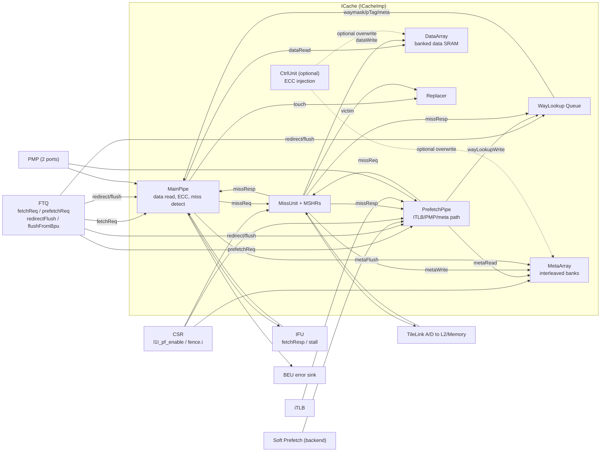
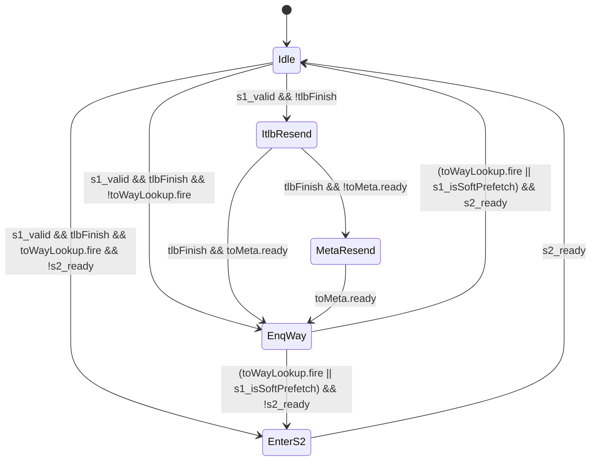

# Chapter 7a. XiangShan Instruction Cache Implementation

Chapter 7 introduced the conceptual foundations of instruction caching: why temporal and spatial locality demand an SRAM structure, why Set-Associativity avoids conflict misses, why VIPT hides translation latency, and why decoupled "baggage tag" lookups allow high-frequency timing closure. This companion chapter maps those concepts onto Kunminghu's concrete implementation.

### Block Diagram: Kunminghu ICache Subsystem

The implementation we analyze is centered on:
[ICache.scala:36](src/main/scala/xiangshan/frontend/icache/ICache.scala#L36),
[ICacheImp.scala:41](src/main/scala/xiangshan/frontend/icache/ICacheImp.scala#L41),
[ICacheMainPipe.scala:37](src/main/scala/xiangshan/frontend/icache/ICacheMainPipe.scala#L37),
[ICachePrefetchPipe.scala:34](src/main/scala/xiangshan/frontend/icache/ICachePrefetchPipe.scala#L34),
[ICacheMissUnit.scala:33](src/main/scala/xiangshan/frontend/icache/ICacheMissUnit.scala#L33).

---

## 7a.1 Design Intent

A naive L1I would combine translation, tag lookup, data read, and miss handling in one narrow pipeline. Kunminghu instead decouples responsibilities:

1. **Prefetch/metadata path** computes physical tag and way information early, then queues it (`ICachePrefetchPipe` + `ICacheWayLookup`).
2. **Main data path** performs data-array access with that precomputed metadata (`ICacheMainPipe`).
3. **Shared miss machinery** handles refill and deduplication (`ICacheMissUnit` + `ICacheMshr` array).

This split is visible in the top-level wiring:
[ICacheImp.scala:101](src/main/scala/xiangshan/frontend/icache/ICacheImp.scala#L101) to [ICacheImp.scala:107](src/main/scala/xiangshan/frontend/icache/ICacheImp.scala#L107),
[ICacheImp.scala:186](src/main/scala/xiangshan/frontend/icache/ICacheImp.scala#L186) to [ICacheImp.scala:204](src/main/scala/xiangshan/frontend/icache/ICacheImp.scala#L204).

### Design Trade-off 7a.1: Decoupled WayLookup vs Monolithic Lookup

Chosen design (Kunminghu):
- Better cycle-time isolation between translation/meta lookup and data critical path.
- Natural place to absorb short producer/consumer mismatch.
- More queue/control complexity (`WayLookupSize`, pointer flush, update hazards).

Alternative:
- One-stage VIPT-like lookup can reduce control complexity.
- Usually harder timing at high frequency when adding two-line fetch + ECC + exception merging.

Broader context: Many commercial cores use a tightly coupled VIPT L1I path; Kunminghu’s split path is closer to a decoupled frontend micro-pipeline that trades some control complexity for higher timing slack and miss-handling overlap.

---

## 7a.2 From Simple Model to Kunminghu ICache

### Layer 1: Base geometry
Kunminghu's base geometry uses `ICacheMetadata`, `ICacheMetaEntry`, and `ICacheDataEntry`:
[Bundles.scala:43](src/main/scala/xiangshan/frontend/icache/Bundles.scala#L43),
[Bundles.scala:58](src/main/scala/xiangshan/frontend/icache/Bundles.scala#L58),
[Bundles.scala:63](src/main/scala/xiangshan/frontend/icache/Bundles.scala#L63).

### Layer 2: Two-line concurrent access
Kunminghu fixes `PortNumber = 2` so one request can cover two adjacent lines:
[Parameters.scala:70](src/main/scala/xiangshan/frontend/icache/Parameters.scala#L70).
This is directly reflected in read bundles:
[Bundles.scala:131](src/main/scala/xiangshan/frontend/icache/Bundles.scala#L131) and [Bundles.scala:132](src/main/scala/xiangshan/frontend/icache/Bundles.scala#L132).

### Layer 3: Split prefetch and data path
PrefetchPipe obtains iTLB/PMP/meta results and enqueues WayLookup entries:
[ICachePrefetchPipe.scala:47](src/main/scala/xiangshan/frontend/icache/ICachePrefetchPipe.scala#L47), [ICachePrefetchPipe.scala:271](src/main/scala/xiangshan/frontend/icache/ICachePrefetchPipe.scala#L271).
MainPipe consumes WayLookup and reads data:
[ICacheMainPipe.scala:50](src/main/scala/xiangshan/frontend/icache/ICacheMainPipe.scala#L50), [ICacheMainPipe.scala:155](src/main/scala/xiangshan/frontend/icache/ICacheMainPipe.scala#L155).

### Layer 4: Refill and prefetch coexistence
MissUnit instantiates fetch and prefetch MSHRs, arbitrates TileLink acquire, and writes refill data:
[ICacheMissUnit.scala:78](src/main/scala/xiangshan/frontend/icache/ICacheMissUnit.scala#L78), [ICacheMissUnit.scala:99](src/main/scala/xiangshan/frontend/icache/ICacheMissUnit.scala#L99), [ICacheMissUnit.scala:236](src/main/scala/xiangshan/frontend/icache/ICacheMissUnit.scala#L236).

---

## 7a.3 Parameters and Derived Quantities

### 7a.3.1 Configurable Parameters (`ICacheParameters`)
Primary definition: [Parameters.scala:27](src/main/scala/xiangshan/frontend/icache/Parameters.scala#L27).

| Parameter | Default | Description |
| --- | --- | --- |
| `nSets` | `256` | Number of sets. |
| `nWays` | `4` | Associativity. |
| `rowBits` | `64` | Data bits per data-bank row access. |
| `blockBytes` | `64` | Cache-line size (bytes). |
| `NumFetchMshr` | `4` | MSHRs reserved for demand fetch misses. |
| `NumPrefetchMshr` | `10` | MSHRs for prefetch requests. |
| `WayLookupSize` | `32` | Entries in WayLookup queue. |
| `NumInterleavedBank` | `2` | Number of interleaved metadata banks. |

### 7a.3.2 Key Derived Geometry
Derived in `HasICacheParameters`: [Parameters.scala:107](src/main/scala/xiangshan/frontend/icache/Parameters.scala#L107) to [Parameters.scala:149](src/main/scala/xiangshan/frontend/icache/Parameters.scala#L149).

| Derived Quantity | Formula | Default |
| --- | --- | --- |
| Capacity | `nSets * nWays * blockBytes` | `256 * 4 * 64 = 64 KiB` |
| `PortNumber` | Fixed constant | `2` |
| `DataBanks` | `blockBits / rowBits` | `512 / 64 = 8` |
| Total MSHRs | `NumFetchMshr + NumPrefetchMshr` | `14` |

---

## 7a.4 ICache Module Boundary and I/O

Top-level ICache boundary is `ICacheIO`: [ICacheImp.scala:42](src/main/scala/xiangshan/frontend/icache/ICacheImp.scala#L42) to [ICacheImp.scala:66](src/main/scala/xiangshan/frontend/icache/ICacheImp.scala#L66).

| Port Name | Direction | Width/Type | Description |
| --- | --- | --- | --- |
| `fromFtq` | Input | `FtqToICacheIO` | Demand fetch request, hardware prefetch request, redirect/flush info. |
| `softPrefetchReq` | Input | `Vec[Valid[SoftIfetchPrefetchBundle]]` | Backend/software prefetch.i requests. |
| `toIfu` | Output | `ICacheToIfuIO` | Fetch response, topdown info, perf, and readiness. |
| `fromIfu` | Input | `IfuToICacheIO` | IFU stall feedback (`stall`). |
| `pmp` | In/Out | `Vec[PmpCheckBundle](2)` | PMP request/response for MainPipe and PrefetchPipe. |
| `itlb` | In/Out | `TlbRequestIO` | iTLB translation port used by PrefetchPipe. |
| `csrPfEnable` | Input | `Bool` | CSR gate for L1I prefetch behavior. |

TileLink boundary is a diplomacy client node: [ICache.scala:39](src/main/scala/xiangshan/frontend/icache/ICache.scala#L39) to [ICache.scala:60](src/main/scala/xiangshan/frontend/icache/ICache.scala#L60).

---

## 7a.5 Stage-by-Stage Data Flow Walkthrough

### 7a.5.1 Request construction and ingress
FTQ generates synchronized fetch and prefetch requests: [Ftq.scala:254](src/main/scala/xiangshan/frontend/ftq/Ftq.scala#L254), [Ftq.scala:230](src/main/scala/xiangshan/frontend/ftq/Ftq.scala#L230). 
Frontend wiring enforces IFU/ICache request synchronization: [Frontend.scala:221](src/main/scala/xiangshan/frontend/Frontend.scala#L221).

### 7a.5.2 PrefetchPipe: Translation, Meta lookup, WayLookup enqueue
Stage comments define intent: [ICachePrefetchPipe.scala:71](src/main/scala/xiangshan/frontend/icache/ICachePrefetchPipe.scala#L71), [ICachePrefetchPipe.scala:102](src/main/scala/xiangshan/frontend/icache/ICachePrefetchPipe.scala#L102), [ICachePrefetchPipe.scala:386](src/main/scala/xiangshan/frontend/icache/ICachePrefetchPipe.scala#L386).
1. `s0`: accept `PrefetchReqBundle`, launch ITLB and Meta read.
2. `s1`: resolve ITLB/PMP/exception, gather/update metadata, enqueue `WayLookupWriteBundle`.
3. `s2`: if miss and prefetch enabled, send `MissReqBundle` to MissUnit.

### 7a.5.3 WayLookup: Decoupling metadata from data critical path
PrefetchPipe writes, MainPipe reads: [ICacheImp.scala:199](src/main/scala/xiangshan/frontend/icache/ICacheImp.scala#L199), [ICacheImp.scala:203](src/main/scala/xiangshan/frontend/icache/ICacheImp.scala#L203).
WayLookup supports enqueue/dequeue pointers, bypass when empty, and in-place metadata update on refill. [ICacheWayLookup.scala:55](src/main/scala/xiangshan/frontend/icache/ICacheWayLookup.scala#L55).

### 7a.5.4 MainPipe: Data-array access and resolution
MainPipe stage comments: [ICacheMainPipe.scala:102](src/main/scala/xiangshan/frontend/icache/ICacheMainPipe.scala#L102), [ICacheMainPipe.scala:168](src/main/scala/xiangshan/frontend/icache/ICacheMainPipe.scala#L168).
1. `s0`: consume FTQ request, consume WayLookup metadata, issue banked data-array read.
2. `s1`: combine SRAM response and MissUnit bypass, perform PMP+ECC, decide miss requests.
3. Hold `s1_valid` until all needed lines hit (`s1_fetchFinish`) and IFU is ready.

### 7a.5.5 MissUnit/MSHR: Handling refill and broadcast
1. Deduplicate incoming misses.
2. Allocate MSHR and issue TileLink `Get`.
3. Write back meta/data arrays and emit `MissRespBundle`. [ICacheMissUnit.scala:127](src/main/scala/xiangshan/frontend/icache/ICacheMissUnit.scala#L127), [ICacheMissUnit.scala:230](src/main/scala/xiangshan/frontend/icache/ICacheMissUnit.scala#L230).

---

## 7a.6 Worked Examples

### Worked Example 7a.1: Single-line fetch hit
- `startVAddr` does not cross line boundary.
- FTQ sends `fetchReq` to MainPipe.
- MainPipe `s0` consumes `WayLookup` tag and issues `DataReadReqBundle`.
- In next cycle, `s1_sramHits(0)=true`. `fetchResp.valid` fires to IFU.
- Relevant RTL: [ICacheMainPipe.scala:155](src/main/scala/xiangshan/frontend/icache/ICacheMainPipe.scala#L155), [ICacheMainPipe.scala:228](src/main/scala/xiangshan/frontend/icache/ICacheMainPipe.scala#L228), [ICacheMainPipe.scala:369](src/main/scala/xiangshan/frontend/icache/ICacheMainPipe.scala#L369).

### Worked Example 7a.2: Double-line fetch, second line miss
- Request crosses line (`doubleline=true`).
- MainPipe `s0` issues dual-line data read.
- `s1_hits = [true, false]`; `s1_shouldFetch(1)=true`.
- MainPipe sends miss request. MissUnit issues TL `Get`.
- MissUnit sends `missResp`; MainPipe marks hit. `s1_fetchFinish` goes high, payload returns to IFU.
- Relevant RTL: [ICacheMainPipe.scala:118](src/main/scala/xiangshan/frontend/icache/ICacheMainPipe.scala#L118), [ICacheMainPipe.scala:387](src/main/scala/xiangshan/frontend/icache/ICacheMainPipe.scala#L387), [ICacheMissUnit.scala:254](src/main/scala/xiangshan/frontend/icache/ICacheMissUnit.scala#L254).

---

## 7a.7 Timing, Pipeline Diagrams, and FSMs

### 7a.7.1 Miss with Refill Timing

| Cycle | MainPipe | MissUnit/MSHR | TileLink |
| --- | --- | --- | --- |
| `T` | `s0` read request | - | - |
| `T+1` | miss detected, `missReq.fire` | enqueue to MSHR | - |
| `T+2` | `s1_valid` held (pending) | issue acquire | `A` sent |
| `T+3..k`| still pending | collecting beats | `D` beats arrive |
| `T+k+1` | matches `missResp`, now hit | writes arrays, `resp.valid` | last beat done |

Key logic: [ICacheMainPipe.scala:442](src/main/scala/xiangshan/frontend/icache/ICacheMainPipe.scala#L442), [ICacheMissUnit.scala:170](src/main/scala/xiangshan/frontend/icache/ICacheMissUnit.scala#L170).

### 7a.7.2 PrefetchPipe Stage-1 FSM

[ICachePrefetchPipe.scala:119](src/main/scala/xiangshan/frontend/icache/ICachePrefetchPipe.scala#L119), [ICachePrefetchPipe.scala:328](src/main/scala/xiangshan/frontend/icache/ICachePrefetchPipe.scala#L328).

---

## 7a.8 ECC, Exceptions, and Special Paths

- **Exception precedence**: MainPipe merges ITLB, PMP, TileLink, and ECC exceptions. [ICacheMainPipe.scala:398](src/main/scala/xiangshan/frontend/icache/ICacheMainPipe.scala#L398).
- **MMIO/uncache filtering**: Miss requests are suppressed for MMIO/uncache paths. [ICacheMainPipe.scala:367](src/main/scala/xiangshan/frontend/icache/ICacheMainPipe.scala#L367), [ICachePrefetchPipe.scala:423](src/main/scala/xiangshan/frontend/icache/ICachePrefetchPipe.scala#L423).
- **`fence.i` behavior**: Invalidates metadata (`flushAll`) and flushes MSHRs. [ICacheImp.scala:127](src/main/scala/xiangshan/frontend/icache/ICacheImp.scala#L127), [ICacheMissUnit.scala:102](src/main/scala/xiangshan/frontend/icache/ICacheMissUnit.scala#L102).

---

## 7a.9 Design Trade-offs and Rationale

### Design Trade-off 7a.2: Large prefetch-MSHR pool
Chosen (`NumFetchMshr=4`, `NumPrefetchMshr=10`):
- Better tolerance to latency and prefetch bursts.
- More area/power.

Evidence: [Parameters.scala:37](src/main/scala/xiangshan/frontend/icache/Parameters.scala#L37), [ICacheMissUnit.scala:60](src/main/scala/xiangshan/frontend/icache/ICacheMissUnit.scala#L60).

### Design Trade-off 7a.3: Metadata interleaving vs monolithic
Chosen: 2-way interleaved meta banks and 8 data banks.
- Supports dual-line accesses and helps timing locality.

Evidence: [ICacheMetaArray.scala:37](src/main/scala/xiangshan/frontend/icache/ICacheMetaArray.scala#L37), [ICacheDataArray.scala:32](src/main/scala/xiangshan/frontend/icache/ICacheDataArray.scala#L32).

---

## 7a.10 Checkpoint Questions

1. **Basic**: Why does MainPipe require both `dataRead.ready` and `wayLookup.valid` before `s0_fire`?
2. **Intermediate**: Why does MissUnit deduplicate prefetch requests both against prefetch MSHRs and current fetch request (`prefetchHitFetchReq`)?
3. **Advanced**: Sketch the RTL changes needed to support cross-page fetch in PrefetchPipe. Which interfaces must widen or duplicate?

---

## 7a.11 Key Takeaways

- Kunminghu ICache is a coordinated subsystem of MainPipe, PrefetchPipe, WayLookup, and MissUnit.
- MSHR handling enforces explicit fetch-over-prefetch prioritization and duplicate suppression.
- Exceptions, MMIO filtering, and global flushes are intrinsically integrated into normal fetch timing, avoiding bolt-on delay logic.
