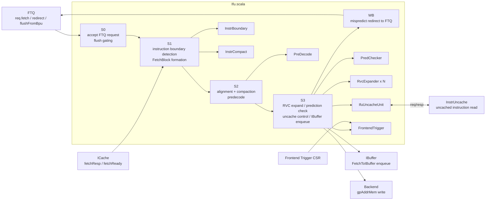
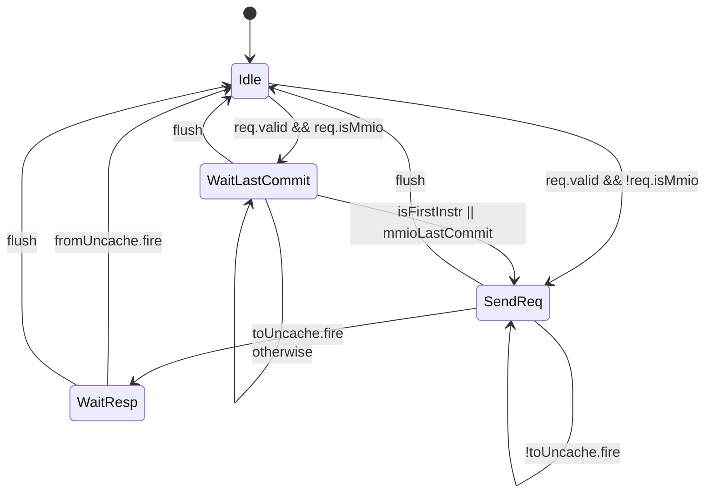
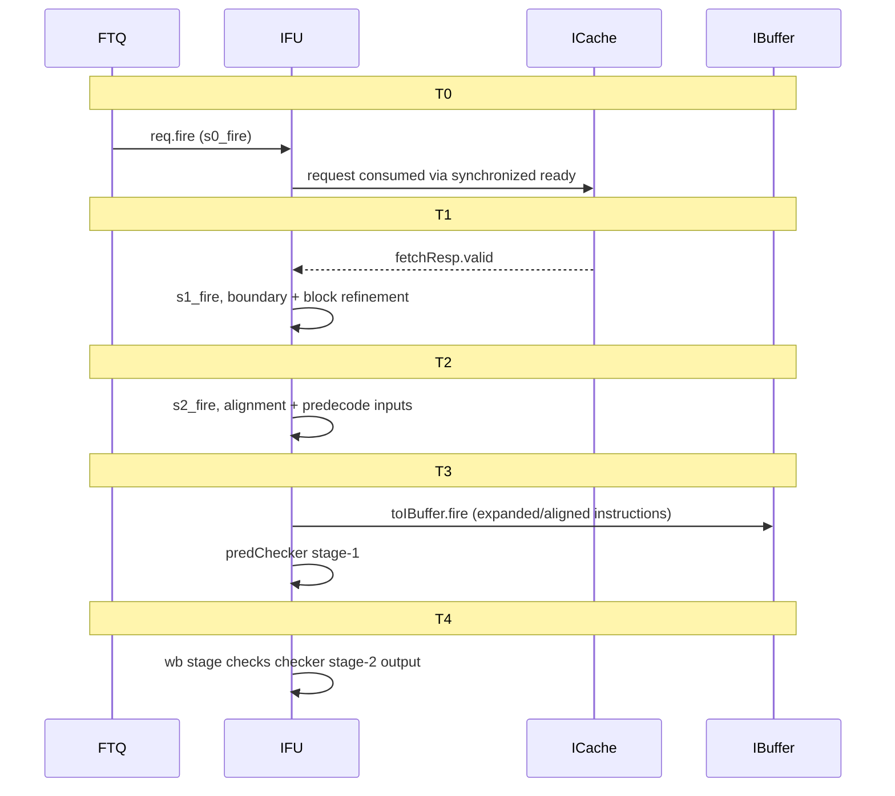

# Chapter 8a. XiangShan Instruction Fetch Unit Implementation

Chapter 8 introduced the conceptual foundations of the instruction fetch unit: why raw cache bytes
cannot be fed directly to decode, how boundary detection recovers instruction starts under
variable-length encoding, why compaction and alignment maximize downstream utilization, how early
prediction verification shortens wrong-path residency, and why uncached/MMIO fetches require a
dedicated control machine. This companion chapter maps those concepts onto Kunminghu's concrete
implementation.

### Block Diagram: IFU in the Kunminghu Frontend

Primary implementation anchors are [Ifu.scala:48](src/main/scala/xiangshan/frontend/ifu/Ifu.scala#L48), [Bundles.scala:139](src/main/scala/xiangshan/frontend/Bundles.scala#L139), [Bundles.scala:327](src/main/scala/xiangshan/frontend/Bundles.scala#L327), and [Frontend.scala:220](src/main/scala/xiangshan/frontend/Frontend.scala#L220).

---

## 8a.1 Design Intent

A minimal fetch unit could forward cacheline bytes directly to decode. Kunminghu IFU is more sophisticated because it must solve four coupled problems:

1. Variable-length instruction boundary reconstruction under speculative control flow.
2. Alignment and packing into IBuffer enqueue lanes.
3. Early detection of prediction faults before backend execution.
4. Correct handling of uncached/MMIO instruction fetches.

Key design choices appear in [Ifu.scala:83](src/main/scala/xiangshan/frontend/ifu/Ifu.scala#L83) through [Ifu.scala:91](src/main/scala/xiangshan/frontend/ifu/Ifu.scala#L91), where IFU is built as a pipeline plus helper modules (`InstrBoundary`, `InstrCompact`, `PreDecode`, `PredChecker`, `IfuUncacheUnit`).

Terminology used in this chapter (see Appendix F):

- **Fetch block**: a predicted instruction region rooted at `startVAddr`, represented by `FetchRequestBundle` and expanded into `FetchBlockInfo` [Bundles.scala:72](src/main/scala/xiangshan/frontend/Bundles.scala#L72), [Bundles.scala:65](src/main/scala/xiangshan/frontend/ifu/Bundles.scala#L65).
- **Instruction boundary detection**: logic that reconstructs instruction starts/ends under RVC and half-instruction carry-over [InstrBoundary.scala:23](src/main/scala/xiangshan/frontend/ifu/InstrBoundary.scala#L23).
- **Prediction check redirect**: IFU-generated correction when predecode and predicted control-flow disagree [PredChecker.scala:223](src/main/scala/xiangshan/frontend/ifu/PredChecker.scala#L223).
- **Uncache fetch**: instruction fetch through `InstrUncache` path for MMIO or NC memory attributes [IfuUncacheUnit.scala:30](src/main/scala/xiangshan/frontend/ifu/IfuUncacheUnit.scala#L30).

### Design Trade-off 8a.1: Early IFU Checking vs Backend-Only Checking

Chosen design (Kunminghu):

- Predecode and fault checking occur in IFU, then redirect is sent to FTQ from IFU write-back [Ifu.scala:744](src/main/scala/xiangshan/frontend/ifu/Ifu.scala#L744), [Ifu.scala:778](src/main/scala/xiangshan/frontend/ifu/Ifu.scala#L778).
- Benefit: shorter wrong-path residency and better frontend recovery latency.
- Cost: more IFU complexity and additional stage-local state (e.g., half-instruction handling, checker masks).

Alternative:

- Do only backend resolve-time correction.
- Simpler IFU but larger wasted frontend bandwidth and longer redirect penalty.

---

## 8a.2 From Simple Model to Kunminghu IFU

### Layer 1: accept predicted fetch blocks and synchronize with ICache

IFU receives FTQ requests through `FtqToIfuIO.req` and accepts only when both IFU and ICache are ready [Ifu.scala:132](src/main/scala/xiangshan/frontend/ifu/Ifu.scala#L132), [Frontend.scala:221](src/main/scala/xiangshan/frontend/Frontend.scala#L221), [Frontend.scala:230](src/main/scala/xiangshan/frontend/Frontend.scala#L230). ICache returns responses via a `Valid` channel plus explicit `fetchReady` [Bundles.scala:120](src/main/scala/xiangshan/frontend/Bundles.scala#L120), [ICacheImp.scala:216](src/main/scala/xiangshan/frontend/icache/ICacheImp.scala#L216), [ICacheImp.scala:219](src/main/scala/xiangshan/frontend/icache/ICacheImp.scala#L219).

### Layer 2: recover true instruction boundaries under RVC and split-block cases

`InstrBoundary` computes `instrValid`, `instrEndVec`, and half-instruction flags [InstrBoundary.scala:33](src/main/scala/xiangshan/frontend/ifu/InstrBoundary.scala#L33), [InstrBoundary.scala:81](src/main/scala/xiangshan/frontend/ifu/InstrBoundary.scala#L81), [InstrBoundary.scala:90](src/main/scala/xiangshan/frontend/ifu/InstrBoundary.scala#L90). IFU tracks previous-half state (`s1_prevLastIsHalfRvi`, `s2_prevLastHalfData`) to correctly reconstruct cross-boundary 32-bit instructions [Ifu.scala:174](src/main/scala/xiangshan/frontend/ifu/Ifu.scala#L174), [Ifu.scala:299](src/main/scala/xiangshan/frontend/ifu/Ifu.scala#L299), [Ifu.scala:363](src/main/scala/xiangshan/frontend/ifu/Ifu.scala#L363).

### Layer 3: compact, align, and predecode before enqueue

`InstrCompact` maps sparse raw instruction positions into compact enqueue order [InstrCompact.scala:29](src/main/scala/xiangshan/frontend/ifu/InstrCompact.scala#L29), [InstrCompact.scala:68](src/main/scala/xiangshan/frontend/ifu/InstrCompact.scala#L68). IFU then aligns packed data by previous enqueue pointer [Ifu.scala:327](src/main/scala/xiangshan/frontend/ifu/Ifu.scala#L327), [Helpers.scala:101](src/main/scala/xiangshan/frontend/ifu/Helpers.scala#L101). `PreDecode` generates branch attributes and jump offsets [PreDecode.scala:26](src/main/scala/xiangshan/frontend/ifu/PreDecode.scala#L26), [PreDecode.scala:57](src/main/scala/xiangshan/frontend/ifu/PreDecode.scala#L57).

### Layer 4: verify prediction and repair speculation

`PredChecker` compares predicted-taken/target against predecode reality and emits correction redirect [PredChecker.scala:95](src/main/scala/xiangshan/frontend/ifu/PredChecker.scala#L95), [PredChecker.scala:148](src/main/scala/xiangshan/frontend/ifu/PredChecker.scala#L148), [PredChecker.scala:223](src/main/scala/xiangshan/frontend/ifu/PredChecker.scala#L223). IFU write-back sends `wbRedirect` to FTQ [Ifu.scala:778](src/main/scala/xiangshan/frontend/ifu/Ifu.scala#L778).

### Layer 5: uncached/MMIO instruction fetch as a controlled side path

IFU marks uncached requests by `pmpMmio` or PBMT NC through `ICacheMeta.isUncache` [Bundles.scala:121](src/main/scala/xiangshan/frontend/ifu/Bundles.scala#L121). `IfuUncacheUnit` serializes request/response and commit-order constraints [IfuUncacheUnit.scala:60](src/main/scala/xiangshan/frontend/ifu/IfuUncacheUnit.scala#L60), [IfuUncacheUnit.scala:91](src/main/scala/xiangshan/frontend/ifu/IfuUncacheUnit.scala#L91), [IfuUncacheUnit.scala:148](src/main/scala/xiangshan/frontend/ifu/IfuUncacheUnit.scala#L148).

---

## 8a.3 Parameters and Derived Quantities

### 8a.3.1 IFU-relevant configurable parameters

| Parameter | Default | Defined In | Effect on IFU |
| --- | --- | --- | --- |
| `FrontendParameters.FetchBlockSize` | `64` bytes | [FrontendParameters.scala:27](src/main/scala/xiangshan/frontend/FrontendParameters.scala#L27) | Determines max instructions represented per fetch block. |
| `FrontendParameters.FetchPorts` | `2` | [FrontendParameters.scala:29](src/main/scala/xiangshan/frontend/FrontendParameters.scala#L29) | IFU request vector width (`fetch(0..1)`). |
| `IfuParameters.PcCutPoint` | `None` | [Parameters.scala:21](src/main/scala/xiangshan/frontend/ifu/Parameters.scala#L21) | Controls PC split/reconstruction cut bit for `catPC`. |
| `IBufferParameters.NumWriteBank` | `4` | [Parameters.scala:22](src/main/scala/xiangshan/frontend/ibuffer/Parameters.scala#L22) | Sets IFU pre-alignment width (`IfuAlignWidth`). |

### 8a.3.2 Derived IFU geometry (from defaults)

| Quantity | Formula | Value / Meaning |
| --- | --- | --- |
| `FetchBlockInstNum` | `FetchBlockSize / instBytes` | `64 / 2 = 32` instruction slots (16-bit granularity) [FrontendParameters.scala:78](src/main/scala/xiangshan/frontend/FrontendParameters.scala#L78). |
| `IBufferEnqueueWidth` | `FetchBlockInstNum + NumWriteBank` | `32 + 4 = 36` enqueue lanes [FrontendParameters.scala:87](src/main/scala/xiangshan/frontend/FrontendParameters.scala#L87). |
| `IfuAlignWidth` | `NumWriteBank` | `4`, used by shift-alignment masks [Parameters.scala:31](src/main/scala/xiangshan/frontend/ifu/Parameters.scala#L31). |
| `IfuIdxWidth` | `log2Ceil(IBufferEnqueueWidth)` | index width for IFU-local compacted slots [Parameters.scala:32](src/main/scala/xiangshan/frontend/ifu/Parameters.scala#L32). |
| `PcCutPoint` | `PcCutPoint.getOrElse((VAddrBits/4)-1)` | default PC split point [Parameters.scala:30](src/main/scala/xiangshan/frontend/ifu/Parameters.scala#L30). |

Note: `FtqToIfuIO` currently drives `fetch(1)` as zero in FTQ [Ftq.scala:275](src/main/scala/xiangshan/frontend/ftq/Ftq.scala#L275). IFU retains dual-fetch-capable logic for future/alternative front-end modes.

---

## 8a.4 IFU Module Boundary and I/O

### 8a.4.1 IFU top-level ports (`IfuIO`)

Primary definition: [Ifu.scala:55](src/main/scala/xiangshan/frontend/ifu/Ifu.scala#L55).

| Port Name | Direction | Width/Type | Description |
| --- | --- | --- | --- |
| `fromFtq` | Input | `FtqToIfuIO` | Fetch requests, backend redirect mirror, BPU flush info [Bundles.scala:139](src/main/scala/xiangshan/frontend/Bundles.scala#L139). |
| `toFtq` | Output | `IfuToFtqIO` | IFU write-back redirect and MMIO commit-read handshake [Bundles.scala:161](src/main/scala/xiangshan/frontend/Bundles.scala#L161). |
| `fromICache` | Input | `ICacheToIfuIO` | ICache response payload, perf, topdown, and readiness [Bundles.scala:120](src/main/scala/xiangshan/frontend/Bundles.scala#L120). |
| `toICache` | Output | `IfuToICacheIO` | IFU stall feedback to ICache main pipe [Bundles.scala:127](src/main/scala/xiangshan/frontend/Bundles.scala#L127). |
| `toUncache` | Output | `IfuToInstrUncacheIO` | Uncached/MMIO instruction fetch request channel [Bundles.scala:131](src/main/scala/xiangshan/frontend/Bundles.scala#L131). |
| `fromUncache` | Input | `InstrUncacheToIfuIO` | Uncached instruction response channel [Bundles.scala:135](src/main/scala/xiangshan/frontend/Bundles.scala#L135). |
| `toIBuffer` | Output | `Decoupled[FetchToIBuffer]` | Main IFU output stream to IBuffer [Bundles.scala:327](src/main/scala/xiangshan/frontend/Bundles.scala#L327). |
| `toBackend` | Output | `IfuToBackendIO` | GPAddr metadata write path for guest page-fault support [Bundles.scala:351](src/main/scala/xiangshan/frontend/Bundles.scala#L351). |
| `frontendTrigger` | Input | `FrontendTdataDistributeIO` | Debug trigger configuration path [Ifu.scala:75](src/main/scala/xiangshan/frontend/ifu/Ifu.scala#L75). |
| `csrFsIsOff` | Input | `Bool` | Controls RVC expansion legality for floating-point compressed forms [Ifu.scala:78](src/main/scala/xiangshan/frontend/ifu/Ifu.scala#L78), [RvcExpander.scala:25](src/main/scala/xiangshan/frontend/ifu/RvcExpander.scala#L25). |

### 8a.4.2 Key IFU boundary schematic (signals and types)

| Signal (as RTL name) | Width/Type | Producer -> Consumer | Notes |
| --- | --- | --- | --- |
| `fromFtq.req.bits.fetch` | `Vec(FetchPorts, FetchRequestBundle)` | FTQ -> IFU | Predicted fetch blocks (`startVAddr`, `nextStartVAddr`, `ftqIdx`, `takenCfiOffset`) [Bundles.scala:141](src/main/scala/xiangshan/frontend/Bundles.scala#L141), [Bundles.scala:72](src/main/scala/xiangshan/frontend/Bundles.scala#L72). |
| `fromFtq.flushFromBpu` | `BpuFlushInfo` | FTQ -> IFU | Stage-aware flush filtering (`s3`) [Bundles.scala:58](src/main/scala/xiangshan/frontend/ftq/Bundles.scala#L58). |
| `fromICache.fetchResp.bits` | `ICacheRespBundle` | ICache -> IFU | Contains bytes, maybe-RVC map, paddr, exception, pbmt/mmio [Bundles.scala:184](src/main/scala/xiangshan/frontend/icache/Bundles.scala#L184). |
| `toICache.stall` | `Bool` | IFU -> ICache | Backpressure from IFU stage-2 readiness [Ifu.scala:190](src/main/scala/xiangshan/frontend/ifu/Ifu.scala#L190). |
| `toIBuffer.bits` | `FetchToIBuffer` | IFU -> IBuffer | Expanded/aligned instructions, valid masks, PCs, exception metadata [Bundles.scala:327](src/main/scala/xiangshan/frontend/Bundles.scala#L327). |
| `toFtq.wbRedirect` | `Valid(FrontendRedirect)` | IFU -> FTQ | Prediction-check or uncache-driven redirect [Ifu.scala:778](src/main/scala/xiangshan/frontend/ifu/Ifu.scala#L778). |
| `toFtq.mmioCommitRead` | `MmioCommitRead` | IFU -> FTQ | Commit-order guard for MMIO fetch serialization [Ifu.scala:538](src/main/scala/xiangshan/frontend/ifu/Ifu.scala#L538). |

### 8a.4.3 Submodule interface tables (major IFU internals)

`PreDecode`:

| Port Name | Direction | Width/Type | Description |
| --- | --- | --- | --- |
| `req` | Input | `Valid[PreDecodeReq]` | Aligned instruction words, RVC bits, validity mask [PreDecode.scala:39](src/main/scala/xiangshan/frontend/ifu/PreDecode.scala#L39). |
| `resp.pd` | Output | `Vec[PreDecodeInfo]` | Decoded branch attributes and RVC markers [PreDecode.scala:34](src/main/scala/xiangshan/frontend/ifu/PreDecode.scala#L34). |
| `resp.jumpOffset` | Output | `Vec[PrunedAddr]` | Per-instruction branch/jump offset used by checker [PreDecode.scala:36](src/main/scala/xiangshan/frontend/ifu/PreDecode.scala#L36). |

`PredChecker`:

| Port Name | Direction | Width/Type | Description |
| --- | --- | --- | --- |
| `req` | Input | `Valid[PredCheckerReq]` | Predecode outputs + predicted taken/target context [PredChecker.scala:32](src/main/scala/xiangshan/frontend/ifu/PredChecker.scala#L32). |
| `resp.stage1Out.fixedTwoFetchRange` | Output | `Vec[Bool]` | Front-end remask result for valid enqueue window [PredChecker.scala:55](src/main/scala/xiangshan/frontend/ifu/PredChecker.scala#L55). |
| `resp.stage2Out.checkerRedirect` | Output | `Valid[PredCheckRedirect]` | Mispredict correction packet for IFU write-back [PredChecker.scala:60](src/main/scala/xiangshan/frontend/ifu/PredChecker.scala#L60). |

`IfuUncacheUnit`:

| Port Name | Direction | Width/Type | Description |
| --- | --- | --- | --- |
| `req` | Input | `Decoupled[IfuUncacheReq]` | Uncache request with `ftqIdx`, PBMT, MMIO flag, paddr [IfuUncacheUnit.scala:43](src/main/scala/xiangshan/frontend/ifu/IfuUncacheUnit.scala#L43). |
| `resp` | Output | `Valid[IfuUncacheResp]` | Returned instruction word, exception, cross-page flag [IfuUncacheUnit.scala:44](src/main/scala/xiangshan/frontend/ifu/IfuUncacheUnit.scala#L44). |
| `mmioCommitRead` | In/Out | `MmioCommitRead` | Wait-until-commit protocol for MMIO ordering [IfuUncacheUnit.scala:48](src/main/scala/xiangshan/frontend/ifu/IfuUncacheUnit.scala#L48). |
| `toUncache` / `fromUncache` | In/Out | `IfuToInstrUncacheIO` / `InstrUncacheToIfuIO` | External uncache transport [IfuUncacheUnit.scala:50](src/main/scala/xiangshan/frontend/ifu/IfuUncacheUnit.scala#L50). |

---

## 8a.5 Stage-by-Stage Data Flow

### 8a.5.1 Stage 0 (`s0`): request capture and flush qualification

`S0` takes FTQ requests and computes flush conditions from backend redirect and BPU stage-3 flush [Ifu.scala:117](src/main/scala/xiangshan/frontend/ifu/Ifu.scala#L117), [Ifu.scala:126](src/main/scala/xiangshan/frontend/ifu/Ifu.scala#L126), [Ifu.scala:130](src/main/scala/xiangshan/frontend/ifu/Ifu.scala#L130). It also derives merged fetch ranges for potential two-block composition [Ifu.scala:141](src/main/scala/xiangshan/frontend/ifu/Ifu.scala#L141), [Ifu.scala:143](src/main/scala/xiangshan/frontend/ifu/Ifu.scala#L143).

### 8a.5.2 Stage 1 (`s1`): boundary detection and block metadata refinement

`S1` waits for both stage readiness and `fromICache.valid` [Ifu.scala:185](src/main/scala/xiangshan/frontend/ifu/Ifu.scala#L185), [Ifu.scala:187](src/main/scala/xiangshan/frontend/ifu/Ifu.scala#L187). It verifies response consistency (`iCacheMatchAssert`) [Ifu.scala:191](src/main/scala/xiangshan/frontend/ifu/Ifu.scala#L191), [Helpers.scala:51](src/main/scala/xiangshan/frontend/ifu/Helpers.scala#L51).

Then IFU calls `InstrBoundary` to derive instruction-valid and instruction-end vectors under RVC and cross-block half-instruction conditions [Ifu.scala:199](src/main/scala/xiangshan/frontend/ifu/Ifu.scala#L199), [InstrBoundary.scala:69](src/main/scala/xiangshan/frontend/ifu/InstrBoundary.scala#L69). `predTakenIdx` and `invalidTaken` are computed and attached into `s1_realFetchBlock` [Ifu.scala:251](src/main/scala/xiangshan/frontend/ifu/Ifu.scala#L251), [Ifu.scala:261](src/main/scala/xiangshan/frontend/ifu/Ifu.scala#L261).

### 8a.5.3 Stage 2 (`s2`): alignment, compaction, predecode prep

`S2` performs lane alignment based on previous IBuffer enqueue pointer (`s2_prevIBufEnqPtr`) [Ifu.scala:285](src/main/scala/xiangshan/frontend/ifu/Ifu.scala#L285), [Ifu.scala:332](src/main/scala/xiangshan/frontend/ifu/Ifu.scala#L332). It reconstructs complete 32-bit words for boundary-spanning instructions [Ifu.scala:363](src/main/scala/xiangshan/frontend/ifu/Ifu.scala#L363).

Predecode inputs are issued at [Ifu.scala:396](src/main/scala/xiangshan/frontend/ifu/Ifu.scala#L396). Uncache classification is also determined here (`s2_reqIsUncache`, `s2_useUncacheFetch`) [Ifu.scala:404](src/main/scala/xiangshan/frontend/ifu/Ifu.scala#L404), [Ifu.scala:406](src/main/scala/xiangshan/frontend/ifu/Ifu.scala#L406).

### 8a.5.4 Stage 3 (`s3`): expansion, prediction check, enqueue, uncache handling

`S3` uses `ValidHold` for stall-safe progression [Ifu.scala:557](src/main/scala/xiangshan/frontend/ifu/Ifu.scala#L557), and sends predecode context into `PredChecker` [Ifu.scala:569](src/main/scala/xiangshan/frontend/ifu/Ifu.scala#L569).

RVC expansion is performed per lane using Rocket `RVCDecoder` wrapper [Ifu.scala:450](src/main/scala/xiangshan/frontend/ifu/Ifu.scala#L450), [RvcExpander.scala:32](src/main/scala/xiangshan/frontend/ifu/RvcExpander.scala#L32).

IFU emits `FetchToIBuffer` at [Ifu.scala:593](src/main/scala/xiangshan/frontend/ifu/Ifu.scala#L593). Exception metadata and offsets are resolved at [Ifu.scala:633](src/main/scala/xiangshan/frontend/ifu/Ifu.scala#L633) and [Ifu.scala:643](src/main/scala/xiangshan/frontend/ifu/Ifu.scala#L643).

For uncached requests, IFU issues through `IfuUncacheUnit` [Ifu.scala:530](src/main/scala/xiangshan/frontend/ifu/Ifu.scala#L530), merges response semantics (including cross-page handling), and emits a dedicated redirect/writeback behavior [Ifu.scala:692](src/main/scala/xiangshan/frontend/ifu/Ifu.scala#L692), [Ifu.scala:732](src/main/scala/xiangshan/frontend/ifu/Ifu.scala#L732).

### 8a.5.5 IFU write-back (`wb`): redirect generation to FTQ

After checker stage-2 latency, IFU builds `checkFlushWb` and selects between normal checker redirect and uncache redirect [Ifu.scala:762](src/main/scala/xiangshan/frontend/ifu/Ifu.scala#L762), [Ifu.scala:778](src/main/scala/xiangshan/frontend/ifu/Ifu.scala#L778). This closes the IFU-local correction loop with FTQ.

---

## 8a.6 Prediction Checking and Redirect Logic

The checker pipeline is intentionally split:

1. Stage-1 computes remask/fixed range and fixed taken mask [PredChecker.scala:104](src/main/scala/xiangshan/frontend/ifu/PredChecker.scala#L104), [PredChecker.scala:148](src/main/scala/xiangshan/frontend/ifu/PredChecker.scala#L148).
2. Stage-2 emits a single redirect packet with corrected `taken`, `target`, and `attribute` [PredChecker.scala:223](src/main/scala/xiangshan/frontend/ifu/PredChecker.scala#L223).

Fault classes are encoded by `PreDecodeFaultType` [Bundles.scala:43](src/main/scala/xiangshan/frontend/ifu/Bundles.scala#L43):

- `JalFault`
- `JalrFault`
- `RetFault`
- `TargetFault`
- `NotCfiFault`
- `InvalidTaken`

This split lets IFU both constrain enqueue side effects immediately (stage-1 output to IBuffer path) and issue precise FTQ redirect metadata one cycle later.

### Worked Example 8a.1: `NotCfiFault` correction

Scenario:

1. BPU predicts taken at slot `k` in fetch block 0.
2. Predecode marks slot `k` as non-CFI (`pd.notCFI = true`).
3. `PredChecker` raises stage-1 fault (`notCfiTaken(k)`), remasks range, and stage-2 emits redirect.
4. Redirect target becomes sequential PC (`seqTargets`) rather than branch target.

Implementation path: [PredChecker.scala:115](src/main/scala/xiangshan/frontend/ifu/PredChecker.scala#L115), [PredChecker.scala:129](src/main/scala/xiangshan/frontend/ifu/PredChecker.scala#L129), [PredChecker.scala:189](src/main/scala/xiangshan/frontend/ifu/PredChecker.scala#L189), [PredChecker.scala:224](src/main/scala/xiangshan/frontend/ifu/PredChecker.scala#L224).

---

## 8a.7 Uncache/MMIO Fetch Path and FSM

`IfuUncacheUnit` is the explicit control machine for uncached instruction access.

### 8a.7.1 FSM definition

States are defined in [IfuUncacheUnit.scala:60](src/main/scala/xiangshan/frontend/ifu/IfuUncacheUnit.scala#L60):

- `Idle`
- `WaitLastCommit`
- `SendReq`
- `WaitResp`

Transition logic: [IfuUncacheUnit.scala:91](src/main/scala/xiangshan/frontend/ifu/IfuUncacheUnit.scala#L91), [IfuUncacheUnit.scala:101](src/main/scala/xiangshan/frontend/ifu/IfuUncacheUnit.scala#L101), [IfuUncacheUnit.scala:109](src/main/scala/xiangshan/frontend/ifu/IfuUncacheUnit.scala#L109), [IfuUncacheUnit.scala:113](src/main/scala/xiangshan/frontend/ifu/IfuUncacheUnit.scala#L113).

### 8a.7.2 IFU integration behavior

- Stage-3 issues uncache request only when not busy [Ifu.scala:530](src/main/scala/xiangshan/frontend/ifu/Ifu.scala#L530).
- While waiting, IFU can bubble on `s3_reqIsUncache && !s3_uncacheCanGo` [Ifu.scala:503](src/main/scala/xiangshan/frontend/ifu/Ifu.scala#L503).
- On response, IFU injects one instruction into IBuffer and emits redirect/writeback semantics specific to uncache flow [Ifu.scala:725](src/main/scala/xiangshan/frontend/ifu/Ifu.scala#L725), [Ifu.scala:732](src/main/scala/xiangshan/frontend/ifu/Ifu.scala#L732).

### Worked Example 8a.2: MMIO instruction fetch ordering

Scenario:

1. IFU classifies fetch as MMIO (`pmpMmio = true` or PBMT uncache) and routes to uncache path.
2. `IfuUncacheUnit` enters `WaitLastCommit` when needed.
3. FTQ supplies `mmioLastCommit`, then unit sends request.
4. After response, IFU enqueues one instruction and redirects to next sequential PC.

Anchors: [Ifu.scala:533](src/main/scala/xiangshan/frontend/ifu/Ifu.scala#L533), [Ifu.scala:538](src/main/scala/xiangshan/frontend/ifu/Ifu.scala#L538), [IfuUncacheUnit.scala:101](src/main/scala/xiangshan/frontend/ifu/IfuUncacheUnit.scala#L101), [IfuUncacheUnit.scala:149](src/main/scala/xiangshan/frontend/ifu/IfuUncacheUnit.scala#L149), [Ifu.scala:697](src/main/scala/xiangshan/frontend/ifu/Ifu.scala#L697).

---

## 8a.8 Timing and Pipeline Diagrams

### 8a.8.1 Common case: cached fetch hit with no redirect

Supporting logic: [Ifu.scala:115](src/main/scala/xiangshan/frontend/ifu/Ifu.scala#L115), [Ifu.scala:187](src/main/scala/xiangshan/frontend/ifu/Ifu.scala#L187), [Ifu.scala:289](src/main/scala/xiangshan/frontend/ifu/Ifu.scala#L289), [Ifu.scala:437](src/main/scala/xiangshan/frontend/ifu/Ifu.scala#L437), [Ifu.scala:744](src/main/scala/xiangshan/frontend/ifu/Ifu.scala#L744).

### 8a.8.2 Misprediction discovered by IFU checker

| Cycle | Event | Key signals |
| --- | --- | --- |
| `T0` | FTQ request accepted | `s0_fire` [Ifu.scala:115](src/main/scala/xiangshan/frontend/ifu/Ifu.scala#L115) |
| `T1` | ICache response consumed | `s1_fire` [Ifu.scala:187](src/main/scala/xiangshan/frontend/ifu/Ifu.scala#L187) |
| `T2` | Predecode context formed | `preDecoderIn.valid` [Ifu.scala:396](src/main/scala/xiangshan/frontend/ifu/Ifu.scala#L396) |
| `T3` | Checker stage-1 decides fixed range | `checkerIn.valid` [Ifu.scala:569](src/main/scala/xiangshan/frontend/ifu/Ifu.scala#L569) |
| `T4` | Checker stage-2 redirect produced | `checkFlushWb.valid` [Ifu.scala:767](src/main/scala/xiangshan/frontend/ifu/Ifu.scala#L767) |
| `T4+` | FTQ receives `wbRedirect`, triggers global correction | `toFtq.wbRedirect` [Ifu.scala:778](src/main/scala/xiangshan/frontend/ifu/Ifu.scala#L778) |

### 8a.8.3 Uncache/MMIO timeline (simplified)

| Phase | IFU/Uncache behavior |
| --- | --- |
| classify | `s3_reqIsUncache` asserted [Ifu.scala:497](src/main/scala/xiangshan/frontend/ifu/Ifu.scala#L497). |
| wait ordering | MMIO may wait for `mmioLastCommit` in `WaitLastCommit` [IfuUncacheUnit.scala:101](src/main/scala/xiangshan/frontend/ifu/IfuUncacheUnit.scala#L101). |
| request | `toUncache.valid` asserted in `SendReq` [IfuUncacheUnit.scala:131](src/main/scala/xiangshan/frontend/ifu/IfuUncacheUnit.scala#L131). |
| response | `uncacheFinish` drives IFU uncache response valid [IfuUncacheUnit.scala:125](src/main/scala/xiangshan/frontend/ifu/IfuUncacheUnit.scala#L125), [IfuUncacheUnit.scala:141](src/main/scala/xiangshan/frontend/ifu/IfuUncacheUnit.scala#L141). |
| completion | IFU injects single instruction and issues uncache redirect bookkeeping [Ifu.scala:725](src/main/scala/xiangshan/frontend/ifu/Ifu.scala#L725), [Ifu.scala:732](src/main/scala/xiangshan/frontend/ifu/Ifu.scala#L732). |

---

## 8a.9 Detailed Module Interactions

### 8a.9.1 FTQ-IFU-ICache handshake coupling

At frontend top level, FTQ request readiness is overridden so IFU and ICache consume in lockstep [Frontend.scala:221](src/main/scala/xiangshan/frontend/Frontend.scala#L221), [Frontend.scala:230](src/main/scala/xiangshan/frontend/Frontend.scala#L230). This avoids divergence where IFU sees a request that ICache does not.

### 8a.9.2 Exception and metadata flow to backend

IFU forwards guest physical address metadata only for guest page-fault case [Ifu.scala:669](src/main/scala/xiangshan/frontend/ifu/Ifu.scala#L669). Source fields originate from ICache response (`gpAddr`, `isForVSnonLeafPTE`) [Bundles.scala:200](src/main/scala/xiangshan/frontend/icache/Bundles.scala#L200), [Bundles.scala:201](src/main/scala/xiangshan/frontend/icache/Bundles.scala#L201).

### 8a.9.3 Trigger and debug integration

`FrontendTrigger` compares fetch PCs against trigger configuration and annotates each enqueue lane with `TriggerAction` [FrontendTrigger.scala:33](src/main/scala/xiangshan/frontend/ifu/FrontendTrigger.scala#L33), [FrontendTrigger.scala:69](src/main/scala/xiangshan/frontend/ifu/FrontendTrigger.scala#L69), [FrontendTrigger.scala:87](src/main/scala/xiangshan/frontend/ifu/FrontendTrigger.scala#L87).

---

## 8a.10 Design Trade-offs and Rationale

### Design Trade-off 8a.2: Compaction+alignment in IFU vs simpler fixed-position enqueue

Chosen:

- IFU computes compact indices (`InstrCompact`) and alignment shift before enqueue [InstrCompact.scala:45](src/main/scala/xiangshan/frontend/ifu/InstrCompact.scala#L45), [Ifu.scala:332](src/main/scala/xiangshan/frontend/ifu/Ifu.scala#L332).
- Benefit: better backend feed utilization despite variable instruction boundaries.
- Cost: wider combinational logic and control complexity.

Alternative:

- Forward raw positions with sparse valid bits and let IBuffer/backend compact later.
- Simpler IFU but higher downstream complexity and potentially larger bubbles.

### Design Trade-off 8a.3: Dedicated uncache FSM vs unified cache/uncache path

Chosen:

- `IfuUncacheUnit` isolates MMIO and NC semantics [IfuUncacheUnit.scala:30](src/main/scala/xiangshan/frontend/ifu/IfuUncacheUnit.scala#L30).
- Benefit: explicit ordering control and clearer exceptional flow.
- Cost: extra state and special-case handling in stage 3.

Alternative:

- Route everything through one unified ICache-like path.
- Cleaner top-level interface but harder to preserve MMIO ordering and cross-page corner correctness.

---

## 8a.11 Key Takeaways

- IFU is a four-stage micro-pipeline plus write-back repair stage, not a single fetch datapath.
- Instruction-boundary correctness under RVC and half-instruction carry is first-class logic in IFU.
- Prediction validation is split: stage-1 for enqueue masking, stage-2 for precise redirect generation.
- Uncached/MMIO instruction fetch is controlled by an explicit FSM with commit-order awareness.
- IFU-FTQ-ICache ready synchronization is deliberate to keep speculation bookkeeping consistent.

---

## 8a.12 Checkpoint Questions

1. Basic: Why does IFU need both `InstrBoundary` and `InstrCompact`, instead of only one of them?
2. Basic: What condition makes IFU drive `toICache.stall`, and why is this needed?
3. Intermediate: How does `invalidTaken` change redirect behavior compared with a normal target mismatch?
4. Intermediate: Why does IFU track `s2_prevLastHalfData` and `s2_prevLastHalfPc` across cycles?
5. Intermediate: Explain why `ftq.io.toIfu.req.ready` is synchronized with `icache.io.fromFtq.fetchReq.ready`.
6. Advanced: If `IBufferParameters.NumWriteBank` were doubled, what IFU structures and width calculations would change?
7. Advanced: Propose a modification to reduce uncache-induced bubbles while preserving MMIO ordering semantics.

---

## 8a.13 Further Reading

1. Alex Ramirez et al., "Fetching instruction streams," MICRO 2002. (Referenced by frontend README: [README.md:5](src/main/scala/xiangshan/frontend/README.md#L5))
2. Yasuo Ishii et al., "Rebasing instruction prefetching: An industry perspective," IEEE CAL 2020. (Referenced by frontend README: [README.md:7](src/main/scala/xiangshan/frontend/README.md#L7))
3. Yasuo Ishii et al., "Re-establishing fetch-directed instruction prefetching," ISPASS 2021. (Referenced by frontend README: [README.md:9](src/main/scala/xiangshan/frontend/README.md#L9))
4. RISC-V Unprivileged ISA Spec, compressed extension (for RVC boundary/expansion context).
5. Rocket Chip `RVCDecoder` implementation context used by XiangShan IFU expander [RvcExpander.scala:32](src/main/scala/xiangshan/frontend/ifu/RvcExpander.scala#L32).
