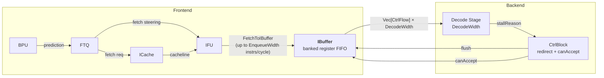
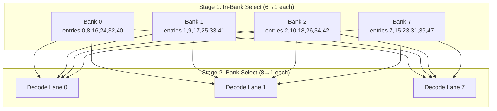

# Chapter 9. Instruction Buffer (IBuffer)

### Block Diagram: Instruction Buffer in Frontend Context



Every cycle, the IFU can deliver a burst of aligned, RVC-expanded instructions - sometimes many more than the decode stage can consume in one shot. Conversely, an ICache miss, TLB refill, or branch-misprediction recovery can starve the IFU for multiple cycles while the backend still has work in flight. Without a buffer between these two units, every IFU stall would directly stall decode, and every decode backpressure event would directly stall fetch. The **Instruction Buffer (IBuffer)** absorbs this timing mismatch: it is a decoupling FIFO that converts bursty, variable-width IFU output into a bounded `DecodeWidth` stream.

This role is analogous to a producer-consumer queue in software: the IFU produces instructions at an irregular rate, and decode consumes them at a regulated rate. The IBuffer smooths the flow so that neither side needs to wait unnecessarily for the other.

The implementation lives in a dedicated package at [IBuffer.scala:36](../../src/main/scala/xiangshan/frontend/ibuffer/IBuffer.scala#L36), with supporting types in [Bundles.scala:50](../../src/main/scala/xiangshan/frontend/ibuffer/Bundles.scala#L50), parameters in [Parameters.scala:22](../../src/main/scala/xiangshan/frontend/ibuffer/Parameters.scala#L22), and base classes in [Abstracts.scala:22](../../src/main/scala/xiangshan/frontend/ibuffer/Abstracts.scala#L22).

---

## 9.1 Why an Instruction Buffer Is Necessary

### 9.1.1 The rate mismatch problem

The IFU can produce up to `IBufferEnqueueWidth = FetchBlockInstNum + NumWriteBank` instructions per cycle ([FrontendParameters.scala:87](../../src/main/scala/xiangshan/frontend/FrontendParameters.scala#L87)). With the default `BaseConfig`/`TLConfig` parameters (`FetchBlockSize = 64`, `HasCExtension = true`, `NumWriteBank = 4`), this evaluates to 36. In `TLMinimalConfig`, `FetchBlockSize = 32`, so it evaluates to 20 ([Configs.scala:107](../../src/main/scala/top/Configs.scala#L107)). The decode stage consumes up to `DecodeWidth` per cycle (8 in default configs, 6 in `TLBackendV2Config` at [Configs.scala:511](../../src/main/scala/top/Configs.scala#L511)). Surplus instructions must be buffered.

### 9.1.2 Absorbing frontend stalls

When the ICache misses, the IFU produces nothing for several cycles. If the IBuffer has accumulated entries during previous surplus cycles, the decode stage can continue consuming from the buffer during the miss, partially hiding the cache miss latency from the backend. The deeper the buffer, the longer the backend can coast.

### 9.1.3 Absorbing backend stalls

When the backend stalls (e.g., the ROB is full, dispatch queues are congested, or a long-latency operation blocks commit), the `decodeCanAccept` signal goes low. The IBuffer holds instructions until the backend resumes, preventing the IFU from having to replay.

> **Design Trade-off: Buffer Depth**
>
> A deeper IBuffer smooths more variability and hides more frontend bubbles, but costs more register area. The default `IBufferParameters` depth is 48 ([Parameters.scala:23](../../src/main/scala/xiangshan/frontend/ibuffer/Parameters.scala#L23)). `TLMinimalConfig` overrides this to 24 ([Configs.scala:155](../../src/main/scala/top/Configs.scala#L155)). The right depth depends on fetch burstiness, decode width, and target timing/area.

---

## 9.2 Architectural Position

Recall from Chapter 4 that the frontend pipeline flows as:

```
BPU → FTQ → ICache → IFU → IBuffer → Decode
```

The IBuffer is the final frontend stage before instructions cross into the backend. Its input interface receives a `FetchToIBuffer` packet from the IFU (described in Chapter 8), and its output interface presents `Vec[DecoupledIO[CtrlFlow]]` to the decode stage (covered in Chapter 11). The IBuffer is instantiated in [Frontend.scala:138](../../src/main/scala/xiangshan/frontend/Frontend.scala#L138) and connected:

- **IFU → IBuffer**: `ifu.io.toIBuffer <> ibuffer.io.in` at [Frontend.scala:242](../../src/main/scala/xiangshan/frontend/Frontend.scala#L242)
- **IBuffer → Backend**: `io.backend.cfVec <> ibuffer.io.out` at [Frontend.scala:255](../../src/main/scala/xiangshan/frontend/Frontend.scala#L255)
- **Flush from backend**: `ibuffer.io.flush := needFlush` at [Frontend.scala:249](../../src/main/scala/xiangshan/frontend/Frontend.scala#L249), where `needFlush` is `RegNext(io.backend.toFtq.redirect.valid)`
- **Decode acceptance**: `ibuffer.io.decodeCanAccept := io.backend.canAccept` at [Frontend.scala:253](../../src/main/scala/xiangshan/frontend/Frontend.scala#L253)
- **Full signal**: `io.frontendInfo.ibufFull := RegNext(ibuffer.io.full)` at [Frontend.scala:269](../../src/main/scala/xiangshan/frontend/Frontend.scala#L269)

---

## 9.3 I/O Interface

The IBuffer's I/O is defined as an inner class `IBufferIO` at [IBuffer.scala:37](../../src/main/scala/xiangshan/frontend/ibuffer/IBuffer.scala#L37).

| Port | Direction | Type | Description |
|------|-----------|------|-------------|
| `flush` | Input | `Bool` | Flush from frontend control (`RegNext(redirect.valid)` in `Frontend.scala`). Resets pointers/output-valid state and clears pending exception metadata. |
| `in` | Input (Flipped Decoupled) | `FetchToIBuffer` | Handshaked instruction packet from IFU. Up to `EnqueueWidth` instructions per beat. |
| `out` | Output | `Vec[DecoupledIO[CtrlFlow]]` × `DecodeWidth` | Output lanes to backend decode path. Type is per-lane `DecoupledIO`, but dequeue progress is controlled by aggregate `decodeCanAccept`. |
| `full` | Output | `Bool` | Alias of `!allowEnq` (predictive backpressure). It is a throttling indicator, not a literal `numValid == Size` flag. |
| `decodeCanAccept` | Input | `Bool` | From backend `CtrlBlock`. When deasserted, IBuffer holds output stable and does not dequeue. |
| `bpuTopDownInfo` | Input | `BpuTopDownInfo` | Performance analysis: which BPU sub-predictor caused the most recent misprediction bubble. |
| `controlRedirect` | Input | `Bool` | Top-down: indicates the flush was caused by a control-flow redirect (branch misprediction). |
| `memVioRedirect` | Input | `Bool` | Top-down: indicates the flush was caused by a memory ordering violation. |
| `stallReason` | I/O | `StallReasonIO(DecodeWidth)` | Top-down stall analysis output. Reports per-lane stall cause to backend for performance attribution. |

### 9.3.1 Input bundle: `FetchToIBuffer`

The `FetchToIBuffer` bundle is defined at [Bundles.scala:327](../../src/main/scala/xiangshan/frontend/Bundles.scala#L327). It carries one fetch block's worth of instructions from the IFU:

| Field | Type | Width | Description |
|-------|------|-------|-------------|
| `instrs` | `Vec[UInt]` | `IBufferEnqueueWidth × 32` | RVC-expanded instruction encodings. |
| `valid` | `UInt` | `IBufferEnqueueWidth` bits | Bit mask indicating which instruction slots are valid. |
| `enqEnable` | `UInt` | `IBufferEnqueueWidth` bits | Subset of `valid` that should be enqueued after IFU filtering/checking. |
| `isRvc` | `Vec[Bool]` | `IBufferEnqueueWidth` | Marks which instructions were originally compressed. |
| `pc` | `Vec[PrunedAddr]` | `IBufferEnqueueWidth` entries | Per-instruction pruned virtual PC representation. |
| `foldpc` | `Vec[UInt]` | `IBufferEnqueueWidth × MemPredPCWidth` | Folded PC for memory dependence prediction. |
| `instrEndOffset` | `Vec[InstrEndOffset]` | `IBufferEnqueueWidth` entries | Per-instruction metadata: fetch-block offset, `predTaken`, `fixedTaken`. |
| `ftqPtr` | `Vec[FtqPtr]` | `IBufferEnqueueWidth` entries | FTQ pointer per instruction. |
| `exceptionType` | `ExceptionType` | `ExceptionType.Value()` | Fetch-group exception type (`None/Pf/Gpf/Af/Ill/Hwe`). |
| `exceptionOffset` | `UInt` | `log2Ceil(IBufferEnqueueWidth)` bits | Which instruction in the group carries the exception. |
| `exceptionCrossPage` | `Bool` | 1 | The excepting instruction spans a page boundary. |
| `isBackendException` | `Bool` | 1 | Exception was detected by backend TLB pre-check, not by the frontend. |
| `triggered` | `Vec[UInt]` | `IBufferEnqueueWidth × TriggerAction()` | Debug trigger match state for each instruction. |
| `isLastInFtqEntry` | `Vec[Bool]` | `IBufferEnqueueWidth` | Marks the last instruction belonging to each FTQ entry. |
| `prevIBufEnqPtr` | `IBufPtr` | circular pointer type | IFU's predicted enqueue pointer for cross-module consistency check. |
| `prevInstrCount` | `UInt` | `log2Ceil(IBufferEnqueueWidth)` bits | IFU's early estimate of next-cycle enqueue amount (used for predictive backpressure). |
| `debug_seqNum` | `Vec[InstSeqNum]` | `IBufferEnqueueWidth` entries | Sequence numbers for debug/perf tracing. |
| `topdownInfo` | `FrontendTopDownBundle` | — | Performance monitoring annotations from the frontend pipeline. |

### 9.3.2 Output bundle: `CtrlFlow`

Each output lane (`DecodeWidth` lanes) delivers a `CtrlFlow` bundle, defined at [Bundle.scala:94](../../src/main/scala/xiangshan/Bundle.scala#L94). The IBuffer converts its internal `IBufOutEntry` to `CtrlFlow` via the `toCtrlFlow` method at [Bundles.scala:133](../../src/main/scala/xiangshan/frontend/ibuffer/Bundles.scala#L133):

| Field | Type | Description |
|-------|------|-------------|
| `instr` | `UInt(32)` | 32-bit instruction encoding (already RVC-expanded). |
| `pc` | `UInt(VAddrBits)` | Full virtual address. |
| `foldpc` | `UInt(MemPredPCWidth)` | Folded PC for store-set prediction. |
| `exceptionVec` | `ExceptionVec()` | Bit vector with individual exception flags (`instrPageFault`, `instrGuestPageFault`, `instrAccessFault`, `illegalInstr`, `hardwareError`). |
| `backendException` | `Bool` | Exception originated from backend. |
| `trigger` | `TriggerAction()` | Debug trigger action bits. |
| `isRvc` | `Bool` | Was originally a 16-bit instruction. |
| `predTaken` | `Bool` | BPU predicted this branch as taken. |
| `fixedTaken` | `Bool` | Post-correction: branch is definitively taken (e.g., unconditional jump). |
| `crossPageIPFFix` | `Bool` | Instruction page fault spans a page boundary. |
| `ftqPtr` | `FtqPtr` | FTQ entry pointer (links back to the BPU for training on misprediction). |
| `ftqOffset` | `UInt` | Offset within the FTQ entry. |
| `isLastInFtqEntry` | `Bool` | Last instruction of this FTQ entry. |
| `storeSetHit`, `waitForRobIdx`, `loadWaitBit`, `loadWaitStrict`, `ssid` | various | Memory dependence prediction fields. Set to `DontCare` by IBuffer; filled later by the backend rename/dispatch stages. |
| `debug_seqNum` | `InstSeqNum` | Sequence number for trace/debug. |

---

## 9.4 Internal Organization: A Banked Register FIFO

The IBuffer is implemented as a circular queue of plain registers - not SRAM - with banked read logic to reduce read-mux fan-in. The code comment in [IBuffer.scala:62](../../src/main/scala/xiangshan/frontend/ibuffer/IBuffer.scala#L62) explicitly documents this choice: read/write-port behavior is tightly controlled in logic.

### 9.4.1 Storage array

The core storage is a register vector of `IBufEntry` elements at [IBuffer.scala:73](../../src/main/scala/xiangshan/frontend/ibuffer/IBuffer.scala#L73):

```
ibuf: Vec[IBufEntry] of size Size (default 48)
```

Each `IBufEntry` (defined at [Bundles.scala:50](../../src/main/scala/xiangshan/frontend/ibuffer/Bundles.scala#L50)) stores one instruction with its metadata:

| Field | Width | Description |
|-------|-------|-------------|
| `inst` | 32 bits | Instruction encoding (RVC-expanded). |
| `pc` | `VAddrBits` | Virtual PC. |
| `foldpc` | `MemPredPCWidth` | Folded PC for memory prediction. |
| `isRvc` | 1 bit | Originally compressed instruction. |
| `predTaken` | 1 bit | BPU prediction: taken. |
| `fixedTaken` | 1 bit | Definitively taken (unconditional branch/jump). |
| `ftqPtr` | `FtqPtr` | FTQ entry pointer. |
| `instrEndOffset` | `FetchBlockInstOffsetWidth` bits | Position within fetch block. |
| `triggered` | `TriggerAction()` | Debug trigger state. |
| `isLastInFtqEntry` | 1 bit | Last instruction of FTQ entry. |
| `debug_seqNum` | `InstSeqNum` | Sequence number. |

### 9.4.2 Banking for read efficiency

A naive circular queue of `Size` entries feeding `DecodeWidth` output ports would require wide flat multiplexers, which is expensive in area and timing. XiangShan instead uses a **two-stage banked read** organization.

The entries are logically partitioned into `NumReadBank` banks, each containing `ReadBankSize` entries (`8 × 6` in the default parameter set). The key insight is that in any single dequeue operation of up to `DecodeWidth` instructions, **at most one instruction comes from each bank** (because entries are stored sequentially across banks in round-robin order). This is exploited to decompose each flat read mux into a two-stage tree:

**Stage 1** — Within each read bank, a `ReadBankSize`-to-1 mux selects the active entry using the in-bank pointer:

```
readStage1[bankID] = Mux1H(deqInBankPtr[bankID], bankedIBufView[bankID])
```

This is implemented at [IBuffer.scala:287–288](../../src/main/scala/xiangshan/frontend/ibuffer/IBuffer.scala#L287).

**Stage 2** — For each decode output lane, a `NumReadBank`-to-1 mux selects from bank outputs:

```
deqEntries[i] = Mux1H(deqBankPtrVec[i], readStage1)
```

This is at [IBuffer.scala:291](../../src/main/scala/xiangshan/frontend/ibuffer/IBuffer.scala#L291).

Compared with a flat `Size`-to-1 mux per output lane, this structure keeps each mux local to either in-bank selection or bank selection. The cost is extra pointer bookkeeping (`deqBankPtrVec` and `deqInBankPtr`).

The following concrete layout is the default `Size=48, NumReadBank=8` example:



The banking layout maps entry index `n` to bank `n % NumReadBank` and in-bank offset `n / NumReadBank`. This is visible in the `bankedIBufView` construction at [IBuffer.scala:74–76](../../src/main/scala/xiangshan/frontend/ibuffer/IBuffer.scala#L74):

```
bankedIBufView(bankID)(inBankOffset) = ibuf(bankID + inBankOffset * NumReadBank)
```

### 9.4.3 Write banking

Enqueue uses a separate banking scheme with `NumWriteBank` = 4 banks. Each bank handles a subset of the incoming instruction slots, reducing the write-port mux from `EnqueueWidth`-to-1 down to `(EnqueueWidth / NumWriteBank)`-to-1 per bank entry. The write-bank logic is at [IBuffer.scala:246–263](../../src/main/scala/xiangshan/frontend/ibuffer/IBuffer.scala#L246).

### 9.4.4 Pointer system

The circular queue is managed by three families of pointers:

| Pointer | Type | Count | Scope | Purpose |
|---------|------|-------|-------|---------|
| `enqPtrVec` | `IBufPtr` | `EnqueueWidth` | Full queue | Tracks where each incoming instruction would be written. |
| `deqPtrVec` | `IBufPtr` | `DecodeWidth` | Full queue | Global dequeue positions for each decode lane. |
| `deqBankPtrVec` | `IBufBankPtr` | `DecodeWidth` | Read-bank domain | Which bank each decode lane reads from. |
| `deqInBankPtr` | `IBufInBankPtr` | `NumReadBank` | In-bank domain | Position within each bank. |

The `IBufPtr`, `IBufBankPtr`, and `IBufInBankPtr` types are defined at [Bundles.scala:37–48](../../src/main/scala/xiangshan/frontend/ibuffer/Bundles.scala#L37). All three extend `CircularQueuePtr` with appropriate moduli.

---

## 9.5 Enqueue Logic

### 9.5.1 Data path

When the IFU delivers a fetch packet (`io.in.fire`), the IBuffer may write up to `EnqueueWidth` instructions into the circular queue. The enqueue data path works as follows:

1. **Compute enqueue offsets.** For each of the `EnqueueWidth` instruction slots, `enqOffset(i)` counts how many valid instructions appear before slot `i` — this is the logical position of slot `i` in the compacted stream. See [IBuffer.scala:137](../../src/main/scala/xiangshan/frontend/ibuffer/IBuffer.scala#L137).

2. **Create IBufEntry from fetch data.** The `fromFetch` method at [Bundles.scala:64](../../src/main/scala/xiangshan/frontend/ibuffer/Bundles.scala#L64) populates each entry's fields from the `FetchToIBuffer` bundle.

3. **Reorganize by write bank.** The enqueue data is reshaped into write-bank groups at [IBuffer.scala:139–148](../../src/main/scala/xiangshan/frontend/ibuffer/IBuffer.scala#L139) so that each bank's write logic only needs to consider `EnqueueWidth / NumWriteBank` candidate instructions.

4. **One-hot write selection.** For each position within each write bank, a one-hot vector determines which incoming instruction maps to that position. The write fires only if the one-hot is valid, `io.in.fire` is asserted, no flush is active, and the entry is not being bypassed. See [IBuffer.scala:249–254](../../src/main/scala/xiangshan/frontend/ibuffer/IBuffer.scala#L249).

### 9.5.2 Pointer update

After a successful enqueue, all enqueue pointers advance by `numTryEnq` (computed from `PopCount(io.in.bits.enqEnable)` when `io.in.valid`):

```
enqPtrVec := enqPtrVec.map(_ + numTryEnq)
```

This is at [IBuffer.scala:266–268](../../src/main/scala/xiangshan/frontend/ibuffer/IBuffer.scala#L266).

---

## 9.6 Dequeue Logic

### 9.6.1 How many instructions to dequeue

The IBuffer determines `numOut` — the number of instructions to dequeue — based on three cases at [IBuffer.scala:175–181](../../src/main/scala/xiangshan/frontend/ibuffer/IBuffer.scala#L175):

1. **Decode accepting** (`decodeCanAccept` = true): Dequeue the minimum of `DecodeWidth` and `numValid` (current buffer occupancy). If bypass is active (see Section 9.8), dequeue `numBypass` instead.

2. **Output register not full** (`outputEntriesIsNotFull`): Even when decode is not accepting, the IBuffer can pre-fill its output register with instructions up to the remaining capacity (`DecodeWidth - outputEntriesValidNum`).

3. **Neither**: Dequeue nothing (`numOut = 0`).

### 9.6.2 Two-stage banked read

The dequeue data path uses the two-stage mux described in Section 9.4.2. For each decode lane `i`:

- `deqEntries(i).valid` is set from `validVec`, which is derived from `outputEntriesValidNumNext`.
- `deqEntries(i).bits` is the Mux1H result from the bank-select stage.

### 9.6.3 Pointer advancement

After dequeue, three pointer families must advance:

- **Global dequeue pointers**: `deqPtrVec` advances by `numDeq` at [IBuffer.scala:295](../../src/main/scala/xiangshan/frontend/ibuffer/IBuffer.scala#L295).
- **Bank pointers**: `deqBankPtrVec` advances by `numDeq` at [IBuffer.scala:294](../../src/main/scala/xiangshan/frontend/ibuffer/IBuffer.scala#L294).
- **In-bank pointers**: Each bank's `deqInBankPtr` advances by 1 only if a dequeued instruction came from that bank. The logic at [IBuffer.scala:296–306](../../src/main/scala/xiangshan/frontend/ibuffer/IBuffer.scala#L296) computes this per-bank: it translates the bank index into a decode-lane index and checks whether `numOut` exceeds that index.

---

## 9.7 Flow Control and Backpressure

### 9.7.1 Predictive ready signal

A naive ready signal would check whether the buffer has enough free space to accept the incoming packet. But this creates a combinational loop: `io.in.ready` depends on `numValid`, which depends on `numDeq`, which depends on the decode stage, which operates in the same cycle.

XiangShan breaks this loop by using a **registered, predictive** ready signal. The key is at [IBuffer.scala:129–135](../../src/main/scala/xiangshan/frontend/ibuffer/IBuffer.scala#L129):

```
allowEnq := io.in.bits.prevInstrCount < nextNumInvalid
```

Here:
- `prevInstrCount` is an early IFU estimate used for the next cycle's ready decision (see IFU assignment in [Ifu.scala:609](../../src/main/scala/xiangshan/frontend/ifu/Ifu.scala#L609)).
- `nextNumInvalid` is the predicted number of free entries **next cycle** (computed as `Size - numValid - numEnq + numDeq`).

Because `allowEnq` is a register, it is stable at the start of the next cycle, providing clean timing for `io.in.ready`.

> **Worked Example: Predictive Backpressure**
>
> Suppose `Size = 48`, `numValid = 42`, `numEnq = 6`, `numDeq = 8`.
> - `nextNumValid = 42 + 6 - 8 = 40`
> - `nextNumInvalid = 48 - 40 = 8`
> - If IFU signals `prevInstrCount = 10` (it plans to send 10 next cycle):
>   - `10 < 8` is false → `allowEnq` becomes false → IFU is stalled next cycle.
> - If IFU signals `prevInstrCount = 6`:
>   - `6 < 8` is true → `allowEnq` stays true → IFU can proceed.

### 9.7.2 IFU enqueue pointer consistency check

To catch bugs where the IFU and IBuffer disagree about state, an assertion at [IBuffer.scala:106–108](../../src/main/scala/xiangshan/frontend/ibuffer/IBuffer.scala#L106) checks that the IFU's predicted enqueue pointer (`prevIBufEnqPtr`) matches the actual enqueue pointer. This is a runtime invariant check, not a flow-control mechanism.

### 9.7.3 The full signal

The `io.full` output is `!allowEnq` at [IBuffer.scala:365](../../src/main/scala/xiangshan/frontend/ibuffer/IBuffer.scala#L365). Because `allowEnq` is predictive, `io.full` means "enqueue is throttled" rather than "physical queue is completely full".

### 9.7.4 Occupancy tracking

Current occupancy is computed at [IBuffer.scala:122](../../src/main/scala/xiangshan/frontend/ibuffer/IBuffer.scala#L122):

```
numValid = distanceBetween(enqPtr, deqPtr)
```

where `distanceBetween` handles circular wraparound. This value drives both the flow control logic and the performance counters.

---

## 9.8 Bypass Path: One-Cycle Shortcut

When the IBuffer is empty and decode can accept instructions, there is no need to enqueue and then dequeue the same instructions. Instead, the IBuffer can **bypass** incoming instructions into `outputEntries`, avoiding the extra enqueue/dequeue round trip and saving one cycle.

### 9.8.1 Bypass condition

The bypass is activated at [IBuffer.scala:114](../../src/main/scala/xiangshan/frontend/ibuffer/IBuffer.scala#L114):

```
useBypass = (enqPtr === deqPtr) && decodeCanAccept
```

This condition means: the buffer is empty (enqueue and dequeue pointers are equal) **and** the decode stage is ready.

### 9.8.2 Bypass data path

When bypass is active, the IBuffer constructs `bypassEntries` directly from incoming fetch data at [IBuffer.scala:186–198](../../src/main/scala/xiangshan/frontend/ibuffer/IBuffer.scala#L186). For each output lane, a one-hot selector picks the instruction whose compacted offset equals that lane index (searching the first `MaxBypassNum` input slots):

```
validOH(j) = io.in.bits.valid(j) && io.in.bits.enqEnable(j) && enqOffset(j) === laneIdx
entry.bits = Mux1H(validOH, enqData.take(MaxBypassNum))
```

The bypass can deliver at most `DecodeWidth` instructions per cycle (`numBypass` is clamped at `DecodeWidth` in [IBuffer.scala:165–169](../../src/main/scala/xiangshan/frontend/ibuffer/IBuffer.scala#L165)). Remaining instructions enqueue normally.

### 9.8.3 Bypass write suppression

When bypass is active, entries that were bypassed must **not** also be written into the queue. The enqueue logic at [IBuffer.scala:253–254](../../src/main/scala/xiangshan/frontend/ibuffer/IBuffer.scala#L253) checks `useBypassMatch` and suppresses the write enable for bypassed positions.

### 9.8.4 Why bypass matters

In steady-state execution of tight loops where the ICache hits and the backend keeps up, the IBuffer is often empty. Bypass eliminates the one-cycle queue latency on this common path, keeping the frontend-to-decode pipeline as short as possible. This is particularly valuable for small, hot loops where every cycle of branch-to-decode latency directly impacts iterations per second.

---

## 9.9 Output Register

The IBuffer does not drive `io.out` directly from the queue read logic. Instead, it uses a pipeline **output register** (`outputEntries`) at [IBuffer.scala:86](../../src/main/scala/xiangshan/frontend/ibuffer/IBuffer.scala#L86) — a vector of `DecodeWidth` valid/data pairs of type `IBufOutEntry`.

### 9.9.1 Why an output register

The output register decouples the queue's read timing from the decode stage's setup timing. It also enables the IBuffer to pre-fill output entries when decode is temporarily stalled (`decodeCanAccept` = false but `outputEntriesIsNotFull` = true), so that when decode resumes, instructions are immediately available without a one-cycle read delay.

### 9.9.2 Output register update

The update logic at [IBuffer.scala:206–239](../../src/main/scala/xiangshan/frontend/ibuffer/IBuffer.scala#L206) handles three cases:

1. **Decode accepting**: The output register is overwritten with either bypass entries (if `useBypass`) or dequeued entries from the banked read.

2. **Output register not full**: The output register is partially updated — existing valid entries are preserved, and new entries fill the remaining slots.

3. **Output full and decode stalled**: No update.

### 9.9.3 Output to decode

The final output to the decode stage simply reads from the output register at [IBuffer.scala:202–205](../../src/main/scala/xiangshan/frontend/ibuffer/IBuffer.scala#L202):

```
io.out(i).valid := outputEntries(i).valid
io.out(i).bits  := outputEntries(i).bits.toCtrlFlow
```

The `toCtrlFlow` method at [Bundles.scala:133](../../src/main/scala/xiangshan/frontend/ibuffer/Bundles.scala#L133) converts the internal `IBufOutEntry` representation into the `CtrlFlow` bundle expected by the decode stage, expanding the compact `ExceptionType` enum into the full `ExceptionVec` bit vector.

---

## 9.10 Exception Handling

### 9.10.1 The single-exception invariant

The IFU can report at most one exception per fetch group (page fault, access fault, illegal instruction, etc.). The IBuffer maintains a register that holds at most **one pending exception** at a time. This simplifies exception delivery: the IBuffer does not need per-entry exception storage, saving significant area.

The exception register is at [IBuffer.scala:151–152](../../src/main/scala/xiangshan/frontend/ibuffer/IBuffer.scala#L151):

```
firstExceptionIdx: IBufPtr          // queue position of the excepting instruction
firstException:    Valid[IBufExceptionEntry]  // exception type + metadata
```

### 9.10.2 Exception capture

When a fetch packet arrives with an exception (`currentException.exceptionType.hasException`), the IBuffer captures it into `firstException` if no exception is currently pending. The capture logic is at [IBuffer.scala:313–327](../../src/main/scala/xiangshan/frontend/ibuffer/IBuffer.scala#L313):

- `receiveExceptionFire`: The fetch fires, no flush is occurring, and no exception is currently stored.
- `nextFirstHasException`: The exception is real and not consumed by the bypass delivery path. In code, this is `currentExceptionOffset >= DecodeWidth.U` when bypass is active.
- An additional guard `numEnq =/= 0.U` prevents a false capture when the last instruction in a fetch is a half-RVI that produces no actual enqueue.

When captured, `firstException.valid` is set and `firstExceptionIdx` records the queue position of the excepting instruction.

### 9.10.3 Exception delivery

When dequeuing, the IBuffer checks whether any of the `DecodeWidth` dequeue positions matches `firstExceptionIdx` using a one-hot comparison at [IBuffer.scala:330–336](../../src/main/scala/xiangshan/frontend/ibuffer/IBuffer.scala#L330). If a match is found, the exception metadata is attached to the corresponding output entry via the `toIBufOutEntry(exception)` method at [Bundles.scala:79](../../src/main/scala/xiangshan/frontend/ibuffer/Bundles.scala#L79). Non-matching output entries receive a zeroed exception.

Once the exception is dequeued, `firstException.valid` is cleared at [IBuffer.scala:341–343](../../src/main/scala/xiangshan/frontend/ibuffer/IBuffer.scala#L341). An assertion at [IBuffer.scala:345–348](../../src/main/scala/xiangshan/frontend/ibuffer/IBuffer.scala#L345) verifies that exceptions do not interact with the bypass path — if an exception is being dequeued from the queue, bypass must not be active.

### 9.10.4 Exception types

The `ExceptionType` enum at [Bundles.scala:172](../../src/main/scala/xiangshan/frontend/Bundles.scala#L172) encodes five frontend exception types:

| Value | Name | Description |
|-------|------|-------------|
| 0 | `None` | No exception. |
| 1 | `Pf` | Instruction page fault. |
| 2 | `Gpf` | Instruction guest page fault (hypervisor two-stage translation). |
| 3 | `Af` | Instruction access fault (PMP/PMA violation or TileLink denied). |
| 4 | `Ill` | Illegal instruction (RVC expansion failure). |
| 5 | `Hwe` | Hardware error (ECC/parity or TileLink corrupt). |

The `toCtrlFlow` method translates this compact enum into the full `ExceptionVec` bit vector used by the backend.

---

## 9.11 Flush and Recovery

When the backend asserts redirect, the frontend registers it into `needFlush` (one-cycle delay), which drives `ibuffer.io.flush`.

The flush handler at [IBuffer.scala:352–364](../../src/main/scala/xiangshan/frontend/ibuffer/IBuffer.scala#L352) resets the entire IBuffer state in one cycle:

- `allowEnq` is set to `true` (ready to accept new instructions immediately).
- Pointer state is reset to initialization values: `enqPtrVec`, `deqPtrVec`, and `deqBankPtrVec` are reinitialized from index order; `deqInBankPtr` is reset to all-zero.
- All output register entries are invalidated.
- The pending exception is cleared.

After flush, the IBuffer is logically empty and ready for corrected fetch traffic. The underlying `ibuf` data array is not explicitly zeroed; pointer/output state reset is sufficient to make stale entries unreachable.

> **Worked Example: Misprediction Recovery**
>
> 1. **Cycle N**: Backend resolves a branch and detects misprediction. `redirect.valid` goes high.
> 2. **Cycle N+1**: `needFlush = RegNext(redirect.valid)` goes high. `ibuffer.io.flush` is asserted.
>    - All IBuffer pointers reset. Output register invalidated. IBuffer is empty.
>    - `allowEnq` set to true.
> 3. **Cycle N+2**: BPU has restarted from the correct target. FTQ issues new fetch request. IBuffer is ready to accept.
> 4. **Cycle N+3 to N+K**: ICache responds (hit or miss). IFU delivers corrected instructions.
> 5. **Cycle N+K+1**: Corrected instructions appear in IBuffer and flow to decode (possibly via bypass if buffer is empty).
>
> The exact redirect-to-recovery latency depends on IFU/ICache timing and whether refill/redirect interactions occur. The sequence above is illustrative, not a fixed-cycle contract.

---

## 9.12 RVC Instruction Handling

A common question is whether the IBuffer handles RVC (compressed instruction) expansion. The answer is **no** — RVC expansion happens in the IFU, before instructions reach the IBuffer. The IFU instantiates one `RvcExpander` module per instruction slot to expand 16-bit instructions to their 32-bit equivalents before packaging them into the `FetchToIBuffer` bundle.

The IBuffer stores the 32-bit expanded encoding in `IBufEntry.inst` and carries the `isRvc` flag through to the decode stage. The decode stage uses `isRvc` to correctly compute PC increments (2 bytes for RVC, 4 bytes for RVI) and to handle instruction-length-dependent behavior.

If the RVC expander in the IFU detects an illegal compressed encoding, it raises an `Ill` (illegal instruction) exception through `ExceptionType.fromRvcExpander`, which then propagates through the IBuffer's exception handling mechanism described in Section 9.10.

---

## 9.13 Parameters Table

| Parameter | Default | Meaning |
|-----------|---------|---------|
| [`Size`](../../src/main/scala/xiangshan/frontend/ibuffer/Parameters.scala#L23) | 48 | Total number of entries in the circular queue. |
| [`NumWriteBank`](../../src/main/scala/xiangshan/frontend/ibuffer/Parameters.scala#L24) | 4 | Number of write banks. Must divide `Size`. Used for IFU pre-alignment timing. |
| [`NumReadBank`](../../src/main/scala/xiangshan/frontend/ibuffer/Parameters.scala#L25) | 8 | Number of read banks. Must divide `Size` and be ≥ `DecodeWidth`. Controls mux tree structure. |
| [`ReadBankSize`](../../src/main/scala/xiangshan/frontend/ibuffer/Parameters.scala#L38) | 6 (`Size / NumReadBank`) | Entries per read bank. |
| [`WriteBankSize`](../../src/main/scala/xiangshan/frontend/ibuffer/Parameters.scala#L39) | 12 (`Size / NumWriteBank`) | Entries per write bank. |
| [`EnqueueWidth`](../../src/main/scala/xiangshan/frontend/FrontendParameters.scala#L87) | `FetchBlockInstNum + NumWriteBank` (36 in default `TLConfig`, 20 in `TLMinimalConfig`) | Maximum instructions enqueued per cycle. |
| [`DecodeWidth`](../../src/main/scala/xiangshan/Parameters.scala#L80) | 8 | Decode width; determines dequeue bandwidth and output port count. |
| [`MaxBypassNum`](../../src/main/scala/xiangshan/frontend/ibuffer/Parameters.scala#L41) | 12 (`DecodeWidth + NumWriteBank`) | Width of bypass one-hot selector. |

---

## 9.14 Timing Diagram: Steady-State Flow

The following diagram shows a typical steady-state sequence where the IFU delivers instructions every cycle and the decode stage consumes them:

```
Cycle    │ IFU Output  │ IBuffer        │ Decode Input  │ numValid
─────────┼─────────────┼────────────────┼───────────────┼──────────
   1     │ 12 instrs   │ enq 12         │ deq 8         │ 0 → 4
   2     │ 10 instrs   │ enq 10         │ deq 8         │ 4 → 6
   3     │ 0 (ICache   │ enq 0          │ deq 6         │ 6 → 0
         │  miss)      │                │               │
   4     │ 0           │ enq 0          │ deq 0 (empty) │ 0
   5     │ 0           │ enq 0          │ deq 0         │ 0
   6     │ 16 instrs   │ bypass 8,      │ bypass 8      │ 0 → 8
         │ (refill)    │ enq 8          │               │
   7     │ 14 instrs   │ enq 14         │ deq 8         │ 8 → 14
```

Key observations:
- In cycle 1–2, the IFU's surplus beyond 8 accumulates in the buffer.
- In cycle 3, the accumulated entries sustain decode during the start of the ICache miss.
- In cycle 4–5, both the IFU and the buffer are empty — the decode stage starves. These are "hungry" cycles.
- In cycle 6, the refill arrives. The buffer is empty and decode is ready, so bypass activates — 8 instructions go directly to decode, while the remaining 8 are enqueued.

---

## 9.15 Performance Counters

The IBuffer tracks several performance events for top-down analysis at [IBuffer.scala:447–486](../../src/main/scala/xiangshan/frontend/ibuffer/IBuffer.scala#L447):

| Counter | Condition | What it reveals |
|---------|-----------|-----------------|
| `IBuffer_Flushed` | `io.flush` | Redirect frequency. High values indicate frequent mispredictions. |
| `IBuffer_hungry` | `numValid == 0` after initialization, not immediately after flush | Frontend starvation: the IFU cannot keep up with decode. Points to ICache misses, iTLB misses, or branch misprediction bubbles. |
| `IBuffer_1_4_valid` through `IBuffer_4_4_valid` | Occupancy in quartile ranges | Occupancy histogram. Healthy execution shows the buffer hovering in the middle quartiles. Persistently low suggests frontend starvation; persistently high suggests backend stalls. |
| `IBuffer_full` | `numValid.andR` (as implemented in [IBuffer.scala:482](../../src/main/scala/xiangshan/frontend/ibuffer/IBuffer.scala#L482)) | Queue occupancy "all-ones" event in current implementation. |
| `Front_Bubble` | `DecodeWidth - numOut` when decode is accepting | Wasted decode bandwidth due to insufficient instructions. |
| `Fetch_Latency_Bound` | `numOut == 0` when decode is accepting and not in head-bubble state | Complete frontend stall — decode is ready but the IBuffer has nothing to offer. |
| `ibuffer_IDWidth_hvButNotFull` | `0 < numValid < DecodeWidth` after initialization, not immediately after flush | Partial decode width — the IBuffer has some instructions but not a full decode-width batch. |

### 9.15.1 Top-down stall attribution

The IBuffer also performs top-down stall analysis at [IBuffer.scala:370–417](../../src/main/scala/xiangshan/frontend/ibuffer/IBuffer.scala#L370). When the decode stage has wasted slots (not all `DecodeWidth` lanes are valid), the IBuffer attributes the bubble to the most recent frontend event:

- **On control redirect flush**: blame the specific BPU sub-predictor that mispredicted (BTB miss, TAGE miss, SC miss, ITTAGE miss, or RAS miss).
- **On memory violation redirect**: blame memory ordering.
- **On other redirect**: blame "other redirect."
- **If no redirect but still partial width**: blame fetch fragmentation (the IFU could not fill a complete decode batch, typically due to taken branches or fetch block alignment).

Backend stall reasons always override frontend reasons at [IBuffer.scala:414–417](../../src/main/scala/xiangshan/frontend/ibuffer/IBuffer.scala#L414), since backend stalls are not the frontend's fault.

---

## 9.16 Long-Form Worked Example: Exception Propagation Through IBuffer

### Setup

- The IFU delivers a block with 12 enqueue-enabled instructions. Instruction 7 (0-indexed) is detected as illegal by RVC expansion/checking.
- The IBuffer currently holds 4 instructions from a previous fetch.
- The decode stage is accepting.

### Episode

1. **IFU delivers `FetchToIBuffer`**: `valid` has 12 bits set, `enqEnable` has 12 bits set. `exceptionType = Ill`, `exceptionOffset = 7`, `exceptionCrossPage = false`.

2. **IBuffer enqueue**: Since `numValid = 4` and `useBypass = false` (buffer is not empty), all 12 instructions are written into the queue normally.

3. **Exception capture**: `receiveExceptionFire` = true (fire, no flush, no pending exception). `nextFirstHasException` = true (exception is present and this path is not bypassing). The IBuffer stores `firstException = {type: Ill, crossPage: false, isBackendException: false}` and `firstExceptionIdx = enqPtrVec(7)`.

4. **Before exception point**: As dequeue progresses, all instructions before offset 7 dequeue normally with zeroed exception fields.

5. **Dequeue cycle reaching instruction 7**: `deqPtrVec(k) === firstExceptionIdx` matches for some lane `k`. `deqHasException` goes high. The output entry at lane `k` receives illegal-instruction annotation: `exceptionVec(illegalInstr) = true`.

6. **Exception clear**: `firstException.valid` is cleared. The decode stage forwards the excepting instruction to the backend, which will raise a trap at commit time.

### Key observation

Instructions before the exception are delivered normally — the exception does not poison the entire fetch group. Only the specific instruction at the exception offset carries the exception annotation. This preserves maximum instruction throughput until the point of the exception.

---

## 9.17 Design Trade-off: Register File vs. SRAM

> The IBuffer uses plain flip-flop registers rather than compiled SRAM. This is a conscious trade-off:
>
> **Registers (chosen in current RTL):**
> - Arbitrary multi-port read and write in the same cycle.
> - Avoids SRAM-macro access constraints for this highly multi-ported queue pattern.
> - Fine-grained write enables per entry.
>
> **SRAM (alternative)**:
> - Denser storage (6T vs. flip-flop).
> - But: limited port count (typically 1R1W or 2R1W). Supporting wide enqueue/dequeue behavior would require additional banking/arbitration.
> - SRAM access latency/port limits would complicate the current flexible dequeue+bypass organization.
> - Compiler-generated SRAMs may not be available at the required shallow depth.
>
> For this queue, the implementation prioritizes flexible port behavior and timing control over storage density.

---

## 9.18 Checkpoint Questions

**Basic:**

1. What is the primary purpose of the IBuffer, and what happens to decode throughput if it is removed?

2. Under what condition does the IBuffer bypass path activate, and how many instructions can it deliver per cycle?

3. Why does the IBuffer use a registered `allowEnq` signal rather than computing `io.in.ready` combinationally?

**Intermediate:**

4. Explain how the two-stage banked read reduces multiplexer depth compared to a flat read. What constraint on dequeue behavior makes this optimization valid?

5. The IBuffer stores only one exception at a time. What guarantees that this is sufficient — could a second exception arrive before the first is delivered?

6. After a flush, the `ibuf` register contents are not cleared. Why is this safe?

**Advanced:**

7. Suppose the IBuffer depth were doubled to 96 entries while keeping `NumReadBank = 8`. What changes would be required in the read-banking scheme, and what would the impact be on mux depth?

8. Design an alternative flow-control scheme that does not require the IFU to communicate `prevInstrCount` one cycle early. What are the timing and throughput trade-offs?

---

## 9.19 Further Reading

- D. Sima, T. Fountain, P. Kacsuk. *Advanced Computer Architectures: A Design Space Approach*, Chapter 4 (Instruction Fetch and Decode). Addison-Wesley, 1997.
- M. Johnson. *Superscalar Microprocessor Design*, Chapter 3 (Instruction Fetch Mechanisms). Prentice Hall, 1991.
- A. Seznec. "A Case for (Partially) TAgged GEometric History Length Branch Prediction." *Journal of Instruction-Level Parallelism* 8, 2006. (Relevant background for understanding the BPU prediction quality that determines IBuffer occupancy dynamics.)
- E. Blem, J. Menon, K. Sankaralingam. "Power Struggles: Revisiting the RISC vs. CISC Debate on Contemporary ARM and x86 Architectures." *HPCA*, 2013. (Discusses instruction supply differences between variable-length ISAs.)
- XiangShan official documentation: https://xiangshan-doc.readthedocs.io/

---

### Key Takeaways

- The IBuffer is a parameterized banked register FIFO (`Size` default 48) that decouples bursty IFU output (`EnqueueWidth`) from decode consumption (`DecodeWidth`).

- A two-stage banked read organization (`NumReadBank` banks, then bank select) reduces single-mux fan-in compared to a flat `Size`-to-1 read.

- A bypass path writes IFU instructions directly into output entries when the queue is empty and decode can accept, saving one cycle versus enqueue-then-dequeue.

- Exception handling is compact: only one exception is stored at a time (since the IFU reports at most one per fetch group), and it is delivered precisely to the correct instruction when that instruction reaches the dequeue position.

- Predictive flow control — using the IFU's advance notice of next-cycle instruction count — breaks timing loops and provides clean registered backpressure, at the cost of requiring tight coordination between IFU and IBuffer state.
