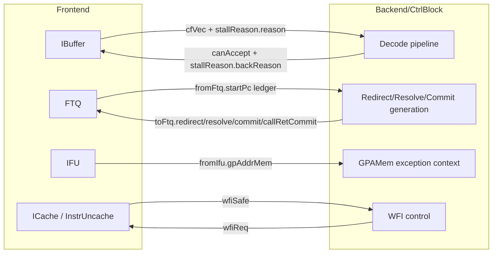
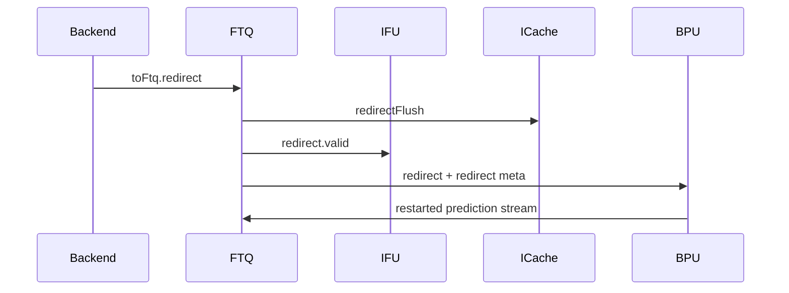
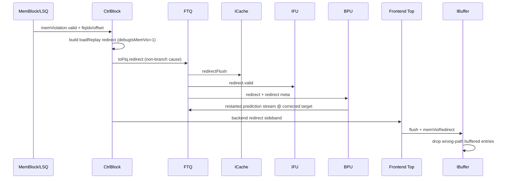

# Chapter 10. Frontend <> Backend Interface (Principles and Full Bus Map)

### Why This Section Exists

This section is intentionally long and starts from first principles. Before diving into XiangShan's specific
interface signals, we build the conceptual vocabulary that makes the rest of the chapter—and indeed much of
this book—intelligible. If you already have a solid understanding of pipelined processor organization,
speculative execution, and handshake protocols, you may skim ahead to §10.1. Otherwise, read on.

### From Sequential Execution to Pipelining

A processor's fundamental job is to execute a stream of instructions. The simplest conceivable implementation
fetches one instruction, decodes it, executes it, accesses memory if needed, and writes back the result—all
before starting the next instruction. This single-cycle or multi-cycle model is easy to reason about, but
it leaves most of the hardware idle most of the time. The arithmetic unit sits unused while the processor
is busy fetching, and the fetch logic is dark while the processor is executing.

**Pipelining** addresses this by overlapping the processing of multiple instructions. The processor is divided
into stages—commonly fetch, decode, execute, memory access, and writeback—and each stage works on a different
instruction simultaneously. A classic five-stage pipeline can have up to five instructions in flight at once,
one in each stage, ideally completing one instruction per clock cycle after the pipeline is full.

However, pipelining introduces complications that the sequential model avoids entirely:

- **Data hazards**: a later instruction may need a result that an earlier instruction has not yet produced.
- **Control hazards**: branch instructions change the program counter, but the pipeline has already started
  fetching subsequent instructions before the branch outcome is known.
- **Structural hazards**: two instructions may need the same hardware resource in the same cycle.

These hazards require the pipeline to **stall** (insert bubbles and wait), **forward** data between stages,
or **speculate** on outcomes and recover when the speculation turns out wrong.

### Superscalar Execution: Doing More Per Cycle

Modern high-performance processors go beyond a single pipeline. A **superscalar** processor can fetch, decode,
and execute multiple instructions per cycle. In XiangShan, decode width is a configuration parameter (`DecodeWidth`):
this repo's default parameter is 8-wide (via `XSCoreParameters` defaults in the `TLConfig` path), while some
configurations (for example `TLBackendV2Config`) use 6-wide
([Parameters.scala:80](../../src/main/scala/xiangshan/Parameters.scala#L80),
[Configs.scala:59](../../src/main/scala/top/Configs.scala#L59),
[Configs.scala:596](../../src/main/scala/top/Configs.scala#L596),
[Configs.scala:511](../../src/main/scala/top/Configs.scala#L511)).
This multiplies both the throughput potential and the complexity of all the hazards mentioned above.

When you have many instructions entering decode per cycle, the question "can the consumer accept new work?"
becomes urgent. A single-wide pipeline can stall trivially; a superscalar pipeline must coordinate
stall/resume decisions across all lanes simultaneously, and it must do so without creating timing-critical
paths that would limit the clock frequency.

### Out-of-Order Execution: Breaking the Program Order Constraint

In a simple in-order pipeline, instructions enter and leave every stage in strict program order. An
**out-of-order** (OoO) processor relaxes this: it fetches and decodes instructions in order, but then
dispatches them to execution units based on operand availability rather than program sequence. A slow
division does not block a fast addition that follows it, as long as they are independent.

This reordering requires substantial bookkeeping:

- A **reorder buffer** (ROB) tracks all in-flight instructions and ensures that their results become
  architecturally visible (commit) in program order, even though execution may complete out of order.
- **Rename registers** eliminate false data dependencies (WAR and WAW hazards) by mapping architectural
  register names to a larger pool of physical registers.
- **Issue queues** (also called reservation stations in some designs) hold decoded instructions until
  all their operands are ready, then issue them to functional units.

The crucial insight for this chapter is that out-of-order execution creates a natural division of labor:
the **frontend** is responsible for supplying control-flow/fetch packets as fast as possible, while
the **backend** (starting at decode) is responsible for decoding, executing, reordering, and committing
them correctly.

### Speculative Execution and the Recovery Problem

Because the frontend fetches instructions before branches are resolved, it must **predict** the outcome
of every branch. Modern branch predictors are remarkably accurate, but mispredictions still occur regularly.

When a misprediction is discovered (by the backend, which actually executes the branch), the processor must:

1. **Squash** all instructions that were fetched along the wrong path.
2. **Redirect** the frontend to fetch from the correct target address.
3. **Restore** the rename map, reorder buffer, and other microarchitectural state to the point just before
   the mispredicted branch.

This recovery process is one of the most performance-critical paths in any out-of-order processor. The
longer it takes, the larger the "misprediction penalty"—the number of cycles wasted on wrong-path work.
Designing the frontend-backend interface to support fast, correct recovery is therefore a first-order
architectural concern.

### The Frontend/Backend Split: Two Machines, One Contract

In XiangShan, as in most modern high-performance cores, the processor is organized into two major halves:

- The **frontend** contains the branch prediction unit (BPU), the instruction cache (ICache), the
  instruction fetch unit (IFU), the fetch target queue (FTQ), and the instruction buffer (IBuffer).
  Its job is to supply a steady stream of control-flow packets to the backend decode boundary.

- The **backend** contains the decode stage, rename logic, dispatch, issue queues, functional units
  (ALU, FPU, load/store, etc.), the reorder buffer, and the store/load queues. Its job is to execute
  instructions correctly and commit results in program order.

These two halves communicate through a well-defined interface. This interface is not a single wire or a
single signal—it is a collection of buses carrying instruction data forward, control corrections backward,
stall information in both directions, and coordination signals for special events like low-power halt.

If you have never implemented a decoupled pipeline before, read this section as a **protocol story**: frontend
and backend are two independent machines that communicate through explicit contracts. Correctness is obtained
not by "both sides running at the same speed," but by handshake + metadata + recovery rules.

### Handshake Protocols: The Language of Hardware Communication

Hardware modules communicate through **handshake protocols**. The most common in the Chisel/RISC-V ecosystem
is the `DecoupledIO` (also called valid-ready) protocol:

- The **producer** asserts `valid` when it has data available and holds `bits` stable.
- The **consumer** asserts `ready` when it can accept data.
- A **transfer** occurs if and only if both `valid` and `ready` are asserted in the same clock cycle.

This simple protocol is powerful because it naturally handles speed mismatches: a fast producer stalls
(holds `valid` high) until a slow consumer is ready, and a fast consumer waits (`ready` high, no transfer)
until the producer has data. Neither side needs to know the other's internal timing.

At this boundary, XiangShan uses both `DecoupledIO` channels and `Valid` sideband channels. Understanding
which bus uses which contract is essential for reading any of the interface descriptions that follow.

### What This Section Covers

With this background, the rest of §10 proceeds as follows:

- [**§10.1**](#421-first-principles-of-febe-interaction) distills the frontend/backend interaction into six design principles.
- [**§10.2**](#422-febe-interface-at-a-glance) gives a visual overview of the interface topology.
- [**§10.3**](#423-full-bus-list-with-directions) presents the complete bus list with signal directions and RTL evidence.
- [**§10.4**](#424-interaction-walkthroughs-cycle-level-intuition)–[**§10.5**](#425-worked-example-decode-busy-while-redirect-arrives) walk through concrete interaction scenarios at cycle-level granularity.
- [**§10.6**](#426-design-trade-off-sidebar-febe-boundary) discusses design trade-offs at the FE/BE boundary.
- [**§10.7**](#427-febe-as-five-explicit-feedback-loops) reinterprets the interface as five explicit feedback loops.
- [**§10.8**](#428-why-febe-timing-uses-explicit-delay-and-staging)–[**§10.9**](#429-advanced-timing-scenarios) cover timing staging and advanced scenarios.
- [**§10.10**](#4210-common-misconceptions-and-correct-interpretation) corrects common misconceptions.
- [**§10.11**](#4211-additional-worked-example-exception-redirect-with-trap-target-construction) provides an additional worked example showing how exception redirects differ from mispredict redirects.

### 10.1 First Principles of FE/BE Interaction

The six principles below capture the core design rules that govern the frontend/backend boundary.
Each one addresses a specific architectural problem—transfer semantics, channel separation, recovery
ownership, backpressure, diagnostics, or low-power coordination—and together they define the
contract that the rest of the chapter builds on.

#### Principle A: Every Bus Has an Explicit Transfer Contract

Hardware modules cannot "just send data"—every transfer needs a rule that says exactly when a
datum is considered delivered. Without such a rule, the producer and consumer may disagree about
whether a transfer happened, leading to lost or duplicated data.

XiangShan uses two standard contracts at the frontend/backend boundary:

- **`DecoupledIO` (valid-ready):** A transfer occurs when both `valid` and `ready` are high in the
  same cycle. The producer holds data stable while `valid` is asserted; the consumer asserts `ready`
  when it can accept. This is used for the main instruction stream (`cfVec`), where the frontend
  may produce faster than the backend can consume and flow control is needed
  ([Bundle.scala:448](../../src/main/scala/xiangshan/Bundle.scala#L448),
  [Frontend.scala:255](../../src/main/scala/xiangshan/frontend/Frontend.scala#L255)).

- **`Valid` (fire-and-forget):** The producer asserts `valid` for one cycle and the consumer must
  accept unconditionally—there is no `ready` signal. This is used for backend correction signals
  (`redirect`, `resolve`, `commit`, `callRetCommit`), which the frontend must always be able to
  process immediately; stalling a redirect would compromise correctness
  ([CtrlBlock.scala:45](../../src/main/scala/xiangshan/backend/CtrlBlock.scala#L45),
  [Frontend.scala:244](../../src/main/scala/xiangshan/frontend/Frontend.scala#L244)).

Knowing which contract a bus uses tells you whether the receiver can push back (DecoupledIO) or
must always be ready (Valid). This distinction matters for every interface description that follows.

#### Principle B: The Instruction Stream and Correction Signals Travel on Separate Channels

The frontend/backend boundary carries two fundamentally different kinds of traffic:

- **Forward (instruction supply):** `cfVec` delivers decoded control-flow packets from frontend to
  backend, along with `stallReason.reason` diagnostics. The goal is throughput—keep the backend fed.

- **Backward (corrections):** `redirect`, `resolve`, `commit`, and `callRetCommit` flow from
  backend to frontend. The goal is correctness—fix mispredictions, train the predictor, and
  retire speculation.

These are kept on separate channels because they have different priorities and timing requirements.
Instruction supply can tolerate stalls (the pipeline bubbles but stays correct). Corrections
cannot—a delayed redirect means the frontend continues fetching wrong-path instructions, wasting
energy and occupying pipeline resources. Mixing the two onto a shared channel would create a
timing-critical path where throughput traffic competes with correctness traffic.

Evidence of this split in the RTL:

- Data channel hookup in frontend top:
  [Frontend.scala:255](../../src/main/scala/xiangshan/frontend/Frontend.scala#L255),
  [Frontend.scala:256](../../src/main/scala/xiangshan/frontend/Frontend.scala#L256).
- Control channel hookup in frontend top:
  [Frontend.scala:244](../../src/main/scala/xiangshan/frontend/Frontend.scala#L244),
  [Frontend.scala:245](../../src/main/scala/xiangshan/frontend/Frontend.scala#L245),
  [Frontend.scala:246](../../src/main/scala/xiangshan/frontend/Frontend.scala#L246).

#### Principle C: Redirect Sources Are Prioritized, Not Exclusive

Corrections to the fetch stream can originate from two places: the **backend** (mispredict, exception,
load replay) and the **IFU** (pre-decode cross-page redirect). Both feed into the FTQ, which acts as
the single arbitration point. When both arrive simultaneously, backend redirect wins because it
carries architecturally resolved information, while IFU redirect is speculative.

Backend builds its correction events in `CtrlBlock`:

- commit to FTQ: [CtrlBlock.scala:352](../../src/main/scala/xiangshan/backend/CtrlBlock.scala#L352)
- redirect to FTQ: [CtrlBlock.scala:361](../../src/main/scala/xiangshan/backend/CtrlBlock.scala#L361)
- resolve to FTQ: [CtrlBlock.scala:804](../../src/main/scala/xiangshan/backend/CtrlBlock.scala#L804)

FTQ merges the two redirect sources with backend taking priority:
[Ftq.scala:116](../../src/main/scala/xiangshan/frontend/ftq/Ftq.scala#L116),
[Ftq.scala:118](../../src/main/scala/xiangshan/frontend/ftq/Ftq.scala#L118),
[Ftq.scala:120](../../src/main/scala/xiangshan/frontend/ftq/Ftq.scala#L120).

#### Principle D: Decode Backpressure Is Explicit and Propagated Upstream

When the backend cannot absorb new instructions—because rename has run out of physical registers,
or dispatch queues are full—the frontend must stop pushing. If it kept sending, packets would be
lost or the pipeline would need complex buffering at every stage.

XiangShan solves this with an explicit `canAccept` signal that travels from backend to frontend:

1. Backend computes `canAccept` based on decode-buffer and rename/dispatch capacity
   ([CtrlBlock.scala:526](../../src/main/scala/xiangshan/backend/CtrlBlock.scala#L526)).
2. Frontend passes `canAccept` to IBuffer
   ([Frontend.scala:253](../../src/main/scala/xiangshan/frontend/Frontend.scala#L253)).
3. IBuffer uses `decodeCanAccept` to gate its dequeue—it holds entries internally rather than
   dropping them
   ([IBuffer.scala:42](../../src/main/scala/xiangshan/frontend/ibuffer/IBuffer.scala#L42),
   [IBuffer.scala:114](../../src/main/scala/xiangshan/frontend/ibuffer/IBuffer.scala#L114)).

#### Principle E: Stall Diagnostics Are Part of the Architecture, Not Just Debug Instrumentation

Many processors track stall causes only in performance counters. XiangShan goes further: the
`stallReason` bus is a structured channel that carries the root cause of pipeline stalls across
the frontend/backend boundary. Both sides contribute to the diagnosis—frontend reports fetch-side
causes (e.g., ICache miss), and backend can override with its own cause (e.g., dispatch full)—so
that the final stall classification reflects the true bottleneck, not just whichever side happens
to be observed.

- `StallReasonIO` definition: [Bundle.scala:778](../../src/main/scala/xiangshan/Bundle.scala#L778)
- Frontend reason generation and backend override:
  [IBuffer.scala:397](../../src/main/scala/xiangshan/frontend/ibuffer/IBuffer.scala#L397),
  [IBuffer.scala:414](../../src/main/scala/xiangshan/frontend/ibuffer/IBuffer.scala#L414)
- Backend backReason generation (dispatch/rename) and pass-through at decode input:
  [NewDispatch.scala:934](../../src/main/scala/xiangshan/backend/dispatch/NewDispatch.scala#L934),
  [Rename.scala:788](../../src/main/scala/xiangshan/backend/rename/Rename.scala#L788),
  [CtrlBlock.scala:534](../../src/main/scala/xiangshan/backend/CtrlBlock.scala#L534)

#### Principle F: Low-Power Entry (`WFI`) Requires a Two-Phase Handshake

When the backend executes a WFI (Wait For Interrupt) instruction, the processor should stop
fetching and enter a low-power state. But the backend cannot simply halt the frontend—the
frontend may have outstanding memory transactions (ICache refills, uncacheable fetches) that
must complete before it is safe to gate the clock or power down.

The solution is a two-phase handshake:

1. Backend asserts `wfiReq` to request quiescence:
   [CtrlBlock.scala:806](../../src/main/scala/xiangshan/backend/CtrlBlock.scala#L806).
2. Frontend fans out the request to ICache and InstrUncache, waits for both to drain, and only
   then asserts `wfiSafe`:
   [Frontend.scala:213](../../src/main/scala/xiangshan/frontend/Frontend.scala#L213),
   [Frontend.scala:214](../../src/main/scala/xiangshan/frontend/Frontend.scala#L214),
   [Frontend.scala:215](../../src/main/scala/xiangshan/frontend/Frontend.scala#L215),
   [Frontend.scala:217](../../src/main/scala/xiangshan/frontend/Frontend.scala#L217).

### 10.2 FE/BE Interface at a Glance



### 10.3 Full Bus List with Directions

All signals below belong to
[`FrontendToCtrlIO`](../../src/main/scala/xiangshan/Bundle.scala#L446), the single bundle that
carries every frontend/backend wire. It is instantiated inside `Frontend` and connected to
`CtrlBlock` at the `XSCore` level
([XSCore.scala:135](../../src/main/scala/xiangshan/XSCore.scala#L135)).
Direction convention is **at the frontend boundary**: "FE -> BE" means the signal is an output of
the frontend module and an input of the backend module.

The bus groups below are organized by function: instruction supply, backpressure and diagnostics,
correction and training, PC bookkeeping, exception context, and low-power coordination.

#### Instruction Supply (`cfVec`)

| Field | Direction | Type | Defined at |
| --- | --- | --- | --- |
| [`cfVec`](../../src/main/scala/xiangshan/Bundle.scala#L448) | FE -> BE | `Vec(DecodeWidth, DecoupledIO[CtrlFlow])` | [Bundle.scala:448](../../src/main/scala/xiangshan/Bundle.scala#L448) |

`cfVec` is the main data path across the FE/BE boundary. It carries up to `DecodeWidth`
control-flow packets per cycle, one per decode lane. Each element is a `DecoupledIO` channel
(valid-ready handshake), so the backend can backpressure individual lanes.

Each [`CtrlFlow`](../../src/main/scala/xiangshan/Bundle.scala#L94) packet contains the
instruction word (`instr`), its virtual PC (`pc`), a folded PC for memory-dependence prediction
(`foldpc`), an exception vector accumulated during fetch (`exceptionVec`), branch prediction
metadata (`predTaken`, `fixedTaken`), store-set hints (`storeSetHit`, `waitForRobIdx`,
`loadWaitBit`), and the FTQ coordinates that tie this instruction back to its fetch block
(`ftqPtr`, `ftqOffset`, `isLastInFtqEntry`)
([Bundle.scala:94–118](../../src/main/scala/xiangshan/Bundle.scala#L94)).

Producer and consumer:

- **Producer:** `IBuffer` dequeues decoded instruction entries and drives `cfVec` through the
  frontend top-level connection
  ([Frontend.scala:255](../../src/main/scala/xiangshan/frontend/Frontend.scala#L255)).
- **Consumer:** `CtrlBlock` receives the vector as `decodeFromFrontend` and feeds it into the
  decode pipeline. The decode input mux selects between this fresh frontend data and a decode
  buffer that holds residual entries from a previous cycle
  ([CtrlBlock.scala:445](../../src/main/scala/xiangshan/backend/CtrlBlock.scala#L445),
  [CtrlBlock.scala:520–523](../../src/main/scala/xiangshan/backend/CtrlBlock.scala#L520)).

#### Backpressure and Stall Diagnostics (`canAccept`, `stallReason`)

| Field | Direction | Type | Defined at |
| --- | --- | --- | --- |
| [`canAccept`](../../src/main/scala/xiangshan/Bundle.scala#L454) | BE -> FE | `Bool` | [Bundle.scala:454](../../src/main/scala/xiangshan/Bundle.scala#L454) |
| [`stallReason.reason`](../../src/main/scala/xiangshan/Bundle.scala#L779) | FE -> BE | `Vec(DecodeWidth, UInt)` | [Bundle.scala:779](../../src/main/scala/xiangshan/Bundle.scala#L779) |
| [`stallReason.backReason`](../../src/main/scala/xiangshan/Bundle.scala#L780) | BE -> FE | `Valid(UInt)` | [Bundle.scala:780](../../src/main/scala/xiangshan/Bundle.scala#L780) |

**`canAccept`** is the coarse admission signal from backend to frontend. Backend asserts it when
its decode buffer is empty or the frontend is not presenting valid data—meaning there is room
for new packets. The logic is:
`!decodeBufValid(0) || !decodeFromFrontend(0).valid`
([CtrlBlock.scala:526](../../src/main/scala/xiangshan/backend/CtrlBlock.scala#L526)).
Frontend passes this to IBuffer
([Frontend.scala:253](../../src/main/scala/xiangshan/frontend/Frontend.scala#L253)),
which uses it to gate dequeue: when `canAccept` is low, IBuffer holds entries internally
rather than dropping them
([IBuffer.scala:42](../../src/main/scala/xiangshan/frontend/ibuffer/IBuffer.scala#L42),
[IBuffer.scala:114](../../src/main/scala/xiangshan/frontend/ibuffer/IBuffer.scala#L114)).

**`stallReason`** is a bidirectional diagnostic channel within the
[`StallReasonIO`](../../src/main/scala/xiangshan/Bundle.scala#L778) bundle. The forward half
(`reason`) is a per-lane stall-cause vector produced by IBuffer, indicating why each decode slot
is empty (e.g., ICache miss, TLB miss)
([IBuffer.scala:397](../../src/main/scala/xiangshan/frontend/ibuffer/IBuffer.scala#L397)).
The backward half (`backReason`) is a single `Valid` stall cause generated by the backend
(dispatch full, rename stall, etc.) that can override the frontend classification
([NewDispatch.scala:934](../../src/main/scala/xiangshan/backend/dispatch/NewDispatch.scala#L934),
[Rename.scala:788](../../src/main/scala/xiangshan/backend/rename/Rename.scala#L788)).
IBuffer merges both into the final top-down accounting
([IBuffer.scala:414](../../src/main/scala/xiangshan/frontend/ibuffer/IBuffer.scala#L414)),
and the combined result propagates through the backend decode stage
([CtrlBlock.scala:534](../../src/main/scala/xiangshan/backend/CtrlBlock.scala#L534)).

#### Correction and Training Feedback (`toFtq`)

All fields in this group belong to
[`CtrlToFtqIO`](../../src/main/scala/xiangshan/backend/CtrlBlock.scala#L45), which flows
BE -> FE. Every channel uses `Valid` semantics (no `ready`; the frontend must always accept).

| Field | Type | Defined at |
| --- | --- | --- |
| [`toFtq.redirect`](../../src/main/scala/xiangshan/backend/CtrlBlock.scala#L46) | `Valid(Redirect)` | [CtrlBlock.scala:46](../../src/main/scala/xiangshan/backend/CtrlBlock.scala#L46) |
| [`toFtq.ftqIdxAhead`](../../src/main/scala/xiangshan/backend/CtrlBlock.scala#L47) | `Vec(BackendRedirectNum, Valid(FtqPtr))` | [CtrlBlock.scala:47](../../src/main/scala/xiangshan/backend/CtrlBlock.scala#L47) |
| [`toFtq.ftqIdxSelOH`](../../src/main/scala/xiangshan/backend/CtrlBlock.scala#L48) | `Valid(UInt)` | [CtrlBlock.scala:48](../../src/main/scala/xiangshan/backend/CtrlBlock.scala#L48) |
| [`toFtq.resolve`](../../src/main/scala/xiangshan/backend/CtrlBlock.scala#L50) | `Vec(BrhCnt, Valid(Resolve))` | [CtrlBlock.scala:50](../../src/main/scala/xiangshan/backend/CtrlBlock.scala#L50) |
| [`toFtq.commit`](../../src/main/scala/xiangshan/backend/CtrlBlock.scala#L52) | `Valid(FtqPtr)` | [CtrlBlock.scala:52](../../src/main/scala/xiangshan/backend/CtrlBlock.scala#L52) |
| [`toFtq.callRetCommit`](../../src/main/scala/xiangshan/backend/CtrlBlock.scala#L53) | `Vec(CommitWidth, Valid(CallRetCommit))` | [CtrlBlock.scala:53](../../src/main/scala/xiangshan/backend/CtrlBlock.scala#L53) |

**`redirect`** is the final correction path. It fires when the backend discovers a mispredict,
a load-replay violation, or an exception/flush at ROB head. The valid signal is the logical OR of
these sources:
`s5_flushFromRobValid || s3_redirectGen.valid`
([CtrlBlock.scala:361](../../src/main/scala/xiangshan/backend/CtrlBlock.scala#L361)).
FTQ receives this and rolls back its speculation pointers
([Ftq.scala:118](../../src/main/scala/xiangshan/frontend/ftq/Ftq.scala#L118)).

**`ftqIdxAhead`** and **`ftqIdxSelOH`** are early-hint sideband signals for the redirect path.
`ftqIdxAhead` is a vector of `BackendRedirectNum` entries
(`NumRedirect + 2`, covering branch/jump redirects, load replay, and exception;
[Parameters.scala:710](../../src/main/scala/xiangshan/Parameters.scala#L710)).
Each entry carries the FTQ pointer of a potential redirect source one cycle before the final
`redirect` fires, so FTQ can begin pointer lookup speculatively.
`ftqIdxSelOH` is a one-hot that tells FTQ which `ftqIdxAhead` entry was selected as the oldest
redirect
([CtrlBlock.scala:363–374](../../src/main/scala/xiangshan/backend/CtrlBlock.scala#L363),
[BackendRedirectReceiver.scala:32–34](../../src/main/scala/xiangshan/frontend/ftq/BackendRedirectReceiver.scala#L32)).

**`resolve`** carries per-branch resolution outcomes from backend execution units to FTQ. There
are `BrhCnt` channels (one per branch execution port). Each
[`Resolve`](../../src/main/scala/xiangshan/Bundle.scala#L284) bundle contains the FTQ pointer
and offset of the resolved branch, its PC and target, whether it was taken, whether it
mispredicted, and a `BranchAttribute` describing branch type. FTQ feeds this into its
`ResolveQueue` for BPU training
([CtrlBlock.scala:804](../../src/main/scala/xiangshan/backend/CtrlBlock.scala#L804),
[Ftq.scala:332](../../src/main/scala/xiangshan/frontend/ftq/Ftq.scala#L332)).

**`commit`** advances the FTQ commit pointer. When ROB commits instructions, it sends the FTQ
pointer of the oldest committed entry so that FTQ can retire speculative state and release
entries
([CtrlBlock.scala:352](../../src/main/scala/xiangshan/backend/CtrlBlock.scala#L352),
[Ftq.scala:362](../../src/main/scala/xiangshan/frontend/ftq/Ftq.scala#L362)).

**`callRetCommit`** carries commit-time call/return classification for RAS (Return Address Stack)
maintenance. Each of the `CommitWidth` entries contains an FTQ pointer and a `rasAction` field
encoding whether the committed instruction is a push (call), pop (return), or neither. This
allows the RAS to update only on architecturally committed control flow, avoiding corruption
from speculative calls/returns
([CtrlBlock.scala:376–383](../../src/main/scala/xiangshan/backend/CtrlBlock.scala#L376),
[Ftq.scala:372](../../src/main/scala/xiangshan/frontend/ftq/Ftq.scala#L372)).

#### PC Bookkeeping (`fromFtq`)

| Field | Direction | Type | Defined at |
| --- | --- | --- | --- |
| [`fromFtq.wen`](../../src/main/scala/xiangshan/frontend/ftq/Bundles.scala#L76) | FE -> BE | `Bool` | [Bundles.scala:76](../../src/main/scala/xiangshan/frontend/ftq/Bundles.scala#L76) |
| [`fromFtq.ftqIdx`](../../src/main/scala/xiangshan/frontend/ftq/Bundles.scala#L77) | FE -> BE | `UInt` | [Bundles.scala:77](../../src/main/scala/xiangshan/frontend/ftq/Bundles.scala#L77) |
| [`fromFtq.startPc`](../../src/main/scala/xiangshan/frontend/ftq/Bundles.scala#L78) | FE -> BE | `PrunedAddr` | [Bundles.scala:78](../../src/main/scala/xiangshan/frontend/ftq/Bundles.scala#L78) |

These three signals form the
[`FtqToCtrlIO`](../../src/main/scala/xiangshan/frontend/ftq/Bundles.scala#L74) write port.
When FTQ allocates a new fetch block, it asserts `wen` and provides the FTQ index and the
start PC of that block. Backend stores this mapping in a PC memory so that later—potentially
many cycles later—redirect and trap logic can reconstruct the exact PC from an FTQ pointer
([Ftq.scala:294](../../src/main/scala/xiangshan/frontend/ftq/Ftq.scala#L294),
[CtrlBlock.scala:773](../../src/main/scala/xiangshan/backend/CtrlBlock.scala#L773)).
This is essential because backend redirect/trap logic is indexed by FTQ pointer and needs the
start PC for target computation
([CtrlBlock.scala:329](../../src/main/scala/xiangshan/backend/CtrlBlock.scala#L329),
[CtrlBlock.scala:337](../../src/main/scala/xiangshan/backend/CtrlBlock.scala#L337)).

#### Guest Physical Address Context (`fromIfu`)

| Field | Direction | Type | Defined at |
| --- | --- | --- | --- |
| [`fromIfu.gpAddrMem.wen`](../../src/main/scala/xiangshan/frontend/Bundles.scala#L354) | FE -> BE | `Bool` | [Bundles.scala:354](../../src/main/scala/xiangshan/frontend/Bundles.scala#L354) |
| [`fromIfu.gpAddrMem.waddr`](../../src/main/scala/xiangshan/frontend/Bundles.scala#L355) | FE -> BE | `UInt(log2Ceil(FtqSize))` | [Bundles.scala:355](../../src/main/scala/xiangshan/frontend/Bundles.scala#L355) |
| [`fromIfu.gpAddrMem.wdata`](../../src/main/scala/xiangshan/frontend/Bundles.scala#L356) | FE -> BE | [`GPAMemEntry`](../../src/main/scala/xiangshan/backend/GPAMem.scala#L44) | [Bundles.scala:356](../../src/main/scala/xiangshan/frontend/Bundles.scala#L356) |

These signals belong to
[`IfuToBackendIO`](../../src/main/scala/xiangshan/frontend/Bundles.scala#L351) and carry
guest-physical-address (GPA) context for virtualization exception reporting. When IFU
encounters a guest page fault during fetch, it writes the faulting GPA and a flag
(`isForVSnonLeafPTE`) into backend's `GPAMem` indexed by FTQ entry
([GPAMem.scala:44–47](../../src/main/scala/xiangshan/backend/GPAMem.scala#L44)).
Backend later reads this when constructing trap metadata for exception redirects
([Frontend.scala:246](../../src/main/scala/xiangshan/frontend/Frontend.scala#L246),
[CtrlBlock.scala:410](../../src/main/scala/xiangshan/backend/CtrlBlock.scala#L410)).

#### Low-Power Coordination (`wfi`)

| Field | Direction | Type | Defined at |
| --- | --- | --- | --- |
| [`wfi.wfiReq`](../../src/main/scala/xiangshan/Bundle.scala#L442) | BE -> FE | `Bool` | [Bundle.scala:442](../../src/main/scala/xiangshan/Bundle.scala#L442) |
| [`wfi.wfiSafe`](../../src/main/scala/xiangshan/Bundle.scala#L443) | FE -> BE | `Bool` | [Bundle.scala:443](../../src/main/scala/xiangshan/Bundle.scala#L443) |

These two signals form the
[`WfiReqBundle`](../../src/main/scala/xiangshan/Bundle.scala#L441) two-phase handshake
described in Principle F (§10.1).

**`wfiReq`** is asserted by ROB when it commits a WFI instruction and wants the frontend to
quiesce
([CtrlBlock.scala:806](../../src/main/scala/xiangshan/backend/CtrlBlock.scala#L806)).
Note that the same `wfiReq` is also sent to the memory subsystem—ROB requires both frontend
and memory to be safe before halting
([CtrlBlock.scala:808](../../src/main/scala/xiangshan/backend/CtrlBlock.scala#L808)).

**`wfiSafe`** is the frontend's acknowledgement. Frontend delays the incoming request
(`DelayN`), fans it out to ICache and InstrUncache, and only asserts `wfiSafe` when both
report quiescent **and** the delayed request is still active:
`wfiReq && icache.io.wfi.wfiSafe && instrUncache.io.wfi.wfiSafe`
([Frontend.scala:213–217](../../src/main/scala/xiangshan/frontend/Frontend.scala#L213)).
Backend collects this alongside the memory-side safe signal before entering halt
([CtrlBlock.scala:807](../../src/main/scala/xiangshan/backend/CtrlBlock.scala#L807)).

### 10.4 Interaction Walkthroughs (Cycle-Level Intuition)

#### Scenario 1: Normal Throughput Path

1. FTQ and IFU/ICache produce fetch results into IBuffer.
2. IBuffer sends up to `DecodeWidth` `CtrlFlow` packets through `cfVec`.
3. Backend decode/rename/dispatch consumes packets.
4. Backend computes `canAccept`; frontend respects it next cycle.

Evidence chain:
[Frontend.scala:242](../../src/main/scala/xiangshan/frontend/Frontend.scala#L242),
[Frontend.scala:255](../../src/main/scala/xiangshan/frontend/Frontend.scala#L255),
[CtrlBlock.scala:445](../../src/main/scala/xiangshan/backend/CtrlBlock.scala#L445),
[CtrlBlock.scala:526](../../src/main/scala/xiangshan/backend/CtrlBlock.scala#L526).

#### Scenario 2: Branch Mispredict Recovery

1. Backend resolves branch as mispredict and creates redirect packet.
2. Redirect enters FTQ (`toFtq.redirect`).
3. FTQ updates speculation pointers and asserts redirect flush to IFU/ICache.
4. Wrong-path packets are flushed; prediction restarts from corrected target.

Evidence chain:
[CtrlBlock.scala:361](../../src/main/scala/xiangshan/backend/CtrlBlock.scala#L361),
[Ftq.scala:302](../../src/main/scala/xiangshan/frontend/ftq/Ftq.scala#L302),
[Ftq.scala:313](../../src/main/scala/xiangshan/frontend/ftq/Ftq.scala#L313),
[Ftq.scala:317](../../src/main/scala/xiangshan/frontend/ftq/Ftq.scala#L317).



#### Scenario 3: Load-Violation Redirect (Non-Branch Redirect)

Redirects are not branch-only. A load-order violation from the memory side is converted into a frontend redirect and
uses the same recovery machinery as branch mispredict handling.

1. Memory-side violation arrives at `CtrlBlock` as `memViolation`.
2. `CtrlBlock` builds `loadReplay` (`Valid[Redirect]`), tags it as memory-violation (`debugIsMemVio := true`), and
   reconstructs redirect `pc/target` from FTQ-indexed PC memory plus violation offsets.
3. `RedirectGenerator` arbitrates this redirect against execution-unit redirects; winner is sent through
   `toFtq.redirect`.
4. FTQ applies normal redirect recovery: update speculation pointers, flush IFU/ICache path, and send redirect+meta to
   BPU so prediction restarts from corrected target.
5. In parallel, frontend top-level latches backend redirect type and flushes IBuffer with `memVioRedirect` classification.

Evidence chain:
[CtrlBlock.scala:202](../../src/main/scala/xiangshan/backend/CtrlBlock.scala#L202),
[CtrlBlock.scala:203](../../src/main/scala/xiangshan/backend/CtrlBlock.scala#L203),
[CtrlBlock.scala:207](../../src/main/scala/xiangshan/backend/CtrlBlock.scala#L207),
[CtrlBlock.scala:323](../../src/main/scala/xiangshan/backend/CtrlBlock.scala#L323),
[CtrlBlock.scala:331](../../src/main/scala/xiangshan/backend/CtrlBlock.scala#L331),
[CtrlBlock.scala:337](../../src/main/scala/xiangshan/backend/CtrlBlock.scala#L337),
[RedirectGenerator.scala:31](../../src/main/scala/xiangshan/backend/ctrlblock/RedirectGenerator.scala#L31),
[RedirectGenerator.scala:36](../../src/main/scala/xiangshan/backend/ctrlblock/RedirectGenerator.scala#L36),
[RedirectGenerator.scala:59](../../src/main/scala/xiangshan/backend/ctrlblock/RedirectGenerator.scala#L59),
[CtrlBlock.scala:361](../../src/main/scala/xiangshan/backend/CtrlBlock.scala#L361),
[Ftq.scala:302](../../src/main/scala/xiangshan/frontend/ftq/Ftq.scala#L302),
[Ftq.scala:310](../../src/main/scala/xiangshan/frontend/ftq/Ftq.scala#L310),
[Ftq.scala:313](../../src/main/scala/xiangshan/frontend/ftq/Ftq.scala#L313),
[Ftq.scala:317](../../src/main/scala/xiangshan/frontend/ftq/Ftq.scala#L317),
[Bpu.scala:437](../../src/main/scala/xiangshan/frontend/bpu/Bpu.scala#L437),
[Frontend.scala:143](../../src/main/scala/xiangshan/frontend/Frontend.scala#L143),
[Frontend.scala:251](../../src/main/scala/xiangshan/frontend/Frontend.scala#L251),
[IBuffer.scala:385](../../src/main/scala/xiangshan/frontend/ibuffer/IBuffer.scala#L385).



### 10.5 Worked Example: Decode Busy While Redirect Arrives

Suppose decode is temporarily blocked (`canAccept = 0`) while backend simultaneously discovers a mispredict.

What happens?

- `canAccept = 0` blocks new frontend->decode transfer (`cfVec(i).fire`), while IBuffer may still stage entries internally
  ([Frontend.scala:253](../../src/main/scala/xiangshan/frontend/Frontend.scala#L253),
  [CtrlBlock.scala:522](../../src/main/scala/xiangshan/backend/CtrlBlock.scala#L522),
  [IBuffer.scala:175](../../src/main/scala/xiangshan/frontend/ibuffer/IBuffer.scala#L175),
  [IBuffer.scala:223](../../src/main/scala/xiangshan/frontend/ibuffer/IBuffer.scala#L223)).
- backend emits redirect regardless of decode admission state
  ([CtrlBlock.scala:361](../../src/main/scala/xiangshan/backend/CtrlBlock.scala#L361)).
- FTQ updates pointers and flushes wrong path
  ([Ftq.scala:302](../../src/main/scala/xiangshan/frontend/ftq/Ftq.scala#L302),
  [Ftq.scala:310](../../src/main/scala/xiangshan/frontend/ftq/Ftq.scala#L310)).
- IBuffer receives flush signal through frontend top-level delayed redirect latch
  ([Frontend.scala:141](../../src/main/scala/xiangshan/frontend/Frontend.scala#L141),
  [Frontend.scala:249](../../src/main/scala/xiangshan/frontend/Frontend.scala#L249)).

Result: no dependence on decode immediately draining old packets to recover correctness. Recovery path and admission
path are separated.

### 10.6 Design Trade-off Sidebar (FE/BE Boundary)

| Design choice | Benefit | Cost | Evidence |
| --- | --- | --- | --- |
| Keep FTQ as the only BE correction endpoint | Simple ownership of speculation pointer updates and training metadata. | Extra queue logic and pointer management complexity. | [Ftq.scala:82](../../src/main/scala/xiangshan/frontend/ftq/Ftq.scala#L82), [Ftq.scala:291](../../src/main/scala/xiangshan/frontend/ftq/Ftq.scala#L291) |
| Use explicit `canAccept` instead of implicit ready-chain | Easier timing closure across FE/BE boundary. | Requires additional policy logic in IBuffer/decode buffer. | [CtrlBlock.scala:526](../../src/main/scala/xiangshan/backend/CtrlBlock.scala#L526), [IBuffer.scala:114](../../src/main/scala/xiangshan/frontend/ibuffer/IBuffer.scala#L114) |
| Forward stall reasons upstream | Better topdown analysis and bottleneck localization. | Extra sideband bandwidth and bookkeeping logic. | [Bundle.scala:778](../../src/main/scala/xiangshan/Bundle.scala#L778), [IBuffer.scala:397](../../src/main/scala/xiangshan/frontend/ibuffer/IBuffer.scala#L397) |
| WFI handshake includes frontend safety | Architecturally cleaner low-power entry. | WFI latency depends on frontend memory-side pending state. | [Frontend.scala:217](../../src/main/scala/xiangshan/frontend/Frontend.scala#L217), [CtrlBlock.scala:807](../../src/main/scala/xiangshan/backend/CtrlBlock.scala#L807) |

### 10.7 FE/BE as Five Explicit Feedback Loops

Another way to understand this interface is to see five coupled loops instead of one monolithic bus.

#### Loop 1: Supply Loop (Frontend -> Decode)

- Forward path: `IFU -> IBuffer -> cfVec -> Decode`.
- Feedback path: `canAccept`.

This loop controls throughput and front-end visible decode starvation.

Key wiring:

- supply path: [Frontend.scala:242](../../src/main/scala/xiangshan/frontend/Frontend.scala#L242),
  [Frontend.scala:255](../../src/main/scala/xiangshan/frontend/Frontend.scala#L255)
- feedback path: [CtrlBlock.scala:526](../../src/main/scala/xiangshan/backend/CtrlBlock.scala#L526),
  [Frontend.scala:253](../../src/main/scala/xiangshan/frontend/Frontend.scala#L253)

#### Loop 2: Correction Loop (Backend -> FTQ/IFU/BPU)

- Forward correction: `toFtq.redirect`.
- Effect: FTQ pointer rollback/advance rule, IFU flush, BPU redirect update.

Key wiring:

- redirect generation in backend:
  [CtrlBlock.scala:361](../../src/main/scala/xiangshan/backend/CtrlBlock.scala#L361)
- redirect reception/propagation in FTQ:
  [Ftq.scala:302](../../src/main/scala/xiangshan/frontend/ftq/Ftq.scala#L302),
  [Ftq.scala:313](../../src/main/scala/xiangshan/frontend/ftq/Ftq.scala#L313),
  [Ftq.scala:317](../../src/main/scala/xiangshan/frontend/ftq/Ftq.scala#L317)

#### Loop 3: Learning Loop (Backend -> FTQ -> BPU)

- backend sends branch `resolve` and `commit` signals.
- FTQ accumulates metadata and trains BPU.

Key wiring:

- backend resolve/commit emission:
  [CtrlBlock.scala:804](../../src/main/scala/xiangshan/backend/CtrlBlock.scala#L804),
  [CtrlBlock.scala:352](../../src/main/scala/xiangshan/backend/CtrlBlock.scala#L352)
- FTQ to BPU train/commit:
  [Ftq.scala:334](../../src/main/scala/xiangshan/frontend/ftq/Ftq.scala#L334),
  [Ftq.scala:374](../../src/main/scala/xiangshan/frontend/ftq/Ftq.scala#L374)

#### Loop 4: Bookkeeping Loop (FTQ -> Backend PC Memory)

- FTQ emits `fromFtq` (`wen`, `ftqIdx`, `startPc`) to backend.
- backend stores this into PC memory for later redirect/trap target reconstruction.

Evidence:

- FTQ output:
  [Ftq.scala:294](../../src/main/scala/xiangshan/frontend/ftq/Ftq.scala#L294)
- backend consume/store:
  [CtrlBlock.scala:773](../../src/main/scala/xiangshan/backend/CtrlBlock.scala#L773)

This loop is often overlooked by first-time readers, but it is essential: backend needs stable FTQ-index-to-start-PC
mapping to reconstruct exact redirect/trap PCs.

#### Loop 5: Low-Power Coordination Loop (WFI)

- backend requests low-power halt (`wfiReq`).
- frontend returns `wfiSafe` only when instruction-side memory paths are quiescent.

Evidence:

- request and collection at backend:
  [CtrlBlock.scala:806](../../src/main/scala/xiangshan/backend/CtrlBlock.scala#L806),
  [CtrlBlock.scala:807](../../src/main/scala/xiangshan/backend/CtrlBlock.scala#L807)
- frontend decision:
  [Frontend.scala:217](../../src/main/scala/xiangshan/frontend/Frontend.scala#L217)

### 10.8 Why FE/BE Timing Uses Explicit Delay and Staging

Some signals are delayed (`RegNext`, `DelayN`) before being consumed. This is not accidental:
it preserves timing closure and semantic alignment across long paths.

Examples in this boundary:

- frontend latches redirect type info for IBuffer flush classification:
  [Frontend.scala:141](../../src/main/scala/xiangshan/frontend/Frontend.scala#L141),
  [Frontend.scala:142](../../src/main/scala/xiangshan/frontend/Frontend.scala#L142),
  [Frontend.scala:143](../../src/main/scala/xiangshan/frontend/Frontend.scala#L143)
- backend intentionally delays flush-related redirect flow and trap-target selection:
  [CtrlBlock.scala:341](../../src/main/scala/xiangshan/backend/CtrlBlock.scala#L341),
  [CtrlBlock.scala:342](../../src/main/scala/xiangshan/backend/CtrlBlock.scala#L342),
  [CtrlBlock.scala:390](../../src/main/scala/xiangshan/backend/CtrlBlock.scala#L390)

In practical microarchitecture terms, modern wide cores do not keep all frontend/backend control in one-cycle
combinational style. They
pipeline control exactly like data, then preserve semantics with metadata and ordering rules.

#### Important Semantic Rule: "Flush-like" behavior for commit boundary

`CtrlBlock` comments explain why some commit/flush interactions are unified from frontend viewpoint:

- flush after commit can be problematic for frontend ordering;
- therefore flush reasons are presented in a way consistent with frontend recovery requirements.

See rationale around:
[CtrlBlock.scala:345](../../src/main/scala/xiangshan/backend/CtrlBlock.scala#L345)
to
[CtrlBlock.scala:350](../../src/main/scala/xiangshan/backend/CtrlBlock.scala#L350).

This is a very useful architecture lesson: if two event types are semantically hard to distinguish at consumer side,
it can be better to normalize them at producer side and keep consumer simpler.

### 10.9 Advanced Timing Scenarios

#### Scenario A: FTQ Flush Granularity on Redirect

§10.5 showed that redirect and decode admission are orthogonal: a redirect flushes wrong-path packets regardless
of `canAccept`. Here we zoom in on a subtlety of that flush: **which FTQ entries get invalidated?**

FTQ pointer update chooses whether to flush "this entry" or "next entry" based on redirect level and offset
([Ftq.scala:305](../../src/main/scala/xiangshan/frontend/ftq/Ftq.scala#L305),
[Ftq.scala:308](../../src/main/scala/xiangshan/frontend/ftq/Ftq.scala#L308)).
This matters because a redirect targeting the middle of an FTQ block must preserve the first half of that block
while invalidating the rest.

```text
t0: FE sends cfVec[N], cfVec[N+1]
t1: BE detects mispredict in block N, emits redirect
t2: FTQ evaluates flush granularity; IBuffer wrong-path entries are invalidated
t3: BPU/FTQ restart from corrected target; new-path cfVec appears
```

#### Scenario B: Redirect Plus Trap-Target Fault Metadata

For trap/exception redirects, backend may need to adjust redirect target and fault bits (`backendIAF/IPF/IGPF`) before
frontend receives final packet.

Evidence:

- trap target derivation:
  [CtrlBlock.scala:398](../../src/main/scala/xiangshan/backend/CtrlBlock.scala#L398)
- overwrite of redirect fields on flush path:
  [CtrlBlock.scala:403](../../src/main/scala/xiangshan/backend/CtrlBlock.scala#L403),
  [CtrlBlock.scala:404](../../src/main/scala/xiangshan/backend/CtrlBlock.scala#L404),
  [CtrlBlock.scala:405](../../src/main/scala/xiangshan/backend/CtrlBlock.scala#L405),
  [CtrlBlock.scala:406](../../src/main/scala/xiangshan/backend/CtrlBlock.scala#L406)

So the FE consumer always receives a coherent corrected target/fault packet, regardless of where in backend the fault
originated.

#### Scenario C: `fromFtq` PC Ledger and Redirect Reconstruction

A common question is: "Why send `fromFtq.startPc` back to backend if backend already saw that instruction?"

Because backend redirect/trap logic is indexed by FTQ pointers and may occur much later than initial frontend emit.
Storing start PC in backend PC memory gives a robust reconstruction point.

Evidence:

- FTQ ledger output:
  [Ftq.scala:294](../../src/main/scala/xiangshan/frontend/ftq/Ftq.scala#L294)
- backend storage:
  [CtrlBlock.scala:773](../../src/main/scala/xiangshan/backend/CtrlBlock.scala#L773)
- later usage for redirect target/pc math:
  [CtrlBlock.scala:329](../../src/main/scala/xiangshan/backend/CtrlBlock.scala#L329),
  [CtrlBlock.scala:337](../../src/main/scala/xiangshan/backend/CtrlBlock.scala#L337)

### 10.10 Common Misconceptions (and Correct Interpretation)

| Misconception | Correct interpretation | Evidence |
| --- | --- | --- |
| "Frontend directly decides final redirect target." | FTQ merges backend and IFU redirects; when backend redirect is valid it is selected, otherwise IFU redirect can drive correction. | [Ftq.scala:118](../../src/main/scala/xiangshan/frontend/ftq/Ftq.scala#L118), [Ftq.scala:120](../../src/main/scala/xiangshan/frontend/ftq/Ftq.scala#L120) |
| "`canAccept` means decode is always ready every lane." | `canAccept` is a coarse admission hint. Transfer still follows `cfVec.valid && cfVec.ready`, and current decode input logic couples lane readiness through lane-0 validity plus redirect gating rather than fully independent per-lane admission. | [Bundle.scala:448](../../src/main/scala/xiangshan/Bundle.scala#L448), [CtrlBlock.scala:520](../../src/main/scala/xiangshan/backend/CtrlBlock.scala#L520), [CtrlBlock.scala:522](../../src/main/scala/xiangshan/backend/CtrlBlock.scala#L522), [CtrlBlock.scala:526](../../src/main/scala/xiangshan/backend/CtrlBlock.scala#L526) |
| "`stallReason` is only for profiling." | `backReason` can actively override frontend reason classification and is part of coordinated stall accounting. | [IBuffer.scala:414](../../src/main/scala/xiangshan/frontend/ibuffer/IBuffer.scala#L414), [Rename.scala:788](../../src/main/scala/xiangshan/backend/rename/Rename.scala#L788) |
| "WFI safety is backend-local." | ROB requires both memory-safe and frontend-safe conditions. | [Rob.scala:441](../../src/main/scala/xiangshan/backend/rob/Rob.scala#L441), [CtrlBlock.scala:807](../../src/main/scala/xiangshan/backend/CtrlBlock.scala#L807) |
| "Resolve and commit are redundant for predictor training." | Resolve and commit carry different semantics; FTQ uses both for training and RAS behavior. | [Ftq.scala:332](../../src/main/scala/xiangshan/frontend/ftq/Ftq.scala#L332), [Ftq.scala:372](../../src/main/scala/xiangshan/frontend/ftq/Ftq.scala#L372) |

### 10.11 Additional Worked Example: Exception Redirect with Trap-Target Construction

§10.5 showed that mispredict redirects reach the frontend independently of decode backpressure. Exception
redirects follow the same orthogonal pattern—the correction path never waits for the supply path to drain.
What makes exceptions worth a separate example is the **additional trap-target construction step** that
occurs between redirect generation and frontend delivery.

When backend encounters an exception at ROB head:

1. backend builds a flush redirect
   ([CtrlBlock.scala:341](../../src/main/scala/xiangshan/backend/CtrlBlock.scala#L341)).
2. backend derives the trap-target address and overwrites redirect fields with fault metadata as
   described in Scenario B above (§10.9).
3. FTQ and IBuffer flush proceed exactly as in the mispredict case (§10.5).

This is another instance of the producer-side normalization principle from §10.8: by normalizing
trap-target and fault metadata at the backend, the frontend consumer handles one uniform redirect
packet format regardless of whether the cause was a branch mispredict, a load violation, or an exception.

### 10.12 Further Reading

1. **John L. Hennessy and David A. Patterson, *Computer Architecture: A Quantitative Approach*, 6th Edition (2017).**
   The definitive graduate-level textbook on computer architecture. Chapters 3 and C cover pipelining,
   instruction-level parallelism, and out-of-order execution in depth.
   [Amazon](https://www.amazon.com/dp/0128119055)

2. **David A. Patterson and John L. Hennessy, *Computer Organization and Design RISC-V Edition: The Hardware/Software Interface*, 2nd Edition (2020).**
   A more accessible undergraduate textbook that introduces pipelining and hazard handling with RISC-V
   examples. Ideal if the quantitative approach above feels too advanced as a starting point.
   [Amazon](https://www.amazon.com/dp/0128203315)

3. **Yinan Xu et al., "Towards Developing High Performance RISC-V Processors Using Agile Methodology," *MICRO 2022*.**
   The primary academic publication describing XiangShan's Nanhu (南湖) microarchitecture, design methodology,
   and performance evaluation. Provides essential context for understanding the architectural decisions in
   Kunminghu.
   [IEEE Xplore](https://ieeexplore.ieee.org/document/9923860) |
   [ACM Digital Library](https://dl.acm.org/doi/10.1109/MICRO56248.2022.00080)

4. **James E. Smith and Andrew R. Pleszkun, "Implementing Precise Interrupts in Pipelined Processors," *ISCA 1988*.**
   The foundational paper on how out-of-order processors can support precise exceptions—the theoretical
   basis for the reorder buffer and commit-time recovery mechanisms discussed in this chapter.
   [ACM Digital Library](https://dl.acm.org/doi/10.1145/325164.325151)

5. **Yale N. Patt, Wen-Mei W. Hwu, and Mikko Lipasti, *Introduction to Computing Systems: From Bits & Gates to C/C++ & Beyond*, 3rd Edition (2019).**
   Builds up from logic gates to a complete LC-3 processor, making it an excellent companion for readers
   who want to solidify their understanding of how hardware pipelines work at the gate and register-transfer
   level.
   [Amazon](https://www.amazon.com/dp/1260150534)

6. **Daniel A. Jiménez and Calvin Lin, "Dynamic Branch Prediction with Perceptrons," *HPCA 2001*.**
   Introduces the perceptron branch predictor, a precursor to the neural-inspired techniques that
   influenced modern predictors like TAGE-SC-L used in XiangShan. Useful for understanding why
   the learning loop (§10.7, Loop 3) carries rich metadata from backend to frontend.
   [IEEE Xplore](https://ieeexplore.ieee.org/document/903263)

7. **André Seznec, "TAGE-SC-L Branch Predictors," *JILP 2014 (CBP-4 Championship)*.**
   Describes the TAGE-SC-L family of branch predictors that XiangShan's BPU implements. Understanding
   this predictor's training requirements clarifies why the backend-to-FTQ resolve and commit signals
   carry the specific metadata they do.
   [JILP / Championship Branch Prediction](https://jilp.org/cbp2014/paper/AndreSeznec.pdf)

8. **Mark D. Hill and Alan Jay Smith, "Evaluating Associativity in CPU Caches," *IEEE Transactions on Computers*, 1989.**
   A classic study on cache organization trade-offs. While focused on data caches, the methodology and
   insights apply to understanding instruction cache behavior and its interaction with the frontend
   pipeline discussed here.
   [IEEE Xplore](https://ieeexplore.ieee.org/document/45203)
