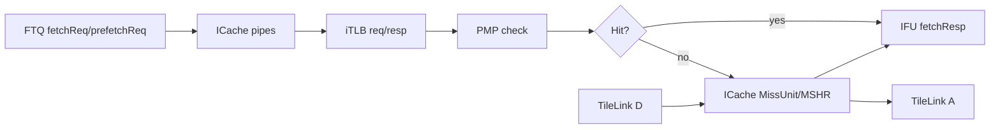
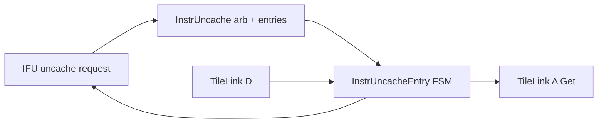
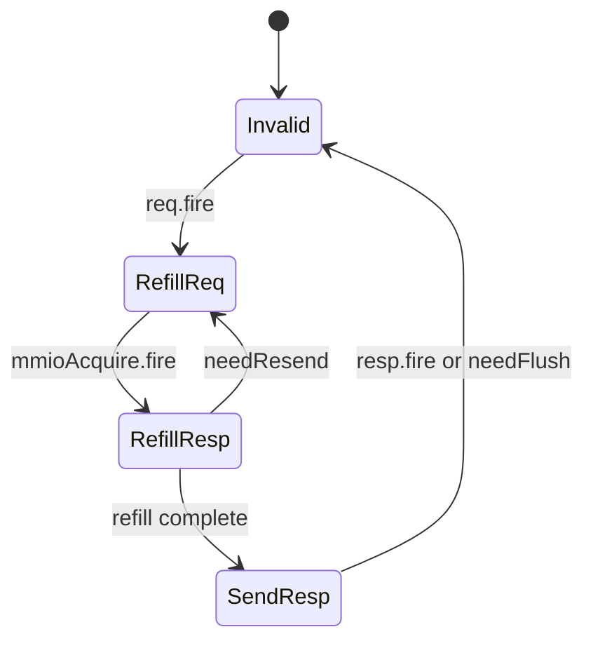

# Chapter 11. Frontend <> Memory Interface (Principles and Full Bus Map)

### Why This Section Exists

Section 10 explained how frontend and backend coordinate instruction supply and recovery. This section answers a
different question: once frontend decides **which program counter (PC) to fetch**, how does it actually obtain
instruction bytes from the memory system, and how does it remain correct under speculation, misses, redirects,
maintenance operations, and low-power entry?

If you are new to CPU microarchitecture, treat this section as a guided path from a simple model to the real one.
In a simple model, "fetch" sounds like one operation. In a modern out-of-order core, instruction fetch is a
multi-stage contract across translation, protection, cache hierarchy, and interconnect.

### From "Fetch This PC" to "Return Instruction Bytes"

A frontend fetch request starts from a **virtual address** and an **FTQ (Fetch Target Queue) context**
(which prediction stream this fetch belongs to). To return usable instruction bytes, hardware must solve
three questions in order:

1. **Where is this instruction physically located?**
   - iTLB (instruction TLB) translates virtual address to physical address.
   - PTW (page-table walker) services iTLB misses.
2. **Is access allowed, and is this address cacheable?**
   - PMP (Physical Memory Protection) and related checks determine permission and
     MMIO (memory-mapped I/O)/cacheability classification.
3. **How should bytes be transported back?**
   - cacheable path uses ICache + miss/refill machinery;
   - uncache/MMIO path uses InstrUncache + TileLink transactions.

Even wrong-path speculative fetches must obey this protocol, because speculation changes **which** address we fetch,
not the correctness rules for memory access.

### Memory Hierarchy Primer: Hit Fast, Miss in Parallel

Core pipelines run much faster than DRAM. To avoid stalling on every instruction fetch, processors place a small,
fast **instruction cache (ICache)** near the frontend.

- On a **cache hit**, bytes are returned quickly from ICache arrays.
- On a **cache miss**, a miss unit allocates tracking state (commonly an MSHR, Miss Status Holding Register),
  sends a TileLink request, and later merges refill data back into the cache pipeline.

For first-time readers, the main intuition is: frontend throughput depends not only on branch prediction quality,
but also on how effectively ICache and miss machinery hide memory latency.

### Translation and Protection Primer

Modern systems use virtual memory, so fetch addresses are usually virtual, not physical.

- **iTLB** caches recent virtual-to-physical translations.
- On iTLB miss, **PTW** performs page-table walks.
- **PMP** and related checks enforce permission and help classify MMIO vs cacheable regions.

This means instruction fetch is also part of the protection model, not just a performance path.

### Speculation, Redirects, and Epoch Safety

Frontend fetch is speculative: branch prediction may fetch from a path that later proves wrong. Memory-side
frontend logic must therefore support two properties at once:

1. keep sending useful requests aggressively for performance,
2. flush or ignore obsolete in-flight work when redirect changes control-flow epoch.

The key mental model is **epoch safety**: data or metadata from an old control-flow epoch must not be consumed
as if it belonged to the new epoch after redirect.

### Why `fence.i`, `sfence`, and `wfi` Appear in a Fetch Chapter

These controls look "system-level," but they are central to frontend-memory correctness:

- `fence.i` ensures newly written instruction bytes become visible to instruction fetch.
- `sfence`/`hfence` maintain translation correctness after page-table updates.
- `wfi` requires frontend memory traffic to quiesce before low-power entry is considered safe.

So FE/memory interface is not only about moving bytes; it also enforces architectural coherence,
translation validity, and power-state safety.

### Why FE/Memory Has More Dimensions Than FE/BE

Compared with the FE/BE boundary, the FE/memory boundary spans more independent concerns at once:

- cacheable vs uncacheable/MMIO fetch,
- translation and protection (iTLB/PTW/PMP),
- miss/refill concurrency and backpressure,
- software maintenance operations (`fence.i`, `sfence`),
- low-power quiescence (`wfi`),
- software-guided instruction prefetch hints.

This is why FE/memory discussion can feel denser than FE/BE discussion: it combines datapath, control, protection,
and system-level protocol details in one place.

### Handshake Intuition: Independent Stages, Explicit Contracts

Like other XiangShan boundaries, FE/memory communication is decoupled with explicit producer/consumer contracts
(`valid`/`ready` style channels, TileLink A/D handshakes, and request/response state machines). The key idea is the
same as in Section 10: correctness does not assume "all modules move at one speed." Instead, correctness comes from
well-defined handshakes plus flush/retry rules when control flow changes.

### What This Section Covers

- **Section 11.1** builds a layered mental model for first-time readers.
- **Sections 11.2-11.3** map top-level and internal buses with RTL anchors.
- **Sections 11.4-11.7** walk through cacheable and MMIO fetch flows, timing, and an FSM worked example.
- **Sections 11.8-11.11** discuss trade-offs and correctness-critical control flows (`fence.i`, `sfence`, `wfi`).
- **Sections 11.12-11.13** provide an integrated scenario and a practical debug checklist.

### 11.1 First-Principles Layered Mental Model

```text
Layer 1: fetch intent (virtual address, FTQ pointer)
Layer 2: translation/protection (iTLB + PMP + backend exception overlay)
Layer 3: data path selection
         - cacheable -> ICache -> miss/refill -> TileLink
         - uncache/MMIO -> InstrUncache -> TileLink
Layer 4: maintenance/control (fence.i, sfence, wfi)
```

This layered view is exactly how frontend top wires modules:

- translation/protection: [Frontend.scala:189](../../src/main/scala/xiangshan/frontend/Frontend.scala#L189),
  [Frontend.scala:160](../../src/main/scala/xiangshan/frontend/Frontend.scala#L160)
- cacheable data path: [Frontend.scala:228](../../src/main/scala/xiangshan/frontend/Frontend.scala#L228),
  [ICacheImp.scala:238](../../src/main/scala/xiangshan/frontend/icache/ICacheImp.scala#L238)
- uncache data path: [Frontend.scala:258](../../src/main/scala/xiangshan/frontend/Frontend.scala#L258),
  [InstrUncacheImp.scala:95](../../src/main/scala/xiangshan/frontend/instruncache/InstrUncacheImp.scala#L95)
- maintenance/control: [Frontend.scala:147](../../src/main/scala/xiangshan/frontend/Frontend.scala#L147),
  [Frontend.scala:239](../../src/main/scala/xiangshan/frontend/Frontend.scala#L239),
  [Frontend.scala:213](../../src/main/scala/xiangshan/frontend/Frontend.scala#L213)

### 11.2 FE/Memory Buses at Frontend Boundary

With the layered model in mind, first enumerate the buses visible at the frontend module boundary.

`FrontendIO` fields are defined at [Frontend.scala:72](../../src/main/scala/xiangshan/frontend/Frontend.scala#L72).

| Bus | Direction | Type | Function |
| --- | --- | --- | --- |
| [`hartId`](../../src/main/scala/xiangshan/frontend/Frontend.scala#L73) | System -> FE | `UInt(hartIdLen.W)` | Context for MMU/cache microstate indexing and debug attribution. |
| [`reset_vector`](../../src/main/scala/xiangshan/frontend/Frontend.scala#L74) | System -> FE | `PrunedAddr(PAddrBits)` | Boot fetch start point passed into BPU reset path. |
| [`sfence`](../../src/main/scala/xiangshan/frontend/Frontend.scala#L75) | BE/system -> FE | `SfenceBundle` | Translation-structure maintenance control (`sfence/hfence/svinval` semantics). |
| [`fencei`](../../src/main/scala/xiangshan/frontend/Frontend.scala#L76) | BE/system -> FE | `Bool` | Instruction-cache flush/invalidate request. |
| [`ptw`](../../src/main/scala/xiangshan/frontend/Frontend.scala#L77) | FE <-> MemBlock | `TlbPtwIO` | iTLB page-table-walk request/response interface. |
| [`softPrefetch`](../../src/main/scala/xiangshan/frontend/Frontend.scala#L79) | Mem-side load units -> FE | `Vec[Valid[SoftIfetchPrefetchBundle]]` | Software-driven instruction prefetch hints (e.g., `prefetch.i`). |
| [`tlbCsr`](../../src/main/scala/xiangshan/frontend/Frontend.scala#L84) | BE -> FE | `TlbCsrBundle` | MMU privilege and translation CSR context consumed by frontend iTLB/PMP flow. |
| [`error`](../../src/main/scala/xiangshan/frontend/Frontend.scala#L81) | FE -> MemBlock/BEU | `L1BusErrorUnitInfo` | I-side error reporting to outer error infrastructure. |

### 11.3 Internal FE/Memory Interface Map (Detailed)

The previous table is the external contract. This table zooms into internal FE/memory edges that carry the actual
translation, refill, MMIO, and low-power behavior.

| Bus | Direction | Producer -> Consumer | Function and evidence |
| --- | --- | --- | --- |
| [`icache.clientNode`](../../src/main/scala/xiangshan/frontend/icache/ICache.scala#L60) | FE -> memory fabric | ICache -> MemBlock `frontendBridge.icache_node` | Cacheable instruction-side TileLink client. Connected at [XSCore.scala:70](../../src/main/scala/xiangshan/XSCore.scala#L70), buffered in [MemBlock.scala:305](../../src/main/scala/xiangshan/mem/MemBlock.scala#L305). |
| [`instrUncache.clientNode`](../../src/main/scala/xiangshan/frontend/instruncache/InstrUncache.scala#L40) | FE -> memory fabric | InstrUncache -> MemBlock `frontendBridge.instr_uncache_node` | Uncache/MMIO instruction fetch TileLink client. Connected at [XSCore.scala:71](../../src/main/scala/xiangshan/XSCore.scala#L71), buffered in [MemBlock.scala:307](../../src/main/scala/xiangshan/mem/MemBlock.scala#L307). |
| [`ICacheMissUnit.memAcquire`](../../src/main/scala/xiangshan/frontend/icache/ICacheMissUnit.scala#L53) / [`ICacheMissUnit.memGrant`](../../src/main/scala/xiangshan/frontend/icache/ICacheMissUnit.scala#L54) | Bi-dir | ICache miss unit <-> TileLink | Demand/prefetch miss refill transport over TL A/D channels. Usage at [ICacheMissUnit.scala:95](../../src/main/scala/xiangshan/frontend/icache/ICacheMissUnit.scala#L95), [ICacheImp.scala:190](../../src/main/scala/xiangshan/frontend/icache/ICacheImp.scala#L190), [ICacheImp.scala:238](../../src/main/scala/xiangshan/frontend/icache/ICacheImp.scala#L238). |
| [`InstrUncacheEntry.mmioAcquire`](../../src/main/scala/xiangshan/frontend/instruncache/InstrUncacheEntry.scala#L38) / [`InstrUncacheEntry.mmioGrant`](../../src/main/scala/xiangshan/frontend/instruncache/InstrUncacheEntry.scala#L39) | Bi-dir | Uncache entry <-> TileLink | MMIO instruction fetch via dedicated uncache path. Usage at [InstrUncacheEntry.scala:80](../../src/main/scala/xiangshan/frontend/instruncache/InstrUncacheEntry.scala#L80), [InstrUncacheEntry.scala:90](../../src/main/scala/xiangshan/frontend/instruncache/InstrUncacheEntry.scala#L90), [InstrUncacheImp.scala:95](../../src/main/scala/xiangshan/frontend/instruncache/InstrUncacheImp.scala#L95). |
| [`ICache.itlb`](../../src/main/scala/xiangshan/frontend/icache/ICacheImp.scala#L55) | Bi-dir | ICache prefetch/main path <-> frontend iTLB | Virtual-to-physical translation and exception metadata fetch for I-side requests. Bound at [ICacheImp.scala:212](../../src/main/scala/xiangshan/frontend/icache/ICacheImp.scala#L212), request semantics at [ICachePrefetchPipe.scala:47](../../src/main/scala/xiangshan/frontend/icache/ICachePrefetchPipe.scala#L47), [ICachePrefetchPipe.scala:156](../../src/main/scala/xiangshan/frontend/icache/ICachePrefetchPipe.scala#L156). |
| [`TlbRequestIO`](../../src/main/scala/xiangshan/cache/mmu/MMUBundle.scala#L620) | Bi-dir | requester <-> TLB | Standard request/kill/response interface for translation clients. |
| [`TlbPtwIO`](../../src/main/scala/xiangshan/cache/mmu/MMUBundle.scala#L626) | Bi-dir | TLB <-> PTW | Page-table-walk request/response protocol. |
| frontend iTLB/PTW repeaters ([Frontend.scala:202](../../src/main/scala/xiangshan/frontend/Frontend.scala#L202), [Frontend.scala:205](../../src/main/scala/xiangshan/frontend/Frontend.scala#L205), [Frontend.scala:207](../../src/main/scala/xiangshan/frontend/Frontend.scala#L207)) | Bi-dir | frontend iTLB <-> outer PTW | Filters/repeats PTW traffic and exports through `FrontendIO.ptw`; enters MemBlock at [XSCore.scala:225](../../src/main/scala/xiangshan/XSCore.scala#L225), then to L2TLB wrapper via [MemBlock.scala:685](../../src/main/scala/xiangshan/mem/MemBlock.scala#L685). |
| [`icache.io.pmp`](../../src/main/scala/xiangshan/frontend/Frontend.scala#L165) | Bi-dir | ICache path <-> frontend PMPChecker | Instruction-side permission/MMIO classification before cache/uncache handling. Wiring at [Frontend.scala:168](../../src/main/scala/xiangshan/frontend/Frontend.scala#L168), [Frontend.scala:185](../../src/main/scala/xiangshan/frontend/Frontend.scala#L185). |
| [`softPrefetchReq`](../../src/main/scala/xiangshan/frontend/icache/ICacheImp.scala#L47) | Into FE | load units -> ICache prefetch pipe | Frontend accepts software prefetch hints and arbitrates with FTQ prefetch. See [ICacheImp.scala:164](../../src/main/scala/xiangshan/frontend/icache/ICacheImp.scala#L164), [ICacheImp.scala:177](../../src/main/scala/xiangshan/frontend/icache/ICacheImp.scala#L177). Source generation from load pipe at [LoadUnit.scala:836](../../src/main/scala/xiangshan/mem/pipeline/LoadUnit.scala#L836). |
| `wfi` fanout in FE memory path | BE->FE and FE->BE | backend WFI -> ICache/InstrUncache -> safe ack | Stops new memory requests and reports frontend-safe status for halt entry (detailed quiescence rules in §11.11). See [Frontend.scala:213](../../src/main/scala/xiangshan/frontend/Frontend.scala#L213), [ICacheMshr.scala:108](../../src/main/scala/xiangshan/frontend/icache/ICacheMshr.scala#L108), [InstrUncacheEntry.scala:80](../../src/main/scala/xiangshan/frontend/instruncache/InstrUncacheEntry.scala#L80). |

### 11.4 Dataflow Walkthroughs

After the static bus map, we now follow runtime request flow through cacheable and uncacheable paths.

#### A) Cacheable Fetch Path (Normal)



Key implementation points:

- FTQ request ingress to ICache: [ICacheImp.scala:45](../../src/main/scala/xiangshan/frontend/icache/ICacheImp.scala#L45),
  [ICacheImp.scala:198](../../src/main/scala/xiangshan/frontend/icache/ICacheImp.scala#L198)
- translation/protection in prefetch pipe: [ICachePrefetchPipe.scala:47](../../src/main/scala/xiangshan/frontend/icache/ICachePrefetchPipe.scala#L47),
  [ICachePrefetchPipe.scala:174](../../src/main/scala/xiangshan/frontend/icache/ICachePrefetchPipe.scala#L174),
  [ICachePrefetchPipe.scala:307](../../src/main/scala/xiangshan/frontend/icache/ICachePrefetchPipe.scala#L307)
- miss handling and TL traffic: [ICacheMissUnit.scala:33](../../src/main/scala/xiangshan/frontend/icache/ICacheMissUnit.scala#L33),
  [ICacheMissUnit.scala:95](../../src/main/scala/xiangshan/frontend/icache/ICacheMissUnit.scala#L95),
  [ICacheImp.scala:238](../../src/main/scala/xiangshan/frontend/icache/ICacheImp.scala#L238)

#### B) Uncache/MMIO Fetch Path



Key implementation points:

- IFU <-> InstrUncache top wiring: [Frontend.scala:258](../../src/main/scala/xiangshan/frontend/Frontend.scala#L258),
  [Frontend.scala:259](../../src/main/scala/xiangshan/frontend/Frontend.scala#L259)
- entry-level request/response and resend logic:
  [InstrUncacheEntry.scala:70](../../src/main/scala/xiangshan/frontend/instruncache/InstrUncacheEntry.scala#L70),
  [InstrUncacheEntry.scala:72](../../src/main/scala/xiangshan/frontend/instruncache/InstrUncacheEntry.scala#L72),
  [InstrUncacheEntry.scala:142](../../src/main/scala/xiangshan/frontend/instruncache/InstrUncacheEntry.scala#L142)

### 11.5 Timing View: Miss Bubble and Recovery

```text
Cycle k:     FTQ sends fetchReq
Cycle k+1:   ICache detects miss, allocates MSHR
Cycle k+2..: TL A request outstanding, IBuffer may still feed decode from queued entries
Cycle k+n:   TL D refill returns, missUnit responds to main/pre pipes
Cycle k+n+1: IFU receives fetchResp, IBuffer refills
```

Two practical observations:

1. IBuffer is what hides short frontend memory bubbles from decode-visible starvation.
2. iTLB miss and cache miss are independent causes; either can stall fetch, and topdown counters track both paths
   ([ICacheImp.scala:228](../../src/main/scala/xiangshan/frontend/icache/ICacheImp.scala#L228),
   [ICacheImp.scala:230](../../src/main/scala/xiangshan/frontend/icache/ICacheImp.scala#L230)).

### 11.6 Control FSM Example: `InstrUncacheEntry`

The uncache entry uses a compact 4-state FSM.

- `Invalid`: waiting for IFU request.
- `RefillReq`: issue TL-Get on A channel.
- `RefillResp`: wait D-channel beat(s).
- `SendResp`: return assembled data to IFU.

State definitions and transitions are explicit at
[InstrUncacheEntry.scala:48](../../src/main/scala/xiangshan/frontend/instruncache/InstrUncacheEntry.scala#L48)
to
[InstrUncacheEntry.scala:163](../../src/main/scala/xiangshan/frontend/instruncache/InstrUncacheEntry.scala#L163).



### 11.7 Worked Example: MMIO Fetch Crossing Bus Boundary

This example comes directly from `InstrUncacheEntry` comments and logic.

- IFU requests a 4-byte instruction fetch at an address that is 2-byte aligned.
- If address offset makes the 4-byte window cross MMIO bus boundary (`crossBusBoundary`), the entry may need a second
  TL Get.
- If the first 2 bytes already decode as RVC, no resend is required.
- If page boundary is crossed, resend is intentionally suppressed (`incomplete` path) to avoid assuming physically
  contiguous next page.

RTL evidence:

- boundary detection: [InstrUncacheEntry.scala:72](../../src/main/scala/xiangshan/frontend/instruncache/InstrUncacheEntry.scala#L72),
  [InstrUncacheEntry.scala:74](../../src/main/scala/xiangshan/frontend/instruncache/InstrUncacheEntry.scala#L74)
- resend condition: [InstrUncacheEntry.scala:142](../../src/main/scala/xiangshan/frontend/instruncache/InstrUncacheEntry.scala#L142)
- response `incomplete` indication: [InstrUncacheEntry.scala:104](../../src/main/scala/xiangshan/frontend/instruncache/InstrUncacheEntry.scala#L104)

This is a good microarchitecture example of "protocol granularity mismatch": architectural
instruction granularity (2B/4B) differs from bus transfer granularity (typically wider aligned beats), so the hardware
must reconcile both safely.

### 11.8 Design Trade-off Sidebar (FE/Memory Boundary)

The previous sections focused on mechanism. This section highlights why those mechanisms were chosen.

| Design choice | Benefit | Cost | Evidence |
| --- | --- | --- | --- |
| Separate cacheable and uncacheable instruction paths | Keeps normal ICache critical path cleaner; MMIO corner cases isolated. | Extra control complexity and arbitration state. | [Frontend.scala:258](../../src/main/scala/xiangshan/frontend/Frontend.scala#L258), [InstrUncacheImp.scala:61](../../src/main/scala/xiangshan/frontend/instruncache/InstrUncacheImp.scala#L61) |
| Single iTLB port in ICache prefetch path | Lower port cost and simpler timing. | Need resend logic on iTLB miss / metadata synchronization. | [ICachePrefetchPipe.scala:153](../../src/main/scala/xiangshan/frontend/icache/ICachePrefetchPipe.scala#L153), [ICachePrefetchPipe.scala:201](../../src/main/scala/xiangshan/frontend/icache/ICachePrefetchPipe.scala#L201) |
| PTW traffic through repeat/filter stages | Better control over fence/flush interactions and request shaping. | Additional latency and state machinery. | [Frontend.scala:205](../../src/main/scala/xiangshan/frontend/Frontend.scala#L205), [Frontend.scala:207](../../src/main/scala/xiangshan/frontend/Frontend.scala#L207), [MemBlock.scala:685](../../src/main/scala/xiangshan/mem/MemBlock.scala#L685) |
| WFI-gated outgoing requests | Safe architectural halt point. | Potentially longer path to "safe" if outstanding traffic exists. | [ICacheMshr.scala:108](../../src/main/scala/xiangshan/frontend/icache/ICacheMshr.scala#L108), [InstrUncacheEntry.scala:80](../../src/main/scala/xiangshan/frontend/instruncache/InstrUncacheEntry.scala#L80) |

### 11.9 Translation, Protection, and Exception Precedence

Address translation is often introduced as "TLB hit or miss". Real instruction-side flow is richer:

- backend may already know some instruction-address faults and attach them to redirect metadata;
- iTLB may produce page-fault-style exceptions;
- PMP may raise access-fault and classify MMIO;
- TileLink response may indicate denied/corrupt;
- ECC/parity may detect local data/meta corruption.

Kunminghu explicitly merges these sources in ordered layers.

#### Prefetch Pipe Layering

In prefetch pipe:

- iTLB response is captured and converted to frontend exception form
  ([ICachePrefetchPipe.scala:174](../../src/main/scala/xiangshan/frontend/icache/ICachePrefetchPipe.scala#L174),
  [ICachePrefetchPipe.scala:175](../../src/main/scala/xiangshan/frontend/icache/ICachePrefetchPipe.scala#L175)).
- backend-provided exception is merged into iTLB-side exception conceptually as part of translation-result context
  ([ICachePrefetchPipe.scala:188](../../src/main/scala/xiangshan/frontend/icache/ICachePrefetchPipe.scala#L188),
  [ICachePrefetchPipe.scala:191](../../src/main/scala/xiangshan/frontend/icache/ICachePrefetchPipe.scala#L191)).
- PMP result is merged next
  ([ICachePrefetchPipe.scala:315](../../src/main/scala/xiangshan/frontend/icache/ICachePrefetchPipe.scala#L315),
  [ICachePrefetchPipe.scala:317](../../src/main/scala/xiangshan/frontend/icache/ICachePrefetchPipe.scala#L317)).

This ordering keeps architecture-friendly semantics:

1. translation-domain exception,
2. then permission/access-domain exception,
3. then lower data-transport anomalies if needed downstream.

#### Main Pipe Layering

In main pipe:

- iTLB + PMP are merged first
  ([ICacheMainPipe.scala:284](../../src/main/scala/xiangshan/frontend/icache/ICacheMainPipe.scala#L284),
  [ICacheMainPipe.scala:285](../../src/main/scala/xiangshan/frontend/icache/ICacheMainPipe.scala#L285)).
- fetch decision blocks miss request when exception or MMIO classification is present
  ([ICacheMainPipe.scala:367](../../src/main/scala/xiangshan/frontend/icache/ICacheMainPipe.scala#L367),
  [ICacheMainPipe.scala:372](../../src/main/scala/xiangshan/frontend/icache/ICacheMainPipe.scala#L372)).
- TileLink/ecc exceptions are merged later, with iTLB/PMP priority preserved
  ([ICacheMainPipe.scala:414](../../src/main/scala/xiangshan/frontend/icache/ICacheMainPipe.scala#L414),
  [ICacheMainPipe.scala:415](../../src/main/scala/xiangshan/frontend/icache/ICacheMainPipe.scala#L415)).

This design avoids a common bug class where data-source-specific errors accidentally override architecturally-prior
address/permission faults.

#### Exception Precedence Table (Instruction-Side)

| Priority | Source class | Representative RTL |
| --- | --- | --- |
| Highest | iTLB/backend-address-context exception | [ICachePrefetchPipe.scala:191](../../src/main/scala/xiangshan/frontend/icache/ICachePrefetchPipe.scala#L191), [ICacheMainPipe.scala:285](../../src/main/scala/xiangshan/frontend/icache/ICacheMainPipe.scala#L285) |
| Next | PMP access/MMIO classification | [ICacheMainPipe.scala:281](../../src/main/scala/xiangshan/frontend/icache/ICacheMainPipe.scala#L281), [ICacheMainPipe.scala:367](../../src/main/scala/xiangshan/frontend/icache/ICacheMainPipe.scala#L367) |
| Next | TileLink denied/corrupt response | [ICacheMainPipe.scala:398](../../src/main/scala/xiangshan/frontend/icache/ICacheMainPipe.scala#L398), [ICacheMainPipe.scala:403](../../src/main/scala/xiangshan/frontend/icache/ICacheMainPipe.scala#L403) |
| Lowest | local ECC/parity corruption handling | [ICacheMainPipe.scala:288](../../src/main/scala/xiangshan/frontend/icache/ICacheMainPipe.scala#L288), [ICacheMainPipe.scala:409](../../src/main/scala/xiangshan/frontend/icache/ICacheMainPipe.scala#L409) |

### 11.10 Maintenance Operations: `fence.i` and `sfence`

Instruction-side maintenance is one of the most important FE/memory interaction topics for correctness.

#### Where control originates

`Fence` functional unit generates:

- `fencei` pulse for instruction cache side;
- `sfence` bundle for translation side.

Evidence:
[Fence.scala:28](../../src/main/scala/xiangshan/backend/fu/Fence.scala#L28),
[Fence.scala:27](../../src/main/scala/xiangshan/backend/fu/Fence.scala#L27),
[Fence.scala:66](../../src/main/scala/xiangshan/backend/fu/Fence.scala#L66),
[Fence.scala:67](../../src/main/scala/xiangshan/backend/fu/Fence.scala#L67).

#### How frontend consumes it

- frontend delays/forwards `sfence` and connects it into iTLB base control
  ([Frontend.scala:147](../../src/main/scala/xiangshan/frontend/Frontend.scala#L147),
  [Frontend.scala:193](../../src/main/scala/xiangshan/frontend/Frontend.scala#L193)).
- `fencei` is forwarded into ICache
  ([Frontend.scala:239](../../src/main/scala/xiangshan/frontend/Frontend.scala#L239)).
- ICache uses `fencei` to flush meta valid structures globally
  ([ICacheImp.scala:127](../../src/main/scala/xiangshan/frontend/icache/ICacheImp.scala#L127)).

#### PTW-side continuation

Frontend PTW path is not direct to L2TLB. It passes through repeater/filter stages in frontend, then into mem block PTW
plumbing:

- frontend PTW filter/repeater:
  [Frontend.scala:205](../../src/main/scala/xiangshan/frontend/Frontend.scala#L205),
  [Frontend.scala:207](../../src/main/scala/xiangshan/frontend/Frontend.scala#L207)
- mem block receives frontend itlb path:
  [MemBlock.scala:253](../../src/main/scala/xiangshan/mem/MemBlock.scala#L253),
  [MemBlock.scala:685](../../src/main/scala/xiangshan/mem/MemBlock.scala#L685)

Key point: maintenance events are not "single-signal magic". They become structured multi-module flows through
translation and cache subsystems.

### 11.11 WFI and Instruction-Side Memory Quiescence

WFI correctness requires that no new external memory traffic is launched after halt intent, and that in-flight
transactions are drained safely.

Frontend contributes to this by gating both cacheable and uncacheable issue points.

#### Cacheable side

- ICache miss-unit and MSHR path receive WFI request
  ([ICacheImp.scala:185](../../src/main/scala/xiangshan/frontend/icache/ICacheImp.scala#L185),
  [ICacheMissUnit.scala:103](../../src/main/scala/xiangshan/frontend/icache/ICacheMissUnit.scala#L103)).
- MSHR refuses new acquire when WFI active
  ([ICacheMshr.scala:108](../../src/main/scala/xiangshan/frontend/icache/ICacheMshr.scala#L108)).
- safe condition exported once no pending issue remains
  ([ICacheMshr.scala:144](../../src/main/scala/xiangshan/frontend/icache/ICacheMshr.scala#L144),
  [ICacheMissUnit.scala:264](../../src/main/scala/xiangshan/frontend/icache/ICacheMissUnit.scala#L264)).

#### Uncache/MMIO side

- entry blocks new acquire while WFI request is active
  ([InstrUncacheEntry.scala:80](../../src/main/scala/xiangshan/frontend/instruncache/InstrUncacheEntry.scala#L80)).
- safe condition means no pending refill response state
  ([InstrUncacheEntry.scala:93](../../src/main/scala/xiangshan/frontend/instruncache/InstrUncacheEntry.scala#L93)).

#### Frontend aggregate safe

Frontend returns combined safe only when both ICache and InstrUncache are safe:
[Frontend.scala:217](../../src/main/scala/xiangshan/frontend/Frontend.scala#L217).

Backend ROB then combines frontend-safe and mem-safe:
[Rob.scala:441](../../src/main/scala/xiangshan/backend/rob/Rob.scala#L441).

This provides a clean, compositional low-power contract across pipeline domains.

### 11.12 Longer Worked Example: I-TLB Miss + Redirect + Refill

Consider this sequence:

1. FTQ sends a fetch request for virtual address `V`.
2. ICache prefetch/main path issues iTLB request.
3. iTLB misses and enters resend/wait behavior.
4. Before translation completes, backend issues redirect for an older event.
5. Frontend flushes in-flight prefetch/main stages and restarts at corrected target.
6. Later, PTW response arrives and translation path resumes for new stream.

Why this is safe:

- prefetch pipe has explicit iTLB miss resend state machine
  ([ICachePrefetchPipe.scala:119](../../src/main/scala/xiangshan/frontend/icache/ICachePrefetchPipe.scala#L119),
  [ICachePrefetchPipe.scala:143](../../src/main/scala/xiangshan/frontend/icache/ICachePrefetchPipe.scala#L143),
  [ICachePrefetchPipe.scala:148](../../src/main/scala/xiangshan/frontend/icache/ICachePrefetchPipe.scala#L148)).
- stage-local flush signals include backend redirect and BPU stage-3 flush metadata
  ([ICachePrefetchPipe.scala:93](../../src/main/scala/xiangshan/frontend/icache/ICachePrefetchPipe.scala#L93),
  [ICachePrefetchPipe.scala:94](../../src/main/scala/xiangshan/frontend/icache/ICachePrefetchPipe.scala#L94),
  [ICachePrefetchPipe.scala:375](../../src/main/scala/xiangshan/frontend/icache/ICachePrefetchPipe.scala#L375)).
- iTLB pipeline flush is exported (`itlbFlushPipe`) and connected to frontend iTLB flush input
  ([ICachePrefetchPipe.scala:378](../../src/main/scala/xiangshan/frontend/icache/ICachePrefetchPipe.scala#L378),
  [ICacheImp.scala:213](../../src/main/scala/xiangshan/frontend/icache/ICacheImp.scala#L213),
  [Frontend.scala:191](../../src/main/scala/xiangshan/frontend/Frontend.scala#L191)).

This example shows why FE/memory interface needs explicit stage-local state instead of only top-level queues.

### 11.13 Debug and Verification Checklist for FE/Memory Bugs

When diagnosing frontend memory-side issues, use this checklist:

1. Confirm request class: cacheable hit/miss vs uncache/MMIO path.
2. Check translation status: iTLB hit/miss and whether `itlbFlushPipe` asserted recently.
3. Check exception merge order: iTLB/PMP vs TL/ecc.
4. Check redirect interaction: whether request belongs to flushed epoch.
5. Check WFI state: whether request suppression is intentional.

Useful anchors:

- request sources and arbitration:
  [ICacheImp.scala:177](../../src/main/scala/xiangshan/frontend/icache/ICacheImp.scala#L177),
  [InstrUncacheImp.scala:90](../../src/main/scala/xiangshan/frontend/instruncache/InstrUncacheImp.scala#L90)
- redirect flush in ICache:
  [ICacheImp.scala:149](../../src/main/scala/xiangshan/frontend/icache/ICacheImp.scala#L149),
  [ICacheImp.scala:192](../../src/main/scala/xiangshan/frontend/icache/ICacheImp.scala#L192)
- uncache flush hold behavior:
  [InstrUncacheEntry.scala:57](../../src/main/scala/xiangshan/frontend/instruncache/InstrUncacheEntry.scala#L57),
  [InstrUncacheEntry.scala:159](../../src/main/scala/xiangshan/frontend/instruncache/InstrUncacheEntry.scala#L159)
