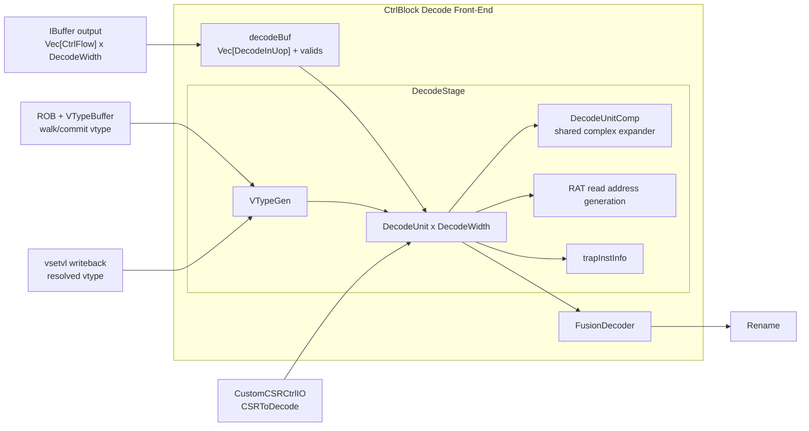
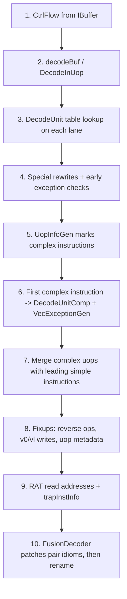
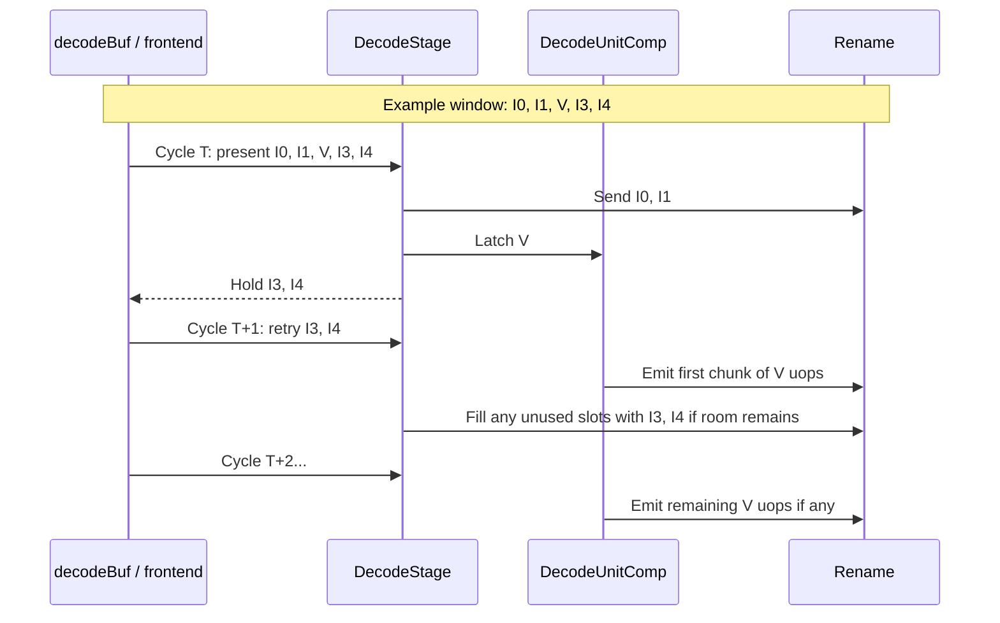
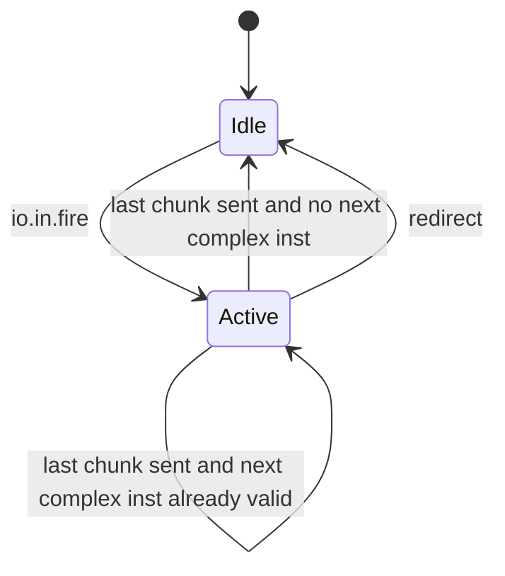

# Chapter 11. Decode Stage

At the end of Chapter 9, the frontend had already done a surprising amount of work: compressed instructions were
expanded, fetch exceptions were attached, and each instruction carried prediction metadata and an FTQ pointer. That is
enough to say, "this is the next architectural instruction in program order." It is *not* enough to drive an
out-of-order backend.

Rename does not want raw opcode bits. Dispatch does not want to rediscover register operands by re-parsing the
instruction. The issue queues do not want to infer which execution pipe is needed from scratch. What the backend needs
is a more explicit internal contract: which logical registers are read and written, which register-file classes are
involved, which functional unit should execute the operation, whether the instruction is legal in the current privilege
state, and whether one architectural instruction actually expands into several backend micro-operations.

That conversion is the job of XiangShan's decode stage. A useful mental model is that the frontend speaks the language
of an **instruction stream**, while the backend mostly speaks the language of **uops with explicit dependencies**.
Decode is the translation boundary between those two languages. After this point, later stages work with structured
control information rather than raw instruction encodings.

In Kunminghu, decode is not just a combinational opcode table. It is a small subsystem at the front of `CtrlBlock`: a
timing buffer in front of `DecodeStage`, a wide bank of simple per-lane decoders, a shared complex expander for vector
and `AMOCAS` instructions, speculative `vtype` tracking, and a post-decode fusion pass before rename. The top-level
instantiation is in
[CtrlBlock.scala:97](src/main/scala/xiangshan/backend/CtrlBlock.scala#L97),
[CtrlBlock.scala:99](src/main/scala/xiangshan/backend/CtrlBlock.scala#L99), and
[CtrlBlock.scala:100](src/main/scala/xiangshan/backend/CtrlBlock.scala#L100).

This chapter is organized as a gradual zoom-in. We start with the problem decode is solving, then identify the module
boundary and interfaces, then walk through the real data path and control behavior. If you keep one question in mind,
the rest of the chapter becomes easier to follow:

> **What extra information must be added to a fetched instruction before the out-of-order backend can safely rename,
> schedule, and retire it?**

## 11.1 Motivation and Design Challenge

Before reading the RTL, it helps to say the job in plain language. The frontend has already answered "which
instruction should come next?" Decode must answer a harder question: "what concrete work must the backend perform for
this instruction?" In a narrow in-order pipeline, those two questions are close together. In XiangShan they are not.
Once instructions enter the backend, they can be renamed, issued out of order, fused, split into multiple uops,
replayed, redirected, and finally committed in order. That only works if decode turns the instruction into a precise
internal description early enough.

### 11.1.1 From instruction bits to backend work

Consider the simple scalar instruction `add x3, x1, x2`. Architecturally, we would describe it in one sentence:
"read `x1` and `x2`, add them, and write the result to `x3`." The backend, however, needs that sentence decomposed into
machine-usable fields.

| Backend question | Example answer for `add x3, x1, x2` | Why decode must answer it |
| ---------------- | ----------------------------------- | ------------------------- |
| Which source operands are needed? | Logical sources are `x1` and `x2`. | Rename must read the correct RAT entries for those logical registers. |
| Is there a destination? | Yes, logical destination `x3`. | Rename must allocate a new physical register for the destination. |
| Which execution resource handles it? | Integer ALU, add sub-op. | Dispatch and issue need a functional-unit class and operation subtype. |
| Is there an immediate? | No. | The backend should not waste later logic re-extracting absent operands. |
| Can the instruction trap immediately? | Not for ordinary `add`. | Decode can mark early legality and exception information. |
| Does it stay as one backend uop? | Yes. | Rename and dispatch need to know whether they are seeing one unit of work or several. |

For a plain integer instruction, these answers look obvious. That is exactly why it is easy to underestimate decode.
The stage looks simple when viewed through scalar examples. The complexity appears when we ask the same questions for
CSR instructions, vector loads, `vsetvli`, `AMOCAS`, fused instruction pairs, and operations whose legality depends on
privileged state.

### 11.1.2 A simple mental model

One good mental model is to think of decode as **turning syntax into a work order**.

- The instruction bits are the syntax: opcode, register indices, immediate fields, and format bits.
- The decoded uop is the work order: which operands will be needed, which resources will execute the operation, and
  what bookkeeping later stages must preserve.

That distinction matters because later backend stages are optimized around tags, queues, and resource arbitration, not
around ISA field decoding. Rename needs logical register numbers. Dispatch needs `fuType`. The ROB needs commit
classification. Vector execution needs split metadata. If decode left all of that implicit in the raw instruction bits,
every later stage would need to partially decode the instruction again, lengthening critical paths and duplicating
logic.

### 11.1.3 Why decode is harder than opcode lookup

In a textbook single-issue pipeline, "decode" often means only opcode identification plus register-field extraction. In
XiangShan, decode has to do more because the backend is wide, speculative, and extension-heavy.

First, the backend is **out of order**. That means dependencies have to be made explicit before issue queues and the
ROB ever see the instruction. Second, XiangShan supports **vector state** whose interpretation depends on the current
`vtype` and `vstart`, so legality is not determined by opcode bits alone. Third, some architectural instructions are
best represented internally as a small group of uops rather than one monolithic action. Fourth, XiangShan performs
**instruction fusion** after decode but before rename, so decode must produce information that is still useful even when
adjacent instructions may later be collapsed. Finally, legality is partly controlled by privileged state, so decode
must cooperate with CSR logic instead of making all decisions locally.

The result is a stage that still feels "early" in the pipeline, but is already tightly connected to rename, CSR state,
vector control, and redirect recovery.

### 11.1.4 Concrete design requirements

With that mental model in place, the decode stage has to solve five concrete problems at once.

1. It must sustain the backend's front-end width. The core parameters define `DecodeWidth` and `RenameWidth`, which are
   `8` by default in [Parameters.scala:80](src/main/scala/xiangshan/Parameters.scala#L80) and
   [Parameters.scala:81](src/main/scala/xiangshan/Parameters.scala#L81), but `6` in
   [Configs.scala:511](src/main/scala/top/Configs.scala#L511) and
   [Configs.scala:512](src/main/scala/top/Configs.scala#L512) for `TLBackendV2Config`.

2. It must translate one architectural instruction into the internal control structure used by rename and dispatch.
   The output bundle `DecodeOutUop` contains logical source and destination registers, source kinds, functional-unit
   selection, writeback enables, immediate values, vector and floating-point control, and split metadata
   ([Bundles.scala:136](src/main/scala/xiangshan/backend/Bundles.scala#L136)).

3. It must detect instruction classes whose legality depends on privileged state. The CSR subsystem sends mode- and
   status-dependent legality information through `CSRToDecode`
   ([CSR.scala:417](src/main/scala/xiangshan/backend/fu/wrapper/CSR.scala#L417)), and the decode unit folds that into
   `illegalInstr` and `virtualInstr` bits
   ([DecodeUnit.scala:877](src/main/scala/xiangshan/backend/decode/DecodeUnit.scala#L877)).

4. It must handle vector state speculatively. Vector instructions depend on the current `vtype` and `vstart`, so decode
   cannot be purely local. `VTypeGen` maintains speculative and committed vector configuration state and cooperates with
   the ROB's `VTypeBuffer` during redirect recovery
   ([VTypeGen.scala:30](src/main/scala/xiangshan/backend/decode/VTypeGen.scala#L30),
   [VTypeBuffer.scala:373](src/main/scala/xiangshan/backend/rob/VTypeBuffer.scala#L373)).

5. It must preserve in-order presentation to rename even when a single instruction expands into many uops. Vector
   instructions, including configuration operations, plus `AMOCAS` are treated as complex instructions by `UopInfoGen`
   ([UopInfoGen.scala:243](src/main/scala/xiangshan/backend/decode/UopInfoGen.scala#L243)),
   then expanded by a shared `DecodeUnitComp`
   ([DecodeUnitComp.scala:108](src/main/scala/xiangshan/backend/decode/DecodeUnitComp.scala#L108)).

These requirements pull in different directions. Wide decode favors simple per-lane logic. Vector legality and uop
splitting favor richer shared machinery. Redirect recovery demands precise speculative state, but rename timing demands
that decode stay shallow enough to feed the next stage every cycle. Much of XiangShan's decode design can be read as a
set of compromises between those pressures.

Decode is therefore the first place where the backend's abstract machine model becomes concrete. It is where "an
instruction stream" becomes "a vector of backend uops with explicit dependencies and execution destinations."

## 11.2 Subsystem Context in Full-Chip View

At full-chip level, decode sits exactly on the seam between the frontend and the backend execution engine. The frontend
side is still organized around fetch blocks, prediction metadata, and instruction supply. The backend side is organized
around register dependencies, execution resources, and speculative recovery. Decode is where those concerns meet.

The figure below shows the decode subsystem in its real context. The important boundary is not only the `DecodeStage`
module, but the whole decode front-end inside `CtrlBlock`: the small `decodeBuf`, the decode logic itself, and the
fusion logic between decode and rename.

**Figure 11.1: Decode subsystem in backend context.** `CtrlBlock` inserts a narrow timing buffer in front of
`DecodeStage`, then applies instruction fusion at the decode-to-rename boundary. The decode stage itself contains both
simple per-lane decoders and one shared complex path.

For a first reading of this figure, follow only the main left-to-right path:

1. The IBuffer presents up to `DecodeWidth` frontend records.
2. `decodeBuf` keeps any suffix that decode cannot accept immediately.
3. `DecodeUnit` performs ordinary per-lane decoding.
4. `DecodeUnitComp` handles the oldest complex instruction, if one is present.
5. `FusionDecoder` optionally merges adjacent decoded instructions before rename.

The remaining arrows are feedback paths that make decode more than a pure lookup block.

- `CSR -> DecodeStage` carries privilege- and status-dependent legality information.
- `ROB + VTypeBuffer -> VTypeGen` repairs speculative vector state during redirect recovery.
- `vsetvl writeback -> VTypeGen` feeds back the resolved `vtype` for the register-based `vsetvl` form.
- `redirect -> DecodeStage` kills wrong-path work and prevents incorrect speculative updates.

This already shows an important architectural point: decode is "early" in instruction age, but not isolated. It is one
of the first stages to consume global control information from elsewhere in the backend.

The timing buffer is implemented directly in `CtrlBlock` as `decodeBufBits` and `decodeBufValid`
([CtrlBlock.scala:438](src/main/scala/xiangshan/backend/CtrlBlock.scala#L438),
[CtrlBlock.scala:442](src/main/scala/xiangshan/backend/CtrlBlock.scala#L442)). When decode cannot consume all visible
frontend instructions, the unaccepted suffix is held there and retried first on the next cycle
([CtrlBlock.scala:486](src/main/scala/xiangshan/backend/CtrlBlock.scala#L486) to
[CtrlBlock.scala:526](src/main/scala/xiangshan/backend/CtrlBlock.scala#L526)).

That buffer is worth emphasizing because it is easy to miss in a block-level overview. The IBuffer has already
smoothed fetch burstiness across the frontend/backend boundary. `decodeBuf` solves a *different* problem: it absorbs
local backpressure created by the decode subsystem itself, especially when a complex instruction prevents younger
instructions from advancing in the same cycle. Without this extra holding point, `DecodeStage` would need a more
awkward handshake with the frontend-visible window.

## 11.3 Module Boundary and External Interfaces

For a newcomer, the bundle names can feel abstract. A simple way to read the stage boundary is as three increasingly
specific descriptions of the same instruction:

1. `CtrlFlow` is the frontend's description: "this instruction was fetched here, with this metadata."
2. `DecodeInUop` is the decode-facing subset: "here is the instruction plus the fetch information decode still needs."
3. `DecodeOutUop` is the backend contract: "here is the operation in a form rename and dispatch can act on."

### 11.3.1 Three bundle views of one instruction

Two bundle transitions matter at the stage boundary.

| Bundle | Defined in | Role |
| ------ | ---------- | ---- |
| [`CtrlFlow`](src/main/scala/xiangshan/Bundle.scala#L94) | [Bundle.scala:94](src/main/scala/xiangshan/Bundle.scala#L94) | Frontend-to-backend instruction record: raw 32-bit instruction, PC-related metadata, fetch exceptions, prediction state, FTQ location, and debug sequence number. |
| [`DecodeInUop`](src/main/scala/xiangshan/backend/Bundles.scala#L107) | [Bundles.scala:107](src/main/scala/xiangshan/backend/Bundles.scala#L107) | Decode-facing subset of `CtrlFlow`, created by `connectCtrlFlow` in `CtrlBlock`; carries instruction bits plus fetch-side metadata, but not the full architectural control state yet. |
| [`DecodeOutUop`](src/main/scala/xiangshan/backend/Bundles.scala#L136) | [Bundles.scala:136](src/main/scala/xiangshan/backend/Bundles.scala#L136) | Decode result sent toward rename: logical register operands, source kinds, immediate, `fuType`, `fuOpType`, commit type, vector/floating-point metadata, split markers, and writeback enables. |

The progression from `CtrlFlow` to `DecodeOutUop` captures the chapter's central transition. Frontend information does
not disappear: PC, FTQ location, exception bits, and debug sequence number still matter. But decode adds exactly the
fields the out-of-order backend needs next. The important change is not that data is thrown away. The important change
is that *execution intent becomes explicit*.

### 11.3.2 Terminology that matters in this chapter

The following terms appear repeatedly in decode RTL and are worth fixing before the detailed walkthrough.

| Term | Meaning in this chapter |
| ---- | ----------------------- |
| Architectural instruction | One ISA-visible RISC-V instruction, such as `add`, `ld`, or `vsetvli`. This is what software thinks it issued. |
| Uop | The backend's internal unit of work. Many instructions stay 1:1, but vector and `AMOCAS` instructions may expand into several uops before rename. |
| Logical source / destination | Architectural register names such as `x1`, `f3`, or `v8`. Decode produces these as `lsrc` and `ldest` in [`DecodeOutUop`](src/main/scala/xiangshan/backend/Bundles.scala#L136). |
| Physical source / destination | Backend register tags allocated later by rename. Decode does **not** allocate them yet; it only prepares the logical information rename will consume. |
| `fuType` | A coarse execution-class tag such as ALU, load/store, floating-point, vector, or CSR-like internal path. It guides dispatch and issue placement. |
| `fuOpType` | A finer operation subtype inside a functional-unit class, such as add vs. shift vs. compare. |
| Complex instruction | An instruction whose final backend representation is not produced by the simple per-lane decoder alone. In this chapter, that mainly means vector instructions and `AMOCAS`. |
| Speculative state | Decode-visible state that may later be rolled back on a redirect. `vtypeSpec` is the key example in this stage. |

Two distinctions are especially important.

First, **logical** registers are still ISA names. Decode says "this instruction reads `x1`." Rename later turns that
into "read physical register `p47`." Second, **uop count** is not always the same as **instruction count**. Once that
point is clear, the behavior of `DecodeUnitComp`, `decodeBuf`, and the timing diagrams becomes much easier to reason
about.

### 11.3.3 What decode decides, and what it leaves for later

Decode decides enough to make the rest of the control pipeline possible, but it does not do every piece of backend
work.

Decode *does* decide:

- logical operand identities
- immediate extraction and source kinds
- functional-unit class and sub-op
- early legality and exception classification
- whether the instruction is simple or requires complex expansion
- metadata needed for vector, floating-point, and commit bookkeeping

Decode does *not* yet decide:

- physical register allocation
- ROB entry allocation
- issue-queue placement among specific queue instances
- final execution scheduling time
- actual operand values

This division is the reason the bundle boundary is so important. `DecodeOutUop` is the earliest representation rich
enough for rename and dispatch, but still abstract enough that the backend can make later resource-allocation decisions
independently.

### 11.3.4 `DecodeStageIO` and surrounding control ports

`DecodeStageIO` adds the control environment around these bundles
([DecodeStage.scala:34](src/main/scala/xiangshan/backend/decode/DecodeStage.scala#L34)).

| Port group | Direction | Purpose |
| ---------- | --------- | ------- |
| [`redirect`](src/main/scala/xiangshan/backend/decode/DecodeStage.scala#L43) | Input | Kills decode on wrong-path instructions and suppresses speculative `vtype` updates. |
| [`in`](src/main/scala/xiangshan/backend/decode/DecodeStage.scala#L46), [`out`](src/main/scala/xiangshan/backend/decode/DecodeStage.scala#L48) | Input / Output | Main decode window: `Vec[DecoupledIO[DecodeInUop]]` to `Vec[DecoupledIO[DecodeOutUop]]`. |
| [`intRat`](src/main/scala/xiangshan/backend/decode/DecodeStage.scala#L50), [`fpRat`](src/main/scala/xiangshan/backend/decode/DecodeStage.scala#L51), [`vecRat`](src/main/scala/xiangshan/backend/decode/DecodeStage.scala#L52), [`v0Rat`](src/main/scala/xiangshan/backend/decode/DecodeStage.scala#L54), [`vlRat`](src/main/scala/xiangshan/backend/decode/DecodeStage.scala#L55) | Output to RAT read ports | Decode drives logical source indices early so rename can receive physical mappings without adding another stage. |
| [`csrCtrl`](src/main/scala/xiangshan/backend/decode/DecodeStage.scala#L57), [`fromCSR`](src/main/scala/xiangshan/backend/decode/DecodeStage.scala#L58) | Input | Custom decode policy and privilege-dependent legality information from CSR logic. |
| [`fromRob`](src/main/scala/xiangshan/backend/decode/DecodeStage.scala#L62), [`vsetvlVType`](src/main/scala/xiangshan/backend/decode/DecodeStage.scala#L75), [`vstart`](src/main/scala/xiangshan/backend/decode/DecodeStage.scala#L76) | Input | Recovery and vector-state feedback: commit-time `vtype`, walk-time `vtype`, resolved `vsetvl` `vtype`, and current `vstart`. |
| [`toCSR.trapInstInfo`](src/main/scala/xiangshan/backend/decode/DecodeStage.scala#L78) | Output | Reports the first accepted illegal instruction to CSR/trap control for precise bookkeeping. |
| [`stallReason`](src/main/scala/xiangshan/backend/decode/DecodeStage.scala#L71) | Input / Output | Top-down performance attribution for bubbles and backpressure. |

## 11.4 Internal Pipeline and Data Path Walkthrough

The decode stage can be understood as a ten-step data path. The steps are shown first as a diagram and then explained in
detail.

Before diving into the details, it helps to compress the whole stage into one sentence: decode takes a frontend-sized
instruction window, performs as much ordinary per-lane classification as possible, sends the oldest complex instruction
through a shared expansion path, and then hands rename an in-order uop window.

That sentence already hints at the structure of the RTL. There is a wide parallel part for common-case decoding and a
shared serialized part for instructions whose backend representation is more expensive to build. The rest of this
section makes that division concrete.

**Figure 11.2: Step-by-step decode data flow.**

When reading the ten steps below, keep two questions in mind.

- What new information becomes explicit at this step?
- Why is this work placed in decode rather than deferred to a later stage?

### 11.4.1 Frontend handoff and the decode buffer

At the backend boundary, the frontend presents `Vec[DecoupledIO[CtrlFlow]]` on `cfVec`
([Bundle.scala:448](src/main/scala/xiangshan/Bundle.scala#L448)). `CtrlBlock` immediately converts those bundles into
`DecodeInUop` records by calling `connectCtrlFlow`
([Bundles.scala:122](src/main/scala/xiangshan/backend/Bundles.scala#L122),
[CtrlBlock.scala:503](src/main/scala/xiangshan/backend/CtrlBlock.scala#L503)).

The key implementation detail is that decode is *not* wired directly to the frontend. `CtrlBlock` keeps a small
register buffer, `decodeBuf`, in front of `DecodeStage`
([CtrlBlock.scala:425](src/main/scala/xiangshan/backend/CtrlBlock.scala#L425) to
[CtrlBlock.scala:526](src/main/scala/xiangshan/backend/CtrlBlock.scala#L526)). This buffer solves a timing problem:
`DecodeStage` can refuse only a suffix of the current window, so the backend needs a place to hold those instructions
without asking the frontend to replay them.

An example helps. Suppose the visible age-ordered window is `[I0, I1, V2, I3, I4]`, where `V2` is the first complex
vector instruction. Decode may be able to pass `I0` and `I1`, and it may be able to start processing `V2`, but it
cannot allow younger instructions `I3` and `I4` to jump ahead. `decodeBuf` is the structure that remembers that held
suffix exactly as-is so the next cycle can resume from the correct age boundary.

Two consequences follow.

1. Buffered instructions always have priority over fresh frontend input
   ([CtrlBlock.scala:521](src/main/scala/xiangshan/backend/CtrlBlock.scala#L521)).

2. Backpressure toward the frontend is generated from the state of `decodeBuf`, not directly from the combinational
   readiness of the simple decoders
   ([CtrlBlock.scala:526](src/main/scala/xiangshan/backend/CtrlBlock.scala#L526)).

This is a clean interface division. The frontend sees only whether the backend-side entrance can accept more work. It
does not need to know whether the temporary blockage came from rename backpressure, a complex vector expansion, or a
redirect-sensitive control condition inside decode.

### 11.4.2 Simple decode on every lane

Inside `DecodeStage`, XiangShan instantiates one `DecodeUnit` per visible instruction lane
([DecodeStage.scala:109](src/main/scala/xiangshan/backend/decode/DecodeStage.scala#L109) to
[DecodeStage.scala:128](src/main/scala/xiangshan/backend/decode/DecodeStage.scala#L128)). Each `DecodeUnit` performs a
table lookup over the union of scalar integer, floating-point, bit-manipulation, crypto, debug, cache-management,
hypervisor, vector, `Zicond`, `Zimop`, and `Zfa` decode tables
([DecodeUnit.scala:798](src/main/scala/xiangshan/backend/decode/DecodeUnit.scala#L798) to
[DecodeUnit.scala:810](src/main/scala/xiangshan/backend/decode/DecodeUnit.scala#L810)).

Here "simple decode" should be read carefully. It does not mean "only scalar integer instructions." It means that one
lane's decoder can classify the instruction and produce a useful preliminary uop description without entering the
shared complex expander. Many instructions outside the scalar ALU class still benefit from this one-pass path.

From that lookup, the simple path derives the core control fields:

- Logical sources `lsrc(0..3)` and logical destination `ldest`
  ([DecodeUnit.scala:841](src/main/scala/xiangshan/backend/decode/DecodeUnit.scala#L841) to
  [DecodeUnit.scala:849](src/main/scala/xiangshan/backend/decode/DecodeUnit.scala#L849)).
- Source kinds `srcType`, functional-unit class `fuType`, and operation subtype `fuOpType`
  ([Bundle.scala:128](src/main/scala/xiangshan/Bundle.scala#L128),
  [DecodeUnit.scala:818](src/main/scala/xiangshan/backend/decode/DecodeUnit.scala#L818)).
- Immediate value selection and extraction through `selImm` and `ImmUnion`
  ([DecodeUnit.scala:921](src/main/scala/xiangshan/backend/decode/DecodeUnit.scala#L921)).
- Commit classification for load/store accounting
  ([DecodeUnit.scala:929](src/main/scala/xiangshan/backend/decode/DecodeUnit.scala#L929) to
  [DecodeUnit.scala:937](src/main/scala/xiangshan/backend/decode/DecodeUnit.scala#L937)).
- Floating-point and vector execution metadata
  ([DecodeUnit.scala:1074](src/main/scala/xiangshan/backend/decode/DecodeUnit.scala#L1074) to
  [DecodeUnit.scala:1123](src/main/scala/xiangshan/backend/decode/DecodeUnit.scala#L1123)).

For less experienced readers, the most useful distinction here is between `fuType` and `fuOpType`. `fuType` chooses a
family of execution resources: ALU, branch, load/store, floating-point, vector, and so on. `fuOpType` then tells that
family which exact operation to perform. Keeping those two levels separate lets dispatch reason in coarse categories
while execution units still receive fine-grained operation codes.

This simple path also performs several *translations* from architectural instructions to backend-friendly internal uops.

- `addi rd, rs1, 0` is tagged as `isMove`, enabling move elimination in rename
  ([DecodeUnit.scala:830](src/main/scala/xiangshan/backend/decode/DecodeUnit.scala#L830) to
  [DecodeUnit.scala:833](src/main/scala/xiangshan/backend/decode/DecodeUnit.scala#L833)).
- `zimop` is temporarily represented as a move-like `addi` from `x0` with immediate `0`
  ([DecodeUnit.scala:827](src/main/scala/xiangshan/backend/decode/DecodeUnit.scala#L827),
  [DecodeUnit.scala:1174](src/main/scala/xiangshan/backend/decode/DecodeUnit.scala#L1174)).
- `csrr vl` is translated away from the general CSR path into an internal `vset`-family read of the dedicated `vl`
  register file
  ([DecodeUnit.scala:861](src/main/scala/xiangshan/backend/decode/DecodeUnit.scala#L861) to
  [DecodeUnit.scala:863](src/main/scala/xiangshan/backend/decode/DecodeUnit.scala#L863),
  [DecodeUnit.scala:1150](src/main/scala/xiangshan/backend/decode/DecodeUnit.scala#L1150) to
  [DecodeUnit.scala:1159](src/main/scala/xiangshan/backend/decode/DecodeUnit.scala#L1159)).
- `csrr vlenb` becomes an `addi` with immediate `VLEN/8`
  ([DecodeUnit.scala:862](src/main/scala/xiangshan/backend/decode/DecodeUnit.scala#L862),
  [DecodeUnit.scala:1160](src/main/scala/xiangshan/backend/decode/DecodeUnit.scala#L1160) to
  [DecodeUnit.scala:1169](src/main/scala/xiangshan/backend/decode/DecodeUnit.scala#L1169),
  [DecodeUnit.scala:1199](src/main/scala/xiangshan/backend/decode/DecodeUnit.scala#L1199) to
  [DecodeUnit.scala:1206](src/main/scala/xiangshan/backend/decode/DecodeUnit.scala#L1206)).
- Soft-prefetch hints are reclassified as load-unit operations
  ([DecodeUnit.scala:1141](src/main/scala/xiangshan/backend/decode/DecodeUnit.scala#L1141) to
  [DecodeUnit.scala:1145](src/main/scala/xiangshan/backend/decode/DecodeUnit.scala#L1145),
  [DecodeUnit.scala:1170](src/main/scala/xiangshan/backend/decode/DecodeUnit.scala#L1170) to
  [DecodeUnit.scala:1173](src/main/scala/xiangshan/backend/decode/DecodeUnit.scala#L1173)).

One more rewrite matters for vector memory: the simple decoder first recognizes generic `vldu` or `vstu`, then
converts segmented operations into `vsegldu` or `vsegstu` based on `NF`, `MOP`, and `LUMOP/SUMOP`
([DecodeUnit.scala:1184](src/main/scala/xiangshan/backend/decode/DecodeUnit.scala#L1184) to
[DecodeUnit.scala:1197](src/main/scala/xiangshan/backend/decode/DecodeUnit.scala#L1197)).

These translations show that XiangShan's internal control vocabulary is shaped by backend implementation needs, not by
the ISA manual alone. Decode is willing to reinterpret an architectural instruction into a more backend-natural form if
that makes later stages cleaner.

### 11.4.3 Early exception checks

Decode performs two layers of legality checking.

The first layer is scalar and privilege-aware. `CSRToDecode` exposes mode-dependent legality conditions such as
`sfence`/`hfence` permissions, `FS`/`VS` state, `WFI` enable rules, and cache-management permissions
([CSR.scala:417](src/main/scala/xiangshan/backend/fu/wrapper/CSR.scala#L417),
[NewCSR.scala:1478](src/main/scala/xiangshan/backend/fu/NewCSR/NewCSR.scala#L1478) to
[NewCSR.scala:1512](src/main/scala/xiangshan/backend/fu/NewCSR/NewCSR.scala#L1512)).
`DecodeUnit` combines those signals with local checks such as invalid decode table hits, reserved rounding modes,
`aes64ks1i` immediates, and `amocas.q` register alignment
([DecodeUnit.scala:877](src/main/scala/xiangshan/backend/decode/DecodeUnit.scala#L877) to
[DecodeUnit.scala:916](src/main/scala/xiangshan/backend/decode/DecodeUnit.scala#L916)).

The second layer is vector-specific. Full vector legality is deferred to `VecExceptionGen` in the complex path, because
those checks depend on `vtype`, `vstart`, EEW/EMUL relationships, segment width, register grouping, and overlap rules
([VecExceptionGen.scala:174](src/main/scala/xiangshan/backend/decode/VecExceptionGen.scala#L174) to
[VecExceptionGen.scala:294](src/main/scala/xiangshan/backend/decode/VecExceptionGen.scala#L294)).

This split is intentional. Simple decode handles fast privilege checks on every lane, while the shared complex path
handles the heavier vector legality logic only for instructions that need it.

It is equally important to notice what decode is *not* checking. At this point the stage is deciding whether the
instruction is legal to enter the backend under the current architectural and privileged-state rules. It is not trying
to predict later runtime events such as data page faults, cache misses, or arithmetic results. Those belong to later
execution stages.

### 11.4.4 Speculative `vtype` tracking

Vector decode depends on the *current* vector configuration, not just the instruction bits. XiangShan therefore carries
`vtype` through a dedicated speculative structure, `VTypeGen`
([VTypeGen.scala:30](src/main/scala/xiangshan/backend/decode/VTypeGen.scala#L30)).

For intuition, treat `vtype` as a hidden operand of many vector instructions. The opcode tells decode *which* vector
operation is requested, but the current vector configuration helps determine *how that operation should be interpreted*:
element width, grouping, and some legality constraints. That is why vector decode cannot be reduced to local opcode
lookup in the way a simple scalar ALU instruction often can.

`VTypeGen` maintains two registers:

- `vtypeArch`, the latest committed architectural `vtype`
  ([VTypeGen.scala:55](src/main/scala/xiangshan/backend/decode/VTypeGen.scala#L55)).
- `vtypeSpec`, the speculative `vtype` seen by instructions currently entering decode
  ([VTypeGen.scala:57](src/main/scala/xiangshan/backend/decode/VTypeGen.scala#L57)).

The update priority is visible directly in the RTL
([VTypeGen.scala:83](src/main/scala/xiangshan/backend/decode/VTypeGen.scala#L83) to
[VTypeGen.scala:109](src/main/scala/xiangshan/backend/decode/VTypeGen.scala#L109)).

1. A committed `vsetvl` wins first, because its resolved `vtype` is only known after execution.
2. If the ROB is walking after a redirect, `walkVType` restores speculative state.
3. At the start of a walk, decode falls back to `vtypeArch`.
4. Otherwise, the first in-flight `vsetvli` or `vsetivli` in the current decode window may speculatively update
   `vtypeSpec`, but only when that instruction actually enters the complex path
   ([DecodeStage.scala:167](src/main/scala/xiangshan/backend/decode/DecodeStage.scala#L167)).

This is also why `vsetvl` is special. `vsetvli` and `vsetivli` encode the new `vtype` in the instruction itself, so
decode can derive it from immediates. `vsetvl` reads a register operand, so decode must wait for the actual execution
result and accept resolved feedback from the backend
([VTypeGen.scala:36](src/main/scala/xiangshan/backend/decode/VTypeGen.scala#L36) to
[VTypeGen.scala:43](src/main/scala/xiangshan/backend/decode/VTypeGen.scala#L43),
[Backend.scala:424](src/main/scala/xiangshan/backend/Backend.scala#L424),
[CtrlBlock.scala:830](src/main/scala/xiangshan/backend/CtrlBlock.scala#L830)).

The broader lesson is that vector support makes decode stateful. Scalar integer decode mostly extracts intent from the
instruction itself. Vector decode often needs both the instruction and the current speculative vector environment.

### 11.4.5 Complex expansion: vector instructions and `AMOCAS`

The simple decoder does not directly emit all final uops for vector instructions or `AMOCAS`. Instead it attaches
pre-decode information to `UopInfoGen`, which decides whether the instruction is complex and computes split-related
metadata such as `numOfWB` and `lmul`
([DecodeUnit.scala:1124](src/main/scala/xiangshan/backend/decode/DecodeUnit.scala#L1124) to
[DecodeUnit.scala:1139](src/main/scala/xiangshan/backend/decode/DecodeUnit.scala#L1139),
[UopInfoGen.scala:196](src/main/scala/xiangshan/backend/decode/UopInfoGen.scala#L196) to
[UopInfoGen.scala:246](src/main/scala/xiangshan/backend/decode/UopInfoGen.scala#L246)).

The rule is deliberately simple:

- Any vector arithmetic or configuration instruction is complex.
- Any vector memory instruction is complex.
- Any `AMOCAS` instruction is complex.

That rule appears at [UopInfoGen.scala:243](src/main/scala/xiangshan/backend/decode/UopInfoGen.scala#L243) and
[UopInfoGen.scala:244](src/main/scala/xiangshan/backend/decode/UopInfoGen.scala#L244).

`DecodeStage` then selects only the *first* complex instruction in the current window
([DecodeStage.scala:156](src/main/scala/xiangshan/backend/decode/DecodeStage.scala#L156) to
[DecodeStage.scala:160](src/main/scala/xiangshan/backend/decode/DecodeStage.scala#L160)).
That instruction is sent to the shared `DecodeUnitComp`
([DecodeStage.scala:173](src/main/scala/xiangshan/backend/decode/DecodeStage.scala#L173) to
[DecodeStage.scala:188](src/main/scala/xiangshan/backend/decode/DecodeStage.scala#L188)).

Selecting only the oldest complex instruction is a deliberate simplification. It ensures there is exactly one source of
newly expanded complex uops at a time, which keeps age ordering straightforward. The price is that no second complex
instruction can begin expansion in the same cycle, but the benefit is much simpler control and merge logic.

Inside `DecodeUnitComp`, the instruction is latched, checked by `VecExceptionGen` when relevant, and expanded into a
`csBundle` of potential uops
([DecodeUnitComp.scala:131](src/main/scala/xiangshan/backend/decode/DecodeUnitComp.scala#L131) to
[DecodeUnitComp.scala:173](src/main/scala/xiangshan/backend/decode/DecodeUnitComp.scala#L173),
[DecodeUnitComp.scala:190](src/main/scala/xiangshan/backend/decode/DecodeUnitComp.scala#L190)).
Examples from the RTL include:

- `AMOCAS.W` and `AMOCAS.D` splitting into two uops, and `AMOCAS.Q` into four
  ([DecodeUnitComp.scala:210](src/main/scala/xiangshan/backend/decode/DecodeUnitComp.scala#L210) to
  [DecodeUnitComp.scala:277](src/main/scala/xiangshan/backend/decode/DecodeUnitComp.scala#L277)).
- `vset*` splitting into two coordinated uops, one for the scalar destination and one for `vl`/`vtype`
  ([DecodeUnitComp.scala:278](src/main/scala/xiangshan/backend/decode/DecodeUnitComp.scala#L278) to
  [DecodeUnitComp.scala:352](src/main/scala/xiangshan/backend/decode/DecodeUnitComp.scala#L352)).
- Vector arithmetic and vector load/store families mapping LMUL-sized register groups into repeated uops with distinct
  `uopIdx`, logical source indices, and destinations
  ([DecodeUnitComp.scala:355](src/main/scala/xiangshan/backend/decode/DecodeUnitComp.scala#L355)).

The complex path can emit at most `RenameWidth` uops per cycle, but one instruction may require many more. `MaxUopSize`
is therefore larger than the decode width: it is `65` by default in
[Parameters.scala:85](src/main/scala/xiangshan/Parameters.scala#L85).

This is where instruction count and backend work count visibly diverge. One architecturally visible instruction may
occupy the complex path for multiple cycles while it emits a whole stream of backend uops. The surrounding decode logic
exists largely to make that expansion invisible to rename's in-order contract.

### 11.4.6 Merge and final output fixups

Once the complex expander has produced its current chunk, `DecodeStage` merges those uops with the simple results
([DecodeStage.scala:227](src/main/scala/xiangshan/backend/decode/DecodeStage.scala#L227) to
[DecodeStage.scala:255](src/main/scala/xiangshan/backend/decode/DecodeStage.scala#L255)).

The ordering rule is strict:

1. Complex uops for the oldest complex instruction occupy the lowest output positions.
2. Only the prefix of current simple instructions *before* the next complex instruction may fill remaining slots.
3. Instructions after the first complex instruction wait until earlier complex expansion has made room.

This is how the stage preserves in-order presentation to rename without stalling all scalar work behind every vector
instruction.

An example makes the rule easier to remember. Suppose `RenameWidth = 8` and the first emitted chunk of a complex vector
instruction contains six uops. Those six must occupy the lowest output positions. The remaining two positions can be
filled only by younger simple instructions that are now allowed to advance without violating age order. Decode is not
choosing between "stall everything" and "let younger work overtake"; it preserves the oldest prefix and opportunistically
uses any safe leftover width.

The same output block also applies several important fixups.

- Reverse vector operations swap source 0 and source 1
  ([DecodeStage.scala:243](src/main/scala/xiangshan/backend/decode/DecodeStage.scala#L243) to
  [DecodeStage.scala:246](src/main/scala/xiangshan/backend/decode/DecodeStage.scala#L246)).
- A vector write to logical destination `0` is converted from `vecWen` into `v0Wen`
  ([DecodeStage.scala:247](src/main/scala/xiangshan/backend/decode/DecodeStage.scala#L247) and
  [DecodeStage.scala:248](src/main/scala/xiangshan/backend/decode/DecodeStage.scala#L248)).
- If any of the first four logical sources refers to vector register `v0`, source slot 3 is forced to `SrcType.v0`
  ([DecodeStage.scala:249](src/main/scala/xiangshan/backend/decode/DecodeStage.scala#L249) to
  [DecodeStage.scala:253](src/main/scala/xiangshan/backend/decode/DecodeStage.scala#L253)).
- An assertion guarantees that one uop writes at most one architectural register-file class
  ([DecodeStage.scala:257](src/main/scala/xiangshan/backend/decode/DecodeStage.scala#L257) to
  [DecodeStage.scala:260](src/main/scala/xiangshan/backend/decode/DecodeStage.scala#L260)).

These post-merge fixups are the sort of details that keep later stages simpler. By the time a uop leaves decode,
awkward operand-order quirks and dedicated vector bookkeeping cases have already been normalized into the form rename
expects.

### 11.4.7 RAT read setup and trap-side reporting

Decode does not only *produce* uops. It also prepares rename by driving the logical register addresses for the rename
alias tables. Integer, floating-point, vector, `v0`, and `vl` RAT ports are all assigned directly from the decoded
logical sources
([DecodeStage.scala:264](src/main/scala/xiangshan/backend/decode/DecodeStage.scala#L264) to
[DecodeStage.scala:292](src/main/scala/xiangshan/backend/decode/DecodeStage.scala#L292)).

The comment at [DecodeStage.scala:269](src/main/scala/xiangshan/backend/decode/DecodeStage.scala#L269) is important:
the RAT reads use the logical sources *before fusion* for better timing. Fusion can still alter the first uop later,
but rename repairs the affected physical source through a sideband `FusionDecodeInfo`
([FusionDecoder.scala:507](src/main/scala/xiangshan/backend/decode/FusionDecoder.scala#L507),
[Rename.scala:440](src/main/scala/xiangshan/backend/rename/Rename.scala#L440) to
[Rename.scala:445](src/main/scala/xiangshan/backend/rename/Rename.scala#L445)).

This is a good example of a timing-aware division of labor. Decode starts RAT-related work as early as possible using
the pre-fusion operand view. If fusion later changes one source, the narrower repair path in rename absorbs that cost
instead of forcing the common decode-to-RAT path to become longer.

Illegal instructions are also reported out of decode. `DecodeStage` captures the first accepted illegal or virtual
instruction and sends `trapInstInfo` toward CSR/trap control one cycle later
([DecodeStage.scala:137](src/main/scala/xiangshan/backend/decode/DecodeStage.scala#L137) to
[DecodeStage.scala:145](src/main/scala/xiangshan/backend/decode/DecodeStage.scala#L145),
[DecodeStage.scala:306](src/main/scala/xiangshan/backend/decode/DecodeStage.scala#L306) and
[DecodeStage.scala:307](src/main/scala/xiangshan/backend/decode/DecodeStage.scala#L307)).

Decode is not resolving the entire trap here. It is simply identifying the earliest accepted offending instruction and
forwarding precise information so later control logic can take the architectural action cleanly.

## 11.5 Control and State-Machine Behavior

### 11.5.1 Admission control and in-order progress

`DecodeStage` accepts new work only when three conditions hold
([DecodeStage.scala:201](src/main/scala/xiangshan/backend/decode/DecodeStage.scala#L201) to
[DecodeStage.scala:204](src/main/scala/xiangshan/backend/decode/DecodeStage.scala#L204)).

1. No redirect is pending.
2. Either rename can take the current output chunk, or the complex decoder can accept a new complex instruction.
3. The ROB is not currently forcing a `vtype` resume through `isResumeVType`.

Per-lane `ready` is then computed from instruction order
([DecodeStage.scala:206](src/main/scala/xiangshan/backend/decode/DecodeStage.scala#L206) to
[DecodeStage.scala:220](src/main/scala/xiangshan/backend/decode/DecodeStage.scala#L220)).
The prefix of simple instructions before the first complex instruction may advance immediately. The first complex
instruction may advance only if the shared complex decoder is ready. Any younger instruction after that first complex
instruction must wait.

The result is a pipeline that is wide for common scalar code but still strictly ordered.

Another way to say this is that decode only allows an **oldest contiguous prefix** of the current window to move
forward, with a special case that the first complex instruction may be the stopping point. Sparse progress such as
"lane 0 advances, lane 1 stalls, lane 2 advances" would make rename and the ROB reason about ordering holes at the
decode boundary itself. XiangShan avoids that complexity.

**Figure 11.3: Timing behavior when a complex instruction appears inside the decode window.**

Seen in that light, the `ready` logic and `decodeBuf` are two halves of one mechanism. The `ready` logic decides where
the legal age boundary is for this cycle. `decodeBuf` preserves the exact younger suffix that was not allowed to cross
that boundary yet.

### 11.5.2 Complex decoder FSM

`DecodeUnitComp` itself has an explicit two-state controller
([DecodeUnitComp.scala:177](src/main/scala/xiangshan/backend/decode/DecodeUnitComp.scala#L177) to
[DecodeUnitComp.scala:205](src/main/scala/xiangshan/backend/decode/DecodeUnitComp.scala#L205),
[DecodeUnitComp.scala:1997](src/main/scala/xiangshan/backend/decode/DecodeUnitComp.scala#L1997) to
[DecodeUnitComp.scala:2045](src/main/scala/xiangshan/backend/decode/DecodeUnitComp.scala#L2045)).

**Figure 11.4: `DecodeUnitComp` control FSM.** In `Active`, the expander keeps a residual counter (`uopRes`) and emits
up to `RenameWidth` uops per cycle until the current complex instruction is fully drained.

The FSM is intentionally small. Most of the complexity is expressed in the stored templates, residual counters, and
merge rules rather than in a large controller with many symbolic states. That is a common and useful hardware pattern:
keep control sequencing simple when structured metadata can carry most of the variation.

### 11.5.3 Instruction fusion at the decode-to-rename boundary

Fusion is a separate module, but architecturally it still belongs to the decode stage because it transforms adjacent
decoded instructions *before* rename sees them. `CtrlBlock` disables fusion in single-step mode or when CSR state clears
`fusion_enable` ([CtrlBlock.scala:109](src/main/scala/xiangshan/backend/CtrlBlock.scala#L109)).

The `FusionDecoder` works in two steps
([FusionDecoder.scala:539](src/main/scala/xiangshan/backend/decode/FusionDecoder.scala#L539) to
[FusionDecoder.scala:670](src/main/scala/xiangshan/backend/decode/FusionDecoder.scala#L670)).

1. It examines adjacent raw instruction pairs.
2. If a supported pattern matches, it patches selected control fields of the first decoded uop and clears the second
   instruction.

Supported patterns include:

- `lui` + `addi` / `addiw` immediate formation
  ([FusionDecoder.scala:471](src/main/scala/xiangshan/backend/decode/FusionDecoder.scala#L471) to
  [FusionDecoder.scala:505](src/main/scala/xiangshan/backend/decode/FusionDecoder.scala#L505)).
- Shift-and-add idioms such as `slli` + `add`
  ([FusionDecoder.scala:151](src/main/scala/xiangshan/backend/decode/FusionDecoder.scala#L151) to
  [FusionDecoder.scala:194](src/main/scala/xiangshan/backend/decode/FusionDecoder.scala#L194)).
- Zero/sign-extension and bit-extraction idioms
  ([FusionDecoder.scala:94](src/main/scala/xiangshan/backend/decode/FusionDecoder.scala#L94) to
  [FusionDecoder.scala:149](src/main/scala/xiangshan/backend/decode/FusionDecoder.scala#L149),
  [FusionDecoder.scala:235](src/main/scala/xiangshan/backend/decode/FusionDecoder.scala#L235) to
  [FusionDecoder.scala:246](src/main/scala/xiangshan/backend/decode/FusionDecoder.scala#L246)).

When fusion changes the first uop's second source, rename repairs `psrc(1)` by selecting the physical source that was
already read for the second instruction, or by substituting zero
([Rename.scala:442](src/main/scala/xiangshan/backend/rename/Rename.scala#L442) to
[Rename.scala:445](src/main/scala/xiangshan/backend/rename/Rename.scala#L445)).
This is why decode can keep RAT timing short without giving up fusion.

This placement is a compromise between three competing goals. Fusion wants visibility into adjacent instruction
patterns. Rename wants a compact stream with useless second instructions removed. Timing wants RAT reads to start as
early as possible. By placing fusion after decode but before rename, XiangShan gets most of the benefit of all three.

## 11.6 Parameterization and Configuration Knobs

The decode stage is heavily parameterized. The most important knobs are listed below.

| Parameter | Effect on decode |
| --------- | ---------------- |
| [`DecodeWidth`](src/main/scala/xiangshan/Parameters.scala#L80), [`RenameWidth`](src/main/scala/xiangshan/Parameters.scala#L81) | Number of instruction lanes visible to decode and number of uops that can be handed to rename per cycle. Default configs use `8/8`; `TLBackendV2Config` reduces both to `6/6` in [Configs.scala:511](src/main/scala/top/Configs.scala#L511) and [Configs.scala:512](src/main/scala/top/Configs.scala#L512). |
| [`MaxUopSize`](src/main/scala/xiangshan/Parameters.scala#L85) | Upper bound on the number of uops a single complex instruction may generate. It sizes `uopIdx`, `numWB`, and the internal storage of `DecodeUnitComp`. |
| [`VLEN`](src/main/scala/xiangshan/Parameters.scala#L53), [`HasVPU`](src/main/scala/xiangshan/Parameters.scala#L70) | Determine whether vector decode paths exist and affect translations such as `csrr vlenb -> addi imm = VLEN/8` ([DecodeUnit.scala:1199](src/main/scala/xiangshan/backend/decode/DecodeUnit.scala#L1199)). |
| [`IntLogicRegs`](src/main/scala/xiangshan/Parameters.scala#L91), [`FpLogicRegs`](src/main/scala/xiangshan/Parameters.scala#L92), [`VecLogicRegs`](src/main/scala/xiangshan/Parameters.scala#L93), [`V0LogicRegs`](src/main/scala/xiangshan/Parameters.scala#L94), [`VlLogicRegs`](src/main/scala/xiangshan/Parameters.scala#L95) | Define the logical name spaces that decode presents to the RAT read ports. These spaces are wider than the ISA architectural register sets because XiangShan includes internal logical names such as vector temporaries and the dedicated `vl` file. |

The structural takeaway is simple: width parameters control throughput, while vector parameters determine how much of
decode can no longer be treated as a purely scalar, stateless lookup.

It is useful to mentally group these parameters into three buckets.

- Throughput parameters such as `DecodeWidth` and `RenameWidth` set how much work can move each cycle.
- Expansion-capacity parameters such as `MaxUopSize` size the shared complex machinery.
- Architectural-shape parameters such as `VLEN`, `HasVPU`, and the logical register-space sizes determine how many
  namespaces and decode subpaths must exist at all.

That grouping mirrors the real design pressures on the stage: bandwidth, internal complexity, and ISA feature scope.

## 11.7 Worked Examples

The chapter has focused on mechanisms. These examples now reassemble those mechanisms into complete stories, starting
with the simplest case and then moving toward XiangShan-specific complications.

### Worked Example 1: `add x3, x1, x2`

This is the "control case" for the chapter: an ordinary scalar instruction that stays on the simple path.

1. The instruction arrives from the frontend as a `CtrlFlow` record carrying the instruction bits, PC metadata,
   prediction information, and any fetch-side exception state
   ([Bundle.scala:94](src/main/scala/xiangshan/Bundle.scala#L94),
   [Bundles.scala:122](src/main/scala/xiangshan/backend/Bundles.scala#L122)).

2. A lane-local `DecodeUnit` recognizes the R-type integer add and produces logical sources `x1` and `x2`, logical
   destination `x3`, an ALU-style `fuType`, and the corresponding add `fuOpType`
   ([DecodeUnit.scala:818](src/main/scala/xiangshan/backend/decode/DecodeUnit.scala#L818),
   [DecodeUnit.scala:841](src/main/scala/xiangshan/backend/decode/DecodeUnit.scala#L841) to
   [DecodeUnit.scala:849](src/main/scala/xiangshan/backend/decode/DecodeUnit.scala#L849)).

3. No complex split metadata is needed, so the instruction does not enter `DecodeUnitComp`; it remains a one-uop
   operation on the ordinary decode path
   ([UopInfoGen.scala:243](src/main/scala/xiangshan/backend/decode/UopInfoGen.scala#L243),
   [DecodeStage.scala:156](src/main/scala/xiangshan/backend/decode/DecodeStage.scala#L156) to
   [DecodeStage.scala:160](src/main/scala/xiangshan/backend/decode/DecodeStage.scala#L160)).

4. Decode drives the integer RAT read ports with the logical sources so rename can obtain physical mappings without
   another preparatory stage
   ([DecodeStage.scala:264](src/main/scala/xiangshan/backend/decode/DecodeStage.scala#L264) to
   [DecodeStage.scala:292](src/main/scala/xiangshan/backend/decode/DecodeStage.scala#L292)).

5. Unless an adjacent instruction pair matches a fusion pattern, the uop passes through `FusionDecoder` unchanged and
   arrives at rename as a single backend work item
   ([FusionDecoder.scala:539](src/main/scala/xiangshan/backend/decode/FusionDecoder.scala#L539) to
   [FusionDecoder.scala:670](src/main/scala/xiangshan/backend/decode/FusionDecoder.scala#L670)).

This example is deliberately ordinary. It shows the common fast path that decode is optimized to sustain at full width.

### Worked Example 2: `vsetvli x10, x11, e32, m4, ta, ma`

This instruction is a good decode example because it exercises both speculative `vtype` handling and the complex
expansion path.

1. `VecDecoder` recognizes `vsetvli` and assigns the generic `VSET` split type with functional-unit class
   `FuType.vsetiwf`
   ([VecDecoder.scala:155](src/main/scala/xiangshan/backend/decode/VecDecoder.scala#L155) to
   [VecDecoder.scala:160](src/main/scala/xiangshan/backend/decode/VecDecoder.scala#L160),
   [VecDecoder.scala:763](src/main/scala/xiangshan/backend/decode/VecDecoder.scala#L763) to
   [VecDecoder.scala:765](src/main/scala/xiangshan/backend/decode/VecDecoder.scala#L765)).

2. `VTypeGen` sees that the first visible `vset` in the current decode window is an immediate form, derives the new
   `vtype` from the encoded immediate, and speculatively updates `vtypeSpec` if the instruction is actually accepted
   ([VTypeGen.scala:68](src/main/scala/xiangshan/backend/decode/VTypeGen.scala#L68) to
   [VTypeGen.scala:81](src/main/scala/xiangshan/backend/decode/VTypeGen.scala#L81),
   [VTypeGen.scala:100](src/main/scala/xiangshan/backend/decode/VTypeGen.scala#L100) to
   [VTypeGen.scala:109](src/main/scala/xiangshan/backend/decode/VTypeGen.scala#L109)).

3. `UopInfoGen` marks the instruction complex and sets `numOfWB = 2` for `UopSplitType.VSET`
   ([UopInfoGen.scala:197](src/main/scala/xiangshan/backend/decode/UopInfoGen.scala#L197) and
   [UopInfoGen.scala:198](src/main/scala/xiangshan/backend/decode/UopInfoGen.scala#L198)).

4. `DecodeUnitComp` expands it into two uops. The first writes the scalar destination through `FuType.vsetiwi`; the
   second writes the dedicated `vl` destination and associated vector configuration
   ([DecodeUnitComp.scala:283](src/main/scala/xiangshan/backend/decode/DecodeUnitComp.scala#L283) to
   [DecodeUnitComp.scala:292](src/main/scala/xiangshan/backend/decode/DecodeUnitComp.scala#L292)).

5. Both generated uops receive the bypassed speculative `vtype` from `VTypeGen`
   ([DecodeUnitComp.scala:350](src/main/scala/xiangshan/backend/decode/DecodeUnitComp.scala#L350) to
   [DecodeUnitComp.scala:352](src/main/scala/xiangshan/backend/decode/DecodeUnitComp.scala#L352)).

The important idea is that one architectural `vsetvli` becomes two backend actions: "compute the scalar result" and
"update the vector configuration state."

### Worked Example 3: `csrr x5, vl`

Architecturally, this looks like a normal CSR read. Internally, decode treats it very differently.

1. `DecodeUnit` detects a CSR read whose CSR index is `vl`
   ([DecodeUnit.scala:855](src/main/scala/xiangshan/backend/decode/DecodeUnit.scala#L855) to
   [DecodeUnit.scala:863](src/main/scala/xiangshan/backend/decode/DecodeUnit.scala#L863)).

2. Instead of keeping the generic CSR path, decode rewrites the instruction into an internal `vset`-family read of the
   `vl` register file, clears blocking flags, and keeps `vlRen` active
   ([DecodeUnit.scala:1150](src/main/scala/xiangshan/backend/decode/DecodeUnit.scala#L1150) to
   [DecodeUnit.scala:1159](src/main/scala/xiangshan/backend/decode/DecodeUnit.scala#L1159),
   [DecodeUnit.scala:1204](src/main/scala/xiangshan/backend/decode/DecodeUnit.scala#L1204) to
   [DecodeUnit.scala:1206](src/main/scala/xiangshan/backend/decode/DecodeUnit.scala#L1206)).

3. The final functional-unit class is rewritten to `FuType.vsetfwf`
   ([DecodeUnit.scala:1184](src/main/scala/xiangshan/backend/decode/DecodeUnit.scala#L1184) to
   [DecodeUnit.scala:1188](src/main/scala/xiangshan/backend/decode/DecodeUnit.scala#L1188)).

4. Later, the `VSetRvfWvf` wrapper recognizes `csrrvl` and returns the old `vl` value as the scalar result instead of
   computing a new vector configuration
   ([VSet.scala:98](src/main/scala/xiangshan/backend/fu/wrapper/VSet.scala#L98) to
   [VSet.scala:110](src/main/scala/xiangshan/backend/fu/wrapper/VSet.scala#L110)).

This example shows a recurring XiangShan theme: decode rewrites architectural instructions into internal uops that fit
the backend's real storage structures.

## 11.8 Design Trade-off

> **Design Trade-off: Wide Simple Decode, Shared Complex Expansion**
>
> XiangShan spends hardware where it pays most often. Scalar instructions use `DecodeWidth` parallel `DecodeUnit`
> instances ([DecodeStage.scala:111](src/main/scala/xiangshan/backend/decode/DecodeStage.scala#L111) and
> [DecodeStage.scala:112](src/main/scala/xiangshan/backend/decode/DecodeStage.scala#L112)), so common integer and
> floating-point code sees full decode width. But vector split logic, vector legality checks, and `AMOCAS` templates are
> expensive, so the design keeps only one shared `DecodeUnitComp`
> ([DecodeStage.scala:109](src/main/scala/xiangshan/backend/decode/DecodeStage.scala#L109) and
> [DecodeStage.scala:173](src/main/scala/xiangshan/backend/decode/DecodeStage.scala#L173)).
>
> The benefit is a shorter critical path and lower area for the common case. The cost is that only one new complex
> instruction can begin expansion per cycle, so vector-heavy instruction streams can temporarily lower effective decode
> throughput. The surrounding `decodeBuf` and the ability to fill unused rename slots with younger simple instructions
> keep that cost localized instead of penalizing the whole frontend/backend boundary.
>
> The obvious alternative would be to instantiate several complex expanders so multiple vector or `AMOCAS`
> instructions could begin splitting in parallel. That would raise peak throughput on complex-heavy code, but it would
> also require more area, more routing, more exception-merging logic, and a more difficult age-ordered merge problem.
> XiangShan chooses to optimize the dominant simple path and serialize only the expensive corner of decode.

## 11.9 Key Takeaways

- XiangShan decode is a subsystem, not a single lookup table: `decodeBuf`, `DecodeStage`, `VTypeGen`,
  `DecodeUnitComp`, and `FusionDecoder` all participate in the architectural transition from frontend records to
  backend uops.
- The simple path runs on every lane and handles most instructions entirely in one pass, including immediate
  extraction, FU classification, special instruction rewrites, and privilege-dependent legality checks.
- Vector and `AMOCAS` instructions are always treated as complex. They go through `UopInfoGen`, then a shared
  multi-cycle expander that may emit many uops while still preserving in-order presentation to rename.
- `vtype` makes decode stateful. `VTypeGen` tracks both committed and speculative vector configuration and must
  cooperate with ROB recovery.
- Instruction fusion is applied after decode but before rename, and rename repairs the affected physical source mapping
  through a sideband path to keep RAT timing short.

## 11.10 Checkpoint Questions

1. **Basic.** Why does `CtrlBlock` keep a `decodeBuf` in front of `DecodeStage` instead of wiring frontend output
   directly into the decoders?
2. **Basic.** What new information does `DecodeOutUop` add beyond the frontend-oriented `CtrlFlow` record?
3. **Intermediate.** Why does XiangShan maintain both `vtypeArch` and `vtypeSpec` in `VTypeGen`?
4. **Intermediate.** How does the decode stage keep younger instructions in order when the first complex instruction in
   the window expands into many uops?
5. **Advanced.** Why are RAT reads issued using pre-fusion logical source indices, and how does rename repair fused
   operand selection afterward?
6. **Advanced.** Explain why `csrr vl` is translated onto the `vset` execution path instead of staying on the ordinary
   CSR path.
7. **Intermediate.** Why is `vtype` effectively a hidden input to vector decode?
8. **Advanced.** What hardware trade-off is XiangShan making by using one shared complex expander rather than several
   parallel expanders?

## 11.11 Further Reading

1. [DecodeStage.scala](src/main/scala/xiangshan/backend/decode/DecodeStage.scala#L1) for the wide/simple plus shared
   complex decode structure.
2. [DecodeUnit.scala](src/main/scala/xiangshan/backend/decode/DecodeUnit.scala#L1) for the main decode tables,
   translations, and early exception checks.
3. [DecodeUnitComp.scala](src/main/scala/xiangshan/backend/decode/DecodeUnitComp.scala#L1) for multi-uop expansion of
   vector and `AMOCAS` instructions.
4. [FusionDecoder.scala](src/main/scala/xiangshan/backend/decode/FusionDecoder.scala#L1) for pairwise instruction
   fusion before rename.
5. [decode.md](XiangShan-Design-Doc/docs/zh/backend/CtrlBlock/decode.md#L1) for the internal design document that
   complements the RTL, and [Rename.md](XiangShan-Design-Doc/docs/zh/backend/CtrlBlock/Rename.md#L1) for the next stage
   in the control pipeline.
