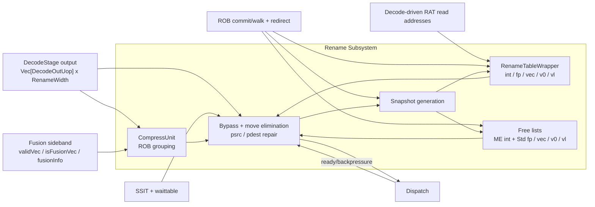
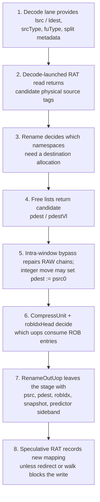
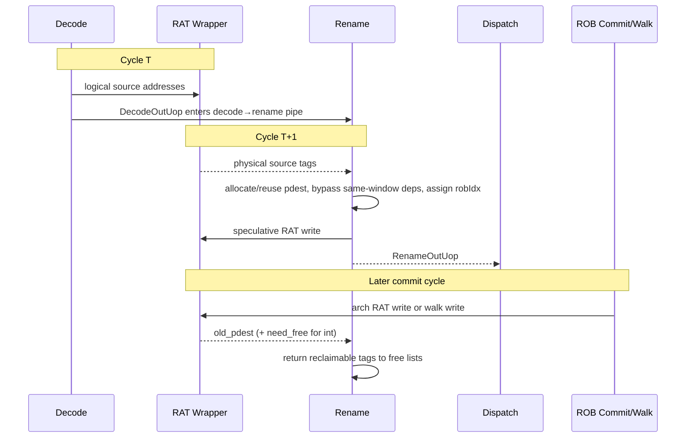
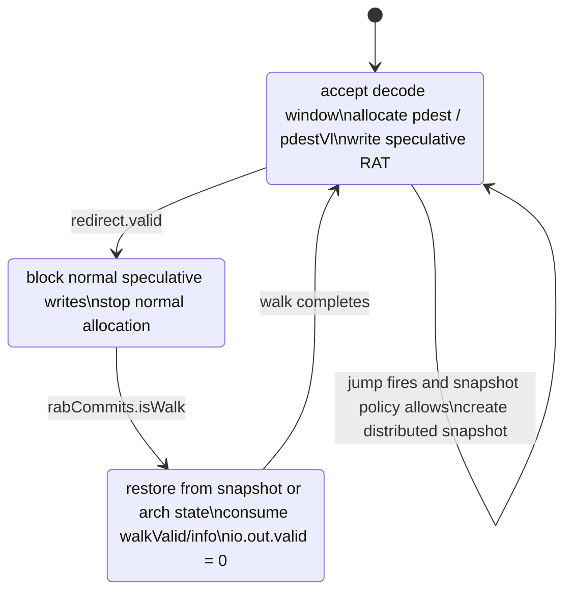

# Chapter 12. Rename Stage

Decode ended the previous chapter with a much better internal description of each instruction: XiangShan now knows the
logical source and destination registers, the functional-unit class, the split/uop boundaries, and a large amount of
exception and vector-control metadata. That is necessary for an out-of-order backend. It is still not sufficient.

Issue queues, wakeup networks, and physical register files do not operate on logical names such as `x7`, `f3`, or
`v12`. They operate on **physical tags**. They also need those tags to remain precise across speculation, commit, and
recovery. The rename stage is the boundary where XiangShan turns decoded instructions into speculative backend work
items with explicit physical dependencies.

In Kunminghu, rename is broader than the textbook phrase "map architectural registers to physical registers." The
current RTL also assigns `robIdx`, supports integer move elimination, renames five separate namespaces
(`int`, `fp`, `vec`, `v0`, and `vl`), cooperates with the memory-dependence predictor, decides when rename snapshots
are created, and rebuilds speculative state after redirects. The stage is instantiated in `CtrlBlock` at
[CtrlBlock.scala:99](src/main/scala/xiangshan/backend/CtrlBlock.scala#L99),
[CtrlBlock.scala:100](src/main/scala/xiangshan/backend/CtrlBlock.scala#L100), and
[CtrlBlock.scala:101](src/main/scala/xiangshan/backend/CtrlBlock.scala#L101).

This chapter follows the same zoom-in method as Chapter 11. We begin with the problem rename solves, place the stage
in backend context, describe its interfaces, then walk through the real data path and recovery behavior in the RTL.

## 12.1 Motivation and Design Challenge

If you keep one question in mind, the rest of the chapter becomes much easier to read:

> **How does XiangShan turn decoded instructions that still speak in logical register names into speculative backend
> uops that can execute out of order and still recover precisely?**

### 12.1.1 Why logical names are no longer enough

Architecturally, the instruction `add x8, x1, x2` is simple: read two registers and write one result. Microarchitecturally,
that description hides two problems.

First, out-of-order execution must eliminate **write-after-write (WAW)** and **write-after-read (WAR)** hazards.
Multiple in-flight instructions can target the same logical destination, so the machine cannot let the name `x8` stand
for a single mutable storage location while instructions are still speculative. Second, the machine must later unwind
wrong-path renames without corrupting the committed architectural view. That requires rename state to be both
speculative and recoverable.

Rename therefore answers several concrete questions for every decoded uop window.

| Rename question | Example answer | Why it matters |
| --------------- | -------------- | -------------- |
| Which physical tag supplies each source? | `x1 -> p14`, `x2 -> p37` | Issue queues and register files consume physical tags, not logical names. |
| Does the destination need a fresh tag? | `x8` gets a new integer physical register; `mv x6, x5` may reuse `p5` | New tags eliminate WAW/WAR hazards, but move elimination can avoid unnecessary allocation. |
| Which ROB entry owns the instruction? | One `robIdx` for this instruction, or a shared ROB entry if compression applies | Rename is where XiangShan makes ROB-allocation decisions. |
| When can the old destination tag be returned? | Only after commit proves the old tag is no longer architecturally live | Premature freeing would let a younger instruction overwrite a still-visible value. |
| How is wrong-path rename state repaired? | Restore RAT/free-list state from snapshot or committed state, then walk | Precise recovery requires the speculative and committed views to stay synchronized. |

In XiangShan, those answers come from the coordinated behavior of `Rename.scala`,
[RenameTable.scala](src/main/scala/xiangshan/backend/rename/RenameTable.scala#L48),
[StdFreeList.scala](src/main/scala/xiangshan/backend/rename/freelist/StdFreeList.scala#L28),
[MEFreeList.scala](src/main/scala/xiangshan/backend/rename/freelist/MEFreeList.scala#L27), and the snapshot control in
[CtrlBlock.scala:535](src/main/scala/xiangshan/backend/CtrlBlock.scala#L535).

### 12.1.2 Rename is speculative namespace management

One useful mental model is that rename manages two parallel naming systems at once.

- The **architectural view** says each logical register name has one committed meaning.
- The **speculative view** says each in-flight write may temporarily redefine that meaning for younger instructions.

The rename tables therefore maintain both a speculative mapping (`spec_table`) and a committed mapping (`arch_table`)
inside each register namespace
([RenameTable.scala:113](src/main/scala/xiangshan/backend/rename/RenameTable.scala#L113) to
[RenameTable.scala:117](src/main/scala/xiangshan/backend/rename/RenameTable.scala#L117)).
The free lists maintain an analogous split between a speculative allocation head (`headPtr`) and an architectural head
(`archHeadPtr`)
([BaseFreeList.scala:67](src/main/scala/xiangshan/backend/rename/freelist/BaseFreeList.scala#L67) to
[BaseFreeList.scala:69](src/main/scala/xiangshan/backend/rename/freelist/BaseFreeList.scala#L69)).

That parallel structure is what makes precise recovery possible. A mispredicted path can throw away speculative
renames, while committed mappings remain intact.

### 12.1.3 XiangShan-specific requirements

Rename in Kunminghu is harder than the one-table examples found in introductory microarchitecture texts.

1. The stage is wide. `DecodeWidth`, `RenameWidth`, and `RabCommitWidth` are `8` by default
   ([Parameters.scala:80](src/main/scala/xiangshan/Parameters.scala#L80) to
   [Parameters.scala:84](src/main/scala/xiangshan/Parameters.scala#L84)), but a backend-V2 configuration reduces them
   to `6`
   ([Configs.scala:510](src/main/scala/top/Configs.scala#L510) to
   [Configs.scala:512](src/main/scala/top/Configs.scala#L512)).

2. The current RTL renames five namespaces, not just integer and floating-point. `Rename.scala` instantiates separate
   free lists for `int`, `fp`, `vec`, `v0`, and `vl`
   ([Rename.scala:109](src/main/scala/xiangshan/backend/rename/Rename.scala#L109) to
   [Rename.scala:117](src/main/scala/xiangshan/backend/rename/Rename.scala#L117)),
   and `RenameTableWrapper` instantiates matching rename tables
   ([RenameTable.scala:254](src/main/scala/xiangshan/backend/rename/RenameTable.scala#L254) to
   [RenameTable.scala:258](src/main/scala/xiangshan/backend/rename/RenameTable.scala#L258)).

3. Rename also owns compression-aware `robIdx` assignment. It runs `CompressUnit`, tracks `robIdxHead`, and counts
   only those uops that actually need a new ROB entry
   ([CompressUnit.scala:40](src/main/scala/xiangshan/backend/rename/CompressUnit.scala#L40) to
   [CompressUnit.scala:114](src/main/scala/xiangshan/backend/rename/CompressUnit.scala#L114),
   [Rename.scala:324](src/main/scala/xiangshan/backend/rename/Rename.scala#L324) to
   [Rename.scala:336](src/main/scala/xiangshan/backend/rename/Rename.scala#L336)).

4. Integer rename supports **move elimination**. When `isMove` is true, rename suppresses integer physical-register
   allocation and reuses the physical tag of the source operand
   ([Rename.scala:399](src/main/scala/xiangshan/backend/rename/Rename.scala#L399) to
   [Rename.scala:402](src/main/scala/xiangshan/backend/rename/Rename.scala#L402),
   [Rename.scala:676](src/main/scala/xiangshan/backend/rename/Rename.scala#L676),
   [Rename.scala:727](src/main/scala/xiangshan/backend/rename/Rename.scala#L727)).

5. Recovery is distributed. Snapshot state lives in the RATs, the free lists, the ROB-side snapshot queue in
   `CtrlBlock`, and other backend structures. Rename decides when a snapshot is worth creating, but `CtrlBlock`
   decides which snapshot to restore on redirect
   ([Rename.scala:745](src/main/scala/xiangshan/backend/rename/Rename.scala#L745) to
   [Rename.scala:773](src/main/scala/xiangshan/backend/rename/Rename.scala#L773),
   [CtrlBlock.scala:540](src/main/scala/xiangshan/backend/CtrlBlock.scala#L540) to
   [CtrlBlock.scala:582](src/main/scala/xiangshan/backend/CtrlBlock.scala#L582)).

The rename stage is therefore where XiangShan's dependency naming, ROB naming, and recovery naming all meet.

## 12.2 Subsystem Context in Full-Chip View

At full-chip level, rename is the last control-oriented stage before dispatch turns renamed uops into scheduler inputs.
Decode still describes work in logical register names. Dispatch already assumes physical tags exist and uses busy tables
to classify sources as ready or not ready
([NewDispatch.scala:246](src/main/scala/xiangshan/backend/dispatch/NewDispatch.scala#L246) to
[NewDispatch.scala:275](src/main/scala/xiangshan/backend/dispatch/NewDispatch.scala#L275),
[NewDispatch.scala:304](src/main/scala/xiangshan/backend/dispatch/NewDispatch.scala#L304) to
[NewDispatch.scala:358](src/main/scala/xiangshan/backend/dispatch/NewDispatch.scala#L358)).
Rename is the seam between those two worlds.

**Figure 12.1: Rename subsystem in backend context.** The stage is not only a RAT lookup. It combines ROB grouping,
multi-namespace register allocation, same-window bypass, and distributed recovery control.

The main left-to-right path is:

1. `DecodeStage` emits `DecodeOutUop` records and, through `CtrlBlock`, drives the RAT read ports directly
   ([CtrlBlock.scala:527](src/main/scala/xiangshan/backend/CtrlBlock.scala#L527) to
   [CtrlBlock.scala:531](src/main/scala/xiangshan/backend/CtrlBlock.scala#L531)).
2. `RenameTableWrapper` returns the speculative physical mappings for the requested logical source names.
3. The free lists provide candidate new physical destinations, one namespace at a time.
4. Rename repairs same-window dependencies, applies move elimination, assigns `robIdx`, and emits `RenameOutUop`.
5. Dispatch then interprets those tags with busy tables and reg-cache state, but it no longer needs logical register
   names to determine dependencies.

Two feedback structures matter just as much as the forward path.

- `ROB -> Rename` carries commit, walk, and redirect information, so rename can both free old tags and rebuild
  speculative state.
- `MDP -> Rename` carries `SSIT` and waittable results, allowing rename to attach dependency-prediction hints before
  dispatch
  ([CtrlBlock.scala:657](src/main/scala/xiangshan/backend/CtrlBlock.scala#L657) to
  [CtrlBlock.scala:660](src/main/scala/xiangshan/backend/CtrlBlock.scala#L660),
  [Rename.scala:427](src/main/scala/xiangshan/backend/rename/Rename.scala#L427) to
  [Rename.scala:433](src/main/scala/xiangshan/backend/rename/Rename.scala#L433)).

One timing detail is easy to miss in a block diagram: decode and rename are slightly overlapped. The RAT reads are
launched in decode, while the returned physical tags are consumed in rename. XiangShan does this because the RAT read
path is pipelined rather than fully combinational
([RenameTable.scala:122](src/main/scala/xiangshan/backend/rename/RenameTable.scala#L122) to
[RenameTable.scala:156](src/main/scala/xiangshan/backend/rename/RenameTable.scala#L156)).

## 12.3 Module Boundary and External Interfaces

At the stage boundary, the most important transformation is from `DecodeOutUop` to `RenameOutUop`.

| Bundle | Defined in | Role at the rename boundary |
| ------ | ---------- | --------------------------- |
| [`DecodeOutUop`](src/main/scala/xiangshan/backend/Bundles.scala#L136) | [Bundles.scala:136](src/main/scala/xiangshan/backend/Bundles.scala#L136) | Decode's logical description: logical sources/destination, FU classification, split metadata, immediates, and exception-side information. |
| [`RenameOutUop`](src/main/scala/xiangshan/backend/Bundles.scala#L230) | [Bundles.scala:230](src/main/scala/xiangshan/backend/Bundles.scala#L230) | Rename's backend contract: physical source tags, physical destination tags, `robIdx`, snapshot marker, dependency-predictor sideband, and extra bookkeeping such as `numLsElem` and `hasException`. |
| [`SnapshotPort`](src/main/scala/xiangshan/Bundle.scala#L411) | [Bundle.scala:411](src/main/scala/xiangshan/Bundle.scala#L411) | Common distributed-control bundle used to enqueue, dequeue, flush, and select rename snapshots across RATs and free lists. |

`RenameOutUop` makes the backend-visible changes explicit. Relative to `DecodeOutUop`, it adds `psrc`, `psrcVl`,
`pdest`, `pdestVl`, `robIdx`, `snapshot`, `storeSetHit`, `loadWaitBit`, `loadWaitStrict`, `ssid`, `numLsElem`, and
`hasException`
([Bundles.scala:269](src/main/scala/xiangshan/backend/Bundles.scala#L269) to
[Bundles.scala:296](src/main/scala/xiangshan/backend/Bundles.scala#L296)).
This is the exact point where "logical dependency information" becomes "scheduler-ready dependency information."

The `Rename` module interface reflects that broader job description.

| Interface group | RTL hook | Purpose |
| --------------- | -------- | ------- |
| Decode inputs | [Rename.scala:65](src/main/scala/xiangshan/backend/rename/Rename.scala#L65) to [Rename.scala:70](src/main/scala/xiangshan/backend/rename/Rename.scala#L70) | The decoded uop window plus fusion sideband that survived the decode-to-rename pipeline. |
| RAT ports | [Rename.scala:75](src/main/scala/xiangshan/backend/rename/Rename.scala#L75) to [Rename.scala:79](src/main/scala/xiangshan/backend/rename/Rename.scala#L79) | Read ports for integer, FP, vector, `v0`, and `vl` logical namespaces. Decode drives the addresses; rename consumes the returned data. |
| Predictor sideband | [Rename.scala:71](src/main/scala/xiangshan/backend/rename/Rename.scala#L71) to [Rename.scala:74](src/main/scala/xiangshan/backend/rename/Rename.scala#L74) | Memory-dependence predictor hints from `SSIT` and waittable. |
| Recovery and commit | [Rename.scala:59](src/main/scala/xiangshan/backend/rename/Rename.scala#L59) to [Rename.scala:63](src/main/scala/xiangshan/backend/rename/Rename.scala#L63), [Rename.scala:83](src/main/scala/xiangshan/backend/rename/Rename.scala#L83) to [Rename.scala:92](src/main/scala/xiangshan/backend/rename/Rename.scala#L92) | Redirect, commit, walk, and snapshot control. |
| Dispatch output | [Rename.scala:81](src/main/scala/xiangshan/backend/rename/Rename.scala#L81) | The renamed uop window sent toward dispatch. |

Three terms will recur throughout the chapter.

- **Speculative RAT.** The map used by younger in-flight instructions. This is `spec_table` inside each
  `RenameTable`
  ([RenameTable.scala:113](src/main/scala/xiangshan/backend/rename/RenameTable.scala#L113)).
- **Architectural RAT.** The committed map. This is `arch_table`
  ([RenameTable.scala:116](src/main/scala/xiangshan/backend/rename/RenameTable.scala#L116)).
- **Walk.** ROB-driven re-rename after a redirect. During walk, rename stops sending new work to dispatch and instead
  rebuilds speculative mappings from ROB-supplied state
  ([Rename.scala:289](src/main/scala/xiangshan/backend/rename/Rename.scala#L289) to
  [Rename.scala:296](src/main/scala/xiangshan/backend/rename/Rename.scala#L296),
  [Rename.scala:552](src/main/scala/xiangshan/backend/rename/Rename.scala#L552)).

## 12.4 Internal Pipeline and Data-Path Walkthrough

The rename data path is easiest to understand if we separate its long-lived state from its per-window combinational
work.

### 12.4.1 One stage, five rename namespaces

Current Kunminghu rename is explicitly multi-namespace.

| Namespace | Logical space | Physical pool | Concrete state in rename | Special behavior |
| --------- | ------------- | ------------- | ------------------------ | ---------------- |
| Integer | [`IntLogicRegs`](src/main/scala/xiangshan/Parameters.scala#L91) = 32 | [`intPreg.numEntries`](src/main/scala/xiangshan/Parameters.scala#L116) = 224 | `intRat` + `MEFreeList` | Supports move elimination and duplicate-aware freeing. |
| Floating-point | [`FpLogicRegs`](src/main/scala/xiangshan/Parameters.scala#L92) = 34 | [`fpPreg.numEntries`](src/main/scala/xiangshan/Parameters.scala#L122) = 256 | `fpRat` + `StdFreeList` | Includes internal logical names beyond the ISA's 32 FP registers. |
| Vector | [`VecLogicRegs`](src/main/scala/xiangshan/Parameters.scala#L93) = 47 | [`vfPreg.numEntries`](src/main/scala/xiangshan/Parameters.scala#L128) = 128 | `vecRat` + `StdFreeList` | Includes temporary vector logical names. |
| `v0` | [`V0LogicRegs`](src/main/scala/xiangshan/Parameters.scala#L94) = 1 | [`v0Preg.numEntries`](src/main/scala/xiangshan/Parameters.scala#L134) = 22 | `v0Rat` + `StdFreeList` | Dedicated mask-register namespace. |
| `vl` | [`VlLogicRegs`](src/main/scala/xiangshan/Parameters.scala#L95) = 1 | [`vlPreg.numEntries`](src/main/scala/xiangshan/Parameters.scala#L140) = 32 | `vlRat` + `StdFreeList` | Dedicated vector-length namespace with separate `pdestVl` / `psrcVl`. |

This table is worth emphasizing because it corrects an easy oversimplification. Some older summaries speak mainly in
terms of integer, floating-point, and vector rename tables. The current RTL is more explicit: `RenameTableWrapper`
instantiates five tables
([RenameTable.scala:254](src/main/scala/xiangshan/backend/rename/RenameTable.scala#L254) to
[RenameTable.scala:258](src/main/scala/xiangshan/backend/rename/RenameTable.scala#L258)),
and `Rename.scala` instantiates five matching allocation structures
([Rename.scala:111](src/main/scala/xiangshan/backend/rename/Rename.scala#L111) to
[Rename.scala:115](src/main/scala/xiangshan/backend/rename/Rename.scala#L115)).

The free-list base class already shows the recovery-oriented state each namespace maintains: speculative head,
architectural head, and snapshot copies of the head pointer
([BaseFreeList.scala:64](src/main/scala/xiangshan/backend/rename/freelist/BaseFreeList.scala#L64) to
[BaseFreeList.scala:85](src/main/scala/xiangshan/backend/rename/freelist/BaseFreeList.scala#L85)).
The RAT side mirrors this with `spec_table`, `arch_table`, and snapshot copies of the speculative map
([RenameTable.scala:113](src/main/scala/xiangshan/backend/rename/RenameTable.scala#L113) to
[RenameTable.scala:146](src/main/scala/xiangshan/backend/rename/RenameTable.scala#L146)).

### 12.4.2 Admission is conservative and bundle-wide

Rename does not partially accept an arbitrary suffix of the window once the head instruction is present. Instead, it
uses a stage-wide admission rule.

- Each free list computes `canAllocate` from an available-count check against the full `RenameWidth`
  ([StdFreeList.scala:64](src/main/scala/xiangshan/backend/rename/freelist/StdFreeList.scala#L64) to
  [StdFreeList.scala:66](src/main/scala/xiangshan/backend/rename/freelist/StdFreeList.scala#L66),
  [MEFreeList.scala:78](src/main/scala/xiangshan/backend/rename/freelist/MEFreeList.scala#L78) to
  [MEFreeList.scala:82](src/main/scala/xiangshan/backend/rename/freelist/MEFreeList.scala#L82)).
- `Rename.scala` then defines `canOut` as the conjunction of dispatch readiness, all five `canAllocate` signals, and
  `!io.rabCommits.isWalk`
  ([Rename.scala:289](src/main/scala/xiangshan/backend/rename/Rename.scala#L289) to
  [Rename.scala:296](src/main/scala/xiangshan/backend/rename/Rename.scala#L296)).
- Every input lane shares the same readiness condition once lane 0 is valid
  ([Rename.scala:464](src/main/scala/xiangshan/backend/rename/Rename.scala#L464) to
  [Rename.scala:465](src/main/scala/xiangshan/backend/rename/Rename.scala#L465)).

The result is a deliberately conservative policy: rename only advances when it can sustain a full-width, internally
consistent handoff to dispatch. This simplifies RAT/free-list synchronization and recovery logic at the cost of
occasionally stalling the whole window because one namespace is close to empty.

### 12.4.3 Compression-aware `robIdx` assignment

Rename in XiangShan owns `robIdxHead`, so it also owns the decision about how many ROB entries the current rename
window consumes.

`CompressUnit` takes the decoded window, filters for instructions that are valid, exception-free, at a `lastUop`
boundary, and marked `canRobCompress`, then generates three outputs:

- `needRobFlags`: which lanes actually consume a new ROB entry.
- `instrSizes`: how many architectural instructions belong to the compressed group containing that lane.
- `masks`: which lanes belong to the same ROB-compressed group.

That logic is implemented entirely inside
[CompressUnit.scala:52](src/main/scala/xiangshan/backend/rename/CompressUnit.scala#L52) to
[CompressUnit.scala:114](src/main/scala/xiangshan/backend/rename/CompressUnit.scala#L114).

Rename then uses those results to advance `robIdxHead` by only the count of valid `lastUop` lanes whose
`needRobFlag` is true
([Rename.scala:324](src/main/scala/xiangshan/backend/rename/Rename.scala#L324) to
[Rename.scala:336](src/main/scala/xiangshan/backend/rename/Rename.scala#L336)).
On redirect, `robIdxHead` resets to the redirect target ROB index; on a misprediction that does not flush the
redirecting instruction itself, the next cycle adds one more entry
([Rename.scala:331](src/main/scala/xiangshan/backend/rename/Rename.scala#L331) to
[Rename.scala:335](src/main/scala/xiangshan/backend/rename/Rename.scala#L335)).

This is why rename, not ROB or dispatch, is the right place to understand XiangShan's ROB naming policy. The stage
already has the decode-side compression and fusion information that determines how many ROB entries the window should
consume.

### 12.4.4 Source tags come from pipelined RAT reads plus local repair

The physical source-tag path has two layers.

The first layer is the rename table itself. `RenameTable` makes the main array read synchronous, pipelines the
addresses, and explicitly bypasses T0 writes into T1 read results
([RenameTable.scala:122](src/main/scala/xiangshan/backend/rename/RenameTable.scala#L122) to
[RenameTable.scala:156](src/main/scala/xiangshan/backend/rename/RenameTable.scala#L156)).
This is why decode launches RAT read addresses one stage earlier
([CtrlBlock.scala:527](src/main/scala/xiangshan/backend/CtrlBlock.scala#L527) to
[CtrlBlock.scala:531](src/main/scala/xiangshan/backend/CtrlBlock.scala#L531)).

The second layer is local repair inside rename itself.

- `srcType` selects whether `psrc(0..2)` should come from integer, FP, or vector RAT data.
- `psrc(3)` always comes from the dedicated `v0` RAT.
- `psrcVl` comes from the dedicated `vl` RAT.

That selection is coded in
[Rename.scala:523](src/main/scala/xiangshan/backend/rename/Rename.scala#L523) to
[Rename.scala:527](src/main/scala/xiangshan/backend/rename/Rename.scala#L527).
Fusion sideband can further override integer `rs2` handling for fused pairs
([Rename.scala:529](src/main/scala/xiangshan/backend/rename/Rename.scala#L529) to
[Rename.scala:535](src/main/scala/xiangshan/backend/rename/Rename.scala#L535)).

The final repair step is same-window bypass. For every younger lane, rename compares that lane's logical sources
against the logical destinations of all older lanes in the same window. If an older lane writes the needed namespace,
the younger lane's `psrc` is replaced with the older lane's new `pdest`
([Rename.scala:680](src/main/scala/xiangshan/backend/rename/Rename.scala#L680) to
[Rename.scala:727](src/main/scala/xiangshan/backend/rename/Rename.scala#L727)).

This is the mechanism that makes wide same-cycle RAW chains work without waiting for the speculative RAT write to be
visible in a later cycle.

### 12.4.5 Destination allocation, move elimination, and namespace-specific writes

Rename computes one `need*Dest` bit per namespace and per lane from the decode-side write-enable information
([Rename.scala:438](src/main/scala/xiangshan/backend/rename/Rename.scala#L438) to
[Rename.scala:443](src/main/scala/xiangshan/backend/rename/Rename.scala#L443)).
Those bits feed the free lists:

- `fp`, `vec`, `v0`, and `vl` simply allocate when their corresponding write-enable is set
  ([Rename.scala:453](src/main/scala/xiangshan/backend/rename/Rename.scala#L453) to
  [Rename.scala:460](src/main/scala/xiangshan/backend/rename/Rename.scala#L460)).
- Integer rename suppresses allocation for move-eliminated instructions
  ([Rename.scala:461](src/main/scala/xiangshan/backend/rename/Rename.scala#L461)).

The provisional destination tag comes straight from the relevant free list
([Rename.scala:539](src/main/scala/xiangshan/backend/rename/Rename.scala#L539) to
[Rename.scala:547](src/main/scala/xiangshan/backend/rename/Rename.scala#L547)).
Integer moves then overwrite that provisional choice with `psrc(0)`, so `pdest` becomes "the same physical value, now
under a second logical name"
([Rename.scala:676](src/main/scala/xiangshan/backend/rename/Rename.scala#L676),
[Rename.scala:727](src/main/scala/xiangshan/backend/rename/Rename.scala#L727)).
Such instructions also set `numWB := 0`, because the move was eliminated instead of creating new execution work
([Rename.scala:470](src/main/scala/xiangshan/backend/rename/Rename.scala#L470) to
[Rename.scala:472](src/main/scala/xiangshan/backend/rename/Rename.scala#L472)).

This detail propagates into the next stage. Dispatch marks newly allocated integer destinations busy only when
`!isMove`
([NewDispatch.scala:255](src/main/scala/xiangshan/backend/dispatch/NewDispatch.scala#L255) to
[NewDispatch.scala:265](src/main/scala/xiangshan/backend/dispatch/NewDispatch.scala#L265)).
That is exactly what we want: a move-eliminated instruction renames a logical destination, but it does not create a
new not-ready physical register.

### 12.4.6 Rename adds more than tags

Although register renaming is the stage's name, the output work record is richer than just `psrc` and `pdest`.

First, rename attaches memory-dependence predictor sideband.

- `storeSetHit`, `loadWaitStrict`, and `ssid` come from `SSIT`.
- `loadWaitBit` comes from the waittable.

Those assignments are made in
[Rename.scala:427](src/main/scala/xiangshan/backend/rename/Rename.scala#L427) to
[Rename.scala:433](src/main/scala/xiangshan/backend/rename/Rename.scala#L433).

Second, vector memory uops receive a derived `numLsElem` value based on vector type, EEW, SEW, LMUL, and segment/unit
stride information
([Rename.scala:350](src/main/scala/xiangshan/backend/rename/Rename.scala#L350) to
[Rename.scala:389](src/main/scala/xiangshan/backend/rename/Rename.scala#L389)).

Third, rename carries forward compression-aware bookkeeping such as `numWB`, `crossFtq`, `dirtyFs`, and `dirtyVs`
([Rename.scala:489](src/main/scala/xiangshan/backend/rename/Rename.scala#L489) to
[Rename.scala:520](src/main/scala/xiangshan/backend/rename/Rename.scala#L520)).

The important lesson is that XiangShan rename is already shaping backend execution semantics, not merely translating
register names.

**Figure 12.2: Step-by-step rename data flow.** The figure compresses the stage into one narrative: read speculative
source mappings, allocate or reuse destination tags, repair same-window dependencies, assign ROB ownership, then publish
the updated speculative mapping.

## 12.5 Control, Recovery, and Snapshot Behavior

Rename's correctness depends on three histories staying aligned:

- the speculative RAT mappings,
- the free-list allocation heads,
- and the ROB position of the in-flight work.

The control behavior looks complicated at first, but most of it reduces to three modes: normal rename, redirect
response, and walk-based rebuild.

### 12.5.1 Commit-time reclamation of old mappings

Commit updates the architectural RATs and eventually returns old physical tags to the free lists.

Inside `RenameTable`, `archWritePorts` update `arch_table`, while `old_pdest` captures the physical tag that used to be
architecturally mapped at that logical destination
([RenameTable.scala:159](src/main/scala/xiangshan/backend/rename/RenameTable.scala#L159) to
[RenameTable.scala:168](src/main/scala/xiangshan/backend/rename/RenameTable.scala#L168)).
This capture includes same-cycle bypass among multiple commit ports, so if two commit lanes write the same logical
destination, the younger port sees the older port's just-written value as its `old_pdest`
([RenameTable.scala:163](src/main/scala/xiangshan/backend/rename/RenameTable.scala#L163) to
[RenameTable.scala:166](src/main/scala/xiangshan/backend/rename/RenameTable.scala#L166)).

Integer rename then adds one more protection: `need_free` is asserted only if the old tag no longer appears anywhere in
the architectural integer RAT and is not duplicated by an earlier commit lane in the same batch
([RenameTable.scala:170](src/main/scala/xiangshan/backend/rename/RenameTable.scala#L170) to
[RenameTable.scala:174](src/main/scala/xiangshan/backend/rename/RenameTable.scala#L174)).
That duplicate check is exactly what move elimination needs, because several logical integer names may intentionally
share one physical tag.

`Rename.scala` consumes those signals and turns them into actual free-list returns
([Rename.scala:778](src/main/scala/xiangshan/backend/rename/Rename.scala#L778) to
[Rename.scala:814](src/main/scala/xiangshan/backend/rename/Rename.scala#L814)).
FP, vector, `v0`, and `vl` freeing are simpler: commit plus the corresponding write-enable is enough to return the old
tag. Integer freeing must additionally respect `int_need_free`.

**Figure 12.3: Cycle-level timing view of normal rename and later commit.** The diagram highlights the two-stage source
lookup (`Decode -> RAT -> Rename`) and the later commit-time reclamation path (`ROB -> RAT -> free list`).

### 12.5.2 Snapshot generation

Rename snapshots exist to shorten recovery. The policy for creating them is intentionally selective.

`Rename.scala` generates a snapshot candidate only when:

- rename snapshots are enabled,
- the new snapshot is sufficiently far from the most recent one,
- the previous cycle did not already create another snapshot,
- the head input is a `firstUop`,
- and the firing instruction is a jump/control-flow instruction.

That logic is in
[Rename.scala:745](src/main/scala/xiangshan/backend/rename/Rename.scala#L745) to
[Rename.scala:752](src/main/scala/xiangshan/backend/rename/Rename.scala#L752).
The minimum spacing is `4 * RobCommitWidth`
([Rename.scala:748](src/main/scala/xiangshan/backend/rename/Rename.scala#L748)),
which is `32` ROB positions under the default `RobCommitWidth = 8`
([Parameters.scala:83](src/main/scala/xiangshan/Parameters.scala#L83)).

Once `genSnapshot` is asserted, rename fans that enqueue event to all five free lists
([Rename.scala:764](src/main/scala/xiangshan/backend/rename/Rename.scala#L764) to
[Rename.scala:773](src/main/scala/xiangshan/backend/rename/Rename.scala#L773)),
while `CtrlBlock` mirrors the same event onto the RAT-side snapshot port
([CtrlBlock.scala:578](src/main/scala/xiangshan/backend/CtrlBlock.scala#L578) to
[CtrlBlock.scala:582](src/main/scala/xiangshan/backend/CtrlBlock.scala#L582)).
`CtrlBlock` also stores central metadata about the snapshot: the `robIdx` vector of the renamed bundle and which lane
held the control-flow instruction
([CtrlBlock.scala:540](src/main/scala/xiangshan/backend/CtrlBlock.scala#L540) to
[CtrlBlock.scala:544](src/main/scala/xiangshan/backend/CtrlBlock.scala#L544)).

One subtle but important integration detail appears at the rename-to-dispatch boundary: `CtrlBlock` collapses the
per-lane snapshot indication into the head lane before sending the rename window onward
([CtrlBlock.scala:681](src/main/scala/xiangshan/backend/CtrlBlock.scala#L681) to
[CtrlBlock.scala:685](src/main/scala/xiangshan/backend/CtrlBlock.scala#L685)).
That preserves the snapshot event even though dispatch sees the window as a grouped transfer.

### 12.5.3 Redirect, restore, and walk

On redirect, rename immediately stops behaving like a normal frontend-fed stage.

First, speculative RAT writes are gated by `!io.redirect.valid`, so the wrong-path window does not publish new
speculative mappings
([Rename.scala:574](src/main/scala/xiangshan/backend/rename/Rename.scala#L574) to
[Rename.scala:578](src/main/scala/xiangshan/backend/rename/Rename.scala#L578)).
The free lists also suppress normal allocation on redirect
([StdFreeList.scala:92](src/main/scala/xiangshan/backend/rename/freelist/StdFreeList.scala#L92) to
[StdFreeList.scala:95](src/main/scala/xiangshan/backend/rename/freelist/StdFreeList.scala#L95),
[MEFreeList.scala:34](src/main/scala/xiangshan/backend/rename/freelist/MEFreeList.scala#L34) to
[MEFreeList.scala:36](src/main/scala/xiangshan/backend/rename/freelist/MEFreeList.scala#L36)).

Second, `CtrlBlock` chooses whether a saved snapshot can be used. It flushes invalidated snapshot entries, computes
`useSnpt`, and selects the newest surviving snapshot older than the redirect point
([CtrlBlock.scala:548](src/main/scala/xiangshan/backend/CtrlBlock.scala#L548) to
[CtrlBlock.scala:571](src/main/scala/xiangshan/backend/CtrlBlock.scala#L571)).

Third, the actual restore happens inside the state-holding blocks.

- `RenameTable` restores `spec_table` from the selected snapshot or falls back to `arch_table`
  ([RenameTable.scala:137](src/main/scala/xiangshan/backend/rename/RenameTable.scala#L137) to
  [RenameTable.scala:149](src/main/scala/xiangshan/backend/rename/RenameTable.scala#L149)).
- `BaseFreeList` computes a redirected head pointer from the selected snapshot or from `archHeadPtr`, then adds the
  current walk requests so re-rename restarts at the correct place
  ([BaseFreeList.scala:75](src/main/scala/xiangshan/backend/rename/freelist/BaseFreeList.scala#L75) to
  [BaseFreeList.scala:85](src/main/scala/xiangshan/backend/rename/freelist/BaseFreeList.scala#L85)).

Finally, while `io.rabCommits.isWalk` is true, rename stops sending new outputs to dispatch
([Rename.scala:296](src/main/scala/xiangshan/backend/rename/Rename.scala#L296),
[Rename.scala:552](src/main/scala/xiangshan/backend/rename/Rename.scala#L552)).
Instead, the free lists consume `walkReq`, and `RenameTableWrapper` consumes ROB-supplied walk info through its
speculative write ports
([Rename.scala:444](src/main/scala/xiangshan/backend/rename/Rename.scala#L444) to
[Rename.scala:462](src/main/scala/xiangshan/backend/rename/Rename.scala#L462),
[RenameTable.scala:279](src/main/scala/xiangshan/backend/rename/RenameTable.scala#L279) to
[RenameTable.scala:290](src/main/scala/xiangshan/backend/rename/RenameTable.scala#L290)).

There is no explicit one-hot FSM register named "rename state" in the RTL. Still, the behavior can be summarized as a
small conceptual state machine:

**Figure 12.4: Behavioral state view of rename control.** The actual implementation uses distributed gating rather than
one centralized state register, but the effective modes are normal operation, redirect handling, and walk-based rebuild.

## 12.6 Parameterization and Configuration Knobs

Rename is highly parameterized because width, namespace shape, and recovery depth all affect its structures directly.

| Parameter(s) | Default setting | Rename-stage effect |
| ------------ | --------------- | ------------------- |
| [`DecodeWidth`](src/main/scala/xiangshan/Parameters.scala#L80), [`RenameWidth`](src/main/scala/xiangshan/Parameters.scala#L81), [`RabCommitWidth`](src/main/scala/xiangshan/Parameters.scala#L84) | `8`, `8`, `8` by default; `6`, `6`, `6` in `TLBackendV2Config` ([Configs.scala:510](src/main/scala/top/Configs.scala#L510) to [Configs.scala:512](src/main/scala/top/Configs.scala#L512)) | Set the incoming window width, rename bandwidth, and walk/commit replay width that the stage must sustain. |
| [`EnableRenameSnapshot`](src/main/scala/xiangshan/Parameters.scala#L86), [`RenameSnapshotNum`](src/main/scala/xiangshan/Parameters.scala#L87) | `true`, `4` | Control whether distributed rename checkpoints exist and how many can be live at once. |
| [`IntLogicRegs`](src/main/scala/xiangshan/Parameters.scala#L91), [`FpLogicRegs`](src/main/scala/xiangshan/Parameters.scala#L92), [`VecLogicRegs`](src/main/scala/xiangshan/Parameters.scala#L93), [`V0LogicRegs`](src/main/scala/xiangshan/Parameters.scala#L94), [`VlLogicRegs`](src/main/scala/xiangshan/Parameters.scala#L95) | `32`, `34`, `47`, `1`, `1` | Define how many logical names each RAT namespace must cover. |
| [`intPreg.numEntries`](src/main/scala/xiangshan/Parameters.scala#L116), [`fpPreg.numEntries`](src/main/scala/xiangshan/Parameters.scala#L122), [`vfPreg.numEntries`](src/main/scala/xiangshan/Parameters.scala#L128), [`v0Preg.numEntries`](src/main/scala/xiangshan/Parameters.scala#L134), [`vlPreg.numEntries`](src/main/scala/xiangshan/Parameters.scala#L140) | `224`, `256`, `128`, `22`, `32` | Set the physical pools behind the five rename namespaces. |
| [`MaxUopSize`](src/main/scala/xiangshan/Parameters.scala#L85) | `65` | Sizes rename-side bookkeeping such as `numWB` and worst-case split-uop accounting. |

These parameters fall into three practical buckets.

- Width parameters determine how much rename can absorb per cycle.
- Namespace-shape parameters determine how many parallel RAT/free-list structures must exist at all.
- Recovery parameters determine how much speculative state can be checkpointed and how far apart those checkpoints are.

That grouping matches the real design pressures on the stage: throughput, naming capacity, and recovery latency.

## 12.7 Worked Examples

The mechanisms above are easier to retain when reassembled into complete stories. These examples start with an ordinary
same-window dependency, then move to move elimination, and finally to rename recovery.

### Worked Example 1: `add x8, x1, x2` followed by `addi x9, x8, 1` in the same window

1. Decode provides two `DecodeOutUop`s and already launched RAT reads for `x1`, `x2`, and `x8` through the shared
   decode-to-rename RAT interface
   ([CtrlBlock.scala:527](src/main/scala/xiangshan/backend/CtrlBlock.scala#L527) to
   [CtrlBlock.scala:531](src/main/scala/xiangshan/backend/CtrlBlock.scala#L531),
   [RenameTable.scala:122](src/main/scala/xiangshan/backend/rename/RenameTable.scala#L122) to
   [RenameTable.scala:156](src/main/scala/xiangshan/backend/rename/RenameTable.scala#L156)).

2. Lane 0 asserts `needIntDest`, requests the integer free list, and receives a fresh integer physical destination
   candidate
   ([Rename.scala:438](src/main/scala/xiangshan/backend/rename/Rename.scala#L438) to
   [Rename.scala:443](src/main/scala/xiangshan/backend/rename/Rename.scala#L443),
   [Rename.scala:539](src/main/scala/xiangshan/backend/rename/Rename.scala#L539) to
   [Rename.scala:545](src/main/scala/xiangshan/backend/rename/Rename.scala#L545),
   [MEFreeList.scala:42](src/main/scala/xiangshan/backend/rename/freelist/MEFreeList.scala#L42) to
   [MEFreeList.scala:46](src/main/scala/xiangshan/backend/rename/freelist/MEFreeList.scala#L46)).

3. Lane 1 initially sees the older RAT mapping of `x8`, but `bypassCond` notices that lane 0 writes the same logical
   integer register, so lane 1's `psrc(0)` is replaced with lane 0's new `pdest`
   ([Rename.scala:680](src/main/scala/xiangshan/backend/rename/Rename.scala#L680) to
   [Rename.scala:727](src/main/scala/xiangshan/backend/rename/Rename.scala#L727)).

4. Rename emits two physical-tagged uops. Unless ROB compression groups them, lane 0 and lane 1 receive consecutive
   `robIdx` values
   ([Rename.scala:467](src/main/scala/xiangshan/backend/rename/Rename.scala#L467),
   [Rename.scala:552](src/main/scala/xiangshan/backend/rename/Rename.scala#L552)).

5. The speculative integer RAT records the new logical-to-physical bindings for younger instructions
   ([Rename.scala:784](src/main/scala/xiangshan/backend/rename/Rename.scala#L784) to
   [Rename.scala:786](src/main/scala/xiangshan/backend/rename/Rename.scala#L786)).

This is the common RAW case that any wide rename stage must handle correctly every cycle.

### Worked Example 2: `mv x6, x5`

This case shows what integer move elimination really means in the RTL.

1. Rename sees `isMove`, so integer destination allocation is suppressed
   ([Rename.scala:399](src/main/scala/xiangshan/backend/rename/Rename.scala#L399) to
   [Rename.scala:402](src/main/scala/xiangshan/backend/rename/Rename.scala#L402),
   [Rename.scala:461](src/main/scala/xiangshan/backend/rename/Rename.scala#L461)).

2. Because no new physical register is needed, rename sets `numWB := 0`
   ([Rename.scala:470](src/main/scala/xiangshan/backend/rename/Rename.scala#L470) to
   [Rename.scala:472](src/main/scala/xiangshan/backend/rename/Rename.scala#L472)).

3. The final integer destination tag becomes the physical source tag: `pdest := psrc(0)`
   ([Rename.scala:676](src/main/scala/xiangshan/backend/rename/Rename.scala#L676),
   [Rename.scala:727](src/main/scala/xiangshan/backend/rename/Rename.scala#L727)).

4. Dispatch does not mark a fresh integer destination busy because it excludes move-eliminated uops from integer
   `allocPregs`
   ([NewDispatch.scala:255](src/main/scala/xiangshan/backend/dispatch/NewDispatch.scala#L255) to
   [NewDispatch.scala:265](src/main/scala/xiangshan/backend/dispatch/NewDispatch.scala#L265)).

5. Later, when commit retires renamed integer mappings, `need_free` duplicate suppression ensures the shared physical
   tag is not returned to the free list until no committed logical integer name still points to it
   ([RenameTable.scala:170](src/main/scala/xiangshan/backend/rename/RenameTable.scala#L170) to
   [RenameTable.scala:174](src/main/scala/xiangshan/backend/rename/RenameTable.scala#L174),
   [Rename.scala:805](src/main/scala/xiangshan/backend/rename/Rename.scala#L805) to
   [Rename.scala:806](src/main/scala/xiangshan/backend/rename/Rename.scala#L806)).

The key idea is that move elimination still changes the naming graph, even though it does not allocate a new physical
register.

### Worked Example 3: A branch that later redirects and uses a rename snapshot

1. A jump/branch uop fires at rename. If the snapshot-spacing policy is satisfied, rename marks that uop with
   `snapshot`
   ([Rename.scala:745](src/main/scala/xiangshan/backend/rename/Rename.scala#L745) to
   [Rename.scala:752](src/main/scala/xiangshan/backend/rename/Rename.scala#L752)).

2. `CtrlBlock` captures the renamed bundle's `robIdx` vector and which lane held the control-flow instruction into the
   central snapshot queue
   ([CtrlBlock.scala:540](src/main/scala/xiangshan/backend/CtrlBlock.scala#L540) to
   [CtrlBlock.scala:544](src/main/scala/xiangshan/backend/CtrlBlock.scala#L544)).

3. Much later, a redirect arrives. `CtrlBlock` flushes invalidated snapshot entries and picks the youngest surviving
   snapshot older than the redirect point; if none qualifies, recovery falls back to the architectural state
   ([CtrlBlock.scala:548](src/main/scala/xiangshan/backend/CtrlBlock.scala#L548) to
   [CtrlBlock.scala:571](src/main/scala/xiangshan/backend/CtrlBlock.scala#L571)).

4. The RATs restore `spec_table` from the selected snapshot or from `arch_table`, while the free lists restore their
   speculative heads from the selected snapshot or from `archHeadPtr`
   ([RenameTable.scala:137](src/main/scala/xiangshan/backend/rename/RenameTable.scala#L137) to
   [RenameTable.scala:149](src/main/scala/xiangshan/backend/rename/RenameTable.scala#L149),
   [BaseFreeList.scala:77](src/main/scala/xiangshan/backend/rename/freelist/BaseFreeList.scala#L77) to
   [BaseFreeList.scala:85](src/main/scala/xiangshan/backend/rename/freelist/BaseFreeList.scala#L85)).

5. During ROB walk, rename stops sending normal outputs and instead consumes walk information to rebuild speculative
   state exactly up to the redirect boundary
   ([Rename.scala:289](src/main/scala/xiangshan/backend/rename/Rename.scala#L289) to
   [Rename.scala:296](src/main/scala/xiangshan/backend/rename/Rename.scala#L296),
   [Rename.scala:552](src/main/scala/xiangshan/backend/rename/Rename.scala#L552),
   [RenameTable.scala:279](src/main/scala/xiangshan/backend/rename/RenameTable.scala#L279) to
   [RenameTable.scala:290](src/main/scala/xiangshan/backend/rename/RenameTable.scala#L290)).

This example shows why rename snapshots are valuable: they shorten the amount of state that must be rebuilt by walk.

## 12.8 Design Trade-off

> **Design Trade-off: Pipelined RAT Read, Extra Local Bypass**
>
> XiangShan does not put all rename functionality into one giant combinational "read RAT, allocate pdest, bypass,
> update RAT" path. Instead, `RenameTable` makes the main array read synchronous and adds explicit write bypass
> ([RenameTable.scala:122](src/main/scala/xiangshan/backend/rename/RenameTable.scala#L122) to
> [RenameTable.scala:156](src/main/scala/xiangshan/backend/rename/RenameTable.scala#L156)). That shortens the
> central table timing path and scales better to a wide rename window.
>
> The cost is that the stage must recover the lost immediacy elsewhere. Decode must launch RAT reads one cycle before
> rename consumes them
> ([CtrlBlock.scala:527](src/main/scala/xiangshan/backend/CtrlBlock.scala#L527) to
> [CtrlBlock.scala:531](src/main/scala/xiangshan/backend/CtrlBlock.scala#L531)),
> and rename must add a second layer of same-window bypass to repair younger uops that depend on older lanes'
> just-allocated destinations
> ([Rename.scala:655](src/main/scala/xiangshan/backend/rename/Rename.scala#L655) to
> [Rename.scala:727](src/main/scala/xiangshan/backend/rename/Rename.scala#L727)).
>
> Integer move elimination makes that trade-off sharper: the final `pdest` of a move may itself depend on a bypassed
> `psrc`. XiangShan chooses explicit local logic and pipelined tables over a slower monolithic rename array. The result
> is more nuanced timing, but a more scalable wide rename implementation.

## 12.9 Key Takeaways

- XiangShan rename converts decoded logical uops into speculative physical-tagged backend work and is therefore the
  true dependency-naming boundary between decode and dispatch.
- The current RTL renames five namespaces: integer, floating-point, vector, `v0`, and `vl`. Integer rename is special
  because it supports move elimination and duplicate-aware freeing.
- RAT reads are pipelined rather than purely combinational. Correct same-cycle behavior is recovered through explicit
  RAT write bypass plus a second same-window `pdest -> psrc` bypass network in rename.
- Rename also owns compression-aware `robIdx` assignment and snapshot generation, so the stage controls both register
  naming and part of the machine's speculative recovery naming.
- Precise recovery comes from keeping speculative RAT state, free-list state, and ROB position aligned through commit,
  snapshot restore, and walk.

## 12.10 Checkpoint Questions

1. **Basic.** What is the difference between the speculative RAT and the architectural RAT in XiangShan?
2. **Basic.** Why does current Kunminghu rename maintain separate `v0` and `vl` rename namespaces instead of folding
   them into the ordinary vector namespace?
3. **Intermediate.** Why does `RenameTable` use synchronous reads with explicit bypass instead of a purely
   combinational RAT lookup?
4. **Intermediate.** How does same-window bypass let lane `i+1` consume the new `pdest` produced by lane `i` in the
   same rename cycle?
5. **Intermediate.** Why can an integer move-eliminated instruction still change rename state even though it allocates
   no new physical register?
6. **Advanced.** Why does integer freeing need `need_free` duplicate suppression, while FP/vector freeing can use a
   simpler rule?
7. **Advanced.** Explain why rename, not dispatch, owns compression-aware `robIdx` assignment in XiangShan.
8. **Advanced.** How do redirect, snapshot restore, and ROB walk cooperate to rebuild rename state after a
   misprediction?

## 12.11 Further Reading

1. [Rename.scala](src/main/scala/xiangshan/backend/rename/Rename.scala#L1) for the top-level rename data path,
   allocation rules, same-window bypass, snapshot policy, and commit/free logic.
2. [RenameTable.scala](src/main/scala/xiangshan/backend/rename/RenameTable.scala#L1) for the speculative/architectural
   RAT structure, synchronous read timing, and old-tag reclamation logic.
3. [BaseFreeList.scala](src/main/scala/xiangshan/backend/rename/freelist/BaseFreeList.scala#L1),
   [StdFreeList.scala](src/main/scala/xiangshan/backend/rename/freelist/StdFreeList.scala#L1), and
   [MEFreeList.scala](src/main/scala/xiangshan/backend/rename/freelist/MEFreeList.scala#L1) for namespace-specific
   allocation, freeing, and recovery.
4. [CompressUnit.scala](src/main/scala/xiangshan/backend/rename/CompressUnit.scala#L1) for ROB-compression grouping and
   `needRobFlags` generation.
5. [CtrlBlock.scala](src/main/scala/xiangshan/backend/CtrlBlock.scala#L527) and
   [Rename.md](XiangShan-Design-Doc/docs/zh/backend/CtrlBlock/Rename.md#L1) for stage integration, snapshot selection,
   and the design note that complements the RTL.
