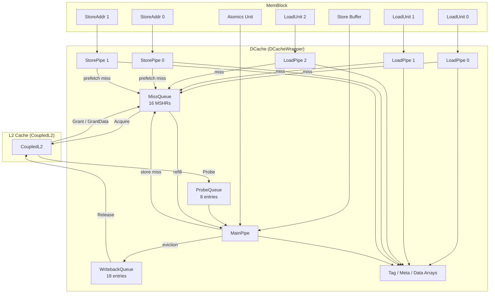
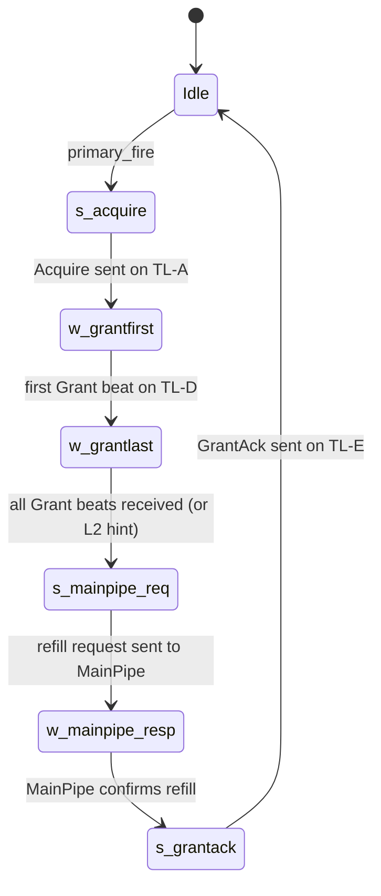
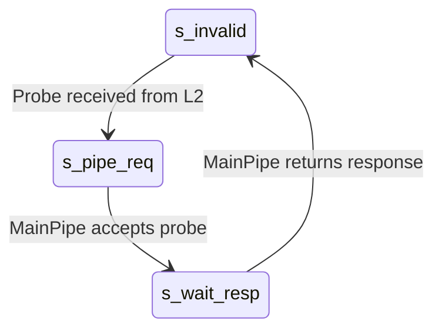
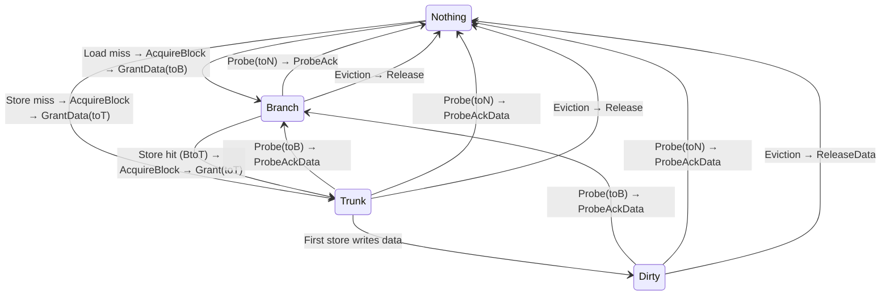

# Chapter 23. L1 Data Cache

The L1 data cache (DCache) is the first level of data storage visible to the
execution pipeline. Every load, store, and atomic instruction that touches
cacheable memory passes through it. Getting the DCache design right is
therefore critical to overall core performance: a load hit must complete in
three cycles so that dependent instructions can execute without stalling,
while the cache must simultaneously absorb stores, service coherence probes
from L2, and handle its own misses—all without blocking the pipeline.

## 23.1 Motivation and Design Challenge

Kunminghu's backend can issue up to **three loads** and **two stores** per
cycle. The DCache must sustain this aggregate bandwidth under typical
workloads. Meeting this demand poses several interrelated challenges:

1. **Load latency**. Dependent instructions stall until the load result is
   available. A three-cycle hit path—read tag, compare tag and read data,
   return data—is the minimum that avoids combinational loops through the
   TLB. Any structural hazard that blocks a tag or data read directly
   increases effective load latency.

2. **Store throughput without blocking loads**. Stores commit from the store
   buffer and must eventually write the data array, but doing so through the
   same pipeline as loads would create structural conflicts. Kunminghu
   separates the paths: loads flow through dedicated read-only **LoadPipes**,
   while stores flow from the store buffer into a shared **MainPipe** that
   also handles probes, refills, and atomics.

3. **Coherence probes**. The L2 cache may send a probe at any time, demanding
   that L1 downgrade or invalidate a line. Probes must be processed promptly
   to avoid protocol deadlocks, yet they must not starve demand requests.
   The MainPipe resolves this by giving probes the highest priority in its
   request arbiter
   ([MainPipe.scala:254](../../src/main/scala/xiangshan/cache/dcache/mainpipe/MainPipe.scala#L254)).

4. **Non-blocking misses**. A single outstanding miss would serialize all
   memory-level parallelism. Kunminghu provides **16 MSHRs** (Miss Status
   Holding Registers) in the MissQueue, each capable of tracking a
   cache-line-granularity miss through the full Acquire→Grant→Refill
   sequence.

5. **Cache aliasing**. At 64 KB the DCache is larger than a 4 KB page, so
   virtual index bits extend above the page offset. Bit 12 of the virtual
   address is part of the cache index but is *not* determined by the physical
   address alone. This creates a potential aliasing problem that is resolved
   by communicating alias bits to L2 via a TileLink custom field
   ([DCacheWrapper.scala:249](../../src/main/scala/xiangshan/cache/dcache/DCacheWrapper.scala#L249)).

> **Design Trade-off — Banked data array vs. multiported SRAM.**
> Three simultaneous load reads plus a MainPipe write require four data-array
> ports per cycle. True multiported SRAM is prohibitively expensive at 64 KB.
> Instead, XiangShan partitions the 64-byte cache line into **8 banks** of
> 8 bytes each. Because most loads touch only one or two banks, three loads
> can usually proceed in parallel. When two loads collide on the same bank a
> **bank-conflict nack** replays one of them—a rare event in practice. This
> banked approach follows Sohi and Franklin's classic technique, cited
> directly in the implementation
> ([BankedDataArray.scala:21](../../src/main/scala/xiangshan/cache/dcache/data/BankedDataArray.scala#L21)).


## 23.2 Subsystem Context

The DCache sits between the load/store execution pipelines above and the L2
cache below. Three LoadPipes and two StorePipes connect to the load and store
address units in MemBlock. A separate port receives committed store data from
the store buffer (sbuffer). Atomics enter through a dedicated port. Downward,
the DCache communicates with L2 through a TileLink bus using all five
channels.




## 23.3 Module Boundary and External Interfaces

The top-level I/O is defined in
[DCacheIO](../../src/main/scala/xiangshan/cache/dcache/DCacheWrapper.scala#L781).
The LSU-facing interface is
[DCacheToLsuIO](../../src/main/scala/xiangshan/cache/dcache/DCacheWrapper.scala#L763).

| Interface | Direction | Type | Description |
|-----------|-----------|------|-------------|
| `lsu.load[0..2]` | LSU → DCache, DCache → LSU | [`DCacheLoadIO`](../../src/main/scala/xiangshan/cache/dcache/DCacheWrapper.scala#L576) | 3 load pipe request/response ports |
| `lsu.sta[0..1]` | LSU → DCache, DCache → LSU | [`DCacheStoreIO`](../../src/main/scala/xiangshan/cache/dcache/storepipe/StorePipe.scala#L32) | 2 store address pipes (tag check) |
| `lsu.store` | SBuf → DCache, DCache → SBuf | [`DCacheToSbufferIO`](../../src/main/scala/xiangshan/cache/dcache/DCacheWrapper.scala#L617) | Store data from sbuffer → MainPipe |
| `lsu.atomics` | LSU → DCache, DCache → LSU | [`AtomicWordIO`](../../src/main/scala/xiangshan/cache/dcache/DCacheWrapper.scala#L556) | AMO / LR / SC requests |
| `lsu.forward_D[0..2]` | DCache → LSU | [`DcacheToLduForwardIO`](../../src/main/scala/xiangshan/cache/dcache/DCacheWrapper.scala#L631) | TileLink D-channel data forwarding to loads |
| `lsu.forward_mshr[0..2]` | LSU ↔ DCache | [`LduToMissqueueForwardIO`](../../src/main/scala/xiangshan/cache/dcache/DCacheWrapper.scala#L728) | MSHR data forwarding to loads |
| TileLink A | DCache → L2 | `TLBundleA` | Acquire requests (miss handling) |
| TileLink B | L2 → DCache | `TLBundleB` | Probe requests (coherence) |
| TileLink C | DCache → L2 | `TLBundleC` | Release / ReleaseData (writeback) |
| TileLink D | L2 → DCache | `TLBundleD` | Grant / GrantData (refill) |
| TileLink E | DCache → L2 | `TLBundleE` | GrantAck (refill acknowledgement) |

The `forward_D` and `forward_mshr` paths enable a replaying load to obtain
data directly from an in-flight refill, bypassing the data array entirely.
This reduces effective miss latency by one or more cycles for back-to-back
dependent loads.


## 23.4 Top-Level Architecture and Submodule Map

The implementation class
[DCacheImp](../../src/main/scala/xiangshan/cache/dcache/DCacheWrapper.scala#L920)
instantiates all submodules and wires them together. The following diagram
shows the internal organization:

```text
┌─────────────────────────────────────────────────────────────────────────┐
│                           DCacheImp                                    │
│                                                                        │
│  Storage Arrays                                                        │
│  ┌──────────────┐ ┌───────────┐ ┌──────────┐ ┌───────────────────────┐ │
│  │DuplicatedTag │ │L1CohMeta  │ │ErrorArray│ │  BankedDataArray      │ │
│  │Array (SRAM)  │ │Array (Reg)│ │(Reg)     │ │  (8 banks × 8 ways)  │ │
│  └──────┬───────┘ └─────┬─────┘ └────┬─────┘ └──────────┬────────────┘ │
│         │               │            │                   │             │
│  ┌──────┴───────────────┴────────────┴───────────────────┴─────────┐   │
│  │                 Read / Write Port Arbitration                   │   │
│  └──┬───────┬──────────┬──────────┬──────────┬────────────────────┘   │
│     │       │          │          │          │                         │
│  ┌──┴──┐ ┌──┴──┐ ┌────┴──┐ ┌───┴───┐ ┌───┴───┐                      │
│  │Load │ │Load │ │Load   │ │Store  │ │Store  │                      │
│  │Pipe0│ │Pipe1│ │Pipe2  │ │Pipe0  │ │Pipe1  │                      │
│  └──┬──┘ └──┬──┘ └───┬───┘ └───┬───┘ └───┬───┘                      │
│     │       │        │         │         │                           │
│     │       │        │    ┌────┴─────────┴──────────┐                │
│     │       │        │    │        MainPipe          │                │
│     │       │        │    │  (store/probe/refill/AMO)│                │
│     │       │        │    └───┬──────────┬───────────┘                │
│     │       │        │        │          │                            │
│  ┌──┴───────┴────────┴────────┴──┐ ┌────┴──────┐ ┌──────────────┐   │
│  │  MissQueue (16 MSHRs)         │ │ Writeback │ │  ProbeQueue  │   │
│  │  + TreeArbiter                │ │ Queue     │ │  (8 entries) │   │
│  └───────────┬───────────────────┘ │(18 entries)│ └──────┬───────┘   │
│              │                     └─────┬──────┘        │           │
│  ┌───────────┴───────────────────────────┴───────────────┴────────┐  │
│  │                    TileLink Bus Interface                       │  │
│  │     A (Acquire)   B (Probe)   C (Release)   D (Grant)   E (Ack)│  │
│  └────────────────────────────────────────────────────────────────┘  │
└─────────────────────────────────────────────────────────────────────────┘
```

| Submodule | Source | Role |
|-----------|--------|------|
| BankedDataArray | [BankedDataArray.scala:245](../../src/main/scala/xiangshan/cache/dcache/data/BankedDataArray.scala#L245) | 8-bank data SRAM; 8 ways × 128 sets per bank |
| DuplicatedTagArray | [TagArray.scala:120](../../src/main/scala/xiangshan/cache/dcache/meta/TagArray.scala#L120) | One tag SRAM copy per read port for conflict-free parallel reads |
| L1CohMetaArray | [AsynchronousMetaArray.scala:58](../../src/main/scala/xiangshan/cache/dcache/meta/AsynchronousMetaArray.scala#L58) | Register-based coherence metadata; 2 bits per way per set |
| ErrorArray | [AsynchronousMetaArray.scala](../../src/main/scala/xiangshan/cache/dcache/meta/AsynchronousMetaArray.scala) | Register-based TL error flags per line |
| PrefetchArray | [AsynchronousMetaArray.scala](../../src/main/scala/xiangshan/cache/dcache/meta/AsynchronousMetaArray.scala) | Prefetch source tracking per line |
| AccessArray | [AsynchronousMetaArray.scala](../../src/main/scala/xiangshan/cache/dcache/meta/AsynchronousMetaArray.scala) | Access flag for prefetch usefulness evaluation |
| LoadPipe | [LoadPipe.scala:33](../../src/main/scala/xiangshan/cache/dcache/loadpipe/LoadPipe.scala#L33) | 3 parallel load pipelines (3 stages each) |
| StorePipe | [StorePipe.scala:59](../../src/main/scala/xiangshan/cache/dcache/storepipe/StorePipe.scala#L59) | 2 store address pipes (tag-check only, 2 stages) |
| MainPipe | [MainPipe.scala:120](../../src/main/scala/xiangshan/cache/dcache/mainpipe/MainPipe.scala#L120) | Shared pipeline for stores, probes, refills, and atomics (4 stages) |
| MissQueue | [MissQueue.scala:1011](../../src/main/scala/xiangshan/cache/dcache/mainpipe/MissQueue.scala#L1011) | 16 MSHRs for non-blocking miss handling |
| ProbeQueue | [Probe.scala:49](../../src/main/scala/xiangshan/cache/dcache/mainpipe/Probe.scala#L49) | 8-entry buffer for coherence probes from L2 |
| WritebackQueue | [WritebackQueue.scala:52](../../src/main/scala/xiangshan/cache/dcache/mainpipe/WritebackQueue.scala#L52) | 18-entry queue for releasing lines to L2 |

Submodule instantiation happens at
[DCacheImp:962](../../src/main/scala/xiangshan/cache/dcache/DCacheWrapper.scala#L962)–994.


## 23.5 Address Layout and Cache Organization

The DCache is **Virtually Indexed, Physically Tagged (VIPT)**. The virtual
address supplies the index bits so that the SRAM read can start in the same
cycle the request arrives, without waiting for TLB translation. The physical
tag from TLB arrives one cycle later and is compared against the stored tags.

### 23.5.1 Address bit decomposition

The DCache source contains an ASCII diagram of the address layout
([DCacheWrapper.scala:70](../../src/main/scala/xiangshan/cache/dcache/DCacheWrapper.scala#L70)).
The Kunminghu configuration produces the following decomposition:

```text
Physical Address (PAddrBits wide):
┌──────────────────────┬──────────┬───────┬──────────┐
│    Physical Tag      │ Set      │ Bank  │  Offset  │
│   [PA-1 : 12]        │ [12 : 9] │ [8:6] │  [5 : 0] │
└──────────────────────┴──────────┴───────┴──────────┘
                        ↑          ↑       ↑          ↑
                  DCacheTagOffset  |  DCacheBankOffset 0
                       = 12       DCacheSetOffset = 9

Virtual Address (VAddrBits wide):
┌──────────────────────┬─────┬───────┬───────┬──────────┐
│    Above Index       │Alias│ Set   │ Bank  │  Offset  │
│   [VA-1 : 13]        │ [12]│[11:9] │ [8:6] │  [5 : 0] │
└──────────────────────┴─────┴───────┴───────┴──────────┘
                        ↑
                  DCacheAboveIndexOffset = 13
```

The **offset** (bits [5:0]) selects a byte within the 64-byte cache line.
**Bank** (bits [8:6]) selects one of 8 banks within a line. **Set** (bits
above bank up to the tag boundary) selects one of 128 sets.

### 23.5.2 VIPT and the alias problem

Because the set index extends from bit 6 to bit 12 (inclusive for the
virtual address), and a 4 KB page only guarantees that bits [11:0] are
identical between virtual and physical addresses, bit 12 is an **alias bit**.
Two different virtual addresses that map to the same physical page could hash
to different cache sets, violating the inclusion property expected by L2.

XiangShan resolves this by passing the alias bit to L2 via the TileLink
`AliasField` custom echo. L2 uses it to maintain a consistent view and
invalidate stale aliases
([DCacheWrapper.scala:63](../../src/main/scala/xiangshan/cache/dcache/DCacheWrapper.scala#L63)).

### 23.5.3 Parameter table

| Parameter | Default | Kunminghu | Source |
|-----------|---------|-----------|--------|
| [`nSets`](../../src/main/scala/xiangshan/cache/dcache/DCacheWrapper.scala#L39) | 128 | 128 | `DCacheParameters` |
| [`nWays`](../../src/main/scala/xiangshan/cache/dcache/DCacheWrapper.scala#L40) | 8 | 8 | `DCacheParameters` |
| [`blockBytes`](../../src/main/scala/xiangshan/cache/dcache/DCacheWrapper.scala#L51) | 64 | 64 | `DCacheParameters` |
| [`DCacheBanks`](../../src/main/scala/xiangshan/cache/dcache/DCacheWrapper.scala#L137) | 8 | 8 | hardcoded |
| [`DCacheSRAMRowBits`](../../src/main/scala/xiangshan/cache/dcache/DCacheWrapper.scala#L139) | 64 | 64 | hardcoded |
| Total capacity | — | **64 KB** | 128 × 8 × 64 |
| [`replacer`](../../src/main/scala/xiangshan/cache/dcache/DCacheWrapper.scala#L44) | `"setplru"` | `"setplru"` | `DCacheParameters` |
| [`tagECC`](../../src/main/scala/xiangshan/Parameters.scala#L264) | None | SEC-DED | Kunminghu config |
| [`dataECC`](../../src/main/scala/xiangshan/Parameters.scala#L265) | None | SEC-DED | Kunminghu config |
| [`nMissEntries`](../../src/main/scala/xiangshan/Parameters.scala#L267) | 1 | **16** | Kunminghu config |
| [`nProbeEntries`](../../src/main/scala/xiangshan/Parameters.scala#L268) | 1 | **8** | Kunminghu config |
| [`nReleaseEntries`](../../src/main/scala/xiangshan/Parameters.scala#L269) | 1 | **18** | Kunminghu config |
| [`nMaxPrefetchEntry`](../../src/main/scala/xiangshan/Parameters.scala#L270) | 1 | **6** | Kunminghu config |
| [`aliasBitsOpt`](../../src/main/scala/xiangshan/cache/dcache/DCacheWrapper.scala#L63) | — | Some(1) | derived |


## 23.6 Storage Arrays

### 23.6.1 BankedDataArray

The data array is organized as **8 banks**, each holding **8 way-SRAMs** of
128 sets. Each SRAM entry stores 64 bits of data plus 8 bits of ECC (72 bits
total when `enableDataEcc` is true). The bank layout is documented in the
source at
[BankedDataArray.scala:237](../../src/main/scala/xiangshan/cache/dcache/data/BankedDataArray.scala#L237):

```text
              Banked DCache Data
+-------+-------+-------+-------+-------+-------+-------+-------+
| Bank0 | Bank1 | Bank2 | Bank3 | Bank4 | Bank5 | Bank6 | Bank7 |
+-------+-------+-------+-------+-------+-------+-------+-------+
| Way0  | Way0  | Way0  | Way0  | Way0  | Way0  | Way0  | Way0  |
| Way1  | Way1  | Way1  | Way1  | Way1  | Way1  | Way1  | Way1  |
| ....  | ....  | ....  | ....  | ....  | ....  | ....  | ....  |
| Way7  | Way7  | Way7  | Way7  | Way7  | Way7  | Way7  | Way7  |
+-------+-------+-------+-------+-------+-------+-------+-------+
```

Each bank consists of a `DataSRAMBank` module
([BankedDataArray.scala:164](../../src/main/scala/xiangshan/cache/dcache/data/BankedDataArray.scala#L164))
that wraps 8 single-ported SRAMs—one per way. Because the SRAMs are
single-ported, a bank cannot be read and written simultaneously; the
write-port arbiter ensures that write requests from MainPipe take precedence
when a conflict occurs.

The data array exposes the following ports
([BankedDataArray.scala:249](../../src/main/scala/xiangshan/cache/dcache/data/BankedDataArray.scala#L249)):

- **3 load read ports** (`io.read[0..2]`) — one per LoadPipe
- **1 line read port** (`io.readline`) — used by MainPipe for probe/store/AMO
- **1 line write port** (`io.write`) — used by MainPipe for refill/store

**Bank-conflict detection.** When two LoadPipes attempt to read the same bank
in the same cycle, the lower-indexed pipe wins and the higher-indexed one
receives a `bank_conflict` nack. The nacked load is replayed by the load
queue. A 128-bit load (for vector operations) reads two adjacent banks
simultaneously; if any of those banks conflicts with another load, the
conflict is flagged.

| Property | Value |
|----------|-------|
| Banks | 8 |
| Ways per bank | 8 (individual SRAMs) |
| Sets per SRAM | 128 |
| Data width | 64 bits |
| ECC width | 8 bits (SEC-DED, when enabled) |
| Entry width | 72 bits (with ECC) or 64 bits (without) |
| Port type | Single-ported (read or write, not both) |

### 23.6.2 Tag array (DuplicatedTagArray)

The tag array is **duplicated**: one full copy of the tag SRAMs exists for
each read port (3 LoadPipes + 1 MainPipe + 2 StorePipes = up to 6 copies in
Kunminghu)
([TagArray.scala:120](../../src/main/scala/xiangshan/cache/dcache/meta/TagArray.scala#L120)).
Each copy is built from `TagSRAMBank` modules
([TagArray.scala:55](../../src/main/scala/xiangshan/cache/dcache/meta/TagArray.scala#L55)),
each holding `DCacheWayDiv = 2` ways (so 4 banks cover 8 ways). Tags are 36
bits wide; with SEC-DED ECC the encoded width is 43 bits (`encTagBits`).

All copies share a single write port: when MainPipe writes a new tag during
refill, the write fans out to every copy. Reads are independent and
conflict-free because each pipeline has its own dedicated copy.

### 23.6.3 Meta array (L1CohMetaArray)

The coherence metadata is stored in **registers**, not SRAMs
([AsynchronousMetaArray.scala:65](../../src/main/scala/xiangshan/cache/dcache/meta/AsynchronousMetaArray.scala#L65)).
This guarantees that reads complete combinationally in the same cycle with no
structural hazard—essential for maintaining three-cycle load hit latency
without adding a pipeline bubble for meta read.

Each entry is a 2-bit `ClientMetadata` encoding:

| Value | State | TileLink meaning |
|-------|-------|------------------|
| `2'b00` | Nothing | Invalid — line not present |
| `2'b01` | Branch | Read-only shared copy |
| `2'b10` | Trunk | Read-write, clean |
| `2'b11` | Dirty | Read-write, modified |

The total register cost is 128 sets × 8 ways × 2 bits = 2,048 flip-flops,
which is acceptable for an L1 cache.

Alongside coherence metadata, several auxiliary register arrays track
per-line properties: error flags (`ErrorArray`), prefetch source
(`PrefetchArray`), access flags (`AccessArray`), and optionally refill
latency (`LatencyArray`)—all instantiated at
[DCacheImp:965](../../src/main/scala/xiangshan/cache/dcache/DCacheWrapper.scala#L965)–969.


## 23.7 Load Pipeline Walkthrough

The LoadPipe is the most performance-critical path in the DCache. Three
instances operate in parallel, each accepting one load per cycle. The
pipeline has three stages
([LoadPipe.scala:112](../../src/main/scala/xiangshan/cache/dcache/loadpipe/LoadPipe.scala#L112)):

```text
+-------+------------------------+------------------------+-------------------+
| Cycle | Stage 0                | Stage 1                | Stage 2           |
+-------+------------------------+------------------------+-------------------+
| 0     | Accept vaddr           | ·                      | ·                 |
|       | Issue tag read         | ·                      | ·                 |
|       | Issue meta read        | ·                      | ·                 |
|       | Compute bank mask      | ·                      | ·                 |
+-------+------------------------+------------------------+-------------------+
| 1     | ·                      | Receive tag/meta       | ·                 |
|       | ·                      | Receive paddr from TLB | ·                 |
|       | ·                      | Compare tag (8 ways)   | ·                 |
|       | ·                      | Check coh permission   | ·                 |
|       | ·                      | Issue data read        | ·                 |
+-------+------------------------+------------------------+-------------------+
| 2     | ·                      | ·                      | Receive data      |
|       | ·                      | ·                      | Hit/miss decision |
|       | ·                      | ·                      | Respond to LSU    |
|       | ·                      | ·                      | Send miss → MQ    |
+-------+------------------------+------------------------+-------------------+
```

### Stage 0 — Tag and meta read

The load unit provides a virtual address. The LoadPipe extracts the set index
using `get_idx(vaddr)` and issues a tag read and a meta read to the
duplicated arrays
([LoadPipe.scala:152](../../src/main/scala/xiangshan/cache/dcache/loadpipe/LoadPipe.scala#L152)–157).
It also computes a bank one-hot mask for the data read that will happen in
stage 1
([LoadPipe.scala:129](../../src/main/scala/xiangshan/cache/dcache/loadpipe/LoadPipe.scala#L129)–131).
For 128-bit (vector) loads, two adjacent bank bits are set.

### Stage 1 — Tag compare and data read

The tag and meta responses arrive from SRAM. Meanwhile, the TLB delivers the
physical address via `s1_paddr_dup_dcache`
([LoadPipe.scala:169](../../src/main/scala/xiangshan/cache/dcache/loadpipe/LoadPipe.scala#L169)).
The physical tag is extracted with `get_tag()` and compared against all 8
ways:

```
s1_tag_match_way_dup_dc = wayMap(w =>
    s1_tag_resp(w) === get_tag(s1_paddr_dup_dcache) &&
    meta_resp(w).coh.isValid()
).asUInt
```

([LoadPipe.scala:211](../../src/main/scala/xiangshan/cache/dcache/loadpipe/LoadPipe.scala#L211))

If no way matches, the line is a miss. The hit/miss decision also checks
coherence permissions: a load requires at least Branch (read) permission
([LoadPipe.scala:292](../../src/main/scala/xiangshan/cache/dcache/loadpipe/LoadPipe.scala#L292)–293).

If the Way Prediction Unit (WPU) is enabled, a predicted way-enable from
stage 0 can restrict the data read to a single way, saving SRAM read energy.
If the prediction turns out wrong in stage 2, the load is replayed.

The data read request is issued at the end of stage 1:
`io.banked_data_read.valid := s1_fire && !s1_nack && !s1_is_prefetch`
([LoadPipe.scala:297](../../src/main/scala/xiangshan/cache/dcache/loadpipe/LoadPipe.scala#L297)).

### Stage 2 — Data return and response

Data arrives from the banked SRAM. On a hit, the 64- or 128-bit result is
forwarded to the LSU via `io.lsu.resp`. On a miss, the LoadPipe sends a
`miss_req` to the MissQueue through a `TreeArbiter`
([DCacheWrapper.scala:810](../../src/main/scala/xiangshan/cache/dcache/DCacheWrapper.scala#L810)).
The LoadPipe also selects a replacement way via the PLRU replacer in case the
MissQueue needs to allocate.

Several nack conditions can cause a replay instead of a definitive
hit/miss:
- **Bank conflict**: two LoadPipes accessed the same bank
- **WPU misprediction**: predicted way was wrong but a real hit exists
- **MSHR nack**: MissQueue is full, cannot allocate a new entry
- **Writeback queue conflict**: a pending Release targets the same address

On any nack the LoadPipe signals `s2_mq_nack` or `s2_bank_conflict` to the
LSU, which replays the load from the load queue.


## 23.8 Store Pipeline and MainPipe

### 23.8.1 StorePipe (tag-check only)

The two StorePipes
([StorePipe.scala:59](../../src/main/scala/xiangshan/cache/dcache/storepipe/StorePipe.scala#L59))
are lightweight: they perform a tag and meta read in stage 0 and a tag
comparison in stage 1, then report hit/miss back to the store address unit.
On a miss, the StorePipe can optionally issue a **store-write prefetch** to
the MissQueue, pre-fetching the line before the store data commits from the
sbuffer. The actual store data write happens later when the sbuffer drains
through MainPipe.

### 23.8.2 MainPipe — the shared write path

The MainPipe
([MainPipe.scala:120](../../src/main/scala/xiangshan/cache/dcache/mainpipe/MainPipe.scala#L120))
is a 4-stage pipeline shared among four request types. A priority arbiter at
the entrance enforces a strict ordering:

```
Priority:  Probe  >  Refill  >  Store  >  Atomic
```

([MainPipe.scala:253](../../src/main/scala/xiangshan/cache/dcache/mainpipe/MainPipe.scala#L253)–262)

This ensures coherence probes are never blocked by demand traffic, and
refills complete promptly so that MSHRs are freed.

**Store starvation prevention.** Because loads read the tag/data arrays
continuously, a store could wait indefinitely for a free cycle. A
`storeWaitCycles` counter tracks how long a store has been blocked; when it
exceeds `StoreWaitThreshold`, the store bypasses the load-priority check
([MainPipe.scala:232](../../src/main/scala/xiangshan/cache/dcache/mainpipe/MainPipe.scala#L232)–237).

**Stage s0 — Read tag and meta.** The arbiter selects the winning request.
The set index is computed and tag/meta reads are issued. For stores, a bank
write mask is computed to determine which banks need a read-modify-write
([MainPipe.scala:277](../../src/main/scala/xiangshan/cache/dcache/mainpipe/MainPipe.scala#L277)–279).

**Stage s1 — Tag match and way selection.** The tag/meta responses arrive.
For a refill request, the replacement way is selected via the PLRU replacer.
For a store, the tag is compared to determine hit or miss. If a data read is
needed (partial-line store, probe, AMO, or refill with eviction), it is
issued via `io.data_readline`.

**Stage s2 — Data merge and miss check.** Data arrives from the banked
array. For a store hit, the new store data is merged with the existing cache
line using the store mask. For a refill, the MissQueue provides the refill
data via `io.refill_info`
([MainPipe.scala:141](../../src/main/scala/xiangshan/cache/dcache/mainpipe/MainPipe.scala#L141)).
A store miss sends a request to the MissQueue.

**Stage s3 — Write arrays and generate writeback.** Updated data, tag, and
meta are written to the arrays. If the evicted way was valid
(Branch/Trunk/Dirty), a `WritebackReq` is sent to the WritebackQueue. For
AMO operations, the AMO ALU computes the result (e.g., add, swap, min/max)
and the result is written back. For LR/SC instructions, the reservation set
is managed: LR sets the lock, SC checks it
([MainPipe.scala:200](../../src/main/scala/xiangshan/cache/dcache/mainpipe/MainPipe.scala#L200)–203).

**Set-conflict blocking.** To prevent data hazards, the MainPipe blocks a
new request in s0 if any request in s1, s2, or s3 targets the same set
([MainPipe.scala:223](../../src/main/scala/xiangshan/cache/dcache/mainpipe/MainPipe.scala#L223)–228).


## 23.9 Miss Handling: MissQueue and MSHRs

The MissQueue implements a **lockup-free** cache, following the seminal MSHR
concept by Kroft (1981)—cited directly in the source header
([MissQueue.scala:20](../../src/main/scala/xiangshan/cache/dcache/mainpipe/MissQueue.scala#L20)).
With 16 MSHRs, the DCache can track up to 16 outstanding cache-line misses
simultaneously.

### 23.9.1 MissEntry state machine

Each MSHR is a `MissEntry`
([MissQueue.scala:368](../../src/main/scala/xiangshan/cache/dcache/mainpipe/MissQueue.scala#L368))
with the following state registers
([MissQueue.scala:484](../../src/main/scala/xiangshan/cache/dcache/mainpipe/MissQueue.scala#L484)–492):



The state is encoded as a set of progress flags rather than a single FSM
register, allowing fine-grained tracking:

| Flag | Meaning |
|------|---------|
| `s_acquire` | `false` = need to send Acquire on TL-A |
| `w_grantfirst` | `false` = waiting for first Grant beat |
| `w_grantlast` | `false` = waiting for last Grant beat |
| `w_l2hint` | `false` = waiting for L2 hint |
| `s_mainpipe_req` | `false` = need to send refill request to MainPipe |
| `w_mainpipe_resp` | `false` = waiting for MainPipe to confirm refill |
| `w_refill_resp` | `false` = waiting for refill to complete |
| `s_grantack` | `false` = need to send GrantAck on TL-E |

The entry is released when `s_grantack && w_mainpipe_resp && w_refill_resp`
([MissQueue.scala:498](../../src/main/scala/xiangshan/cache/dcache/mainpipe/MissQueue.scala#L498)).

### 23.9.2 Primary and secondary misses

When a miss request arrives, the MissQueue checks all 16 entries:

- **Primary allocation**: if a free entry exists, the request is allocated to
  it (`primary_ready`, `primary_fire`).
- **Secondary merge**: if an existing entry already tracks a miss to the
  **same cache line**, the new request merges into it (`secondary_ready`).
  The merged request's data will be forwarded when the refill completes.
- **Reject**: if the entry is busy with a non-matching address, the request
  is rejected (`secondary_reject`).

The MissQueue uses a `TreeArbiter`
([DCacheWrapper.scala:810](../../src/main/scala/xiangshan/cache/dcache/DCacheWrapper.scala#L810))
to select among miss requests from all pipelines. MainPipe has the highest
priority (port 0).

### 23.9.3 AcquireBlock vs. AcquirePerm

When a store misses and the store mask covers **all 64 bytes** of the cache
line (`full_overwrite`), there is no need to fetch the old data from L2—the
entire line will be overwritten. In this case the MSHR sends an
`AcquirePerm` instead of `AcquireBlock`. L2 responds with a `Grant` (no
data) rather than `GrantData`, saving bus bandwidth
([MissQueue.scala:513](../../src/main/scala/xiangshan/cache/dcache/mainpipe/MissQueue.scala#L513)).

### 23.9.4 L2 hint and early refill scheduling

L2 can send a **hint** signal (`l2_hint`) before the actual GrantData
arrives on TileLink-D. This allows the MSHR to send a refill request to
MainPipe *early*, so that by the time the data arrives on TL-D, MainPipe is
already in the right stage to write it. This overlapping reduces effective
miss latency by one or more cycles
([MissQueue.scala:401](../../src/main/scala/xiangshan/cache/dcache/mainpipe/MissQueue.scala#L401)).

### 23.9.5 MSHR forwarding to loads

While refill data is accumulating in the MSHR (beat by beat), a replaying
load can bypass the data array entirely. The `MissEntryForwardIO`
([DCacheWrapper.scala:691](../../src/main/scala/xiangshan/cache/dcache/DCacheWrapper.scala#L691))
exposes the partially refilled data so that a load whose address matches an
in-flight MSHR can grab the data directly. Similarly, `DcacheToLduForwardIO`
([DCacheWrapper.scala:631](../../src/main/scala/xiangshan/cache/dcache/DCacheWrapper.scala#L631))
forwards data from the TileLink-D channel in the cycle it arrives.


## 23.10 Coherence: ProbeQueue and WritebackQueue

### 23.10.1 ProbeQueue

The ProbeQueue receives coherence probe requests from L2 via TileLink
channel B. It contains 8 `ProbeEntry` modules, each implementing a simple
three-state FSM
([Probe.scala:61](../../src/main/scala/xiangshan/cache/dcache/mainpipe/Probe.scala#L61)):



**LR/SC blocking.** If the probe targets an address locked by an LR
instruction, the ProbeEntry stalls (`lrsc_blocked`) to avoid breaking the
LR/SC atomicity guarantee. Once the SC completes or the LR reservation
expires, the probe proceeds
([Probe.scala:87](../../src/main/scala/xiangshan/cache/dcache/mainpipe/Probe.scala#L87)–96).

When the probe reaches MainPipe, the pipeline reads the current tag and meta.
If the line is present, it downgrades or invalidates the coherence state and
sends a ProbeAck (with or without data, depending on `probe_need_data`) via
the WritebackQueue.

### 23.10.2 WritebackQueue

The WritebackQueue holds 18 entries for releasing lines to L2 via TileLink
channel C
([WritebackQueue.scala:52](../../src/main/scala/xiangshan/cache/dcache/mainpipe/WritebackQueue.scala#L52)).
It handles two types of releases:

1. **Voluntary Release (eviction)**: when MainPipe replaces a valid line
   during refill, it pushes a `WritebackReq` with `voluntary = true`. The
   queue sends a `Release` or `ReleaseData` message to L2.

2. **ProbeAck**: when MainPipe processes a probe, it pushes a `WritebackReq`
   with `voluntary = false`. The queue sends a `ProbeAck` or
   `ProbeAckData`.

Each `WritebackEntry` tracks its progress through the multi-beat Release
transfer on TileLink-C. A data-merge mechanism
([WritebackQueue.scala:95](../../src/main/scala/xiangshan/cache/dcache/mainpipe/WritebackQueue.scala#L95))
handles the case where a store updates a line that is pending release: the
new store data is merged into the outgoing release data to ensure the latest
value is written back.

### 23.10.3 Coherence state transitions

The following diagram summarizes how the four coherence states transition in
response to local and remote events:




## 23.11 Replacement, ECC, and Configuration

### 23.11.1 Replacement policy

The DCache uses **Set-Partitioned Pseudo-LRU (SetPLRU)** by default,
instantiated at
[DCacheWrapper.scala:1640](../../src/main/scala/xiangshan/cache/dcache/DCacheWrapper.scala#L1640):

```
val replacer = ReplacementPolicy.fromString(cacheParams.replacer, nWays, nSets)
```

Each LoadPipe, StorePipe, and MainPipe has a `replace_access` port to inform
the replacer of accesses, and a `replace_way` port to query the victim way
on a miss. The replacer is updated on every cache hit so that frequently
accessed ways are protected from eviction.

### 23.11.2 ECC protection

In the Kunminghu configuration, **SEC-DED** (Single Error Correcting, Double
Error Detecting) ECC is enabled on both tag and data arrays
([Parameters.scala:264](../../src/main/scala/xiangshan/Parameters.scala#L264)–265):

| Array | Data width | ECC width | Encoded width |
|-------|-----------|-----------|---------------|
| Tag | 36 bits | 7 bits | 43 bits (`encTagBits`) |
| Data (per bank) | 64 bits | 8 bits | 72 bits (`encDataBits`) |

Tag ECC errors are detected in LoadPipe stage 1
([LoadPipe.scala:210](../../src/main/scala/xiangshan/cache/dcache/loadpipe/LoadPipe.scala#L210))
and in MainPipe correspondingly. Data ECC errors are detected when data is
read back from SRAM. Detected errors are reported via `io.error` for
hardware exception handling.

### 23.11.3 CtrlUnit (error injection controller)

A memory-mapped controller (`CtrlUnit`) at address `0x38022000`
([Parameters.scala:273](../../src/main/scala/xiangshan/Parameters.scala#L273))
allows software to inject pseudo-errors into tag and data arrays for testing
the ECC detection and correction logic. The controller is wired to the
LoadPipe and MainPipe pseudo-error ports at
[DCacheImp:1029](../../src/main/scala/xiangshan/cache/dcache/DCacheWrapper.scala#L1029)–1039.


## 23.12 Worked Example — Life of a Load Miss

Consider a load instruction that reads address `0x8000_1234` and misses in
the DCache. The following trace walks through the complete miss-handling
sequence.

**Cycle 0 — LoadPipe s0.** The load virtual address arrives. The set index
is extracted from bits [12:9] of the virtual address. Tag and meta reads are
issued to the duplicated arrays. The bank mask is computed: bits [8:6]
select bank 4, so a single-bank read is prepared.

**Cycle 1 — LoadPipe s1.** The TLB delivers the physical address. Tag
comparison: the physical tag is compared against all 8 stored tags. None
matches—`s1_tag_match_dup_dc = 0`. Permission check confirms the miss:
`s1_hit = false`. The LoadPipe also queries the PLRU replacer for a victim
way (say way 5) and sets `s1_will_send_miss_req = true`. The data read is
suppressed since there is no point reading data on a guaranteed miss.

**Cycle 2 — LoadPipe s2.** The miss is confirmed. A `miss_req` is sent to
the MissQueue via the TreeArbiter. The MissQueue finds a free MSHR (entry
#3) and allocates it. The LoadPipe responds to the LSU: `miss = true`.

**Cycle 3 — MSHR Acquire.** MSHR #3 sends an `AcquireBlock` message on
TileLink channel A, requesting the cache line with read permission
(`NtoB` if load-only, or `NtoT` if a store is also pending).

**Cycles 4–N — Waiting for Grant.** The Acquire propagates through L2.
Eventually, L2 begins sending `GrantData` on channel D, delivering the
64-byte cache line in multiple beats (typically 2 beats at 256 bits each).

**Cycle N — L2 Hint.** Before the last Grant beat arrives, L2 sends an
`l2_hint` signal. MSHR #3 reacts by sending a refill request to MainPipe.

**Cycle N+1 — MainPipe s0.** The refill request enters MainPipe (priority:
just below Probe). Tag and meta reads are issued for the target set.

**Cycle N+2 — MainPipe s1.** Tag comparison confirms this is a new line
(miss). The PLRU replacer selects way 5 as the victim. If way 5 holds a
valid line in Dirty state, eviction will be needed.

**Cycle N+3 — MainPipe s2.** The old data from way 5 is read from the
banked array. The refill data from MSHR #3 arrives via `refill_info`. If
the miss was caused by a store, the store data is merged with the refill
data at this stage.

**Cycle N+4 — MainPipe s3.** The new tag, meta (set to Branch or Trunk),
and refill data are written to way 5 in the tag, meta, and data arrays. If
the evicted way 5 was Dirty, a `WritebackReq` is sent to the WritebackQueue,
which will issue a `ReleaseData` to L2. MSHR #3 sends `GrantAck` on
TileLink channel E.

**Cycle N+5+ — Replay.** The load replays from the LoadQueueReplay. This
time it hits in the now-filled cache line and returns data in 3 cycles.


## 23.13 Design Trade-off Discussion

> **Design Trade-off — Separate LoadPipes vs. a unified pipeline.**
> An alternative design would route all loads through the MainPipe alongside
> stores and probes, using a single shared pipeline. This simplifies the
> control logic and eliminates the need for duplicated tag arrays. However,
> it caps throughput at one memory operation per cycle and increases load
> latency because loads must contend with stores and probes for pipeline
> slots. Kunminghu's choice of three dedicated LoadPipes delivers three-cycle
> hit latency and three loads per cycle—at the cost of tag SRAM duplication,
> bank-conflict detection logic, and careful set-conflict checking between
> the independent pipes and MainPipe. For a high-performance out-of-order
> core, this trade-off strongly favors the separated design.

> **Design Trade-off — Register-based meta vs. SRAM-based meta.**
> The coherence metadata array uses registers rather than SRAMs. This
> guarantees combinational read in the same cycle with no structural hazard,
> which is critical for the three-cycle load hit path. An SRAM-based meta
> would require either an extra pipeline stage (adding latency) or a bypass
> network (adding combinational depth). The cost is 128 × 8 × 2 = 2,048
> flip-flops for the coherence array alone, plus additional registers for
> error, prefetch, and access flags. This is affordable at L1 scale but would
> not generalize to L2 (1,024+ sets × 8 ways).


## 23.14 Key Takeaways

1. The Kunminghu L1 DCache is **64 KB, 8-way set-associative** with 128 sets
   and 8 data banks, using VIPT indexing with one alias bit communicated to
   L2 via TileLink `AliasField`.

2. **Three parallel LoadPipes** provide three-cycle load-hit latency; a
   single **MainPipe** handles stores, probes, refills, and atomics with a
   strict priority arbiter (Probe > Refill > Store > Atomic).

3. **Sixteen MSHRs** implement lockup-free miss handling with secondary miss
   merging, AcquireBlock/AcquirePerm optimization for full-block overwrites,
   and L2-hint-based early refill scheduling.

4. **SEC-DED ECC** protects both tag and data arrays, with a memory-mapped
   CtrlUnit for software-driven error injection testing.

5. Register-based metadata and duplicated tag SRAMs eliminate structural
   hazards on the critical load path, while banked data arrays enable high
   bandwidth with minimal area overhead compared to multiported SRAMs.


## 23.15 Checkpoint Questions

**Basic**

1. How many cycles does a load hit take through the LoadPipe? In which stage
   does tag comparison occur?

2. What is the total DCache capacity, and how is it computed from `nSets`,
   `nWays`, and `blockBytes`?

3. What are the four coherence states stored in the meta array, and what do
   they represent in TileLink terminology?

**Intermediate**

4. Why does the DCache need an alias bit, and how is the aliasing problem
   resolved with L2?

5. Explain the difference between `AcquireBlock` and `AcquirePerm`. Under
   what condition does the MissQueue issue `AcquirePerm`?

6. How does the MainPipe arbiter prevent store starvation when loads keep
   arriving? What parameter controls the threshold?

**Advanced**

7. Trace the lifecycle of a store miss from sbuffer entry through refill
   completion, identifying every pipeline stage and TileLink message
   involved. How does the flow differ when the store covers the full 64-byte
   line?

8. How does the MissEntry forward data to a replaying load that matches an
   in-flight MSHR? Describe both the MSHR forwarding path and the TileLink-D
   forwarding path, and explain when each is used.


## 23.16 Further Reading

1. D. Kroft, "Lockup-free instruction fetch/prefetch cache organization,"
   *8th Annual Symposium on Computer Architecture (ISCA)*, 1981 — the
   foundational MSHR concept, cited in
   [MissQueue.scala](../../src/main/scala/xiangshan/cache/dcache/mainpipe/MissQueue.scala#L20).

2. G. S. Sohi and M. Franklin, "High-bandwidth data memory systems for
   superscalar processors," *4th ASPLOS*, 1991 — banked cache design for
   multi-issue processors, cited in
   [BankedDataArray.scala](../../src/main/scala/xiangshan/cache/dcache/data/BankedDataArray.scala#L21).

3. SiFive, *TileLink Specification*, version 1.8 — the coherence protocol
   used between L1 and L2 in XiangShan.

4. *XiangShan-Design-Doc: DCache section*
   (`XiangShan-Design-Doc/docs/en/memblock/DCache/`) — official design
   documentation with detailed timing diagrams and state machine figures.

5. D. A. Patterson and J. L. Hennessy, *Computer Organization and Design:
   The Hardware/Software Interface*, Chapter 5 — cache fundamentals and
   performance analysis.
