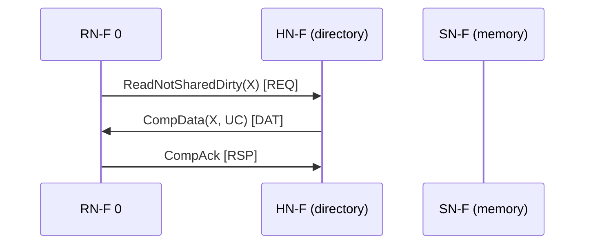
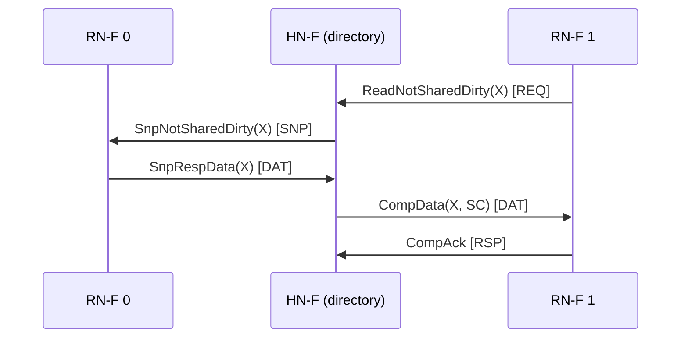
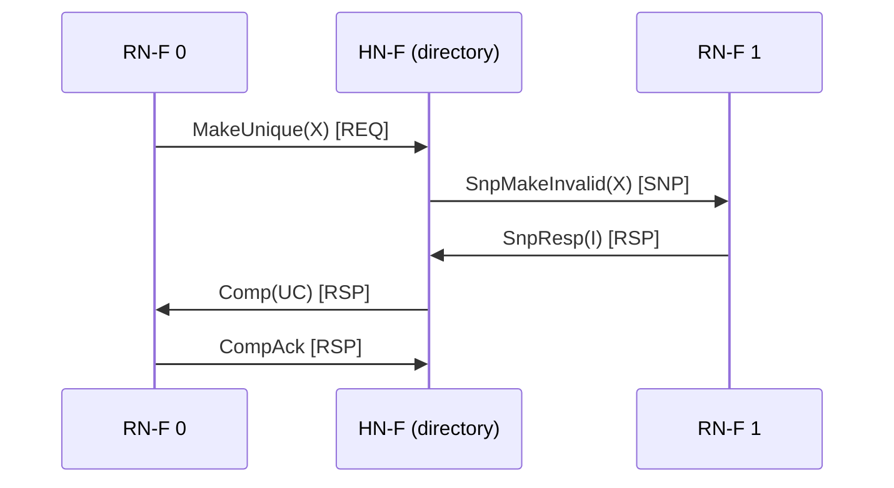
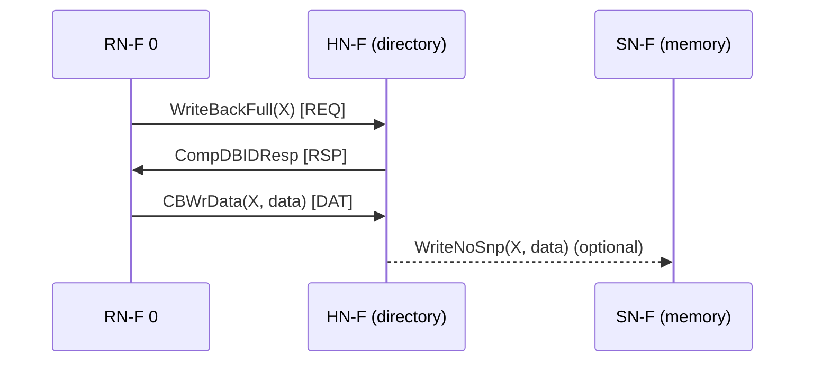
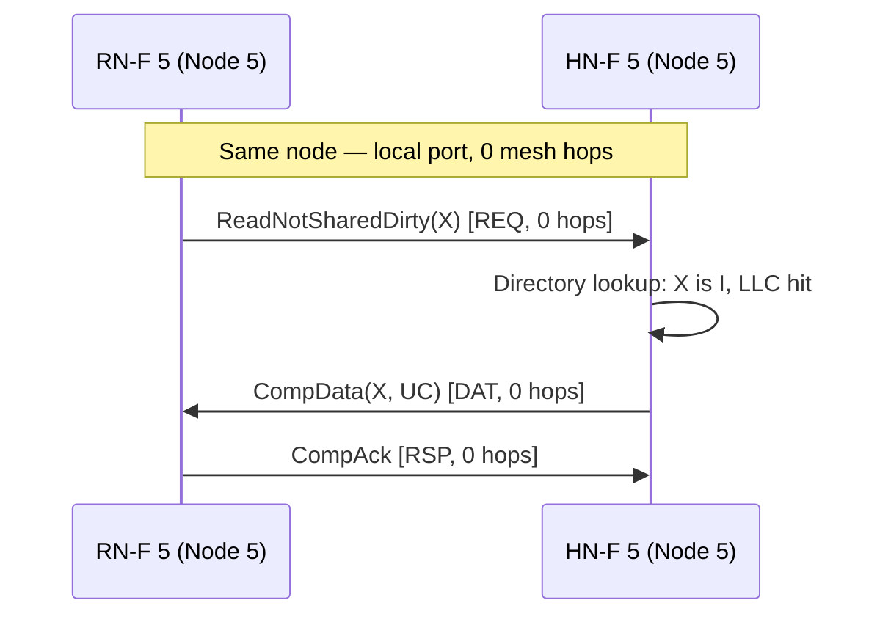
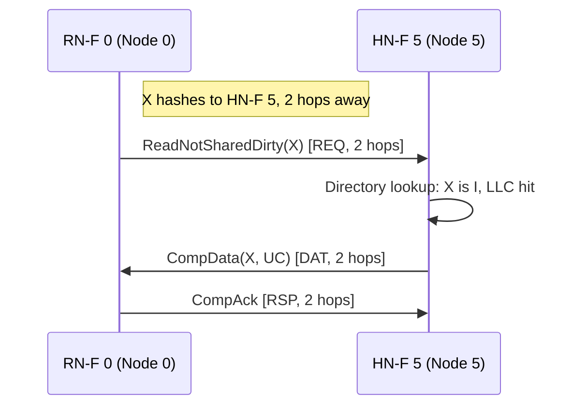
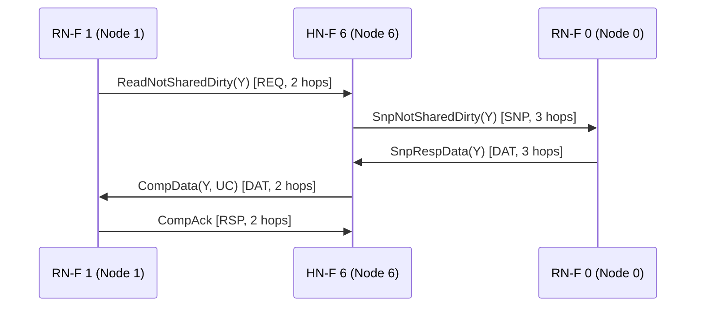
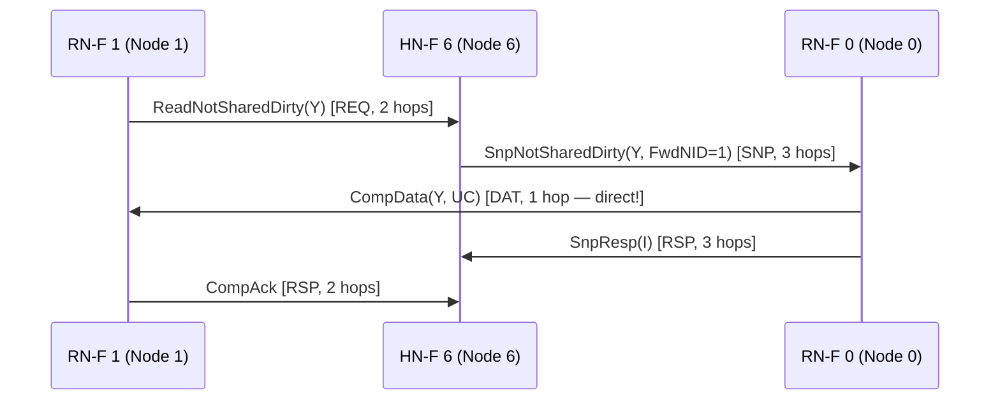
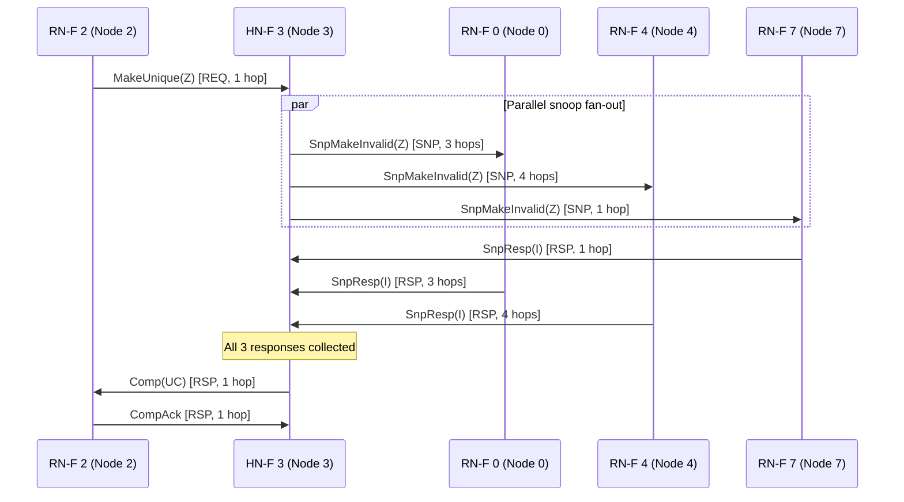

# Chapter 26. Directory-Based Coherence and Networks-on-Chip

Part IV described how a single core's load and store pipelines interact with the L1 data cache. That
story was self-contained: one core, one cache, one consistent view of memory. But XiangShan is a
multi-core processor. Each core has its own private L1 and L2 caches, and those caches may hold
copies of the same cache line simultaneously. When one core writes to a shared line, every other
core's copy becomes stale. Without a mechanism to keep those copies consistent, software's most
basic assumption — that a store is visible to subsequent loads — breaks silently across cores.

This chapter teaches the two mechanisms that solve this problem: **directory-based cache coherence**
and **networks-on-chip (NoCs)**. The coherence directory tracks which caches hold which lines and
in what state, so that writes can be propagated precisely to the caches that need to know. The
network-on-chip provides the physical fabric that carries coherence messages between cores, caches,
and memory controllers.

We present these ideas using the terminology of **AMBA CHI** (Coherent Hub Interface), the protocol
that XiangShan's `CHIConfig` implements. CHI defines three node types — Request Node (RN-F), Home
Node (HN-F), and Slave Node (SN-F) — and four channel types — REQ, SNP, RSP, and DAT. Rather than
teaching generic coherence vocabulary and then translating it into CHI in Chapter 27, we introduce
the CHI terms here so that the reader builds a single, consistent mental model from the start.

**Prerequisites:** Part IV (memory subsystem), especially Chapter 23 (L1 data cache).

---

### ASCII Mental Model (Read This First)

```text
The Coherence Problem:                    The Directory Solution:

  Core 0         Core 1                     Core 0 (RN-F)    Core 1 (RN-F)
  ┌─────┐       ┌─────┐                     ┌─────┐          ┌─────┐
  │ L1  │       │ L1  │                     │ L1  │          │ L1  │
  │X=42 │       │X=42 │                     │X=42 │          │X=42 │
  └──┬──┘       └──┬──┘                     └──┬──┘          └──┬──┘
     │             │                            │                │
  ┌──┴──┐       ┌──┴──┐                     ┌──┴──┐          ┌──┴──┐
  │ L2  │       │ L2  │                     │ L2  │          │ L2  │
  │X=42 │       │X=42 │                     │X=42 │          │X=42 │
  └──┬──┘       └──┬──┘                     └──┬──┘          └──┴──┘
     │             │                            │     SNP        ↑
     └──────┬──────┘                            ├────(SnpUnique)─┘
            │                                   │
     ┌──────┴──────┐                     ┌──────┴──────┐
     │   Memory    │                     │  HN-F       │
     │  (no idea   │                     │  Directory: │
     │   who has   │                     │  X: SC by   │
     │   copies)   │                     │  {RN0, RN1} │
     └─────────────┘                     └──────┬──────┘
                                                │
   Core 0 writes X=99.                   ┌──────┴──────┐
   Core 1 still sees X=42.              │  SN-F       │
   WRONG.                                │  (Memory)   │
                                         └─────────────┘

                                         Core 0 writes X=99.
                                         HN-F sends SnpUnique to Core 1.
                                         Core 1 invalidates its copy.
                                         CORRECT.
```

**A directory (the HN-F in CHI) tracks every cached copy of every line. When a core writes, the
directory sends targeted invalidations only to caches that hold copies — no broadcasts, no
guessing.**

---

## 26.1 The Coherence Problem at Scale

### 26.1.1 Why caches create correctness problems in multi-core

Consider two cores, each with a private L2 cache, sharing a variable `X`. Both cores read `X` from
memory, so both L2 caches hold a copy with value 42. Now Core 0 executes `store X, 99`. Its own L2
updates to 99, but Core 1's L2 still holds 42. If Core 1 reads `X`, it sees the stale value — a
coherence violation.

This is not a performance problem; it is a **correctness** problem. Lock-free algorithms, spinlocks,
and even the most basic producer-consumer patterns depend on stores being visible to other cores.
Without coherence, multi-threaded software does not work.

A cache coherence protocol must enforce two invariants:

| Invariant | Meaning |
|---|---|
| **Write propagation** | A write by any core must eventually become visible to all cores. |
| **Write serialization** | All cores must observe writes to the same address in the same order. |

Write propagation is about liveness: no stale values forever. Write serialization is about
consistency: if Core 0 writes `X=1` then `X=2`, every other core must see `1` before `2`, never the
reverse. Together, these two properties are what it means for a memory system to be *coherent*.

### 26.1.2 Snooping: the first solution and its limits

The earliest multi-core systems solved coherence with **bus-based snooping**. Every cache miss or
write is broadcast on a shared bus. All other caches "snoop" the bus, watching for addresses they
hold. If a cache sees a write to an address it has cached, it invalidates or updates its copy.

Snooping works because the shared bus provides a natural serialization point: all requests appear
on the bus in a single total order, so write serialization comes for free. At 2–4 cores, this is
elegant and simple.

But the bus is a shared medium with fixed bandwidth. Every miss generates a broadcast that every
cache must examine. The traffic scales as O(N) messages per miss, where N is the number of caches.
The bus bandwidth required to sustain this grows quadratically with core count times miss rate.

```text
Bus-based snooping at 4 cores:          Bus-based snooping at 16 cores:

  C0   C1   C2   C3                       C0  C1  C2  C3  C4  C5  C6  C7
   │    │    │    │                         │   │   │   │   │   │   │   │
   └────┴────┴────┘                         └───┴───┴───┴───┴───┴───┴───┘
          │                                              │
   ┌──────┴──────┐                            ┌──────────┴──────────┐
   │  Shared Bus │  ← 4 snoops per miss      │     Shared Bus      │
   │  (OK: bus   │                            │  16 snoops/miss     │
   │   handles   │                            │  4× address traffic │
   │   the load) │                            │  snoop filters full │
   └──────┬──────┘                            │  BUS SATURATED      │
          │                                   └──────────┬──────────┘
      ┌───┴───┐                                          │
      │Memory │                        C8  C9  C10 C11 C12 C13 C14 C15
      └───────┘                         │   │   │   │   │   │   │   │
                                        └───┴───┴───┴───┴───┴───┴───┘
                                                     │
                                          (bus can't fit them all)
```

At 8–16 cores, snooping hits a bandwidth wall. Each miss forces the bus to carry N snoop requests
and N snoop responses, but most of those snoops return "I don't have that line" — wasted bandwidth
and wasted energy. In many workloads, negative snoops dominate once core count reaches the teens.
The bus becomes the bottleneck long before the caches or the cores saturate.

### 26.1.3 The directory idea: track who has what

The fundamental insight behind directory-based coherence is simple: if you record which caches
hold each line and in what state, you can send messages **only to the caches that care**.

Instead of broadcasting "who has line X?", the requester sends a single message to a **home node**
that maintains a directory entry for X. The home node looks up X's entry, sees which caches hold
copies, and sends targeted snoops only to those caches. The response goes directly back to the
requester.

In CHI terminology:

| Concept | CHI term | Role |
|---|---|---|
| Requester (the cache that needs data) | **Request Node (RN-F)** | Initiates coherent transactions |
| Home (the directory that tracks state) | **Home Node (HN-F)** | Point-of-Coherence; resolves state |
| Memory endpoint | **Slave Node (SN-F)** | Serves data when HN-F does not have it |

The bandwidth per miss is now O(1): one request to the HN-F, a small number of snoops to actual
sharers (often zero or one), and a data response back. The total system bandwidth grows far more
slowly than broadcast snooping, which is why directory-based or hierarchical coherence becomes the
practical choice once a shared bus no longer scales.

---

## 26.2 Directory-Based Coherence Mechanisms

### 26.2.1 Directory organization

The directory is a table indexed by cache-line address. Each entry records two things: the
**coherence state** of the line and the **identity of caches that hold copies**. How the second
piece of information is stored defines the directory organization.

**Full bit-vector directory.** One presence bit per RN-F per line. If there are N Request Nodes and
the last-level cache has M lines, the directory needs N × M bits. This is perfectly precise — the
HN-F knows exactly which RN-F nodes hold copies — but the storage cost scales linearly with core
count. For 16 cores, each directory entry adds 16 presence bits plus state bits. For a 16 MB LLC
with 64-byte lines (262,144 entries), that is 16 × 262,144 = 4,194,304 bits ≈ 512 KB just for
presence tracking.

**Coarse bit-vector.** Group multiple RN-F nodes into clusters and track presence per cluster. An
invalidation to a cluster snoops all nodes in it, even if only one holds the line. This trades
precision for area: fewer bits per entry, but more unnecessary snoops.

**Limited-pointer directory.** Track at most K sharers explicitly (e.g., K=2 or K=4). If more than K
caches share a line, the directory falls back to broadcast. This works well when most lines have
few sharers, which is the common case in shared-memory workloads. The rare lines with many sharers
(e.g., lock variables) trigger broadcast, but their frequency is low enough that overall bandwidth
remains manageable.

**Snoop filter.** An inverse directory that tracks only lines that are currently cached by some
RN-F, rather than tracking the state of every line in memory. This is the approach used by
XiangShan's OpenLLC: the directory storage is proportional to the aggregate private-cache capacity,
not to the memory size. Lines not present in any private cache have no directory entry — they are
implicitly in Invalid state.

| Organization | Precision | Storage cost | Broadcast fallback? |
|---|---|---|---|
| Full bit-vector | Exact | O(N) bits per LLC line | No |
| Coarse bit-vector | Per-cluster | O(N/G) bits per LLC line | Within clusters |
| Limited pointer (K) | Exact up to K sharers | O(K × log N) bits per line | Yes, when sharers > K |
| Snoop filter | Exact for cached lines | O(aggregate L2 capacity) | On snoop filter eviction |

### 26.2.2 Coherence states: the CHI model

A coherence protocol assigns a state to each cache-line copy. The state encodes two properties:
**validity** (does this copy contain usable data?) and **ownership** (is this cache responsible for
writing the line back to memory?).

CHI defines five stable cache-line states. These map onto the MOESI model familiar from textbooks,
but with finer distinctions that give the protocol more flexibility.

| CHI state | Full name | Valid? | Unique? | Dirty? | MOESI equivalent |
|---|---|---|---|---|---|
| **I** | Invalid | No | — | — | Invalid |
| **SC** | Shared Clean | Yes | No | No | Shared |
| **UC** | Unique Clean | Yes | Yes | No | Exclusive |
| **UD** | Unique Dirty | Yes | Yes | Yes | Modified |
| **SD** | Shared Dirty | Yes | No | Yes | Owned |

The key distinctions:

- **Unique** means this is the only cached copy. The holder may write without notifying anyone.
- **Shared** means other caches may also hold copies. Writing requires an upgrade transaction.
- **Dirty** means the cache holds the most recent value, which differs from memory. The holder is
  responsible for writing back before the line can be evicted.
- **Clean** means the copy matches memory (or the holder is not responsible for writeback).

The **SD** (Shared Dirty) state is worth special attention. It means: "I have a valid copy, other
caches may also have valid copies, but I am the one responsible for writeback." This state exists
because CHI allows dirty data to be transferred to a new sharer while the original owner retains
responsibility. SD avoids a costly writeback-then-reshare sequence.

The HN-F's directory does not track the same states as the individual caches. The directory tracks
**aggregate** state: is the line uncached, shared by multiple RN-F nodes, or exclusively held by
one? The directory's view might be "line X is in Shared state, held by RN-F 0 and RN-F 2" — but
it does not know whether RN-F 0 has SC or SD. The directory knows enough to decide which snoops
to send; the individual cache's response reveals its precise state.

### 26.2.3 Point-of-Coherence and Point-of-Serialization

CHI defines two architectural concepts that anchor where correctness is enforced:

**Point-of-Coherence (PoC)** is the location in the memory hierarchy where a cache line's most
up-to-date value is guaranteed to be visible to all observers. Below the PoC (closer to memory),
there is only one version of the truth. Above the PoC (in private caches), there may be stale
copies that have not yet been invalidated.

In XiangShan, the **HN-F (OpenLLC)** is the Point-of-Coherence. When the HN-F processes a
coherent request, it ensures that the response reflects the globally latest value — either from
its own data store, from a snooped cache, or from memory via the SN-F.

**Point-of-Serialization (PoS)** is the location where all requests to the same address are
ordered into a single sequence. Two concurrent requests to the same line - say, a `ReadUnique` from
RN-F 0 and a `ReadNotSharedDirty` from RN-F 1 - must be processed one at a time. The PoS
determines which goes first.

In CHI, the HN-F is typically both the PoC and the PoS. That is the right mental model for
XiangShan as well, but OpenLLC does not implement it with one MSHR per address. It uses pooled
MSHRs and directory/set conflict blocking to serialize conflicting requests while they are in
flight [LLCParam.scala:37](../../openLLC/src/main/scala/openLLC/LLCParam.scala#L37)
[RequestArb.scala:100](../../openLLC/src/main/scala/openLLC/RequestArb.scala#L100).

These concepts matter for understanding why certain message orderings are safe and others are not.
When we trace coherence transactions in Section 26.3, the PoC and PoS are the invariants that
explain why the protocol works.

### 26.2.4 Inclusion policies

The relationship between the directory (HN-F) and the private caches (RN-F) is constrained by
the **inclusion policy**: which level of the hierarchy is required to hold a superset of the data
in the levels above it.

**Inclusive.** The LLC always holds a copy of every line cached in any private cache. If the LLC
must evict a line, it sends a **back-invalidation** to all private caches that hold it, forcing
them to evict too. This simplifies snoop filtering — if a line is not in the LLC, it is not in
any private cache — but wastes LLC capacity by storing duplicate copies of hot lines.

**Exclusive.** A line lives in exactly one level of the hierarchy. When a line is fetched into a
private cache, it is removed from the LLC. On eviction from the private cache, it returns to the
LLC. This maximizes effective capacity (the aggregate of LLC + private caches) but complicates
coherence because the LLC cannot serve as a data source for snoops.

**Non-inclusive, non-exclusive (NINE).** The directory tracks which private caches hold each line,
but the LLC may or may not hold a data copy. There is no invariant in either direction.
Back-invalidation is needed only when the directory entry (not the data) must be evicted. This is
the approach used by XiangShan's OpenLLC: the snoop filter tracks RN-F presence, and the LLC data
array acts as a victim cache for data evicted from private caches.

| Policy | LLC capacity efficiency | Back-invalidation traffic | Directory complexity |
|---|---|---|---|
| Inclusive | Low (duplicates private-cache data) | On every LLC eviction | Simple (LLC = snoop filter) |
| Exclusive | High (no duplicates) | None (lines swap between levels) | Higher (must track swaps) |
| NINE | Medium (selective duplication) | Only on directory eviction | Medium (separate snoop filter) |

The choice of inclusion policy interacts with working-set size. For workloads whose hot data fits
in the private caches, inclusive and NINE perform similarly — the LLC stores few extra copies. For
workloads with large footprints that exceed private cache capacity, NINE and exclusive designs
provide more effective total capacity because the LLC is not wasting space on duplicates.

---

## 26.3 Coherence Transactions Step by Step

To make the protocol concrete, we trace four fundamental transactions through a system with two
RN-F nodes (Core 0 and Core 1, each with a private L2 cache), one HN-F (the directory and LLC),
and one SN-F (memory). We use CHI transaction names and message types throughout.

### 26.3.1 Read miss to a clean line (no snoop needed)

**Scenario:** Core 0 loads address X. X is not in Core 0's L2 (state I). The HN-F directory says
X is not cached by any RN-F (also state I).



**Step 1.** RN-F 0 sends a `ReadNotSharedDirty` request on the REQ channel. In XiangShan's OpenLLC,
this is the normal read opcode [RequestArb.scala:65](../../openLLC/src/main/scala/openLLC/RequestArb.scala#L65).

**Step 2.** The HN-F looks up X in its directory. No RN-F holds a copy, so no snoops are needed.
If the HN-F already has the line in its LLC, it responds directly. If not, it would fetch the line
from the SN-F with `ReadNoSnp` and then continue the same completion path.

**Step 3.** The data returns via `CompData` on the DAT channel, either from the HN-F's LLC hit
path or from the SN-F if the HN-F had to fetch it.

**Step 4.** The HN-F forwards the data to RN-F 0 as `CompData` with state UC (Unique Clean).
The state is UC, not SC, because RN-F 0 is the only requester — giving it unique ownership avoids
a future upgrade transaction if Core 0 decides to write.

**Step 5.** RN-F 0 sends `CompAck` on the RSP channel. This tells the HN-F that the transaction
is complete and the HN-F can release the tracking entry (MSHR) for address X.

**Directory state after:** X → {RN-F 0, state UC}.

**Message count:** 3 messages in the LLC-hit case. If the HN-F has to fetch the line from SN-F,
add one request/response round trip.

### 26.3.2 Read miss to a line held by another core

**Scenario:** Core 0 holds X in state UD (Unique Dirty - it has written to X). Core 1 now wants
to read X. In OpenLLC this path uses `ReadNotSharedDirty`, not `ReadShared`.



**Step 1.** RN-F 1 sends `ReadNotSharedDirty(X)` to the HN-F. That is the normal read opcode in
OpenLLC [RequestArb.scala:65](../../openLLC/src/main/scala/openLLC/RequestArb.scala#L65).

**Step 2.** The HN-F looks up X: state UD, held by RN-F 0. Since RN-F 0 has the only valid copy
(and it is dirty), the HN-F must snoop it. OpenLLC sends `SnpNotSharedDirty(X)` here and uses the
`retToSrc` flag to indicate where the snoop response should be returned
[MainPipe.scala:332](../../openLLC/src/main/scala/openLLC/MainPipe.scala#L332)
[MainPipe.scala:337](../../openLLC/src/main/scala/openLLC/MainPipe.scala#L337).

**Step 3.** RN-F 0 returns the data in `SnpRespData`. If the response carries PassDirty, the HN-F
records that internally. The requester still receives a shared completion, not unique ownership.

**Step 4.** The HN-F forwards `CompData` to RN-F 1 with state SC, because the requester is getting
a shared copy rather than ownership.

**Step 5.** RN-F 1 replies with `CompAck`, and the HN-F retires the transaction.

**Directory state after:** X is present in both caches. If PassDirty was set, the HN-F also keeps
track of the dirty responsibility internally.

### 26.3.3 Write miss: upgrade from Shared to Unique

**Scenario:** X is in state SC at RN-F 0 and SC at RN-F 1 (both shared, clean copies). Core 0
wants to write to X and needs exclusive ownership.



**Step 1.** RN-F 0 sends `MakeUnique(X)`. This is a *dataless* transaction: RN-F 0 already has
the data (in SC state), so it only needs permission to write, not a data transfer.

**Step 2.** The HN-F sees that RN-F 1 also holds X in SC. It sends `SnpMakeInvalid(X)` to RN-F 1,
demanding invalidation. OpenLLC maps `MakeUnique` to `SnpMakeInvalid` on this path
[MainPipe.scala:331](../../openLLC/src/main/scala/openLLC/MainPipe.scala#L331).

**Step 3.** RN-F 1 invalidates its copy and responds with `SnpResp(I)`.

**Step 4.** The HN-F grants ownership to RN-F 0 by sending `Comp(UC)`. No data payload needed.

**Step 5.** RN-F 0 sends `CompAck`, and transitions from SC to UC (then to UD when the store
actually writes). The HN-F updates its directory: X → {RN-F 0, state UC}.

This transaction is the **expensive case** for directories: the fan-out of invalidation snoops
scales with the number of sharers. If eight RN-F nodes share a line, the HN-F must send eight
invalidation snoops and wait for eight `SnpResp` completions before granting ownership. For
heavily shared lines (locks, barriers), this becomes a serialization bottleneck. The
limited-pointer directory handles this by falling back to broadcast when the sharer count
exceeds K; the snoop filter keeps storage proportional to the aggregate L2 size.

### 26.3.4 Eviction and writeback

**Scenario:** RN-F 0 holds X in state UD (dirty) and must evict it to make room for a new line.



**Step 1.** RN-F 0 sends `WriteBackFull(X)` on the REQ channel. This notifies the HN-F that a
dirty line is being evicted.

**Step 2.** The HN-F responds with `CompDBIDResp`, which serves double duty: it acknowledges the
writeback (Comp) and provides a Data Buffer ID (DBID) that the RN-F must include in the data
transfer. The DBID lets the HN-F match the incoming data to the correct request when multiple
writebacks are in flight.

**Step 3.** RN-F 0 sends the dirty data via `CBWrData` (Copyback Write Data) on the DAT channel.

**Step 4.** The HN-F updates its directory (X → I, or retains the data in the LLC). If the LLC
is full and cannot absorb the writeback, the HN-F forwards the data to the SN-F via
`WriteNoSnp`.

For **clean evictions**, RN-F 0 sends `Evict(X)` instead of `WriteBackFull`. Since the data
matches memory, no data transfer is needed — just a notification so the HN-F can update its
directory. In an inclusive LLC, the HN-F already has the data. In a NINE design, the HN-F may
or may not need the data, but the directory entry must be updated regardless.

**Silent eviction** — dropping a clean line without notifying the HN-F — is **not permitted** in
directory-based protocols (unlike bus-based snooping, where the bus naturally observes all
traffic). If a cache silently drops a line, the directory still thinks the cache holds it and
will send snoops to a cache that can no longer respond. CHI enforces this by requiring an
`Evict` notification for every clean line eviction from an RN-F.

---

## 26.4 Networks-on-Chip: Moving Coherence Traffic

### 26.4.1 Why a bus is not enough

Sections 26.1 through 26.3 described coherence as a message-passing protocol: RN-F sends a
request on the REQ channel, HN-F sends a snoop on the SNP channel, data flows on the DAT
channel. But what physical structure carries these messages between nodes?

At 2–4 cores, a shared bus or simple crossbar suffices. All nodes connect to a single shared
medium, and the arbiter grants access to one sender at a time. But shared buses have two
fundamental limits:

1. **Bandwidth.** A bus can carry one transaction at a time. As core count increases, contention
   grows and throughput saturates.
2. **Wire length.** A bus that spans the entire chip becomes a long wire with high capacitance.
   Signal propagation delay grows, and the achievable clock frequency drops.

A **network-on-chip (NoC)** replaces the shared bus with a packet-switched fabric. Each node
connects to a local router, and routers are connected by point-to-point links in some topology.
Messages are broken into **flits** (flow-control units) and routed hop by hop through the
network. Multiple messages can be in flight simultaneously on different links, providing
aggregate bandwidth that scales with the number of links rather than being limited by a single
shared medium.

### 26.4.2 Topology vocabulary

The choice of NoC topology is a three-way trade-off between area, latency, and bandwidth. Four
topologies dominate modern designs:

**Crossbar.** Every node has a direct connection to every other node. Latency is minimal (one hop),
and bandwidth is maximal (N simultaneous transfers). But the area cost is O(N²) — each additional
node requires a new wire to every existing node. Crossbars are practical up to about 8–16 ports.
XiangShan's current OpenLLC uses a crossbar internally to connect RN-F ports to LLC slices.

**Ring.** Nodes are arranged in a unidirectional or bidirectional ring. Each message hops from
router to router around the ring. Area is O(N), and the worst-case latency is N/2 hops
(bidirectional) or N-1 hops (unidirectional). Intel used ring topologies from Sandy Bridge
through Skylake for up to 8–12 cores.

**2D Mesh.** Nodes are arranged in a √N × √N grid, each connected to its four neighbors (north,
south, east, west). Area is O(N), worst-case latency is 2(√N − 1) hops, and bisection bandwidth
scales as O(√N). This is the topology of choice for many-core designs: ARM's CMN-600/CMN-700
mesh interconnect and Intel's server-class Xeon mesh both use 2D meshes.

**Hierarchical.** Clusters of 2–4 nodes use a crossbar within the cluster, and clusters are
connected by a ring or mesh. This combines the low latency of a crossbar (for intra-cluster
traffic) with the scalability of a mesh (for inter-cluster traffic). ARM's DynamIQ Shared Unit
(DSU) uses this pattern: a small snooping crossbar within a 4-core cluster, and CHI between
clusters.

| Topology | Area | Worst-case hops (N nodes) | Bisection BW | Sweet spot |
|---|---|---|---|---|
| Crossbar | O(N²) | 1 | O(N) | ≤8 nodes |
| Ring | O(N) | N/2 (bidir) | O(1) | 4–12 nodes |
| 2D Mesh | O(N) | 2(√N − 1) | O(√N) | 16–256 nodes |
| Hierarchical | O(N) | Cluster-local: 1; cross-cluster: varies | Varies | Mixed locality |

### 26.4.3 Router microarchitecture (conceptual)

Each router in a NoC is a small switching element with the following components:

```text
              ┌───────────────────────────────┐
  North In ──>│ ┌─────────┐   ┌───────────┐  │──> North Out
              │ │  Input   │   │           │  │
  South In ──>│ │  Buffers │──>│  Crossbar │  │──> South Out
              │ │  (per VC)│   │  Switch   │  │
  East In  ──>│ │         │   │           │  │──> East Out
              │ └─────────┘   └───────────┘  │
  West In  ──>│        ↑ credit return       │──> West Out
              │                               │
  Local In ──>│   ┌──────────────────────┐   │──> Local Out
   (node)     │   │  Allocator + Route   │   │    (node)
              │   │  Computation         │   │
              │   └──────────────────────┘   │
              └───────────────────────────────┘
```

**Input buffers** store incoming flits until they can be forwarded. Each input port has multiple
**virtual channels (VCs)** — logically separate buffer pools that share the same physical link.
Virtual channels serve two critical purposes: they prevent **head-of-line blocking** (a stalled
flit in one VC does not block flits in other VCs) and they prevent **protocol-level deadlocks**
(more on this in Section 26.4.5).

**Credit-based flow control** prevents buffer overflow. Each output port tracks how many buffer
slots the downstream router has available (its *credit count*). A flit can only be sent if the
sender holds at least one credit for the destination port. When the downstream router frees a
buffer slot, it sends a credit back. CHI uses this same principle for its **L-Credit** mechanism
at the link layer: each channel (REQ, SNP, RSP, DAT) has its own credit pool, and a sender
cannot transmit a flit without holding a credit.

**Crossbar switch** connects any input port to any output port in a given cycle. The allocator
resolves contention when multiple inputs want the same output.

### 26.4.4 Routing

Routing determines the path a flit takes from source to destination. The most common strategies:

**Deterministic (XY) routing.** In a 2D mesh, first route in the X (east-west) direction, then in
the Y (north-south) direction. The path is fully determined by source and destination coordinates.
Simple, deadlock-free (because turns are restricted), and easy to verify. This is the default for
most mesh-based NoCs.

**Adaptive routing.** The router examines congestion on neighboring links and chooses among multiple
legal paths. Better load balancing under non-uniform traffic, but harder to prove deadlock-free
and harder to verify.

**Source routing.** The sender encodes the entire path in the flit header. Routers need no routing
tables — they just follow the path. This minimizes router complexity but limits adaptivity.

**Table-based routing.** Each router has a small table mapping destination IDs to output ports.
Flexible, supports irregular topologies, but adds area and latency for the table lookup.

CHI itself is topology-agnostic at the protocol layer — it specifies message types and ordering
rules, not routing. The network layer is an implementation choice. XiangShan's current design
uses a crossbar (effectively one-hop routing), but the `XSNoCTop` configuration path is designed
to support a real NoC topology for scaled-out configurations.

### 26.4.5 Mapping coherence to NoC channels

Coherence traffic is not homogeneous. A `ReadNotSharedDirty` request, a `SnpUnique` snoop, a data
response, and a `CompAck` acknowledgment are fundamentally different message types with different
flow-control requirements. If they all share a single NoC channel, a subtle and dangerous problem
arises: **protocol-level deadlock**.

Consider this scenario: RN-F 0 sends a `ReadUnique` that fills the HN-F's request buffer. The
HN-F needs to send `SnpUnique` to RN-F 1, but the snoop channel is full because RN-F 1's input
buffer is occupied by a data response that RN-F 1 cannot consume because it is waiting for an
acknowledgment that is stuck behind another snoop. No message can move. Deadlock.

The solution is to assign coherence message types to **separate virtual networks** on the NoC,
each with its own buffer resources. CHI defines four channel types that must not block each other:

| CHI channel | Direction | Content | Deadlock role |
|---|---|---|---|
| **REQ** | RN-F → HN-F | Coherent requests (ReadNotSharedDirty, ReadUnique, MakeUnique, WriteBackFull, ...) | Can generate snoops and responses |
| **SNP** | HN-F → RN-F | Snoop commands (SnpNotSharedDirty, SnpUnique, SnpMakeInvalid, ...) | Generated by requests; generates snoop responses |
| **RSP** | Bidirectional | Completions and acknowledgments (Comp, CompAck, SnpResp, ...) | Consumed without generating further messages |
| **DAT** | Bidirectional | Data payloads with coherence metadata (CompData, CBWrData, ...) | Consumed without generating further messages |

The critical property is that **responses (RSP) and data (DAT) are always sinkable**: receiving a
response or data transfer never requires sending another message on the same channel. This breaks
the circular dependency chain. A request may generate a snoop, and a snoop may generate a response
and data, but a response never generates anything. The dependency graph is acyclic:
REQ → SNP → {RSP, DAT} — with no back-edges.

In a NoC implementation, each channel type maps to a separate virtual network (or at minimum, a
separate virtual channel class). This guarantees that a stalled request cannot block snoop delivery,
and a stalled snoop cannot block response consumption. The cost is additional buffer area (four
sets of buffers per router instead of one), but the correctness guarantee is essential. No
practical directory protocol can function without this separation.

---

## 26.5 Worked Example: 4-Core Directory Coherence on a Ring

### 26.5.1 Setup

To make the protocol tangible, we trace two consecutive transactions through a specific system.

```text
              ┌─────────┐           ┌─────────┐
         ┌───>│  RN-F 0 │<─────────>│  RN-F 1 │<───┐
         │    │ (Core 0)│           │ (Core 1)│    │
         │    └─────────┘           └─────────┘    │
         │                                         │
    ┌────┴────┐                               ┌────┴────┐
    │  RN-F 3 │                               │  RN-F 2 │
    │ (Core 3)│                               │ (Core 2)│
    └────┬────┘                               └────┬────┘
         │                                         │
         │         ┌─────────┐                     │
         └────────>│  HN-F   │<────────────────────┘
                   │(Home +  │
                   │  LLC)   │
                   └────┬────┘
                        │
                   ┌────┴────┐
                   │  SN-F   │
                   │(Memory) │
                   └─────────┘

         Bidirectional ring with 6 nodes: 4 RN-F + HN-F + SN-F.
         Each link: 1 hop.
         RN-F 0 to HN-F: 2 hops (via RN-F 3 or via RN-F 1 → RN-F 2).
         RN-F 2 to HN-F: 1 hop (direct link).
```

Assumptions:
- 4 cores (RN-F 0 through RN-F 3) and 1 HN-F on a bidirectional ring.
- Each link traversal takes 1 cycle. Router pipeline adds 1 cycle per hop.
- Cache line X starts in state I everywhere (no cached copies).

### 26.5.2 Trace: Core 0 reads X, then Core 2 acquires exclusive ownership to write X

**Transaction 1: Core 0 reads X (ReadNotSharedDirty)**

| Cycle | Event | Channel | Hops |
|---|---|---|---|
| 0 | RN-F 0 sends ReadNotSharedDirty(X) toward HN-F | REQ | — |
| 2 | ReadNotSharedDirty(X) arrives at HN-F (2 hops via RN-F 3) | REQ | 2 |
| 3 | HN-F looks up directory: X is I. No snoops needed. | — | — |
| 4 | HN-F returns CompData(X, UC) toward RN-F 0. | DAT | — |
| 6 | CompData arrives at RN-F 0. | DAT | 2 |
| 7 | RN-F 0 sends CompAck toward HN-F. | RSP | — |
| 9 | CompAck arrives at HN-F. HN-F deallocates MSHR. | RSP | 2 |

**Total latency:** 6 cycles from request to data arrival. **Total messages:** 3.

**Directory state:** X → {RN-F 0, UC}.

**Transaction 2: Core 2 acquires exclusive ownership for a write (ReadUnique)**

Core 2 needs exclusive ownership for a store. X is currently UC at RN-F 0.

| Cycle | Event | Channel | Hops |
|---|---|---|---|
| 10 | RN-F 2 sends ReadUnique(X) toward HN-F. | REQ | — |
| 11 | ReadUnique(X) arrives at HN-F (1 hop). | REQ | 1 |
| 12 | HN-F looks up directory: X held by RN-F 0 in UC state. | — | — |
| 12 | HN-F sends SnpUnique(X) to RN-F 0. | SNP | — |
| 14 | SnpUnique(X) arrives at RN-F 0 (2 hops via RN-F 3). RN-F 0 sends SnpRespData toward HN-F. | SNP/DAT | 2 |
| 16 | SnpRespData arrives at HN-F (2 hops). HN-F sends CompData(X, UC) to RN-F 2. | DAT | 2 |
| 17 | CompData arrives at RN-F 2 (1 hop). | DAT | 1 |
| 18 | RN-F 2 sends CompAck to HN-F. | RSP | — |
| 19 | CompAck arrives at HN-F. MSHR deallocated. | RSP | 1 |

**Total latency:** 7 cycles from request to data arrival (cycle 10 to 17). **Total messages:** 5
(ReadUnique, SnpUnique, SnpRespData, CompData, CompAck).

**Directory state:** X → {RN-F 2, UC}. The store will mark the line dirty after the coherence
transaction completes.

### 26.5.3 Comparison: what would snooping cost?

In a 4-core snooping system, Transaction 2 would broadcast the write request to all 4 caches (3
snoops). Only 1 snoop (to RN-F 0) produces useful information; the other 2 are wasted. At 16
cores, the same transaction broadcasts to 15 caches — 14 wasted snoops. The directory approach
sends exactly 1 snoop regardless of core count, because only 1 cache holds the line.

| Metric | Snooping (4 cores) | Snooping (16 cores) | Directory (any N) |
|---|---|---|---|
| Snoops per write miss | N − 1 = 3 | N − 1 = 15 | # of sharers (1 here) |
| Wasted snoops | 2 | 14 | 0 |
| Bus bandwidth per miss | O(N) | O(N) | O(1) |

The directory does pay a latency cost: the request must travel to the HN-F, which looks up the
directory and then sends targeted snoops. In snooping, the broadcast goes directly to all caches
in parallel. For small core counts, snooping may be faster. The crossover point where directory
latency is offset by bandwidth savings is typically around 8 cores, though the exact number
depends on workload sharing patterns and interconnect design.

---

## 26.6 Scaling Up: Distributed LLC on a Mesh Network

### 26.6.1 The single-home bottleneck

The worked example in Section 26.5 placed a single HN-F at one node on a ring. Every coherence
request — reads, writes, writebacks, evictions — funnels through that single home node. The HN-F's
directory lookup bandwidth, its MSHR pool depth, and the links to and from it become the throughput
ceiling of the entire system. At 4 cores and moderate miss rates, one HN-F keeps up. At 8 or 16
cores, it cannot: the home node's request queue fills, outgoing snoop bandwidth saturates, and every
transaction pays extra latency waiting for arbitration at the congested node.

The solution parallels the reason caches exist in the first place: **partition and distribute**.
Instead of a single monolithic LLC with one directory, the L3 cache and its directory are **sliced**
into multiple HN-F instances, each responsible for a disjoint subset of the address space. Each
HN-F slice has its own MSHR pool, its own directory storage, and its own data array. Because
requests for different addresses go to different HN-F slices, the aggregate request-processing
throughput scales linearly with the number of slices.

```text
Single HN-F (bottleneck):                 Distributed HN-F (scales):

  RN-F 0  RN-F 1  ...  RN-F 7               RN-F 0    RN-F 1   ...  RN-F 7
    │        │            │                    │  │       │  │          │  │
    └────────┴─────┬──────┘                    │ HN-F 0  │ HN-F 1 ... │ HN-F 7
                   │                           │  │       │  │          │  │
              ┌────┴────┐                      └──┴───────┴──┴──────────┴──┘
              │  HN-F   │ ← all traffic                 Mesh fabric
              │ (single │   goes here        Each HN-F handles 1/8 of addresses.
              │  point) │                    8× aggregate directory bandwidth.
              └────┬────┘                    8× aggregate data bandwidth.
                   │
              ┌────┴────┐
              │  SN-F   │
              └─────────┘
```

This is how virtually every modern many-core interconnect works. ARM's CMN-600 and CMN-700 mesh
interconnects distribute HN-F slices across mesh nodes. Intel's server-class Xeon mesh similarly
distributes LLC slices across a 2D grid. The pattern is universal because the physics is universal:
wire delay across a large die means that a centralized resource cannot serve a large number of
distributed requesters at both high throughput and low latency.

### 26.6.2 Address interleaving: mapping lines to home nodes

When multiple HN-F nodes exist, each coherence request must be routed to the **correct** HN-F —
the one that owns the target address. The mapping from address to HN-F is called **address
interleaving** (or address hashing).

The simplest scheme uses a contiguous group of address bits to select the HN-F. For 8 HN-F slices,
three bits suffice. Which bits to use matters:

**Low-order interleaving** (e.g., bits [8:6] after removing the 6-bit cache-line offset) distributes
consecutive cache lines round-robin across different HN-F slices. A sequential memory scan touches
all slices in rotation, balancing load well for streaming workloads.

**High-order interleaving** (e.g., bits [35:33]) assigns large contiguous address regions to each
HN-F. Consecutive cache lines go to the same slice, creating spatial locality within slices but
risking imbalanced load when a workload's hot data falls in one region.

**Hash-based interleaving** XORs bits from different parts of the address to compute the HN-F
index. This provides robust load balancing across diverse access patterns, at the cost of a small
amount of combinational logic. ARM's CMN mesh uses a configurable hash of this kind.

```text
Address:  [ tag bits | ... | bits 8:6 | line offset 5:0 ]
                             └──┬──┘
                           HN-F index
                           (3 bits → selects one of 8 HN-F slices)

Example (64-byte cache lines, low-order interleaving):
  Address 0x0000 → line offset 0x00, bits [8:6] = 000 → HN-F 0
  Address 0x0040 → line offset 0x00, bits [8:6] = 001 → HN-F 1
  Address 0x0080 → line offset 0x00, bits [8:6] = 010 → HN-F 2
  ...
  Address 0x01C0 → line offset 0x00, bits [8:6] = 111 → HN-F 7
  Address 0x0200 → line offset 0x00, bits [8:6] = 000 → HN-F 0  (wraps)
```

For the examples in this section, we use a simple 3-bit interleaving: `HN-F index = addr[8:6]`,
which distributes every group of 8 consecutive cache lines across all 8 HN-F slices. The key
invariant is that the mapping is a **pure function of the address** — every node in the system can
independently compute which HN-F owns any given address, so requests are routed deterministically
without any lookup table.

### 26.6.3 System architecture: a 4×2 mesh with distributed HN-F slices

We now introduce a concrete system that serves as the running example for the rest of this section:
a **4×2 mesh** with 8 nodes, each containing a CPU core (RN-F) and an LLC slice (HN-F).

```text
       Col 0         Col 1         Col 2         Col 3
     ┌────────┐    ┌────────┐    ┌────────┐    ┌────────┐
     │ Node 0 │────│ Node 1 │────│ Node 2 │────│ Node 3 │   Row 0
     │RN-F 0  │    │RN-F 1  │    │RN-F 2  │    │RN-F 3  │
     │HN-F 0  │    │HN-F 1  │    │HN-F 2  │    │HN-F 3  │
     └───┬────┘    └───┬────┘    └───┬────┘    └───┬────┘
         │             │             │             │
     ┌───┴────┐    ┌───┴────┐    ┌───┴────┐    ┌───┴────┐
     │ Node 4 │────│ Node 5 │────│ Node 6 │────│ Node 7 │   Row 1
     │RN-F 4  │    │RN-F 5  │    │RN-F 6  │    │RN-F 7  │
     │HN-F 4  │    │HN-F 5  │    │HN-F 6  │    │HN-F 7  │
     └────────┘    └────────┘    └────────┘    └────────┘

  ── horizontal link (East-West)       │ vertical link (North-South)
```

Each mesh node contains three logical components sharing a physical tile:

- A **mesh router** with 5 ports: North, South, East, West, and Local. The local port connects
  the router to the node's RN-F and HN-F.
- An **RN-F** (Request Node): a CPU core with private L1 and L2 caches. RN-F k issues coherence
  requests and responds to snoops.
- An **HN-F** (Home Node): one slice of the distributed L3 cache, containing a data array, a
  directory (snoop filter), and an MSHR pool. HN-F k is the Point-of-Coherence and
  Point-of-Serialization for every address that hashes to slice k.

Memory controllers (**SN-F** nodes) attach at the mesh periphery — for instance, one SN-F at
Node 0 and another at Node 7 — but we omit them from most transaction traces below to focus on
the LLC-hit path and snoop interactions.

**Routing.** The mesh uses deterministic **XY routing**: a message first travels in the X direction
(East or West) until it reaches the destination's column, then turns and travels in the Y direction
(North or South) to the destination's row. Each hop (one link traversal plus one router pipeline
stage) takes 1 cycle in our simplified model.

**Hop distances.** The hop count between any two nodes is the Manhattan distance of their
(column, row) coordinates:

| From \ To | N0 (0,0) | N1 (1,0) | N2 (2,0) | N3 (3,0) | N4 (0,1) | N5 (1,1) | N6 (2,1) | N7 (3,1) |
|---|---|---|---|---|---|---|---|---|
| **N0** | 0 | 1 | 2 | 3 | 1 | 2 | 3 | 4 |
| **N1** | 1 | 0 | 1 | 2 | 2 | 1 | 2 | 3 |
| **N2** | 2 | 1 | 0 | 1 | 3 | 2 | 1 | 2 |
| **N3** | 3 | 2 | 1 | 0 | 4 | 3 | 2 | 1 |
| **N4** | 1 | 2 | 3 | 4 | 0 | 1 | 2 | 3 |
| **N5** | 2 | 1 | 2 | 3 | 1 | 0 | 1 | 2 |
| **N6** | 3 | 2 | 1 | 2 | 2 | 1 | 0 | 1 |
| **N7** | 4 | 3 | 2 | 1 | 3 | 2 | 1 | 0 |

The maximum hop count in this 4×2 mesh is **4 hops** (between diagonal corners: Node 0 ↔ Node 7
and Node 3 ↔ Node 4). The average hop count across all 56 directed pairs is **1.86 hops**.

**Key property: non-uniform access latency.** Unlike a crossbar (where every pair of nodes is 1
hop apart) or a bus (where all nodes see the same latency), a mesh creates **distance-dependent
latency**. A request from RN-F 0 to HN-F 1 (1 hop) is four times faster than a request from RN-F 0
to HN-F 7 (4 hops). Combined with address hashing, this means a given core's average LLC access
latency depends on how its working set distributes across HN-F slices. With good hashing (uniform
distribution), the average latency converges to the mean hop count. With pathological address
patterns, a core can see consistently high latency if its hot addresses happen to hash to distant
slices. This is a **non-uniform cache access (NUCA)** effect — analogous to traditional NUMA for
memory controllers, but operating at the LLC level.

### 26.6.4 Transaction anatomy in a distributed-directory mesh

A coherence transaction in a multi-HN-F mesh involves up to four phases, each requiring message
routing through the mesh fabric:

**Phase 1 — Request routing.** The requesting RN-F computes the target HN-F from the address hash
and injects a REQ flit into the mesh. The mesh routers forward it hop by hop using XY routing
until it arrives at the target HN-F's node. If the target HN-F is co-located with the requesting
RN-F (same node), this phase costs zero mesh hops — the request is delivered through the router's
local port.

**Phase 2 — Directory lookup and snoop dispatch.** The target HN-F allocates an MSHR, looks up the
address in its directory, and determines whether snoops are needed. If so, SNP flits are injected
into the mesh toward the relevant RN-F nodes. When multiple RN-Fs need snooping, the HN-F issues
all snoop messages at once; they travel in different directions through the mesh simultaneously.

**Phase 3 — Snoop response.** Each snooped RN-F processes the snoop and sends a response (RSP or
DAT flit) back through the mesh. Two important variants exist:

- In the **4-hop flow**, the snooped RN-F's data returns to the HN-F, which then forwards it to
  the requester. The HN-F sits on the critical data path.
- In the **3-hop flow** (Direct Cache Transfer, DCT), the HN-F instructs the snooped RN-F to send
  data **directly** to the requester, bypassing the HN-F for the data payload. The snoop message
  carries the requester's node ID in the `FwdNID` field. Only a lightweight snoop response (no
  data) returns to the HN-F.

**Phase 4 — Completion.** The requester receives data and/or a completion response. It sends a
CompAck back to the HN-F so the HN-F can retire the MSHR and release the directory lock.

The total number of mesh hops for a transaction depends on three distances:

| Symbol | Meaning |
|---|---|
| d(R,H) | Hop distance from requester to home HN-F |
| d(H,S) | Hop distance from home HN-F to snooped RN-F |
| d(S,R) | Hop distance from snooped RN-F to requester (direct) |

For a read miss with one snoop:

| Flow | Critical-path hops | Messages on critical path |
|---|---|---|
| **No snoop** (LLC hit) | 2 × d(R,H) | REQ + CompData |
| **4-hop** (data via home) | d(R,H) + d(H,S) + d(S,H) + d(H,R) | REQ, SNP, SnpRespData, CompData |
| **3-hop** (DCT, direct) | d(R,H) + d(H,S) + d(S,R) | REQ, SNP, CompData(direct) |

In the 4-hop case, the critical path includes two traversals between the home and the snooped node
(snoop out, data back), plus the return to the requester. In the 3-hop case, the return path is
d(S,R) — a single direct transfer — instead of d(S,H) + d(H,R). When the requester and owner are
close to each other but both are far from the home, DCT can save many cycles.

### 26.6.5 Tracing transactions on the 4×2 mesh

We now trace five concrete transactions to show how addresses, topology, and snoop patterns
interact on the 4×2 mesh.

**Assumptions:**
- Address X hashes to **HN-F 5** (at Node 5, position (1,1)).
- Address Y hashes to **HN-F 6** (at Node 6, position (2,1)).
- Address Z hashes to **HN-F 3** (at Node 3, position (3,0)).
- Each mesh hop takes 1 cycle. Directory lookup takes 1 cycle.
- Initial state for each trace is given in its description.

---

**Trace 1: Local read miss — LLC hit, zero mesh hops**

RN-F 5 at Node 5 reads address X, which hashes to HN-F 5 — the LLC slice co-located at the same
node. X is not cached by any RN-F, and the data is present in HN-F 5's LLC data array.



| Cycle | Event | Mesh hops |
|---|---|---|
| 0 | RN-F 5 sends ReadNotSharedDirty(X) → HN-F 5 via local port | 0 |
| 1 | HN-F 5 directory lookup: X uncached, LLC hit | — |
| 2 | HN-F 5 sends CompData(X, UC) → RN-F 5 via local port | 0 |
| 3 | RN-F 5 sends CompAck → HN-F 5 via local port | 0 |

**Total latency:** 2 cycles (request to data). **Total mesh traversals:** 0.

This is the best case: when the requester happens to be at the same node as the responsible HN-F
and the data is in the LLC, the transaction never enters the mesh fabric. The latency is just the
directory lookup plus one cycle for the response.

**Directory state after:** X → {RN-F 5, UC} at HN-F 5.

---

**Trace 2: Remote read miss — LLC hit, no snoop needed**

RN-F 0 at Node 0 (0,0) reads address X, which hashes to HN-F 5 at Node 5 (1,1). No cache holds
X (directory says state I), and the data is in HN-F 5's LLC.



XY route from Node 0 (0,0) → Node 5 (1,1): East to (1,0), then South to (1,1) — 2 hops.
Return route: North to (1,0), then West to (0,0) — 2 hops.

| Cycle | Event | Mesh hops |
|---|---|---|
| 0 | RN-F 0 sends ReadNotSharedDirty(X) into mesh | — |
| 2 | Request arrives at HN-F 5 (2 hops: East then South) | 2 |
| 3 | HN-F 5 directory lookup: X uncached, LLC hit | — |
| 4 | HN-F 5 sends CompData(X, UC) into mesh toward Node 0 | — |
| 6 | CompData arrives at RN-F 0 (2 hops: North then West) | 2 |
| 7 | RN-F 0 sends CompAck into mesh | — |
| 9 | CompAck arrives at HN-F 5 (2 hops). MSHR retired. | 2 |

**Total latency:** 6 cycles (request to data). **Total mesh hops:** 6 (3 messages × 2 hops).

Compared to Trace 1, the 2-hop distance to the home node adds 4 cycles of round-trip mesh
latency. This illustrates the NUCA effect: a core's LLC access time depends on which HN-F slice
owns the target address.

**Directory state after:** X → {RN-F 0, UC} at HN-F 5.

---

**Trace 3: Read hitting a dirty line at a remote core — 4-hop flow**

RN-F 0 holds address Y in state UD (it has written to Y). Now RN-F 1 at Node 1 (1,0) wants to
read Y. Address Y hashes to HN-F 6 at Node 6 (2,1).

The three relevant nodes and their distances:
- **Requester:** RN-F 1 at Node 1 (1,0)
- **Home:** HN-F 6 at Node 6 (2,1) — d(R,H) = |2−1| + |1−0| = 2 hops
- **Owner:** RN-F 0 at Node 0 (0,0) — d(H,S) = |0−2| + |0−1| = 3 hops; d(S,R) = |1−0| = 1 hop



| Cycle | Event | Mesh hops |
|---|---|---|
| 0 | RN-F 1 sends ReadNotSharedDirty(Y) into mesh | — |
| 2 | Request arrives at HN-F 6 (2 hops: East to col 2, South to row 1) | 2 |
| 3 | Directory lookup: Y held by RN-F 0 in UD. Issue snoop. | — |
| 6 | SnpNotSharedDirty(Y) arrives at RN-F 0 (3 hops: West, West, North) | 3 |
| 7 | RN-F 0 transitions Y → I, sends SnpRespData(Y) toward HN-F 6 | — |
| 10 | SnpRespData arrives at HN-F 6 (3 hops: East, East, South) | 3 |
| 11 | HN-F 6 forwards CompData(Y, UC) to RN-F 1 | — |
| 13 | CompData arrives at RN-F 1 (2 hops: North, West) | 2 |
| 14 | RN-F 1 sends CompAck to HN-F 6 | — |
| 16 | CompAck arrives at HN-F 6. MSHR retired. | 2 |

**Total latency:** 13 cycles (request to data, cycle 0 to 13). **Total mesh hops:** 12
(5 messages).

The critical data path is RN-F 1 → HN-F 6 → RN-F 0 → HN-F 6 → RN-F 1, totaling
d(R,H) + d(H,S) + d(S,H) + d(H,R) = 2 + 3 + 3 + 2 = **10 hops** on the critical path. The data
from RN-F 0 must detour through HN-F 6 even though RN-F 0 and RN-F 1 are **direct neighbors**
(1 hop apart). This detour is the inefficiency that DCT eliminates.

**Directory state after:** Y → {RN-F 1, UC} at HN-F 6.

---

**Trace 4: Same scenario with Direct Cache Transfer — 3-hop flow**

Same setup as Trace 3: RN-F 0 holds Y in UD, RN-F 1 reads Y, home is HN-F 6. But now HN-F 6
uses **Direct Cache Transfer (DCT)**: the snoop carries `FwdNID = 1` (the requester's node ID)
and `FwdTxnID`, instructing RN-F 0 to send the data directly to RN-F 1 rather than back to the
HN-F.



| Cycle | Event | Mesh hops |
|---|---|---|
| 0 | RN-F 1 sends ReadNotSharedDirty(Y) into mesh | — |
| 2 | Request arrives at HN-F 6 (2 hops) | 2 |
| 3 | Directory lookup: Y held by RN-F 0 in UD. Send snoop with FwdNID=1. | — |
| 6 | Snoop arrives at RN-F 0 (3 hops) | 3 |
| 7 | RN-F 0 sends CompData(Y, UC) **directly to RN-F 1** and SnpResp(I) to HN-F 6 | — |
| **8** | **CompData arrives at RN-F 1 (1 hop: East)** | **1** |
| 10 | SnpResp(I) arrives at HN-F 6 (3 hops) | 3 |
| 9 | RN-F 1 sends CompAck to HN-F 6 | — |
| 11 | CompAck arrives at HN-F 6. MSHR retired. | 2 |

**Total latency:** 8 cycles (request to data, cycle 0 to 8). **Savings: 5 cycles** vs. Trace 3.

The critical data path is now RN-F 1 → HN-F 6 → RN-F 0 → RN-F 1, totaling
d(R,H) + d(H,S) + d(S,R) = 2 + 3 + 1 = **6 hops** instead of 10. The key insight: d(S,R) = 1
hop (Node 0 and Node 1 are neighbors) replaces d(S,H) + 1 + d(H,R) = 3 + 1 + 2 = 6 hops (the
detour through HN-F 6, including one cycle of store-and-forward at the home). DCT is most
beneficial precisely when communicating cores are **close to each other but far from the home** —
a situation that arises naturally in producer-consumer sharing patterns where neighboring cores
exchange data.

```text
     ┌────────┐    ┌────────┐    ┌────────┐    ┌────────┐
     │ Node 0 │─1──│ Node 1 │────│ Node 2 │────│ Node 3 │
     │ Owner  │hop │Requester│   │        │    │        │
     └───┬────┘    └────────┘    └───┬────┘    └────────┘
         │                           │
     ┌───┴────┐    ┌────────┐    ┌───┴────┐    ┌────────┐
     │ Node 4 │────│ Node 5 │────│ Node 6 │────│ Node 7 │
     │        │    │        │    │  Home   │    │        │
     └────────┘    └────────┘    └────────┘    └────────┘

     4-hop data path: Owner → Home → Requester  (3+1+2 = 6 hops + processing)
     3-hop data path: Owner → Requester          (1 hop, direct)
```

---

**Trace 5: Write upgrade with multiple sharers — fan-out of invalidations**

Address Z hashes to HN-F 3 at Node 3 (3,0). Z is currently in SC state at three caches: RN-F 0
(Node 0), RN-F 4 (Node 4), and RN-F 7 (Node 7). RN-F 2 at Node 2 (2,0) wants to write Z and
needs exclusive ownership.

Hop distances from HN-F 3 (3,0) to each sharer:
- To RN-F 0 at (0,0): 3 hops (West, West, West)
- To RN-F 4 at (0,1): 4 hops (West, West, West, South)
- To RN-F 7 at (3,1): 1 hop (South)



| Cycle | Event | Mesh hops |
|---|---|---|
| 0 | RN-F 2 sends MakeUnique(Z) into mesh toward HN-F 3 | — |
| 1 | Request arrives at HN-F 3 (1 hop: East) | 1 |
| 2 | Directory lookup: Z shared by {RN-F 0, RN-F 4, RN-F 7}. Issue 3 snoops in parallel. | — |
| 3 | Three SnpMakeInvalid(Z) messages depart HN-F 3 simultaneously | — |
| 4 | Snoop arrives at RN-F 7 (1 hop: South). Invalidates Z, sends SnpResp(I). | 1 |
| 5 | SnpResp from RN-F 7 arrives at HN-F 3 (1 hop). **1st of 3 responses.** | 1 |
| 6 | Snoop arrives at RN-F 0 (3 hops). Invalidates Z, sends SnpResp(I). | 3 |
| 7 | Snoop arrives at RN-F 4 (4 hops). Invalidates Z, sends SnpResp(I). | 4 |
| 9 | SnpResp from RN-F 0 arrives at HN-F 3 (3 hops). **2nd response.** | 3 |
| 11 | SnpResp from RN-F 4 arrives at HN-F 3 (4 hops). **3rd and final response.** | 4 |
| 12 | HN-F 3 sends Comp(UC) to RN-F 2 | — |
| 13 | Comp arrives at RN-F 2 (1 hop: West). RN-F 2 now owns Z exclusively. | 1 |
| 14 | RN-F 2 sends CompAck to HN-F 3 | — |
| 15 | CompAck arrives at HN-F 3. MSHR retired. | 1 |

**Total latency:** 13 cycles (request to ownership grant, cycle 0 to 13). **Total mesh hops:** 20
(7 messages).

The bottleneck is the round-trip to the **farthest sharer**: RN-F 4, which is 4 hops from HN-F 3
in each direction. The snoop round-trip alone takes 4 + 4 = 8 cycles. RN-F 7 (1 hop away)
responded 6 cycles earlier, but the HN-F cannot grant ownership until **all** invalidation
acknowledgments arrive — the slowest sharer determines the latency.

This example illustrates two important principles about write-upgrade cost in a mesh:

1. **Fan-out latency scales with the mesh diameter**, not just the number of sharers. Three sharers
   at 1 hop each would complete far faster than three sharers scattered across the mesh.

2. **The slowest response dominates.** Adding a fourth sharer at 2 hops would not increase latency
   at all (it would finish before RN-F 4's response). But adding one sharer at 5 hops — on a
   larger mesh — would delay the entire transaction. This tail-latency property makes
   heavily-shared lines (locks, barriers) particularly sensitive to mesh topology and sharer
   placement.

### 26.6.6 Direct Cache Transfer: when and why it matters

Traces 3 and 4 demonstrated that DCT can save significant latency when the data owner and
requester are close to each other but both are far from the home node. More formally, DCT saves
cycles whenever:

> **d(S,R) < d(S,H) + 1 + d(H,R)**

where the "+1" accounts for the store-and-forward cycle at the HN-F. On the 4×2 mesh, this
condition holds for most triples of (requester, home, owner), making DCT beneficial on average.
The largest benefit comes from cases like Trace 4, where neighboring cores share data through a
distant home node.

In CHI, the HN-F enables DCT by setting the `FwdNID` (forward node ID) and `FwdTxnID` (forward
transaction ID) fields in the snoop message. The snooped RN-F uses these fields to address the
data response directly to the requester rather than back to the HN-F. The snooped RN-F still
sends a lightweight `SnpResp` (without data) to the HN-F so the home can update its directory
and track transaction completion.

There are costs and complications:

**MSHR lifetime.** With DCT, the data arrives at the requester before the HN-F knows the snoop
completed (the SnpResp arrives at HN-F later). The HN-F must keep the MSHR alive longer,
waiting for both the SnpResp and the CompAck.

**Ordering.** In the 4-hop flow, the HN-F controls exactly when the requester receives data. With
DCT, the data arrives at the requester from an unexpected direction (from the owner, not the home).
The protocol handles this correctly through the CompAck mechanism, but the HN-F must track a state
where "data has been forwarded directly, but I haven't confirmed completion yet."

**Error recovery.** If the snooped RN-F encounters an error, handling is simpler when data flows
through the HN-F. With DCT, the error reaches the requester directly, and the HN-F learns about
it only from the snoop response.

Despite these complications, DCT is nearly universal in modern CHI-based mesh interconnects. ARM's
CMN-700 and comparable implementations use DCT by default for read-type snoops where the snooped
cache can supply data. The latency benefit outweighs the additional tracking complexity.

### 26.6.7 Bandwidth scaling in a distributed LLC

The distributed HN-F architecture does more than reduce average latency — it fundamentally changes
the bandwidth profile of the coherence system.

**Directory bandwidth.** A single HN-F can process one directory lookup per cycle (or a small
number in a banked design). With 8 HN-F slices, the system can process 8 independent directory
lookups per cycle, one at each slice. This is critical for workloads with high cache miss rates:
the aggregate directory throughput scales linearly with slice count.

**Data bandwidth.** Each HN-F slice has its own data array with independent read/write ports. A
read miss served by HN-F 0's data array does not contend with a read miss served by HN-F 5. The
aggregate data bandwidth of the distributed LLC is 8× that of a single-slice LLC of the same
total capacity.

**Link bandwidth.** In a mesh, every link can carry traffic simultaneously. While a REQ flit
travels East on one link, a DAT flit can travel West on the same link's reverse direction, and
other messages can traverse independent links elsewhere in the mesh. The aggregate bisection
bandwidth of the 4×2 mesh — cutting it vertically into left and right halves — equals the number
of links crossing the cut: 2 bidirectional vertical links, for 4 simultaneous flit transfers.
This is fundamentally higher than a ring (bisection bandwidth of 2 flits) or a bus (bisection
bandwidth of 1 flit).

| Architecture | Dir. lookups/cycle | Data read ports | Bisection BW (relative) |
|---|---|---|---|
| Single HN-F + bus | 1 | 1 | 1× |
| Single HN-F + ring (6 nodes) | 1 | 1 | 2× |
| 8 distributed HN-F + 4×2 mesh | 8 | 8 | 4× |

The distributed design is not free. The interconnect area is larger (8 five-port routers vs. 6
three-port ring stops), and each HN-F must handle requests from all 8 RN-Fs, not just local ones.
But for systems with 8 or more cores, the bandwidth scaling makes distribution essential.

### 26.6.8 Keeping private data local

A natural concern with address-interleaved hashing is that **data private to a single core** — its
stack, thread-local storage, local heap allocations — gets scattered across all 8 HN-F slices.
Core 2's stack variable at address 0xA040 might hash to HN-F 1, while another at 0xA0C0 hashes
to HN-F 3. Neither variable is shared with any other core, yet both incur mesh traversal to reach
a remote HN-F. This seems wasteful: no coherence action is needed for private data, so why pay
the cost of reaching a distant directory?

In practice, a layered set of mechanisms — from hardware to system software — ensures that most
private-data accesses never reach the mesh at all, and those that do are handled cheaply.

**Layer 1: Private L1 and L2 caches (the dominant filter).** The most important mechanism is the
simplest: each core has private L1 and L2 caches that intercept the vast majority of accesses
before they ever reach the distributed LLC. In XiangShan's default configuration, each core has a
64 KB L1D cache and a 1 MB L2 cache. A typical application's hot private working set — the current
stack frame, loop variables, frequently accessed heap objects — fits comfortably in L2. As long as
Core 2's private data hits in its local L2, no request enters the mesh. The distributed LLC only
sees **L2 miss traffic**, which is a small fraction of total memory accesses.

To quantify: if Core 2's L2 hit rate for private data is 95% (a conservative figure for many
workloads), then only 5% of private-data accesses generate mesh traffic. The remaining 95% are
served locally in 1–10 cycles (L1/L2 latency), never touching any HN-F.

**Layer 2: The LLC hit path is cheap even when remote.** When an L2 miss for private data does
reach a remote HN-F, the transaction is the simplest kind: the HN-F looks up the directory, finds
no other sharers (the data is private), and returns the data from its LLC data array. No snoops
are needed. The cost is just the round-trip mesh latency (2 × d(R,H) hops) plus the directory
lookup — the same as Trace 2 in Section 26.6.5. The HN-F's snoop bandwidth and MSHR capacity
are not stressed by these simple transactions, so private-data misses do not create the kind of
congestion that multi-sharer coherence traffic does.

**Layer 3: OS page coloring for physical address placement.** The operating system controls the
mapping from virtual addresses to physical addresses through page table entries. Since the HN-F
selection is determined by bits in the **physical** address, the OS can deliberately choose physical
pages whose address bits hash to the local HN-F slice. This technique is called **page coloring**
(or page tinting).

For example, with `HN-F index = PA[8:6]` and 4 KB pages (page offset = PA[11:0]), the HN-F
selection bits [8:6] fall within the page offset — they are the same in every page and are
controlled by the virtual-to-physical mapping only at sub-page granularity (which the OS does not
control). But with larger pages (e.g., 2 MB huge pages), PA[8:6] is well within the region the
OS controls, and the OS can pick physical huge pages that steer a core's private allocations
toward its local HN-F slice.

More generally, when the HN-F index is derived from higher-order address bits (or from a hash
that includes higher-order bits), the OS has direct control. The NUMA-aware memory allocation
policies in Linux (`mbind`, `set_mempolicy`, and the default first-touch policy) already steer
physical pages toward the NUMA node nearest to the allocating core. In a mesh with distributed
HN-F slices, a NUMA-aware allocator that understands the address-to-HN-F mapping can extend
the same idea to LLC locality.

**Layer 4: Hardware-assisted local caching (system-level caches).** Some mesh interconnects add a
small **system-level cache (SLC)** or **near cache** at each node that caches copies of LLC data
fetched from remote HN-F slices. When Core 2 misses in L2 and fetches a line from remote HN-F 5,
the data is installed in Core 2's L2 as usual, but also in a small SLC at Node 2. On a subsequent
L2 eviction and re-access, the SLC can supply the data locally without re-traversing the mesh.
ARM's CMN-700 supports this through configurable SLC slices at each mesh crosspoint. This is
transparent to software but adds area and complexity.

**The net effect** is a hierarchy of locality filters:

```text
  Core 2 accesses address A (private data)

  ┌──────────────────────────────────────┐
  │  L1 hit? ──────── Yes → 1-3 cycles  │  ~90% of accesses
  │     │ No                             │
  │  L2 hit? ──────── Yes → 5-10 cycles │  ~7-8% of accesses
  │     │ No                             │
  │  (L2 miss → enters mesh)             │  ~2-3% of accesses
  │     │                                │
  │  Local HN-F? ──── Yes → ~3 cycles   │  1/8 of L2 misses (by chance)
  │     │ No                             │  or more with page coloring
  │  Remote HN-F ──── → 4-12 cycles     │  Remainder
  │  (no snoops needed for private data) │
  └──────────────────────────────────────┘
```

The key insight is that the address hashing "problem" is largely a **cold-miss and capacity-miss
phenomenon**. It matters only for the small fraction of accesses that miss in the private caches.
For that fraction, the overhead is mesh traversal latency — not wasted snoop bandwidth or
coherence traffic. Private-data LLC misses are the cheapest possible transaction type at the HN-F:
one directory lookup, zero snoops, one data response.

By contrast, **shared data** — the kind that actually needs coherence — benefits enormously from
distribution because the directory lookup and snoop dispatch are spread across multiple HN-F
slices rather than serialized at a single point. The design optimizes for the hard case (shared
data) and accepts modest latency for the easy case (private data), which is the right trade-off
because the easy case is already filtered by the private cache hierarchy.

---

## 26.7 Design Trade-Offs

### 26.7.1 Snooping vs. directory

Snooping and directory-based coherence are not binary alternatives but endpoints on a spectrum.

**Pure snooping** broadcasts every miss. Simple, low latency at small scale, no directory storage.
Breaks at 8+ cores due to bandwidth.

**Snoop filter** is a practical middle ground: a directory that records only currently-cached lines,
used to *filter out* unnecessary snoops. Snoops are still sent on the bus or crossbar, but only to
caches that the filter says hold the line. This is how ARM's DSU works within a 4-core cluster.

**Full directory** tracks all lines and sends only targeted messages. Highest bandwidth efficiency,
but adds latency (indirection through the home node) and storage cost. This is what CHI's HN-F
implements for cross-cluster coherence.

**Hybrid designs** combine both: snooping within small clusters (low latency for intra-cluster
sharing) and directory across clusters (bandwidth efficiency for inter-cluster sharing). This is
the architecture of ARM Cortex-A cores in DynamIQ configurations: the DSU handles coherence
within a 4-core cluster, and the CMN mesh uses CHI directory-based coherence between clusters.

### 26.7.2 Topology trade-offs for XiangShan

XiangShan's current `CHIConfig` uses a crossbar inside OpenLLC to connect RN-F ports to LLC
slices. This is appropriate for the current design point (2 cores, 4 LLC slices), where a
crossbar provides minimal latency and manageable area.

For future scaled configurations, the choice between ring, mesh, and hierarchical topologies
depends on:

| Factor | Crossbar | Ring | 2D Mesh |
|---|---|---|---|
| **Latency** (worst case) | 1 hop | N/2 hops | 2(√N − 1) hops |
| **Area scaling** | O(N²) | O(N) | O(N) |
| **Bisection bandwidth** | O(N) | O(1) | O(√N) |
| **Router complexity** | Central arbiter | Simple 3-port | 5-port with VC |
| **Deadlock freedom** | Trivial | Trivial (unidirectional) | Requires XY routing or VCs |
| **Sweet spot** | ≤8 nodes | 4–12 nodes | 16+ nodes |

The mesh becomes clearly superior when the core count exceeds the crossbar's area budget (roughly
8–16 ports) and the workload has enough spatial locality that most traffic is between neighboring
nodes. Workloads with uniform random traffic (every core equally likely to communicate with every
other core) stress the mesh's bisection bandwidth and may favor a higher-radix topology.

### 26.7.3 Directory precision vs. area

The directory's storage cost is a direct function of its precision. For a system with N RN-F nodes
and an LLC with C lines:

| Organization | Bits per directory entry | Total directory storage |
|---|---|---|
| Full bit-vector | N + state bits | C × (N + S) |
| K-pointer | K × ⌈log₂ N⌉ + state bits | C × (K × ⌈log₂ N⌉ + S) |
| Snoop filter | N + state bits (but only for cached lines) | P × (N + S), where P = # cached lines |

For 16 cores, 64-byte lines, 16 MB LLC (C = 262,144 lines), and 3 state bits:

- **Full bit-vector:** 262,144 × (16 + 3) = 4,980,736 bits ≈ **608 KB** (3.7% of LLC capacity)
- **2-pointer:** 262,144 × (2 × 4 + 3) = 2,883,584 bits ≈ **352 KB** (2.1% of LLC capacity)
- **Snoop filter** (assuming aggregate L2 capacity of 4 MB, 65,536 lines): 65,536 × (16 + 3)
  = 1,245,184 bits ≈ **152 KB** (0.9% of LLC capacity)

The snoop filter wins on area because it only allocates entries for lines that are actually cached
in some private cache. The trade-off is that when a precise snoop filter must evict a tracked line,
the design has to choose a recovery policy: some implementations back-invalidate the private copy,
while others use a different resynchronization strategy. XiangShan sizes the filter to the
aggregate L2 capacity, which makes overflow rare.

### 26.7.4 Inclusive vs. non-inclusive LLC

| Design decision | Inclusive | Non-inclusive (NINE) |
|---|---|---|
| **Effective cache capacity** | LLC only (private cache data duplicated) | LLC + private caches |
| **Snoop filter needed?** | No (LLC *is* the snoop filter) | Yes (separate structure) |
| **Back-invalidation** | On every LLC eviction | Only when the filter must evict a tracked line |
| **Coherence simplicity** | Higher (LLC always has data for snoops) | Lower (must track data location) |
| **Best for** | Small private caches, large LLC | Large private caches, bandwidth-sensitive workloads |

XiangShan's OpenLLC uses a **non-inclusive** design. The snoop filter in the HN-F tracks which
RN-F nodes hold each line, but the LLC data array does not necessarily hold a copy of every
privately-cached line. In the default CHI configuration, each core's L2 is 1 MB and the OpenLLC is
4 MB total [Configs.scala:278](../../src/main/scala/top/Configs.scala#L278)
[Configs.scala:619](../../src/main/scala/top/Configs.scala#L619). An inclusive LLC at that
point would duplicate a meaningful amount of hot data. The non-inclusive design lets the LLC
store additional unique lines, effectively adding its capacity to the private caches rather than
duplicating them.

---

## 26.8 Common Misconceptions

**"Snooping is obsolete."** Snooping is alive and well inside small clusters. ARM's DynamIQ
Shared Unit (DSU) uses snooping within a cluster, and CHI directory-based coherence can connect
clusters. The key insight is that snooping and directories coexist at different hierarchy levels,
chosen by the bandwidth and latency trade-offs at each level.

**"A directory eliminates all broadcasts."** Practical directories are not perfectly precise.
Limited-pointer directories fall back to broadcast when the sharer count exceeds K. Snoop filters
may need to evict tracked entries when full, which can trigger additional coherence traffic in
designs that rely on precise presence tracking. Even a full bit-vector directory cannot avoid
broadcasting when the directory entry itself says "all N caches share this line." The directory's
benefit is that broadcasts become uncommon, not that they are eliminated entirely.

**"More cache levels always help."** Adding a cache level (e.g., an L3 between L2 and memory)
adds latency on every miss that passes through it. If the working set fits in L2, the L3 is
never hit and only adds latency to cold misses. If the working set exceeds the L3, the L3 has a
low hit rate and the latency penalty is paid on nearly every access. The benefit is greatest when
the working set is larger than L2 but smaller than L3 — which depends on the application. Cache
hierarchy design is about matching level sizes to working-set distributions, not about adding
levels unconditionally.

**"Coherence traffic is always the bottleneck."** In many real workloads, most cache misses are
to private (unshared) data — stack, local variables, thread-private heap allocations. Coherence
traffic only matters for shared data, which is often a small fraction of total memory accesses.
The directory handles shared data efficiently, and the NoC carries both shared and private traffic.
The actual bottleneck in many systems is memory bandwidth or memory latency, not coherence overhead.

---

## 26.9 Key Takeaways

1. **Directory-based coherence** replaces broadcast snooping with targeted messages. An HN-F
   (Home Node) maintains a directory tracking which RN-F (Request Node) caches hold each line.
   Per-miss bandwidth scales O(1) instead of O(N).

2. CHI defines **five cache-line states** (I, SC, UC, UD, SD) that encode validity, uniqueness,
   and dirty responsibility. The distinction between Unique/Shared and Clean/Dirty gives the
   protocol flexibility to minimize data transfers.

3. **Point-of-Coherence (PoC)** and **Point-of-Serialization (PoS)** are the locations where
   correctness is enforced. In XiangShan, both reside at the HN-F (OpenLLC), which resolves
   coherence state and orders concurrent requests to the same address.

4. **Networks-on-chip** replace shared buses with packet-switched fabrics. Topology choice
   (crossbar, ring, mesh) trades area against latency and bandwidth. CHI is topology-agnostic
   at the protocol layer.

5. **Four separate channel types** (REQ, SNP, RSP, DAT) prevent protocol-level deadlock by
   ensuring that responses are always sinkable — receiving a response never requires sending
   another message on the same channel class.

6. **Distributing the LLC** across multiple HN-F slices on a mesh scales both directory bandwidth
   and data bandwidth linearly with slice count. Address hashing maps each cache line to exactly
   one HN-F. **Direct Cache Transfer (DCT)** reduces read-with-snoop latency from 4-hop to 3-hop
   by forwarding data directly from the owner cache to the requester, bypassing the home node on
   the data path.

---

## 26.10 Checkpoint Questions

**Basic:**

1. Why does bus-based snooping fail to scale beyond ~8 cores? What resource becomes the
   bottleneck?

2. What two invariants must a cache coherence protocol enforce? Give a concrete example of a
   program that produces incorrect results if either invariant is violated.

3. In CHI terminology, what is the difference between an RN-F, an HN-F, and an SN-F? Which
   XiangShan module implements each?

4. In a distributed-directory mesh, how does a requesting RN-F determine which HN-F to send its
   coherence request to? Why must every node in the system agree on this mapping?

**Intermediate:**

5. Explain the difference between the UC and SC cache states. Why would the HN-F grant UC
   instead of SC to a `ReadNotSharedDirty` requester when no other caches hold the line?

6. Why do coherence protocols need separate NoC virtual channels (or virtual networks) for
   request, snoop, response, and data traffic? Construct a specific 3-node deadlock scenario
   that arises when all message types share a single channel.

7. In a non-inclusive (NINE) LLC, what happens when the snoop filter must evict an entry for
   line Y that is still cached in an RN-F's L2? Compare with the inclusive case.

8. On the 4×2 mesh described in Section 26.6, compute the total critical-path latency (in hops)
   for a read miss where the requester is at Node 7, the home HN-F is at Node 2, and the data
   owner is at Node 4. Compare the 4-hop flow and the 3-hop DCT flow. Which saves more cycles,
   and why?

**Advanced:**

9. A 16-core chip uses a full bit-vector directory. Each directory entry needs one presence bit
   per core plus 3 state bits. Calculate the directory storage overhead as a percentage of LLC
   capacity for 64-byte lines and a 16 MB LLC. Then recalculate for a snoop filter sized to
   cover 8 MB of aggregate L2 capacity. What is the area reduction?

10. Compare ring and 2D mesh topologies for a 16-node design (4 RN-F + 1 HN-F per ring; 4×4
    mesh). Calculate worst-case hop count and bisection bandwidth for each. Under what workload
    characteristics does the mesh become clearly superior?

11. Design a hybrid coherence scheme where a 4-core cluster uses snooping internally and
    directory-based CHI coherence across clusters. What are the boundary conditions at the cluster
    interface? Specifically: when a cross-cluster snoop arrives at a cluster, how does the cluster
    determine which internal cache holds the line without broadcasting?

12. A 4×4 mesh has 16 nodes, each with one RN-F and one HN-F slice. Assuming uniformly random
    address distribution across HN-F slices, compute the average round-trip hop count for a
    read miss to an uncached line (no snoop needed). Compare this to a design with a single
    centralized HN-F at position (2,2). Under what workload conditions does the centralized
    design actually have lower average latency despite its throughput limitations?

---

## 26.11 Further Reading

1. Sorin, Hill, and Wood, *A Primer on Memory Consistency and Cache Coherence* (2nd ed., 2020)
   — the definitive graduate reference on coherence protocols and their correctness properties.

2. Dally and Towles, *Principles and Practices of Interconnection Networks* (2004) — topology,
   routing, flow control, and deadlock avoidance fundamentals for on-chip networks.

3. ARM, *AMBA 5 CHI Architecture Specification* (Issue E.b, 2023) — the authoritative CHI
   protocol reference, defining node types, channels, states, and transaction flows.

4. ARM, *CoreLink CMN-700 Technical Reference Manual* — an industry mesh interconnect for
   CHI-based systems, illustrating how the concepts in this chapter are realized in silicon.

5. Martin, Hill, and Sorin, "Why On-Chip Cache Coherence Is Here to Stay" (CACM 2012) — debunks
   the myth that coherence is too expensive for many-core, with quantitative arguments.

6. Chapter 27 of this book — applies these concepts to the specific CHI subset that XiangShan
   implements, with waveform-level transaction traces.
